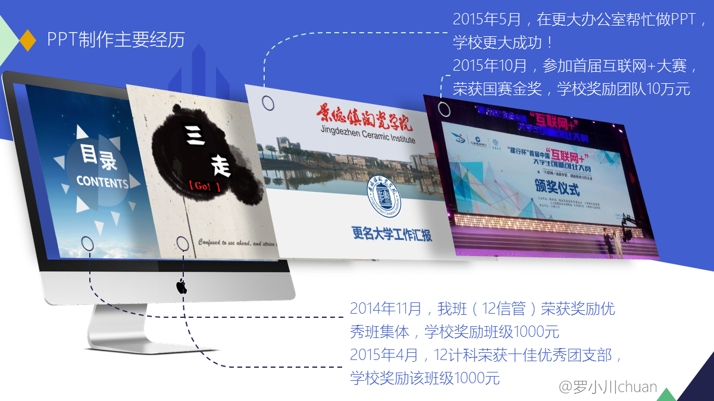
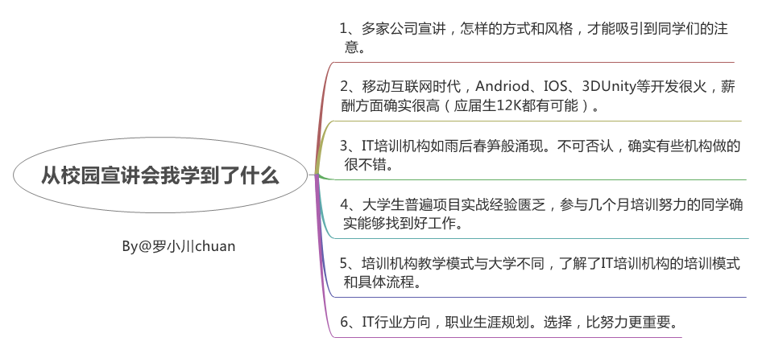

# 我是如何踏上前端这条路的

写于`2016-09-07 21:48:12`

>大家好，我是[若川](https://lxchuan12.gitee.io)。我倾力持续组织了一年[每周大家一起学习200行左右的源码共读活动](https://juejin.cn/post/7079706017579139102)，感兴趣的可以[点此扫码加我微信 `ruochuan02` 参与](https://juejin.cn/pin/7217386885793595453)。另外，想学源码，极力推荐关注我写的专栏[《学习源码整体架构系列》](https://juejin.cn/column/6960551178908205093)，目前是掘金关注人数（4.1k+人）第一的专栏，写有20余篇源码文章。

感觉最近**我是如何XXX的**这类标题挺火的。
杭州举办G20峰会，9月1日~7日，放假7天，带了本《ES6 标准入门》回家。在火车上看了几集《微微一笑很倾城》，让我回忆起大学生活。就想着下次返杭的时候可以在火车上，写篇文章记录下，自己的前端学习之路。

>**1、刚好可以对现在大四迷茫的学弟学妹们，有些指引**。 
**2、还可以借此回忆下大学生活**。 
**3、锻炼自己写长文的逻辑能力**。 

**当然，学习是座大山，人们沿着不同的路登山，分享着自己看到的风景，别人不一定看得到你看到的风景，体会得了你的心情。**

## 接触前端

2012年，那年大一，只记得上学期参加了四个社团，参加社团的各种活动，比较忙，另外自己收集一些电子书放到我那一点都不智能的手机上看。下学期，我所在的社团计算机协会（后文简称计协），当时教网页制作（嗯，那时不叫前端开发），当然我报名去参加了。比我们大一级的学长用着`Dreamweaver`软件 给我们教学，超链接，图片，音乐，视频，FLASH等。总之感觉很有趣。也要我们做出一些作品，交作业。但那时我并没有电脑。所以就没做。

## 江西省网页制作与设计技能大赛

大二任职计协会长，举办各类活动。也没怎么学习前端开发之类的知识。学习方面好像也就是平时上上课而已，再就是学习电脑方面的技巧，帮助别人解决电脑问题，为此也写了挺多这类技术文章。比如：[《【教程】Ｕ盘、硬盘安装原版win7、8.1、10系统》](http://user.qzone.qq.com/1019963719/blog/1437915015)，[《近期上网拨号客户端出现拨号异常、711错误解决方案》](http://user.qzone.qq.com/1019963719/blog/1414836306)。**在大学，懂点电脑，会装几个软件，重装个系统，在别人眼中就会被看做是大神，并且很受欢迎**。后来实在忙，就写了篇文章：[《对不起，我不能帮你修电脑了》](http://user.qzone.qq.com/1019963719/blog/1413177913)。

转眼间，就到了2014年4月（大二下学期），我所在的信息学院，组织参加省级网页大赛，同时派老师给予培训指导。这时，老师N每周四（或五）给我们上了几周课，主要讲HTML和CSS，还给我们他录制的视频，当时觉得老师好厉害。

后来让我们出作品，我们就找设计（陶美）学院的学生给我们设计网页视觉稿。虽然她们学的是设计，但也不是很懂网页设计这块。于是我就自己参照一个视觉比较好的网站，自己仿照着写了一个。当时还是比较忙，只有晚上有时间，所以总共八个页面，好像写了将近10天。主要用了HTML，CSS，js，jQuery。现在放在github上，点击可以访问，[时尚影楼](http://ruochuan12.github.io/Fashion-Studio/)，那时并不是很懂js和jQuery。后来比赛结果出来了，竟然是省级一等奖。其实一等奖有挺多的。这次网页赛，我们学校获得了很多奖项。大二末，图书馆一老师找到我们，想让我们暑假回去学点PHP，开学好让我们上手，帮他做项目。

我们信息学院邀请了10级计科的H学长，给我们这些迷茫的学弟学妹开了一次经验分享会，说到腾讯招人的标准。因为他就是课题组研发部的一员。说到课题组研发部的各种好处，跟着里面的老师L学习PHP，学到60％就够找好工作了。总之意思就是要进课题组学习。

大二暑假，家里没网，我就在学校，下载好各种PHP学习资源，暑假就在家看着PHP相关的视频等，一套PHP视频也是100多集，基本看完了，也写了些代码。当时也学了javascript，一套JS视频100多集没有看完。其实到后来基本都忘了。另外，大二暑假，线上面试了乔布简历，通过成为了乔布简历校园大使。

## 加入课题组研发部

大三上学期，卸任了计协会长，本以为这是大学最后一个职务，谁知这只是第一个。同学A，同学B跟着图书馆老师做PHP的项目。而我此时看着没啥事，就玩起了PPT，新媒体运营，又相继任职了**校园网络中心团队的队长**（关于这个我也写了篇文章[《谈一谈校园网管这一工作》](http://user.qzone.qq.com/1019963719/blog/1439715599)，一直任职到大四上学期）。**校友总会志愿团常务团长**（后来由于组织性质缘故，2014年11月，不到两个月就默认退出了），**乔布简历江西省副主管**，那时班上竞选班干，班主任说我们计协会长卸任了怎么不竞选一个职务。我说不用了，我并没有说还有这么多职务。上学期刚开始不久，我们专业老师也邀请了11级的学长学姐分享他们的一些经验。后来我们成立了信管学习小组，规定时间来主教自习。主要是为了学习网站开发。但后来效果不佳，我也较忙，就散了。

PPT水平在涨进，主要体现在我做的优秀班集体评选PPT上，传说就是凭借这次展示，让学校领导记住了做PPT还有这么好的人，后来（2015年5月13日）就被找去做更名大学工作汇报PPT，再后来就有了这张图 PPT制作主要经历:

也写了一些关于PPT制作的文章，比如：[《要做PPT，一直找不到资源？》](http://www.jianshu.com/p/065989d7783a)。开发水平并没有多少涨进。

大三下学期，我和同学A，B一起加入了课题组学习，做任务。5月19日，成立了[移动互联协会](http://mia.pasp.cn/)，又任职**移动互联协会首届会长**，一直任职到大四上学期。成立这社团，主要目的就是为了培养开发，后来给学弟学妹们培训HTML，CSS，和PPT，PS等，感觉他们真幸福。现在回想起来，在课题组，老师好像真的没给我什么实质性的开发任务。好像就让我做些与开发不那么相关的事情。可能是我个人原因。

4月，九家培训机构到我们信息学院做宣讲，他们的目的很明显，就是招人去培训。下午跟千锋教育的老师聊了挺久，主要是了解了他们机构是如何授课等。当然，他们极力希望我能去他们的好程序员班，但我肯定不会考虑培训。当时听完，晚上总结了一张图：

到学期末（6月），让我和同学A一起做[设计学院网站](http://sjysxy.jci.edu.cn/)（给了设计稿），用迅时CMS搭建网站后台（`Asp.net`）。主要是我做。那时相当于隔了一年多，要重新捡起HTML，CSS，JS。连引入的jQuery和自己写的JS顺序都能弄反，连jQuery的选项卡都写不来。熬了几次夜，在同学A和老师的指导下。终于完成了。这时，我开始感受到，就业压力，我究竟要往哪条路走。是**新媒体运营（PPT）**，或者是**PHP开发**，还是**前端开发**？
如果走新媒体运营（PPT），那么要开个微信公众号，写PPT相关文章，PPT演界网卖模板，等等。

## 真正意义上开始学前端开发

大三暑假，课题组业务需求，我和同学A，B，都留在课题组做任务学习。前期我还在学PHP，后来室友L，在杭州暑假实习，他说前端也比较火。刚好又在网易云课堂，看到网易推出前端微专业第二期。价格一千多。虽然对于在更名大学办公室做PPT和做网络中心团队队长赚了少许钱的我来说，不是很贵，但上学期报名了驾照（3K+），所以就买不起了。但那时我就确定了方向，前端开发，因为入门相对容易，并且所见即所得，喜欢视觉交互，和之前玩PPT是同样注重视觉交互和逻辑。

另外在PHP方面根本没做什么项目。要走前端，原生JavaScript必学！于是在知乎上看到说智能社的JS视频[《精通JavaScript开发》](http://study.163.com/course/courseMain.htm?courseId=224014)，这套课程不错。那时就没多想，先看完这套课程再学其他的。**很多时候，你想学的太多，都在同时学，往往效果不好，而是先学什么再学什么**。记得那时，晚上9点断网，他们在打牌，我回去后在看下载好的视频。学完这条课程后，感觉有些提升，至少熟练了下写代码。
学完这套后，就在慕课网学习其他前端相关知识。

8月，课题组组建了一支团队，参加互联网+大赛，当时学校比较重视这次比赛，召集参赛者在学校机房培训，解决吃住问题（在教工食堂吃了10多天），我一不小心又成了**临时班长**，协助就业处的老师处理相关事务。我还负责团队赛项目计划书的撰写和PPT制作。

后来我们团队（指尖上的陶艺项目）依次进入校赛，省赛，国赛，最后10月份到吉林大学（吉林长春）参赛国赛，获得国赛金奖（前30）和最佳创意奖，载誉归来之时，学校领导在校门口接我们，学校党委书记说奖励我们团队10万元。刚开始以为不会分到没多少钱。后来就有钱买课程了。双十一期间，就买了网易云课堂的前端开发微专业第三期，系统的学习前端开发。另外还买了妙味课堂的视频课程学习。**有人说，你要学知识，把市面上这类书都买下来，看懂并消化。那你肯定就有提升了。**

11月，老师N让我做[学工处](http://xgc.jci.edu.cn/)的网站，同样是Asp.net的后台。这次就没做多久，也没做设计学院网站那么痛苦。
12月，开始做毕业设计，是用php+mySql做第二课堂管理系统。1月5日，提前答辩通过。

## 大四寒假

开发水平自我感觉很差的我，当然是不忘抓住这段时间，提升自己的。看妙味课堂的视频。学着前端微专业，看课程，查资料，讨论区讨论，做作业，改作业。提交作业有截止日期。感觉这段时间挺充实的。

也在考虑大四下学期是否去学校，校内实习，还是去公司实习。N sir 是推荐我去公司实习，能学挺多。 
虽然11月份参加了学校的招聘会，有公司问我用过Bootstrap吗，我说没有。后来有几家公司，叫我去实习，我没去。主要是以下考虑：

>**1、公司前端团队好，实习则好。不好，不如自学**。 
**2、自己不足还有很多，希望能继续学完前端开发微专业，获得优秀学员，也许能进好一点的公司**。 
**3、毕竟不考研，以后有的是工作时间，还不如继续享受下最后一学期的校园生活**。

## 大四最后一个学期

开学伊始，我和同学A，B都没去公司实习，重新来到了课题组。刚去不久，老师N就推荐我去南昌，算是实习，说有搞PHP的愿意带一个人一起做项目。后来委婉的拒绝了。因为已经不想走PHP开发路线，想走前端开发路线。但本学期，老师交给我的任务依旧是PHP开发的。第二课堂管理系统（PHP+MySql，CI框架）。因为不是很赶，我就前端微专业，百度前端技术学院任务，（妙味课堂的vip视频）三线并行。4月初，完成了[前端微专业大作业](http://ruochuan12.github.io/Netease-Web/)，获得优秀学员证书。

在学校，上班是996（早上9点上班，晚上9点下班，中午休息1-2小时）。周日老师不在办公室，而我一般在（同学A，B不在）。因为我太Low了，所以只好多花点时间学习。有段时间，都是24点前提交完代码，才去刷牙洗脸睡觉。晚上躺着睡前还在**牛客网**刷题，或者看视频，或者看前端开发类电子书。

## 面试，入职杭州一家移动互联网公司

4月底投简历，5月劳动节一过，我和同学A就来杭州面试。我求职还算顺利，面试了3天，共9家。有的给了offer，就选了一家我认为比较合适的。6月1日入职杭州一家阿里高管出来创业的移动互联网公司，公司和阿里一样使用花名，我自己挑选了一个，叫**轩辕**。于是把网上各种昵称，改成了**轩辕Rowboat**。
>**轩辕Rowboat**由来：轩辕(公司花名)。Rowboat，英文名，拆解：Row(音：罗)boat(意：小船(音：小川))。其实还挺喜欢这花名的，轩辕（剑），剑未佩妥，出门便是江湖。

>再后来（2019年1月初）改为**若川**(被占用则是**若川i**)。

>公司使用的技术主要有：HTML5，模板语言（velocity，thymeleaf，handlebarsjs，underscorejs，lodash工具库等），CSS3，Less，Sass，JS，jQuery，zeptojs，bootstrap，angularjs，vuejs，git，gulp，webpack，ES6等（React，nodejs暂时没用到）。

不知不觉就写了挺多字，感觉一路走来，在网易云课堂购买了付费课程（office，前端微专业等）两千左右（已赚回）。 
**当没有时间，有钱时，可以选择付费学习，投资学习，回报很大**。 
**技术提升需要一定的过程，脚踏实地走好每一步，先定好一个个小目标，然后去一一实现**。 
**看过很多前端大神成长路线，也是从刚开始啥都不会，一步一步变成前端大神的。** 

<footerBlog></footerBlog>
