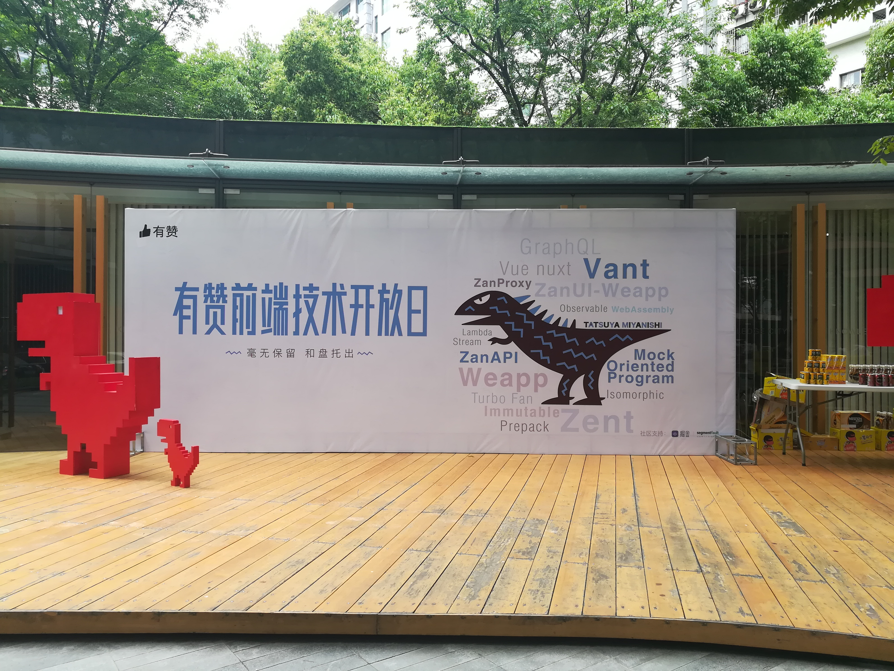
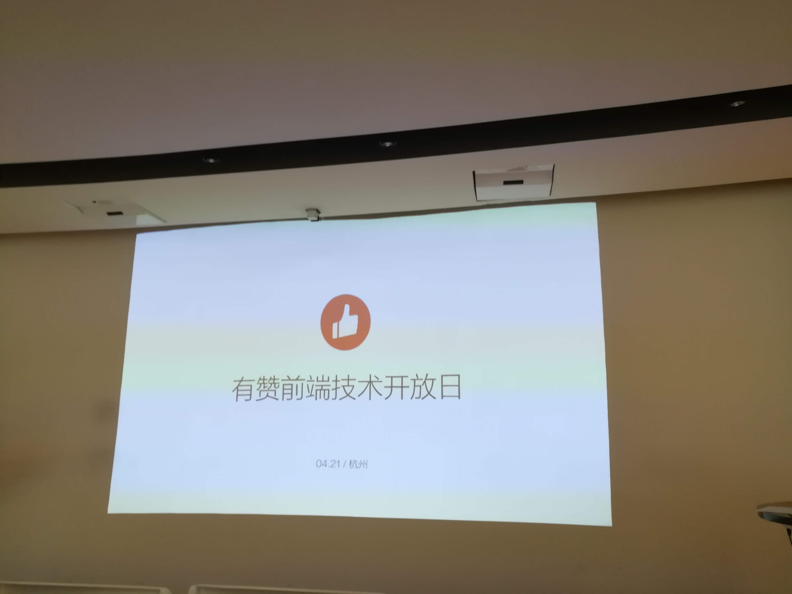
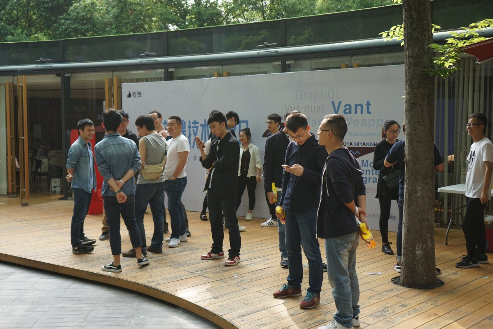
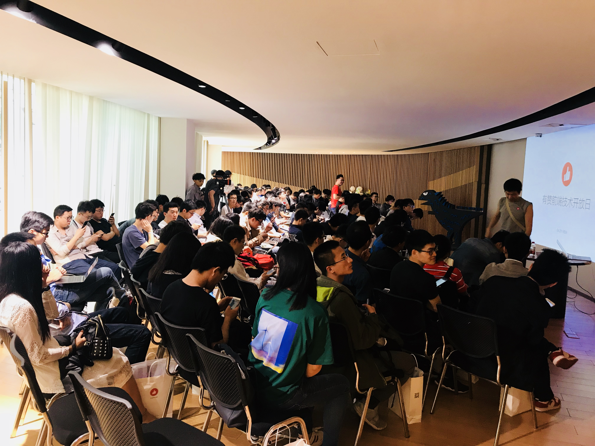

# 参加有赞前端技术开放日所感所想

>`写于2018-04-21 20:08:26`

从2016年毕业在杭州工作以来，就比较热衷于参与杭州各类线下技术分享类活动。
之前参加过网易云课堂学习节、拉勾网理想之上、[coding.net](https://coding.net/) 技术小馆、阿里`D2`两次、阿里`work like alibaba`沙龙、`freeCodeCamp`线下分享等...自己也参与到**`freeCodeCamp`(简称`FCC`)**，[点击访问freeCodeCamp](https://freecodecamp.cn/)，**杭州线下分享活动的组织中**。

### 为什么这么热衷于参加这类活动呢？

可能拿之前D2填写的参会理由可以很好的解答这个问题。

**D2报名填写的参会理由:**
>
>1、了解讲师碰到的问题，有哪些解决方案，是如何解决的，学习他们的解决思路和方案。

>2、了解现在前端技术发展情况和未来发展趋势，把握学习方向。

>3、结交前端圈内朋友，让自己融入到更积极的技术氛围，促进自己的技术提升。

### 为啥之前都没写文章总结下，而这次有赞前端技术开放日想总结下呢？

刚好看到知乎上有这个帖子。[参加有赞前端技术开放日是种怎样的体验？](https://www.zhihu.com/question/274150609)

因为之前都是免费的活动。好像也没什么可写的。觉得发条朋友圈简明扼要的总结下即可。这次有赞的活动是收费的，都这么多人参加，直播观看量3w人次（最高时），而且有其他城市的人过来。比如：罗辑思维（北京），简书（上海）。**可见前端圈的小伙伴对参与这类活动也是十分活跃的，同时说明了有赞宣传的比较好。**所以，觉得有必要写一下。技术方面不多写，可以回看PPT，或视频。

可以看下官方微信公众号发布的活动总结文章，里面有PPT，视频回放等。
[有赞技术活动首秀——有赞前端技术开放日圆满结束](https://mp.weixin.qq.com/s/9FIESH8rGaV0JPR1lMgUTQ)
主题主要有：
>
>1、主题一：有赞开源项目最佳实践

>2、主题二：本地调试线上代码——[已开源，点击访问`ZanProxy`](https://github.com/youzan/zan-proxy)

>3、主题三：让前后端协作更高效——`ZanAPI`

>4、主题四：`Node` 在有赞的实践

>5、主题五：有赞内部代码管理工具串讲

为什么会有这么多产出，主要有三点：
>1、业务逼的

>2、工程师文化

>3、注重技术基础

感觉就是有赞前端技术团队，碰到什么问题，奔着高效工作的目的，提出解决方案，团队内部适用、推广，最后把做得比较好的项目开源。
总之有赞前端技术团队靠谱、有追求。值得加入。

我是12点多到达场地。这时人还不多。拍了两张照。

### 回顾一下整场活动，主要有六点：

**1、人脉圈子**

有赞前端技术负责人施德来（下文简称**德来**）分享的缘起，说杭州兑吧公司想去有赞参观参观，交流交流。于是干脆办一个技术开放日。然后邀请了杭州一些公司来参与。比如点我达、丁香园、兑吧等。
说明杭州各个公司的前端负责人的有技术圈子，都相互认识熟悉，而且比较注重交流。
有人脉圈子，对于程序员来说，很重要。

**2、正向反馈**

虽然有赞搞了很多成功的项目，但也有失败的项目。
所有的失败项目，总结起来，就一条：没有准确估计投入产出比。
就是说没有正向反馈，就最后不了了之了。平时自己学习也是如此，如果没能看到正反馈，很难坚持下去。

**3、演讲能力**

德来宣称他们内部演讲已经练习过几次了。
程序员可能比较欠缺演讲能力，毕竟很少机会上台面对上百人演讲，分享技术。

**4、救场解围**

Q/A问答环节，可能有些问题讲师解答不是很清晰，或者说提问者不停追问，就容易导致僵持下去，现场尴尬，时间不可控等。
于是好几次都是德来来解答提问者的问题。

**5、技术（开源）项目本质上是：理念、套路、规范的工具化。**

这句话是德来说的，印象比较深刻。
比如开源的项目[点击访问`felint`](https://github.com/youzan/felint)就是一个集成了 `eslint`、`stylelint`、`git hook` 的前端代码检查工具。
规范定好，提交代码时强制校验，或者说**随你怎么写，代码都一样**，最后提交会验证一遍。
我司用的就是`githooks` `git commit` 时校验代码规范性。

**6、参与到开源项目**

有余力的情况下，可以参与到开源项目，也是对自己的一种提升。

最后放两张照片

## 关于

作者：常以**若川**为名混迹于江湖。前端路上 | PPT爱好者 | 所知甚少，唯善学。 
[个人博客](https://lxchuan12.github.io/) 
[掘金专栏](https://juejin.im/user/57974dc55bbb500063f522fd/posts)，欢迎关注~ 
[`segmentfault`前端视野专栏](https://segmentfault.com/blog/lxchuan12)，开通了**前端视野**专栏，欢迎关注~ 
[知乎前端视野专栏](https://zhuanlan.zhihu.com/lxchuan12)，开通了**前端视野**专栏，欢迎关注~ 
[github blog](https://github.com/lxchuan12/blog)，相关源码和资源都放在这里，求个`star`^_^~

## 微信公众号  若川视野

可能比较有趣的微信公众号，长按扫码关注。也可以加微信 `ruochuan12`，注明来源，拉您进【前端视野交流群】。

