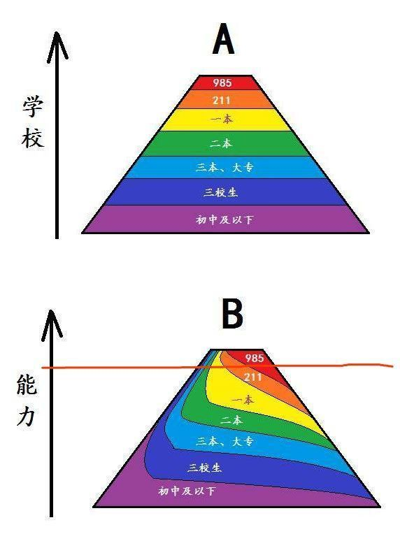
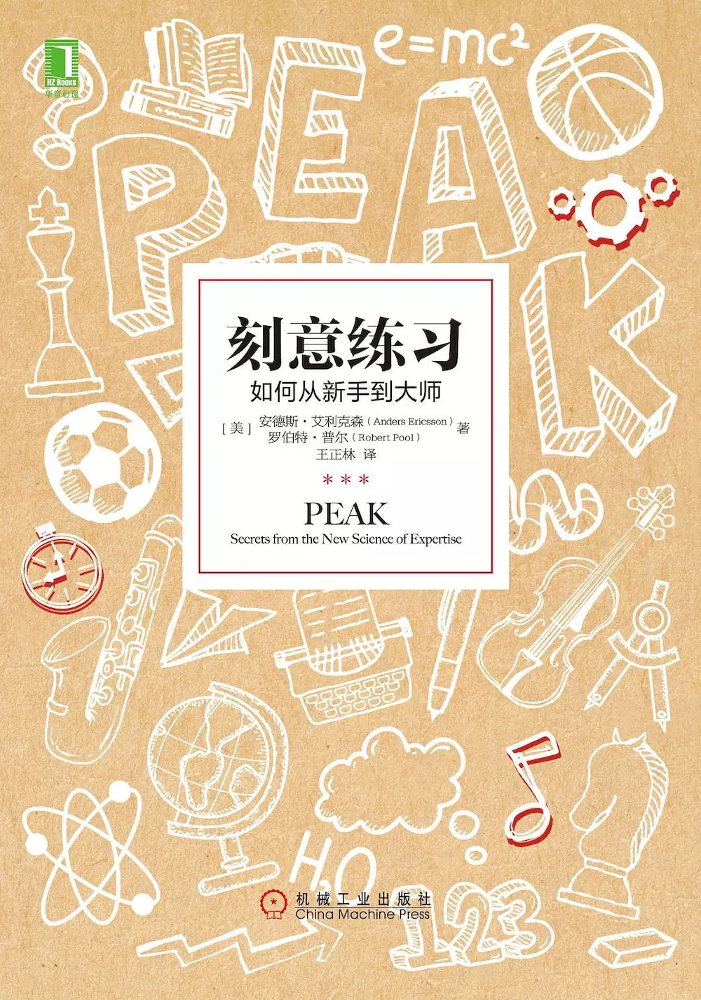

# 高考七年后、工作三年后的感悟

写于`2019-06-12 23:44:27`

>这是一篇写在我的微信公众号【若川视野】的文章，现在同步发布在博客。 [高考七年后、工作三年后的感悟](https://mp.weixin.qq.com/s?__biz=MzA5MjQwMzQyNw==&mid=2650744481&idx=1&sn=8a9599fe22d7b89afd65d1e72763be34&chksm=8866252dbf11ac3b6e39848004dc58950a96140be9ac83158a4c2e166d0ef41b6d0febe94507&token=666904113&lang=zh_CN#rd)

以下是正文：

>本打算端午假期发表这文章，后来因为文章还需要有些调整，工作日又比较忙，就到今天周三才发。随便写了近3000字，文章最后有免费送书活动，欢迎留言参与。

又一年高考结束了。**转眼高考过去七年了，工作了三年。很多认识的同届的朋友同学研究生也毕业了，在大学认识的最后一批学弟学妹也毕业了。算是一个阶段结束了。**

## 高考很大程度决定人生轨迹

七年前（2012年）坐在自己家乡的小县城考场里，写着语文试卷。前面花的时间比较多，留下写作文的时间不太多，有些紧张。后来考数学时，也时不时有想着语文可能没考好。现在想想那时有着40多分钟就能写出不少于800字的作文，放在现在这能力有所退化。

高考出分数后，自己研究和分析买的报考指南书籍。选择了一些专业和学校，凭着对这些专业和学校的简单认知，最后在网吧里报考了几所学校和专业。最后录取到了**信息管理与信息系统**这个专业。

那个暑假，想想自己好像从来都没有离开过所在的小县城，对大学是怎么样的，是不清楚的。所以对即将到来的大学生活特别憧憬。
就好比在大三即将毕业时，对社会和职场也可以说是所知甚少。

2015年6月3日，课题组老师请我们同学三人和一位当时在深圳实习回校的同专业的大四学长，去他家吃饭。就跟学长闲聊了一些工作类的话题，大概意思就是压力还是挺大的，深圳租房也要一千多，房间还不大等等。
（因为2013年大一参加过学校的招聘会，看到开发类应届生薪资5、6K，当时觉得还不错。）当听到租房就要一千多，顿时感觉对社会和职场知道的太少了。但在那个暑假确定了未来工作的方向。之前写过一篇文章：[我是如何踏上前端这条路的](https://www.jianshu.com/p/e5a0f3673ecc)

那时我们几个人觉得，可能大学班上没有几个人会从事本专业相关的工作。但事实上毕业后还是有一大部分人选择了IT互联网行业。因为毕竟真的没有太多选择。我知道的很多名校毕业生也从其他行业转入互联网行业。

**回过头来看，高考其实挺重要的。至少决定了未来四年在哪个城市跟哪些人一起学习，很大程度决定工作的方向。虽然很多人毕业多年后，不一定会从事自己所学专业相关的工作。**

小时候也或多或少听到过一些读书无用论的话语。但工作三年后，发现行业知名大佬、公司领导等多数出自一流大学。一流大学毕业生大概率进入一线公司。那么一般大学的毕业生有没有机会进入一线公司，也是有的，毕竟有一部分人虽然在一般大学，但努力程度和能力会超越大部分人。
**放在没有互联网的时代，可能获取知识真的很难。而现在互联网时代不缺好课程好资料，可以很大程度上帮助到一部分人学习和成长。**
有张图可能可以很好的表达这一情况。

## 考研
现在再看考研，考研是提升眼界和视野比较好的方式之一，研究生还有一定的留在高校工作的机会，而本科生没有。双非院校，即使是计算机类专业，能考研尽量考研。2017年时和来杭州出差的大学老师聊天。作为复旦大学的博士老师建议，如果觉得写代码遇到了成长瓶颈，不妨再考个研，读个好学校，比如复旦交大等。这样毕业出来平台就不一样了。(当时想着，果然是复旦大学，随口说出来就是复旦交大之类的院校，毕竟是很难考上的。)

## 归零

从小学到大学，大学到工作。
每一次都是一次归零，一次重新开始。
有人说：毕业前觉得自己有无限可能，毕业后回到了现实社会。
投身IT技术岗，要早做打算。常言道：机会总是留给有准备的人。
问过一些学习成绩比较好的学弟学妹，他们都感慨没有学好专业课。主要还是实践不多。导致跟企业要求相差比较多。**但以往各方面就表现不错的人，往往能够快速适应新环境，同样做到表现不错。**

## 看着微信朋友圈，往往容易陷入羡慕别人的怪圈

这时候想起一个词语叫做**幸存偏误**。
这时参看百度百科：指的是只能看到经过某种筛选而产生的结果，而没有意识到筛选的过程，因此忽略了被筛选掉的关键信息。
朋友圈动态也是大家筛选过才发出来的，一般来说朋友圈都是发好的一面，正能量的。
以致于很多人都羡慕别人，就可能会觉得自己混的最差。我也会羡慕我的一些985、211高中同学和关系比较好读研究生的同学。
正所谓：城外的人想进城，城里的人想出去。**但有些事情只有自己亲身体会，才会更加深刻。**纸上得来终觉浅，绝知此事要躬行。
有段时间，各种文章分析拼多多号称的三亿用户从何而来。有人就说大学本科生仅有中国人口的4%。虽然大城市的人虽然很少用拼多多，但我们并不全面的了解中国。
>**我们都知道中国有960平方公里的土地，但我们对她有多少城市，县，镇，村并没有完整的概念。
有统计表明，中国约有300个“城市”，2856个“县”，41658个“乡镇”，662238个“村”。**

而我就是来自60多万“村”的一员。

## 人脉圈子

**工作后，人脉圈变窄。这估计是很多职场人共识之一。**
工作所在城市即使有同学朋友，一年聚的次数最多也就1、2次。有距离的原因也有时间的原因。
从小学到大学毕业，听别人说一旦毕业班上同学再也聚不齐了。像是危言耸听。但到现在为止，好像真是这样，全班人没聚齐过。大学算是认识挺多人，但各奔东西，相忘于江湖，是我们共同的结局。
圈子窄主要原因大多数职场人，打交道的人只是所在公司团队的人，认识的都是圈内的人。
人脉圈子有时候很有作用，这就需要平时有些积累。

## 职场的困惑

职场的困惑往往是因为自身能力不足。想着改变，又无力改变。
想起一次一群人聊天，问到大家的理想是什么，基本都回答没什么理想，我也是如此。很多人对自己未来规划和职业规划都是不明确的，或者说根本不是很了解自己。导致当下想改变，又不知道怎么改变，陷入恶性循环之中。
**求变之前需要认识自己，问清自己想要什么，想做成什么样的人。**为了目标，自己能做到哪一步，有了一个大目标，制定确实可行的方案，根据自己执行情况，不断修正方案，不断得到正反馈，这种感觉很好。有那么一句话叫做不逼下自己，都不知道自己可以有多优秀。
培养自己良好的习惯，不断的了解自己，定目标，刻意练习，得到正反馈，良性循环，提升自身的各方面的能力。

## 未来还面临着很多选择

过去的20多年，有很多选择，选择大学和专业，选择考研与否，选择城市和行业，选择公司。未来还有很多选择。有时想到未来就会很焦虑，有种需要和时间赛跑的感觉。
经常被朋友和同事问到，会一直在杭州待下去吗？此类问题我一般是这么回答，只能说最近几年会一直在杭州。随着大学毕业时间越长，越来越多可能影响一生的问题需要考虑。

## 最后福利时间

只要您在**若川视野**微信公众号下留言，说出定目标最后怎么达成的故事或者为什么想看《刻意练习》这本书。截止到6月16日21点（本周日），我在留言区挑选5位觉得不错的留言，联系这5位同学，免费包邮送出《刻意练习》这本书，无需转发，无需集赞。

最后附上毕业三年每年的年度总结文章和工作一年的感悟文章。
[2016年度总结，毕业，工作](https://www.jianshu.com/p/cea7ecd71f14)
[工作一年后，我有些感悟](https://www.jianshu.com/p/0b29cc65dc82)
[2017年度总结，一如既往](https://www.jianshu.com/p/71b5730dc606)
[2018年度总结，平淡无奇](https://www.jianshu.com/p/a9c7aae40e64)

文章同时发布在简书（方便后续修改），[高考七年后、工作三年后的感悟](https://www.jianshu.com/p/edf9d76596d2)。
