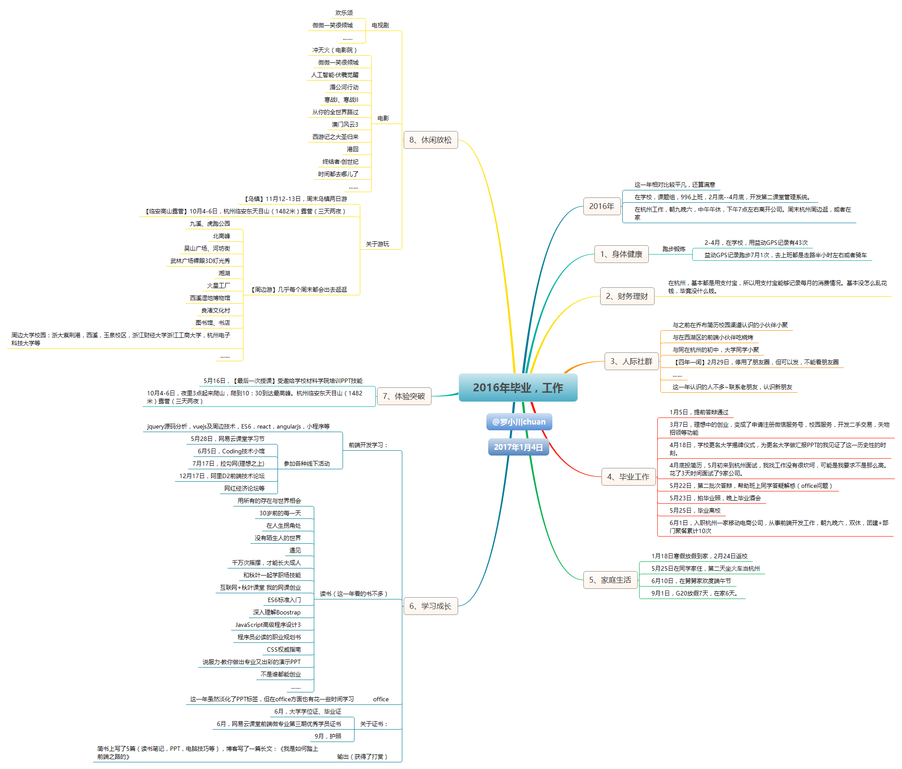

# 2016年度总结，毕业，工作

>写于`2017-01-07 21:40:38`

>大家好，我是[若川](https://lxchuan12.gitee.io)。我倾力持续组织了一年[每周大家一起学习200行左右的源码共读活动](https://juejin.cn/post/7079706017579139102)，感兴趣的可以[点此扫码加我微信 `ruochuan02` 参与](https://juejin.cn/pin/7217386885793595453)。另外，想学源码，极力推荐关注我写的专栏[《学习源码整体架构系列》](https://juejin.cn/column/6960551178908205093)，目前是掘金关注人数（4.1k+人）第一的专栏，写有20余篇源码文章。

>1月4日的时候就写好了这篇文章，发年度总结说说的同时，在想是否有必要在空间发这篇日志，因为是使用markdown写的，排版是个问题，可以发表在简书啊（但是又包含很多个人信息）,后来觉得就没发。现在想想好像基本都是用手机看的，排版并不是那么重要，还是发出来吧，可能对读者有些启发。

时间总是那么的快。2014年开始，就有了写个人年度总结的习惯。如果把2015年定义成**PPT年**，那么2016年则可以说是**开发年**。这一年相对比较平凡，还算满意。

2015年的年底，准备好了提前答辩的相关事宜。2016年元旦放假三天，在学校的课题组办公室翻看着微博（微博有时间轴，可以看到每个月都发了什么，这也就是为什么我比较喜欢发微博的原因之一），做着PPT，用思维导图工具Xmind，写着年度总结——[《2015年总结，淡化旧标签，无惧未来 》](http://user.qzone.qq.com/1019963719/blog/1451822274)。

翻看2016年的微博，看到大年初三的一条这样写着：
>猴年初三（2月10日），去舅舅家拜年。舅舅极力要求我在他家住，说以后工作了，忙着赚钱，更是没什么时间住了。舅妈以为我还是21岁……然而过完年，虚岁就是24岁了，其实明明是22岁半。好吧，确实老了。到了尴尬的年纪。按这样算，还有6年就30岁了……这六年要赚好多钱。

最近听喜马拉雅付费精品中关于年度计划的，提到人生的8个方面,分别是身体健康、财务理财、人际社群、工作事业、家庭生活、学习成长、体验突破、休闲放松。于是根据这个把自己的2016年总结整理了一张思维导图和仿支付宝年账单做了一份年度总结PPT。

## 未来的路在哪

1、看周围同事，基本就能看到自己几年后是过着怎样的生活。试想这样的生活是不是自己想要的，如果不是又将做什么来改变呢。老板有时给我们开会也会问：一个员工加入一家公司终究会离开，你是否会认真考虑【我会在这里干多少年？想成为什么样的人】。

2、再看看自己的校友，在移动互联网领域比较出名的有杜瑶，CSS参考手册作者（css.doyoe.com），去哪儿网前端技术总监。猎豹移动副总裁陈勇。柴魁元,乐动卓越科技有限公司CTO等等。

3、如果仅从开发这条路来看，很容易看到自己的天花板。而且业界都一致认为，程序员是吃青春饭，看自己身边同事就知道年长的非常少。G20放假那次回家，跟老爸聊天，老爸聊到年轻的时候赚点钱容易，年纪大了就不容易了。何况你这工作吃的是青春饭，以后怎么办。我说：到时候再看，转行吧。比如这篇文章：[一位工作十年程序员给的忠告](http://blog.csdn.net/harderxin/article/details/39210779)

## 打造个人品牌（知识型IP）

《程序员必读的职业规划书》有提到打造个人品牌；公司年中大会上，我司创始人（前阿里副总裁）也谈到IP；参加的网红经济论坛上更是对网红（IP）有一些深层次的解读；《和秋叶一起学职场技能》书中也有提到如何打造个人品牌。
虽然，以前的积累，微博粉丝超过了1千，微信好友快1000，两个QQ的好友基本不重复，超过1400，但这些都是最低层次的无门槛自媒体。

我这名字，在我关注的圈子中，知道比较有名的大咖有小川叔。
在公司叫花名（轩辕），于是把我在网络上的各种账号的昵称统一成**轩辕Rowboat**，再后来（2019年1月初）改为**若川**(被占用则是**若川i**)。也算是打造个人品牌的开始吧。

2016年，这一年出现了很多**知识变现**的产品，比如：微信公众号打赏，简书打赏，知乎live，分答，在行，微博的问答，喜马拉雅付费精品等。

原是程序员的彭小六就凭借着知识变现这一红利月入6位数。比如：
[《凭着这3个字，我上个月挣了6位数》](http://www.jianshu.com/p/7d053c85c0bd)
也有程序员靠之前人气等多方面的积累，开一次知乎live，分享知识，就能赚1万+。
之前在公众号看到的文章，[《月入10W真的很难吗？》](http://mp.weixin.qq.com/s?__biz=MzAxNzEyODA2NQ==&mid=2650183908&idx=1&sn=8a1225cdef6acb0cf17eab426b3e899b&chksm=83e8770ab49ffe1cb25da7c55158f078e7ef2921ea46805bb82845fe88fec85e04232f6f6364&scene=0#rd)
清华大学毕业阿何的一篇文章：[《年轻人，如何挣到自己第一个100万？》](http://mp.weixin.qq.com/s?__biz=MzIwODM3MzU1NA==&mid=2247483996&idx=1&sn=e0cb929d9ae282f23c1147e81c81c3fc&chksm=97055001a072d9179d1bb5e1573269c4c4393ee8e347c74f88de08596ce0c2ac5fceb8163c35&scene=0#rd)
文尾总结：
>总结一下，对年轻人来说可操作性最强又能挣很多钱的方法，其实就三个步骤：

>第一：找到自己的一个特长，把它培养得足够出色

>第二：找到适合你的特长，又有足够用户注意的平台

>第三：在这个平台上深耕细作，打造品牌，获得收入

>每个人都有自己的特长，只要长时间持续打磨，总有一天能到“可以卖钱”的水平。

虽然这类文章有点夸大其词，鸡汤文的感觉，但也不无道理。总之这是赚钱思维的一种转变。

PPT圈内，布衣公子从2012年开始分享自己的PPT作品，他的作品影响着很多人。后来收费，一份作品就能卖到上万元。这是他分享他的故事时分享的五个故事。
[改变我命运的五个故事-布衣公子](http://mp.weixin.qq.com/s?__biz=MjM5MjQyODY1NA==&mid=2654123389&idx=1&sn=2ccfddafe2502ae5a63c1ce6059afa50&chksm=bd60727c8a17fb6a9e57e94be91decf921dc1778e0a38b32dadc8c5e8007fe6333895cd631b2&scene=0#rd)
要在大城市生活，培养一种或几种可以「变现」的能力，并且这些能力不受地域的限制，似乎变得重要起来。

## 时间也是资源

时间管理是永恒的话题，这篇文章写的挺好：[毕业三年，你如何与同龄人拉开差距？](http://weibo.com/ttarticle/p/show?id=2309404011377055416316)

## 世界发展太快，需要不断学习

世界在发展，以前的很多岗位都不存在了。而且未来很多工作可以由机器人来完成，而且机器人比人类做得更优秀。另外年轻人的接触新鲜事物的学习能力相对比较强。那么持续学习，变得更加的重要了。
