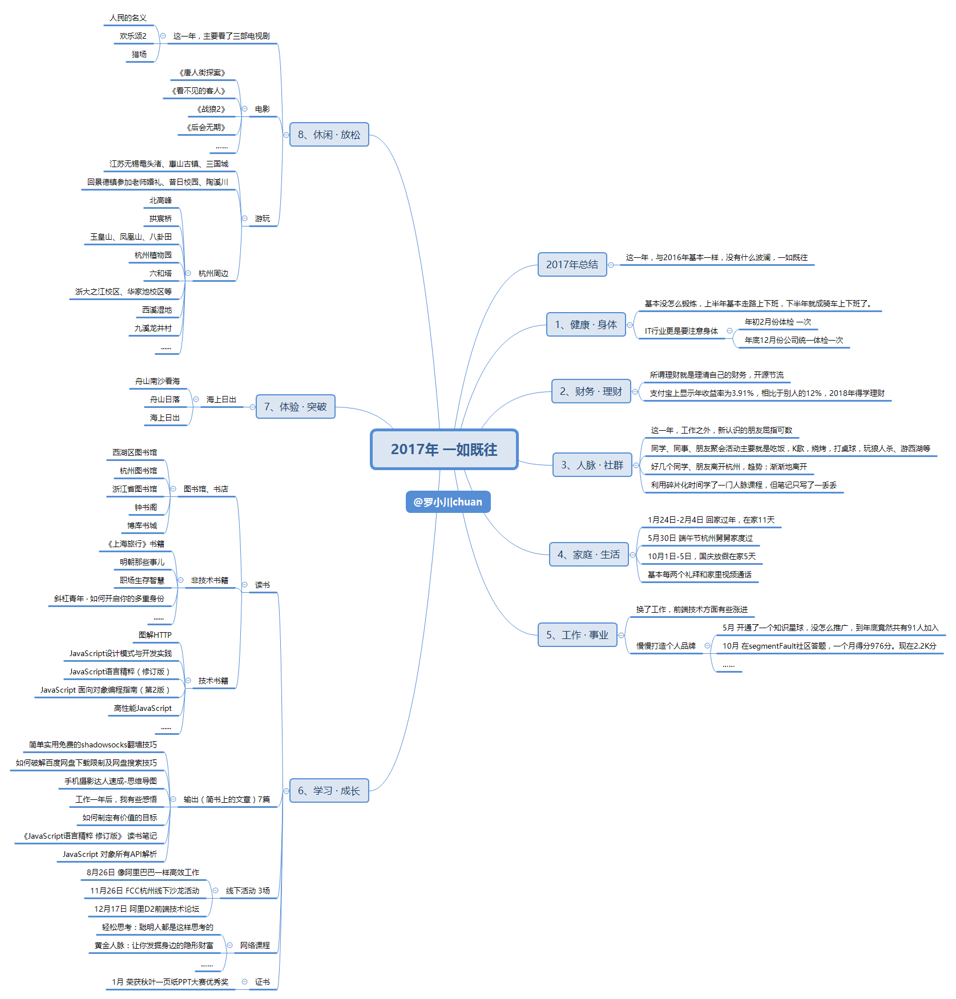
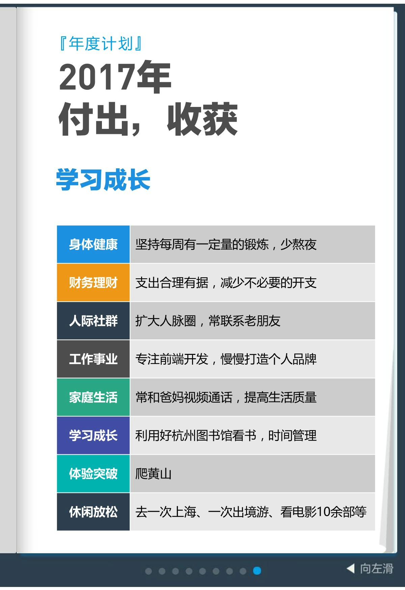
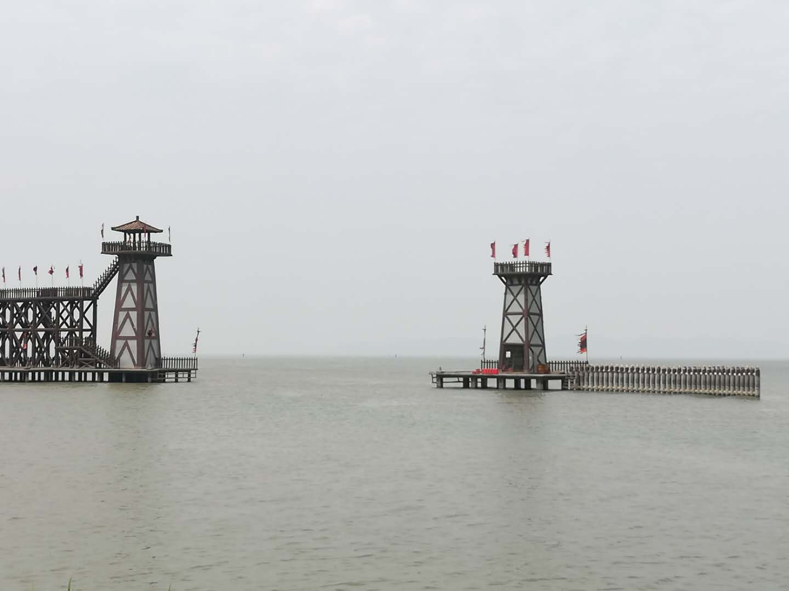
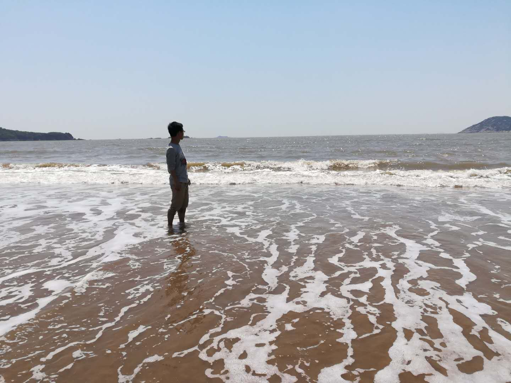

# 2017年度总结，一如既往

>写于`2018-01-05 23:56:52`

斗转星移，时光荏苒。2017年已经悄无声息的过去。2018年已经来临。本打算元旦完成这篇年度总结，但到现在才完整写完。

年度总结有一些好处：可以回忆起几年前的点点滴滴，也可以发现一年里做的事确实不多，对自己有一定的指导意义。

比如：回顾下这一年走过的路，拍过的照片，参加过的活动，认识的人，听过的歌，学过的课，写过的文章，读过的书。都是生活的点点滴滴...

翻看着电脑上【N-年度总结】文件夹中2014~2016年年度总结。一般文件夹中有一份PPT和一份思维导图。

新建了一个【2017年】的文件夹，翻看2017年微博整理出2017微博时间轴，继而整理出2017年的各个方面的思维导图。

再看看2017年年初的年度大体计划，付出、收获这样的词汇，似乎不太合适。2018年的年度计划不敢写了。

如果说2015年关键词是**PPT**，2016年说是**毕业、开发**，那么2017年依旧是**开发**。2017年和2016年基本一样，没什么波澜，一如既往。

## “丰富多彩的生活”

1月份，过年期间去舅舅家拜年，舅舅和姐夫都说我2016年工作后变了挺多，尤其酒量不错。大学室友说我工作后比较爱玩了，大学期间比较喜欢宅在寝室。其实我是那种宅也可以，游山玩水也可以的一类人。

12月份，和一朋友聊天，她说了一句：**看你朋友圈各方面蛮精彩的**。想起高中关系比较好的几个同学都在985、211读研，虽然他们表示比较羡慕我朋友圈发的"丰富多彩"的生活，但我也比较羡慕他们的。这也许就是人们常说的围城吧。城外的人想进城，城里的人想出城。

但事实上，我们总是习惯地去推测：看到一个人去图书馆，就推测TA博览群书。看到一个人发朋友圈在旅行，就推测TA经常在旅行。看到一个人去参加各种线下活动学习，就推测TA经常去参加这类活动。
于是将美好的别人与糟糕的自己对比，从而心生羡慕。但往往这种推测不准确。

## 身体健康

这一年，每天基本都是12点10分左右，有时睡得比较晚上班就容易打哈欠，同事开玩笑说是不是早起偷能量了。

基本也没怎么锻炼，（半小时左右）上半年基本走路上下班，下半年就成基本骑车上下班了。

年初体检了一次，年底体检了一次，虽无大碍，但还是要注意身体。体检时听到体检机构的工作人员讨论，别看现在的年轻人年轻，但他们经常很晚才睡，熬夜，不吃早餐等。是啊，年轻人更应该注意身体，尤其是IT行业的程序员。

## 慢慢打造“个人品牌”

这一年，换了工作，在前端开发上有所成长，偶尔会在segmentFault社区答题，主要是10月份，一个月声望值增长976分。月度排行榜排名第六。现在声望值2.2K。虽然比较少，但基本是今年才涨的。全年只在segmentFault社区、掘金发布了两篇文章。

5月份，开通了“前端视野”，知识星球（原“小密圈”），偶尔发一些前端开发相关的知识和感想，没怎么推广的情况下，没想到到年底有91人加入。

很多人努力学习知识，参加各种沙龙，向前辈学习，参加开源项目，把自己的心得无私的分享出来，慢慢的，他们踏上了不一样的平台，快速成长。

这样努力的人我朋友圈就有一位。毕业四年在北京，月薪早已超出同龄人的水平。但基本学习到2点左右睡，6:50起，午休睡一会，一般一天不少于6小时。还读着英文文档，玩转各种开发语言。想想我身边他这层次的人也没有这么拼啊，他解释道：个人追求也不同，追求也不一样。他都这样的努力确实让我敬佩不已。真是应了那句话：比你优秀的人不可怕，可怕的是比你优秀的人比你更努力。

## 旅行

这一年，清明假期和同学去了江苏无锡鼋头渚、惠山古镇、三国城等。
太湖四月天，无锡鼋头渚。登上赏樱楼，樱花似白雪。
惠山古镇，历史悠久，古迹众多，人文荟萃。宝界山林，远眺太湖。湖光山色，相映生辉。

五一假期去了浙江舟山。人生中的第一次看海，海上日出日落。

随便放了几张照片。
2017年初上写的旅行计划去黄山、上海、出境游通通没有实现，现实版的计划赶不上变化，是多么痛的领悟。

## 危机感

5月13日，和课题组的两位同学，一起回学校参加课题组老师的婚礼，老师说：“到时你们婚礼的时候派代表参加”。一次和毕业几年的表哥聊天，聊到年轻的时候最重要的两件事就是结婚和买房。同事也会问准备一直在杭州吗。感觉这类话题，不管和谁聊天都会聊到。我就感慨到：现如今，大学毕业生靠自己在杭州买房，真是难于上青天。

>到底有多难，我大概算了下。假如杭州郊区算3万一平，那么一套房算300万，首付30%则需90万。假如一年存款能有10万，那么也要攒9年。你可能会说工资会涨，但可以肯定没有房价涨得快...而且只是付完首付而已，就要9年。9年后又到了人们常说的中年危机，面对各方面的压力，那么以后的日子更加艰难。照这样想想都后怕。

但在大城市还是有一定机会的，虽然比较渺茫。

退一步回老家买房，但小县城房价均价据说都6K+了。而且感觉在老家买房，自己在外漂泊也不是办法啊。

写到这里，看到统计的字数是1818字，刚好2018年，很吉利。2017年度总结算是收尾了。
