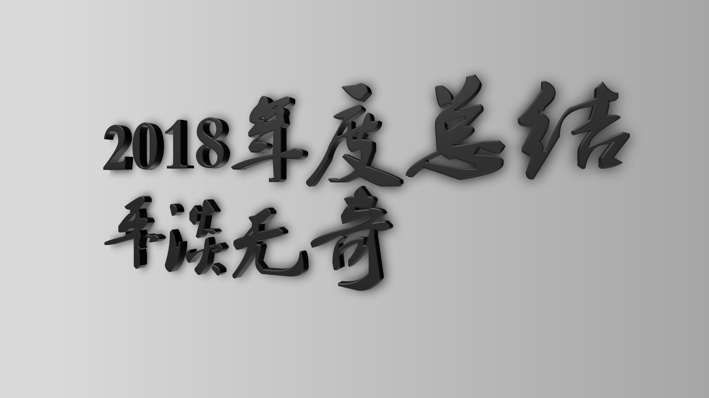
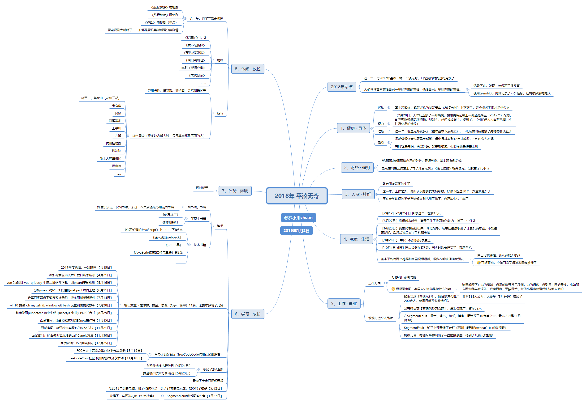
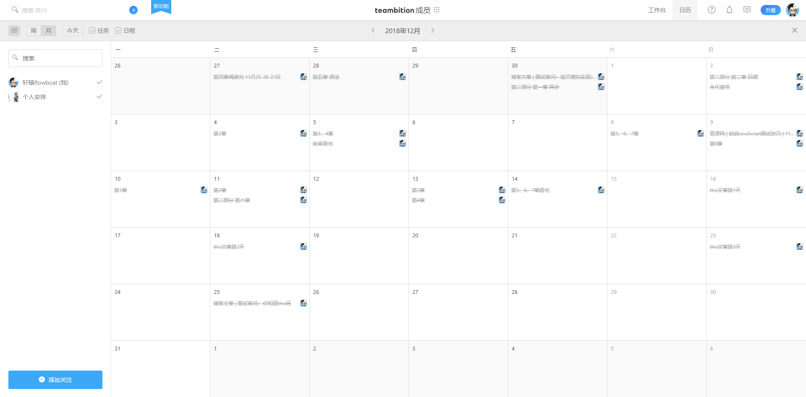
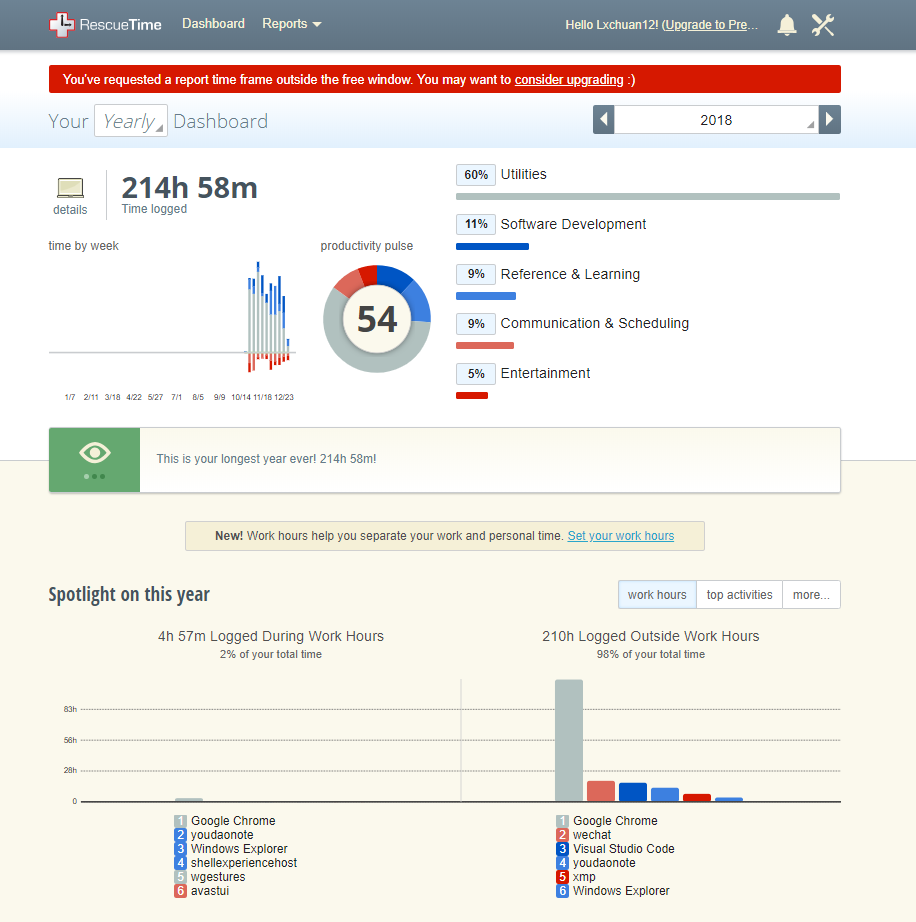
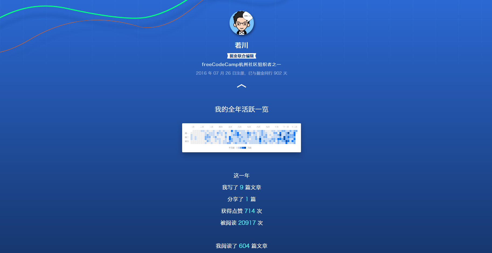
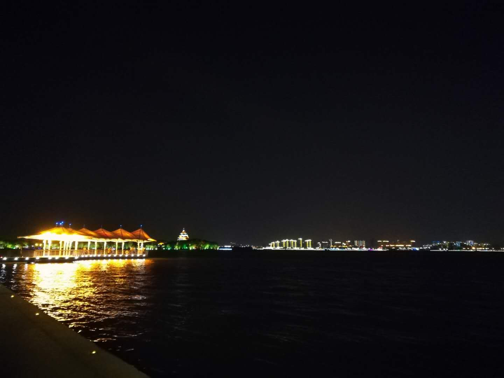

# 2018年度总结，平淡无奇

>写于`2019-01-14 23:11:09`

从2014年开始写年度总结至今已经五个年头了。正如孔子所说：逝者如斯夫，不舍昼夜。

这一年，与2017年基本一样，平淡无奇，只是觉得时间过得更快了。
人们往往容易高估自己一年能完成的事情，低估自己五年能完成的事情。记录下来，发现一年做不了很多事。

使用`teambition`网站记录了不少任务，还有很多没有完成，不过我一般是记录任务。

2016年学习了一门年度计划的课程，提到人生的8个方面，分别是**身体健康、财务理财、人际社群、工作事业、家庭生活、学习成长、体验突破、休闲放松**。觉得这8方面还是挺合理的，于是2016年度总结开始，都是按这8个方面用`xmind`画思维导图总结自己的一年。

## 工具篇

有人可能会想，一年这么多事情，竟然记得那么清楚，是哪天发生的，都记得。
这时候就要说一说，这一年，主要使用的工具。

其实很多事，我都会发微博记录。整理总结一年的开始会先先用`xmind`整理【2018年微博时间轴】

**GTD任务管理，目标管理之类的软件**，很早之前（大学期间）用的是[doit.im](http://doit.im/cn/)。后来用的是[滴答清单](https://www.dida365.com/)，现在主要用的是[teambition](https://teambition.com/projects)

以前用`24PI`，后来不支持现在的手机，就弃用了。[rescuetime 记录时间的软件](https://www.rescuetime.com)

发了年度总结的思维导图的朋友圈后，有人评价，一个极度自律的人。其实觉得自己自律和目标管理（之前写过一篇文章：[如何制定有价值的目标](https://www.jianshu.com/p/8284f7778e6e)）方面，还是做得挺不好的。没有达到良性循环。只是相比于一般人，写年度总结罢了。

## 身体 · 健康

全年基本没有锻炼，虽然特意买了一个手环记录运动数据。骑车（20分钟左右）上下班都算是一种锻炼了，下雨或者天冷就坐公交。

2月20日，大年初五换了第三副眼镜，据眼镜店记载上一副还是高三（2012年）配的，第一副是高一（2009年）配的。配完新眼镜感觉很清晰，现如今，已经又加深了，模糊了。（主要还是天天面对手机电脑且不注意休息的缘故）。

正印证了那句话：**真的要少玩手机电脑了，眼睛越来越不好了，打开支付宝都看不到钱了。**

有时问自己：按时好好吃饭，难吗？按时好好睡觉，难吗？确实难。

这一年，工作日点外卖明显多了（往年基本不点外卖），下班后有时容易饿了先吃零食填肚子。年轻人容易得胃病，往往就是不按时好好吃饭的缘故。

9月1日生日那天，把杭州的大学同学聚在一起聊天时，好几个同学提到累但睡不着，容易醒。醒来就睡不着了。感慨不年轻了，大学期间没课还可以睡到自然醒。那时心想看来不只是我一人如此。

到了12点，身体就开始就感觉累了，要去休息了，很难熬夜了。有时又容易睡不着，就失眠到一两点，第二天照样去上班。周末一般都1点才入睡，想着第二天不用早起，再睡个懒觉，一上午就浪费了。

但试想一下，好像没必要非得拖到那么晚才睡。听一朋友说TA 10点半前基本就会关闭电子设备，看书，11点准备入睡，容易睡着。我也试着照这样做，确实容易睡着。

**总之，2019年得管理好自己，按时吃饭、早睡早起**。试着调整成11:30前睡，8:00前起。不区分工作日还是周末。

## 财务 · 理财

所谓理财就是理清自己的财务，开源节流，基本没有乱花钱。

虽然在网易云课堂上了花了几百元买了《简七理财》相关课程，但就看了几小节。
有些人，买几千块钱的耳机，上万块的手机，几万块的电脑。不得不说这些人确实有钱。如果追求这些，把自己变成月光族，那我觉得没什么必要。毕竟跟理财理念是相违背的。

## 人脉 · 社群

2016年工作后，那时就发现人脉圈子窄了。不像大学，因为社团和活动可以接触到很多同学和老师。原来大学认识的学弟学妹都来到杭州工作了，自己毕业快三年了。这一年，工作之外，算新认识的朋友少得可怜，好像不超过30个，女生就更少了。

老朋友联系少了，但联系起来感情还在。

而且即使同在杭州的朋友同学，一年都头，可能就聚过一两次，或者几年一次都没见过。再聚就不知道是什么时候了。所以每次和朋友同学若是去风景区玩，觉得都应该合个影留作纪念，毕竟真的是见一次少一次啊。

2月12日，年前放假回家时，几个高中同学聚了一下，都发现是好几年没见了。
6月1日，和前端群里群主（在广州来杭州玩）召集了十来个在杭州的小伙伴一起欢度了六一。

后续这些小伙伴，其中一人离开杭州，再去海底捞吃火锅聚了一次。这算是一次性认识的人最多的一次。

## 家庭 · 生活

**这一年，开始关注楼市消息，但也没有非常认真的关注**。春节期间，亲戚坐在一起聊天时，提到房子要早点买，不然一年的钱就白赚了，那个谁在哪里买了房，诸如此类。2月春节期间，去看了县城周边的房子，连那么远都是`5K`起，太贵了，县城均价都`6~7K`了。要知道所在城市吉安都比自己小县城便宜。

6月23日，我弟高考成绩出来，帮忙报考，**后来还是录取到了计算机类专业，不知是喜是忧，毕竟自己从事计算机行业，时常感到焦虑**。后续给我弟买了手机和电脑。

10月1日-6日，国庆放假在家6天，国庆时给老妈买了一部新手机`华为荣耀8X`。给爸妈买个手机充个话费，他们都记得很清楚。其实相比他们对自己的爱来说，真的是微不足道。

基本平均每两周会和我妈视频通话。很多次都会催着找女朋友，每次我也只好默不作声。他们也着急，也会找亲戚朋友帮忙看看哪里有合适的姑娘。
自己比较佛系（随缘），新认识的人少，女生就更少了。

**从历史长河来看，好的伴侣真的很重要，应该努力去追寻，毕竟是陪伴一生的人。**

[宁南山：多赚了一两千--深圳年龄30+中产状态](https://zhuanlan.zhihu.com/p/51403975)，有兴趣的读者可以看看这篇文章。

> 所以对于“学校出身”“学历出身”相似的人来说，
虽然毕业后大家努力程度不同，行业的不同，公司的不同会导致收入有差距，但其实大多数人的收入区间是逐渐趋同的，少数人除外。
年龄30岁+的我们，决定我们现在个人之间差距的，
是两个选择，一个是房子，一个是婚姻。

简单说也就是单科（事业）再怎么好，一般都敌不过三科（包含房子、婚姻）好的同学。

作者宁南山还在这篇文章提到婚姻这个问题。[宁南山：(闲聊）高考二十年后的人生轨迹](https://zhuanlan.zhihu.com/p/37902458)

## 工作 · 事业

之前同事问：家里人知道你是做什么的嘛。
这里解释下：说的高端一点是前端开发工程师，说的通俗一点则是：网站开发，比如朋友圈各种年度报告，或者百度、天猫网站、微信小程序就是我们这类人做的。

**慢慢打造个人品牌**

知识星球《前端视野》，依旧没怎么推广，共有318人加入，比去年（5月开通）增加了200余人，就是日常发些前端相关。

建有微信群【前端视野交流群】，没怎么推广，暂时32人。
在`SegmentFault`、掘金、简书、知乎、博客，累计发了10余篇技术文章，最高产时是11月份3篇。

`SegmentFault`、知乎上都开通了专栏《若川的前端视野》[SegmentFault：若川的前端视野](https://segmentfault.com/blog/lxchuan12)，

[知乎：若川的前端视野](https://zhuanlan.zhihu.com/lxchuan12)。

机缘巧合，有偿给牛客网出了一些前端试题，得到了几百元的报酬。
年初也有偿帮别人做了一份PPT，获得了几百元的报酬。不过帮被人做`PPT`太耗时了，好久不做，做得也没大学那么顺手了。

## 学习 · 成长

1月27日，成为`SegmentFault`优秀问答作者，获得官方发的一些礼物，比如抱枕等。

给2013年买的电脑，加了4G内存条，买了24寸的显示器，双屏显示器效率确实高了很多，看完了十余门视频课程，比去年看的多些。

**这一年，参加的技术分享活动不多，总共2场。**

4月21日，有赞前端技术开放日，写了一篇参与后感想[参加有赞前端技术开放日所感所想](../../20180421-youzan-front-end-tech-open-day/)

5月20日，掘金杭州前端技术分享活动。

**这一年，加入到了freecodecamp杭州社区的活动组织中，和组织者一起举办了两场活动。**

3月19日，FCC与宋小菜联合举办线下分享活动。

11月10日，全国联动，[freeCodeConf](https://conf.freecodecamp.one/)杭州站技术分享活动。

当时下班后写后续报道公众号文章[首届freeCodeConf杭州站圆满结束，精彩回顾](https://mp.weixin.qq.com/s/HPLyoWATWWnjm2FH1kKxlw)，写了三天。主持稿也是我写的。主持人是我请的大学同学。

**输出文章（在博客、掘金、思否、知乎、简书）11篇，其中技术文章9篇，技术文章比去年多写了7篇。（去年只写了2篇技术文章）**。

**这一年，看技术书籍，主要看了几本《你不知道的JavaScript 上中下卷》、《深入浅出webpack》等，非技术书籍，主要看了《刻意练习》，此书还是值得一看，推荐给大家。**

## 休闲 · 放松

这一年旅行，只去了苏州，体验了第一次一个人旅行的感觉，大学就想体验一下，但一直没实现。苏州虎丘、博物馆、狮子园、金鸡湖景区等。

杭州周边，很多地方都去过，只是基本都是不同的人。

上面洋洋洒洒写了三千多字，看过思维导图的同学，会发现基本是思维导图的扩充（或者说补充）版本。
跟以往的年度总结不太一样。以往年度总结，提出了好几个观点。
2016年：[2016年度总结，毕业工作](../2016/)
1. 未来的路在哪

2. 打造个人品牌（知识型IP）

3. 时间也是资源

4. 世界发展太快，需要不断学习

2017年：[2017年度总结，一如既往](../2017/)

1、慢慢打造个人品牌

2、危机感。

而现在觉得，这些都写过了，就不写了。
至此，昨晚写了一晚和今晚配图，2018年度总结的文章算是结束了。后续会可能有些修改。以往都只发布在朋友圈和我的个人博客，觉得博客可能迁移，图片也有时缺失，有时打开也比较慢，所以这一次也发布到了简书。

同时也发表在简书[简书：2018年度总结，平淡无奇](https://www.jianshu.com/p/a9c7aae40e64)
