# 若川的2019年度总结，波澜不惊

>大家好，我是[若川](https://ruochuan12.github.io)。我倾力持续组织了一年[每周大家一起学习200行左右的源码共读活动](https://juejin.cn/post/7079706017579139102)，感兴趣的可以[点此扫码加我微信 `ruochuan02` 参与](https://juejin.cn/pin/7217386885793595453)。另外，想学源码，极力推荐关注我写的专栏[《学习源码整体架构系列》](https://juejin.cn/column/6960551178908205093)，目前是掘金关注人数（4.1k+人）第一的专栏，写有20余篇源码文章。

从`2014年`开始写年度总结至今已经六个年头了。

正如孔子所说：逝者如斯夫，不舍昼夜。

2019年的年度总结写得比较晚，都快农历新年了，此刻在家里继续写完这篇文章。往年基本是元旦之后几天就写完了。我的年度总结尽量写得非技术人员也能看懂。

回首六年以来，写的年度总结如下，感兴趣的读者可以看看。

[回顾2014，约定2015](http://user.qzone.qq.com/1019963719/blog/1422275707)（QQ空间日志） 
[2015年总结，淡化旧标签，无惧未来](http://user.qzone.qq.com/1019963719/blog/1451822274)（QQ空间日志） 
[2016年度总结，毕业工作](https://ruochuan12.github.io/annual-summary/2016/) 
[2017年度总结，一如既往](https://ruochuan12.github.io/annual-summary/2017/) 
[2018年度总结，平淡无奇](https://ruochuan12.github.io/annual-summary/2018/) 
[2019年度总结，波澜不惊](https://ruochuan12.github.io/annual-summary/2019/) 

虽然包含比较多的个人信息，但读者朋友看到或许会觉得似乎认识我很久，当然一般人也不会都看。

2014年写的标题是《回顾2014，约定2015》，2015年则是《2015年总结，淡化旧标签，无惧未来》。这两篇文章是在我QQ空间中置顶10篇文章的2篇。

大学毕业后，把两个QQ的空间设为了仅所有好友（共计1400余人）可见。如今都是发朋友圈同步QQ说说，我还是算会发发动态的人。不过这一年动态也发的少了。

大学期间常写空间日志，转发多阅读量还不错能有两三千人阅读。2019年开了微信公众号《若川视野》，文章阅读量很少，一般也就几百，上千都是少数。

以一年为时间节点记录一年，以后再看自己写过的年度总结文章，或者与别人分享，也许是一种回忆。

这一年的事，很多还记得。若时间再往前推，便记忆模糊。但翻看自己的年度总结还是能记起，这也许就是年度总结的一种作用吧。

另外，**年度总结其实也是一次对自我审视和复盘的机会**。所以我是比较推荐读者朋友们都写年度总结的，不一定要写给大家看。整理写给自己看也是一种审视。

2016~2018年标题分别是**毕业工作**、**一如既往**、**平淡无奇**。想2019年的标题时，和2018年相比，没什么变化，所以想到**波澜不惊**这个词语，也许2020年度总结时可能是**水波不兴**。

这样算来，自己过了十分平凡普通的三年。有句话说：**人们往往容易高估自己一年能完成的事情，低估自己五年能完成的事情**。记录下来，发现一年做不了很多事。

这一年，启用了新网名**若川**（取自**上善若水，海纳百川**中的两个字）、
启用了公众号**若川视野**、只写了9篇文章、一些平台收获了若干粉丝和阅读量、只去了宁波等地、工具记录平均每天5个多小时在写代码。

这一年很少用`teambition`记录任务了。

2016年学习了一门年度计划的课程，提到人生的8个方面，分别是**身体健康、财务理财、人际社群、工作事业、家庭生活、学习成长、体验突破、休闲放松**。觉得这8方面还是挺合理的，于是2016年度总结开始，都是按这8个方面用`xmind`画思维导图总结自己的一年。

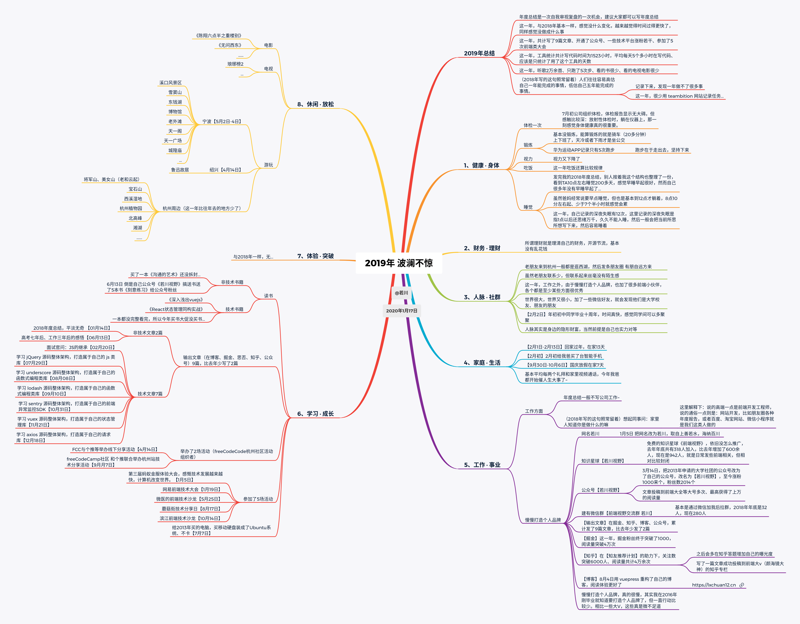

写文章之前，想到了这些关键词，简单列举下。

- [ ] 上帝视角
- [ ] 格局视野
- [ ] 投资自己
- [ ] 跳出思维，思考本质
- [ ] 人脉是隐形财富
- [ ] 很多能力都是可以训练而成

## 身体 · 健康

八个方面，其中身体健康是第一个。

这一年，7月中旬，公司组织体检，体检过一次，体检报告显示正常。但感触比较深：放射性体检时，需要躺在仪器上，仪器启动推动时，那一刻感觉身体真的很重要，其他方面再强，赚钱能力再强，没有健康的身体都会大打折扣，甚至说等于零。

这一年，只11月份开始跑了5次步，一次跑步花不了很多时间大约半小时，但跑步在于走出去和坚持下来。有人说真正觉得锻炼很重要了，那一定可以做到。

这一年，自己记录的深夜失眠有12次，这里记录的深夜失眠指的是1点以后还思绪万千，久久不能入睡，然后把自己所思所想写下来，就容易睡着了。

这一年，给自己定了晚上`10:50`，`11:20`，`11:25`三个闹钟，但基本没有11点半就睡觉的。早睡早起真的是重要，做到又是另外一回事了。2020年争取调整好的作息习惯。

这一年，`https://996.icu`, [`996icu`](https://github.com/996icu/996.ICU)起初是一个`github`上的项目，印象中我`star`时才`3k`多`star`，发展后来到全民都在讨论`996`，如今是`249k`的`star`。

>**“996”工作制，即每天早 9 点到岗，一直工作到晚上 9 点，每周工作 6 天。**

另外阿里、网易、华为等互联网大厂都加班比较严重。

按加班程度来算，程序员群体并不是幸福的群体，互联网从业者基本都属于比较高学历的群体，而且真的有中年危机。当然各行各业都辛苦，这是事实。

国庆假期高中同学结婚，发现很多高中同学都走向了互联网开发这一条路，而且挺多都在知名企业。和在百度工作的高中同学聊天，他说了一句：**用青春换钱**。我觉得确实如此，都是用时间换钱。

想起之前看到的一段文字，觉得写得挺好。

>我有一个伟大的愿望。我希望凭借自己的努力，净化程序员的环境，提升程序员的地位。愿 IT 界再无黑心企业的剥削，无人自嘲“码农”、“码畜”，技术人员受到足够尊重，写程序重新成为一种创造性的劳动。软件行业，重新成为令人羡慕的行业。自由、开放、创新、包容。

程序员这些高学历群体，真的是在做着改变世界的事情，为社会的互联网添砖加瓦。而他们 的社会地位却不是很高，或者说不是很幸福。

## 财务 · 理财

所谓理财就是理清自己的财务，开源节流。钱生钱才是高境界。大都都是用时间换钱。

## 人脉 · 社群

老同学老朋友来到杭州，基本是游西湖，再发条朋友圈有朋自远方来。

老同学老朋友虽然许久没联系，联系起来也丝毫没有陌生感。

世界很大，世界又很小。加了一些微信好友，就会发现朋友圈有共同好友。

各行各业有时也没有我们想象的那么大，而且圈内相对顶尖的人物基本都是相互认识的。

人脉其实是自己的隐形财富，当然前提是自己实力对等。这一年写技术文章，就开放了自己的微信号。

一般加微信都会发一段关于我自己的简介（毕竟我还没有出名到妇孺皆知的情况），并且备注别人。

毕竟微信好友是双向关系。如果是微博，单向关注，那就不用。

但很多人加微信好友一般就是加一下，其实加了好友可以告知自己来意。只有极少部分人会自我介绍下，并且告知自己所处情况，再问问题。毕竟对于一般开放自己微信号的人，基本都是平易近人的，而且加的人也比较多。时间稍微久了一点，那么你就默默躺在好友列表里了。

## 家庭 · 生活

这一年，2月1日-13日，春节在家13天，相比国家法定节假日7天，算是在家比较长。公司一般放假10天，但我总是希望春节假期多在家里待几天，所以一般会请年假几天。因为如今一年一般就回两次家，国庆假期和春节假期。

国庆放假8天，9月30日-10月7日在家。

`2月15日`，给老爸买了一台智能手机，2018年国庆时给老妈买了一台智能手机。现在智能手机很方便，在大都市没个手机都寸步难行。

基本平均两周和家里视频通话，这一年，老爸都开始催我人生大事了，年纪确实也算大了。真的需要多投入时间到这方面了。

## 工作 · 事业

我的年度总结基本不写工作方面。

自己的工作，说的高端点就是**前端开发工程师**，用户看到的各种小程序、网站等都是我们这类人开发的。按照以前来说可能就是一个流水线工人，其实很容易被替代。这也就是为什么很多人焦虑的原因之一。

这一年，使用了工具`wakatime`，统计自己编写代码的时间。

[Programming Stats for 2019 by wakatime](https://wakatime.com/a-look-back-at-2019)

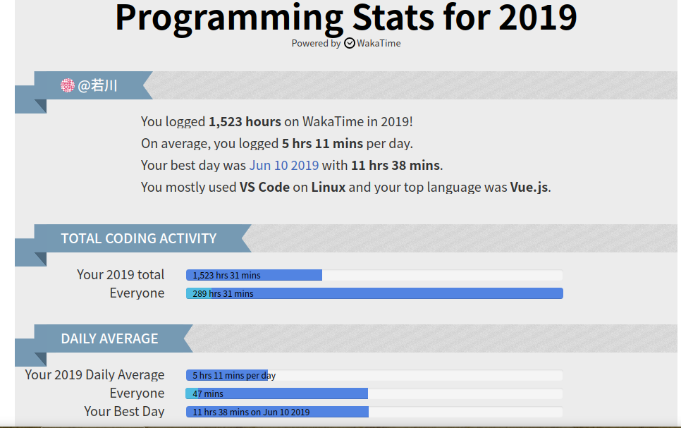

统计表明，全年总共编码1523小时，其中自己的博客花了107小时。平均每天编码5小时11分钟，其中6月10日编码11小时38分钟。这里的编码时间统计，是编辑器使用时间，不在用编辑器则不会算入，这样算起来还算多的。

对比2018年，平均4小时47分钟。

其中两个代码提交平台`公司gitlab`和`个人github`提交记录情况如下。

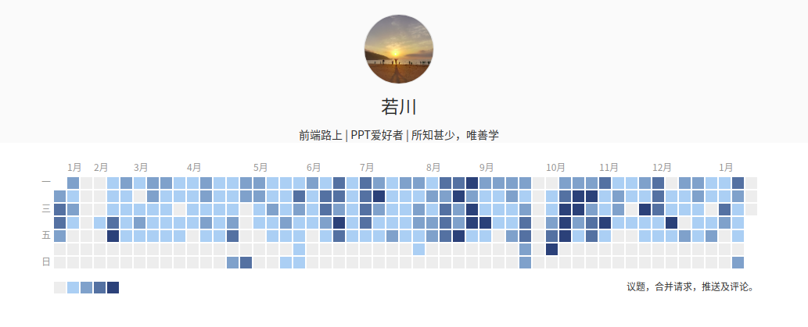

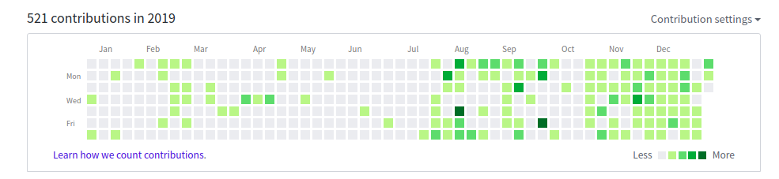

### 慢慢打造个人品牌

2016~2018年网名都是`轩辕Rowboat`，觉得比较拗口。所以2019年1月5日启用新网名**若川**，取自**上善若水，海纳百川**，刚好是我曾用名谐音。

知识星球，免费，【前端视野 若川】，2017年开通至今，虽然还没有链接一千名铁杆粉丝。但相比去年年底318人，增长了600余人，现在958人。相对封闭，也没怎么推广，一般是通过关于我加入的。

公众号【若川视野】，3月14日变更，比变更时增长了1000多名粉丝，目前粉丝2052个。同时公众号文章投稿到了【前端大全】等微信大号，获得了还不错的阅读量。

微信群【前端视野交流群 若川】2018年年底是32人，至今是291人。

在知乎、掘金、思否、博客等平台累计只发了9篇文章。

其中知乎粉丝在【知友推荐计划】的助力下涨粉到6000余人。知乎我的回答和文章总共阅读量4万多一点。知乎文章也有投稿的一些关注度多的专栏，比如《颜海镜的博客》专栏。

掘金终于突破了1000粉丝，这一年阅读量4万多一点。

8月4日，用`vuepress`重构了[博客 ruochuan12.github.io](https://ruochuan12.github.io)，相比以前，阅读体验更好些。

纵向对比，这些对比于2018年，都是一些进步。

>**而横向对比，相比我朋友圈一些公众号号主，我这点粉丝和阅读量简直不值一提**。比如，很多都有十来个500人微信群。有的人一年写了67篇文章。甚至有的人写了几百篇文章。有的公众号粉丝数量超过好几万。

微信公众号文章打开率极低，所以公众号号主一般都建有微信群，在群里交流讨论，并且发文章，不过长此以往，也不是很好的办法，微信公众号号主主要就是接相关广告变现。自己也在一月初接了一次广告（发公众号推文）。

**我在2016年，甚至更早就知道要打造个人品牌，而且运营社群，可是一直行动比较少，或者说能力跟不上思想**。

赚相对多的大钱的，一般都是前期积累比较多，而且能有源源不断的产出。换句话说，现在主流赚钱之道，大家都容易知道。但竞争那么大能不能赚到钱，就要各凭本事了。

## 学习 · 成长

我们这类工作，经常面对的是电脑。所以对电脑要求一般比较高。
2013年买的戴尔电脑，`windows系统`有些卡了。所以买了一个移动硬盘，安装了`Ubuntu系统`，8G内存，不卡，目测还可以再使用5年。自己写文章浏览网页等都是用`Ubuntu系统`了。

### 参加了5场技术活动

>1月5日，第二届蚂蚁金服体验科技大会 
>1月19日，网易前端技术大会。 
>5月25日，微医的第二届前端技术沙龙。 
>8月17日，蘑菇街技术分享日。 
>10月14日，滨江前端技术沙龙。 

杭州前端类技术大会比较多，一般有空我都会去参加，虽然可能不能学到很多，但还是能开阔视野。
**为什么这么热衷这类大会**？之前写过一篇文章。[参加有赞前端技术开放日所感所想](https://ruochuan12.github.io/20180421-youzan-front-end-tech-open-day/)，摘抄里面的一段。
>可能拿之前D2填写的参会理由可以很好的解答这个问题。

>**D2报名填写的参会理由:**
>
>1、了解讲师碰到的问题，有哪些解决方案，是如何解决的，学习他们的解决思路和方案。 
>2、了解现在前端技术发展情况和未来发展趋势，把握学习方向。 
>3、结交前端圈内朋友，让自己融入到更积极的技术氛围，促进自己的技术提升。

### `fCC`杭州社区举办了2场活动

>可能挺多人不知道`fCC`，其实是[`freeCodeCamp`](https://github.com/freecodecamp/freecodecamp)的简称。 
`freeCodeCamp`是`github`上`star`数最多的一个公益项目。助力全球人人皆可编程。国内各大城市一般都有社区，也有活动组织者。 
我是杭州社区活动组织者之一，有一群小伙伴一起组织线下技术分享活动。 
自己经常在博客等简介都是写的这个，并不是给自己找个头衔（毕竟也不是什么职位），让别人觉得自己很厉害的样子。 
而是希望更多人知道`freeCodeCamp`，另外自己找嘉宾大佬来技术分享时可能更方便些。 

>4月14日，`fCC`杭州社区和个推等举办线下分享活动。 
>9月7日，个推Techday杭州站联合`fCC`杭州社区举办了一次活动。

### 写了2篇非技术文章，7篇技术文章

非技术文章2篇，其中一篇是年度总结，还有一篇是：
[高考七年后、工作三年后的感悟](https://mp.weixin.qq.com/s?__biz=MzA5MjQwMzQyNw==&mid=2650744481&idx=1&sn=8a9599fe22d7b89afd65d1e72763be34&chksm=8866252dbf11ac3b6e39848004dc58950a96140be9ac83158a4c2e166d0ef41b6d0febe94507&token=666904113&lang=zh_CN#rd)

第一篇[《面试官问：JS的继承》](https://juejin.im/post/5c433e216fb9a049c15f841b)是年初回杭州后不久发布的。

其中`学习源码整体架构`系列文章6篇。

>1.[学习 jQuery 源码整体架构，打造属于自己的 js 类库](https://juejin.im/post/5d39d2cbf265da1bc23fbd42) 
>2.[学习 underscore 源码整体架构，打造属于自己的函数式编程类库](https://juejin.im/post/5d4bf94de51d453bb13b65dc) 
>3.[学习 lodash 源码整体架构，打造属于自己的函数式编程类库](https://juejin.im/post/5d767e1d6fb9a06b032025ea) 
>4.[学习 sentry 源码整体架构，打造属于自己的前端异常监控SDK](https://juejin.im/post/5dba5a39e51d452a2378348a) 
>5.[学习 vuex 源码整体架构，打造属于自己的状态管理库](https://juejin.im/post/5dd4e61a6fb9a05a5c010af0) 
>6.[学习 axios 源码整体架构，打造属于自己的请求库](https://juejin.im/post/5df349b5518825123751ba66) 

每篇文章都写了挺久。一般跨度至少十多天才能写一篇，这里的十多天肯定不是以每天八小时来计算。甚至有的跨度一个月才写完。

其实工作后，会发现属于自己的时间很少，加班多那就更少了。

工作日，不加班的一天，每天9点上午，下班后吃完饭到住处，基本就晚上8点多了。基本通勤时间花在路上一天2个多小时。碎片化时间虽然也是可以利用起来的，但基本效果不好。

除了以上这些，这一年基本没完整看完过一本书。看到朋友圈很多人都在**得到**等平台学习了很多课程。2020年要多看几本书了。

## 体验 · 突破

和2018年一样，这一项可以说无。感觉好久没有体验突破，让自己非常开心的事情。

## 休闲 · 放松

这一年，看的电影电视剧都比较少，只看过《流浪地球》、《琅琊榜2》、《无问西东》等。比如这一年比较火的电视剧《长安十二时辰》、《都挺好》、《庆余年》等都没看过。所以同事比较好奇问，平时时间怎么打发的，除了学习方面没有其他的了吗？其实空闲时间真不多。

这一年只4月14日去了绍兴鲁迅故居，5月2-4日宁波老外滩、东钱湖、溪口、天一阁、博物馆等地。
放几张在宁波拍的照片。

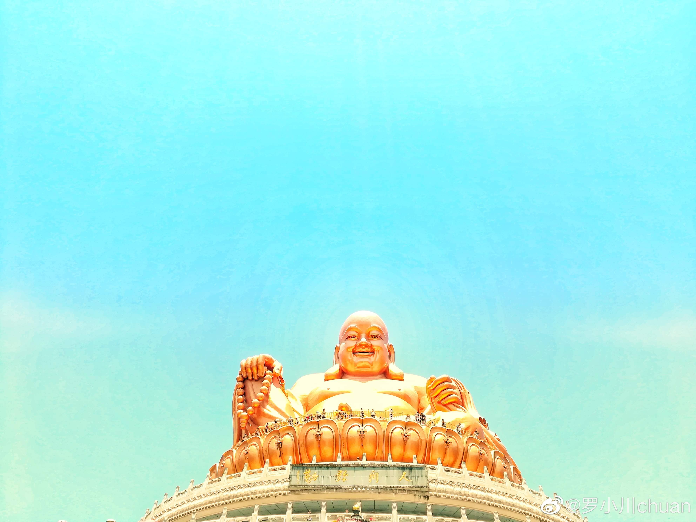
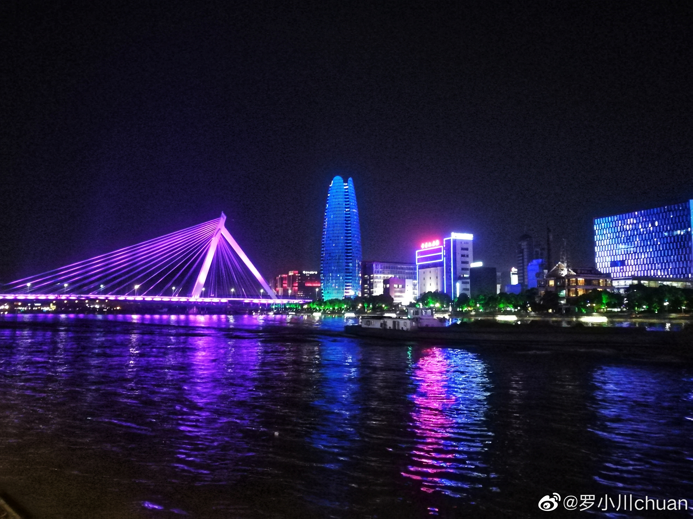
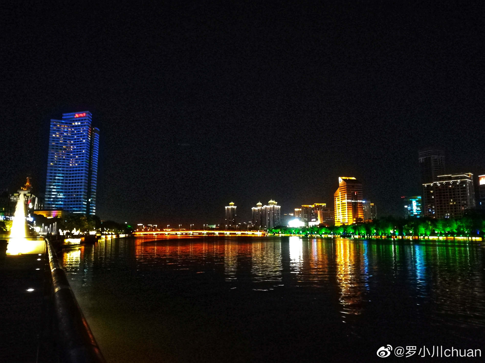

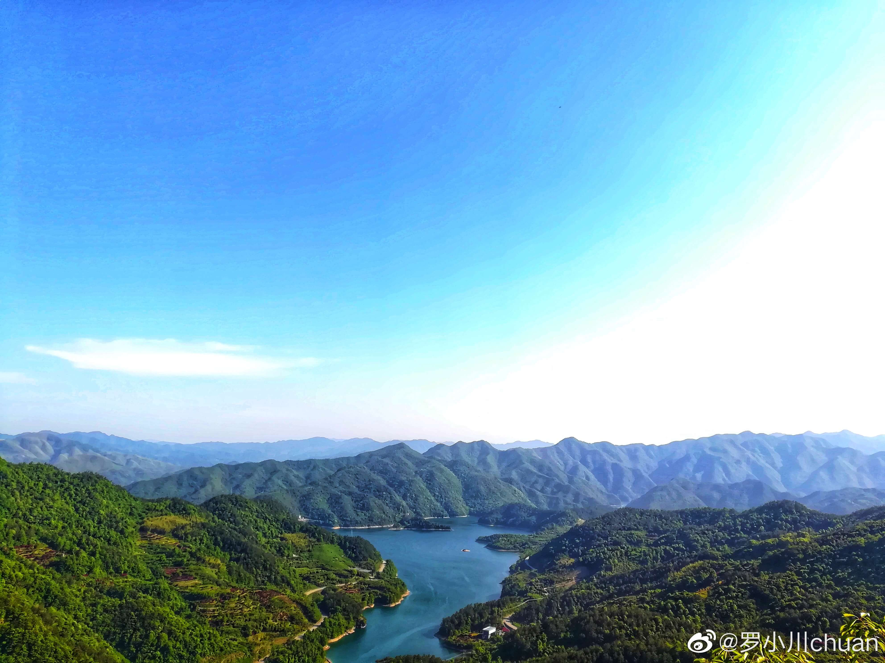
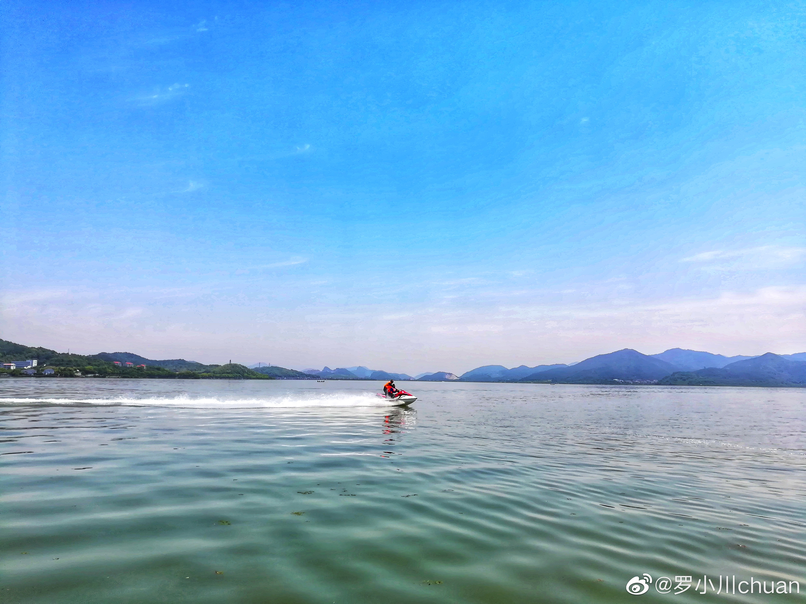

这一年，整理了一下大学期间2012年～2016年，发布在QQ空间，自己感觉写得还行的七首“诗词”。回答知乎问题：[你写过什么自认为惊艳的诗？](https://www.zhihu.com/question/26805717/answer/764832355)算是重拾这一兴趣爱好。

每一年基本都会在杭州周边逛逛。再随便写写，也谈不上“诗词”，而且也写得不好，只是算是心情的一种记录方式吧。

这一年，也写了四首。 

杭州西湖

>3月3日 **《西湖》** 
细雨飘飘鱼儿散， 
游船慢慢客人闲。 
再登小山观宝塔， 
回望白堤卧中间。 

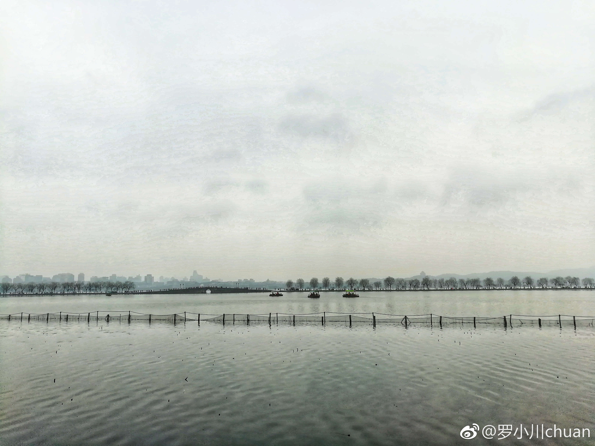
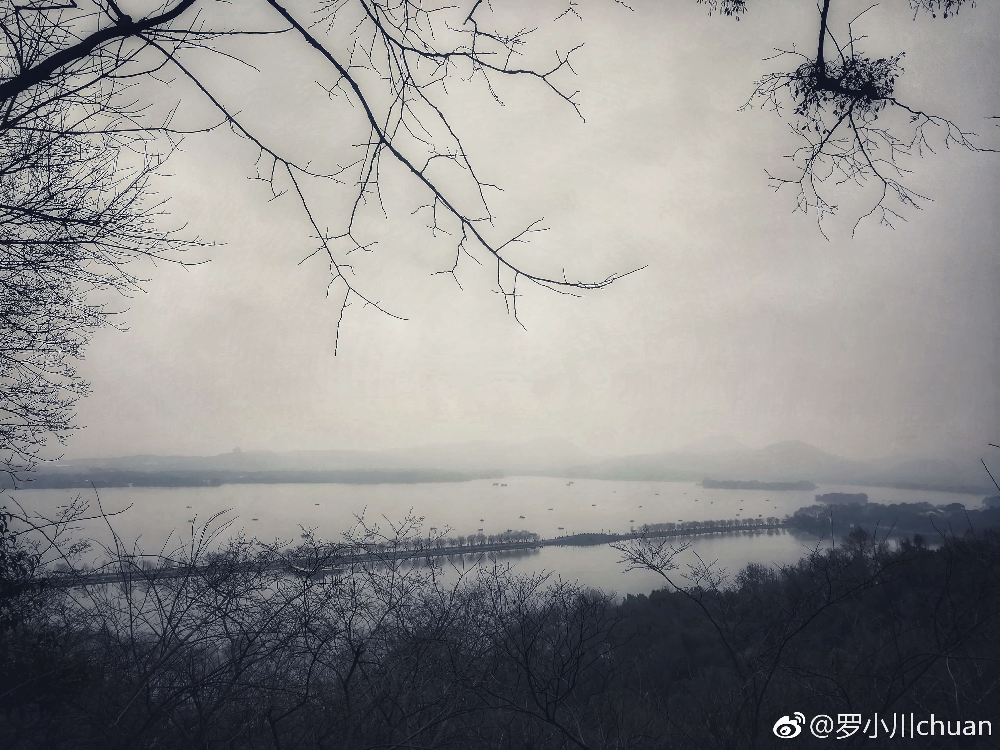

杭州植物园

>3月10日 **《植物园》** 
登山眺望西湖远， 
转角误入植物园。 
春风袭来梅花香， 
花开烂漫迷人眼。 

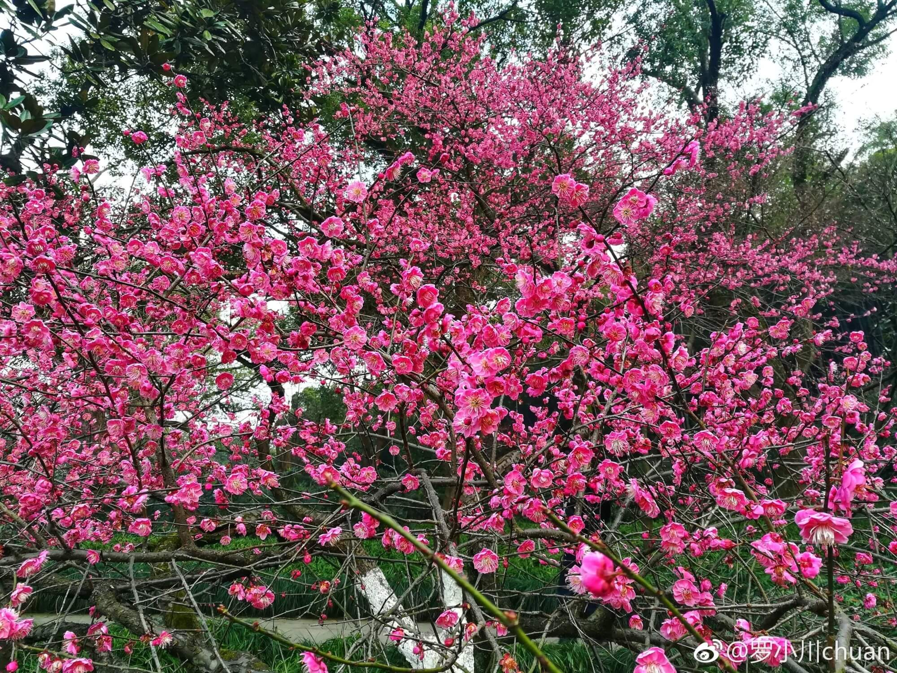
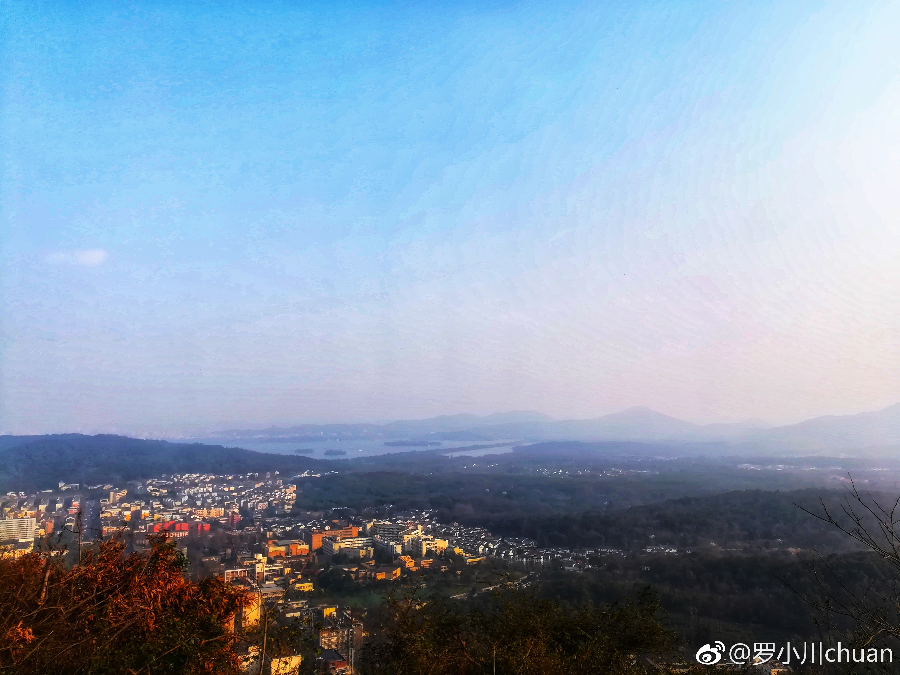

中秋西湖边

>9月13日 **《中秋》**  
中秋断桥前， 
明月挂天边。 
倚坐湖边椅， 
闲谈尽开颜。 

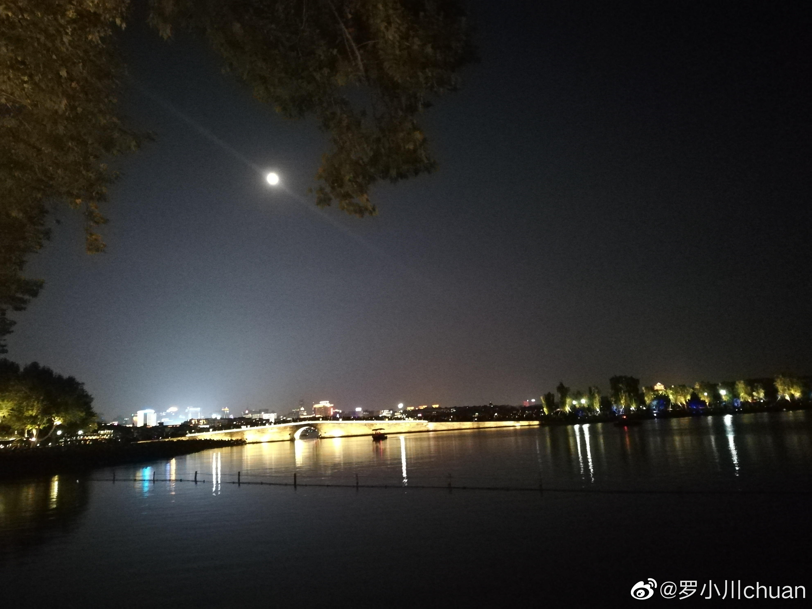
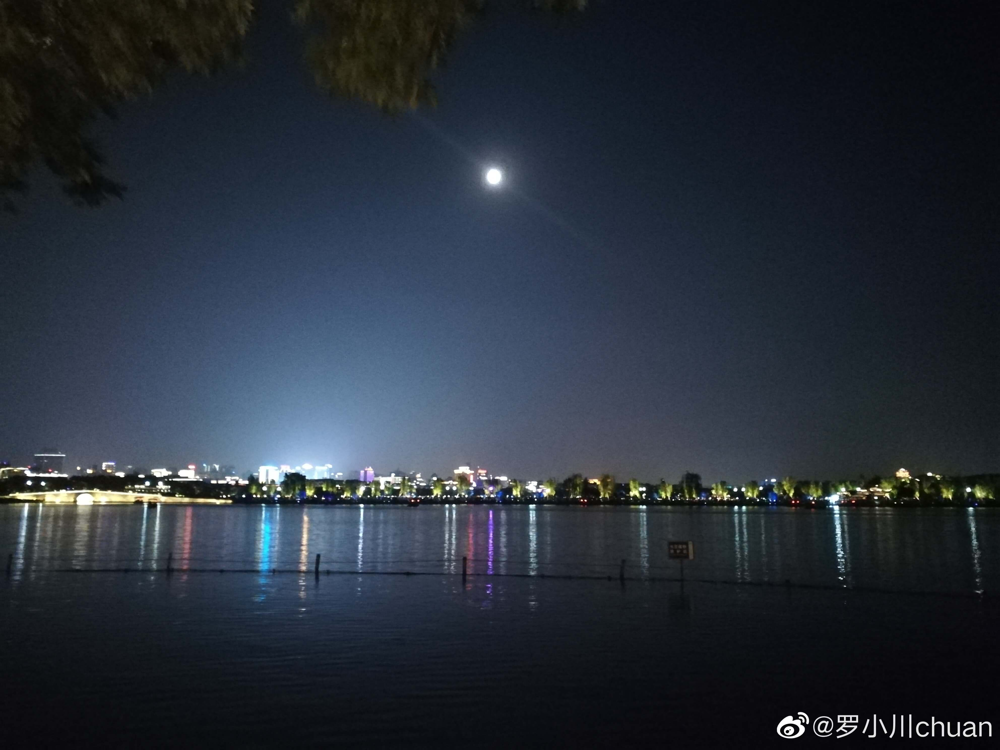

西溪湿地河渚塔

>11月10日  **《冬日夕阳》** 
独上渚塔望夕阳， 
四面环山在异乡。 
飞鸟归去人渐远， 
月出东方夜微凉。 

## 总结

写完年度总结，站在一年一个节点的时间线上来看，基本就知道自己**一年时间能做什么，做得到什么，未来还能做到什么**。所以说开头前写了关键词**上帝视角**，就好比翻开一本书前看的目录，看了目录知道大概情况，能推算之后的事情。

**格局视野**也很重要，如果把自己定位局限于某一个方面，对自己提升也不利。就好比井底之蛙，不知天之大。

**跳出思维，思考本质**，1月份参加了**2019永丰浙江商会暨老乡联谊会**，那时觉得自己很渺小，毕竟只是公司的一名小员工，而参会的大都是各种公司老板等。同时觉得需要跳出互联网行业，看看别的行业，思考本质。技术实现只是很小的一部分，技术人经常容易沉浸在技术层面。

文章统计竟然写了5000余字，就此收尾。

**最后农历新年即将到来，预祝各位读者朋友过一个快乐的春节。在新的一年，遇见更好的自己**。

>2020年1月22日 
>若川于江西吉安

---

## 关于

作者：常以**若川**为名混迹于江湖。前端路上 | PPT爱好者 | 所知甚少，唯善学。 
[若川的博客](https://ruochuan12.github.io)，使用`vuepress`重构了，阅读体验可能更好些 
[掘金专栏](https://juejin.im/user/1415826704971918/posts)，欢迎关注~ 
[`segmentfault`前端视野专栏](https://segmentfault.com/blog/lxchuan12)，欢迎关注~ 
[知乎前端视野专栏](https://zhuanlan.zhihu.com/lxchuan12)，欢迎关注~ 
[github blog](https://github.com/ruochuan12/blog)，相关源码和资源都放在这里，求个`star`^_^~

## 欢迎加微信交流 微信公众号

可能比较有趣的微信公众号，长按扫码关注。欢迎加笔者微信`ruochuan12`（注明来源，基本来者不拒），拉您进【前端视野交流群】，长期交流学习~

