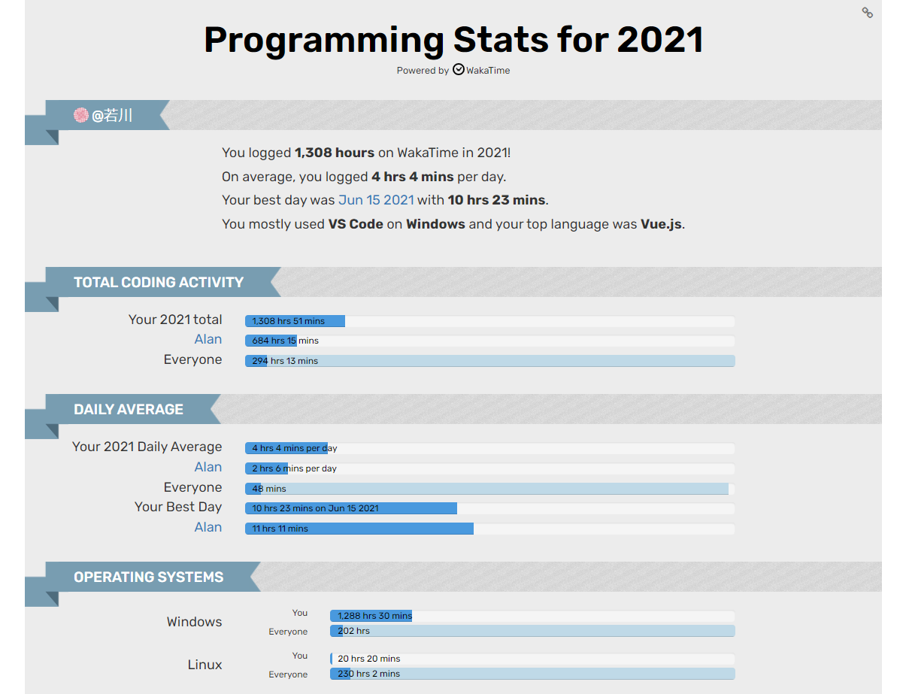
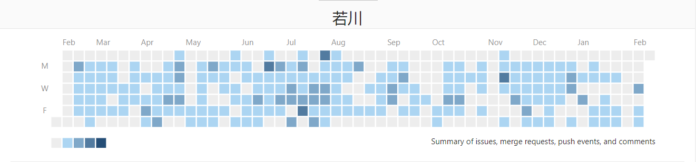
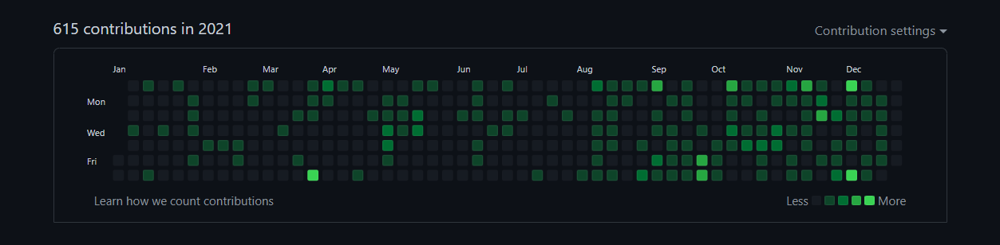

# 若川的 2021 年度总结，第8年写总结了

## 前言

从`2014年`开始，每一年都会写年度总结，已经坚持了7个年头。正如孔子所说：逝者如斯夫，不舍昼夜。 
 [回顾2014，约定2015](http://user.qzone.qq.com/1019963719/blog/1422275707)（QQ空间日志） [2015年总结，淡化旧标签，无惧未来](http://user.qzone.qq.com/1019963719/blog/1451822274)（QQ空间日志） [2016年度总结，毕业工作](https://mp.weixin.qq.com/s?__biz=MzA5MjQwMzQyNw==&mid=2650747244&idx=1&sn=a4cea36b8f9fc2caae4df7a63f302829&chksm=886632e0bf11bbf6cce245c3b6cc6a8544b9f78cf1ba12448a14fe8739dda6e871391759c0a4&scene=178&cur_album_id=1668518390266724360#rd) [2017年度总结，一如既往](https://mp.weixin.qq.com/s?__biz=MzA5MjQwMzQyNw==&mid=2650747311&idx=1&sn=3fb8aa2c7338185a7e4cc85dd5913f75&chksm=88663223bf11bb3507424135dafd4a93bf0812c96b01d4ab3e608568f62d99ac065aa24fe70a&scene=178&cur_album_id=1668518390266724360#rd) [2018年度总结，平淡无奇](https://mp.weixin.qq.com/s?__biz=MzA5MjQwMzQyNw==&mid=2650747386&idx=1&sn=f219582bb2460790c85857e80d036bc8&chksm=88663276bf11bb60fc5244de4456defae50d740ebd7f885b8525e790657a4190c74e255efdba&scene=178&cur_album_id=1668518390266724360#rd) [2019年度总结，波澜不惊](https://mp.weixin.qq.com/s?__biz=MzA5MjQwMzQyNw==&mid=2650744661&idx=1&sn=44de0fed0597c97eac3e19ecc3ab20c5&chksm=886624d9bf11adcfed52ca4b43d7f83500d3f30697f08c1b3a8ed63e3ce22325848b624bb502&scene=178&cur_album_id=1668518390266724360#rd) [2020年度总结，水波不兴](https://mp.weixin.qq.com/s/QmLPNJgFcJXCSwo0aq4-Xg) 
 

如今第8年了，2021年的年度总结比往年晚很多。 
本打算1月份，在回家前写完，无奈，工作比较忙，周末和工作日完全都提不起兴趣继续撰写。 
此刻，正在回家的高铁上，看着窗外的风景，继续完成2021年的年度总结。 
此刻，正在江西老家继续把写完。回到家手机都很少拿起，电脑更是很少打开。 
此刻，正在返回的高铁上，看着窗外的风景，继续完成2021年的年度总结。 
写了好多此刻，都被我删了又保留了。 
此刻还是回到工作地的电脑旁，继续完善2021年的年度总结。这也从侧面说明了**写作难、写年度总结更难**。

就像我的2020年年度总结，在语雀显示竟然改了200多遍。2月4日才写完发布。

回想起过去的这一年的点点滴滴，比较普通。**我只是作为一个创作者，用文字记录下这一年，方便以后回顾总结**。以下几句话基本可以概括。

这一年，去了沈阳和西安两个城市出差，分别出差约2个月和10多天，坐了很多次飞机，体验过10多个小时的高铁。

这一年，公众号持续运营了300+天，几乎每天不间断，涨粉1w+，微信好友增长 `5000+` 。副业收入比2020年有比较大的进步，年收入大概就是5位数，但具体多少我也没有算过，副业离目标月入过万，还有很长的路要走。

这一年，写了21篇文章，8月起，持续组织了5个月的源码共读，吸引了近4000人参与，帮助了很多人学会看源码，利他共赢。

这一年，获得了掘金年度人气创作者第4名，获得了 `InfoQ` 签约作者。

这一年，我的文章在知乎阅读是 `110w+`，去年是 `63w+`，掘金阅读超过了 `51w+`，去年是 `14w+`。

希望之后多写一些技术文。多拓宽一些视野，多拥抱技术社区。多帮助一些人学会看源码、不惧怕源码。

这一年...

几种状态。

- [ ] 写文章，很多文章是周末和工作日写完的。
- [ ] 刷视频
- [ ] 看剧
- [ ] 看风景

## 身体 · 健康

睡眠不规律，很多时候都睡得很晚。好多时候都是1点左右才入睡的。偶尔有早起的时候就感觉一天很长。希望22年有所改进。

互联网关于身心健康的相关事件很多。

## 财务 · 理财

这一年基金我都很少买。

## 人际 · 社群

这一年，工作之外算见过认识的人好像就没有。圈子真的挺窄的。虽然微信好友几千。

不过运营自己的技术公众号，有机会认识很多技术圈的公众号号主。连接更多优秀的人。

## 工作 · 事业

TODO:

按照以往的惯例，放一下写代码的统计时间、公司代码提交记录和个人github代码提交记录。

`wakatime`2021年使用`Vscode`编码时间统计，总共1572小时，和2019年相比基本持平。平均每天5个多小时在使用编辑器`VSCode`，其中2月13日最多，竟然11小时16分钟，记得这一天在家远程办公工作内容很多。花在自己博客的时间为45小时，相比2019年107小时有所下降。这里统计的是实际上聚焦使用VSCode的时间，应该还算是多的。在此放下统计地址[https://wakatime.com/a-look-back-at-2020](https://wakatime.com/a-look-back-at-2020)，方便不知道地址的读者朋友访问使用wakatime。 

### 出差两次，一次996两个月，一次十多天

回顾2020年，工作是相对比较忙的，整体来说，有一些消极。所以对我而言，并不喜欢一直很忙的工作。2021年好一些。

"新生代农民工"。

我想很多人不想被工作占用太多的时间。好在2021年大环境很多公司陆续取消996。

一个人的时间精力非常有限。被工作占据了很多时间，就容易对其他事提不起精神。

### 赚钱的本质、认知、视野

解决了问题，提供了的价值。

程序员赚钱的方式有很多种。在公司工作是最普遍的一种，也是最主要的一种。

另外还有包括写书、知识付费（出课程等）、兼职做外包、自媒体接广告等。

2016年年度总结引用的一段话，放到现在也是同样适用。

>总结一下，对年轻人来说可操作性最强又能挣很多钱的方法，其实就三个步骤： 
>第一：找到自己的一个特长，把它培养得足够出色。 
>第二：找到适合你的特长，又有足够用户注意的平台。 
>第三：在这个平台上深耕细作，打造品牌，获得收入。 
>每个人都有自己的特长，只要长时间持续打磨，总有一天能到“可以卖钱”的水平。 

我做公众号自媒体到变现就是这一个体现。但这一方法事实上很难。能赚到很多钱的还是少数。
### 技术自媒体，慢慢打造个人品牌
#### 公众号

做公众号自媒体其实也算是小型的创业，是一件很难的事情。可能大多数关注的人不知道，我的公众号取名为`若川视野`的原因。「若川」是我的网名，取自`「上善若水，海纳百川」`其中的两个字，刚好是我高中前曾用名罗川的谐音。没开通公众号前，知乎专栏和思否等专栏都是叫`若川的前端视野`。`「视野」`是我比较喜欢的一个词语。所以为了简短好记就取名`「若川视野」`了。视野谐音有很多，比如`事业`、`实业`等。`也可以理解为我（若川）把运营公众号当做是自己的一份事业来对待`。海纳百川，视野开阔。这样也许就好记了。

这一年，公众号持续运营了300+天，几乎每天不间断，涨粉1w+。副业收入比2020年有比较大的进步，年收入大概就是5位数，但具体多少我也没有算过，副业离目标月入过万，还有很长的路要走。

这一年公众号涨了一万粉左右，但远远不够。还有很长的路走。再涨一万粉很难，不一定能够实现。另外，广告投放基本减少了。都没什么广告可接了。而且广告投放多了会产生一定的"**耐药性**"，也就是说很难投放出效果，难投放出效果后投放单价几乎无法上涨。

这一年，截止到目前两个微信号累计 `8700+` 好友，相比去年多了 `5000+` 微信好友。有12个微信交流群，17个源码共读大群，共计4000多小伙伴，相比其他公众号号主来说算很少了。相比2020年，两个微信号累计 `3500+` 好友。也有6个微信交流群，共计 `1000+` 小伙伴，有一些进步。现如今是`微信8.0`了，支持一万个微信好友可看朋友圈，也不知道猴年马月会加满一万个微信好友，不过期待这一天早日到来。

创作者、广告的投放方、读者。适当的商业化有助于创作者创作出更优质的内容，广告投放方也能用户群体，另外读者也会有一定的成长。大多数号主都是良心博主，只是有时候投放广告的标题确实不是那么合适，很多时候也不是公众号号主能决定的。希望读者朋友也不要有那么多恶意。

公众号技术圈内好些都离职做起了自由职业，很多收入到超过了本职工作，甚至是好几倍。也许在未来的某一天，我也可以达到这样的情况，也许永远无法达到。如果以我目前这种涨粉速度，几乎不可能做到自由职业。当然自由职业其实也没想象中那么自由。竞争其实很激烈。印象中 `B站up主` 每年都会有`百大up主`活动，但能够一直维持`百大up主`的是很少数，这也说明了竞争激烈。比如：大多数人熟悉的何同学就是连续两年`B站百大up`之一。

#### 5个月的源码共读

算到一月份，其实是6个月。源码共读每周一期，进行到了23期。

[我历时3年才写了10余篇源码文章，但收获了100w+阅读](https://mp.weixin.qq.com/s?__biz=MzA5MjQwMzQyNw==&mid=2650757158&idx=1&sn=1f1cad678916031fb0e77eefcfa1dddc&chksm=88665baabf11d2bc7dce837e90cbe0b755d4e082362363e1ebc8912a77367b79ba59ea43a32e&scene=178&cur_album_id=1342211915371675650#rd)

7月底，那时我还在西安出差，在酒店想着我读了那么多源码，写了那么多文章，可惜看的人却是少数。是不是可以以某种形式帮助到大家学会看源码。看我的文章，我来答疑解惑。

自己写微信机器人，同意加好友申请，拉群，节省了很多时间。后来被人连续举报两次，导致封禁不能邀请人加群，于是微信机器人就没敢用了。源码共读活动也是摸索中前进。

于是：为了能帮助到更多对源码感兴趣、想学会看源码、提升自己前端技术能力的同学。我组织了每周一期，一起学习200行左右的源码，从第1期开始不断迭代到目前第23期。竟然坚持了5个月。确实有效的帮助到了很多人学习源码，不惧怕源码。

正是由于大家的积极参与，我也有时做到每周输出一篇新文章。可以说是读者和创作者相互成就。

#### 掘金最受欢迎年度创作者

上了多次月榜。TODO：图

创作星计划。奖励了800等价值的物品，自己挑选了蓝牙耳机。

年底参加了[掘金2021年度人气创作者榜单](https://rank.juejin.cn/rank/2021)投票活动，活动持续7天，我在公众号、朋友圈、微信群里等拉票，很多人为我投票拉票，无比感谢，无比感动，最终获得了第4名的成绩，我也有抽价值2000+元奖回馈帮我投票的小伙伴。第4名的奖品是`坚果J10投影仪`，寄回家里了。春节期间，亲戚长辈们都说起现在科技发达，发展迅速，相当于都把电影院搬回家了，回忆起他们当年去看电影有趣的往事。

[学习源码整体架构系列](https://mp.weixin.qq.com/mp/appmsgalbum?__biz=MzA5MjQwMzQyNw==&action=getalbum&album_id=1342211915371675650&scene=173&from_msgid=2650751278&from_itemidx=1&count=3&nolastread=1#wechat_redirect)

这个源码专栏目前好像是**掘金关注人数最多的专栏**。

每篇文章都花了很多时间撰写。有时候工作相对不忙，但写作任务相对比较多。也常有打算今天写完，事实上到明天、后天、大后天等才写完的情况。有时为了争取早一些写完发布，时常有熬夜到1、2点才写完的情况。

比如有一次，还在沈阳出差。我和同事住酒店，同事早早的睡着了，我还在写文章（当然同事不知道我是写文章），写完到挺晚。感觉睡梦中都还想着文章的事情。想着第二天文章阅读量会不会比往常高一些。

很多时候觉得时间不够用，另外也有的时候觉得浪费了很多时间。有时同事问我，你不玩游戏，无聊的时候是怎么打发时间的。我一时间不知道怎么回答。

这里列举下2021年写的21篇文章。

1. [据说 99\% 的人不知道 vue-devtools 还能直接打开对应组件文件？本文原理揭秘](https://mp.weixin.qq.com/s?__biz=MzA5MjQwMzQyNw==&mid=2650751278&idx=1&sn=3ac07b110e84e3ded5fa4ec4407ce13b&chksm=886642a2bf11cbb4cea35f0d208815c39c9cd13a0522e7cdc4a466bc55cb5b3071143a38bb04&scene=178&cur_album_id=1342211915371675650#rd)
2. [一文读懂vuex4源码，原来provide/inject就是妙用了原型链？](https://mp.weixin.qq.com/s?__biz=MzA5MjQwMzQyNw==&mid=2650751710&idx=1&sn=ce85d2e463cedff7faf09332a0d302e9&chksm=88664152bf11c844c08da1caf42adc6ea982074ccb5291b02873a7997ba28a6f6563a991375f&scene=178&cur_album_id=1342211915371675650#rd)
3. [面对 this 指向丢失，尤雨溪在 Vuex 源码中是怎么处理的](https://mp.weixin.qq.com/s/pf27XwzO0DVku4i8Q_GIPA)
4. [尤雨溪开发的 vue-devtools 如何安装，为何打开文件的功能鲜有人知？](https://mp.weixin.qq.com/s?__biz=MzA5MjQwMzQyNw==&mid=2650755710&idx=1&sn=a73db2c7d244c4559e908882f19c1adc&chksm=886651f2bf11d8e4c8685965841c9c4f2e5310e1b87c9232d52d78cc660b4b882d8bc7dbf6d6&scene=178&cur_album_id=1983422074127777794#rd)
5. [初学者也能看懂的 Vue3 源码中那些实用的基础工具函数](https://mp.weixin.qq.com/s?__biz=MzA5MjQwMzQyNw==&mid=2650756199&idx=1&sn=d3cac0cf2937e9835e1db89e2a486810&chksm=886657ebbf11defd013baaefeb6a86947acc505bbd1c26b37e21b7eab5bb7de431eb97b79858&scene=178&cur_album_id=1342211915371675650#rd)
6. [Vue 3.2 发布了，那尤雨溪是怎么发布 Vue.js 的？](https://mp.weixin.qq.com/s?__biz=MzA5MjQwMzQyNw==&mid=2650756473&idx=1&sn=00d7187e81d99151e3f459384959437b&chksm=886656f5bf11dfe3eb78637706f6e6fa264e9b7faccf10ee56886a146c81289d768b46ad7a5f&scene=178&cur_album_id=1342211915371675650#rd)
7. [50行代码串行Promise，koa洋葱模型原来是这么实现？](https://mp.weixin.qq.com/s?__biz=MzA5MjQwMzQyNw==&mid=2650757234&idx=1&sn=e99421799034eb19ce4c1ede71a4ef57&chksm=88665bfebf11d2e879118071b994468116e371d96e67c8cd104c3ea99bffa4dbc287e03c41a4&scene=178&cur_album_id=1342211915371675650#rd)
8. [为什么 Vue2 this 能够直接获取到 data 和 methods ? 源码揭秘！](https://mp.weixin.qq.com/s?__biz=MzA5MjQwMzQyNw==&mid=2650757441&idx=1&sn=3d401646101b7d69b792f2bcb1440fdc&chksm=88665acdbf11d3db240378c7ccde769c7e02d3ca271e1f9f9df28e51b3ceff73cc80f6d712d3&scene=178&cur_album_id=1342211915371675650#rd)
9. [Vue 团队公开快如闪电的全新脚手架工具 create-vue，未来将替代 Vue-CLI，才300余行代码，学它！](https://mp.weixin.qq.com/s?__biz=MzA5MjQwMzQyNw==&mid=2650757773&idx=1&sn=7fe83ff71d1b5dd5b29b623886cb18c5&chksm=88665901bf11d017d07232864b8c41720ea9b82cc157defe6f885ccd72d3f3cd982a6278d84c&scene=178&cur_album_id=1342211915371675650#rd)
10. [尤雨溪几年前开发的“玩具 vite”，才100多行代码，却十分有助于理解 vite 原理](https://mp.weixin.qq.com/s?__biz=MzA5MjQwMzQyNw==&mid=2650758126&idx=1&sn=e506d684b281d84406689fb07d64c9dc&chksm=88665862bf11d174fbc3408338be4519ebfa4fbd609508abac2d4178fea992166aa828a30178&scene=178&cur_album_id=1342211915371675650#rd)
11. [尤雨溪推荐神器 ni ，能替代 npm/yarn/pnpm ？简单好用！源码揭秘！](https://mp.weixin.qq.com/s?__biz=MzA5MjQwMzQyNw==&mid=2650758387&idx=1&sn=a4634c7ae6d0e1b989f1a4b3a380600d&chksm=88665f7fbf11d669fcb10c8d69b21dd0637ed37a1ae0b6595cbc888cb35feff0efa6bbcbe40d&scene=178&cur_album_id=1342211915371675650#rd)
12. [初学者也能看懂的 Vue2 源码中那些实用的基础工具函数](https://mp.weixin.qq.com/s?__biz=MzA5MjQwMzQyNw==&mid=2650758578&idx=1&sn=55da8a6926d481bb30e3f5747c636e59&chksm=88665e3ebf11d7286f5835c25fb00e13f36df380bdc68eeba03f0a644b92d9851a5d61ce70e9&scene=178&cur_album_id=1342211915371675650#rd)
13. [每次启动项目的服务时，电脑竟然乖乖的帮我打开了浏览器，100行源码揭秘！](https://mp.weixin.qq.com/s?__biz=MzA5MjQwMzQyNw==&mid=2650758644&idx=1&sn=38520156a2ef9ae212a822ff283fa08d&chksm=88665e78bf11d76e73fa9e8ce7c2bef314ceb3bb49b177a4e8f0157b33e3525523e507c3a3a1&scene=178&cur_album_id=1342211915371675650#rd)
14. [面试官：请实现一个通用函数把 callback 转成 promise](https://mp.weixin.qq.com/s?__biz=MzA5MjQwMzQyNw==&mid=2650758894&idx=1&sn=53f590f5c13d95c2d9abe886770c3a65&chksm=88665d62bf11d474ba1373786bec6979aaebe0e51274a80de96419cf8850c5707343a1dd392c&scene=178&cur_album_id=1342211915371675650#rd)
15. [新手向：前端程序员必学基本技能——调试JS代码](https://mp.weixin.qq.com/s?__biz=MzA5MjQwMzQyNw==&mid=2650758814&idx=1&sn=3814b9c13cc14f33f6c73caff565ff96&chksm=88665d12bf11d404f93b9701dbe68ca80bf81ff6d630d0b378c58cb3b987b3fc4901a837dd25&scene=178&cur_album_id=1342211915371675650#rd)
16. [每次新增页面复制粘贴？100多行源码的 element-ui 新增组件功能告诉你减少重复工作](https://mp.weixin.qq.com/s?__biz=MzA5MjQwMzQyNw==&mid=2650759137&idx=1&sn=b48536f81b6d93c457d2692b1918790e&chksm=88665c6dbf11d57b1bd528101042833a5367d49f3a2ea7c1962dc2451a95ea7ddb7f20c1de56&scene=178&cur_album_id=1342211915371675650#rd)
17. [从 vue3 和 vite 源码中，我学到了一行代码统一规范团队包管理器的神器](https://mp.weixin.qq.com/s?__biz=MzA5MjQwMzQyNw==&mid=2650759368&idx=1&sn=b03b43d64c7351154d00eab65dacf9b7&chksm=88666344bf11ea5267c45cfe47b276699b1a8f091754b6d784b615ff7bc332d9fc6a425d67ee&scene=178&cur_album_id=1993885549304086529#rd)
18. [从 vue-cli 源码中，我发现了27行读取 json 文件有趣的 npm 包](https://mp.weixin.qq.com/s?__biz=MzA5MjQwMzQyNw==&mid=2650759428&idx=1&sn=3de94e0ae091cff2b1608251b62d1c05&chksm=88666288bf11eb9e0100cf57a4bab41effaabad3badf8850677b7aa6e61115b3a918b94cccdd&scene=178&cur_album_id=1342211915371675650#rd)
19. [Vue团队核心成员开发的39行小工具 install-pkg 安装包，值得一学！](https://mp.weixin.qq.com/s?__biz=MzA5MjQwMzQyNw==&mid=2650759756&idx=1&sn=32f5a898309ba6f75c9fe3a8c2a9b620&chksm=886661c0bf11e8d64c46bef5788fac104843bb4c9ed709b8228e024953955c0b92223b70b634&scene=178&cur_album_id=1993885549304086529#rd)
20. [面试官：请手写一个带取消功能的延迟函数，axios 取消功能的原理是什么](https://mp.weixin.qq.com/s?__biz=MzA5MjQwMzQyNw==&mid=2650760000&idx=1&sn=d854d3bd3789c67e491700d82bc29cc4&chksm=886660ccbf11e9dacaafcff539edac0816ae9c3c0e1dafe1e0035c82ee74b3446f090a291dc9&scene=178&cur_album_id=1342211915371675650#rd)
21. [面试官：项目中常用的 .env 文件原理是什么？如何实现？](https://mp.weixin.qq.com/s?__biz=MzA5MjQwMzQyNw==&mid=2650760089&idx=1&sn=a8dbeb56395facf0cbf1fdd688323e71&chksm=88666015bf11e9033385d3141311307643f5cd909705660b77c364fd054df6abd4811380393c&scene=178&cur_album_id=1342211915371675650#rd)

#### 拥抱社区

获得了 `InfoQ` 签约作者。其实并没有多么厉害。参加活动的条件把五篇文章整理成合集，报名了参赛，大多数报名参赛的都入选了。

### 35岁焦虑

- [ ] 初中级工程师很难一直工作到退休。
- [ ] 也许成为了行业专家，就不容易被年轻人取代。
- [ ] 早就是优势。

有时候觉得，工作了好多年，真的就是把几年的重复了几年。
有时候问问自己：真的有那么热爱这份工作吗？而且这份工作是自己赖以生存（吃饭）的技能。吃饭的技能好像都没有那么努力和重视。为啥就还是那么菜呢。或者说成长感觉不是很大。

## 家庭 · 生活

很多读者看到`家庭 · 生活`这一部分以为我已经结婚了，事实上并没有。时间很快，转眼毕业好几年了，年龄也确实算大了，时常觉得自己**一无所有**、**一事无成**。也经常被家里人**催婚**。

国庆放假7天。在家6天。
虽然感觉不是很远，但基本一天都在路上。所以回家的次数总是那么少。

<!-- 高铁3小时左右，汽车。 -->
早辞白帝彩云间，千里江陵一日还。
大多数时候都是凌晨出发，晚上才到家。

## 学习 · 成长

除了自己写文章，学习的很少。往往是买了，收藏了，或者简单看了就算看了。

事实上高效学习方法，其实是以教为学。

好在自己写文章就是一种比较高效的学习方法。

很多人都有读书的习惯，而我一年下来好像没有完整看完过一本书。由于运营技术公众号，也经常有出版社和我合作宣传赠书。大多数时候也会送一本书给我，可是很多书我都没有拆封。更别说看完了。

## 体验 · 突破

这一年好像没有算体验突破的。如果要说有就是在同事家，20斤小龙虾，实现了小龙虾自由。

## 休闲 · 放松

电视剧看了《赘婿》、《觉醒年代》、《扫黑风暴》《琅琊榜之风起长林》等。

爬了两次山。

公司团建，看了一次海。

出差去了沈阳和西安。

## 总结

不知不觉已经写了8年的年度总结。这8年是怎么度过的，回顾自己的年度总结就大概知道了。年度总结，大多是写时的所思所想和回忆本年度的事件，为自己一年的所得所失做一次简单的回顾。

年年岁岁小目标相似，
岁岁年年没实现相同。

从运营公众号来看，但也证明了自己能持续坚持一件事。

从写文章来看，不忙的情况下，也是能够一周一篇相对高质量的文章。

等等。

正反馈。

不知不觉写了5000+字，感谢作为读者朋友的你看到这里。
**最后虽然农历新年已经过了元宵节，但依旧预祝各位读者朋友：在新的一年，遇见更好的自己，升职加薪**。

TODO：
>若川 
>2022年2月15日
