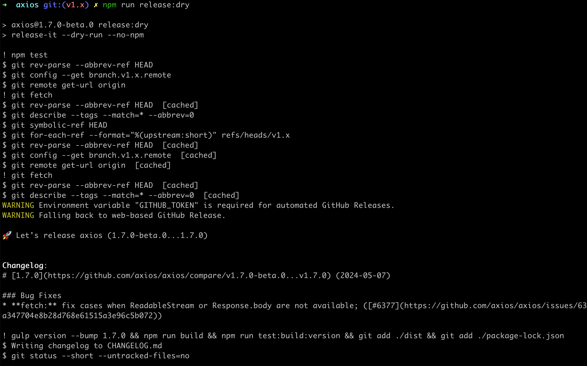
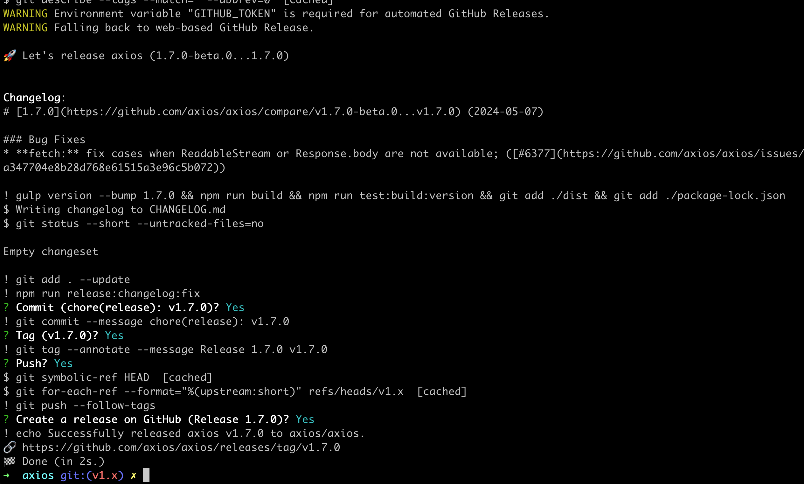
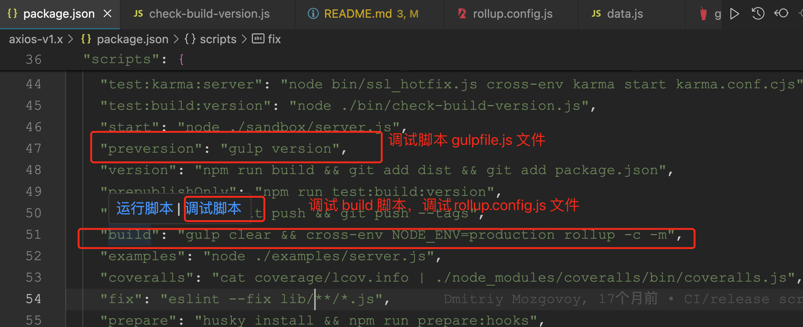
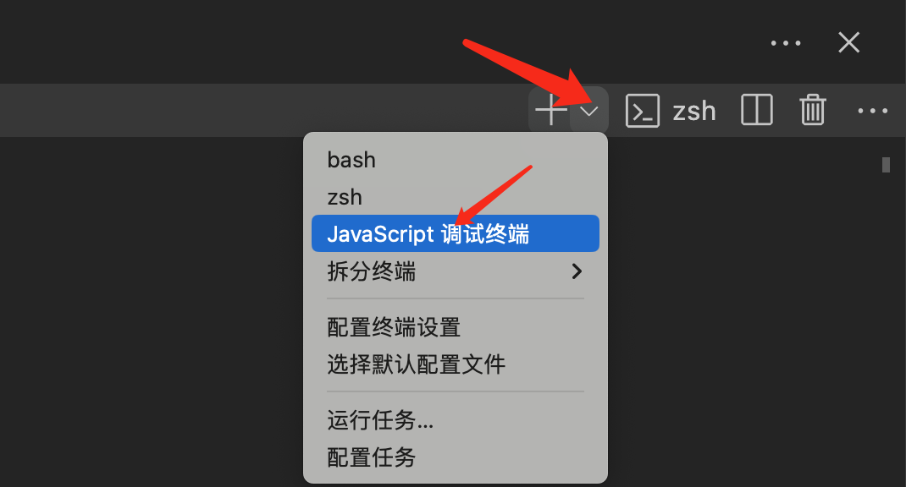
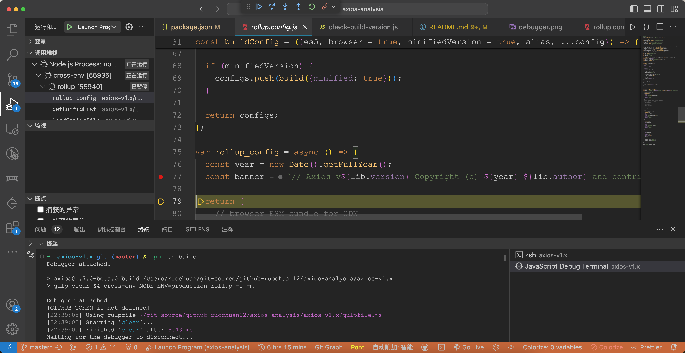
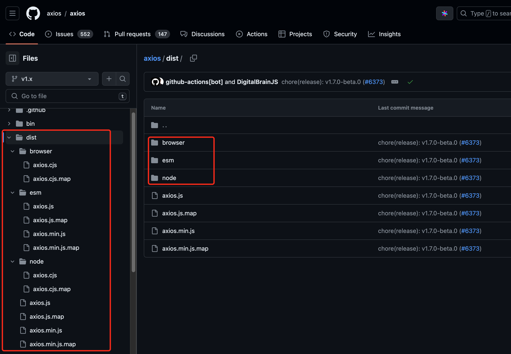

# 天天用的 axios 是如何打包发布更新的？学完等于学会了打包工具库

## 1. 前言

大家好，我是[若川](https://juejin.cn/user/1415826704971918)，欢迎 `follow` [我的 github](https://github.com/ruochuan12)。我倾力持续组织了3年多[每周大家一起学习200行左右的源码共读活动](https://juejin.cn/post/7079706017579139102)，感兴趣的可以[点此扫码加我微信 `ruochuan02` 参与](https://juejin.cn/pin/7217386885793595453)。另外，想学源码，极力推荐关注我写的专栏[《学习源码整体架构系列》](https://juejin.cn/column/6960551178908205093)，目前是掘金关注人数（5.7k+人）第一的专栏，写有30余篇源码文章。

我曾在 2019年 写过 [axios 源码文章](https://juejin.cn/post/6844904019987529735)（570赞、758收藏、2.5w阅读），虽然之前文章写的版本是`v0.19.x` ，但是相比现在的源码整体结构基本没有太大变化，感兴趣的可以看看。截至目前（2024-05-09）`axios` 版本已经更新到 `v1.7.0-beta.0` 了。[`axios`](https://github.com/axios/axios) 源码值得每一个前端学习。转眼过去好多年了，真是逝者如斯夫，不舍昼夜。

曾经也写过[Vue 3.2 发布了，那尤雨溪是怎么发布 Vue.js 的？](https://juejin.cn/post/6997943192851054606)，757赞、553收藏、3.7w阅读。

本文主要讲述 `axios`，每次更新是如何打包发布更新版本的，学习如何打包发布工具库。

学完本文，你将学到：

```bash
1. 学会使用 gulp 编写脚本任务
2. 学会使用 relase-it 自动化发布 npm 生成 changelog、生成 release、打 tag 等
3. 学会使用 rollup 打包输出多种格式
4. 等等
```

看一个开源项目，第一步应该是先看 [README.md](https://github.com/axios/axios) 再看 [贡献文档](https://github.com/axios/axios/blob/v1.x/CONTRIBUTING.md) 和 `package.json`。

```bash
# 推荐克隆我的项目
git clone https://github.com/ruochuan12/axios-analysis.git
cd axios-analysis/axios-v1.x

# 或者克隆官方仓库
git clone git@github.com:axios/axios.git
cd axios

npm i
```

## 2. package.json scripts

```json
// axios-v1.x/package.json
{
  "name": "axios",
  "version": "1.7.0-beta.0",
  "description": "Promise based HTTP client for the browser and node.js",
  "main": "index.js",
  "type": "module",
  "scripts": {
    "release:dry": "release-it --dry-run --no-npm",
    "release:info": "release-it --release-version",
    "release:beta:no-npm": "release-it --preRelease=beta --no-npm",
    "release:beta": "release-it --preRelease=beta",
    "release:no-npm": "release-it --no-npm",
    "release:changelog:fix": "node ./bin/injectContributorsList.js && git add CHANGELOG.md",
    "release": "release-it"
  },
}
```

`package.json` 中还有很多字段，比如 `main`、`exports` 等。推荐参考阮一峰老师的[ES6 入门 —— Module 的加载实现](https://es6.ruanyifeng.com/#docs/module-loader)

我们可以看到发布主要对应的就是 [release-it](https://github.com/release-it/release-it) 。
我们来看 `release-it` 的配置。一般这类 `nodejs` 工具，都是可以设置在 `package.json` 中的单独属性xxx，或者单独文件配置，比如 `xxxrc、xxx.json、xxx.config.js、xxx.config.ts` 等，内部实现了可以读取这些文件中的配置。算是一些通用规则。

[release-it 仓库](https://github.com/release-it/release-it) 中的 `gif` 图如下：


我们可以执行 `npm run release:dry` 空跑，查看下具体效果。当然也可以直接跑 `npm run release`，但可能没有那么顺利。

执行效果如下图所示：





## 3. release-it

```json
// axios-v1.x/package.json
{
    "release-it": {
        "git": {
          // commit 信息格式
            "commitMessage": "chore(release): v${version}",
            // 推送到远端
            "push": true,
            // 提交
            "commit": true,
            // 标签
            "tag": true,
            "requireCommits": false,
            // 执行时是否需要工作区干净（比如有变动需要提交的）：false
            "requireCleanWorkingDir": false
        },
        "github": {
          // 是否生成 release
            "release": true,
            // 是否保存草稿
            "draft": true
        },
        "npm": {
          // 是否推送发布 npm 包
            "publish": false,
            // 是否忽略版本号
            "ignoreVersion": false
        },
        "plugins": {
            "@release-it/conventional-changelog": {
                "preset": "angular",
                "infile": "CHANGELOG.md",
                "header": "# Changelog"
            }
        },
        "hooks": {
            "before:init": "npm test",
            "after:bump": "gulp version --bump ${version} && npm run build && npm run test:build:version && git add ./dist && git add ./package-lock.json",
            "before:release": "npm run release:changelog:fix",
            "after:release": "echo Successfully released ${name} v${version} to ${repo.repository}."
        }
    }
}
```

`git`、`github`、`plugins` 等很多属性都是字面意思。

`plugins` 中这个插件 [@release-it/conventional-changelog](https://github.com/release-it/conventional-changelog)，是生成 `CHANGELOG.md` 文件的。

值得一提的是这个插件有个配置 [ignoreRecommendedBump](https://github.com/release-it/conventional-changelog?tab=readme-ov-file#ignorerecommendedbump) 默认是 `false`。当然还有很多配置和其他插件。默认值 `false` 时，会根据提交的 `commit` 信息，比如 `feat,fix` 等推荐升级版本号，不能手动选择，如果为 `true` 则可以自行选择版本号。

我们接着来看 [`hooks`](https://github.com/release-it/release-it?tab=readme-ov-file#hooks)。

### 3.1 hooks

hooks，这里我简单画了一个图。


#### 3.1.1 before:init

执行测试脚本

npm test

npm run test:eslint && npm run test:mocha && npm run test:karma && npm run test:dtslint && npm run test:exports

就不展开叙述了。

#### 3.1.2 after:bump

提升版本号后

gulp version --bump ${version} && npm run build && npm run test:build:version && git add ./dist && git add ./package-lock.json

可以拆分成四段

- gulp version --bump ${version}

提升版本号，执行 `gulp` 的 `version` 任务。

- npm run build => gulp clear && cross-env NODE_ENV=production rollup -c -m
清理文件 执行 production rollup 编译

- npm run test:build:version => node ./bin/check-build-version.js
检测源代码的 axios 版本和 axios 编译后的版本是否一致

- git add ./dist && git add ./package-lock.json
git 添加 `./dist` 和 `./package-lock.json`

#### 3.1.3 before:release

```bash
npm run release:changelog:fix
node ./bin/injectContributorsList.js && git add CHANGELOG.md
```

简单来说就是修改 CHANGELOG.md 文件，添加 PRs、Contributors 等。就不展开叙述了。

#### 3.1.3 after:release

执行 `echo Successfully released ${name} v${version} to ${repo.repository}.`

替换相关变量，输出这句话。

先来看这句：

- gulp version --bump ${version}

## 4. gulp version --bump ${version}

[gulp 官方文档](https://gulpjs.com/)

可以先在 `gulpfile.js` 文件打好断点，断点调试下。

可参考我的文章[新手向：前端程序员必学基本技能——调试JS代码](https://juejin.cn/post/7030584939020042254)，或者[据说90%的人不知道可以用测试用例(Vitest)调试开源项目(Vue3) 源码](https://juejin.cn/post/7212263304394981432)



或者新建 `JavaScript调试终端` -  执行 `npm run preversion` 命令调试。




### 4.1 引入 和 task deafult clear

```js
// axios-v1.x/gulpfile.js
import gulp from 'gulp';
import fs from 'fs-extra';
import axios from './bin/githubAxios.js';
import minimist from 'minimist'

// 解析 命令行的参数
const argv = minimist(process.argv.slice(2));

  gulp.task('default', async function(){
  console.log('hello!');
});

// 清空打包后的 dist 目录
const clear = gulp.task('clear', async function() {
  await fs.emptyDir('./dist/')
});

```

`process.argv.slice(2)` `process.argv` 第一个参数是 node 命令的完整路径。第二个参数是正被执行的文件的完整路径。所有其他的参数从第三个位置开始。

[minimist](https://github.com/minimistjs/minimist) 解析命令行参数。这里主要是 `gulp version --bump ${version}` 获取 `argv.bump` 版本号。

```js
// for CJS
const argv = require('minimist')(process.argv.slice(2));

// for ESM
// import minimist from 'minimist';
// const argv = minimist(process.argv.slice(2));
console.log(argv);
```

```bash
$ node example/parse.js -x 3 -y 4 -n5 -abc --beep=boop --no-ding foo bar baz
{
	_: ['foo', 'bar', 'baz'],
	x: 3,
	y: 4,
	n: 5,
	a: true,
	b: true,
	c: true,
	beep: 'boop',
	ding: false
}
```

### 4.2 task bower

```js

// 读取 package.json 中的一些指定属性，修改 bower.json 。bower https://bower.io/ 我们目前不常用了。可以简单了解
const bower = gulp.task('bower', async function () {
  const npm = JSON.parse(await fs.readFile('package.json'));
  const bower = JSON.parse(await fs.readFile('bower.json'));

  const fields = [
    'name',
    'description',
    'version',
    'homepage',
    'license',
    'keywords'
  ];

  for (let i = 0, l = fields.length; i < l; i++) {
    const field = fields[i];
    bower[field] = npm[field];
  }

  await fs.writeFile('bower.json', JSON.stringify(bower, null, 2));
});
```

### 4.3 task package

```js
// 用 axios 获取 贡献者 contributors
async function getContributors(user, repo, maxCount = 1) {
  const contributors = (await axios.get(
    `https://api.github.com/repos/${encodeURIComponent(user)}/${encodeURIComponent(repo)}/contributors`,
    { params: { per_page: maxCount } }
  )).data;

  return Promise.all(contributors.map(async (contributor)=> {
    return {...contributor, ...(await axios.get(
      `https://api.github.com/users/${encodeURIComponent(contributor.login)}`
    )).data};
  }))
}

// 获取最多的15个贡献者，修改 package.json 的 contributors 字段
const packageJSON = gulp.task('package', async function () {
  const CONTRIBUTION_THRESHOLD = 3;

  const npm = JSON.parse(await fs.readFile('package.json'));

  try {
    const contributors = await getContributors('axios', 'axios', 15);

    npm.contributors = contributors
      .filter(
        ({type, contributions}) => type.toLowerCase() === 'user' && contributions >= CONTRIBUTION_THRESHOLD
      )
      .map(({login, name, url}) => `${name || login} (https://github.com/${login})`);

    await fs.writeFile('package.json', JSON.stringify(npm, null, 2));
  } catch (err) {
    if (axios.isAxiosError(err) && err.response && err.response.status === 403) {
      throw Error(`GitHub API Error: ${err.response.data && err.response.data.message}`);
    }
    throw err;
  }
});

```

### 4.4 task env

```js
// 传入的版本号，修改替换 axios-v1.x/lib/env/data.js 文件的版本号
// export const VERSION = "1.7.0-beta.0";
const env = gulp.task('env', async function () {
  var npm = JSON.parse(await fs.readFile('package.json'));

  const envFilePath = './lib/env/data.js';

  await fs.writeFile(envFilePath, Object.entries({
    VERSION: (argv.bump || npm.version).replace(/^v/, '')
  }).map(([key, value]) => {
    return `export const ${key} = ${JSON.stringify(value)};`
  }).join('\n'));
});

```

### 4.5 task version

```js
// 三个任务依次执行
const version = gulp.series('bower', 'env', 'package');

export {
  bower,
  env,
  clear,
  version,
  packageJSON
}

```

[gulp.series 串行](https://gulpjs.com/docs/en/api/series/)

将任务函数和/或组合操作组合成更大的操作，这些操作将按顺序依次执行。使用 `series()` 和 的组合操作的嵌套深度没有限制`parallel()`。

我们继续来看 `npm run build`

- gulp clear && cross-env NODE_ENV=production rollup -c -m

## 5. gulp clear && cross-env NODE_ENV=production rollup -c -m

- gulp clear
  
```js
// 清空打包后的 dist 目录
const clear = gulp.task('clear', async function() {
  await fs.emptyDir('./dist/')
});
```

- cross-env NODE_ENV=production

[cross-env](https://github.com/kentcdodds/cross-env) 跨平台

也就是设置环境变量 `process.env.NODE_ENV` 为 `production`。

[rollupjs 中文文档](https://cn.rollupjs.org/introduction/)

[命令行标志](https://cn.rollupjs.org/command-line-interface/#command-line-flags)

```bash
$ cross-env NODE_ENV=production rollup -c -m
-c, --config <filename>     使用此配置文件 （如果使用参数但未指定值，则默认为 rollup.config.js）
-m, --sourcemap             生成源映射（`-m inline` 为内联映射）
```

我们接着来看 `rollup.config.js` 文件。

可以调试运行 `build` 命令，调试这个文件。



### 5.1 引入各种 rollup 插件等

```js
// axios-v1.x/rollup.config.js
// 这个插件可以让 Rollup 找到外部模块。
import resolve from '@rollup/plugin-node-resolve';
// 目前，大多数 NPM 上的包都以 CommonJS 模块的方式暴露。这个插件， Rollup 处理它们之前将 CommonJS 转换为 ES2015。
import commonjs from '@rollup/plugin-commonjs';
// rollup-plugin-terser 压缩代码 现在更推荐：@rollup/plugin-terser;
import {terser} from "rollup-plugin-terser";
// 处理 json 文件
import json from '@rollup/plugin-json';
// 使用 babel 处理
import { babel } from '@rollup/plugin-babel';
// Rollup plugin to automatically exclude package.json dependencies and peerDependencies from your bundle.
// 可自动从 bundle 中排除 package.json 的 dependencies 和 peerDependency。
import autoExternal from 'rollup-plugin-auto-external';
// 显示生成的包的大小。
import bundleSize from 'rollup-plugin-bundle-size';
// 设置别名
import aliasPlugin from '@rollup/plugin-alias';
import path from 'path';

const lib = require("./package.json");
// 输出文件名
const outputFileName = 'axios';
const name = "axios";
const namedInput = './index.js';
// 入口
const defaultInput = './lib/axios.js';
```

### 5.2 buildConfig

```js
// axios-v1.x/rollup.config.js
const buildConfig = ({es5, browser = true, minifiedVersion = true, alias, ...config}) => {
  const {file} = config.output;
  const ext = path.extname(file);
  const basename = path.basename(file, ext);
  // 输出文件后缀
  const extArr = ext.split('.');
  extArr.shift();


  const build = ({minified}) => ({
    input: namedInput,
    ...config,
    output: {
      ...config.output,
      file: `${path.dirname(file)}/${basename}.${(minified ? ['min', ...extArr] : extArr).join('.')}`
    },
    plugins: [
      aliasPlugin({
        entries: alias || []
      }),
      json(),
      resolve({browser}),
      commonjs(),

      // 压缩
      minified && terser(),
      minified && bundleSize(),
      // 使用 babel 
      ...(es5 ? [babel({
        babelHelpers: 'bundled',
        presets: ['@babel/preset-env']
      })] : []),
      // 插件
      ...(config.plugins || []),
    ]
  });

  const configs = [
    build({minified: false}),
  ];

  if (minifiedVersion) {
    configs.push(build({minified: true}))
  }

  return configs;
};

```

### 5.3 最终导出函数

打包后四种类型

- browser ESM bundle for CDN
- Browser UMD bundle for CDN
- Browser CJS bundle
- Node.js commonjs bundle

打包后的文件如图所示：



```js
// axios-v1.x/rollup.config.js
export default async () => {
  const year = new Date().getFullYear();
  const banner = `// Axios v${lib.version} Copyright (c) ${year} ${lib.author} and contributors`;

  return [
    // browser ESM bundle for CDN
    ...buildConfig({
      input: namedInput,
      output: {
        file: `dist/esm/${outputFileName}.js`,
        format: "esm",
        preferConst: true,
        exports: "named",
        banner
      }
    }),
    // browser ESM bundle for CDN with fetch adapter only
    // Downsizing from 12.97 kB (gzip) to 12.23 kB (gzip)
/*    ...buildConfig({
      input: namedInput,
      output: {
        file: `dist/esm/${outputFileName}-fetch.js`,
        format: "esm",
        preferConst: true,
        exports: "named",
        banner
      },
      alias: [
        { find: './xhr.js', replacement: '../helpers/null.js' }
      ]
    }),*/

    // Browser UMD bundle for CDN
    ...buildConfig({
      input: defaultInput,
      es5: true,
      output: {
        file: `dist/${outputFileName}.js`,
        name,
        format: "umd",
        exports: "default",
        banner
      }
    }),

    // Browser CJS bundle
    ...buildConfig({
      input: defaultInput,
      es5: false,
      minifiedVersion: false,
      output: {
        file: `dist/browser/${name}.cjs`,
        name,
        format: "cjs",
        exports: "default",
        banner
      }
    }),

    // Node.js commonjs bundle
    {
      input: defaultInput,
      output: {
        file: `dist/node/${name}.cjs`,
        format: "cjs",
        preferConst: true,
        exports: "default",
        banner
      },
      plugins: [
        autoExternal(),
        resolve(),
        commonjs()
      ]
    }
  ]
};

```

## 6. 总结

本文我们学习了 `axios` 是如何打包发布更新的，也就是说我们学会了打包工具库。

我们通过学习 `package.json` 的脚本 `scripts`，[release-it](https://github.com/release-it/release-it) 的配置 `git、github、npm、plugins、hooks` 等。使用 [@release-it/conventional-changelog](https://github.com/release-it/conventional-changelog) 生成 changelog。自动化发布 npm、生成 release、打 tag 等。

在 `hooks` 中配置了一些命令，比如 `npm test`、`gulp verison`、`npm run build` 等，对应 `gulpfile.js` 和 `rollup.config.js`。

用 `rollup` 打包生成四种格式的文件。

如图所示：


---

**如果看完有收获，欢迎点赞、评论、分享支持。你的支持和肯定，是我写作的动力**。

最后可以持续关注我[@若川](https://juejin.cn/user/1415826704971918)，欢迎 `follow` [我的 github](https://github.com/ruochuan12)。另外，想学源码，极力推荐关注我写的专栏[《学习源码整体架构系列》](https://juejin.cn/column/6960551178908205093)，目前是掘金关注人数（5.7k+人）第一的专栏，写有30余篇源码文章。

我倾力持续组织了3年多[每周大家一起学习200行左右的源码共读活动](https://juejin.cn/post/7079706017579139102)，感兴趣的可以[点此扫码加我微信 `ruochuan02` 参与](https://juejin.cn/pin/7217386885793595453)。
