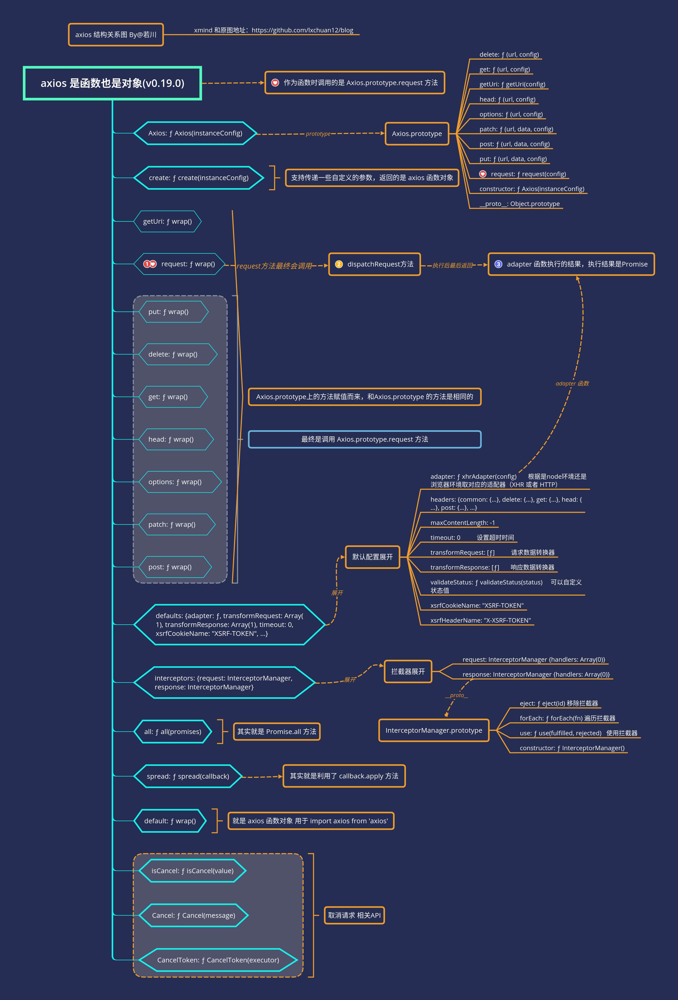
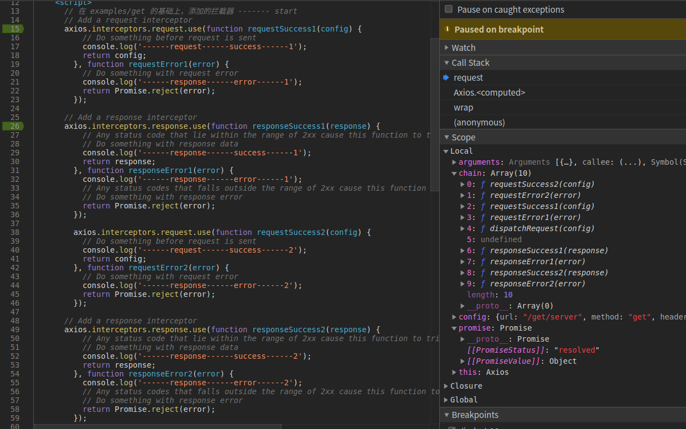
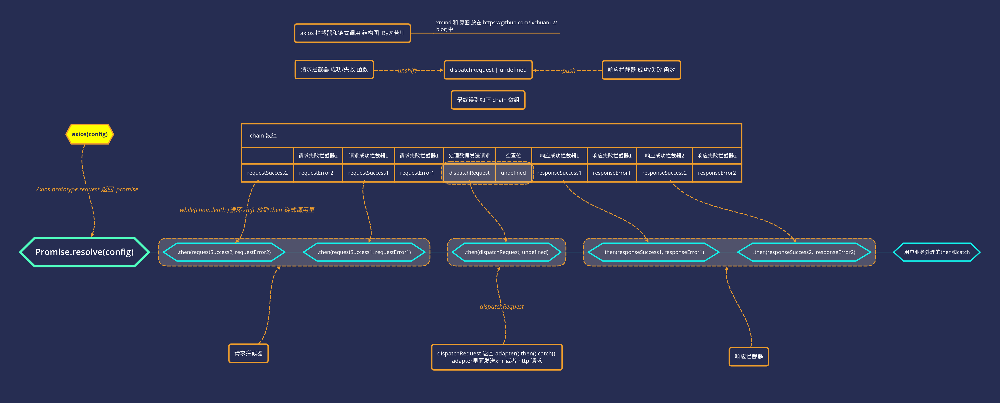
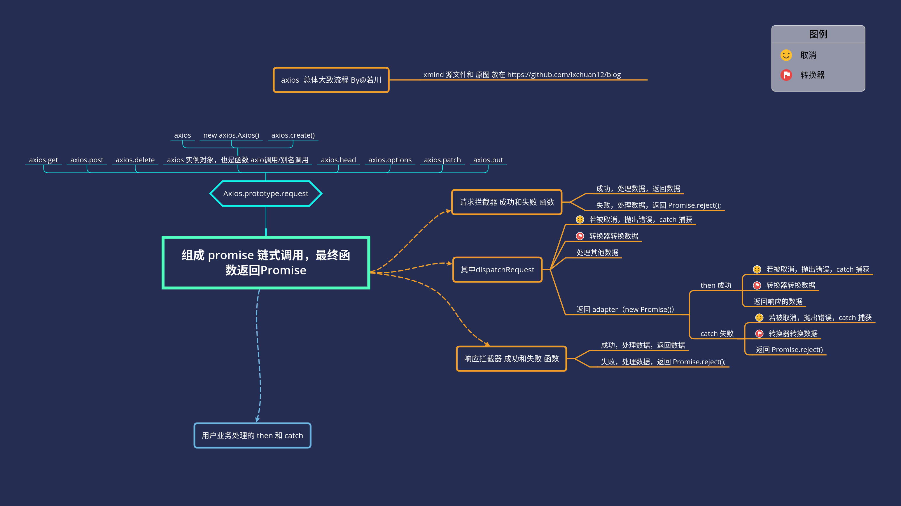

# 学习 axios 源码整体架构，打造属于自己的请求库

## 1. 前言

>你好，我是[若川](https://lxchuan12.gitee.io)。这是`学习源码整体架构系列`第六篇。整体架构这词语好像有点大，姑且就算是源码整体结构吧，主要就是学习是代码整体结构，不深究其他不是主线的具体函数的实现。本篇文章学习的是实际仓库的代码。

>**要是有人说到怎么读源码，正在读文章的你能推荐我的源码系列文章，那真是太好了**。

`学习源码整体架构系列`文章如下：
>1.[学习 jQuery 源码整体架构，打造属于自己的 js 类库](https://juejin.im/post/5d39d2cbf265da1bc23fbd42)<br>
>2.[学习 underscore 源码整体架构，打造属于自己的函数式编程类库](https://juejin.im/post/5d4bf94de51d453bb13b65dc)<br>
>3.[学习 lodash 源码整体架构，打造属于自己的函数式编程类库](https://juejin.im/post/5d767e1d6fb9a06b032025ea)<br>
>4.[学习 sentry 源码整体架构，打造属于自己的前端异常监控SDK](https://juejin.im/post/5dba5a39e51d452a2378348a)<br>
>5.[学习 vuex 源码整体架构，打造属于自己的状态管理库](https://juejin.im/post/5dd4e61a6fb9a05a5c010af0)<br>
>6.[学习 axios 源码整体架构，打造属于自己的请求库](https://juejin.im/post/5df349b5518825123751ba66)<br>
>7.[学习 koa 源码的整体架构，浅析koa洋葱模型原理和co原理](https://juejin.im/post/5e69925cf265da571e262fe6)<br>
>8.[学习 redux 源码整体架构，深入理解 redux 及其中间件原理](https://juejin.im/post/5ee63b7d51882542fc6265ad)

感兴趣的读者可以点击阅读。<br>
其他源码计划中的有：[`express`](https://github.com/lxchuan12/express-analysis)、[`vue-rotuer`](https://github.com/lxchuan12/vue-router-analysis)、[`react-redux`](https://github.com/lxchuan12/react-redux-analysis) 等源码，不知何时能写完（哭泣），欢迎持续关注我（若川）。

源码类文章，一般阅读量不高。已经有能力看懂的，自己就看了。不想看，不敢看的就不会去看源码。<br>
所以我的文章，尽量写得让想看源码又不知道怎么看的读者能看懂。

本文比较长，手机上阅读，可以划到有图的地方直接看文中的几张图即可。建议点赞或收藏后在电脑上阅读，按照文中调试方式自己调试或许更容易吸收消化。

**导读**<br>
文章详细介绍了 `axios` 调试方法。详细介绍了 `axios` 构造函数，拦截器，取消等功能的实现。最后还对比了其他请求库。

本文学习的版本是`v0.19.0`。克隆的官方仓库的`master`分支。
截至目前（2019年12月14日），最新一次`commit`是`2019-12-09 15:52 ZhaoXC` `dc4bc49673943e352`，`fix: fix ignore set withCredentials false (#2582)`。

本文仓库在这里[若川的 axios-analysis github 仓库](https://github.com/lxchuan12/axios-analysis)。求个`star`呀。

如果你是求职者，项目写了运用了`axios`，面试官可能会问你：
>1.为什么 `axios` 既可以当函数调用，也可以当对象使用，比如`axios({})`、`axios.get`。<br>
>2.简述 `axios` 调用流程。<br>
>3.有用过拦截器吗？原理是怎样的？<br>
>4.有使用`axios`的取消功能吗？是怎么实现的？<br>
>5.为什么支持浏览器中发送请求也支持`node`发送请求？<br>
诸如这类问题。

## 2. chrome 和 vscode 调试 axios 源码方法

前不久，笔者在知乎回答了一个问题[一年内的前端看不懂前端框架源码怎么办？](https://www.zhihu.com/question/350289336/answer/910970733)
推荐了一些资料，阅读量还不错，大家有兴趣可以看看。主要有四点：<br>
>1.借助调试<br>
>2.搜索查阅相关高赞文章<br>
>3.把不懂的地方记录下来，查阅相关文档<br>
>4.总结<br>

看源码，调试很重要，所以笔者详细写下 `axios` 源码调试方法，帮助一些可能不知道如何调试的读者。

### 2.1 chrome 调试浏览器环境的 axios

调试方法

`axios`打包后有`sourcemap`文件。

```bash
# 可以克隆笔者的这个仓库代码
git clone https://github.com/lxchuan12/axios-analysis.git
cd axios-analaysis/axios
npm install
npm start
# open [http://localhost:3000](http://localhost:3000)
# chrome F12 source 控制面板  webpack//   .  lib 目录下，根据情况自行断点调试
```

本文就是通过上述的例子`axios/sandbox/client.html`来调试的。

顺便简单提下调试`example`的例子，虽然文章最开始时写了这部分，后来又删了，最后想想还是写下。

找到文件`axios/examples/server.js`，修改代码如下：

```js
server = http.createServer(function (req, res) {
  var url = req.url;
  // 调试 examples
  console.log(url);
  // Process axios itself
  if (/axios\.min\.js$/.test(url)) {
    // 原来的代码 是 axios.min.js
    // pipeFileToResponse(res, '../dist/axios.min.js', 'text/javascript');
    pipeFileToResponse(res, '../dist/axios.js', 'text/javascript');
    return;
  }
  // 原来的代码 是 axios.min.map
  // if (/axios\.min.map$/.test(url)) {
  if (/axios\.map$/.test(url)) {
    // 原来的代码 是 axios.min.map
    // pipeFileToResponse(res, '../dist/axios.min.map', 'text/javascript');
    pipeFileToResponse(res, '../dist/axios.map', 'text/javascript');
    return;
  }
}
```

```bash
# 上述安装好依赖后
# npm run examples 不能同时开启，默认都是3000端口
# 可以指定端口 5000
# npm run examples ===  node ./examples/server.js
node ./examples/server.js -p 5000
```

打开[http://localhost:5000](http://localhost:5000)，然后就可以开心的在`Chrome`浏览器中调试`examples`里的例子了。

`axios` 是支持 `node` 环境发送请求的。接下来看如何用 `vscode` 调试 `node` 环境下的`axios`。

### 2.2 vscode 调试 node 环境的 axios

在根目录下 `axios-analysis/`
创建`.vscode/launch.json`文件如下：

```json
{
    // 使用 IntelliSense 了解相关属性。
    // 悬停以查看现有属性的描述。
    // 欲了解更多信息，请访问: https://go.microsoft.com/fwlink/?linkid=830387
    "version": "0.2.0",
    "configurations": [
        {
            "type": "node",
            "request": "launch",
            "name": "Launch Program",
            "program": "${workspaceFolder}/axios/sandbox/client.js",
            "skipFiles": [
                "<node_internals>/**"
            ]
        },
    ]
}
```

按`F5`开始调试即可，按照自己的情况，单步跳过`（F10）`、单步调试`（F11）`断点调试。

其实开源项目一般都有贡献指南`axios/CONTRIBUTING.md`，笔者只是把这个指南的基础上修改为引用`sourcemap`的文件可调试。

## 3. 先看 axios 结构是怎样的

```bash
git clone https://github.com/lxchuan12/axios-analysis.git
cd axios-analaysis/axios
npm install
npm start
```

按照上文说的调试方法， `npm start` 后，直接在 `chrome` 浏览器中调试。
打开 [http://localhost:3000](http://localhost:3000)，在控制台打印出`axios`，估计很多人都没打印出来看过。

```js
console.log({axios: axios});
```

层层点开来看，`axios` 的结构是怎样的，先有一个大概印象。

笔者画了一张比较详细的图表示。



看完结构图，如果看过`jQuery`、`underscore`和`lodash`源码，会发现其实跟`axios`源码设计类似。

`jQuery` 别名 `$`，`underscore` `loadsh` 别名 `_` 也既是函数，也是对象。比如`jQuery`使用方式。`$('#id')`, `$.ajax`。

接下来看具体源码的实现。可以跟着断点调试一下。

**断点调试要领：**<br>
**赋值语句可以一步跳过，看返回值即可，后续详细再看。**<br>
**函数执行需要断点跟着看，也可以结合注释和上下文倒推这个函数做了什么。**<br>

## 4. axios 源码 初始化

看源码第一步，先看`package.json`。一般都会申明 `main` 主入口文件。

```json
// package.json
{
  "name": "axios",
  "version": "0.19.0",
  "description": "Promise based HTTP client for the browser and node.js",
  "main": "index.js",
  // ...
}
```

主入口文件

```js
// index.js
module.exports = require('./lib/axios');
```

### 4.1 `lib/axios.js`主文件

`axios.js`文件 代码相对比较多。分为三部分展开叙述。

>1. 第一部分：引入一些工具函数`utils`、`Axios`构造函数、默认配置`defaults`等。<br>
>2. 第二部分：是生成实例对象 `axios`、`axios.Axios`、`axios.create`等。<br>
>3. 第三部分取消相关API实现，还有`all`、`spread`、导出等实现。<br>

#### 4.1.1 第一部分

引入一些工具函数`utils`、`Axios`构造函数、默认配置`defaults`等。

```js
// 第一部分：
// lib/axios
// 严格模式
'use strict';
// 引入 utils 对象，有很多工具方法。
var utils = require('./utils');
// 引入 bind 方法
var bind = require('./helpers/bind');
// 核心构造函数 Axios
var Axios = require('./core/Axios');
// 合并配置方法
var mergeConfig = require('./core/mergeConfig');
// 引入默认配置
var defaults = require('./defaults');
```

#### 4.1.2 第二部分

是生成实例对象 `axios`、`axios.Axios`、`axios.create`等。

```js
/**
 * Create an instance of Axios
 *
 * @param {Object} defaultConfig The default config for the instance
 * @return {Axios} A new instance of Axios
 */
function createInstance(defaultConfig) {
  // new 一个 Axios 生成实例对象
  var context = new Axios(defaultConfig);
  // bind 返回一个新的 wrap 函数，
  // 也就是为什么调用 axios 是调用 Axios.prototype.request 函数的原因
  var instance = bind(Axios.prototype.request, context);
  // Copy axios.prototype to instance
  // 复制 Axios.prototype 到实例上。
  // 也就是为什么 有 axios.get 等别名方法，
  // 且调用的是 Axios.prototype.get 等别名方法。
  utils.extend(instance, Axios.prototype, context);
  // Copy context to instance
  // 复制 context 到 intance 实例
  // 也就是为什么默认配置 axios.defaults 和拦截器  axios.interceptors 可以使用的原因
  // 其实是new Axios().defaults 和 new Axios().interceptors
  utils.extend(instance, context);
  // 最后返回实例对象，以上代码，在上文的图中都有体现。这时可以仔细看下上图。
  return instance;
}

// Create the default instance to be exported
// 导出 创建默认实例
var axios = createInstance(defaults);
// Expose Axios class to allow class inheritance
// 暴露 Axios class 允许 class 继承 也就是可以 new axios.Axios()
// 但  axios 文档中 并没有提到这个，我们平时也用得少。
axios.Axios = Axios;

// Factory for creating new instances
// 工厂模式 创建新的实例 用户可以自定义一些参数
axios.create = function create(instanceConfig) {
  return createInstance(mergeConfig(axios.defaults, instanceConfig));
};
```

这里简述下工厂模式。`axios.create`，也就是用户不需要知道内部是怎么实现的。<br>
举个生活的例子，我们买手机，不需要知道手机是怎么做的，就是工厂模式。<br>
看完第二部分，里面涉及几个工具函数，如`bind`、`extend`。接下来讲述这几个工具方法。<br>

#### 4.1.3 工具方法之 bind

`axios/lib/helpers/bind.js`

```js
'use strict';
// 返回一个新的函数 wrap
module.exports = function bind(fn, thisArg) {
  return function wrap() {
    var args = new Array(arguments.length);
    for (var i = 0; i < args.length; i++) {
      args[i] = arguments[i];
    }
    // 把 argument 对象放在数组 args 里
    return fn.apply(thisArg, args);
  };
};
```

传递两个参数函数和`thisArg`指向。<br>
把参数`arguments`生成数组，最后调用返回参数结构。<br>
其实现在 `apply` 支持 `arguments`这样的类数组对象了，不需要手动转数组。<br>
那么为啥作者要转数组，为了性能？当时不支持？抑或是作者不知道？这就不得而知了。有读者知道欢迎评论区告诉笔者呀。<br>

关于`apply`、`call`和`bind`等不是很熟悉的读者，可以看笔者的另一个`面试官问系列`。<br>
[面试官问：能否模拟实现JS的bind方法](https://juejin.im/post/5bec4183f265da616b1044d7)<br>

举个例子

```js
function fn(){
  console.log.apply(console, arguments);
}
fn(1,2,3,4,5,6, '若川');
// 1 2 3 4 5 6 '若川'
```

#### 4.1.4 工具方法之 utils.extend

`axios/lib/utils.js`

```js
function extend(a, b, thisArg) {
  forEach(b, function assignValue(val, key) {
    if (thisArg && typeof val === 'function') {
      a[key] = bind(val, thisArg);
    } else {
      a[key] = val;
    }
  });
  return a;
}
```

其实就是遍历参数 `b` 对象，复制到 `a` 对象上，如果是函数就是则用 `bind` 调用。

#### 4.1.5 工具方法之 utils.forEach

`axios/lib/utils.js`

遍历数组和对象。设计模式称之为迭代器模式。很多源码都有类似这样的遍历函数。比如大家熟知的`jQuery` `$.each`。

```js
/**
 * @param {Object|Array} obj The object to iterate
 * @param {Function} fn The callback to invoke for each item
 */
function forEach(obj, fn) {
  // Don't bother if no value provided
  // 判断 null 和 undefined 直接返回
  if (obj === null || typeof obj === 'undefined') {
    return;
  }

  // Force an array if not already something iterable
  // 如果不是对象，放在数组里。
  if (typeof obj !== 'object') {
    /*eslint no-param-reassign:0*/
    obj = [obj];
  }

  // 是数组 则用for 循环，调用 fn 函数。参数类似 Array.prototype.forEach 的前三个参数。
  if (isArray(obj)) {
    // Iterate over array values
    for (var i = 0, l = obj.length; i < l; i++) {
      fn.call(null, obj[i], i, obj);
    }
  } else {
    // Iterate over object keys
    // 用 for in 遍历对象，但 for in 会遍历原型链上可遍历的属性。
    // 所以用 hasOwnProperty 来过滤自身属性了。
    // 其实也可以用Object.keys来遍历，它不遍历原型链上可遍历的属性。
    for (var key in obj) {
      if (Object.prototype.hasOwnProperty.call(obj, key)) {
        fn.call(null, obj[key], key, obj);
      }
    }
  }
}
```

如果对`Object`相关的`API`不熟悉，可以查看笔者之前写过的一篇文章。[JavaScript 对象所有API解析](https://lxchuan12.gitee.io/js-object-api/)

#### 4.1.6 第三部分

取消相关API实现，还有`all`、`spread`、导出等实现。

```js
// Expose Cancel & CancelToken
// 导出 Cancel 和 CancelToken
axios.Cancel = require('./cancel/Cancel');
axios.CancelToken = require('./cancel/CancelToken');
axios.isCancel = require('./cancel/isCancel');

// Expose all/spread
// 导出 all 和 spread API
axios.all = function all(promises) {
  return Promise.all(promises);
};
axios.spread = require('./helpers/spread');

module.exports = axios;

// Allow use of default import syntax in TypeScript
// 也就是可以以下方式引入
// import axios from 'axios';
module.exports.default = axios;
```

这里介绍下 `spread`，取消的`API`暂时不做分析，后文再详细分析。

假设你有这样的需求。

```js
function f(x, y, z) {}
var args = [1, 2, 3];
f.apply(null, args);
```

那么可以用`spread`方法。用法：

```js
axios.spread(function(x, y, z) {})([1, 2, 3]);
```

实现也比较简单。源码实现：

```js
/**
 * @param {Function} callback
 * @returns {Function}
 */
module.exports = function spread(callback) {
  return function wrap(arr) {
    return callback.apply(null, arr);
  };
};
```

上文`var context = new Axios(defaultConfig);`，接下来介绍核心构造函数`Axios`。

### 4.2 核心构造函数 Axios

`axios/lib/core/Axios.js`

构造函数`Axios`。

```js
function Axios(instanceConfig) {
  // 默认参数
  this.defaults = instanceConfig;
  // 拦截器 请求和响应拦截器
  this.interceptors = {
    request: new InterceptorManager(),
    response: new InterceptorManager()
  };
}
```

```js
Axios.prototype.request = function(config){
  // 省略，这个是核心方法，后文结合例子详细描述
  // code ...
  var promise = Promise.resolve(config);
  // code ...
  return promise;
}
// 这是获取 Uri 的函数，这里省略
Axios.prototype.getUri = function(){}
// 提供一些请求方法的别名
// Provide aliases for supported request methods
// 遍历执行
// 也就是为啥我们可以 axios.get 等别名的方式调用，而且调用的是 Axios.prototype.request 方法
// 这个也在上面的 axios 结构图上有所体现。
utils.forEach(['delete', 'get', 'head', 'options'], function forEachMethodNoData(method) {
  /*eslint func-names:0*/
  Axios.prototype[method] = function(url, config) {
    return this.request(utils.merge(config || {}, {
      method: method,
      url: url
    }));
  };
});

utils.forEach(['post', 'put', 'patch'], function forEachMethodWithData(method) {
  /*eslint func-names:0*/
  Axios.prototype[method] = function(url, data, config) {
    return this.request(utils.merge(config || {}, {
      method: method,
      url: url,
      data: data
    }));
  };
});

module.exports = Axios;
```

接下来看拦截器部分。

### 4.3 拦截器管理构造函数 InterceptorManager

请求前拦截，和请求后拦截。<br>
在`Axios.prototype.request`函数里使用，具体怎么实现的拦截的，后文配合例子详细讲述。<br>

[axios github 仓库 拦截器文档](https://github.com/axios/axios#interceptors)

如何使用：

```js
// Add a request interceptor
// 添加请求前拦截器
axios.interceptors.request.use(function (config) {
  // Do something before request is sent
  return config;
}, function (error) {
  // Do something with request error
  return Promise.reject(error);
});

// Add a response interceptor
// 添加请求后拦截器
axios.interceptors.response.use(function (response) {
  // Any status code that lie within the range of 2xx cause this function to trigger
  // Do something with response data
  return response;
}, function (error) {
  // Any status codes that falls outside the range of 2xx cause this function to trigger
  // Do something with response error
  return Promise.reject(error);
});
```

如果想把拦截器移除，可以用`eject`方法。

```js
const myInterceptor = axios.interceptors.request.use(function () {/*...*/});
axios.interceptors.request.eject(myInterceptor);
```

拦截器也可以添加自定义的实例上。

```js
const instance = axios.create();
instance.interceptors.request.use(function () {/*...*/});
```

源码实现：

构造函数，`handles` 用于存储拦截器函数。

```js
function InterceptorManager() {
  this.handlers = [];
}
```

接下来声明了三个方法：使用、移除、遍历。

#### 4.3.1 InterceptorManager.prototype.use 使用

传递两个函数作为参数，数组中的一项存储的是`{fulfilled: function(){}, rejected: function(){}}`。返回数字 `ID`，用于移除拦截器。

```js
/**
 * @param {Function} fulfilled The function to handle `then` for a `Promise`
 * @param {Function} rejected The function to handle `reject` for a `Promise`
 *
 * @return {Number} 返回ID 是为了用 eject 移除
 */
InterceptorManager.prototype.use = function use(fulfilled, rejected) {
  this.handlers.push({
    fulfilled: fulfilled,
    rejected: rejected
  });
  return this.handlers.length - 1;
};
```

#### 4.3.2 InterceptorManager.prototype.eject 移除

根据 `use` 返回的 `ID` 移除 拦截器。

```js
/**
 * @param {Number} id The ID that was returned by `use`
 */
InterceptorManager.prototype.eject = function eject(id) {
  if (this.handlers[id]) {
    this.handlers[id] = null;
  }
};
```

有点类似定时器`setTimeout` 和 `setInterval`，返回值是`id`。用`clearTimeout` 和`clearInterval`来清除定时器。

```js
// 提一下 定时器回调函数是可以传参的，返回值 timer 是数字
var timer = setInterval((name) => {
  console.log(name);
}, 1000, '若川');
console.log(timer); // 数字 ID
// 在控制台等会再输入执行这句，定时器就被清除了
clearInterval(timer);
```

#### 4.3.3 InterceptorManager.prototype.forEach 遍历

遍历执行所有拦截器，传递一个回调函数（每一个拦截器函数作为参数）调用，被移除的一项是`null`，所以不会执行，也就达到了移除的效果。

```js
/**
 * @param {Function} fn The function to call for each interceptor
 */
InterceptorManager.prototype.forEach = function forEach(fn) {
  utils.forEach(this.handlers, function forEachHandler(h) {
    if (h !== null) {
      fn(h);
    }
  });
};
```

## 5. 实例结合

上文叙述的调试时运行`npm start` 是用`axios/sandbox/client.html`路径的文件作为示例的，读者可以自行调试。

以下是一段这个文件中的代码。

```js
axios(options)
.then(function (res) {
  response.innerHTML = JSON.stringify(res.data, null, 2);
})
.catch(function (res) {
  response.innerHTML = JSON.stringify(res.data, null, 2);
});
```

### 5.1 先看调用栈流程

如果不想一步步调试，有个偷巧的方法。<br>
知道 `axios` 使用了`XMLHttpRequest`。<br>
可以在项目中搜索：`new XMLHttpRequest`。<br>
定位到文件 `axios/lib/adapters/xhr.js`<br>
在这条语句 `var request = new XMLHttpRequest();`<br>
`chrome` 浏览器中 打个断点调试下，再根据调用栈来细看具体函数等实现。<br>

`Call Stack`

```bash
dispatchXhrRequest (xhr.js:19)
xhrAdapter (xhr.js:12)
dispatchRequest (dispatchRequest.js:60)
Promise.then (async)
request (Axios.js:54)
wrap (bind.js:10)
submit.onclick ((index):138)
```

简述下流程：<br>
1. `Send Request` 按钮点击 `submit.onclick`<br>
2. 调用 `axios` 函数实际上是调用 `Axios.prototype.request` 函数，而这个函数使用 `bind` 返回的一个名为`wrap`的函数。<br>
3. 调用 `Axios.prototype.request`<br>
4. （有请求拦截器的情况下执行请求拦截器），中间会执行 `dispatchRequest`方法<br>
5. `dispatchRequest` 之后调用 `adapter (xhrAdapter)`<br>
6. 最后调用 `Promise` 中的函数`dispatchXhrRequest`，（有响应拦截器的情况下最后会再调用响应拦截器）<br>

如果仔细看了文章开始的`axios 结构关系图`，其实对这个流程也有大概的了解。

接下来看 `Axios.prototype.request` 具体实现。

### 5.2 Axios.prototype.request 请求核心方法

这个函数是核心函数。
主要做了这几件事：
>1.判断第一个参数是字符串，则设置 url,也就是支持`axios('example/url', [, config])`，也支持`axios({})`。<br>
>2.合并默认参数和用户传递的参数<br>
>3.设置请求的方法，默认是是`get`方法<br>
>4.将用户设置的请求和响应拦截器、发送请求的`dispatchRequest`组成`Promise`链，最后返回还是`Promise`实例。<br>
    也就是保证了请求前拦截器先执行，然后发送请求，再响应拦截器执行这样的顺序。<br>
    也就是为啥最后还是可以`then`，`catch`方法的缘故。<br>

```js
Axios.prototype.request = function request(config) {
  /*eslint no-param-reassign:0*/
  // Allow for axios('example/url'[, config]) a la fetch API
  // 这一段代码 其实就是 使 axios('example/url', [, config])
  // config 参数可以省略
  if (typeof config === 'string') {
    config = arguments[1] || {};
    config.url = arguments[0];
  } else {
    config = config || {};
  }

  // 合并默认参数和用户传递的参数
  config = mergeConfig(this.defaults, config);

  // Set config.method
  // 设置 请求方法，默认 get 。
  if (config.method) {
    config.method = config.method.toLowerCase();
  } else if (this.defaults.method) {
    config.method = this.defaults.method.toLowerCase();
  } else {
    config.method = 'get';
  }
  // Hook up interceptors middleware
  // 组成`Promise`链 这段拆开到后文再讲述
};
```

#### 5.2.1 组成`Promise`链，返回`Promise`实例

>这部分：用户设置的请求和响应拦截器、发送请求的`dispatchRequest`组成`Promise`链。也就是保证了请求前拦截器先执行，然后发送请求，再响应拦截器执行这样的顺序<br>
    也就是保证了请求前拦截器先执行，然后发送请求，再响应拦截器执行这样的顺序<br>
    也就是为啥最后还是可以`then`，`catch`方法的缘故。<br>

如果读者对`Promise`不熟悉，建议读阮老师的书籍《ES6 标准入门》。 
[阮一峰老师 的 ES6 Promise-resolve](http://es6.ruanyifeng.com/#docs/promise#Promise-resolve) 和 [JavaScript Promise迷你书（中文版）](http://liubin.org/promises-book/)

```js
  // 组成`Promise`链
  // Hook up interceptors middleware
  // 把 xhr 请求 的 dispatchRequest 和 undefined 放在一个数组里
  var chain = [dispatchRequest, undefined];
  // 创建 Promise 实例
  var promise = Promise.resolve(config);

 // 遍历用户设置的请求拦截器 放到数组的 chain 前面
  this.interceptors.request.forEach(function unshiftRequestInterceptors(interceptor) {
    chain.unshift(interceptor.fulfilled, interceptor.rejected);
  });

 // 遍历用户设置的响应拦截器 放到数组的 chain 后面
  this.interceptors.response.forEach(function pushResponseInterceptors(interceptor) {
    chain.push(interceptor.fulfilled, interceptor.rejected);
  });

 // 遍历 chain 数组，直到遍历 chain.length 为 0
  while (chain.length) {
    // 两两对应移出来 放到 then 的两个参数里。
    promise = promise.then(chain.shift(), chain.shift());
  }

  return promise;
```

```js
var promise = Promise.resolve(config);
```

解释下这句。作用是生成`Promise`实例。

```js
var promise = Promise.resolve({name: '若川'})
// 等价于
// new Promise(resolve => resolve({name: '若川'}))
promise.then(function (config){
  console.log(config)
});
// {name: "若川"}
```

同样解释下后文会出现的`Promise.reject(error);`：

```js
Promise.reject(error);
```

```js
var promise = Promise.reject({name: '若川'})
// 等价于
// new Promise(reject => reject({name: '若川'}))

// promise.then(null, function (config){
//   console.log(config)
// });
// 等价于
promise.catch(function (config){
  console.log(config)
});
// {name: "若川"}
```

接下来结合例子，来理解这段代码。<br>
很遗憾，在`example`文件夹没有拦截器的例子。笔者在`example`中在`example/get`的基础上添加了一个拦截器的示例。`axios/examples/interceptors`，便于读者调试。

```bash
node ./examples/server.js -p 5000
```

`promise = promise.then(chain.shift(), chain.shift());`这段代码打个断点。

会得到这样的这张图。


特别关注下，右侧，`local`中的`chain`数组。也就是这样的结构。

```js
var chain = [
  '请求成功拦截2', '请求失败拦截2',  
  '请求成功拦截1', '请求失败拦截1',  
  dispatch,  undefined,
  '响应成功拦截1', '响应失败拦截1',
  '响应成功拦截2', '响应失败拦截2',
]
```

这段代码相对比较绕。也就是会生成如下类似的代码，中间会调用`dispatchRequest`方法。

```js
// config 是 用户配置和默认配置合并的
var promise = Promise.resolve(config);
promise.then('请求成功拦截2', '请求失败拦截2')
.then('请求成功拦截1', '请求失败拦截1')
.then(dispatchRequest, undefined)
.then('响应成功拦截1', '响应失败拦截1')
.then('响应成功拦截2', '响应失败拦截2')

.then('用户写的业务处理函数')
.catch('用户写的报错业务处理函数');
```

这里提下`promise` `then`和`catch`知识：<br>
`Promise.prototype.then`方法的第一个参数是`resolved`状态的回调函数，第二个参数（可选）是`rejected`状态的回调函数。所以是成对出现的。<br>
`Promise.prototype.catch`方法是`.then(null, rejection)`或`.then(undefined, rejection)`的别名，用于指定发生错误时的回调函数。<br>
`then`方法返回的是一个新的`Promise`实例（注意，不是原来那个`Promise`实例）。因此可以采用链式写法，即`then`方法后面再调用另一个`then`方法。<br>

结合上述的例子更详细一点，代码则是这样的。

```js
var promise = Promise.resolve(config);
// promise.then('请求成功拦截2', '请求失败拦截2')
promise.then(function requestSuccess2(config) {
  console.log('------request------success------2');
  return config;
}, function requestError2(error) {
  console.log('------response------error------2');
  return Promise.reject(error);
})

// .then('请求成功拦截1', '请求失败拦截1')
.then(function requestSuccess1(config) {
  console.log('------request------success------1');
  return config;
}, function requestError1(error) {
  console.log('------response------error------1');
  return Promise.reject(error);
})

// .then(dispatchRequest, undefined)
.then( function dispatchRequest(config) {
  /**
    * 适配器返回的也是Promise 实例
      adapter = function xhrAdapter(config) {
            return new Promise(function dispatchXhrRequest(resolve, reject) {})
      }
    **/
  return adapter(config).then(function onAdapterResolution(response) {
    // 省略代码 ...
    return response;
  }, function onAdapterRejection(reason) {
    // 省略代码 ...
    return Promise.reject(reason);
  });
}, undefined)

// .then('响应成功拦截1', '响应失败拦截1')
.then(function responseSuccess1(response) {
  console.log('------response------success------1');
  return response;
}, function responseError1(error) {
  console.log('------response------error------1');
  return Promise.reject(error);
})

// .then('响应成功拦截2', '响应失败拦截2')
.then(function responseSuccess2(response) {
  console.log('------response------success------2');
  return response;
}, function responseError2(error) {
  console.log('------response------error------2');
  return Promise.reject(error);
})

// .then('用户写的业务处理函数')
// .catch('用户写的报错业务处理函数');
.then(function (response) {
  console.log('哈哈哈，终于获取到数据了', response);
})
.catch(function (err) {
  console.log('哎呀，怎么报错了', err);
});
```

仔细看这段`Promise`链式调用，代码都类似。`then`方法最后返回的参数，就是下一个`then`方法第一个参数。<br>
`catch`错误捕获，都返回`Promise.reject(error)`，这是为了便于用户`catch`时能捕获到错误。

举个例子：

```js
var p1 = new Promise((resolve, reject) => {
 reject(new Error({name: '若川'}));
});

p1.catch(err => {
    console.log(res, 'err');
    return Promise.reject(err)
})
.catch(err => {
 console.log(err, 'err1');
})
.catch(err => {
 console.log(err, 'err2');
});
```

`err2`不会捕获到，也就是不会执行，但如果都返回了`return Promise.reject(err)`，则可以捕获到。

最后画个图总结下 `Promise` 链式调用。



>小结：1. 请求和响应的拦截器可以写`Promise`。<br>
>2. 如果设置了多个请求响应器，后设置的先执行。<br>
>3. 如果设置了多个响应拦截器，先设置的先执行。<br>

`dispatchRequest(config)` 这里的`config`是请求成功拦截器返回的。接下来看`dispatchRequest`函数。

### 5.3 dispatchRequest 最终派发请求

这个函数主要做了如下几件事情：<br>
>1.如果已经取消，则 `throw` 原因报错，使`Promise`走向`rejected`。<br>
>2.确保 `config.header` 存在。<br>
>3.利用用户设置的和默认的请求转换器转换数据。<br>
>4.拍平 `config.header`。<br>
>5.删除一些 `config.header`。<br>
>6.返回适配器`adapter`（`Promise`实例）执行后 `then`执行后的 `Promise`实例。返回结果传递给响应拦截器处理。<br>

```js
'use strict';
// utils 工具函数
var utils = require('./../utils');
// 转换数据
var transformData = require('./transformData');
// 取消状态
var isCancel = require('../cancel/isCancel');
// 默认参数
var defaults = require('../defaults');

/**
 * 抛出 错误原因，使`Promise`走向`rejected`
 */
function throwIfCancellationRequested(config) {
  if (config.cancelToken) {
    config.cancelToken.throwIfRequested();
  }
}

/**
 * Dispatch a request to the server using the configured adapter.
 *
 * @param {object} config The config that is to be used for the request
 * @returns {Promise} The Promise to be fulfilled
 */
module.exports = function dispatchRequest(config) {
  // 取消相关
  throwIfCancellationRequested(config);

  // Ensure headers exist
  // 确保 headers 存在
  config.headers = config.headers || {};

  // Transform request data
  // 转换请求的数据
  config.data = transformData(
    config.data,
    config.headers,
    config.transformRequest
  );

  // Flatten headers
  // 拍平 headers
  config.headers = utils.merge(
    config.headers.common || {},
    config.headers[config.method] || {},
    config.headers || {}
  );

  // 以下这些方法 删除 headers
  utils.forEach(
    ['delete', 'get', 'head', 'post', 'put', 'patch', 'common'],
    function cleanHeaderConfig(method) {
      delete config.headers[method];
    }
  );
  // adapter 适配器部分 拆开 放在下文讲
};
```

#### 5.3.1 dispatchRequest 之 transformData 转换数据

上文的代码里有个函数 `transformData` ，这里解释下。其实就是遍历传递的函数数组 对数据操作，最后返回数据。

`axios.defaults.transformResponse` 数组中默认就有一个函数，所以使用`concat`链接自定义的函数。

使用：

文件路径
`axios/examples/transform-response/index.html`

这段代码其实就是对时间格式的字符串转换成时间对象，可以直接调用`getMonth`等方法。

```js
var ISO_8601 = /(\d{4}-\d{2}-\d{2})T(\d{2}:\d{2}:\d{2})Z/;
function formatDate(d) {
  return (d.getMonth() + 1) + '/' + d.getDate() + '/' + d.getFullYear();
}

axios.get('https://api.github.com/users/mzabriskie', {
  transformResponse: axios.defaults.transformResponse.concat(function (data, headers) {
    Object.keys(data).forEach(function (k) {
      if (ISO_8601.test(data[k])) {
        data[k] = new Date(Date.parse(data[k]));
      }
    });
    return data;
  })
})
.then(function (res) {
  document.getElementById('created').innerHTML = formatDate(res.data.created_at);
});
```

源码：

就是遍历数组，调用数组里的传递 `data` 和 `headers` 参数调用函数。

```js
module.exports = function transformData(data, headers, fns) {
  /*eslint no-param-reassign:0*/
  utils.forEach(fns, function transform(fn) {
    data = fn(data, headers);
  });

  return data;
};
```

#### 5.3.2 dispatchRequest 之 adapter 适配器执行部分

适配器，在设计模式中称之为适配器模式。讲个生活中简单的例子，大家就容易理解。

我们常用以前手机耳机孔都是圆孔，而现在基本是耳机孔和充电接口合二为一。统一为`typec`。

这时我们需要需要一个`typec转圆孔的转接口`，这就是适配器。

```js
  // adapter 适配器部分
  var adapter = config.adapter || defaults.adapter;

  return adapter(config).then(function onAdapterResolution(response) {
    throwIfCancellationRequested(config);

    // Transform response data
    // 转换响应的数据
    response.data = transformData(
      response.data,
      response.headers,
      config.transformResponse
    );

    return response;
  }, function onAdapterRejection(reason) {
    if (!isCancel(reason)) {
      // 取消相关
      throwIfCancellationRequested(config);

      // Transform response data
      // 转换响应的数据
      if (reason && reason.response) {
        reason.response.data = transformData(
          reason.response.data,
          reason.response.headers,
          config.transformResponse
        );
      }
    }

    return Promise.reject(reason);
  });
```

接下来看具体的 `adapter`。

### 5.4 adapter 适配器 真正发送请求

```js
var adapter = config.adapter || defaults.adapter;
```

看了上文的 `adapter`，可以知道支持用户自定义。比如可以通过微信小程序 `wx.request` 按照要求也写一个 `adapter`。<br>
接着来看下 `defaults.ddapter`。<br>
文件路径：`axios/lib/defaults.js`

根据当前环境引入，如果是浏览器环境引入`xhr`，是`node`环境则引入`http`。<br>
类似判断`node`环境，也在[`sentry-javascript`](https://github.com/getsentry/sentry-javascript/blob/a876d46c61e2618e3c3a3e1710f77419331a9248/packages/utils/src/misc.ts#L37-L40)源码中有看到。<br>

```js
function getDefaultAdapter() {
  var adapter;
  // 根据 XMLHttpRequest 判断
  if (typeof XMLHttpRequest !== 'undefined') {
    // For browsers use XHR adapter
    adapter = require('./adapters/xhr');
    // 根据 process 判断
  } else if (typeof process !== 'undefined' && Object.prototype.toString.call(process) === '[object process]') {
    // For node use HTTP adapter
    adapter = require('./adapters/http');
  }
  return adapter;
}
var defaults = {
  adapter: getDefaultAdapter(),
  // ...
};
```

`xhr`

接下来就是我们熟悉的 `XMLHttpRequest` 对象。

可能读者不了解可以参考[XMLHttpRequest MDN 文档](https://developer.mozilla.org/zh-CN/docs/Web/API/XMLHttpRequest)。

主要提醒下：`onabort`是请求取消事件，`withCredentials`是一个布尔值，用来指定跨域 `Access-Control` 请求是否应带有授权信息，如 `cookie` 或授权 `header` 头。

这块代码有删减，具体可以看[若川的`axios-analysis`仓库](https://github.com/lxchuan12/axios-analysis/blob/master/axios/lib/adapters/xhr.js)，也可以克隆笔者的`axios-analysis`仓库调试时再具体分析。

```js
module.exports = function xhrAdapter(config) {
  return new Promise(function dispatchXhrRequest(resolve, reject) {
    // 这块代码有删减
    var request = new XMLHttpRequest();
    request.open()
    request.timeout = config.timeout;
    // 监听 state 改变
    request.onreadystatechange = function handleLoad() {
      if (!request || request.readyState !== 4) {
        return;
      }
      // ...
    }
    // 取消
    request.onabort = function(){};
    // 错误
    request.onerror = function(){};
    // 超时
    request.ontimeout = function(){};
    // cookies 跨域携带 cookies 面试官常喜欢考这个
    // 一个布尔值，用来指定跨域 Access-Control 请求是否应带有授权信息，如 cookie 或授权 header 头。
    // Add withCredentials to request if needed
    if (!utils.isUndefined(config.withCredentials)) {
      request.withCredentials = !!config.withCredentials;
    }

    // 上传下载进度相关
    // Handle progress if needed
    if (typeof config.onDownloadProgress === 'function') {
      request.addEventListener('progress', config.onDownloadProgress);
    }

    // Not all browsers support upload events
    if (typeof config.onUploadProgress === 'function' && request.upload) {
      request.upload.addEventListener('progress', config.onUploadProgress);
    }

    // Send the request
    // 发送请求
    request.send(requestData);
  });
}
```

而实际上现在 [`fetch`](https://developer.mozilla.org/zh-CN/docs/Web/API/Fetch_API/Using_Fetch) 支持的很好了，阿里开源的 [umi-request](https://github.com/umijs/umi-request/blob/master/README_zh-CN.md) 请求库，就是用`fetch`封装的，而不是用`XMLHttpRequest`。
文章末尾，大概讲述下 `umi-request` 和 `axios` 的区别。

`http`

`http`这里就不详细叙述了，感兴趣的读者可以自行查看，[若川的`axios-analysis`仓库](https://github.com/lxchuan12/axios-analysis/blob/master/axios/lib/adapters/http.js)。

```js
module.exports = function httpAdapter(config) {
  return new Promise(function dispatchHttpRequest(resolvePromise, rejectPromise) {
  });
};
```

上文 `dispatchRequest` 有取消模块，我觉得是重点，所以放在最后来细讲：

### 5.5 dispatchRequest 之 取消模块

可以使用`cancel token`取消请求。

axios cancel token API 是基于撤销的 `promise` 取消提议。

The axios cancel token API is based on the withdrawn [cancelable promises proposal.](https://github.com/tc39/proposal-cancelable-promises)

[axios 文档 cancellation](https://github.com/axios/axios#cancellation)

文档上详细描述了两种使用方式。

很遗憾，在`example`文件夹也没有取消的例子。笔者在`example`中在`example/get`的基础上添加了一个取消的示例。`axios/examples/cancel`，便于读者调试。

```bash
node ./examples/server.js -p 5000
```

`request`中的拦截器和`dispatch`中的取消这两个模块相对复杂，可以多调试调试，吸收消化。

```js
const CancelToken = axios.CancelToken;
const source = CancelToken.source();

axios.get('/get/server', {
  cancelToken: source.token
}).catch(function (err) {
  if (axios.isCancel(err)) {
    console.log('Request canceled', err.message);
  } else {
    // handle error
  }
});

// cancel the request (the message parameter is optional)
// 取消函数。
source.cancel('哎呀，我被若川取消了');
```

#### 5.5.1 取消请求模块代码示例

结合源码取消流程大概是这样的。这段放在代码在`axios/examples/cancel-token/index.html`。

参数的 `config.cancelToken` 是触发了`source.cancel('哎呀，我被若川取消了');`才生成的。

```js
// source.cancel('哎呀，我被若川取消了');
// 点击取消时才会 生成 cancelToken 实例对象。
// 点击取消后，会生成原因，看懂了这段在看之后的源码，可能就好理解了。
var config = {
  name: '若川',
  // 这里简化了
  cancelToken: {
        promise: new Promise(function(resolve){
            resolve({ message: '哎呀，我被若川取消了'})
        }),
        reason: { message: '哎呀，我被若川取消了' }
  },
};
// 取消 抛出异常方法
function throwIfCancellationRequested(config){
  // 取消的情况下执行这句
  if(config.cancelToken){
    //   这里源代码 便于执行，我改成具体代码
    // config.cancelToken.throwIfRequested();
    // if (this.reason) {
    //     throw this.reason;
    //   }
    if(config.cancelToken.reason){
        throw config.cancelToken.reason;
    }
  }
}

function dispatchRequest(config){
  // 有可能是执行到这里就取消了，所以抛出错误会被err2 捕获到
  throwIfCancellationRequested(config);
  //  adapter xhr适配器
  return new Promise((resovle, reject) => {
    var request = new XMLHttpRequest();
    console.log('request', request);
    if (config.cancelToken) {
        // Handle cancellation
        config.cancelToken.promise.then(function onCanceled(cancel) {
            if (!request) {
                return;
            }

            request.abort();
            reject(cancel);
            // Clean up request
            request = null;
        });
    }
  })
  .then(function(res){
    // 有可能是执行到这里就才取消 取消的情况下执行这句
    throwIfCancellationRequested(config);
    console.log('res', res);
    return res;
  })
  .catch(function(reason){
    // 有可能是执行到这里就才取消 取消的情况下执行这句
    throwIfCancellationRequested(config);
    console.log('reason', reason);
    return Promise.reject(reason);
  });
}

var promise = Promise.resolve(config);

// 没设置拦截器的情况下是这样的
promise
.then(dispatchRequest, undefined)
// 用户定义的then 和 catch
.then(function(res){
  console.log('res1', res);
  return res;
})
.catch(function(err){
  console.log('err2', err);
  return Promise.reject(err);
});
// err2 {message: "哎呀，我被若川取消了"}
```

#### 5.5.2 接下来看取消模块的源码

看如何通过生成`config.cancelToken`。

文件路径：

`axios/lib/cancel/CancelToken.js`

```js
const CancelToken = axios.CancelToken;
const source = CancelToken.source();
source.cancel('哎呀，我被若川取消了');
```

由示例看 `CancelToken.source`的实现，

```js
CancelToken.source = function source() {
  var cancel;
  var token = new CancelToken(function executor(c) {
    cancel = c;
  });
  // token
  return {
    token: token,
    cancel: cancel
  };
};
```

执行后`source`的大概结构是这样的。

```js
{
    token: {
    promise: new Promise(function(resolve){
      resolve({ message: '哎呀，我被若川取消了'})
    }),
    reason: { message: '哎呀，我被若川取消了' }
  },
  cancel: function cancel(message) {
    if (token.reason) {
      // Cancellation has already been requested
      // 已经取消
      return;
    }
    token.reason = {message: '哎呀，我被若川取消了'};
  }
}
```

接着看 `new CancelToken`

```js
// CancelToken
// 通过 CancelToken 来取消请求操作
function CancelToken(executor) {
  if (typeof executor !== 'function') {
    throw new TypeError('executor must be a function.');
  }

  var resolvePromise;
  this.promise = new Promise(function promiseExecutor(resolve) {
    resolvePromise = resolve;
  });

  var token = this;
  executor(function cancel(message) {
    if (token.reason) {
      // Cancellation has already been requested
      // 已经取消
      return;
    }

    token.reason = new Cancel(message);
    resolvePromise(token.reason);
  });
}

module.exports = CancelToken;
```

发送请求的适配器里是这样使用的。

```js
// xhr
if (config.cancelToken) {
  // Handle cancellation
  config.cancelToken.promise.then(function onCanceled(cancel) {
    if (!request) {
      return;
    }

    request.abort();
    reject(cancel);
    // Clean up request
    request = null;
  });
}
```

`dispatchRequest` 中的`throwIfCancellationRequested`具体实现：throw 抛出异常。

```js
// 抛出异常函数
function throwIfCancellationRequested(config) {
  if (config.cancelToken) {
    config.cancelToken.throwIfRequested();
  }
}
// 抛出异常 用户 { message: '哎呀，我被若川取消了' }
CancelToken.prototype.throwIfRequested = function throwIfRequested() {
  if (this.reason) {
    throw this.reason;
  }
};
```

取消流程调用栈
>1.source.cancel()<br>
>2.resolvePromise(token.reason);<br>
>3.config.cancelToken.promise.then(function onCanceled(cancel) {})<br>

最后进入`request.abort();``reject(cancel);`

到这里取消的流程就介绍完毕了。主要就是通过传递配置参数`cancelToken`，取消时才会生成`cancelToken`，判断有，则抛出错误，使`Promise` 走向`rejected`，让用户捕获到消息{message: '用户设置的取消信息'}。

文章写到这里就基本到接近尾声了。

能读到最后，说明你已经超过很多人啦^_^

`axios`是非常优秀的请求库，但肯定也不能满足所有开发者的需求，接下来对比下其他库，看看其他开发者有什么具体需求。

## 6. 对比其他请求库

### 6.1 KoAjax

FCC成都社区负责人水歌开源的[KoAJAX](https://github.com/EasyWebApp/KoAJAX)。

[如何用开源软件办一场技术大会？](https://mp.weixin.qq.com/s/hxCwiokl4uPXJscTQi42-A)
以下这篇文章中摘抄的一段。
>前端请求库 —— KoAJAX
>国内前端同学最常用的 HTTP 请求库应该是 axios 了吧？虽然它的 Interceptor（拦截器）API 是 .use()，但和 Node.js 的 Express、Koa 等框架的中间件模式完全不同，相比 jQuery .ajaxPrefilter()、dataFilter() 并没什么实质改进；上传、下载进度比 jQuery.Deferred() 还简陋，只是两个专门的回调选项。所以，它还是要对特定的需求记忆特定的 API，不够简洁。

>幸运的是，水歌在研究如何[用 ES 2018 异步迭代器实现一个类 Koa 中间件引擎](https://tech-query.me/onion-stack/)的过程中，做出了一个更有实际价值的上层应用 —— KoAJAX。它的整个执行过程基于 Koa 式的中间件，而且它自己就是一个中间件调用栈。除了 RESTful API 常用的 .get()、.post()、.put()、.delete() 等快捷方法外，开发者就只需记住 .use() 和 next()，其它都是 ES 标准语法和 TS 类型推导。

### 6.2 umi-request 阿里开源的请求库

[umi-request github 仓库](https://github.com/umijs/umi-request/blob/master/README_zh-CN.md)

`umi-request` 与 `fetch`, `axios` 异同。


不得不说，`umi-request` 确实强大，有兴趣的读者可以阅读下其源码。

看懂`axios`的基础上，看懂`umi-request`源码应该不难。

比如 `umi-request` 取消模块代码几乎与`axios`一模一样。

## 7. 总结

文章详细介绍了 `axios` 调试方法。详细介绍了 `axios` 构造函数，拦截器，取消等功能的实现。最后还对比了其他请求库。

最后画个图总结一下axios的总体大致流程。



解答下文章开头提的问题：

如果你是求职者，项目写了运用了`axios`，面试官可能会问你：
>1.为什么 `axios` 既可以当函数调用，也可以当对象使用，比如`axios({})`、`axios.get`。<br>
答：`axios`本质是函数，赋值了一些别名方法，比如`get`、`post`方法，可被调用，最终调用的还是`Axios.prototype.request`函数。<br>
>2.简述 `axios` 调用流程。<br>
答：实际是调用的`Axios.prototype.request`方法，最终返回的是`promise`链式调用，实际请求是在`dispatchRequest`中派发的。<br>
>3.有用过拦截器吗？原理是怎样的？<br>
答：用过，用`axios.interceptors.request.use`添加请求成功和失败拦截器函数，用`axios.interceptors.response.use`添加响应成功和失败拦截器函数。在`Axios.prototype.request`函数组成`promise`链式调用时，`Interceptors.protype.forEach`遍历请求和响应拦截器添加到真正发送请求`dispatchRequest`的两端，从而做到请求前拦截和响应后拦截。拦截器也支持用`Interceptors.protype.eject`方法移除。<br>
>4.有使用`axios`的取消功能吗？是怎么实现的？<br>
答：用过，通过传递`config`配置`cancelToken`的形式，来取消的。判断有传`cancelToken`，在`promise`链式调用的`dispatchRequest`抛出错误，在`adapter`中`request.abort()`取消请求，使`promise`走向`rejected`，被用户捕获取消信息。<br>
>5.为什么支持浏览器中发送请求也支持`node`发送请求？<br>
答：`axios.defaults.adapter`默认配置中根据环境判断是浏览器还是`node`环境，使用对应的适配器。适配器支持自定义。<br>

回答面试官的问题，读者也可以根据自己的理解，组织语言，笔者的回答只是做一个参考。

`axios` 源码相对不多，打包后一千多行，比较容易看完，非常值得学习。

建议 `clone` [若川的 axios-analysis github 仓库](https://github.com/lxchuan12/axios-analysis)，按照文中方法自己调试，印象更深刻。<br>

基于`Promise`，构成`Promise`链，巧妙的设置请求拦截，发送请求，再试试响应拦截器。

`request`中的拦截器和`dispatch`中的取消这两个模块相对复杂，可以多调试调试，吸收消化。

`axios` 既是函数，是函数时调用的是`Axios.prototype.request`函数，又是对象，其上面有`get`、`post`等请求方法，最终也是调用`Axios.prototype.request`函数。

`axios` 源码中使用了挺多设计模式。比如工厂模式、迭代器模式、适配器模式等。如果想系统学习设计模式，一般比较推荐豆瓣评分9.1的[JavaScript设计模式与开发实践](https://book.douban.com/subject/26382780/)

如果读者发现有不妥或可改善之处，再或者哪里没写明白的地方，欢迎评论指出。另外觉得写得不错，对您有些许帮助，可以点赞、评论、转发分享，也是对笔者的一种支持，非常感谢呀。

## 推荐阅读

[官方axios github 仓库](https://github.com/axios/axios)<br>

写文章前，搜索了以下几篇文章泛读了一下。有兴趣再对比看看以下这几篇，有代码调试的基础上，看起来也快。

一直觉得多搜索几篇文章看，对自己学习知识更有用。有个词语叫主题阅读。大概意思就是一个主题一系列阅读。

[@叫我小明呀：Axios 源码解析](https://juejin.im/post/5cb5d9bde51d456e62545abc)<br>
[@尼库尼库桑：深入浅出 axios 源码](https://zhuanlan.zhihu.com/p/37962469)<br>
[@小贼先生_ronffy：Axios源码深度剖析 - AJAX新王者](https://juejin.im/post/5b0ba2d56fb9a00a1357a334)<br>
[逐行解析Axios源码](https://juejin.im/post/5d501512518825159e3d7be6)<br>
[[译]axios 是如何封装 HTTP 请求的](https://juejin.im/post/5d906269f265da5ba7451b02)<br>
[知乎@Lee : TypeScript 重构 Axios 经验分享](https://zhuanlan.zhihu.com/p/50859466)<br>

## 笔者另一个系列

[面试官问：JS的继承](https://juejin.im/post/5c433e216fb9a049c15f841b)<br>
[面试官问：JS的this指向](https://juejin.im/post/5c0c87b35188252e8966c78a)<br>
[面试官问：能否模拟实现JS的call和apply方法](https://juejin.im/post/5bf6c79bf265da6142738b29)<br>
[面试官问：能否模拟实现JS的bind方法](https://juejin.im/post/5bec4183f265da616b1044d7)<br>
[面试官问：能否模拟实现JS的new操作符](https://juejin.im/post/5bde7c926fb9a049f66b8b52)<br>

## 关于

作者：常以**若川**为名混迹于江湖。前端路上 | PPT爱好者 | 所知甚少，唯善学。<br>
[若川的博客](https://lxchuan12.gitee.io)，使用`vuepress`重构了，阅读体验可能更好些<br>
[掘金专栏](https://juejin.im/user/57974dc55bbb500063f522fd/posts)，欢迎关注~<br>
[`segmentfault`前端视野专栏](https://segmentfault.com/blog/lxchuan12)，欢迎关注~<br>
[知乎前端视野专栏](https://zhuanlan.zhihu.com/lxchuan12)，欢迎关注~<br>
[语雀前端视野专栏](https://www.yuque.com/lxchuan12/blog)，新增语雀专栏，欢迎关注~<br>
[github blog](https://github.com/lxchuan12/blog)，相关源码和资源都放在这里，求个`star`^_^~

## 欢迎加微信交流 微信公众号

可能比较有趣的微信公众号，长按扫码关注（**回复pdf获取前端优质书籍pdf**）。欢迎加笔者微信`ruochuan12`（注明来源，基本来者不拒），拉您进【前端视野交流群】，长期交流学习~


