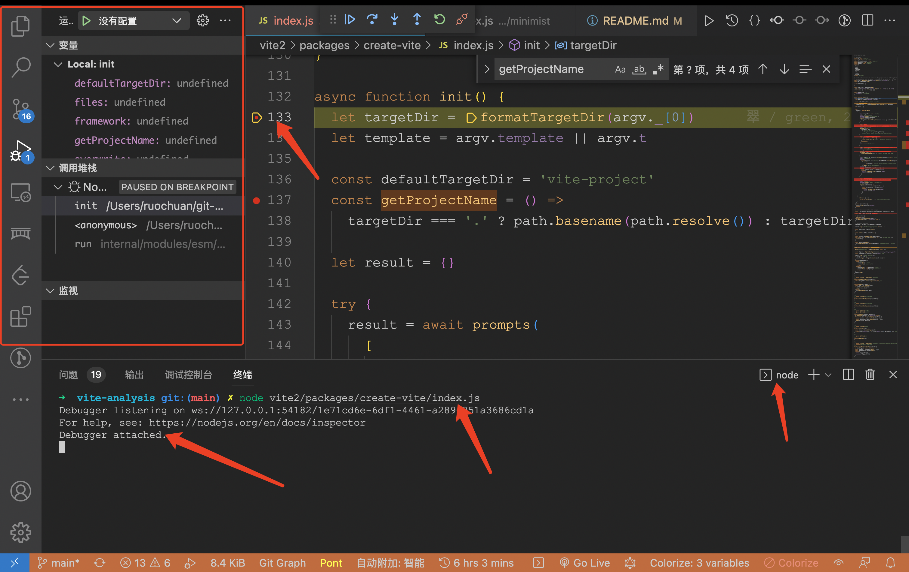
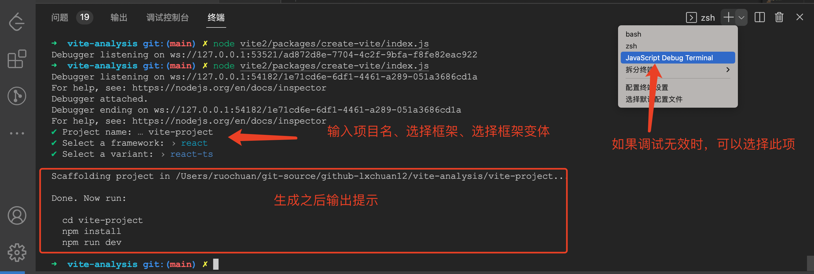
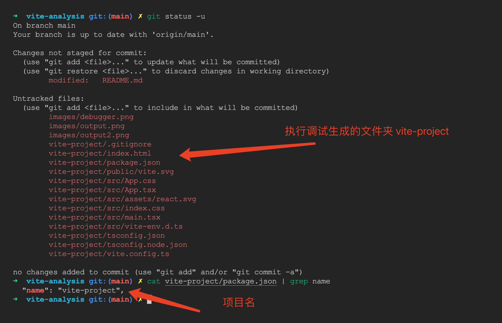
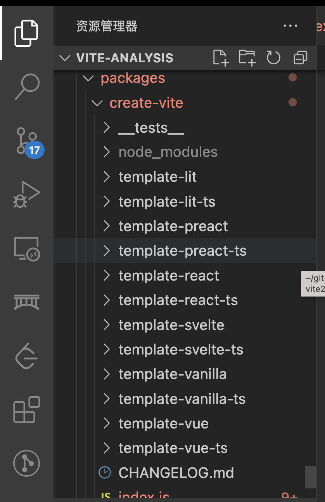

# vite 3.0 都发布了，经常初始化 vite 项目，却不知 create-vite 原理？揭秘！

## 1. 前言

>大家好，我是[若川](https://lxchuan12.gitee.io)。**为了能帮助到更多对源码感兴趣、想学会看源码、提升自己前端技术能力的同学**。我倾力持续组织了一年[每周大家一起学习200行左右的源码共读活动](https://juejin.cn/post/7079706017579139102)，感兴趣的可以[点此扫码加我微信 ruochuan02 参与](https://juejin.cn/pin/7217386885793595453)。

想学源码，极力推荐关注我写的专栏（目前是掘金专栏关注人数第一，3.6K+人）[《学习源码整体架构系列》](https://juejin.cn/column/6960551178908205093) 包含`jQuery`、`underscore`、`lodash`、`vuex`、`sentry`、`axios`、`redux`、`koa`、`vue-devtools`、`vuex4`、`koa-compose`、`vue 3.2 发布`、`vue-this`、`create-vue`、`玩具vite`等20余篇源码文章。

>本文项目，欢迎 `star` 和克隆调试学习。[git clone https://github.com/ruochuan12/vite-analysis.git](https://github.com/ruochuan12/vite-analysis.git)

早在2021年10月，我写了[Vue 团队公开快如闪电的全新脚手架工具 create-vue，未来将替代 Vue-CLI，才300余行代码，学它！](https://juejin.cn/post/7018344866811740173)，备受好评。当时 [create-vue](https://github.com/vuejs/create-vue) 还没有配置 `eslint` 等，现在已经比较完善了。

这是[源码共读中第九期](https://juejin.cn/post/7079706017579139102)。有读者写了[最新 create-vue 的源码解读](https://juejin.cn/post/7116886758427459621)。

我们知道 `vite 3.0` 发布了。什么？你不知道？想起有好友问：如何关注前端新技术、新热点等，我的回答是关注相关的 `Github` 和 `Twitter`，或者关注我的【公众号@若川视野】也可以啊。

你一般会很开心的 `npm create vite@lastest` 初始化一个 `vite` 项目。

那么你知道它的原理是什么吗？

**今天这篇文章就来带领大家一起学习其原理，源码400行不到。**

## 2. npm init && npm create

[npm init 文档](https://docs.npmjs.com/cli/v8/commands/npm-init)有写。`create` 其实就是 `init` 的一个别名。

也就是说 `npm create vite@lastest` 相当于 => `npx create-vite@lastest`，`latest` 是版本号，目前最新版本可以通过以下命令查看。

```bash
npm dist-tag ls create-vite
# 输出
# latest: 3.0.0
```

接着我们克隆 `vite` 项目，调试 `packages/create-vite`，分析其源码实现。

## 3. 克隆项目 && 调试源码

之前文章写过，[新手向：前端程序员必学基本技能——调试JS代码](https://juejin.cn/post/7030584939020042254)，这里就不赘述。

可以直接克隆我的项目调试。同时欢迎 `star` 一下。
看开源项目，一般先看 [README.md](https://github.com/vitejs/vite/blob/main/README.md) 和相应的 [CONTRIBUTING.md](https://github.com/vitejs/vite/blob/main/CONTRIBUTING.md)。

```sh
git clone https://github.com/ruochuan12/vite-analysis.git
cd vite-analysis/vite2
# npm i -g pnpm
pnpm install
# 在这个 index.js 文件中断点
# 在命令行终端调试
node vite2/packages/create-vite/index.js
```

[贡献文档](https://github.com/vitejs/vite/blob/main/CONTRIBUTING.md)中也详细写了[如何调试](https://code.visualstudio.com/docs/editor/debugging)。

调试截图：


控制台输出：


最终生成的文件：


顺便提下我是如何保持 `vite` 记录的，其实用的`git subtree`。

```bash
# 创建
git subtree add --prefix=vite2 https://github.com/vitejs/vite.git main
# 更新
git subtree pull --prefix=vite2 https://github.com/vitejs/vite.git main
```

找到路径，`packages/create-vite` 看 `package.json`

```json
{
  "name": "create-vite",
  "version": "3.0.0",
  "type": "module",
  "bin": {
    "create-vite": "index.js",
    "cva": "index.js"
  },
  "main": "index.js",
  "engines": {
    "node": "^14.18.0 || >=16.0.0"
  },
}
```

`type` 类型指定为 `module` 说明是 `ES Module`。
`bin` 可执行命令为 `create-vite` 或 别名 `cva`。
我们可以知道主文件 `index.js`。
代码限制了较高版本的`Nodejs`。

接着我们调试来看这个 `index.js` 文件。

## 4. 主流程 init 函数拆分

```js
// 高版本的node支持，node 前缀
import fs from 'node:fs'
import path from 'node:path'
import { fileURLToPath } from 'node:url'

// 解析命令行的参数 链接：https://npm.im/minimist
import minimist from 'minimist'
// 询问选择之类的  链接：https://npm.im/prompts
import prompts from 'prompts'
// 终端颜色输出的库 链接：https://npm.im/kolorist
import {
  blue,
  cyan,
  green,
  lightRed,
  magenta,
  red,
  reset,
  yellow
} from 'kolorist'

// Avoids autoconversion to number of the project name by defining that the args
// non associated with an option ( _ ) needs to be parsed as a string. See #4606
const argv = minimist(process.argv.slice(2), { string: ['_'] })
// 当前 Nodejs 的执行目录
const cwd = process.cwd()

// 主函数内容省略，后文讲述
async function init() {}
init().catch((e) => {
  console.error(e)
})
```

### 4.1 输出的目标路径

```js
// 命令行第一个参数，替换反斜杠 / 为空字符串
let targetDir = formatTargetDir(argv._[0])

// 命令行参数 --template 或者 -t
let template = argv.template || argv.t

const defaultTargetDir = 'vite-project'
// 获取项目名
const getProjectName = () =>
targetDir === '.' ? path.basename(path.resolve()) : targetDir
```

#### 4.1.1 延伸函数 formatTargetDir

替换反斜杠 `/` 为空字符串。

```js
function formatTargetDir(targetDir) {
  return targetDir?.trim().replace(/\/+$/g, '')
}
```

### 4.2 prompts 询问项目名、选择框架，选择框架变体等

[prompts](https://npm.im/prompts) 根据用户输入选择，代码有删减。

```js
let result = {}
try {
    result = await prompts(
      [
        {
          type: targetDir ? null : 'text',
          name: 'projectName',
          message: reset('Project name:'),
          initial: defaultTargetDir,
          onState: (state) => {
            targetDir = formatTargetDir(state.value) || defaultTargetDir
          }
        },
        // 省略若干
      ],
      {
        onCancel: () => {
          throw new Error(red('✖') + ' Operation cancelled')
        }
      }
      )
} catch (cancelled) {
    console.log(cancelled.message)
    return
}
// user choice associated with prompts
// framework 框架
// overwrite 已有目录，是否重写
// packageName 输入的项目名
// variant 变体， 比如 react => react-ts
const { framework, overwrite, packageName, variant } = result
```

### 4.3 重写已有目录/或者创建不存在的目录

```js
// user choice associated with prompts
const { framework, overwrite, packageName, variant } = result

// 目录
const root = path.join(cwd, targetDir)

if (overwrite) {
    // 删除文件夹
    emptyDir(root)
} else if (!fs.existsSync(root)) {
    // 新建文件夹
    fs.mkdirSync(root, { recursive: true })
}
```

#### 4.3.1 延伸函数 emptyDir

递归删除文件夹，相当于 `rm -rf xxx`。

```js
function emptyDir(dir) {
  if (!fs.existsSync(dir)) {
    return
  }
  for (const file of fs.readdirSync(dir)) {
    fs.rmSync(path.resolve(dir, file), { recursive: true, force: true })
  }
}
```

### 4.4 获取模板路径



从模板里可以看出，目前还算是相对简陋的。比如没有配置 `eslint` `prettier` 等。如果你想为多个的 `vite` 项目，自动添加 `eslint` `prettier`。这里推荐[vite-pretty-lint](https://github.com/tzsk/vite-pretty-lint)，为这个库我出了的[源码共读第35期](https://juejin.cn/post/7113563466211786783)，还有别人参与后写的不错的文章[如何为前端项目一键自动添加eslint和prettier的支持](https://juejin.cn/post/7115206210701230088)。

```js
// determine template
template = variant || framework || template

console.log(`\nScaffolding project in ${root}...`)

const templateDir = path.resolve(
    fileURLToPath(import.meta.url),
    '..',
    `template-${template}`
)
```

### 4.5 写入文件函数

```js
const write = (file, content) => {
    // renameFile
    const targetPath = renameFiles[file]
        ? path.join(root, renameFiles[file])
        : path.join(root, file)
    if (content) {
        fs.writeFileSync(targetPath, content)
    } else {
        copy(path.join(templateDir, file), targetPath)
    }
}
```

这里的 `renameFiles`，是因为在某些编辑器或者电脑上不支持`.gitignore`。

```js
const renameFiles = {
  _gitignore: '.gitignore'
}
```

#### 4.5.1 延伸函数 copy && copyDir

如果是文件夹用 copyDir 拷贝

```js
function copy(src, dest) {
  const stat = fs.statSync(src)
  if (stat.isDirectory()) {
    copyDir(src, dest)
  } else {
    fs.copyFileSync(src, dest)
  }
}

/**
 * @param {string} srcDir
 * @param {string} destDir
 */
function copyDir(srcDir, destDir) {
  fs.mkdirSync(destDir, { recursive: true })
  for (const file of fs.readdirSync(srcDir)) {
    const srcFile = path.resolve(srcDir, file)
    const destFile = path.resolve(destDir, file)
    copy(srcFile, destFile)
  }
}
```

### 4.6 根据模板路径的文件写入目标路径

`package.json` 文件单独处理。
它的名字为输入的 `packageName` 或者获取。

```js
const files = fs.readdirSync(templateDir)
for (const file of files.filter((f) => f !== 'package.json')) {
    write(file)
}

const pkg = JSON.parse(
    fs.readFileSync(path.join(templateDir, `package.json`), 'utf-8')
)

pkg.name = packageName || getProjectName()

write('package.json', JSON.stringify(pkg, null, 2))
```

### 4.7 打印安装完成后的信息

```js
const pkgInfo = pkgFromUserAgent(process.env.npm_config_user_agent)
const pkgManager = pkgInfo ? pkgInfo.name : 'npm'

console.log(`\nDone. Now run:\n`)
if (root !== cwd) {
    console.log(`  cd ${path.relative(cwd, root)}`)
}
switch (pkgManager) {
    case 'yarn':
        console.log('  yarn')
        console.log('  yarn dev')
        break
    default:
        console.log(`  ${pkgManager} install`)
        console.log(`  ${pkgManager} run dev`)
        break
}
console.log()
```

#### 4.7.1 延伸的 pkgFromUserAgent 函数

```js
/**
 * @param {string | undefined} userAgent process.env.npm_config_user_agent
 * @returns object | undefined
 */
function pkgFromUserAgent(userAgent) {
  if (!userAgent) return undefined
  const pkgSpec = userAgent.split(' ')[0]
  const pkgSpecArr = pkgSpec.split('/')
  return {
    name: pkgSpecArr[0],
    version: pkgSpecArr[1]
  }
}
```

第一句 `pkgFromUserAgent`函数，是从使用了什么包管理器创建项目，那么就输出 `npm/yarn/pnpm` 相应的命令。

```sh
npm create vite@lastest
yarn create vite
pnpm create vite
```

## 5. 总结

再来回顾下控制台输出：


到此我们就分析完了整体的流程。总体代码行数不多，不到400行。

```json
{
  "name": "create-vite",
  "version": "3.0.0",
  "type": "module",
  "engines": {
    "node": "^14.18.0 || >=16.0.0"
  }
}
```

从 `package.json` 中看到，代码限制了较高版本的`Nodejs`，采用 `ES Module`，目前未涉及打包编译。

为了保证轻量快速，源码中很多函数都是自己写的。比如校验项目名，有比较出名的 [validate-npm-package-name](https://github.com/npm/validate-npm-package-name)，vue-cli、create-react-app 中就是用的它。比如删除文件和文件夹，也是自己实现。

依赖包很少。只依赖了三个包。
[解析命令行的参数 minimist](https://npm.im/minimist)、
[询问选择之类的 prompts](https://npm.im/prompts)、
[终端颜色输出的库 kolorist](https://npm.im/kolorist)

测试用例本文未涉及，感兴趣的小伙伴可以看，路径：[vite/packages/create-vite/__tests__/cli.spec.ts](https://github.com/vitejs/vite/blob/main/packages/create-vite/__tests__/cli.spec.ts)，采用的是 [vitest](https://github.com/vitest-dev/vitest)。

读完本文，你会发现日常使用 `npm create vite` 初始化 `vite` 项目，`create-vite` 才不到400行源码。

我们也可以根据公司相关业务，开发属于自己的脚手架工具。

如果觉得 Vite 项目模板不够，还可以自行修改添加，比如[vite-pretty-lint](https://github.com/tzsk/vite-pretty-lint)这个库，就是一键为多个 `vite` 项目自动添加 `eslint`、`prettier`。

有时我们容易局限于公司项目无法自拔，不曾看看开源世界，而且开源项目源码就在那里，如果真的有心愿意学，是能学会很多的。

**很多源码不是我们想象中的那么高深莫测。源码不应该成为我们的拦路虎，而应该是我们的良师益友**。这也可以说是我持续组织[源码共读活动](https://juejin.cn/post/7079706017579139102)的原因之一。

>本文项目，欢迎 `star` 和克隆调试学习。[git clone https://github.com/ruochuan12/vite-analysis.git](https://github.com/ruochuan12/vite-analysis.git)

---

**如果看完有收获，欢迎点赞、评论、分享支持。你的支持和肯定，是我写作的动力**~

最后可以持续关注我@若川。关注我的公众号@若川视野。欢迎[点此扫码加我微信 `ruochuan02`](https://juejin.cn/pin/7217386885793595453) 交流，参加[由公众号@若川视野发起的，每周大家一起学习200行左右的源码共读活动](https://juejin.cn/post/7079706017579139102)，共同进步。

我正在参与掘金技术社区创作者签约计划招募活动，[点击链接报名投稿](https://juejin.cn/post/7112770927082864653)。
