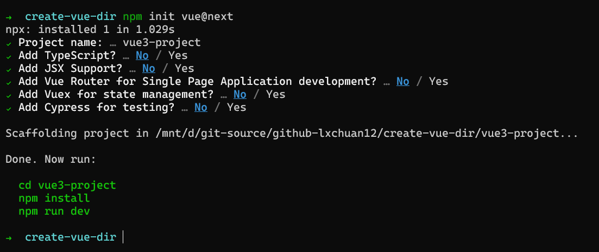
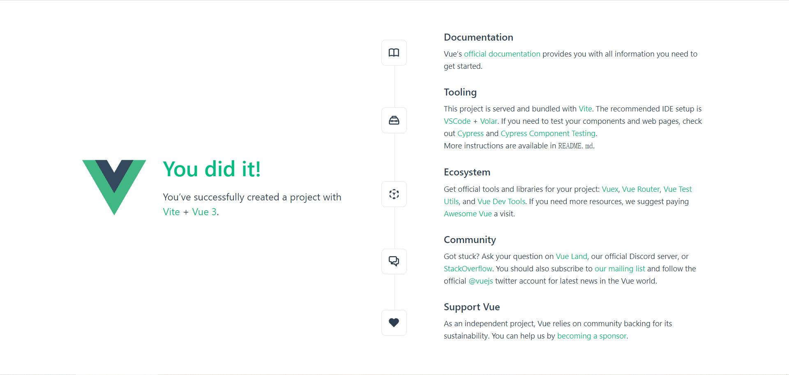
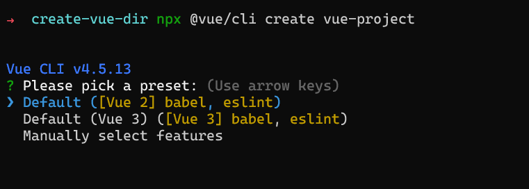

# Vue 团队公开快如闪电的全新脚手架工具 create-vue，未来将替代 Vue-CLI，才300余行代码，学它！

## 1. 前言

>大家好，我是[若川](https://lxchuan12.gitee.io)。欢迎关注我的[公众号若川视野](https://p1-jj.byteimg.com/tos-cn-i-t2oaga2asx/gold-user-assets/2019/12/13/16efe57ddc7c9eb3~tplv-t2oaga2asx-image.image "https://p1-jj.byteimg.com/tos-cn-i-t2oaga2asx/gold-user-assets/2019/12/13/16efe57ddc7c9eb3~tplv-t2oaga2asx-image.image")，最近组织了[**源码共读活动**](https://www.yuque.com/ruochuan12/notice)，感兴趣的可以加我微信 [ruochuan12](https://juejin.cn/pin/7005372623400435725) 参与，已进行两个多月，大家一起交流学习，共同进步。

想学源码，极力推荐之前我写的[《学习源码整体架构系列》](https://juejin.cn/column/6960551178908205093) 包含`jQuery`、`underscore`、`lodash`、`vuex`、`sentry`、`axios`、`redux`、`koa`、`vue-devtools`、`vuex4`、`koa-compose`、`vue-next-release`、`vue-this`等十余篇源码文章。

>美国时间 2021 年 10 月 7 日早晨，Vue 团队等主要贡献者举办了一个 `Vue Contributor Days` 在线会议，[蒋豪群](https://github.com/sodatea)（[知乎胖茶](https://www.zhihu.com/people/sodatea)，Vue.js 官方团队成员，Vue-CLI 核心开发），在会上公开了[`create-vue`](https://github.com/vuejs/create-vue)，一个全新的脚手架工具。

`create-vue`使用`npm init vue@next`一行命令，就能`快如闪电般`初始化好基于`vite`的`Vue3`项目。

本文就是通过调试和大家一起学习这个300余行的源码。

阅读本文，你将学到：

```sh
1. 学会全新的官方脚手架工具 create-vue 的使用和原理
2. 学会使用 VSCode 直接打开 github 项目
3. 学会使用测试用例调试源码
4. 学以致用，为公司初始化项目写脚手架工具。
5. 等等
```

## 2. 使用 npm init vue@next 初始化 vue3 项目

[create-vue github README](https://github.com/vuejs/create-vue)上写着，`An easy way to start a Vue project`。一种简单的初始化vue项目的方式。

```sh
npm init vue@next
```

估计大多数读者，第一反应是**这样竟然也可以，这么简单快捷？**

忍不住想动手在控制台输出命令，我在终端试过，见下图。



最终`cd vue3-project`、`npm install` 、`npm run dev`打开页面[http://localhost:3000](http://localhost:3000)。



### 2.1 npm init && npx

为啥 `npm init` 也可以直接初始化一个项目，带着疑问，我们翻看 `npm` 文档。

[npm init](https://docs.npmjs.com/cli/v6/commands/npm-init)

npm init 用法：

```sh
npm init [--force|-f|--yes|-y|--scope]
npm init <@scope> (same as `npx <@scope>/create`)
npm init [<@scope>/]<name> (same as `npx [<@scope>/]create-<name>`)
```

`npm init <initializer>` 时转换成`npx`命令：

- npm init foo -> npx create-foo
- npm init @usr/foo -> npx @usr/create-foo
- npm init @usr -> npx @usr/create

看完文档，我们也就理解了：

```sh
# 运行
npm init vue@next
# 相当于
npx create-vue@next
```

我们可以在这里[create-vue](https://registry.npmjs.org/create-vue)，找到一些信息。或者在[npm create-vue](https://www.npmjs.com/package/create-vue)找到版本等信息。

其中`@next`是指定版本，通过`npm dist-tag ls create-vue`命令可以看出，`next`版本目前对应的是`3.0.0-beta.6`。

```sh
npm dist-tag ls create-vue
- latest: 3.0.0-beta.6
- next: 3.0.0-beta.6
```

发布时 `npm publish --tag next` 这种写法指定 `tag`。默认标签是`latest`。

可能有读者对 `npx` 不熟悉，这时找到[阮一峰老师博客 npx 介绍](http://www.ruanyifeng.com/blog/2019/02/npx.html)、[nodejs.cn npx](http://nodejs.cn/learn/the-npx-nodejs-package-runner)

`npx 是一个非常强大的命令，从 npm 的 5.2 版本（发布于 2017 年 7 月）开始可用。`

简单说下容易忽略且常用的场景，`npx`有点类似小程序提出的随用随走。

**轻松地运行本地命令**

```sh
node_modules/.bin/vite -v
# vite/2.6.5 linux-x64 node-v14.16.0

# 等同于
# package.json script: "vite -v"
# npm run vite

npx vite -v
# vite/2.6.5 linux-x64 node-v14.16.0
```

**使用不同的 Node.js 版本运行代码**
某些场景下可以临时切换 `node` 版本，有时比 `nvm` 包管理方便些。

```sh
npx node@14 -v
# v14.18.0

npx -p node@14 node -v 
# v14.18.0
```

**无需安装的命令执行**

```sh
# 启动本地静态服务
npx http-server
```

```sh
# 无需全局安装
npx @vue/cli create vue-project
# @vue/cli 相比 npm init vue@next npx create-vue@next 很慢。

# 全局安装
npm i -g @vue/cli
vue create vue-project
```



`npm init vue@next` （`npx create-vue@next`） 快的原因，主要在于依赖少（能不依赖包就不依赖），源码行数少，目前`index.js`只有300余行。

## 3. 配置环境调试源码

### 3.1 克隆 create-vue 项目

[本文仓库地址 create-vue-analysis](https://github.com/lxchuan12/create-vue-analysis.git)，求个`star`~

```sh
# 可以直接克隆我的仓库，我的仓库保留的 create-vue 仓库的 git 记录
git clone https://github.com/lxchuan12/create-vue-analysis.git
cd create-vue-analysis/create-vue
npm i
```

当然不克隆也可以直接用 `VSCode` 打开我的仓库
[](https://open.vscode.dev/lxchuan12/create-vue-analysis)

顺带说下：我是怎么保留 `create-vue` 仓库的 `git` 记录的。

```sh
# 在 github 上新建一个仓库 `create-vue-analysis` 克隆下来
git clone https://github.com/lxchuan12/create-vue-analysis.git
cd create-vue-analysis
git subtree add --prefix=create-vue https://github.com/vuejs/create-vue.git main
# 这样就把 create-vue 文件夹克隆到自己的 git 仓库了。且保留的 git 记录
```

关于更多 `git subtree`，可以看[Git Subtree 简明使用手册](https://segmentfault.com/a/1190000003969060)

### 3.2 package.json 分析

```js
// create-vue/package.json
{
  "name": "create-vue",
  "version": "3.0.0-beta.6",
  "description": "An easy way to start a Vue project",
  "type": "module",
  "bin": {
    "create-vue": "outfile.cjs"
  },
}
```

`bin`指定可执行脚本。也就是我们可以使用 `npx create-vue` 的原因。

`outfile.cjs` 是打包输出的`JS`文件

```js
{
  "scripts": {
    "build": "esbuild --bundle index.js --format=cjs --platform=node --outfile=outfile.cjs",
    "snapshot": "node snapshot.js",
    "pretest": "run-s build snapshot",
    "test": "node test.js"
  },
}
```

执行 `npm run test` 时，会先执行钩子函数 `pretest`。`run-s` 是 [npm-run-all](https://github.com/mysticatea/npm-run-all/blob/HEAD/docs/run-s.md) 提供的命令。`run-s build snapshot` 命令相当于 `npm run build && npm run snapshot`。

根据脚本提示，我们来看 `snapshot.js` 文件。

### 3.3 生成快照 snapshot.js

这个文件主要作用是根据`const featureFlags = ['typescript', 'jsx', 'router', 'vuex', 'with-tests']` 组合生成`31种`加上 `default` 共计 `32种` 组合，生成快照在 `playground`目录。

因为打包生成的 `outfile.cjs` 代码有做一些处理，不方便调试，我们可以修改为`index.js`便于调试。

```js
// 路径 create-vue/snapshot.js
const bin = path.resolve(__dirname, './outfile.cjs')
// 改成 index.js 便于调试
const bin = path.resolve(__dirname, './index.js')
```

我们可以在`for`和 `createProjectWithFeatureFlags` 打上断点。

`createProjectWithFeatureFlags`其实类似在终端输入如下执行这样的命令

```sh
node ./index.js --xxx --xxx --force
```

```js
function createProjectWithFeatureFlags(flags) {
  const projectName = flags.join('-')
  console.log(`Creating project ${projectName}`)
  const { status } = spawnSync(
    'node',
    [bin, projectName, ...flags.map((flag) => `--${flag}`), '--force'],
    {
      cwd: playgroundDir,
      stdio: ['pipe', 'pipe', 'inherit']
    }
  )

  if (status !== 0) {
    process.exit(status)
  }
}

// 路径 create-vue/snapshot.js
for (const flags of flagCombinations) {
  createProjectWithFeatureFlags(flags)
}
```

>**调试**：`VSCode`打开项目，`VSCode`高版本(1.50+)可以在 `create-vue/package.json` => `scripts` => `"test": "node test.js"`。鼠标悬停在`test`上会有调试脚本提示，选择调试脚本。如果对调试不熟悉，可以看我之前的文章[koa-compose](https://lxchuan12.gitee.io/koa-compose)，写的很详细。

调试时，大概率你会遇到：`create-vue/index.js` 文件中，`__dirname` 报错问题。可以按照如下方法解决。在 `import` 的语句后，添加如下语句，就能愉快的调试了。

```js
// 路径 create-vue/index.js
// 解决办法和nodejs issues
// https://stackoverflow.com/questions/64383909/dirname-is-not-defined-in-node-14-version
// https://github.com/nodejs/help/issues/2907

import { fileURLToPath } from 'url';
import { dirname } from 'path';

const __filename = fileURLToPath(import.meta.url);
const __dirname = dirname(__filename);
```

接着我们调试 index.js 文件，来学习。

## 4. 调试 index.js 主流程

回顾下上文 `npm init vue@next` 初始化项目的。


单从初始化项目输出图来看。主要是三个步骤。

```sh
1. 输入项目名称，默认值是 vue-project
2. 询问一些配置 渲染模板等
3. 完成创建项目，输出运行提示
```

```js
async function init() {
  // 省略放在后文详细讲述
}

// async 函数返回的是Promise 可以用 catch 报错
init().catch((e) => {
  console.error(e)
})
```

### 4.1 解析命令行参数

```js
// 返回运行当前脚本的工作目录的路径。
const cwd = process.cwd()
// possible options:
// --default
// --typescript / --ts
// --jsx
// --router / --vue-router
// --vuex
// --with-tests / --tests / --cypress
// --force (for force overwriting)
const argv = minimist(process.argv.slice(2), {
    alias: {
        typescript: ['ts'],
        'with-tests': ['tests', 'cypress'],
        router: ['vue-router']
    },
    // all arguments are treated as booleans
    boolean: true
})
```

[minimist](https://github.com/substack/minimist)

简单说，这个库，就是解析命令行参数的。看例子，我们比较容易看懂传参和解析结果。

```bash
$ node example/parse.js -a beep -b boop
{ _: [], a: 'beep', b: 'boop' }

$ node example/parse.js -x 3 -y 4 -n5 -abc --beep=boop foo bar baz
{ _: [ 'foo', 'bar', 'baz' ],
  x: 3,
  y: 4,
  n: 5,
  a: true,
  b: true,
  c: true,
  beep: 'boop' }
```

比如

```sh
npm init vue@next --vuex --force
```

### 4.2 如果设置了 feature flags 跳过 prompts 询问

这种写法方便代码测试等。直接跳过交互式询问，同时也可以省时间。

```js
// if any of the feature flags is set, we would skip the feature prompts
  // use `??` instead of `||` once we drop Node.js 12 support
  const isFeatureFlagsUsed =
    typeof (argv.default || argv.ts || argv.jsx || argv.router || argv.vuex || argv.tests) ===
    'boolean'

// 生成目录
  let targetDir = argv._[0]
  // 默认 vue-projects
  const defaultProjectName = !targetDir ? 'vue-project' : targetDir
  // 强制重写文件夹，当同名文件夹存在时
  const forceOverwrite = argv.force
```

### 4.3 交互式询问一些配置

如上文`npm init vue@next` 初始化的图示

- 输入项目名称
- 还有是否删除已经存在的同名目录
- 询问使用需要 JSX Router vuex cypress 等。

```js
let result = {}

  try {
    // Prompts:
    // - Project name:
    //   - whether to overwrite the existing directory or not?
    //   - enter a valid package name for package.json
    // - Project language: JavaScript / TypeScript
    // - Add JSX Support?
    // - Install Vue Router for SPA development?
    // - Install Vuex for state management? (TODO)
    // - Add Cypress for testing?
    result = await prompts(
      [
        {
          name: 'projectName',
          type: targetDir ? null : 'text',
          message: 'Project name:',
          initial: defaultProjectName,
          onState: (state) => (targetDir = String(state.value).trim() || defaultProjectName)
        },
        // 省略若干配置
        {
          name: 'needsTests',
          type: () => (isFeatureFlagsUsed ? null : 'toggle'),
          message: 'Add Cypress for testing?',
          initial: false,
          active: 'Yes',
          inactive: 'No'
        }
      ],
      {
        onCancel: () => {
          throw new Error(red('✖') + ' Operation cancelled')
        }
      }
    ]
    )
  } catch (cancelled) {
    console.log(cancelled.message)
    // 退出当前进程。
    process.exit(1)
  }
```

### 4.4 初始化询问用户给到的参数，同时也会给到默认值

```js
// `initial` won't take effect if the prompt type is null
  // so we still have to assign the default values here
  const {
    packageName = toValidPackageName(defaultProjectName),
    shouldOverwrite,
    needsJsx = argv.jsx,
    needsTypeScript = argv.typescript,
    needsRouter = argv.router,
    needsVuex = argv.vuex,
    needsTests = argv.tests
  } = result
  const root = path.join(cwd, targetDir)

  // 如果需要强制重写，清空文件夹

  if (shouldOverwrite) {
    emptyDir(root)
    // 如果不存在文件夹，则创建
  } else if (!fs.existsSync(root)) {
    fs.mkdirSync(root)
  }

  // 脚手架项目目录
  console.log(`\nScaffolding project in ${root}...`)

 // 生成 package.json 文件
  const pkg = { name: packageName, version: '0.0.0' }
  fs.writeFileSync(path.resolve(root, 'package.json'), JSON.stringify(pkg, null, 2))
```

### 4.5 根据模板文件生成初始化项目所需文件

```js
  // todo:
  // work around the esbuild issue that `import.meta.url` cannot be correctly transpiled
  // when bundling for node and the format is cjs
  // const templateRoot = new URL('./template', import.meta.url).pathname
  const templateRoot = path.resolve(__dirname, 'template')
  const render = function render(templateName) {
    const templateDir = path.resolve(templateRoot, templateName)
    renderTemplate(templateDir, root)
  }

  // Render base template
  render('base')

   // 添加配置
  // Add configs.
  if (needsJsx) {
    render('config/jsx')
  }
  if (needsRouter) {
    render('config/router')
  }
  if (needsVuex) {
    render('config/vuex')
  }
  if (needsTests) {
    render('config/cypress')
  }
  if (needsTypeScript) {
    render('config/typescript')
  }
```

### 4.6 渲染生成代码模板

```js
// Render code template.
  // prettier-ignore
  const codeTemplate =
    (needsTypeScript ? 'typescript-' : '') +
    (needsRouter ? 'router' : 'default')
  render(`code/${codeTemplate}`)

  // Render entry file (main.js/ts).
  if (needsVuex && needsRouter) {
    render('entry/vuex-and-router')
  } else if (needsVuex) {
    render('entry/vuex')
  } else if (needsRouter) {
    render('entry/router')
  } else {
    render('entry/default')
  }
```

### 4.7 如果配置了需要 ts

重命名所有的 `.js` 文件改成 `.ts`。
重命名 `jsconfig.json` 文件为 `tsconfig.json` 文件。

[jsconfig.json](https://code.visualstudio.com/docs/languages/jsconfig) 是VSCode的配置文件，可用于配置跳转等。

把`index.html` 文件里的 `main.js` 重命名为 `main.ts`。

```js
// Cleanup.

if (needsTypeScript) {
    // rename all `.js` files to `.ts`
    // rename jsconfig.json to tsconfig.json
    preOrderDirectoryTraverse(
      root,
      () => {},
      (filepath) => {
        if (filepath.endsWith('.js')) {
          fs.renameSync(filepath, filepath.replace(/\.js$/, '.ts'))
        } else if (path.basename(filepath) === 'jsconfig.json') {
          fs.renameSync(filepath, filepath.replace(/jsconfig\.json$/, 'tsconfig.json'))
        }
      }
    )

    // Rename entry in `index.html`
    const indexHtmlPath = path.resolve(root, 'index.html')
    const indexHtmlContent = fs.readFileSync(indexHtmlPath, 'utf8')
    fs.writeFileSync(indexHtmlPath, indexHtmlContent.replace('src/main.js', 'src/main.ts'))
  }
```

### 4.8 配置了不需要测试

因为所有的模板都有测试文件，所以不需要测试时，执行删除 `cypress`、`/__tests__/` 文件夹

```js
  if (!needsTests) {
    // All templates assumes the need of tests.
    // If the user doesn't need it:
    // rm -rf cypress **/__tests__/
    preOrderDirectoryTraverse(
      root,
      (dirpath) => {
        const dirname = path.basename(dirpath)

        if (dirname === 'cypress' || dirname === '__tests__') {
          emptyDir(dirpath)
          fs.rmdirSync(dirpath)
        }
      },
      () => {}
    )
  }
```

### 4.9 根据使用的 npm / yarn / pnpm 生成README.md 文件，给出运行项目的提示

```js
// Instructions:
  // Supported package managers: pnpm > yarn > npm
  // Note: until <https://github.com/pnpm/pnpm/issues/3505> is resolved,
  // it is not possible to tell if the command is called by `pnpm init`.
  const packageManager = /pnpm/.test(process.env.npm_execpath)
    ? 'pnpm'
    : /yarn/.test(process.env.npm_execpath)
    ? 'yarn'
    : 'npm'

  // README generation
  fs.writeFileSync(
    path.resolve(root, 'README.md'),
    generateReadme({
      projectName: result.projectName || defaultProjectName,
      packageManager,
      needsTypeScript,
      needsTests
    })
  )

  console.log(`\nDone. Now run:\n`)
  if (root !== cwd) {
    console.log(`  ${bold(green(`cd ${path.relative(cwd, root)}`))}`)
  }
  console.log(`  ${bold(green(getCommand(packageManager, 'install')))}`)
  console.log(`  ${bold(green(getCommand(packageManager, 'dev')))}`)
  console.log()
```

## 5. npm run test => node test.js 测试

```js
// create-vue/test.js
import fs from 'fs'
import path from 'path'
import { fileURLToPath } from 'url'

import { spawnSync } from 'child_process'

const __dirname = path.dirname(fileURLToPath(import.meta.url))
const playgroundDir = path.resolve(__dirname, './playground/')

for (const projectName of fs.readdirSync(playgroundDir)) {
  if (projectName.endsWith('with-tests')) {
    console.log(`Running unit tests in ${projectName}`)
    const unitTestResult = spawnSync('pnpm', ['test:unit:ci'], {
      cwd: path.resolve(playgroundDir, projectName),
      stdio: 'inherit',
      shell: true
    })
    if (unitTestResult.status !== 0) {
      throw new Error(`Unit tests failed in ${projectName}`)
    }

    console.log(`Running e2e tests in ${projectName}`)
    const e2eTestResult = spawnSync('pnpm', ['test:e2e:ci'], {
      cwd: path.resolve(playgroundDir, projectName),
      stdio: 'inherit',
      shell: true
    })
    if (e2eTestResult.status !== 0) {
      throw new Error(`E2E tests failed in ${projectName}`)
    }
  }
}
```

主要对生成快照时生成的在 `playground` 32个文件夹，进行如下测试。

```sh
pnpm test:unit:ci

pnpm test:e2e:ci
```

## 6. 总结

我们使用了快如闪电般的`npm init vue@next`，学习`npx`命令了。学会了其原理。

```sh
npm init vue@next => npx create-vue@next
```

快如闪电的原因在于依赖的很少。很多都是自己来实现。如：`Vue-CLI`中 `vue create vue-project` 命令是用官方的`npm`包[validate-npm-package-name](https://github.com/npm/validate-npm-package-name)，删除文件夹一般都是使用 [rimraf](https://github.com/isaacs/rimraf)。而 `create-vue` 是自己实现`emptyDir`和`isValidPackageName`。

非常建议读者朋友按照文中方法使用`VSCode`调试 `create-vue` 源码。源码中还有很多细节文中由于篇幅有限，未全面展开讲述。

学完本文，可以为自己或者公司创建类似初始化脚手架。

目前版本是`3.0.0-beta.6`。我们持续关注学习它。除了create-vue 之外，我们还可以看看[create-vite](https://github.com/vitejs/vite/tree/main/packages/create-vite)、[create-umi](https://github.com/umijs/create-umi) 的源码实现。

最后欢迎加我微信 [ruochuan12](https://juejin.cn/pin/7005372623400435725) 交流，参与 [源码共读](https://www.yuque.com/ruochuan12/notice) 活动，大家一起学习源码，共同进步。

## 7. 参考资料

发现 create-vue 时打算写文章加入到[源码共读](https://www.yuque.com/ruochuan12/notice)计划中，大家一起学习。而源码共读群里小伙伴[`upupming`](https://github.com/upupming/frontend-learning-map)比我先写完文章。

[@upupming  vue-cli 将被 create-vue 替代？初始化基于 vite 的 vue3 项目为何如此简单？](https://mp.weixin.qq.com/s?__biz=MzA5MjQwMzQyNw==&mid=2650757588&idx=1&sn=c6fb11eb09d5820957bcbece98a24087&chksm=88665a58bf11d34e569a4e1f6de101f8fa7637a620d5d9f7944cb47f41c5c47ab6920920c4ce&token=633613769&lang=zh_CN#rd)
