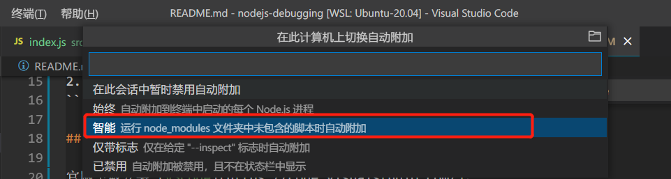
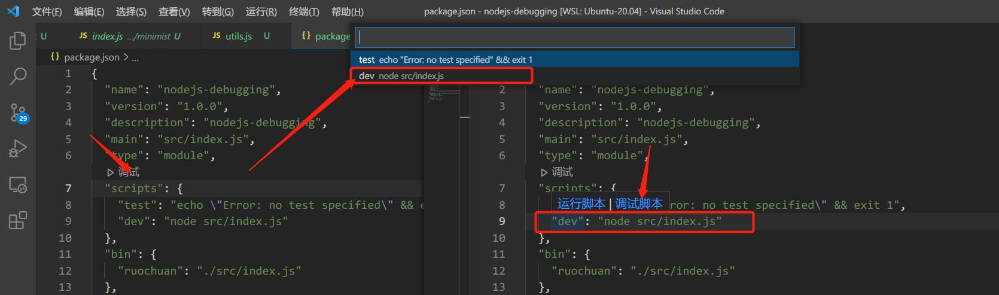
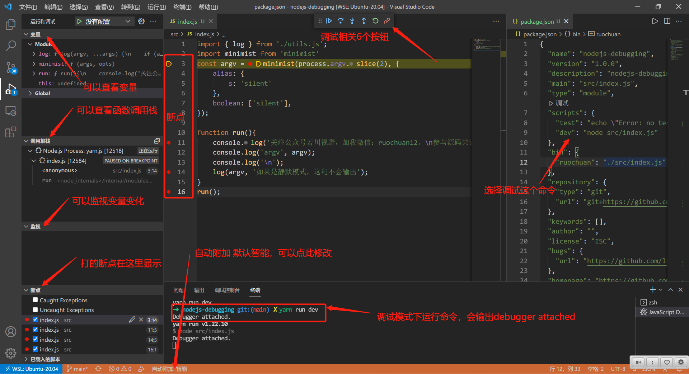

# 新手向：前端程序员必学基本技能——调试JS代码

## 1. 前言

>大家好，我是[若川](https://lxchuan12.gitee.io)。欢迎关注我的[公众号若川视野](https://lxchuan12.gitee.io)，最近组织了[源码共读活动](https://juejin.cn/pin/7005372623400435725)，感兴趣的可以加我微信 [ruochuan12](https://juejin.cn/pin/7005372623400435725) 参与，如今已进行三个月，大家一起交流学习，共同进步，很多人都表示收获颇丰。

想学源码，极力推荐之前我写的[《学习源码整体架构系列》](https://juejin.cn/column/6960551178908205093) 包含`jQuery`、`underscore`、`lodash`、`vuex`、`sentry`、`axios`、`redux`、`koa`、`vue-devtools`、`vuex4`、`koa-compose`、`vue 3.2 发布`、`vue-this`、`create-vue`、`玩具vite`等10余篇源码文章。

最近组织了[源码共读活动](https://juejin.cn/pin/7005372623400435725)，公众号：若川视野，回复"源码"参与，每周大家一起学习200行左右的源码，共同进步。常有小伙伴在微信群里提关于如何调试的问题，而我写的调试方法基本分散在其他文章中。所以特此写一篇关于调试的文章。此外，之后写文章也可以少写些调试相关的，只需持续更新这篇文章。

[本文仓库地址，求个`star`](https://github.com/lxchuan12/nodejs-debugging.git)

阅读本文，你将学到：

```bash
1. 学会基本调试技能
```

## 2. 推荐安装或者更新到最新版 VSCode

官网下载安装 [VSCode](https://code.visualstudio.com/)。

>如果你的`VSCode`不是中文（不习惯英文），可以安装[简体中文插件](https://marketplace.visualstudio.com/items?itemName=MS-CEINTL.vscode-language-pack-zh-hans)。<br>
>如果 `VSCode` 没有这个调试功能。建议更新到最新版的 `VSCode`（目前最新版本 `v1.62.2`）。

## 3. 配置 auto-attach

`VSCode` 调试 JS 的方法有很多，目前比较推荐的就是无需配置的 `auto-attach`。

**默认无需配置，超级好用**

按 `ctrl + shift + p`，打开输入 `>auto attach`。默认是智能（`smart`）。如果不是，可以查看设置成智能，或者根据场景自行设置成其他的。




更多可以查看官方文档：[nodejs-debugging](https://code.visualstudio.com/docs/nodejs/nodejs-debugging)

## 4. 调试 Node.js 代码

我特意新建了一个仓库。供读者动手实践。

```bash
git clone https://github.com/lxchuan12/nodejs-debugging.git
cd nodejs-debugging
# npm i -g yarn
yarn install
```

一般来说，从 `package.json` 文件查看入口，其中 `main` 字段会说明入口文件是什么。同时查看 `scripts` 脚本文件。

一般提前在入口文件打好断点。

### 4.1 调试操作方式

**操作方式一：package.json**

在 `package.json` 找到相应的 `scripts`。鼠标悬浮在相应的命令上，会出现`运行命令`和`调试命令`两个选项，选择 `调试命令` 即可进入调试模式。或者点击 `scripts` 上方的 `调试`，再选择相应的命令。也可以进入调试模式。



**操作方式二：终端命令**

通过快捷键 ctrl + ` 反引号 打开终端。或者通过 `查看 —— 终端` 打开 `VSCode` 终端。

在终端进入到目录。执行相应的脚本。

`VSCode` 则会自动进入到调试模式。如下图所示：



接着我们看按钮介绍。

### 4.2 调试按钮介绍

详细解释下几个调试相关按钮。

- 1. 继续（F5）: 点击后代码会直接执行到下一个断点所在位置，如果没有下一个断点，则认为本次代码执行完成。
- 2. 单步跳过（F10）：点击后会跳到当前代码下一行继续执行，不会进入到函数内部。
- 3. 单步调试（F11）：点击后进入到当前函数的内部调试，比如在 `fn` 这一行中执行单步调试，会进入到 `fn` 函数内部进行调试。
- 4. 单步跳出（Shift + F11）：点击后跳出当前调试的函数，与单步调试对应。
- 5. 重启（Ctrl + Shift + F5）：顾名思义。
- 6. 断开链接（Shift + F5）：顾名思义。


调试走到不是想看的文件时（或者完全不是这个目录下的文件时），可以选择单步退出按钮或者重新调试。

## 5. 其他调试

由于很多项目都配置了代码压缩，难于调试。所以开发环境下，一般通过配置生成 `sourcemap` 来调试代码。大部分开源项目（比如vue、vue-next源码）也会在贡献指南中说明如何开启 `sourcemap`。

普通 `webpack` 配置

```js
devtool: 'source-map',
```

调试 `vue-cli 3+` 生成的项目。

[Vuejs 官方文档调试](https://cn.vuejs.org/v2/cookbook/debugging-in-vscode.html)

```js
// vue-cli 3+
module.exports = {
  configureWebpack: {
    devtool: 'source-map'
  }
}
```

`chrome` 调试代码其实也类似。在 `chrome devtools` 的 `source` 面板找到相应文件，去打断点再调试。

## 6. 其他参考链接

如何调试代码看以下这些参考链接，动手练习可以学会，Node.js 也类似。

[前端容易忽略的 debugger 调试技巧](https://mp.weixin.qq.com/s/VOoDHqIo4gh3scHVNxk3lA)

[慕课网调试课程](https://www.imooc.com/learn/1164)

[掘金 chrome 免费小册](https://juejin.cn/book/6844733783166418958)

[慕课网 nodejs 调试入门](https://www.imooc.com/learn/1093)

## 7. 总结

文章比较详细的介绍了 `VSCode` 调试 `Node.js` 调试代码的基本技能，`Chrome` 调试代码其实也是类似。**调试代码是前端程序员基本技能，必须掌握**。组织了源码共读活动发现很多人都不会，或者说不熟悉。让我感到十分诧异。所以写下这篇文章分享给读者。

建议大家可以克隆我的项目，动手实践，多操作几次就熟悉了。

```bash
git clone https://github.com/lxchuan12/nodejs-debugging.git
cd nodejs-debugging
# npm i -g yarn
yarn install
```

最后可以持续关注我@若川。欢迎加我微信 [ruochuan12](https://juejin.cn/pin/7005372623400435725) 交流，参与 [源码共读](https://juejin.cn/pin/7005372623400435725) 活动，大家一起学习源码，共同进步。

