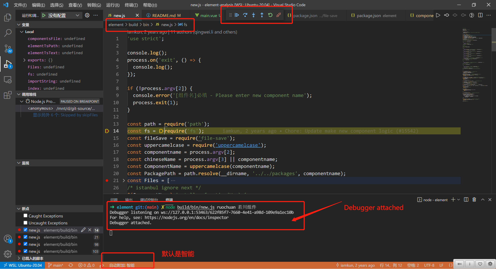
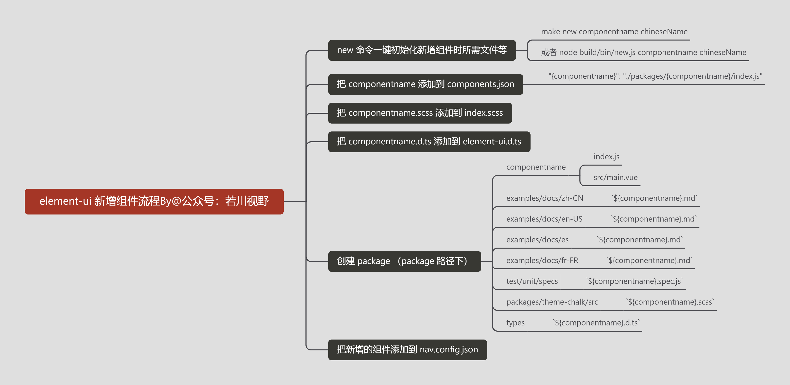
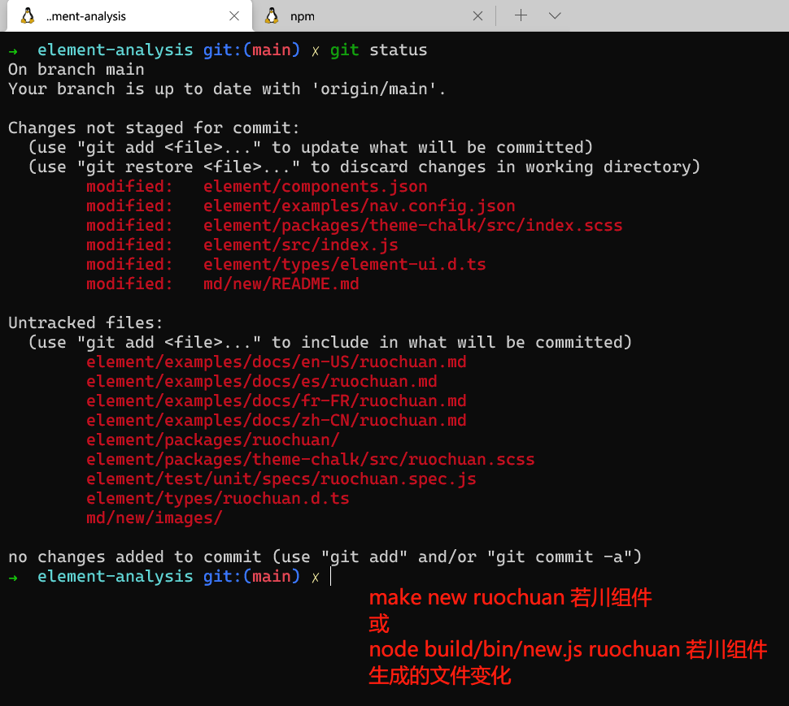
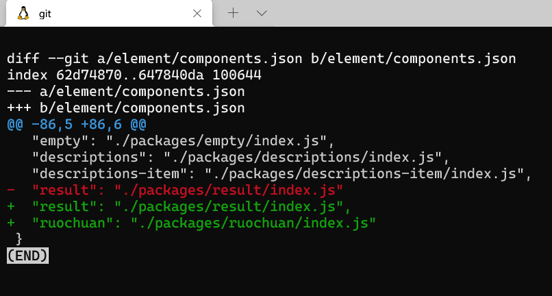
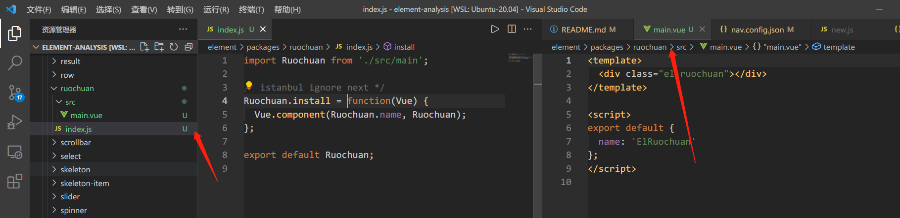
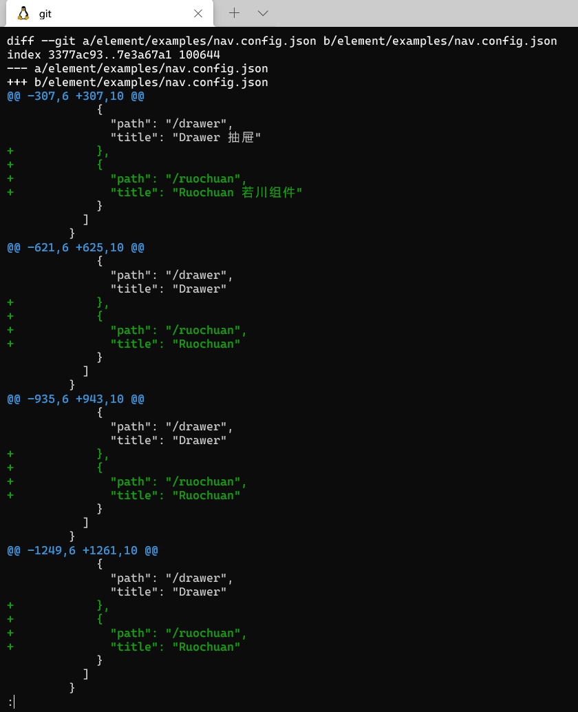
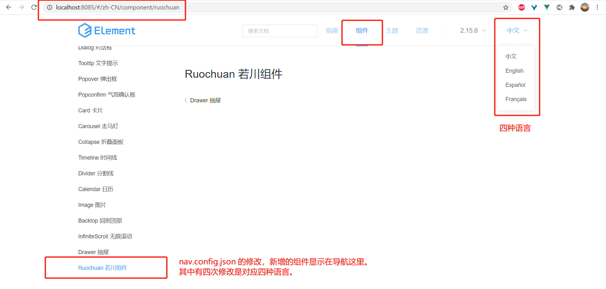

# 每次新增页面复制粘贴？100多行源码的 element-ui 新增组件功能告诉你减少重复工作

## 1. 前言

>大家好，我是[若川](https://lxchuan12.gitee.io)。最近组织了[源码共读活动](https://juejin.cn/pin/7005372623400435725)，感兴趣的可以加我微信 [ruochuan12](https://juejin.cn/pin/7005372623400435725) 参与，或者关注我的[公众号若川视野](https://lxchuan12.gitee.io)，回复“源码”参与。已进行三个月，大家一起交流学习，共同进步，很多人都表示收获颇丰。

想学源码，极力推荐之前我写的[《学习源码整体架构系列》](https://juejin.cn/column/6960551178908205093) 包含`jQuery`、`underscore`、`lodash`、`vuex`、`sentry`、`axios`、`redux`、`koa`、`vue-devtools`、`vuex4`、`koa-compose`、`vue 3.2 发布`、`vue-this`、`create-vue`、`玩具vite`等10余篇源码文章。

[本文仓库 element-analysis，求个star^_^](https://github.com/lxchuan12/element-analysis.git)

最近组织了[源码共读活动](https://juejin.cn/pin/7005372623400435725)，大家一起学习源码，每周学习200行左右的源码，已进行到13期。于是搜寻各种值得我们学习，且代码行数不多的源码。

其中 [element-ui](https://github.com/ElemeFE/element) [新建组件的源码](https://github.com/ElemeFE/element/blob/dev/build/bin/new.js) 仅 `100多行`，非常值得我们学习。

>可以通过 github1s.com 在线 VSCode 打开：https://github1s.com/ElemeFE/element/blob/dev/build/bin/new.js

阅读本文，你将学到：

```js
1. 学会调试学习源码
2. element-ui 如何初始化新的组件
3. 可以学以致用应用到自己开发的项目中，比如新增页面等
4. 等等
```

## 2. 环境准备
### 2.1 克隆

```bash
# 推荐克隆我的项目，保证与文章同步
git clone https://github.com/lxchuan12/element-analysis.git
# npm i -g yarn
cd element-analysis/element && npm run dev

# 或者克隆官方项目
git clone https://github.com/ElemeFE/element.git
# npm i -g yarn
cd element && npm run dev
```
### 2.2 看开源项目的 README 和贡献文档等

看开源项目，我们一般先看`README`，[README.md](https://github.com/ElemeFE/element) 中一般有[贡献指南](https://github.com/ElemeFE/element/blob/master/.github/CONTRIBUTING.zh-CN.md)。

**开发环境搭建**

>首先你需要 Node.js 4+，yarn 和 npm 3+。注意：我们使用 yarn 进行依赖版本的锁定，所以请不要使用 `npm install` 安装依赖。

```sh
git clone git@github.com:ElemeFE/element.git
npm run dev

# open http://localhost:8085
```

**package.json**

```js
{
    "script": {
        "bootstrap": "yarn || npm i",
        "build:file": "node build/bin/iconInit.js & node build/bin/build-entry.js & node build/bin/i18n.js & node build/bin/version.js",
        "dev": "npm run bootstrap && npm run build:file && cross-env NODE_ENV=development webpack-dev-server --config build/webpack.demo.js & node build/bin/template.js",
    },
}
```

在 `npm run dev` 时是先执行了 `npm run bootstrap` => `yarn || npm i` 命令，安装好了依赖。

`npm run build:file` 应该留着下一篇文章讲述。


**组件开发规范**

>通过 `make new` 创建组件目录结构，包含测试代码、入口文件、文档
>如果包含父子组件，需要更改目录结构，参考 `Button`
>组件内如果依赖了其他组件，需要在当前组件内引入，参考 `Select`

`make` 命令的配置对应根目录 `Makefile`。

```sh
# element/Makefile
new:
	node build/bin/new.js $(filter-out $@,$(MAKECMDGOALS))
```

通过查看 `Makefile` 文件我们知道了`make new`命令对应的是： `node build/bin.new.js`。

接着我们来调试源码。
### 2.3 调试源码

在最新版的 `VSCode` 中，`auto attach` 功能，默认支持智能调试，如果发现不支持，可以通过快捷键 `ctrl + shift + p` 查看是否启用。

ctrl + ` 快捷键打开终端。输入如下命令，即可调试 `build/bin/new.js`。

```sh
make new ruochuan 若川组件
# Ubuntu 和 Mac 支持 make 命令
# 不支持可以用 node
node build/bin/new.js ruochuan 若川组件
```



更多调试细节可以看我的这篇文章：[新手向：前端程序员必学基本技能——调试JS代码](https://juejin.cn/post/7030584939020042254)

接着我们按调试来看主流程。
## 3. 主流程

我看完 `build/bin/new.js` 源码画了一张流程图。毕竟俗话说得好，一图胜千言。



同时执行完命令后也新增和修改了若干文件，`git diff` 如下图所示。



接着我们来看 `build/bin/new.js` 文件。

### 3.1 文件开头判断

```js
'use strict';

console.log();
process.on('exit', () => {
  console.log();
});

// 第一个参数没传递报错，退出进程
if (!process.argv[2]) {
  console.error('[组件名]必填 - Please enter new component name');
  process.exit(1);
}
```

关于 `process` 对象可以查看 [阮一峰老师 process 对象](http://javascript.ruanyifeng.com/nodejs/process.html)

>`process.argv` 属性返回一个数组，由命令行执行脚本时的各个参数组成。它的第一个成员总是 `node`，第二个成员是脚本文件名，其余成员是脚本文件的参数。

接着我们来看，引用的依赖等。
### 3.2 引用依赖等

```js
// 路径模块
const path = require('path');
// 文件模块
const fs = require('fs');
// 保存文件
const fileSave = require('file-save');
// 转驼峰
const uppercamelcase = require('uppercamelcase');
// 第一个参数 组件名
const componentname = process.argv[2];
// 第二个参数 组件中文名
const chineseName = process.argv[3] || componentname;
// 转驼峰
const ComponentName = uppercamelcase(componentname);
// package 路径
const PackagePath = path.resolve(__dirname, '../../packages', componentname);
// const Files = [];
```

其中 [file-save](https://npm.im/file-save) 依赖，顾名思义，且非常关键。我们可以在 `node_module/file-save` 查看一些信息。
也可以在 `https://npmjs.com` 搜索其信息。

接着，我们来看文件模板。定义了若干文件模板，方便写入到项目中。
### 3.3 文件模板 Files

```js
const Files = [
  {
    filename: 'index.js',
    content: `import ${ComponentName} from './src/main';

/* istanbul ignore next */
${ComponentName}.install = function(Vue) {
  Vue.component(${ComponentName}.name, ${ComponentName});
};

export default ${ComponentName};`
  },
  {
    filename: 'src/main.vue',
    content: `<template>
  <div class="el-${componentname}"></div>
</template>

<script>
export default {
  name: 'El${ComponentName}'
};
</script>`
  },
//   省略其他
];
```

接着我们继续看添加对应的路径到组件 json 配置中。
### 3.4 把 componentname 添加到 components.json

```js
// 添加到 components.json
const componentsFile = require('../../components.json');
if (componentsFile[componentname]) {
  console.error(`${componentname} 已存在.`);
  process.exit(1);
}
componentsFile[componentname] = `./packages/${componentname}/index.js`;
fileSave(path.join(__dirname, '../../components.json'))
  .write(JSON.stringify(componentsFile, null, '  '), 'utf8')
  .end('\n');
```



### 3.5 把 componentname.scss 添加到 index.scss

```js
// 添加到 index.scss
const sassPath = path.join(__dirname, '../../packages/theme-chalk/src/index.scss');
const sassImportText = `${fs.readFileSync(sassPath)}@import "./${componentname}.scss";`;
fileSave(sassPath)
  .write(sassImportText, 'utf8')
  .end('\n');
```

### 3.6 把 componentname.d.ts 添加到 element-ui.d.ts

```js
// 添加到 element-ui.d.ts
const elementTsPath = path.join(__dirname, '../../types/element-ui.d.ts');

let elementTsText = `${fs.readFileSync(elementTsPath)}
/** ${ComponentName} Component */
export class ${ComponentName} extends El${ComponentName} {}`;

const index = elementTsText.indexOf('export') - 1;
const importString = `import { El${ComponentName} } from './${componentname}'`;

elementTsText = elementTsText.slice(0, index) + importString + '\n' + elementTsText.slice(index);

fileSave(elementTsPath)
  .write(elementTsText, 'utf8')
  .end('\n');
```

### 3.7 创建 package

```js
// const PackagePath = path.resolve(__dirname, '../../packages', componentname);
// 创建 package
Files.forEach(file => {
  fileSave(path.join(PackagePath, file.filename))
    .write(file.content, 'utf8')
    .end('\n');
});
```



### 3.8 把新增的组件添加到 nav.config.json

```js
const navConfigFile = require('../../examples/nav.config.json');

Object.keys(navConfigFile).forEach(lang => {
  let groups = navConfigFile[lang][4].groups;
  groups[groups.length - 1].list.push({
    path: `/${componentname}`,
    title: lang === 'zh-CN' && componentname !== chineseName
      ? `${ComponentName} ${chineseName}`
      : ComponentName
  });
});

fileSave(path.join(__dirname, '../../examples/nav.config.json'))
  .write(JSON.stringify(navConfigFile, null, '  '), 'utf8')
  .end('\n');
  
console.log('DONE!');
```



`nav.config.json` 的修改，新增的组件显示在导航这里。其中有四次修改是对应四种语言。



## 4. 总结

再次放出开头的流程图。

通过看 [element-ui](https://github.com/ElemeFE/element) [新建组件的源码](https://github1s.com/ElemeFE/element/blob/dev/build/bin/new.js) 流程，我们学到了 [file-save](https://npm.im/file-save) 这么方便的写入文件的库等。

同时给我们启发：公司项目新建页面时，或者组件库新增组件时，是不是可以类似做到的，一条命令省去一些繁杂重复的操作。

建议读者克隆[我的仓库](https://github.com/lxchuan12/element-analysis.git)动手实践调试源码学习。

后续也可以查看 [file-save](https://npm.im/file-save) 源码实现等。

最后可以持续关注我@若川。欢迎加我微信 [ruochuan12](https://juejin.cn/pin/7005372623400435725) 交流，参与 [源码共读](https://juejin.cn/pin/7005372623400435725) 活动，大家一起学习源码，共同进步。