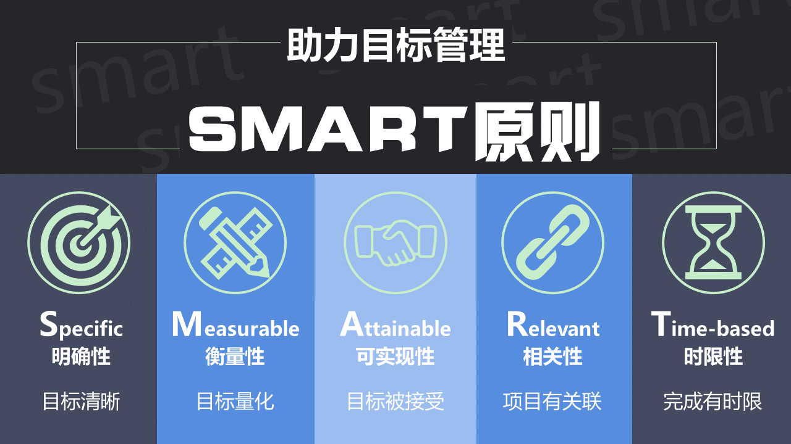
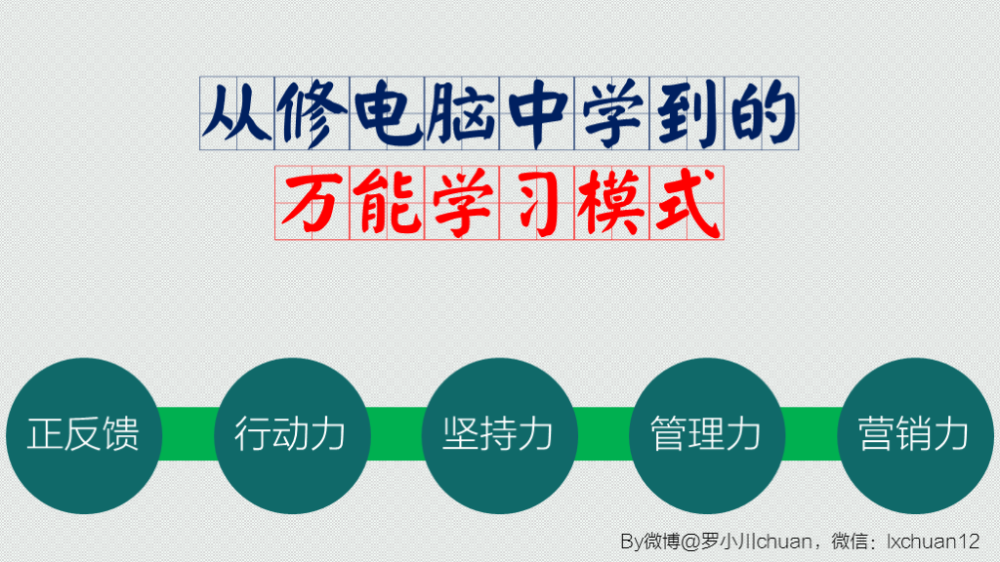

# 如何制定有价值的目标

> 写于2017年07月09日23:29

>公司会制定一系列目标，个人也可以制定一些目标，有利于自我学习成长。那么看我这篇文章可以告诉你如何制定有价值的目标。会制定有价值的目标，绝对超越很多人。

## SMART原则

王健林之前说**定个小目标，先赚它一个亿**。然后就火了一把，各种推文，主要是关于定计划的。我清晰得记得有一天早上，去上班时路过一所学校，广播里校长引用了王健林这句话。其实目标管理要量身定做，且有一定原则。这时召唤下同级校友做的一页PPT，**SMART原则**。

如果转换成简单好记一点就是：**什么时间内，做什么事情，做到什么程度**。

## 记录时间

不过定目标不是那么容易，可以试着记录自己一周的时间或者说一个月的时间都做了什么。关于如何记录可以利用艾力老师的 **“34枚金币时间管理法”** ，通俗点讲就是一天17小时醒着，每半小时算一枚金币。记录了一个周时间后，就能发现自己什么时间在做什么。有一定针对性。

比如你随便定了个计划，一个月内，把年中618买的四本书看完，并记笔记。你可能就会发现一个月内，一天只能抽出一小时看书，一小时最多能看50页。而一本书平均300页。这样粗略一算，6天才能看完一本，还不包括记笔记。所以一个月看不完四本。

## 戴明环（PDCA）

有人说，计划赶不上变化，所以不做计划。有一种东西叫做**戴明环（PDCA）**。拆开来就是：`计划(Plan)`、`实施(Do)`、`检查(Check)`、`行动(Action)`。

比如上面的例子，一个月看四本书。计划可能会被打断，去实施及时检查，再行动。也就是说原计划一个月看完4本书，每天看50页，发现看的这类书籍一小时完全看不完50页，就及时修正计划。看完就给自己一个小奖励（正反馈），比如吃一包麻辣冷静一下，这时再召唤一下我很早以前做的一张PPT（从修电脑中学到的万能学习模式）。

这样虽然可能会延期到一个半月才看完，但这是有效的循环。`定目标——定计划——执行计划——检查回顾——巩固循环——定目标`。

## 工具推荐

前面说了这么多，那么有没有工具来帮助我们定目标呢。答案是肯定的。

非常推荐`teambition`，网站：[https://www.teambition.com/](https://www.teambition.com/)

推荐`滴答清单`，网站：[https://www.dida365.com/](https://www.dida365.com/)

最后推荐`doit.im`，网站：[http://doitim.com/cn/](http://doitim.com/cn/)

这三款软件，都有APP，各大应用商店可供下载。

这三款我都使用过，其中`doit.im`、`滴答清单`在大学期间用的比较多。现在用的比较多的是`teambition`，免费版也支持日历功能。大家可以根据自己实际情况选择适合自己的。

## 总结

总结一下：【目标管理】如何制定有价值的目标。
主要写了四点：

- ①SMART原则
- ②记录时间（34枚金币时间管理法）
- ③戴明环（PDCA）
- ④工具推荐
  - teambition
  - 滴答清单
  - doit.im

希望对大家有所启发。

这是我2017年在知识星球写的推文。
>知识星球`前端视野 若川`简介：主要发表一些前端所见所想，Vue、React、构建工具(比如：gulp、webpack)、Nodejs、设计模式等。一个人走得快，一群人走得远。 
>公众号文章不常更新，知识星球更新相对多一些。2017年开通至今，一直没怎么宣传，目前有`960余人`加入了我的知识星球，欢迎识别二维码`免费加入`。

