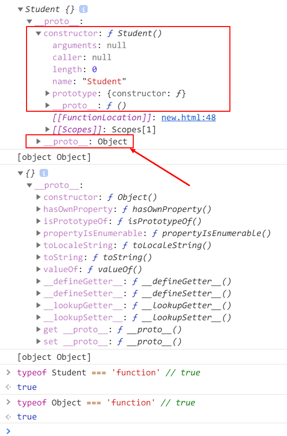
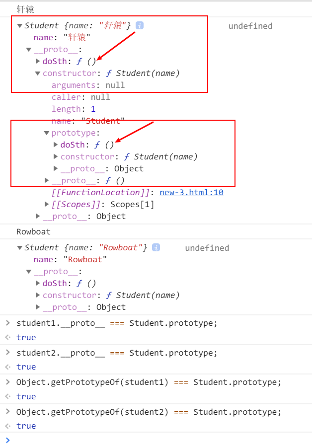
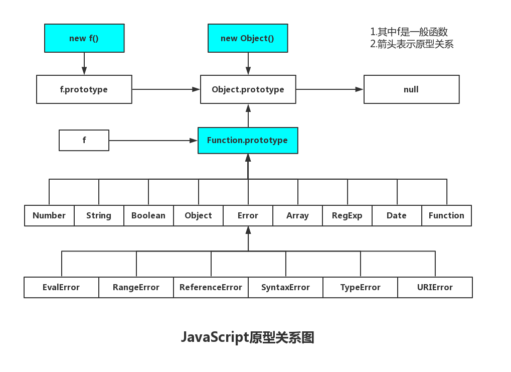

# 面试官问：能否模拟实现JS的new操作符

>`写于2018年11月05日`

## 1. 前言

>大家好，我是[若川](https://lxchuan12.gitee.io)。我倾力持续组织了一年[每周大家一起学习200行左右的源码共读活动](https://juejin.cn/post/7079706017579139102)，感兴趣的可以[点此扫码加我微信 `ruochuan02` 参与](https://juejin.cn/pin/7217386885793595453)。另外，想学源码，极力推荐关注我写的专栏[《学习源码整体架构系列》](https://juejin.cn/column/6960551178908205093)，目前是掘金关注人数（4.1k+人）第一的专栏，写有20余篇源码文章。

>这是面试官问系列的第一篇，旨在帮助读者提升`JS`基础知识，包含`new、call、apply、this、继承`相关知识。<br>
`面试官问系列`文章如下：感兴趣的读者可以点击阅读。<br>
>1.[面试官问：能否模拟实现JS的new操作符](https://juejin.im/post/5bde7c926fb9a049f66b8b52)<br>
>2.[面试官问：能否模拟实现JS的bind方法](https://juejin.im/post/5bec4183f265da616b1044d7)<br>
>3.[面试官问：能否模拟实现JS的call和apply方法](https://juejin.im/post/5bf6c79bf265da6142738b29)<br>
>4.[面试官问：JS的this指向](https://juejin.im/post/5c0c87b35188252e8966c78a)<br>
>5.[面试官问：JS的继承](https://juejin.im/post/5c433e216fb9a049c15f841b)<br>

用过`Vuejs`的同学都知道，需要用`new`操作符来实例化。
```js
new Vue({
    el: '#app',
    mounted(){},
});
```
**那么面试官可能会问是否想过`new`到底做了什么，怎么模拟实现呢。**
>附上之前写文章写过的一段话：已经有很多模拟实现`new`操作符的文章，为什么自己还要写一遍呢。学习就好比是座大山，人们沿着不同的路登山，分享着自己看到的风景。你不一定能看到别人看到的风景，体会到别人的心情。只有自己去登山，才能看到不一样的风景，体会才更加深刻。

## 2. new 做了什么

先看简单**例子1**：
```js
// 例子1
function Student(){
}
var student = new Student();
console.log(student); // {}
// student 是一个对象。
console.log(Object.prototype.toString.call(student)); // [object Object]
// 我们知道平时声明对象也可以用new Object(); 只是看起来更复杂
// 顺便提一下 `new Object`(不推荐)和Object()也是一样的效果
// 可以猜测内部做了一次判断，用new调用
/** if (!(this instanceof Object)) {
*    return new Object();
*  }
*/
var obj = new Object();
console.log(obj) // {}
console.log(Object.prototype.toString.call(student)); // [object Object]

typeof Student === 'function' // true
typeof Object === 'function' // true
```
从这里例子中，我们可以看出：一个函数用`new`操作符来调用后，生成了一个全新的对象。而且`Student`和`Object`都是函数，只不过`Student`是我们自定义的，`Object`是`JS`本身就内置的。
再来看下控制台输出图，感兴趣的读者可以在控制台试试。



与`new Object()` 生成的对象不同的是`new Student()`生成的对象中间还嵌套了一层`__proto__`，它的`constructor`是`Student`这个函数。
```js
// 也就是说：
student.constructor === Student;
Student.prototype.constructor === Student;
```

### 2.1 小结1：从这个简单例子来看，`new`操作符做了两件事：

1. 创建了一个全新的对象。
2. 这个对象会被执行`[[Prototype]]`（也就是`__proto__`）链接。

接下来我们再来看升级版的**例子2**：
```js
// 例子2
function Student(name){
    console.log('赋值前-this', this); // {}
    this.name = name;
    console.log('赋值后-this', this); // {name: '若川'}
}
var student = new Student('若川');
console.log(student); // {name: '若川'}
```
由此可以看出：这里`Student`函数中的`this`指向`new Student()`生成的对象`student`。

### 2.2 小结2：从这个例子来看，`new`操作符又做了一件事：

1. 生成的新对象会绑定到函数调用的`this`。

接下来继续看升级版**例子3**：
```js
// 例子3
function Student(name){
    this.name = name;
    // this.doSth();
}
Student.prototype.doSth = function() {
    console.log(this.name);
};
var student1 = new Student('若');
var student2 = new Student('川');
console.log(student1, student1.doSth()); // {name: '若'} '若'
console.log(student2, student2.doSth()); // {name: '川'} '川'
student1.__proto__ === Student.prototype; // true
student2.__proto__ === Student.prototype; // true
// __proto__ 是浏览器实现的查看原型方案。
// 用ES5 则是：
Object.getPrototypeOf(student1) === Student.prototype; // true
Object.getPrototypeOf(student2) === Student.prototype; // true
```



关于JS的原型关系我之前看到这张图，觉得很不错，分享给大家。




### 2.3 小结3：这个例子3再一次验证了**小结1**中的**第2点**。也就是这个对象会被执行`[[Prototype]]`（也就是`__proto__`）链接。并且通过`new Student()`创建的每个对象将最终被`[[Prototype]]`链接到这个`Student.protytype`对象上。

细心的同学可能会发现这三个例子中的函数都没有返回值。那么有返回值会是怎样的情形呢。
那么接下来请看**例子4**
```js
// 例子4
function Student(name){
    this.name = name;
    // Null（空） null
    // Undefined（未定义） undefined
    // Number（数字） 1
    // String（字符串）'1'
    // Boolean（布尔） true
    // Symbol（符号）（第六版新增） symbol

    // Object（对象） {}
        // Function（函数） function(){}
        // Array（数组） []
        // Date（日期） new Date()
        // RegExp（正则表达式）/a/
        // Error （错误） new Error()
    // return /a/;
}
var student = new Student('若川');
console.log(student); {name: '若川'}
```
我测试这七种类型后[MDN JavaScript类型](https://developer.mozilla.org/zh-CN/docs/Web/JavaScript/A_re-introduction_to_JavaScript)，得出的结果是：前面六种基本类型都会正常返回`{name: '若川'}`，后面的`Object`(包含`Functoin`, `Array`, `Date`, `RegExg`, `Error`)都会直接返回这些值。

### 2.4 由此得出 小结4：

1. 如果函数没有返回对象类型`Object`(包含`Functoin`, `Array`, `Date`, `RegExg`, `Error`)，那么`new`表达式中的函数调用会自动返回这个新的对象。

结合这些小结，整理在一起就是：
1. 创建了一个全新的对象。
2. 这个对象会被执行`[[Prototype]]`（也就是`__proto__`）链接。
3. 生成的新对象会绑定到函数调用的`this`。
4. 通过`new`创建的每个对象将最终被`[[Prototype]]`链接到这个函数的`prototype`对象上。
5. 如果函数没有返回对象类型`Object`(包含`Functoin`, `Array`, `Date`, `RegExg`, `Error`)，那么`new`表达式中的函数调用会自动返回这个新的对象。

## 3. new 模拟实现

知道了这些现象，我们就可以模拟实现`new`操作符。直接贴出代码和注释
```js
/**
 * 模拟实现 new 操作符
 * @param  {Function} ctor [构造函数]
 * @return {Object|Function|Regex|Date|Error}      [返回结果]
 */
function newOperator(ctor){
    if(typeof ctor !== 'function'){
      throw 'newOperator function the first param must be a function';
    }
    // ES6 new.target 是指向构造函数
    newOperator.target = ctor;
    // 1.创建一个全新的对象，
    // 2.并且执行[[Prototype]]链接
    // 4.通过`new`创建的每个对象将最终被`[[Prototype]]`链接到这个函数的`prototype`对象上。
    var newObj = Object.create(ctor.prototype);
    // ES5 arguments转成数组 当然也可以用ES6 [...arguments], Aarry.from(arguments);
    // 除去ctor构造函数的其余参数
    var argsArr = [].slice.call(arguments, 1);
    // 3.生成的新对象会绑定到函数调用的`this`。
    // 获取到ctor函数返回结果
    var ctorReturnResult = ctor.apply(newObj, argsArr);
    // 小结4 中这些类型中合并起来只有Object和Function两种类型 typeof null 也是'object'所以要不等于null，排除null
    var isObject = typeof ctorReturnResult === 'object' && ctorReturnResult !== null;
    var isFunction = typeof ctorReturnResult === 'function';
    if(isObject || isFunction){
        return ctorReturnResult;
    }
    // 5.如果函数没有返回对象类型`Object`(包含`Functoin`, `Array`, `Date`, `RegExg`, `Error`)，那么`new`表达式中的函数调用会自动返回这个新的对象。
    return newObj;
}
```
最后用模拟实现的`newOperator`函数验证下之前的**例子3**：
```js
// 例子3 多加一个参数
function Student(name, age){
    this.name = name;
    this.age = age;
    // this.doSth();
    // return Error();
}
Student.prototype.doSth = function() {
    console.log(this.name);
};
var student1 = newOperator(Student, '若', 18);
var student2 = newOperator(Student, '川', 18);
// var student1 = new Student('若');
// var student2 = new Student('川');
console.log(student1, student1.doSth()); // {name: '若'} '若'
console.log(student2, student2.doSth()); // {name: '川'} '川'

student1.__proto__ === Student.prototype; // true
student2.__proto__ === Student.prototype; // true
// __proto__ 是浏览器实现的查看原型方案。
// 用ES5 则是：
Object.getPrototypeOf(student1) === Student.prototype; // true
Object.getPrototypeOf(student2) === Student.prototype; // true
```
可以看出，很符合`new`操作符。读者发现有不妥或可改善之处，欢迎指出。
回顾这个模拟`new`函数`newOperator`实现，最大的功臣当属于`Object.create()`这个`ES5`提供的`API`。

## 4. Object.create() 用法举例

我之前整理的一篇文章中也有讲过，可以翻看[JavaScript 对象所有API解析](https://segmentfault.com/a/1190000010753942)

[MDN Object.create()](https://developer.mozilla.org/zh-CN/docs/Web/JavaScript/Reference/Global_Objects/Object/create)

`Object.create(proto, [propertiesObject])`
方法创建一个新对象，使用现有的对象来提供新创建的对象的__proto__。
它接收两个参数，不过第二个可选参数是属性描述符（不常用，默认是`undefined`）。
```js
var anotherObject = {
    name: '若川'
};
var myObject = Object.create(anotherObject, {
    age: {
        value：18,
    },
});
// 获得它的原型
Object.getPrototypeOf(anotherObject) === Object.prototype; // true 说明anotherObject的原型是Object.prototype
Object.getPrototypeOf(myObject); // {name: "若川"} // 说明myObject的原型是{name: "若川"}
myObject.hasOwnProperty('name'); // false; 说明name是原型上的。
myObject.hasOwnProperty('age'); // true 说明age是自身的
myObject.name; // '若川'
myObject.age; // 18;
```
对于不支持`ES5`的浏览器，`MDN`上提供了`ployfill`方案。
```js
if (typeof Object.create !== "function") {
    Object.create = function (proto, propertiesObject) {
        if (typeof proto !== 'object' && typeof proto !== 'function') {
            throw new TypeError('Object prototype may only be an Object: ' + proto);
        } else if (proto === null) {
            throw new Error("This browser's implementation of Object.create is a shim and doesn't support 'null' as the first argument.");
        }

        if (typeof propertiesObject != 'undefined') throw new Error("This browser's implementation of Object.create is a shim and doesn't support a second argument.");

        function F() {}
        F.prototype = proto;
        return new F();
    };
}
```
到此，文章就基本写完了。感谢读者看到这里。

## 5. 最后总结一下：

1. `new`做了什么：
>1. 创建了一个全新的对象。
>2. 这个对象会被执行`[[Prototype]]`（也就是`__proto__`）链接。
>3. 生成的新对象会绑定到函数调用的`this`。
>4. 通过`new`创建的每个对象将最终被`[[Prototype]]`链接到这个函数的`prototype`对象上。
>5. 如果函数没有返回对象类型`Object`(包含`Functoin`, `Array`, `Date`, `RegExg`, `Error`)，那么`new`表达式中的函数调用会自动返回这个新的对象。

2. 怎么模拟实现
```js
// 去除了注释
function newOperator(ctor){
    if(typeof ctor !== 'function'){
      throw 'newOperator function the first param must be a function';
    }
    newOperator.target = ctor;
    var newObj = Object.create(ctor.prototype);
    var argsArr = [].slice.call(arguments, 1);
    var ctorReturnResult = ctor.apply(newObj, argsArr);
    var isObject = typeof ctorReturnResult === 'object' && ctorReturnResult !== null;
    var isFunction = typeof ctorReturnResult === 'function';
    if(isObject || isFunction){
        return ctorReturnResult;
    }
    return newObj;
}
```
读者发现有不妥或可改善之处，欢迎指出。另外觉得写得不错，可以点个赞，也是对我的一种支持。

## 关于

作者：常以**若川**为名混迹于江湖。前端路上 | PPT爱好者 | 所知甚少，唯善学。<br>
[个人博客](https://lxchuan12.github.io/)<br>
[掘金专栏](https://juejin.im/user/1415826704971918/posts)，欢迎关注~<br>
[`segmentfault`前端视野专栏](https://segmentfault.com/blog/lxchuan12)，开通了**前端视野**专栏，欢迎关注~<br>
[知乎前端视野专栏](https://zhuanlan.zhihu.com/lxchuan12)，开通了**前端视野**专栏，欢迎关注~<br>
[github blog](https://github.com/ruochuan12/blog)，相关源码和资源都放在这里，求个`star`^_^~

## 微信公众号  若川视野

可能比较有趣的微信公众号，长按扫码关注。也可以加微信 `ruochuan12`，注明来源，拉您进【前端视野交流群】。


