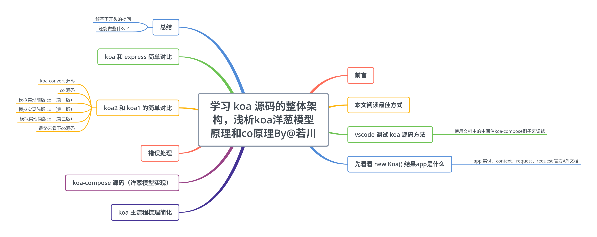
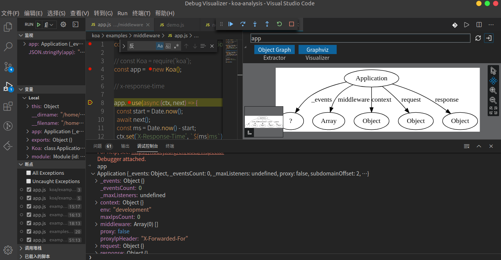
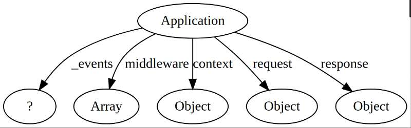
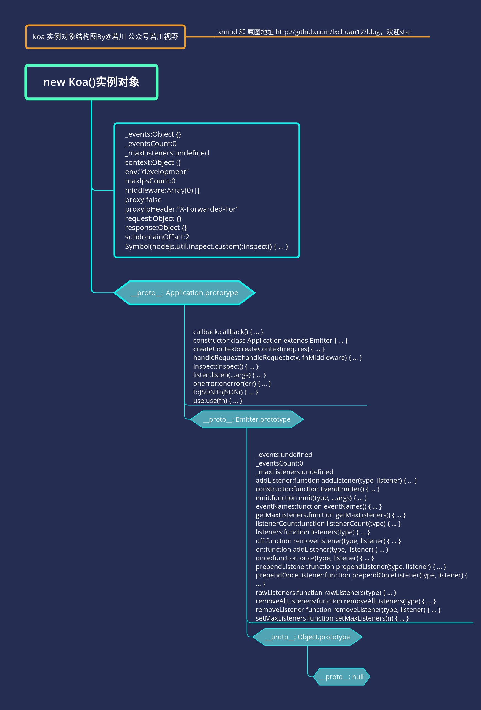

# 学习 koa 源码的整体架构，浅析koa洋葱模型原理和co原理

## 前言

>这是`学习源码整体架构系列`第七篇。整体架构这词语好像有点大，姑且就算是源码整体结构吧，主要就是学习是代码整体结构，不深究其他不是主线的具体函数的实现。本篇文章学习的是实际仓库的代码。

`学习源码整体架构系列`文章如下：
>1.[学习 jQuery 源码整体架构，打造属于自己的 js 类库](https://juejin.im/post/5d39d2cbf265da1bc23fbd42)<br>
>2.[学习 underscore 源码整体架构，打造属于自己的函数式编程类库](https://juejin.im/post/5d4bf94de51d453bb13b65dc)<br>
>3.[学习 lodash 源码整体架构，打造属于自己的函数式编程类库](https://juejin.im/post/5d767e1d6fb9a06b032025ea)<br>
>4.[学习 sentry 源码整体架构，打造属于自己的前端异常监控SDK](https://juejin.im/post/5dba5a39e51d452a2378348a)<br>
>5.[学习 vuex 源码整体架构，打造属于自己的状态管理库](https://juejin.im/post/5dd4e61a6fb9a05a5c010af0)<br>
>6.[学习 axios 源码整体架构，打造属于自己的请求库](https://juejin.im/post/5df349b5518825123751ba66)<br>
>7.[学习 koa 源码的整体架构，浅析koa洋葱模型原理和co原理](https://juejin.im/post/5e69925cf265da571e262fe6)<br>

感兴趣的读者可以点击阅读。<br>
其他源码计划中的有：[`express`](https://github.com/lxchuan12/express-analysis)、[`vue-rotuer`](https://github.com/lxchuan12/vue-router-analysis)、[`redux`](https://github.com/lxchuan12/redux-analysis)、  [`react-redux`](https://github.com/lxchuan12/react-redux-analysis) 等源码，不知何时能写完（哭泣），欢迎持续关注我（若川）。

源码类文章，一般阅读量不高。已经有能力看懂的，自己就看了。不想看，不敢看的就不会去看源码。<br>
所以我的文章，尽量写得让想看源码又不知道怎么看的读者能看懂。

如果你简历上一不小心写了熟悉`koa`，面试官大概率会问：
>1、`koa`洋葱模型怎么实现的。<br>
>2、如果中间件中的`next()`方法报错了怎么办。<br>
>3、`co`的原理是怎样的。<br>
>等等问题<br>

**导读**<br>
文章通过例子调试`koa`，梳理`koa`的主流程，来理解`koa-compose`洋葱模型原理和`co`库的原理，相信看完一定会有所收获。



本文学习的`koa`版本是`v2.11.0`。克隆的官方仓库的`master`分支。
截至目前（2020年3月11日），最新一次`commit`是`2020-01-04 07:41 Olle Jonsson` `eda27608`，`build: Drop unused Travis sudo: false directive (#1416)`。

本文仓库在这里[若川的 koa-analysis github 仓库 https://github.com/lxchuan12/koa-analysis](https://github.com/lxchuan12/koa-analysis)。求个`star`呀。

## 本文阅读最佳方式

先`star`一下我的仓库，再把它`git clone https://github.com/lxchuan12/koa-analysis.git`克隆下来。不用管你是否用过`nodejs`。会一点点`promise、generator、async、await`等知识即可看懂。如果一点点也不会，可以边看阮一峰老师的[《ES6标准入门》](https://es6.ruanyifeng.com/#docs/generator)相关章节。**跟着文章节奏调试和示例代码调试，动手调试（用`vscode`或者`chrome`）印象更加深刻**。文章长段代码不用细看，可以调试时再细看。看这类源码文章百遍，可能不如自己多调试几遍。也欢迎加我微信交流`lxchuan12`。

```bash
# 克隆我的这个仓库
git clone https://github.com/lxchuan12/koa-analysis.git
# chrome 调试：
# 全局安装 http-server
npm i -g http-server
hs koa/examples/
# 可以指定端口 -p 3001
# hs -p 3001 koa/examples/
# 浏览器中打开
# 然后在浏览器中打开localhost:8080，开心的把代码调试起来
```

这里把这个`examples`文件夹做个简单介绍。<br>
- `middleware`文件夹是用来`vscode`调试整体流程的。<br>
- `simpleKoa` 文件夹是`koa`简化版，为了调试`koa-compose`洋葱模型如何串联起来各个中间件的。<br>
- `koa-convert`文件夹是用来调试`koa-convert`和`co`源码的。<br>
- `co-generator`文件夹是模拟实现`co`的示例代码。<br>

## vscode 调试 koa 源码方法

之前，我在知乎回答了一个问题[一年内的前端看不懂前端框架源码怎么办？](https://www.zhihu.com/question/350289336/answer/910970733)
推荐了一些资料，阅读量还不错，大家有兴趣可以看看。主要有四点：<br>
>1.借助调试<br>
>2.搜索查阅相关高赞文章<br>
>3.把不懂的地方记录下来，查阅相关文档<br>
>4.总结<br>

看源码，调试很重要，所以我详细写下 `koa` 源码调试方法，帮助一些可能不知道如何调试的读者。

```bash
# 我已经克隆到我的koa-analysis仓库了
git clone https://github.com/koajs/koa.git
```

```json
// package.json
{
  "name": "koa",
  "version": "2.11.0",
  "description": "Koa web app framework",
  "main": "lib/application.js",
}
```

克隆源码后，看`package.json`找到`main`，就知道入口文件是`lib/application.js`了。

大概看完项目结构后发现没有`examples`文件夹（一般项目都会有这个文件夹，告知用户如何使用该项目），这时仔细看`README.md`。
如果看英文`README.md`有些吃力，会发现在`Community`标题下有一个[中文文档 v2.x](https://github.com/demopark/koa-docs-Zh-CN)。同时也有一个[`examples`仓库](https://github.com/koajs/examples)。

```bash
# 我已经克隆下来到我的仓库了
git clone https://github.com/koajs/examples.git
```

这时再开心的把`examples`克隆到自己电脑。可以安装好依赖，逐个研究学习下这里的例子，然后可能就一不小心掌握了`koa`的基本用法。当然，我这里不详细写这一块了，我是自己手写一些例子来调试。

继续看文档会发现**使用指南**讲述`编写中间件`。

### 使用文档中的中间件`koa-compose`例子来调试

学习 `koa-compose` 前，先看两张图。


在`koa`中，请求响应都放在中间件的第一个参数`context`对象中了。

再引用[Koa中文文档](https://github.com/demopark/koa-docs-Zh-CN/blob/master/guide.md#debugging-koa)中的一段：

如果您是前端开发人员，您可以将 `next()`; 之前的任意代码视为“捕获”阶段，这个简易的 `gif` 说明了 `async` 函数如何使我们能够恰当地利用堆栈流来实现请求和响应流：


>
>   1. 创建一个跟踪响应时间的日期
>   2. 等待下一个中间件的控制
>   3. 创建另一个日期跟踪持续时间
>   4. 等待下一个中间件的控制
>   5. 将响应主体设置为“Hello World”
>   6. 计算持续时间
>   7. 输出日志行
>   8. 计算响应时间
>   9. 设置 `X-Response-Time` 头字段
>   10. 交给 Koa 处理响应

读者们看完这个gif图，也可以思考下如何实现的。根据表现，可以猜测是`next`是一个函数，而且返回的可能是一个`promise`，被`await`调用。

看到这个`gif`图，我把之前写的`examples/koa-compose`的调试方法**含泪删除**了。默默写上`gif`图上的这些代码，想着这个读者们更容易读懂。
我把这段代码写在这里 [`koa/examples/middleware/app.js`](https://github.com/lxchuan12/koa-analysis/blob/master/koa/examples/middleware/app.js)便于调试。

在项目路径下配置新建[.vscode/launch.json](https://github.com/lxchuan12/koa-analysis/blob/master/.vscode/launch.json)文件，`program`配置为自己写的`koa/examples/middleware/app.js`文件。

<details>
<summary>.vscode/launch.json 代码，点击这里展开/收缩，可以复制</summary>

```json
{
    "version": "0.2.0",
    "configurations": [
        {
            "type": "node",
            "request": "launch",
            "name": "启动程序",
            "skipFiles": [
                "<node_internals>/**"
            ],
            "program": "${workspaceFolder}/koa/examples/middleware/app.js"
        }
    ]
}
```

</details>

按`F5键`开始调试，调试时先走主流程，必要的地方打上断点，不用一开始就关心细枝末节。

>**断点调试要领：**<br>
**赋值语句可以一步跳过，看返回值即可，后续详细再看。**<br>
**函数执行需要断点跟着看，也可以结合注释和上下文倒推这个函数做了什么。**<br>

上述比较啰嗦的写了一堆调试方法。主要是想着`授人予鱼不如授人予渔`，这样换成其他源码也会调试了。

简单说下`chrome`调试`nodejs`，`chrome`浏览器打开`chrome://inspect`，点击配置**configure...**配置`127.0.0.1:端口号`(端口号在`Vscode` 调试控制台显示了)。<br>
更多可以查看[English Debugging Guide](https://nodejs.org/en/docs/inspector)<br>
[中文调试指南](https://nodejs.org/zh-cn/docs/guides/debugging-getting-started/)<br>
喜欢看视频的读者也可以看慕课网这个视频[node.js调试入门](https://www.imooc.com/learn/1093)，讲得还是比较详细的。<br>
不过我感觉在`chrome`调试`nodejs`项目体验不是很好（可能是我方式不对），所以我大部分具体的代码时都放在`html`文件`script`形式，在`chrome`调试了。

## 先看看 `new Koa()` 结果`app`是什么

看源码我习惯性看**它的实例对象结构**，一般所有属性和方法都放在实例对象上了，而且会通过原型链查找形式查找最顶端的属性和方法。

用`koa/examples/middleware/app.js`文件调试时，先看下执行`new Koa()`之后，`app`是什么，有个初步印象。

```js
// 文件 koa/examples/middleware/app.js
const Koa = require('../../lib/application');

// const Koa = require('koa');
// 这里打个断点
const app = new Koa();
// x-response-time

// 这里打个断点
app.use(async (ctx, next) => {

});
```

在调试控制台`ctrl + 反引号键（一般在`Tab`上方的按键）唤起`，输入`app`，按`enter`键打印`app`。会有一张这样的图。



`VScode`也有一个代码调试神器插件[`Debug Visualizer`](https://marketplace.visualstudio.com/items?itemName=hediet.debug-visualizer)。

安装好后插件后，按`ctrl + shift + p`，输入`Open a new Debug Visualizer View`，来使用，输入`app`，显示是这样的。



不过目前体验来看，相对还比较鸡肋，只能显示一级，而且只能显示对象，相信以后会更好。更多玩法可以查看它的文档。

我把koa实例对象比较完整的用`xmind`画出来了，大概看看就好，有个初步印象。



接着，我们可以看下`app 实例、context、request、request`的官方文档。

### app 实例、context、request、request 官方API文档

- [index API](https://github.com/demopark/koa-docs-Zh-CN/blob/master/api/index.md) | [context API](https://github.com/demopark/koa-docs-Zh-CN/blob/master/api/context.md) | [request API](https://github.com/demopark/koa-docs-Zh-CN/blob/master/api/request.md) | [response API](https://github.com/demopark/koa-docs-Zh-CN/blob/master/api/response.md)

可以真正使用的时候再去仔细看文档。

## koa 主流程梳理简化

通过`F5启动调试（直接跳到下一个断点处）`、`F10单步跳过`、`F11单步调试`等，配合重要的地方断点，调试完整体代码，其实比较容易整理出如下主流程的代码。

```js
class Emitter{
  // node 内置模块
  constructor(){
  }
}
class Koa extends Emitter{
  constructor(options){
    super();
    options = options || {};
    this.middleware = [];
    this.context = {
      method: 'GET',
      url: '/url',
      body: undefined,
      set: function(key, val){
        console.log('context.set', key, val);
      },
    };
  }
  use(fn){
    this.middleware.push(fn);
    return this;
  }
  listen(){
    const  fnMiddleware = compose(this.middleware);
    const ctx = this.context;
    const handleResponse = () => respond(ctx);
    const onerror = function(){
      console.log('onerror');
    };
    fnMiddleware(ctx).then(handleResponse).catch(onerror);
  }
}
function respond(ctx){
  console.log('handleResponse');
  console.log('response.end', ctx.body);
}
```

重点就在`listen`函数里的`compose`这个函数，接下来我们就详细来**欣赏**下这个函数。

## koa-compose 源码（洋葱模型实现）

通过`app.use()` 添加了若干函数，但是要把它们串起来执行呀。像上文的`gif`图一样。

`compose`函数，传入一个数组，返回一个函数。对入参是不是数组和校验数组每一项是不是函数。

```js
function compose (middleware) {
  if (!Array.isArray(middleware)) throw new TypeError('Middleware stack must be an array!')
  for (const fn of middleware) {
    if (typeof fn !== 'function') throw new TypeError('Middleware must be composed of functions!')
  }

 //  传入对象 context 返回Promise
  return function (context, next) {
    // last called middleware #
    let index = -1
    return dispatch(0)
    function dispatch (i) {
      if (i <= index) return Promise.reject(new Error('next() called multiple times'))
      index = i
      let fn = middleware[i]
      if (i === middleware.length) fn = next
      if (!fn) return Promise.resolve()
      try {
        return Promise.resolve(fn(context, dispatch.bind(null, i + 1)));
      } catch (err) {
        return Promise.reject(err)
      }
    }
  }
}
```

把简化的代码和`koa-compose`代码写在了一个文件中。[koa/examples/simpleKoa/koa-compose.js](https://github.com/lxchuan12/koa-analysis/blob/master/koa/examples/simpleKoa/koa-compose.js)

```bash
hs koa/examples/
# 然后可以打开localhost:8080/simpleKoa，开心的把代码调试起来
```

不过这样好像还是有点麻烦，我还把这些代码放在[`codepen` https://codepen.io/lxchuan12/pen/wvarPEb](https://codepen.io/lxchuan12/pen/wvarPEb)中，**直接可以在线调试啦**。是不是觉得很贴心^_^，自己多调试几遍便于消化理解。

你会发现`compose`就是类似这样的结构（移除一些判断）。

```js
// 这样就可能更好理解了。
// simpleKoaCompose
const [fn1, fn2, fn3] = this.middleware;
const fnMiddleware = function(context){
    return Promise.resolve(
      fn1(context, function next(){
        return Promise.resolve(
          fn2(context, function next(){
              return Promise.resolve(
                  fn3(context, function next(){
                    return Promise.resolve();
                  })
              )
          })
        )
    })
  );
};
fnMiddleware(ctx).then(handleResponse).catch(onerror);
```

>也就是说`koa-compose`返回的是一个`Promise`，`Promise`中取出第一个函数（`app.use`添加的中间件），传入`context`和第一个`next`函数来执行。<br>
第一个`next`函数里也是返回的是一个`Promise`，`Promise`中取出第二个函数（`app.use`添加的中间件），传入`context`和第二个`next`函数来执行。<br>
第二个`next`函数里也是返回的是一个`Promise`，`Promise`中取出第三个函数（`app.use`添加的中间件），传入`context`和第三个`next`函数来执行。<br>
第三个...<br>
以此类推。最后一个中间件中有调用`next`函数，则返回`Promise.resolve`。如果没有，则不执行`next`函数。
这样就把所有中间件串联起来了。这也就是我们常说的洋葱模型。<br>

**不得不说非常惊艳，“玩还是大神会玩”**。

这种把函数存储下来的方式，在很多源码中都有看到。比如`lodash`源码的惰性求值，`vuex`也是把`action`等函数存储下，最后才去调用。

搞懂了`koa-compose` 洋葱模型实现的代码，其他代码就不在话下了。

## 错误处理

[中文文档 错误处理](https://github.com/demopark/koa-docs-Zh-CN/blob/master/error-handling.md)

仔细看文档，文档中写了三种捕获错误的方式。

- `ctx.onerror` 中间件中的错误捕获
- `app.on('error', (err) => {})` 最外层实例事件监听形式
  也可以看看例子[koajs/examples/errors/app.js 文件](https://github.com/koajs/examples/blob/master/errors/app.js)
- `app.onerror = (err) => {}` 重写`onerror`自定义形式
  也可以看[测试用例 onerror](https://github.com/lxchuan12/koa-analysis/blob/master/koa/test/context/onerror.js)

```js
// application.js 文件
class Application extends Emitter {
  // 代码有简化组合
  listen(){
    const  fnMiddleware = compose(this.middleware);
    if (!this.listenerCount('error')) this.on('error', this.onerror);
    const onerror = err => ctx.onerror(err);
    fnMiddleware(ctx).then(handleResponse).catch(onerror);
  }
  onerror(err) {
    // 代码省略
    // ...
  }
}
```

**ctx.onerror**

`lib/context.js`文件中，有一个函数`onerror`，而且有这么一行代码`this.app.emit('error', err, this)`。

```js
module.exports = {
  onerror(){
    // delegate
    // app 是在new Koa() 实例
    this.app.emit('error', err, this);
  }
}
```

```js
app.use(async (ctx, next) => {
  try {
    await next();
  } catch (err) {
    err.status = err.statusCode || err.status || 500;
    throw err;
  }
});
```

`try catch` 错误或被`fnMiddleware(ctx).then(handleResponse).catch(onerror);`，这里的`onerror`是`ctx.onerror`<br>
而`ctx.onerror`函数中又调用了`this.app.emit('error', err, this)`，所以在最外围`app.on('error'，err => {})`可以捕获中间件链中的错误。
因为`koa`继承自`events模块`，所以有'emit'和`on`等方法）

## koa2 和 koa1 的简单对比

[中文文档中描述了 koa2 和 koa1 的区别](https://github.com/demopark/koa-docs-Zh-CN/blob/master/migration.md)

`koa1`中主要是`generator`函数。`koa2`中会自动转换`generator`函数。

```js
// Koa 将转换
app.use(function *(next) {
  const start = Date.now();
  yield next;
  const ms = Date.now() - start;
  console.log(`${this.method} ${this.url} - ${ms}ms`);
});
```

### koa-convert 源码

在`vscode/launch.json`文件，找到这个`program`字段，修改为`"program": "${workspaceFolder}/koa/examples/koa-convert/app.js"`。

通过`F5启动调试（直接跳到下一个断点处）`、`F10单步跳过`、`F11单步调试`调试走一遍流程。重要地方断点调试。

`app.use`时有一层判断，是否是`generator`函数，如果是则用`koa-convert`暴露的方法`convert`来转换重新赋值，再存入`middleware`，后续再使用。

```js
class Koa extends Emitter{
  use(fn) {
    if (typeof fn !== 'function') throw new TypeError('middleware must be a function!');
    if (isGeneratorFunction(fn)) {
      deprecate('Support for generators will be removed in v3. ' +
                'See the documentation for examples of how to convert old middleware ' +
                'https://github.com/koajs/koa/blob/master/docs/migration.md');
      fn = convert(fn);
    }
    debug('use %s', fn._name || fn.name || '-');
    this.middleware.push(fn);
    return this;
  }
}
```

`koa-convert`源码挺多，核心代码其实是这样的。

```js
function convert(){
 return function (ctx, next) {
    return co.call(ctx, mw.call(ctx, createGenerator(next)))
  }
  function * createGenerator (next) {
    return yield next()
  }
}
```

最后还是通过`co`来转换的。所以接下来看`co`的源码。

### co 源码

[tj大神写的co 仓库](https://github.com/tj/co)

本小节的示例代码都在这个文件夹[`koa/examples/co-generator`](https://github.com/lxchuan12/koa-analysis/tree/master/koa/examples/co-generator)中，`hs koa/example`，可以自行打开`https://localhost:8080/co-generator`调试查看。

看`co`源码前，先看几段简单代码。

```js
// 写一个请求简版请求
function request(ms= 1000) {
  return new Promise((resolve) => {
    setTimeout(() => {
      resolve({name: '若川'});
    }, ms);
  });
}
```

```js
// 获取generator的值
function* generatorFunc(){
  const res = yield request();
  console.log(res, 'generatorFunc-res');
}
generatorFunc(); // 报告，我不会输出你想要的结果的
```

简单来说`co`，就是把`generator`自动执行，再返回一个`promise`。
**`generator`函数这玩意它不自动执行呀，还要一步步调用`next()`，也就是叫它走一步才走一步**。

所以有了`async、await`函数。

```js
// await 函数 自动执行
async function asyncFunc(){
    const res = await request();
    console.log(res, 'asyncFunc-res await 函数 自动执行');
}
asyncFunc(); // 输出结果
```

也就是说`co`需要做的事情，是让`generator`向`async、await`函数一样自动执行。

### 模拟实现简版 co（第一版）

这时，我们来模拟实现第一版的`co`。根据`generator`的特性，其实容易写出如下代码。

```js
// 获取generator的值
function* generatorFunc(){
  const res = yield request();
  console.log(res, 'generatorFunc-res');
}

function coSimple(gen){
  gen = gen();
  console.log(gen, 'gen');

  const ret = gen.next();
  const promise = ret.value;
  promise.then(res => {
    gen.next(res);
  });
}
coSimple(generatorFunc);
// 输出了想要的结果
// {name: "若川"}"generatorFunc-res"
```

### 模拟实现简版 co（第二版）

但是实际上，不会上面那么简单的。有可能是多个`yield`和传参数的情况。
传参可以通过这如下两行代码来解决。

```js
const args = Array.prototype.slice.call(arguments, 1);
gen = gen.apply(ctx, args);
```

两个`yield`，我大不了重新调用一下`promise.then`，搞定。

```js
// 多个yeild，传参情况
function* generatorFunc(suffix = ''){
  const res = yield request();
  console.log(res, 'generatorFunc-res' + suffix);

  const res2 = yield request();
  console.log(res2, 'generatorFunc-res-2' + suffix);
}

function coSimple(gen){
  const ctx = this;
  const args = Array.prototype.slice.call(arguments, 1);
  gen = gen.apply(ctx, args);
  console.log(gen, 'gen');

  const ret = gen.next();
  const promise = ret.value;
  promise.then(res => {
    const ret = gen.next(res);
    const promise = ret.value;
      promise.then(res => {
        gen.next(res);
      });
  });
}

coSimple(generatorFunc, ' 哎呀，我真的是后缀');
```

### 模拟实现简版 co（第三版）

问题是肯定不止两次，无限次的`yield`的呢，这时肯定要把重复的封装起来。而且返回是`promise`，这就实现了如下版本的代码。

```js
function* generatorFunc(suffix = ''){
  const res = yield request();
  console.log(res, 'generatorFunc-res' + suffix);

  const res2 = yield request();
  console.log(res2, 'generatorFunc-res-2' + suffix);

  const res3 = yield request();
  console.log(res3, 'generatorFunc-res-3' + suffix);

  const res4 = yield request();
  console.log(res4, 'generatorFunc-res-4' + suffix);
}

function coSimple(gen){
  const ctx = this;
  const args = Array.prototype.slice.call(arguments, 1);
  gen = gen.apply(ctx, args);
  console.log(gen, 'gen');

  return new Promise((resolve, reject) => {

    onFulfilled();

    function onFulfilled(res){
      const ret = gen.next(res);
      next(ret);
    }

    function next(ret) {
      const promise = ret.value;
      promise && promise.then(onFulfilled);
    }

  });
}

coSimple(generatorFunc, ' 哎呀，我真的是后缀');
```

但第三版的模拟实现简版`co`中，还没有考虑报错和一些参数合法的情况。

### 最终来看下`co`源码

这时来看看`co`的源码，报错和错误的情况，错误时调用`reject`，是不是就好理解了一些呢。

```js
function co(gen) {
  var ctx = this;
  var args = slice.call(arguments, 1)

  // we wrap everything in a promise to avoid promise chaining,
  // which leads to memory leak errors.
  // see https://github.com/tj/co/issues/180
  return new Promise(function(resolve, reject) {
    // 把参数传递给gen函数并执行
    if (typeof gen === 'function') gen = gen.apply(ctx, args);
    // 如果不是函数 直接返回
    if (!gen || typeof gen.next !== 'function') return resolve(gen);

    onFulfilled();

    /**
     * @param {Mixed} res
     * @return {Promise}
     * @api private
     */

    function onFulfilled(res) {
      var ret;
      try {
        ret = gen.next(res);
      } catch (e) {
        return reject(e);
      }
      next(ret);
    }

    /**
     * @param {Error} err
     * @return {Promise}
     * @api private
     */

    function onRejected(err) {
      var ret;
      try {
        ret = gen.throw(err);
      } catch (e) {
        return reject(e);
      }
      next(ret);
    }

    /**
     * Get the next value in the generator,
     * return a promise.
     *
     * @param {Object} ret
     * @return {Promise}
     * @api private
     */

    // 反复执行调用自己
    function next(ret) {
      // 检查当前是否为 Generator 函数的最后一步，如果是就返回
      if (ret.done) return resolve(ret.value);
      // 确保返回值是promise对象。
      var value = toPromise.call(ctx, ret.value);
      // 使用 then 方法，为返回值加上回调函数，然后通过 onFulfilled 函数再次调用 next 函数。
      if (value && isPromise(value)) return value.then(onFulfilled, onRejected);
      // 在参数不符合要求的情况下（参数非 Thunk 函数和 Promise 对象），将 Promise 对象的状态改为 rejected，从而终止执行。
      return onRejected(new TypeError('You may only yield a function, promise, generator, array, or object, '
        + 'but the following object was passed: "' + String(ret.value) + '"'));
    }
  });
}
```

## koa 和 express 简单对比

[中文文档 koa 和 express 对比](https://github.com/demopark/koa-docs-Zh-CN/blob/master/koa-vs-express.md)

文档里写的挺全面的。简单来说`koa2`语法更先进，更容易深度定制（`egg.js`、`think.js`、底层框架都是`koa`）。

## 总结

文章通过`授人予鱼不如授人予鱼`的方式，告知如何调试源码，看完了`koa-compose`洋葱模型实现，`koa-convert`和`co`等源码。

`koa-compose`是将`app.use`添加到`middleware`数组中的中间件（函数），通过使用`Promise`串联起来，`next()`返回的是一个`promise`。

`koa-convert` 判断`app.use`传入的函数是否是`generator`函数，如果是则用`koa-convert`来转换，最终还是调用的`co`来转换。

`co`源码实现原理：其实就是通过不断的调用`generator`函数的`next()`函数，来达到自动执行`generator`函数的效果（类似`async、await函数的自动自行`）。

`koa`框架总结：主要就是四个核心概念，洋葱模型（把中间件串联起来），`http`请求上下文（`context`）、`http`请求对象、`http`响应对象。

本文仓库在这里[若川的 koa-analysis github 仓库 https://github.com/lxchuan12/koa-analysis](https://github.com/lxchuan12/koa-analysis)。求个`star`呀。

```bash
git clone https://github.com/lxchuan12/koa-analysis.git
```

再强烈建议下按照**本文阅读最佳方式**，克隆代码下来，**动手调试代码学习更加深刻**。

>如果读者发现有不妥或可改善之处，再或者哪里没写明白的地方，欢迎评论指出，也欢迎加我微信交流`lxchuan12`。另外觉得写得不错，对您有些许帮助，可以点赞、评论、转发分享，也是对笔者的一种支持，万分感谢。

### 解答下开头的提问

仅供参考

>1、`koa`洋葱模型怎么实现的。<br>

可以参考上文整理的简版`koa-compose`作答。

```js
// 这样就可能更好理解了。
// simpleKoaCompose
const [fn1, fn2, fn3] = this.middleware;
const fnMiddleware = function(context){
    return Promise.resolve(
      fn1(context, function next(){
        return Promise.resolve(
          fn2(context, function next(){
              return Promise.resolve(
                  fn3(context, function next(){
                    return Promise.resolve();
                  })
              )
          })
        )
    })
  );
};
fnMiddleware(ctx).then(handleResponse).catch(onerror);
```

答：app.use() 把中间件函数存储在`middleware`数组中，最终会调用`koa-compose`导出的函数`compose`返回一个`promise`，中间函数的第一个参数`ctx`是包含响应和请求的一个对象，会不断传递给下一个中间件。`next`是一个函数，返回的是一个`promise`。

>2、如果中间件中的`next()`方法报错了怎么办。<br>

可参考上文整理的错误处理作答。

```js
ctx.onerror = function {
  this.app.emit('error', err, this);
};
  listen(){
    const  fnMiddleware = compose(this.middleware);
    if (!this.listenerCount('error')) this.on('error', this.onerror);
    const onerror = err => ctx.onerror(err);
    fnMiddleware(ctx).then(handleResponse).catch(onerror);
  }
  onerror(err) {
    // 代码省略
    // ...
  }
```

答：中间件链错误会由`ctx.onerror`捕获，该函数中会调用`this.app.emit('error', err, this)`（因为`koa`继承自`events模块`，所以有'emit'和`on`等方法），可以使用`app.on('error', (err) => {})`，或者`app.onerror = (err) => {}`进行捕获。

>3、`co`的原理是怎样的。<br>
答：`co`的原理是通过不断调用`generator`函数的`next`方法来达到自动执行`generator`函数的，类似`async、await`函数自动执行。

答完，面试官可能觉得小伙子还是蛮懂`koa`的啊。当然也可能继续追问，直到答不出...

### 还能做些什么 ？

学完了整体流程，`koa-compose`、`koa-convert`和`co`的源码。

还能仔细看看看`http`请求上下文（`context`）、`http`请求对象、`http`响应对象的具体实现。

还能根据我文章说的调试方式调试[koa 组织](https://github.com/koajs)中的各种中间件，比如`koa-bodyparser`, `koa-router`，`koa-jwt`，`koa-session`、`koa-cors`等等。

还能把[`examples`仓库](https://github.com/koajs/examples)克隆下来，我的这个仓库已经克隆了，挨个调试学习下源码。

`web`框架有很多，比如`Express.js`，`Koa.js`、`Egg.js`、`Nest.js`、`Next.js`、`Fastify.js`、`Hapi.js`、`Restify.js`、`Loopback.io`、`Sails.js`、`Midway.js`等等。

还能把这些框架的优势劣势、设计思想等学习下。

还能继续学习`HTTP`协议、`TCP/IP`协议网络相关，虽然不属于`koa`的知识，但需深入学习掌握。

学无止境~~~

## 推荐阅读

[koa 官网](https://koajs.com/) | [koa 仓库](https://github.com/koajs/koa) | [koa 组织](https://github.com/koajs) | [koa2 中文文档](https://github.com/demopark/koa-docs-Zh-CN) | [co 仓库](https://github.com/tj/co)<br>
[知乎@姚大帅：可能是目前市面上比较有诚意的Koa2源码解读](https://zhuanlan.zhihu.com/p/34797505)<br>
[知乎@零小白：十分钟带你看完 KOA 源码](https://zhuanlan.zhihu.com/p/24559011)<br>
[微信开放社区@小丹の：可能是目前最全的koa源码解析指南](https://developers.weixin.qq.com/community/develop/article/doc/0000e4c9290bc069f3380e7645b813)<br>
[IVWEB官方账号: KOA2框架原理解析和实现](https://ivweb.io/article.html?_id=100334)<br>
[深入浅出vue.js 作者 berwin: 深入浅出 Koa2 原理](https://github.com/berwin/Blog/issues/9)<br>
[阮一峰老师：co 函数库的含义和用法](http://www.ruanyifeng.com/blog/2015/05/co.html)<br>

## 另一个系列

[面试官问：JS的继承](https://juejin.im/post/5c433e216fb9a049c15f841b)<br>
[面试官问：JS的this指向](https://juejin.im/post/5c0c87b35188252e8966c78a)<br>
[面试官问：能否模拟实现JS的call和apply方法](https://juejin.im/post/5bf6c79bf265da6142738b29)<br>
[面试官问：能否模拟实现JS的bind方法](https://juejin.im/post/5bec4183f265da616b1044d7)<br>
[面试官问：能否模拟实现JS的new操作符](https://juejin.im/post/5bde7c926fb9a049f66b8b52)<br>

## 关于

作者：常以**若川**为名混迹于江湖。前端路上 | PPT爱好者 | 所知甚少，唯善学。<br>
[若川的博客](https://lxchuan12.cn)，使用`vuepress`重构了，阅读体验可能更好些<br>
[掘金专栏](https://juejin.im/user/57974dc55bbb500063f522fd/posts)，欢迎关注~<br>
[`segmentfault`前端视野专栏](https://segmentfault.com/blog/lxchuan12)，欢迎关注~<br>
[知乎前端视野专栏](https://zhuanlan.zhihu.com/lxchuan12)，欢迎关注~<br>
[语雀前端视野专栏](https://www.yuque.com/lxchuan12/blog)，新增语雀专栏，欢迎关注~<br>
[github blog](https://github.com/lxchuan12/blog)，相关源码和资源都放在这里，求个`star`^_^~

## 欢迎加微信交流 微信公众号

可能比较有趣的微信公众号，长按扫码关注（**回复pdf获取前端优质书籍pdf**）。欢迎加我微信`lxchuan12`（注明来源，基本来者不拒），拉您进【前端视野交流群】，长期交流学习~

