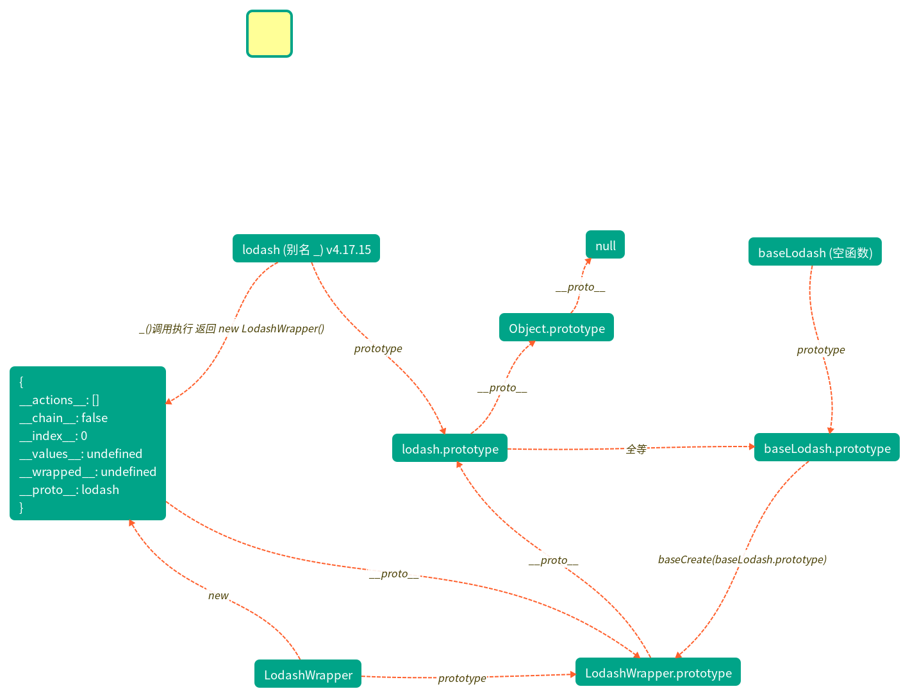
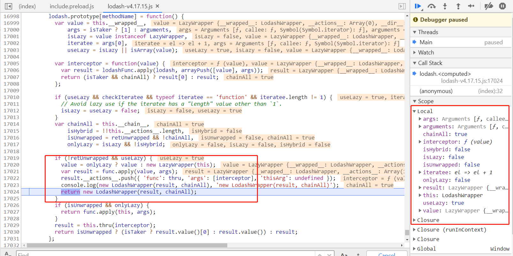
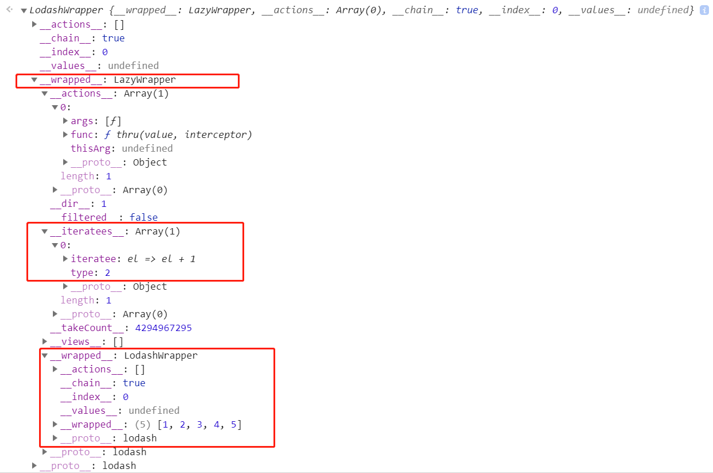

# 学习 lodash  源码整体架构，打造属于自己的函数式编程类库

## 1. 前言

>你好，我是[若川](https://lxchuan12.gitee.io)。这是`学习源码整体架构系列`第三篇。整体架构这词语好像有点大，姑且就算是源码整体结构吧，主要就是学习是代码整体结构，不深究其他不是主线的具体函数的实现。文章学习的是打包整合后的代码，不是实际仓库中的拆分的代码。

>[本文仓库地址](https://github.com/lxchuan12/lodash-analysis.git)：`git clone https://github.com/lxchuan12/lodash-analysis.git`

>**要是有人说到怎么读源码，正在读文章的你能推荐我的源码系列文章，那真是太好了**。

`学习源码整体架构系列`文章如下：
>1.[学习 jQuery 源码整体架构，打造属于自己的 js 类库](https://juejin.im/post/5d39d2cbf265da1bc23fbd42)<br>
>2.[学习 underscore 源码整体架构，打造属于自己的函数式编程类库](https://juejin.im/post/5d4bf94de51d453bb13b65dc)<br>
>3.[学习 lodash 源码整体架构，打造属于自己的函数式编程类库](https://juejin.im/post/5d767e1d6fb9a06b032025ea)<br>
>4.[学习 sentry 源码整体架构，打造属于自己的前端异常监控SDK](https://juejin.im/post/5dba5a39e51d452a2378348a)<br>
>5.[学习 vuex 源码整体架构，打造属于自己的状态管理库](https://juejin.im/post/5dd4e61a6fb9a05a5c010af0)<br>
>6.[学习 axios 源码整体架构，打造属于自己的请求库](https://juejin.im/post/5df349b5518825123751ba66)<br>
>7.[学习 koa 源码的整体架构，浅析koa洋葱模型原理和co原理](https://juejin.im/post/5e69925cf265da571e262fe6)<br>
>8.[学习 redux 源码整体架构，深入理解 redux 及其中间件原理](https://juejin.im/post/5ee63b7d51882542fc6265ad)

感兴趣的读者可以点击阅读。<br>
其他源码计划中的有：[`express`](https://github.com/lxchuan12/express-analysis)、[`vue-rotuer`](https://github.com/lxchuan12/vue-router-analysis)、[`react-redux`](https://github.com/lxchuan12/react-redux-analysis) 等源码，不知何时能写完（哭泣），欢迎持续关注我（若川）。

源码类文章，一般阅读量不高。已经有能力看懂的，自己就看了。不想看，不敢看的就不会去看源码。<br>
所以我的文章，尽量写得让想看源码又不知道怎么看的读者能看懂。

`underscore`源码分析的文章比较多，而`lodash`源码分析的文章比较少。原因之一可能是由于`lodash`源码行数太多。注释加起来一万多行。

分析`lodash`整体代码结构的文章比较少，笔者利用谷歌、必应、`github`等搜索都没有找到，可能是找的方式不对。于是打算自己写一篇。平常开发大多数人都会使用`lodash`，而且都或多或少知道，`lodash`比`underscore`性能好，性能好的主要原因是使用了惰性求值这一特性。

本文章学习的`lodash`的版本是：`v4.17.15`。`unpkg.com`地址 https://unpkg.com/lodash@4.17.15/lodash.js

文章篇幅可能比较长，可以先收藏再看，所以笔者使用了展开收缩的形式。

**导读：**
>文章主要学习了`runInContext()` 导出`_`  `lodash`函数使用`baseCreate`方法原型继承`LodashWrapper`和`LazyWrapper`，`mixin`挂载方法到`lodash.prototype`、后文用结合例子解释`lodash.prototype.value(wrapperValue)`和`Lazy.prototype.value(lazyValue)`惰性求值的源码具体实现。

## 2. 匿名函数执行

```js
;(function() {

}.call(this));
```

暴露 lodash

```js
var _ = runInContext();
```

## 3. runInContext 函数

这里的简版源码，只关注函数入口和返回值。

```js
var runInContext = (function runInContext(context) {
	// 浏览器中处理context为window
	// ...
	function lodash(value) {}{
		// ...
		return new LodashWrapper(value);
	}
	// ...
	return lodash;
});
```
可以看到申明了一个`runInContext`函数。里面有一个`lodash`函数，最后处理返回这个`lodash`函数。

再看`lodash`函数中的返回值 `new LodashWrapper(value)`。

### 3.1 LodashWrapper 函数

```js
function LodashWrapper(value, chainAll) {
	this.__wrapped__ = value;
	this.__actions__ = [];
	this.__chain__ = !!chainAll;
	this.__index__ = 0;
	this.__values__ = undefined;
}
```

设置了这些属性：

`__wrapped__`：存放参数`value`。

`__actions__`：存放待执行的函数体`func`， 函数参数 `args`，函数执行的`this` 指向 `thisArg`。

`__chain__`、`undefined`两次取反转成布尔值`false`，不支持链式调用。和`underscore`一样，默认是不支持链式调用的。

`__index__`：索引值 默认 0。

`__values__`：主要`clone`时使用。

接着往下搜索源码，`LodashWrapper`，
会发现这两行代码。

```js
LodashWrapper.prototype = baseCreate(baseLodash.prototype);
LodashWrapper.prototype.constructor = LodashWrapper;
```

接着往上找`baseCreate、baseLodash`这两个函数。

### 3.2 baseCreate 原型继承

```js
//  立即执行匿名函数
// 返回一个函数，用于设置原型 可以理解为是 __proto__
var baseCreate = (function() {
	// 这句放在函数外，是为了不用每次调用baseCreate都重复申明 object
	// underscore 源码中，把这句放在开头就申明了一个空函数 `Ctor`
	function object() {}
	return function(proto) {
		// 如果传入的参数不是object也不是function 是null
		// 则返回空对象。
		if (!isObject(proto)) {
			return {};
		}
		// 如果支持Object.create方法，则返回 Object.create
		if (objectCreate) {
			// Object.create
			return objectCreate(proto);
		}
		// 如果不支持Object.create 用 ployfill new
		object.prototype = proto;
		var result = new object;
		// 还原 prototype
		object.prototype = undefined;
		return result;
	};
}());

// 空函数
function baseLodash() {
	// No operation performed.
}

// Ensure wrappers are instances of `baseLodash`.
lodash.prototype = baseLodash.prototype;
// 为什么会有这一句？因为上一句把lodash.prototype.construtor 设置为Object了。这一句修正constructor
lodash.prototype.constructor = lodash;

LodashWrapper.prototype = baseCreate(baseLodash.prototype);
LodashWrapper.prototype.constructor = LodashWrapper;
```

笔者画了一张图，表示这个关系。


#### 3.2.1 衍生的 isObject 函数

判断`typeof value`不等于`null`，并且是`object`或者`function`。
```js
function isObject(value) {
	var type = typeof value;
	return value != null && (type == 'object' || type == 'function');
}
```

### 3.3 Object.create() 用法举例

[面试官问：能否模拟实现JS的new操作符](https://juejin.im/post/5bde7c926fb9a049f66b8b52) 之前这篇文章写过的一段，所以这里收缩起来了。
<details>
<summary> 点击 查看 Object.create() 用法举例</summary>

笔者之前整理的一篇文章中也有讲过，可以翻看[JavaScript 对象所有API解析](https://segmentfault.com/a/1190000010753942)

[MDN Object.create()](https://developer.mozilla.org/zh-CN/docs/Web/JavaScript/Reference/Global_Objects/Object/create)

`Object.create(proto, [propertiesObject])`
方法创建一个新对象，使用现有的对象来提供新创建的对象的__proto__。
它接收两个参数，不过第二个可选参数是属性描述符（不常用，默认是`undefined`）。

```js
var anotherObject = {
    name: '若川'
};
var myObject = Object.create(anotherObject, {
    age: {
        value：18,
    },
});
// 获得它的原型
Object.getPrototypeOf(anotherObject) === Object.prototype; // true 说明anotherObject的原型是Object.prototype
Object.getPrototypeOf(myObject); // {name: "若川"} // 说明myObject的原型是{name: "若川"}
myObject.hasOwnProperty('name'); // false; 说明name是原型上的。
myObject.hasOwnProperty('age'); // true 说明age是自身的
myObject.name; // '若川'
myObject.age; // 18;
```

对于不支持`ES5`的浏览器，`MDN`上提供了`ployfill`方案。

```js
if (typeof Object.create !== "function") {
    Object.create = function (proto, propertiesObject) {
        if (typeof proto !== 'object' && typeof proto !== 'function') {
            throw new TypeError('Object prototype may only be an Object: ' + proto);
        } else if (proto === null) {
            throw new Error("This browser's implementation of Object.create is a shim and doesn't support 'null' as the first argument.");
        }

        if (typeof propertiesObject != 'undefined') throw new Error("This browser's implementation of Object.create is a shim and doesn't support a second argument.");

        function F() {}
        F.prototype = proto;
        return new F();
    };
}
```

</details>

`lodash`上有很多方法和属性，但在`lodash.prototype`也有很多与`lodash`上相同的方法。肯定不是在`lodash.prototype`上重新写一遍。而是通过`mixin`挂载的。

## 4. mixin

### 4.1 mixin 具体用法

```js
_.mixin([object=lodash], source, [options={}])
```

>添加来源对象自身的所有可枚举函数属性到目标对象。 如果 object 是个函数，那么函数方法将被添加到原型链上。

>注意: 使用 _.runInContext 来创建原始的 lodash 函数来避免修改造成的冲突。

**添加版本**

>0.1.0

**参数**

>[object=lodash] (Function|Object): 目标对象。

>source (Object): 来源对象。

>[options={}] (Object): 选项对象。

>[options.chain=true] (boolean): 是否开启链式操作。

**返回**

>(*): 返回 object.

### 4.2 mixin 源码

<details>
<summary>点击这里展开mixin源码，后文注释解析</summary>

```js
function mixin(object, source, options) {
	var props = keys(source),
		methodNames = baseFunctions(source, props);

	if (options == null &&
		!(isObject(source) && (methodNames.length || !props.length))) {
		options = source;
		source = object;
		object = this;
		methodNames = baseFunctions(source, keys(source));
	}
	var chain = !(isObject(options) && 'chain' in options) || !!options.chain,
		isFunc = isFunction(object);

	arrayEach(methodNames, function(methodName) {
		var func = source[methodName];
		object[methodName] = func;
		if (isFunc) {
			object.prototype[methodName] = function() {
				var chainAll = this.__chain__;
				if (chain || chainAll) {
					var result = object(this.__wrapped__),
						actions = result.__actions__ = copyArray(this.__actions__);

					actions.push({ 'func': func, 'args': arguments, 'thisArg': object });
					result.__chain__ = chainAll;
					return result;
				}
				return func.apply(object, arrayPush([this.value()], arguments));
			};
		}
	});

	return object;
}
```

</details>
接下来先看衍生的函数。

**其实看到具体定义的函数代码就大概知道这个函数的功能。为了不影响主线，导致文章篇幅过长。具体源码在这里就不展开。**

感兴趣的读者可以自行看这些函数衍生的其他函数的源码。

### 4.3 mixin 衍生的函数 keys

在 `mixin` 函数中 其实最终调用的就是 `Object.keys`
```js
function keys(object) {
	return isArrayLike(object) ? arrayLikeKeys(object) : baseKeys(object);
}
```

### 4.4 mixin 衍生的函数 baseFunctions

返回函数数组集合
```js
function baseFunctions(object, props) {
	return arrayFilter(props, function(key) {
		return isFunction(object[key]);
	});
}
```

### 4.5 mixin 衍生的函数 isFunction

判断参数是否是函数
```js
function isFunction(value) {
	if (!isObject(value)) {
		return false;
	}
	// The use of `Object#toString` avoids issues with the `typeof` operator
	// in Safari 9 which returns 'object' for typed arrays and other constructors.
	var tag = baseGetTag(value);
	return tag == funcTag || tag == genTag || tag == asyncTag || tag == proxyTag;
}
```

### 4.6 mixin 衍生的函数 arrayEach

类似 [].forEarch
```js
function arrayEach(array, iteratee) {
	var index = -1,
		length = array == null ? 0 : array.length;

	while (++index < length) {
		if (iteratee(array[index], index, array) === false) {
			break;
		}
	}
	return array;
}
```

### 4.7 mixin 衍生的函数 arrayPush

类似 [].push
```js
function arrayPush(array, values) {
	var index = -1,
		length = values.length,
		offset = array.length;

	while (++index < length) {
	array[offset + index] = values[index];
	}
	return array;
}
```

### 4.8 mixin 衍生的函数 copyArray

拷贝数组

```js
function copyArray(source, array) {
	var index = -1,
		length = source.length;

	array || (array = Array(length));
	while (++index < length) {
		array[index] = source[index];
	}
	return array;
}
```

### 4.9 mixin 源码解析

`lodash` 源码中两次调用 `mixin`

```js
// Add methods that return wrapped values in chain sequences.
lodash.after = after;
// code ... 等 153 个支持链式调用的方法

// Add methods to `lodash.prototype`.
// 把lodash上的静态方法赋值到 lodash.prototype 上
mixin(lodash, lodash);

// Add methods that return unwrapped values in chain sequences.
lodash.add = add;
// code ... 等 152 个不支持链式调用的方法


// 这里其实就是过滤 after 等支持链式调用的方法，获取到 lodash 上的 add 等 添加到lodash.prototype 上。
mixin(lodash, (function() {
	var source = {};
	// baseForOwn 这里其实就是遍历lodash上的静态方法，执行回调函数
	baseForOwn(lodash, function(func, methodName) {
		// 第一次 mixin 调用了所以赋值到了lodash.prototype
		// 所以这里用 Object.hasOwnProperty 排除不在lodash.prototype 上的方法。也就是 add 等 152 个不支持链式调用的方法。
		if (!hasOwnProperty.call(lodash.prototype, methodName)) {
			source[methodName] = func;
		}
	});
	return source;
// 最后一个参数options 特意注明不支持链式调用
}()), { 'chain': false });
```

结合两次调用`mixin` 代入到源码解析如下
<details>
<summary>点击这里展开mixin源码及注释</summary>

```js
function mixin(object, source, options) {
	// source 对象中可以枚举的属性
	var props = keys(source),
		// source 对象中的方法名称数组
		methodNames = baseFunctions(source, props);

	if (options == null &&
		!(isObject(source) && (methodNames.length || !props.length))) {
		// 如果 options 没传为 undefined  undefined == null 为true
		// 且 如果source 不为 对象或者不是函数
		// 且 source对象的函数函数长度 或者 source 对象的属性长度不为0
		// 把 options 赋值为 source
		options = source;
		// 把 source 赋值为 object
		source = object;
		// 把 object 赋值为 this 也就是 _ (lodash)
		object = this;
		// 获取到所有的方法名称数组
		methodNames = baseFunctions(source, keys(source));
	}
	// 是否支持 链式调用
	// options  不是对象或者不是函数，是null或者其他值
	// 判断options是否是对象或者函数，如果不是或者函数则不会执行 'chain' in options 也就不会报错
	//  且 chain 在 options的对象或者原型链中
	// 知识点 in [MDN in :  https://developer.mozilla.org/zh-CN/docs/Web/JavaScript/Reference/Operators/in
	// 如果指定的属性在指定的对象或其原型链中，则in 运算符返回true。

	// 或者 options.chain 转布尔值
	var chain = !(isObject(options) && 'chain' in options) || !!options.chain,
		// object 是函数
		isFunc = isFunction(object);

	// 循环 方法名称数组
	arrayEach(methodNames, function(methodName) {
		// 函数本身
		var func = source[methodName];
		// object 通常是 lodash  也赋值这个函数。
		object[methodName] = func;
		if (isFunc) {
			// 如果object是函数 赋值到  object prototype  上，通常是lodash
			object.prototype[methodName] = function() {
				// 实例上的__chain__ 属性 是否支持链式调用
				// 这里的 this 是 new LodashWrapper 实例 类似如下
				/**
				 {
					__actions__: [],
					__chain__: true
					__index__: 0
					__values__: undefined
					__wrapped__: []
				 }
				 **/

				var chainAll = this.__chain__;
				// options 中的 chain 属性 是否支持链式调用
				// 两者有一个符合链式调用  执行下面的代码
				if (chain || chainAll) {
					// 通常是 lodash
					var result = object(this.__wrapped__),
					// 复制 实例上的 __action__ 到 result.__action__ 和 action 上
					actions = result.__actions__ = copyArray(this.__actions__);

					// action 添加 函数 和 args 和 this 指向，延迟计算调用。
					actions.push({ 'func': func, 'args': arguments, 'thisArg': object });
					//实例上的__chain__ 属性  赋值给 result 的 属性 __chain__
					result.__chain__ = chainAll;
					// 最后返回这个实例
					return result;
				}

				// 都不支持链式调用。直接调用
				// 把当前实例的 value 和 arguments 对象 传递给 func 函数作为参数调用。返回调用结果。
				return func.apply(object, arrayPush([this.value()], arguments));
			};
		}
	});

	// 最后返回对象 object
	return object;
}
```

</details>

小结：简单说就是把`lodash`上的静态方法赋值到`lodash.prototype`上。分两次第一次是支持链式调用（`lodash.after`等 `153 `个支持链式调用的方法），第二次是不支持链式调用的方法（`lodash.add`等`152`个不支持链式调用的方法）。

## 5. lodash 究竟在_和_.prototype挂载了多少方法和属性

再来看下`lodash`究竟挂载在`_`函数对象上有多少静态方法和属性，和挂载`_.prototype`上有多少方法和属性。

使用`for in`循环一试便知。看如下代码：

```js
var staticMethods = [];
var staticProperty = [];
for(var name in _){
	if(typeof _[name] === 'function'){
		staticMethods.push(name);
	}
	else{
		staticProperty.push(name);
	}
}
console.log(staticProperty); // ["templateSettings", "VERSION"] 2个
console.log(staticMethods); // ["after", "ary", "assign", "assignIn", "assignInWith", ...] 305个
```

其实就是上文提及的 `lodash.after` 等`153`个支持链式调用的函数 、`lodash.add` 等 `152`不支持链式调用的函数赋值而来。

```js
var prototypeMethods = [];
var prototypeProperty = [];
for(var name in _.prototype){
	if(typeof _.prototype[name] === 'function'){
		prototypeMethods.push(name);
	}
	else{
		prototypeProperty.push(name);
	}
}
console.log(prototypeProperty); // []
console.log(prototypeMethods); // ["after", "all", "allKeys", "any", "assign", ...] 317个
```
相比`lodash`上的静态方法多了`12`个，说明除了 `mixin` 外，还有`12`个其他形式赋值而来。

支持链式调用的方法最后返回是实例对象，获取最后的处理的结果值，最后需要调用`value`方法。

笔者画了一张表示`lodash`的方法和属性挂载关系图。


## 6. 请出贯穿下文的简单的例子

```js
var result = _.chain([1, 2, 3, 4, 5])
.map(el => {
	console.log(el); // 1, 2, 3
	return el + 1;
})
.take(3)
.value();
// lodash中这里的`map`仅执行了`3`次。
// 具体功能也很简单 数组 1-5 加一，最后获取其中三个值。
console.log('result:', result);
```

**也就是说这里`lodash`聪明的知道了最后需要几个值，就执行几次`map`循环，对于很大的数组，提升性能很有帮助。**<br>
而`underscore`执行这段代码其中`map`执行了5次。
如果是平常实现该功能也简单。
```js
var result = [1, 2, 3, 4, 5].map(el => el + 1).slice(0, 3);
console.log('result:', result);
```
而相比`lodash`这里的`map`执行了`5`次。
```js
// 不使用 map、slice
var result = [];
var arr = [1, 2, 3, 4, 5];
for (var i = 0; i < 3; i++){
	result[i] = arr[i] + 1;
}
console.log(result, 'result');
```

简单说这里的`map`方法，添加 `LazyWrapper` 的方法到 `lodash.prototype`存储下来，最后调用 `value`时再调用。
具体看下文源码实现。

## 7. 添加 `LazyWrapper` 的方法到 `lodash.prototype`

主要是如下方法添加到到 `lodash.prototype` 原型上。

```
// "constructor"
["drop", "dropRight", "take", "takeRight", "filter", "map", "takeWhile", "head", "last", "initial", "tail", "compact", "find", "findLast", "invokeMap", "reject", "slice", "takeRightWhile", "toArray", "clone", "reverse", "value"]
```

<details>
<summary>点击这里展开具体源码及注释</summary>

```js
// Add `LazyWrapper` methods to `lodash.prototype`.
// baseForOwn 这里其实就是遍历LazyWrapper.prototype上的方法，执行回调函数
baseForOwn(LazyWrapper.prototype, function(func, methodName) {
	// 检测函数名称是否是迭代器也就是循环
	var checkIteratee = /^(?:filter|find|map|reject)|While$/.test(methodName),
		// 检测函数名称是否head和last
		// 顺便提一下 ()这个是捕获分组 而加上 ?:  则是非捕获分组 也就是说不用于其他操作
		isTaker = /^(?:head|last)$/.test(methodName),
		// lodashFunc 是 根据 isTaker 组合 takeRight take methodName
		lodashFunc = lodash[isTaker ? ('take' + (methodName == 'last' ? 'Right' : '')) : methodName],
		// 根据isTaker 和 是 find 判断结果是否 包装
		retUnwrapped = isTaker || /^find/.test(methodName);

	// 如果不存在这个函数，就不往下执行
	if (!lodashFunc) {
		return;
	}
	// 把 lodash.prototype 方法赋值到lodash.prototype
	lodash.prototype[methodName] = function() {
		// 取实例中的__wrapped__ 值 例子中则是 [1,2,3,4,5]
		var value = this.__wrapped__,
			// 如果是head和last 方法 isTaker 返回 [1], 否则是arguments对象
			args = isTaker ? [1] : arguments,
			// 如果value 是LayeWrapper的实例
			isLazy = value instanceof LazyWrapper,
			// 迭代器 循环
			iteratee = args[0],
			// 使用useLazy isLazy value或者是数组
			useLazy = isLazy || isArray(value);

		var interceptor = function(value) {
			// 函数执行 value args 组合成数组参数
			var result = lodashFunc.apply(lodash, arrayPush([value], args));
			// 如果是 head 和 last (isTaker) 支持链式调用 返回结果的第一个参数 否则 返回result
			return (isTaker && chainAll) ? result[0] : result;
		};

		// useLazy true 并且 函数checkIteratee 且迭代器是函数，且迭代器参数个数不等于1
		if (useLazy && checkIteratee && typeof iteratee == 'function' && iteratee.length != 1) {
			// Avoid lazy use if the iteratee has a "length" value other than `1`.
			// useLazy 赋值为 false
			// isLazy 赋值为 false
			isLazy = useLazy = false;
		}
		// 取实例上的 __chain__
		var chainAll = this.__chain__,
			// 存储的待执行的函数 __actions__ 二次取反是布尔值 也就是等于0或者大于0两种结果
			isHybrid = !!this.__actions__.length,
			// 是否不包装 用结果是否不包装 且 不支持链式调用
			isUnwrapped = retUnwrapped && !chainAll,
			// 是否仅Lazy 用isLazy 和 存储的函数
			onlyLazy = isLazy && !isHybrid;

		// 结果不包装 且 useLazy 为 true
		if (!retUnwrapped && useLazy) {
			// 实例 new LazyWrapper 这里的this 是 new LodashWrapper()
			value = onlyLazy ? value : new LazyWrapper(this);
			// result 执行函数结果
			var result = func.apply(value, args);

			/*
			*
			// _.thru(value, interceptor)
			// 这个方法类似 _.tap， 除了它返回 interceptor 的返回结果。该方法的目的是"传递" 值到一个方法链序列以取代中间结果。
			_([1, 2, 3])
			.tap(function(array) {
				// 改变传入的数组
				array.pop();
			})
			.reverse()
			.value();
			// => [2, 1]
			*/

			// thisArg 指向undefined 或者null 非严格模式下是指向window，严格模式是undefined 或者nll
			result.__actions__.push({ 'func': thru, 'args': [interceptor], 'thisArg': undefined });
			// 返回实例 lodashWrapper
			return new LodashWrapper(result, chainAll);
		}
		// 不包装 且 onlyLazy 为 true
		if (isUnwrapped && onlyLazy) {
			// 执行函数
			return func.apply(this, args);
		}
		// 上面都没有执行，执行到这里了
		// 执行 thru 函数，回调函数 是 interceptor
		result = this.thru(interceptor);
		return isUnwrapped ? (isTaker ? result.value()[0] : result.value()) : result;
	};
});
```

</details>

小结一下，写了这么多注释，简单说：其实就是用`LazyWrapper.prototype` 改写原先在`lodash.prototype`的函数，判断函数是否需要使用惰性求值，需要时再调用。

**读者可以断点调试一下，善用断点进入函数功能，对着注释看，可能会更加清晰。**
<details>
<summary>点击查看断点调试的部分截图</summary>




</details>

链式调用最后都是返回实例对象，实际的处理数据的函数都没有调用，而是被存储存储下来了，最后调用`value`方法，才执行这些函数。

## 8. lodash.prototype.value 即 wrapperValue

```js
function baseWrapperValue(value, actions) {
	var result = value;
	// 如果是lazyWrapper的实例，则调用LazyWrapper.prototype.value 方法，也就是 lazyValue 方法
	if (result instanceof LazyWrapper) {
		result = result.value();
	}
	// 类似 [].reduce()，把上一个函数返回结果作为参数传递给下一个函数
	return arrayReduce(actions, function(result, action) {
		return action.func.apply(action.thisArg, arrayPush([result], action.args));
	}, result);
}
function wrapperValue() {
	return baseWrapperValue(this.__wrapped__, this.__actions__);
}
lodash.prototype.toJSON = lodash.prototype.valueOf = lodash.prototype.value = wrapperValue;
```

如果是惰性求值，则调用的是 `LazyWrapper.prototype.value` 即 `lazyValue`。

## 9. LazyWrapper.prototype.value 即 lazyValue 惰性求值

<details>
<summary>点击这里展开lazyValue源码及注释</summary>

```js
function LazyWrapper(value) {
	// 参数 value
	this.__wrapped__ = value;
	// 执行的函数
	this.__actions__ = [];
	this.__dir__ = 1;
	// 过滤
	this.__filtered__ = false;
	// 存储迭代器函数
	this.__iteratees__ = [];
	// 默认最大取值个数
	this.__takeCount__ = MAX_ARRAY_LENGTH;
	// 具体取值多少个，存储函数和类型
	this.__views__ = [];
}
/**
* Extracts the unwrapped value from its lazy wrapper.
*
* @private
* @name value
* @memberOf LazyWrapper
* @returns {*} Returns the unwrapped value.
*/
function lazyValue() {
	// this.__wrapped__ 是 new LodashWrapper 实例 所以执行.value 获取原始值
	var array = this.__wrapped__.value(),
		//
		dir = this.__dir__,
		// 是否是函数
		isArr = isArray(array),
		// 是否从右边开始
		isRight = dir < 0,
		// 数组的长度。如果不是数组，则是0
		arrLength = isArr ? array.length : 0,
		// 获取 take(3) 上述例子中 则是 start: 0，end: 3
		view = getView(0, arrLength, this.__views__),
		start = view.start,
		end = view.end,
		// 长度 3
		length = end - start,
		// 如果是是从右开始
		index = isRight ? end : (start - 1),
		// 存储的迭代器数组
		iteratees = this.__iteratees__,
		// 迭代器数组长度
		iterLength = iteratees.length,
		// 结果resIndex
		resIndex = 0,
		// 最后获取几个值，也就是 3
		takeCount = nativeMin(length, this.__takeCount__);

	// 如果不是数组，或者 不是从右开始 并且 参数数组长度等于take的长度 takeCount等于长度
	// 则直接调用 baseWrapperValue 不需要
	if (!isArr || (!isRight && arrLength == length && takeCount == length)) {
		return baseWrapperValue(array, this.__actions__);
	}
	var result = [];

	// 标签语句 label
	// MDN label 链接
	// https://developer.mozilla.org/zh-CN/docs/Web/JavaScript/Reference/Statements/label
	// 标记语句可以和 break 或 continue 语句一起使用。标记就是在一条语句前面加个可以引用的标识符（identifier）。
	outer:
	while (length-- && resIndex < takeCount) {
		index += dir;

		var iterIndex = -1,
			// 数组第一项
			value = array[index];

		while (++iterIndex < iterLength) {
			// 迭代器数组 {iteratee: function{}, typy: 2}
			var data = iteratees[iterIndex],
				iteratee = data.iteratee,
				type = data.type,
				// 结果 迭代器执行结果
				computed = iteratee(value);

			if (type == LAZY_MAP_FLAG) {
				// 如果 type 是 map 类型，结果 computed 赋值给value
				value = computed;
			} else if (!computed) {
				if (type == LAZY_FILTER_FLAG) {
					// 退出当前这次循环，进行下一次循环
					continue outer;
				} else {
					// 退出整个循环
					break outer;
				}
			}
		}
		// 最终数组
		result[resIndex++] = value;
	}
	// 返回数组 例子中则是 [2, 3, 4]
	return result;
}
// Ensure `LazyWrapper` is an instance of `baseLodash`.
LazyWrapper.prototype = baseCreate(baseLodash.prototype);
LazyWrapper.prototype.constructor = LazyWrapper;

LazyWrapper.prototype.value = lazyValue;
```

</details>

笔者画了一张 `lodash`和`LazyWrapper`的关系图来表示。


小结：`lazyValue`简单说实现的功能就是把之前记录的需要执行几次，把记录存储的函数执行几次，不会有多少项数据就执行多少次，而是根据需要几项，执行几项。
也就是说以下这个例子中，`map`函数只会执行`3`次。如果没有用惰性求值，那么`map`函数会执行`5`次。

```js
var result = _.chain([1, 2, 3, 4, 5])
.map(el => el + 1)
.take(3)
.value();
```

## 10. 总结

行文至此，基本接近尾声，最后总结一下。
>文章主要学习了`runInContext()` 导出`_`  `lodash`函数使用`baseCreate`方法原型继承`LodashWrapper`和`LazyWrapper`，`mixin`挂载方法到`lodash.prototype`、后文用结合例子解释`lodash.prototype.value(wrapperValue)`和`Lazy.prototype.value(lazyValue)`惰性求值的源码具体实现。

**分享一个只知道函数名找源码定位函数申明位置的`VSCode` 技巧**：`Ctrl + p`。输入 `@functionName` 定位函数`functionName`在源码文件中的具体位置。如果知道调用位置，那直接按`alt+鼠标左键`即可跳转到函数申明的位置。

如果读者发现有不妥或可改善之处，再或者哪里没写明白的地方，欢迎评论指出。另外觉得写得不错，对您有些许帮助，可以点赞、评论、转发分享，也是对笔者的一种支持。万分感谢。

## 11. 推荐阅读

[lodash github仓库](https://github.com/lodash/lodash)<br>
[lodash 官方文档](https://lodash.com/docs/4.17.15)<br>
[lodash 中文文档](https://lodashjs.com/)<br>
[打造一个类似于lodash的前端工具库](http://blog.zollty.com/b/archive/create-a-front-end-tool-library.html)<br>
[惰性求值——lodash源码解读](https://juejin.im/post/5b784baf51882542ed141a84)<br>
[luobo tang：lazy.js 惰性求值实现分析](https://zhuanlan.zhihu.com/p/24138694)<br>
[lazy.js github 仓库](https://github.com/dtao/lazy.js)<br>
[本文章学习的`lodash`的版本`v4.17.15` `unpkg.com`链接](https://unpkg.com/lodash@4.17.15/lodash.js)<br>

## 笔者往期文章

[面试官问：JS的继承](https://juejin.im/post/5c433e216fb9a049c15f841b)<br>
[面试官问：JS的this指向](https://juejin.im/post/5c0c87b35188252e8966c78a)<br>
[面试官问：能否模拟实现JS的call和apply方法](https://juejin.im/post/5bf6c79bf265da6142738b29)<br>
[面试官问：能否模拟实现JS的bind方法](https://juejin.im/post/5bec4183f265da616b1044d7)<br>
[面试官问：能否模拟实现JS的new操作符](https://juejin.im/post/5bde7c926fb9a049f66b8b52)<br>
[前端使用puppeteer 爬虫生成《React.js 小书》PDF并合并](https://juejin.im/post/5b86732451882542af1c8082)

## 关于

作者：常以**若川**为名混迹于江湖。前端路上 | PPT爱好者 | 所知甚少，唯善学。<br>
[若川的博客](https://lxchuan12.gitee.io)，使用`vuepress`重构了，阅读体验可能更好些<br>
[掘金专栏](https://juejin.im/user/1415826704971918/posts)，欢迎关注~<br>
[`segmentfault`前端视野专栏](https://segmentfault.com/blog/lxchuan12)，欢迎关注~<br>
[知乎前端视野专栏](https://zhuanlan.zhihu.com/lxchuan12)，欢迎关注~<br>
[语雀前端视野专栏](https://www.yuque.com/lxchuan12/blog)，新增语雀专栏，欢迎关注~<br>
[github blog](https://github.com/lxchuan12/blog)，相关源码和资源都放在这里，求个`star`^_^~

## 微信公众号  若川视野

可能比较有趣的微信公众号，长按扫码关注（**回复pdf获取前端优质书籍pdf**）。欢迎加笔者微信`ruochuan12`（注明来源，基本来者不拒），拉您进【前端视野交流群】，长期交流学习~


