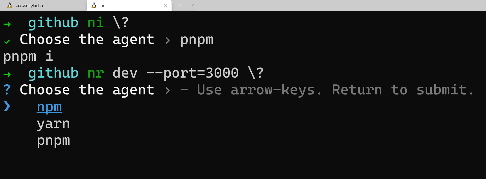
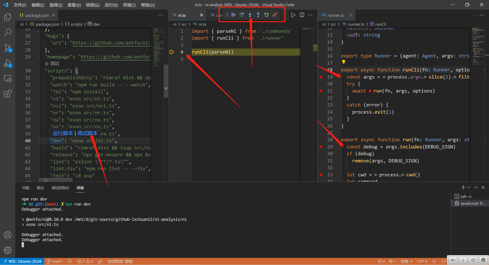
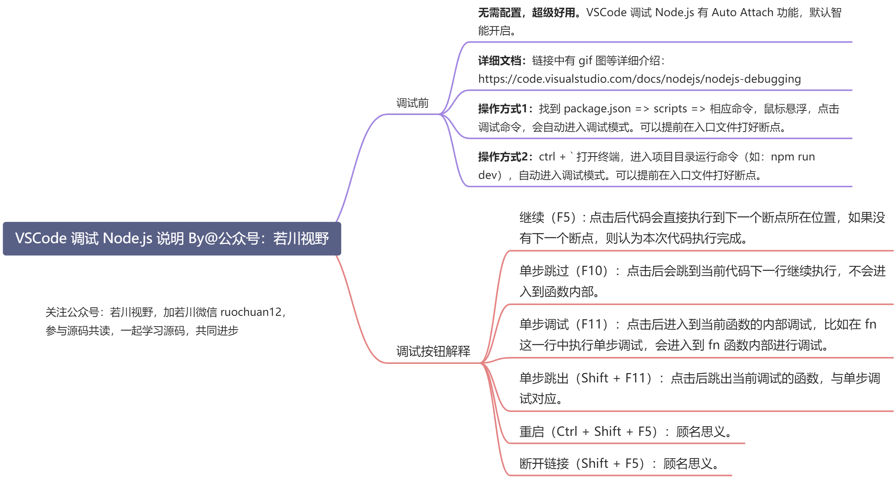

# 尤雨溪推荐神器 ni ，能替代 npm/yarn/pnpm ？简单好用！源码揭秘！

## 1. 前言

>大家好，我是[若川](https://lxchuan12.gitee.io)。欢迎关注我的[公众号若川视野](https://lxchuan12.gitee.io)，最近组织了[**源码共读活动**](https://www.yuque.com/ruochuan12)，感兴趣的可以加我微信 [ruochuan12](https://juejin.cn/pin/7005372623400435725) 参与，已进行两个多月，大家一起交流学习，共同进步，很多人都表示收获颇丰。

想学源码，极力推荐之前我写的[《学习源码整体架构系列》](https://juejin.cn/column/6960551178908205093) 包含`jQuery`、`underscore`、`lodash`、`vuex`、`sentry`、`axios`、`redux`、`koa`、`vue-devtools`、`vuex4`、`koa-compose`、`vue-next-release`、`vue-this`、`create-vue`、`玩具vite`等10余篇源码文章。

[本文仓库 ni-analysis，求个star^_^](https://github.com/lxchuan12/ni-analysis.git)

最近组织了[源码共读活动](https://www.yuque.com/ruochuan12)，大家一起学习源码。于是搜寻各种值得我们学习，且代码行数不多的源码。

之前写了 `Vue3` 相关的两篇文章。
- [初学者也能看懂的 Vue3 源码中那些实用的基础工具函数](https://juejin.cn/post/6994976281053888519)
- [Vue 3.2 发布了，那尤雨溪是怎么发布 Vue.js 的？](https://juejin.cn/post/6997943192851054606)

文章里都是写的使用 `yarn` 。参加源码共读的小伙伴按照我的文章，却拉取的最新仓库代码，发现 `yarn install` 安装不了依赖，向我反馈报错。于是我去 `github仓库` 一看，发现尤雨溪把 `Vue3仓库` 从 `yarn` 换成了 [`pnpm`](https://github.com/vuejs/vue-next/pull/4766/files)。[贡献文档](https://github.com/vuejs/vue-next/blob/master/.github/contributing.md#development-setup)中有一句话。

>We also recommend installing [ni](https://github.com/antfu/ni) to help switching between repos using different package managers. `ni` also provides the handy `nr` command which running npm scripts easier.

>我们还建议安装 [ni](https://github.com/antfu/ni) 以帮助使用不同的包管理器在 repos 之间切换。 `ni` 还提供了方便的 `nr` 命令，可以更轻松地运行 npm 脚本。

这个 `ni` 项目源码虽然是 `ts`，没用过 `ts` 小伙伴也是很好理解的，而且主文件其实不到 `100行`，非常适合我们学习。

阅读本文，你将学到：

```sh
1. 学会 ni 使用和理解其原理
2. 学会调试学习源码
3. 可以在日常工作中也使用 ni
4. 等等
```

## 2. 使用

看 [ni github文档](https://github.com/antfu/ni)。

>
>~~npm i in a yarn project, again? F**k!~~
>
>ni - use the right package manager

全局安装。

```bash
npm i -g @antfu/ni
```

如果全局安装遭遇冲突，我们可以加上 `--force` 参数强制安装。

**我看源码发现：以下命令，都可以在末尾追加`\?`，表示只打印，不是真正执行**。

举几个常用的例子。

所以全局安装后，可以尽情测试，比如 `ni \?`，`nr dev --port=3000 \?`，`nx jest \?`，因为打印，所以可以在各种目录下执行，有助于理解 `ni` 源码。



### 2.1 ni - install

```bash
ni

# npm install
# yarn install
# pnpm install
```

```bash
ni axios

# npm i axios
# yarn add axios
# pnpm i axios
```

### 2.2 nr - run

```bash
nr dev --port=3000

# npm run dev -- --port=3000
# yarn run dev --port=3000
# pnpm run dev -- --port=3000
```

```bash
nr
# 交互式选择命令去执行
# interactively select the script to run
# supports https://www.npmjs.com/package/npm-scripts-info convention
```

```bash
nr -

# 重新执行最后一次执行的命令
# rerun the last command
```

### 2.3 nx - execute

```bash
nx jest

# npx jest
# yarn dlx jest
# pnpm dlx jest
```

## 3. 原理

[github 仓库 ni#how](https://github.com/antfu/ni#how)

**ni** 假设您使用锁文件（并且您应该）

在它运行之前，它会检测你的 `yarn.lock` / `pnpm-lock.yaml` / `package-lock.json` 以了解当前的包管理器，并运行相应的命令。

**单从这句话中，我们可以得知这个工具必然要做三件事**：

```bash
1. 根据锁文件猜测用哪个包管理器 npm/yarn/pnpm 
2. 抹平不同的包管理器的命令差异
3. 最终运行相应的脚本
```

## 4. 阅读源码前的准备工作

### 4.1 克隆

```sh
# 推荐克隆我的仓库（我的保证对应文章版本）
git clone https://github.com/lxchuan12/ni-analysis.git
cd ni-analysis/ni
# npm i -g pnpm
# 安装依赖
pnpm i
# 当然也可以直接用 ni

# 或者克隆官方仓库
git clone https://github.com/vuejs/ni.git
cd ni
# npm i -g pnpm
# 安装依赖
pnpm i
# 当然也可以直接用 ni
```

众所周知，看一个开源项目，先从 package.json 文件开始看起。

### 4.2 package.json 文件

```js
{
    "name": "@antfu/ni",
    "version": "0.10.0",
    "description": "Use the right package manager",
    // 暴露了六个命令
    "bin": {
        "ni": "bin/ni.js",
        "nci": "bin/nci.js",
        "nr": "bin/nr.js",
        "nu": "bin/nu.js",
        "nx": "bin/nx.js",
        "nrm": "bin/nrm.js"
    },
    "scripts": {
        // 省略了其他的命令 用 esno 执行 ts 文件
        // 可以加上 ? 便于调试，也可以不加
        // 或者是终端 npm run dev \?
        "dev": "esno src/ni.ts ?"
    },
}
```

根据 `dev` 命令，我们找到主入口文件 `src/ni.ts`。

### 4.3 从源码主入口开始调试

```ts
// ni/src/ni.ts
import { parseNi } from './commands'
import { runCli } from './runner'

// 我们可以在这里断点
runCli(parseNi)
```

找到 `ni/package.json` 的 `scripts`，把鼠标移动到 `dev` 命令上，会出现`运行脚本`和`调试脚本`命令。如下图所示，选择调试脚本。





## 5. 主流程 runner - runCli 函数

这个函数就是对终端传入的命令行参数做一次解析。最终还是执行的 `run` 函数。

对于 `process` 不了解的读者，可以看[阮一峰老师写的 process 对象](http://javascript.ruanyifeng.com/nodejs/process.html)

```ts
// ni/src/runner.ts
export async function runCli(fn: Runner, options: DetectOptions = {}) {
  // process.argv：返回一个数组，成员是当前进程的所有命令行参数。
  // 其中 process.argv 的第一和第二个元素是Node可执行文件和被执行JavaScript文件的完全限定的文件系统路径，无论你是否这样输入他们。
  const args = process.argv.slice(2).filter(Boolean)
  try {
    await run(fn, args, options)
  }
  catch (error) {
    // process.exit方法用来退出当前进程。它可以接受一个数值参数，如果参数大于0，表示执行失败；如果等于0表示执行成功。
    process.exit(1)
  }
}
```

我们接着来看，`run` 函数。

## 6. 主流程 runner - run 主函数

**这个函数主要做了三件事**：

```bash
1. 根据锁文件猜测用哪个包管理器 npm/yarn/pnpm - detect 函数
2. 抹平不同的包管理器的命令差异 - parseNi 函数
3. 最终运行相应的脚本 - execa 工具
```

```ts
// ni/src/runner.ts
// 源码有删减
import execa from 'execa'
const DEBUG_SIGN = '?'
export async function run(fn: Runner, args: string[], options: DetectOptions = {}) {
  // 命令参数包含 问号? 则是调试模式，不执行脚本
  const debug = args.includes(DEBUG_SIGN)
  if (debug)
    // 调试模式下，删除这个问号
    remove(args, DEBUG_SIGN)

  // cwd 方法返回进程的当前目录（绝对路径）
  let cwd = process.cwd()
  let command

  // 支持指定 文件目录
  // ni -C packages/foo vite
  // nr -C playground dev
  if (args[0] === '-C') {
    cwd = resolve(cwd, args[1])
    // 删掉这两个参数 -C packages/foo
    args.splice(0, 2)
  }

  // 如果是全局安装，那么实用全局的包管理器
  const isGlobal = args.includes('-g')
  if (isGlobal) {
    command = await fn(getGlobalAgent(), args)
  }
  else {
    let agent = await detect({ ...options, cwd }) || getDefaultAgent()
    // 猜测使用哪个包管理器，如果没有发现锁文件，会返回 null，则调用 getDefaultAgent 函数，默认返回是让用户选择 prompt
    if (agent === 'prompt') {
      agent = (await prompts({
        name: 'agent',
        type: 'select',
        message: 'Choose the agent',
        choices: agents.map(value => ({ title: value, value })),
      })).agent
      if (!agent)
        return
    }
    // 这里的 fn 是 传入解析代码的函数
    command = await fn(agent as Agent, args, {
      hasLock: Boolean(agent),
      cwd,
    })
  }

  // 如果没有命令，直接返回，上一个 runCli 函数报错，退出进程
  if (!command)
    return

  // 如果是调试模式，那么直接打印出命令。调试非常有用。
  if (debug) {
    // eslint-disable-next-line no-console
    console.log(command)
    return
  }

  // 最终用 execa 执行命令，比如 npm i
  // https://github.com/sindresorhus/execa
  // 介绍：Process execution for humans

  await execa.command(command, { stdio: 'inherit', encoding: 'utf-8', cwd })
}
```

我们学习完主流程，接着来看两个重要的函数：`detect` 函数、`parseNi` 函数。

根据入口我们可以知道。

```ts
runCli(parseNi)

run(fn)

这里 fn 则是 parseNi
```


### 6.1 根据锁文件猜测用哪个包管理器（npm/yarn/pnpm） - detect 函数

代码相对不多，我就全部放出来了。

```bash
主要就做了三件事情

1. 找到项目根路径下的锁文件。返回对应的包管理器 `npm/yarn/pnpm`。
2. 如果没找到，那就返回 `null`。
3. 如果找到了，但是用户电脑没有这个命令，则询问用户是否自动安装。
```

```js
// ni/src/agents.ts
export const LOCKS: Record<string, Agent> = {
  'pnpm-lock.yaml': 'pnpm',
  'yarn.lock': 'yarn',
  'package-lock.json': 'npm',
}
```

```ts
// ni/src/detect.ts
export async function detect({ autoInstall, cwd }: DetectOptions) {
  const result = await findUp(Object.keys(LOCKS), { cwd })
  const agent = (result ? LOCKS[path.basename(result)] : null)

  if (agent && !cmdExists(agent)) {
    if (!autoInstall) {
      console.warn(`Detected ${agent} but it doesn't seem to be installed.\n`)

      if (process.env.CI)
        process.exit(1)

      const link = terminalLink(agent, INSTALL_PAGE[agent])
      const { tryInstall } = await prompts({
        name: 'tryInstall',
        type: 'confirm',
        message: `Would you like to globally install ${link}?`,
      })
      if (!tryInstall)
        process.exit(1)
    }

    await execa.command(`npm i -g ${agent}`, { stdio: 'inherit', cwd })
  }

  return agent
}
```

接着我们来看 `parseNi` 函数。

### 6.2 抹平不同的包管理器的命令差异 - parseNi 函数

```ts
// ni/src/commands.ts
export const parseNi = <Runner>((agent, args, ctx) => {
  // ni -v 输出版本号
  if (args.length === 1 && args[0] === '-v') {
    // eslint-disable-next-line no-console
    console.log(`@antfu/ni v${version}`)
    process.exit(0)
  }

  if (args.length === 0)
    return getCommand(agent, 'install')
  // 省略一些代码
})
```

通过 `getCommand` 获取命令。

```ts
// ni/src/agents.ts
// 有删减
// 一份配置，写个这三种包管理器中的命令。

export const AGENTS = {
  npm: {
    'install': 'npm i'
  },
  yarn: {
    'install': 'yarn install'
  },
  pnpm: {
    'install': 'pnpm i'
  },
}
```

```ts
// ni/src/commands.ts
export function getCommand(
  agent: Agent,
  command: Command,
  args: string[] = [],
) {
  // 包管理器不在 AGENTS 中则报错
  // 比如 npm 不在
  if (!(agent in AGENTS))
    throw new Error(`Unsupported agent "${agent}"`)

  // 获取命令 安装则对应 npm install
  const c = AGENTS[agent][command]

  // 如果是函数，则执行函数。
  if (typeof c === 'function')
    return c(args)

  // 命令 没找到，则报错
  if (!c)
    throw new Error(`Command "${command}" is not support by agent "${agent}"`)
  // 最终拼接成命令字符串
  return c.replace('{0}', args.join(' ')).trim()
}
```


### 6.3 最终运行相应的脚本

得到相应的命令，比如是 `npm i`，最终用这个工具 [execa](https://github.com/sindresorhus/execa) 执行最终得到的相应的脚本。

```ts
await execa.command(command, { stdio: 'inherit', encoding: 'utf-8', cwd })
```

## 7. 总结

**我们看完源码，可以知道这个神器 `ni` 主要做了三件事**：

```bash
1. 根据锁文件猜测用哪个包管理器 npm/yarn/pnpm - detect 函数
2. 抹平不同的包管理器的命令差异 - parseNi 函数
3. 最终运行相应的脚本 - execa 工具
```

我们日常开发中，可能容易 `npm`、`yarn`、`pnpm` 混用。有了 `ni` 后，可以用于日常开发使用。`Vue` 核心成员 [Anthony Fu](https://antfu.me) 发现问题，最终开发了一个工具 [ni](https://github.com/antfu/ni) 解决问题。而这种发现问题、解决问题的能力正是我们前端开发工程师所需要的。

另外，我发现 `Vue` 生态很多基本都切换成了使用 [pnpm](https://pnpm.io)。

因为文章不宜过长，所以未全面展开讲述源码中所有细节。非常建议读者朋友按照文中方法使用`VSCode`调试 `ni` 源码。**学会调试源码后，源码并没有想象中的那么难**。

最后可以持续关注我@若川。欢迎加我微信 [ruochuan12](https://juejin.cn/pin/7005372623400435725) 交流，参与 [源码共读](https://www.yuque.com/ruochuan12) 活动，大家一起学习源码，共同进步。

