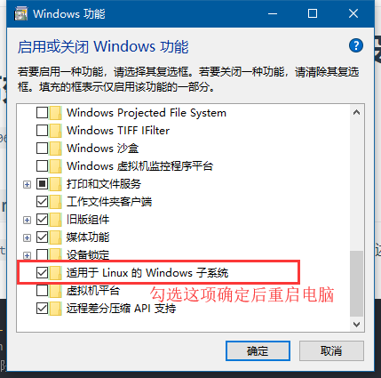
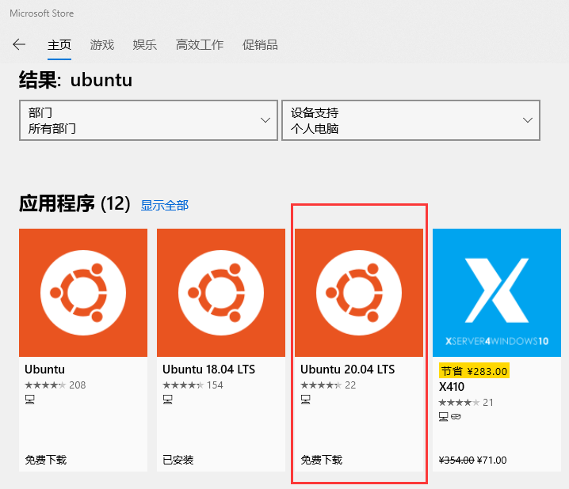
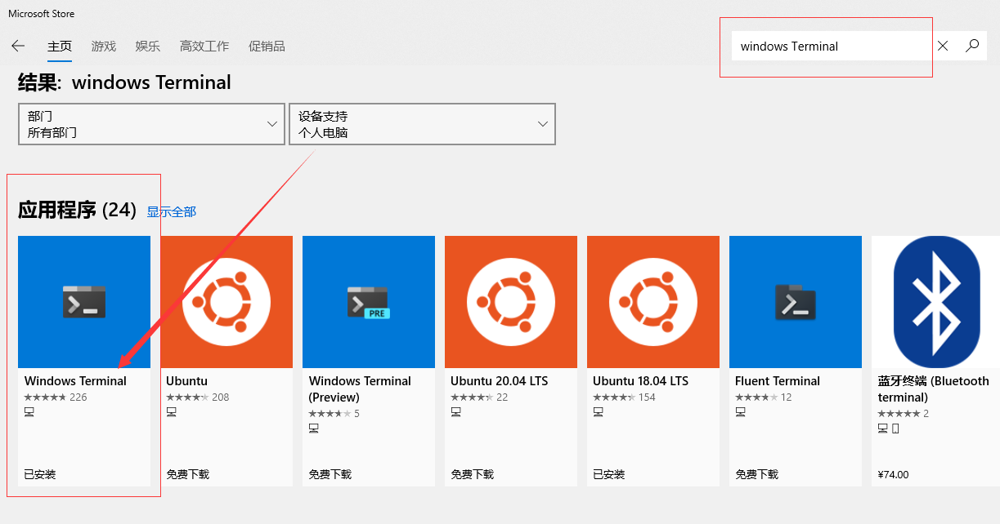
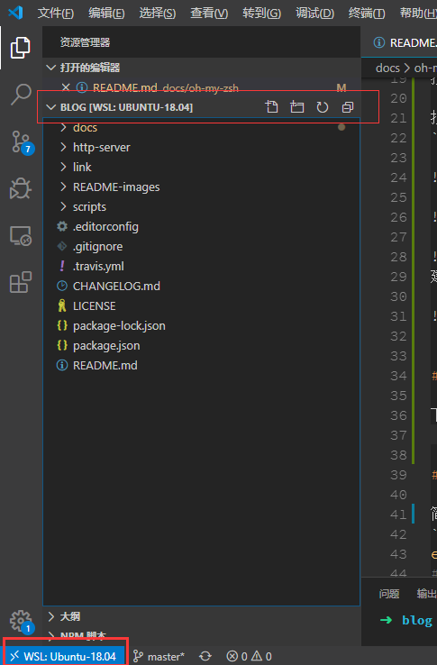

# 使用 ohmyzsh 打造 windows、ubuntu、mac 系统高效终端命令行工具

>原标题名：
>oh my zsh 和 windows git bash 设置别名提高效率

>`写于2018年06月03日`

>在我的微信交流群中听闻很多前端开发比较贫穷，没有买mac电脑（比如我），也没有用过`ohmyzsh`。于是就有了这篇写于2018年文章的改版。这篇文章没啥难度，很快就能看完，主要还是希望身为读者的你看完后可以安装开始使用高效终端工具。有了这么强大的终端工具后我发现`Windows`很好用呀，不需要买`mac`了。

主要就是：
- 利用`Windows`的`linux`子系统功能
- 安装`Ubuntu`系统，安装`ohmyzsh`和一些插件
- 安装`windows Terminal`工具
- 安装`vscode remote-wsl`插件
- 安装 tig 查看 git 记录

先看下效果。反正我是用了`ohmyzsh`后，离不开了。


## windows 安装 Ubuntu 子系统 安装 windows Terminal

搜索**启用或关闭 windows 功能**，勾选**适用于 `Linux` 的 `Windows` 子系统**，确定后重启电脑。

搜索 `Ubuntu` 和 `windows Terminal` 并安装（`windows Terminal` 可能要求win10系统比较高的版本，一般更新到最新版本即可）

`Ubuntu`安装好后会要求设置用户名和密码。





建议安装最新版 `Ubuntu 20.04`



`win10`安装了`ubuntu`子系统和`oh my zsh`后，则可以通过`/mnt/f/`访问`win10`下的`f`盘，或者其他盘。
也就有上面的`pwd`效果图。
## 安装 vscode remote-wsl 插件

下载安装[`vscode`](https://code.visualstudio.com/)，并且安装`remote-wsl`插件。



## 安装 `oh my zsh`

简述下`oh my zsh`[oh my zsh官网](http://ohmyz.sh/)的安装方法。
[github ohmyzsh](https://github.com/ohmyzsh/ohmyzsh)

安装`oh my zsh`部分适用于`Ubuntu`和`mac`系统。
```bash
echo $SHELL
# /bin/bash 默认是bash
# 查看下有哪些shells
cat /etc/shells
# 安装 zsh
sudo apt-get install zsh -y
# 查看zsh版本
zsh --version
# 5.1.1
# 安装后zsh 后cat /etc/shells 才有/bin/zsh /usr/bin/zsh

# 切换成zsh
chsh -s $(which zsh)
# 或者这条命令
# chsh -s /usr/bin/zsh
```

```bash
# 三种安装方案可供选择：
# Via curl
$ sh -c "$(curl -fsSL https://raw.github.com/ohmyzsh/ohmyzsh/master/tools/install.sh)"

# Via Wget
$ sh -c "$(wget https://raw.github.com/ohmyzsh/ohmyzsh/master/tools/install.sh -O -)"

# 如果上面两种情况还安装不了，可以使用如下方式。

# via git clone
git clone https://github.com/ohmyzsh/ohmyzsh.git ~/.oh-my-zsh
cp ~/.oh-my-zsh/templates/zshrc.zsh-template ~/.zshrc
chsh -s $(which zsh)
# 打开新的终端会应用新的zshrc配置
```
如果以上三种方式还装不了，可以来找我(若川 微信`ruochuan12`)。也可以查看[oh my zsh文档](https://github.com/ohmyzsh/ohmyzsh)

安装成功后，配置信息会在`~/.zshrc`。可以通过`code ~/.zshrc`(如果没安装vscode，可以用`vim ~/.zshrc`)打开编辑`zsh`配置信息，可以看到默认配置了`git` 插件[Plugin:git](https://github.com/ohmyzsh/ohmyzsh/tree/master/plugins/git/)。
也就是说，可以更加简便的使用`git` 相关的一些别名。
```bash
# 比如
`git status`时，只需要输入`gst`。
`git pull` 时，只需要输入`gl`。
`git push` 时，只需要输入`gp`等等。
```
是因为配置里有这些简写，[oh my zsh plugin git.plugin.zsh](https://github.com/ohmyzsh/ohmyzsh/blob/master/plugins/git/git.plugin.zsh)。
安装成功后，同时会创建`~/.oh-my-zsh`的文件夹，其实就是`.oh-my-zsh` 的 `git` 仓库`master`分支。
可以发现文件夹中有一个`plugins`文件夹，内置了很多插件。可以自定义主题`theme`，具体可以看[example.zsh-theme](https://github.com/robbyrussell/oh-my-zsh/blob/master/themes/example.zsh-theme)。
`custom`自定义相关。
插件相关会安装在这里，[更多可以查看example.plugin.zsh](https://github.com/ohmyzsh/ohmyzsh/blob/master/custom/plugins/example/example.plugin.zsh)

我暂时安装了这几个插件。
```bash
plugins=(
  # 内置插件，启用即可
  git
  cp
  mv
  # 按两下esc键，用sudo权限
  sudo
  # 记录历史输入的zsh命令，自动提示，快速使用
  zsh-autosuggestions
  # zsh 命令高亮
  zsh-syntax-highlighting
)
```
顺带讲下后面两个插件的安装方法
安装 `zsh-autosuggestions`
```bash
git clone git://github.com/zsh-users/zsh-autosuggestions $ZSH_CUSTOM/plugins/zsh-autosuggestions
```
安装`zsh-syntax-highlighting`
```bash
git clone https://github.com/zsh-users/zsh-syntax-highlighting.git $ZSH_CUSTOM/plugins/zsh-syntax-highlighting
```
`$ZSH_CUSTOM` 其实是个变量，代表这个路径`~/.oh-my-zsh/custom`，
也就是安装到了这个目录下。还有很多高效插件，等您发掘~[oh my zsh官网](http://ohmyz.sh/)
不过插件安装多了，感觉会有些卡顿~
```bash
# 每次修改了这个`.zshrc`配置文件，需要重载一下，才能生效。
source .zshrc
# 也可以封装成一个简写命令 alias
alias rl='source ~/.zshrc'
```
也可以在这个配置文件中配置更多`alias`。
`oh my zsh`命令工具确实好用，但还没买`mac`，又不想用`ubuntu`的童鞋怎么办呢~
`win10` 支持安装`ubuntu`等子系统，就可以安装`oh my zsh`, 学习`linux`了。
## `windows 10` 安装 `Ubuntu` 子系统，安装`oh my zsh`

之前偶然发现自己电脑`windows 10` 有类似`linux` 功能（虽然这功能之前就有印象，但没去研究）。

竟然也可以安装`oh my zsh`[官网](http://ohmyz.sh/)。想学习 `linux` 又不想安装 `linux` 系统，这时候可以用`win10`自带的`Ubuntu`。
发现这篇写的比较详细，笔者就不再赘述了。
笔者安装`ubuntu 18.04`子系统后，文件目录在这个路径下。`
```
C:\Users\lxchuan12\AppData\Local\Packages\CanonicalGroupLimited.Ubuntu18.04onWindows_79rhkp1fndgsc\LocalState\rootfs
```
[Win10 环境下安装配置 zsh](https://blog.csdn.net/sko121/article/details/78091083)


`win10`安装了`ubuntu`子系统和`oh my zsh`后，则可以通过`/mnt/f/`访问`win10`下的`f`盘，或者其他盘。
```bash
# 比如跳转到工作目录
alias dgg='cd /mnt/f/git-source/github'
# vscode 打开要编辑的文件或文件夹
code sticky-notes
```
也就是相当于`win10`下解锁了`oh my zsh`。
那不是`win10`，也想通过设置别名来提高效率，是不是就没有办法了呢，可以使用`git bash`设置`alias`，安装`git`，自带`git bash`。

## `windows` `git bash` 设置别名提高效率

`windows` 桌面或任意资源管理器位置，右击，选择`Git Bash Here`，即打开了`git bash`命令行。
先设置下主题，右击选择`options`, `Looks > theme > dracula`
我选择的是`dracula`主题，看起来比较舒适。还可以设置字体等。
```bash
# 跳转到根路径
cd ~
# 查看下是否有.bash_profile文件
la
# 如果没有.bash_profile文件，需要创建
touch .bash_profile
# 打开编辑 （笔者这里安装了vscode，所以直接用其打开文件）
code .bash_profile
```
可以根据修改设置一些别名。
比如我们常用的`git status`命令，可以封装成`gst`。清屏`clear`命令封装成`cls`。
```bash
alias gst='git status'
alias cls='clear'
```
每次修改这个文件需要输入`source ~/.bash_profile`重载这个文件，才会生效。
`code ~/.bash_profile`，用`vscode`编辑这个配置文件，封装成一个命令。
比如：
```bash
alias rl='source ~/.bash_profile'
alias bashconfig='code ~/.bash_profile'
```
这样每次修改保存后就只需要输入`rl`，即可重载生效了。
还可以把一些工作目录封装，笔者的一些项目是放在`/f/git-source/github`文件下。
```bash
# github上的项目
alias dgg='cd F:/git-source/github'
# 周报相关
alias dcwk='cd F:/git-source/coding/weekly'
```
每次进入项目，就直接`dgg`，即可跳转到这个目录，然后选择相应的目录即可。
比如`dgg`进入工作目录，`cd analyse-vue-cli`进入项目目录,（输入`anal`按`tab`键智能提示）
```bash
#  /f/git-source/github/analyse-vue-cli (dev)
# 查看状态 git status
gst
# 用vscode 打开这个文件夹，开始编辑~
code ./
```
git 相关的，
例举一些平时用的比较多的。
```bash
alias g='git'
alias ga='git add'
alias gaa='git add -all'
alias gp='git push'
alias gl='git pull'
alias gcmsg='git commit -m'
# 分支相关
alias gb='git branch'
alias gbr='git branch -r'
alias gba='git branch -a'
# checkout
alias gco='git checkout'
alias gcb='git checkout -b'
# merge
alias gm='git merge'
# diff
alias gd='git diff'
alias gdw='git diff --word-diff'
```
更多可以把`oh my zsh`的插件一些命令拷贝过来，留`alias`相关的即可，[oh my zsh plugin git.plugin.zsh](https://github.com/ohmyzsh/ohmyzsh/blob/master/plugins/git/git.plugin.zsh)
[Plugin:git wiki](https://github.com/ohmyzsh/ohmyzsh/tree/master/plugins/git/)
相当于解锁了`oh my zsh` 的`git`插件。还有很多插件，比如`npm`[点击查看](https://github.com/ohmyzsh/ohmyzsh/blob/master/plugins/npm/npm.plugin.zsh), `node 等`，都可以研究下。

`git bash`，有没有类似`oh my zsh`的插件呢，笔者暂时没发现，如果您知道，欢迎告诉笔者。
目录相关的操作，也可以设置一些别名。比如：
```bash
# 回退到上一级
alias ..='cd ..'
alias ...='cd ../..'
alias ....='cd ../../..'
alias .....='cd ../../../..'
alias ......='cd ../../../../..'
```
更多别名可以自定义～
`windows`上命令行工具还可以使用`cmder`[点击查看cmder官网](http://cmder.net/)命令行工具。虽然笔者几年前就安装了，但发现还是`git bash`用的顺畅些，可能是我还不太习惯`cmder`。
关于`cmder`配置相关，这里推荐晚晴幽草轩轩主的一篇文章：
[《Win下必备神器之Cmder》](https://jeffjade.com/2016/01/13/2016-01-13-windows-software-cmder/)

也有[cygwin](http://www.cygwin.com/)，也是`windows`命令行工具，也可以安装`on my zsh`。

当然，`git`也是可以设置别名的。

## `git`设置别名，使用`tig`神器

```bash
# git status => git st
git config --global alias.st status
```

更多可以查看廖雪峰老师的这篇文章[git 配置别名](https://www.liaoxuefeng.com/wiki/0013739516305929606dd18361248578c67b8067c8c017b000/001375234012342f90be1fc4d81446c967bbdc19e7c03d3000)。不过可能大多数人不知道，他们可能用着可视化工具。笔者觉得可视化工具也是对`git`的一些封装，具体背后是什么命令，我们还是需要去了解熟悉的。命令行使用`git`，笔者推荐使用`tig`。`git log`增强版，性能很好。`Ubuntu`、`linux`、`mac`可以直接安装，`windows`稍微麻烦些。具体安装方法查看[tig github仓库中的官方安装文档](https://github.com/jonas/tig/blob/master/INSTALL.adoc)，或者查看这篇文章：[颠覆 Git 命令使用体验的神器 -- tig](https://www.jianshu.com/p/e4ca3030a9d5)

## 小结
磨刀不误砍柴工，花时间折腾研究工具，有利于提高开发效率。

最新更新于 `2020-06-21 23:32:08`

文章首发于`segmentfault` [win10 安装 oh my zsh 和 windows git bash 设置别名提高效率](https://segmentfault.com/a/1190000015155864)

## 关于

作者：常以**若川**为名混迹于江湖。前端路上 | PPT爱好者 | 所知甚少，唯善学。<br>
[个人博客](https://lxchuan12.github.io/)<br>
[掘金专栏](https://juejin.im/user/57974dc55bbb500063f522fd/posts)，欢迎关注~<br>
[`segmentfault`前端视野专栏](https://segmentfault.com/blog/lxchuan12)，开通了**前端视野**专栏，欢迎关注~<br>
[知乎前端视野专栏](https://zhuanlan.zhihu.com/lxchuan12)，开通了**前端视野**专栏，欢迎关注~<br>
[github blog](https://github.com/lxchuan12/blog)，相关源码和资源都放在这里，求个`star`^_^~

## 微信公众号  若川视野

可能比较有趣的微信公众号，长按扫码关注。也可以加微信 `ruochuan12`，注明来源，拉您进【前端视野交流群】。


