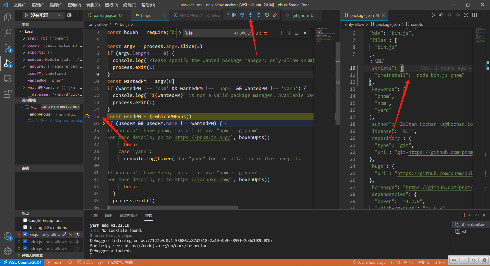

# 从 vue3 和 vite 源码中，我学到了一行代码统一规范团队包管理器的神器
## 1. 前言

>大家好，我是[若川](https://lxchuan12.gitee.io)。最近组织了[源码共读活动](https://juejin.cn/pin/7005372623400435725)，感兴趣的可以加我微信 [ruochuan12](https://juejin.cn/pin/7005372623400435725) 参与，或者关注我的[公众号若川视野](https://lxchuan12.gitee.io)，回复“源码”参与。已进行三个月，大家一起交流学习，共同进步，很多人都表示收获颇丰。

想学源码，极力推荐之前我写的[《学习源码整体架构系列》](https://juejin.cn/column/6960551178908205093) 包含`jQuery`、`underscore`、`lodash`、`vuex`、`sentry`、`axios`、`redux`、`koa`、`vue-devtools`、`vuex4`、`koa-compose`、`vue 3.2 发布`、`vue-this`、`create-vue`、`玩具vite`等10余篇源码文章。

[本文仓库 only-allow-analysis，求个star^_^](https://github.com/lxchuan12/only-allow-analysis.git)

最近组织了[源码共读活动](https://juejin.cn/pin/7005372623400435725)，每周大家一起学习200行左右的源码。每周一期，已进行到14期。于是搜寻各种值得我们学习，且代码行数不多的源码。

阅读本文，你将学到：
```bash
1. 如何学习调试源码
2. 学会 npm 钩子
3. 学会 "preinstall": "npx only-allow pnpm" 一行代码统一规范包管理器
4. 学到 only-allow 原理
5. 等等
```
## 2. 场景

我们项目开发时，常需要安装依赖，虽说一般用文档可以说明。但不是比较强制的约束。是人就容易犯错或者疏忽，假如规定是用的`npm`，而团队里有人某一天不小心使用了其他包管理器安装了的其他依赖，上传了代码，严重时可能导致线上问题。所以我们需要借助工具（代码）来强制约束。

在[源码共读第12期](https://www.yuque.com/ruochuan12/notice/p12)中，我们学习了[尤雨溪推荐神器 ni ，能替代 npm/yarn/pnpm ？简单好用！源码揭秘！](https://juejin.cn/post/7023910122770399269)
根据锁文件自动匹配相应的包管理器，运行相应的命令。

在[源码共读第3期](https://www.yuque.com/ruochuan12/notice/p3)中，我们学习了[Vue 3.2 发布了，那尤雨溪是怎么发布 Vue.js 的？](https://juejin.cn/post/6997943192851054606)

其中 Vue3 源码用了 npm 的 `preinstall` [钩子](https://docs.npmjs.com/cli/v6/using-npm/scripts#pre--post-scripts) 约束，只能使用 `pnpm` 安装依赖。我们接着来看其实现。
## 3. Vue3 源码 && npm 命令钩子

```js
// vue-next/package.json
{
  "private": true,
  "version": "3.2.22",
  "scripts": {
    "preinstall": "node ./scripts/preinstall.js",
  }
}
```

```bash
依次执行
# install 之前执行这个脚本
preinstall
# 执行 install 脚本
install
# install 之后执行这个脚本
postinstall
```

当然也支持自定义的命令。

更多可以查看官方文档[钩子](https://docs.npmjs.com/cli/v6/using-npm/scripts#pre--post-scripts)。

接着我们来看 [preinstall](https://github1s.com/vuejs/vue-next/blob/HEAD/scripts/preinstall.js#L1-L8) 源码。

```js
// vue-next/scripts/preinstall.js

if (!/pnpm/.test(process.env.npm_execpath || '')) {
  console.warn(
    `\u001b[33mThis repository requires using pnpm as the package manager ` +
      ` for scripts to work properly.\u001b[39m\n`
  )
  process.exit(1)
}
```

这段代码也相对简单，校验如果不是 `pnpm` 执行脚本则报错，退出进程。

关于 `process` 对象可以查看 [阮一峰老师 process 对象](http://javascript.ruanyifeng.com/nodejs/process.html)

>`process.argv` 属性返回一个数组，由命令行执行脚本时的各个参数组成。它的第一个成员总是 `node`，第二个成员是脚本文件名，其余成员是脚本文件的参数。

这段代码能文章开头场景提出的问题，但是总不能每个项目都复制粘贴这段代码吧。我们是不是可以封装成 npm 包使用。
当时我也没想太多，也没有封装 npm 包。直到我翻看 [vite](https://github.com/vitejs/vite/blob/main/package.json#L12) 源码发现了 [only-allow](https://github.com/pnpm/only-allow) 这个包。**一行代码统一规范包管理器**。

```js
{
  "scripts": {
    "preinstall": "npx only-allow pnpm -y"
  }
}
```

当时看到这段代码时，我就在想：他们咋知道这个的。
当时依旧也没想太多。**直到有一天，发现 pnpm 文档 [Only allow pnpm 文档](https://pnpm.io/only-allow-pnpm) 上就有这个。好吧，吃了没看文档的亏**。那时我打算分析下这个[only-allow 包的源码](https://github1s.com/pnpm/only-allow/blob/master/bin.js)，打开一看惊喜万分，才 36 行，写它，于是写了这篇文章。

按照惯例，看源码前先准备环境。
## 4. 环境准备

先克隆代码。
### 4.1 克隆代码

```bash
# 推荐克隆我的源码库
git clone https://github.com/lxchuan12/only-allow-analysis.git
cd only-allow-analysis/only-allow
# npm i -g pnpm
pnpm i

# 或者克隆官方仓库
git clone https://github.com/pnpm/only-allow.git
cd only-allow
# npm i -g pnpm
pnpm i
```

开源项目一般先看[README.md](https://github.com/pnpm/only-allow)。

>Force a specific package manager to be used on a project

强制在项目上使用特定的包管理器

**Usage**

>Add a preinstall script to your project's package.json.

If you want to force [yarn](https://yarnpkg.com/), add:

```js
{
  "scripts": {
    "preinstall": "npx only-allow yarn"
  }
}
```

同理可得：强制使用 `npm`、`pnpm`也是类似设置。
### 4.2 调试源码

我们通过查看 `package.json` 文件。

```js
// only-allow/package.json
{
  "bin": "bin.js",
}
```

确定主入口文件为 `only-allow/bin.js`。

在最新版的 `VSCode` 中，`auto attach` 功能，默认支持智能调试，如果发现不支持，可以通过快捷键 `ctrl + shift + p` 查看是否启用。

于是我们在 `only-allow/package.json` 文件中，添加如下命令。

```js
// only-allow/package.json
{
  "scripts": {
    "preinstall": "node bin.js pnpm"
  },
}
```

可以提前在 `only-allow/bin.js` 文件打上断点 `const usedPM = whichPMRuns()`

按快捷键 ctrl + ` 快捷键打开终端。输入如下 `yarn add release-it -D` 命令，即可调试 `only-allow/bin.js`。



最终调试完会在终端报错提示使用 `pnpm install`。

如下图所示：

[终端报错截图](./images/error.png)

更多调试细节可以看我的这篇文章：[新手向：前端程序员必学基本技能——调试JS代码](https://juejin.cn/post/7030584939020042254)

接着我们按调试来看源码主流程。

## 5. only-allow 源码

```js
// only-allow/bin.js
#!/usr/bin/env node
const whichPMRuns = require('which-pm-runs')
const boxen = require('boxen')

const argv = process.argv.slice(2)
if (argv.length === 0) {
  console.log('Please specify the wanted package manager: only-allow <npm|pnpm|yarn>')
  process.exit(1)
}
// 第一个参数则是 用户传入的希望使用的包管理器
// 比如 npx only-allow pnpm 
// 这里调试是 node bin.js pnpm
const wantedPM = argv[0]
// npm pnpm yarn 都不是，则报错
if (wantedPM !== 'npm' && wantedPM !== 'pnpm' && wantedPM !== 'yarn') {
  console.log(`"${wantedPM}" is not a valid package manager. Available package managers are: npm, pnpm, or yarn.`)
  process.exit(1)
}
// 使用的包管理器
const usedPM = whichPMRuns()
// 希望使用的包管理器 不相等，则报错。
// - npm  提示使用 npm install
// - pnpm 提示使用 pnpm install
// - yarn 提示使用 yarn install
// 最后退出进程
if (usedPM && usedPM.name !== wantedPM) {
  const boxenOpts = { borderColor: 'red', borderStyle: 'double', padding: 1 }
  switch (wantedPM) {
    case 'npm':
      console.log(boxen('Use "npm install" for installation in this project', boxenOpts))
      break
    case 'pnpm':
      console.log(boxen(`Use "pnpm install" for installation in this project.

If you don't have pnpm, install it via "npm i -g pnpm".
For more details, go to https://pnpm.js.org/`, boxenOpts))
      break
    case 'yarn':
      console.log(boxen(`Use "yarn" for installation in this project.

If you don't have Yarn, install it via "npm i -g yarn".
For more details, go to https://yarnpkg.com/`, boxenOpts))
      break
  }
  process.exit(1)
}
```

跟着断点，我们可以查看到 [which-pm-runs](https://github1s.com/zkochan/packages/blob/master/which-pm-runs/index.js)。
## 6. which-pm-runs 当前运行的是哪一个包管理器

最终返回包管理器和版本号。

根据调试可知，`process.env.npm_config_user_agent` 是类似这样的字符串。

`"yarn/1.22.10 npm/? node/v14.16.0 linux x64"`

```js
'use strict'

module.exports = function () {
  if (!process.env.npm_config_user_agent) {
    return undefined
  }
  return pmFromUserAgent(process.env.npm_config_user_agent)
}

function pmFromUserAgent (userAgent) {
  const pmSpec = userAgent.split(' ')[0]
  const separatorPos = pmSpec.lastIndexOf('/')
  return {
    name: pmSpec.substr(0, separatorPos),
    version: pmSpec.substr(separatorPos + 1)
  }
}
```

### 6.1 String.prototype.substr 截取字符串

顺带提下。我之前在 vue-next 源码看到的 [pull request => chore: remove deprecated String.prototype.substr](https://github.com/vuejs/vue-next/pull/4699)

>String.prototype.substr is deprecated.

也就是说不推荐使用 `substr`。推荐使用 `slice`。

[ecma 规范](https://262.ecma-international.org/9.0/#sec-additional-ecmascript-features-for-web-browsers)

## 7. 总结

我们通过从团队需要规范统一包管理器的实际场景出发，讲了 vue3 源码中 preinstall 钩子 约束只能使用 pnpm 。同时通过查看 [vite](https://github.com/vitejs/vite/blob/main/package.json#L12) 源码和 [pnpm](https://pnpm.io/only-allow-pnpm) 文档，了解到 [only-allow](https://github.com/pnpm/only-allow.git) 这个包。可以做到一行代码统一规范包管理器`"preinstall": "npx only-allow pnpm"`。

也学习了其原理。only-allow 期待的包管理器和运行的包管理器对比。匹配失败，则报错。而which-pm-runs 通过获取 `process.env.npm_config_user_agent` 变量获取到当前运行脚本的包管理器和版本号。

我们通过文档和沟通约束，不如用工具（代码）约束。

文章写到这里，让我想起我2018年写的文章[参加有赞前端技术开放日所感所想](https://lxchuan12.gitee.io/20180421-youzan-front-end-tech-open-day/)

当时演讲的大佬说过一句话。无比赞同。

>技术（开源）项目本质上是：理念、套路、规范的工具化。

同时给我们的启发也是要多看官方文档和规范。

建议读者克隆[我的仓库](https://github.com/lxchuan12/only-allow-analysis.git)动手实践调试源码学习。

最后可以持续关注我@若川。欢迎加我微信 [ruochuan12](https://juejin.cn/pin/7005372623400435725) 交流，参与 [源码共读](https://juejin.cn/pin/7005372623400435725) 活动，每周大家一起学习200行左右的源码，共同进步。
