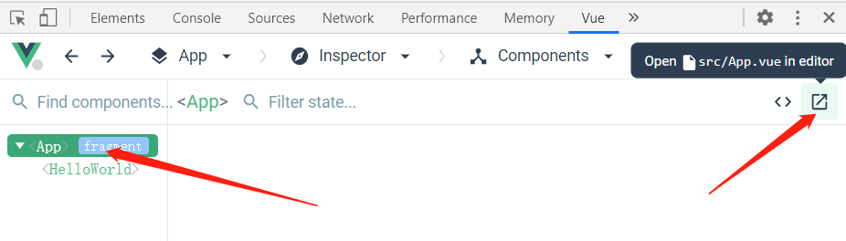
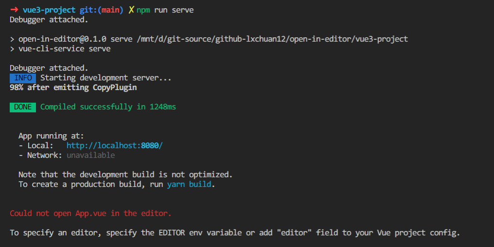
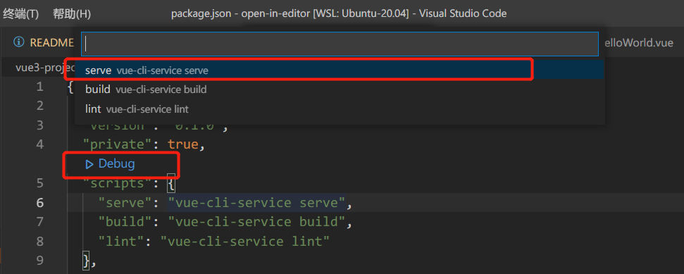
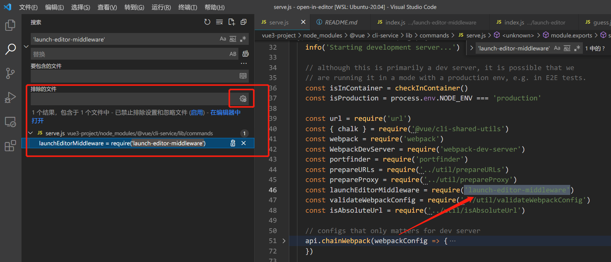
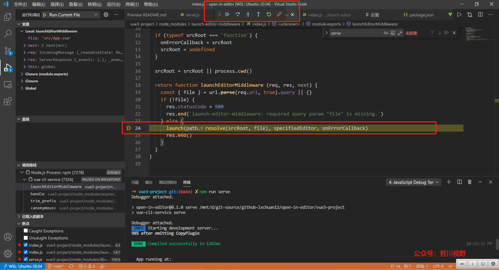

# 据说 99% 的人不知道 vue-devtools 还能直接打开对应组件文件？本文原理揭秘

## 1. 前言
>你好，我是[若川](https://lxchuan12.gitee.io)，微信搜索[「若川视野」](https://mp.weixin.qq.com/s/c3hFML3XN9KCUetDOZd-DQ)关注我，专注前端技术分享，一个愿景是帮助5年内前端开阔视野走向前列的公众号。欢迎加我微信`ruochuan12`，长期交流学习。

>这是`学习源码整体架构系列` 之 launch-editor 源码（第九篇）。学习源码整体架构系列文章([有哪些必看的JS库](https://mp.weixin.qq.com/s?__biz=MzA5MjQwMzQyNw==&mid=2650746362&idx=1&sn=afe3a26cdbde1d423aae4fa99355f369&chksm=88662e76bf11a760a7f0a8565b9e8d52f5e4f056dc2682f213eec6475127d71f6f1d203d6c3a&scene=21#wechat_redirect))：[jQuery](http://mp.weixin.qq.com/s?__biz=MzA5MjQwMzQyNw==&mid=2650744496&idx=1&sn=0f149e9436cb77bf9fc1bfb47aedd334&chksm=8866253cbf11ac2a53b385153cd8e9a0c4018b6b566750cf0b5d61d17afa2e90b52d36db8054&scene=21#wechat_redirect)、[underscore](http://mp.weixin.qq.com/s?__biz=MzA5MjQwMzQyNw==&mid=2650744505&idx=1&sn=26801ad6c2a5eb9cf64e7556b6478d39&chksm=88662535bf11ac23eea3f76335f6777e2acbf4ee660b5616148e14ffbefc0e8520806db21056&scene=21#wechat_redirect)、[lodash](http://mp.weixin.qq.com/s?__biz=MzA5MjQwMzQyNw==&mid=2650744514&idx=1&sn=776336d888d06bfe72cb4d5b07a4b90c&chksm=8866254ebf11ac5822fc078082603f77a4b4d9b487c9f4d7069acb12c727c46c75946fa9b0cd&scene=21#wechat_redirect)、[sentry](http://mp.weixin.qq.com/s?__biz=MzA5MjQwMzQyNw==&mid=2650744551&idx=1&sn=4d79c2fa97d7c737aab70055c7ec7fa3&chksm=8866256bbf11ac7d9e2269f3638a705d5e5f45056d53ad2faf17b814e4c46ec6b0ba52571bde&scene=21#wechat_redirect)、[vuex](http://mp.weixin.qq.com/s?__biz=MzA5MjQwMzQyNw==&mid=2650744584&idx=1&sn=b14f8a762f132adcf0f7e3e075ee2ded&chksm=88662484bf11ad922ed27d45873af838298949eea381545e82a511cabf0c6fc6876a8370c6fb&scene=21#wechat_redirect)、[axios](http://mp.weixin.qq.com/s?__biz=MzA5MjQwMzQyNw==&mid=2650744604&idx=1&sn=51d8d865c9848fd59f7763f5fb9ce789&chksm=88662490bf11ad86061ae76ff71a1177eeddab02c38d046eecd0e1ad25dc16f7591f91e9e3b2&scene=21#wechat_redirect)、[koa](https://mp.weixin.qq.com/s?__biz=MzA5MjQwMzQyNw==&mid=2650744703&idx=1&sn=cfb9580241228993e4d376017234ff79&chksm=886624f3bf11ade5f5e37520f6b1291417bcea95f222906548b863f4b61d20e7508eb419eb85&token=192125900&lang=zh_CN&scene=21#wechat_redirect)、[redux](http://mp.weixin.qq.com/s?__biz=MzA5MjQwMzQyNw==&mid=2650745007&idx=1&sn=1fd6f3caeff6ab61b8d5f644a1dbb7df&chksm=88662b23bf11a23573509a01f941d463b0c61e890b2069427c78c26296197077da359c522fe8&scene=21#wechat_redirect)。整体架构这词语好像有点大，姑且就算是源码整体结构吧，主要就是学习是代码整体结构，不深究其他不是主线的具体函数的实现。本篇文章学习的是实际仓库的代码。下一篇应该是《**学习 Vuex 4 源码整体架构，深入理解其原理及provide/inject原理**》。

>[本文仓库地址](https://github.com/lxchuan12/open-in-editor.git)：`git clone https://github.com/lxchuan12/open-in-editor.git`，本文最佳阅读方式，克隆仓库自己动手调试，容易吸收消化。

>**要是有人说到怎么读源码，正在读文章的你能推荐我的源码系列文章，那真是无以为报啊**。

我的文章尽量写得让想看源码又不知道怎么看的读者能看懂。我都是推荐使用**搭建环境断点调试源码学习**，**哪里不会点哪里**，**边调试边看，而不是硬看**。正所谓：**授人与鱼不如授人予渔**。

阅读本文后你将学到：
1. 如何解决该功能报错问题<br>
2. 如何调试学习源码<br>
3. `launch-editor-middleware、launch-editor` 等实现原理<br>

### 1.1 短时间找不到页面对应源文件的场景

不知道你们有没有碰到这样的场景，打开你自己（或者你同事）开发的页面，却短时间难以找到对应的源文件。

这时你可能会想要是能有**点击页面按钮自动用编辑器打开对应文件**的功能，那该多好啊。

而`vue-devtools`提供了这样的功能，也许你不知道。我觉得很大一部分人都不知道，因为感觉很多人都不常用`vue-devtools`。



你也许会问，我不用`vue`，我用`react`有没有类似功能啊，有啊，请看[react-dev-inspector](https://github.com/zthxxx/react-dev-inspector)。你可能还会问，支持哪些编辑器呀，主流的 `vscode、webstorm、atom、sublime` 等都支持，更多可以看[这个列表 Supported editors](https://github.com/yyx990803/launch-editor#supported-editors)。

本文就是根据学习尤大写的 [launch-editor](https://github.com/yyx990803/launch-editor) 源码，本着**知其然，知其所以然**的宗旨，探究 `vue-devtools`「在编辑器中打开组件」功能实现原理。

### 1.2 一句话简述其原理

```sh
code path/to/file
```

一句话简述原理：利用`nodejs`中的`child_process`，执行了类似`code path/to/file`命令，于是对应编辑器就打开了相应的文件，而对应的编辑器则是通过在进程中执行`ps x`（`Window`则用`Get-Process`）命令来查找的，当然也可以自己指定编辑器。

### 1.3 打开编辑器无法打开组件的报错解决方法

而你真正用这个功能时，你可能碰到报错，说不能打开这个文件。

```sh
Could not open App.vue in the editor.

To specify an editor, specify the EDITOR env variable or add "editor" field to your Vue project config.
```



>这里说明下写这篇文章时用的是 `Windows` 电脑，`VSCode` 编辑器，在`Ubuntu`子系统下使用的终端工具。同时推荐我的文章[使用 ohmyzsh 打造 windows、ubuntu、mac 系统高效终端命令行工具](https://mp.weixin.qq.com/s/MHngeDABRV3z2HmN5DRrEw)，**用过的都说好**。

**解决办法也简单，就是这句英文的意思**。

#### 1.3.1 方法一：先确保在终端能用命令打开你使用的编辑器，文中以`VSCode`为例

如果你的命令行本身就不能运行`code`等命令打开编辑器，那肯定是报错的。这时需要把`VSCode`注入到命令行终端中。
注入方法也简单。我的交流群里有小伙伴提供了`mac`电脑的截图。

`mac` 电脑在 `VSCode` `command + shift + p`，`Windows` 则是 `ctrl + shift + p`。然后输入`shell`，选择安装`code`。如下图：

[Install 'code' command in PATH](./images/path-install-code.png)

这样就能在终端中打开`VSCode`的了。

如果能在终端打开使用命令编辑器能打开，但实际上还是报错，那么大概率是没有识别到你的编辑器。
那么可以通过方法二设置指定编辑器。

#### 1.3.2 方法二：具体说明编辑器，在环境变量中说明指定编辑器

在`vue`项目的根目录下，对应本文则是：`vue3-project`，添加`.env.delelopment`文件，其内容是`EDITOR=code`。**这里重点说明下，我的 `vue-cli` 版本是`4.5.12`，好像在`vue-cli 3.5`及以上版本才支持自定义`EDITOR`这样的环境变量**。

```sh
# .env.development
# 当然，我的命令行终端已经有了code这个命令。
EDITOR=code
```

>不用指定编辑器的对应路径（`c/Users/lxchu/AppData/Local/Programs/Microsoft VS Code/bin/code`），因为会报错。为什么会报错，因为我看了源码且试过。因为会被根据空格截断，变成`c/Users/lxchu/AppData/Local/Programs/Microsoft`，当然就报错了。

也有可能你的编辑器路径有中文路径导致报错，可以在环境变量中添加你的编辑器路径。

**如果你通过以上方法，还没解决报错问题。欢迎留言，或者加我微信 `ruochuan12` 交流。毕竟电脑环境不一，很难保证所有人都能正常执行，但我们知道了其原理，就很容易解决问题**。

接下来我们从源码角度探究「在编辑器中打开组件」功能的实现原理。

## 2. vue-devtools Open component in editor 文档

探究原理之前，先来看看`vue-devtools`官方文档。

[vuejs/vue-devtools](https://github.com/vuejs/vue-devtools#open-component-in-editor)
文档

> **Open component in editor**<br>
>To enable this feature, follow [this guide](https://github.com/vuejs/vue-devtools/blob/dev/docs/open-in-editor.md).

这篇指南中写了在`Vue CLI 3`中是**开箱即用**。

```sh
Vue CLI 3 supports this feature out-of-the-box when running vue-cli-service serve.
```

也详细写了如何在`Webpack`下使用。
```sh
# 1. Import the package:
var openInEditor = require('launch-editor-middleware')
# 2. In the devServer option, register the /__open-in-editor HTTP route:
devServer: {
  before (app) {
    app.use('/__open-in-editor', openInEditor())
  }
}
# 3. The editor to launch is guessed. You can also specify the editor app with the editor option. See the supported editors list.
# 用哪个编辑器打开会自动猜测。你也可以具体指明编辑器。这里显示更多的支持编辑器列表
openInEditor('code')
# 4. You can now click on the name of the component in the Component inspector pane (if the devtools knows about its file source, a tooltip will appear).
# 如果`vue-devtools`开发者工具有提示点击的组件的显示具体路径，那么你可以在编辑器打开。
```
同时也写了如何在`Node.js`中使用等。

>**Node.js**<br>
>You can use the [launch-editor](https://github.com/yyx990803/launch-editor#usage) package to setup an HTTP route with the `/__open-in-editor` path. It will receive file as an URL variable.

查看更多可以看[这篇指南](https://github.com/vuejs/vue-devtools/blob/dev/docs/open-in-editor.md)。

## 3. 环境准备工作

熟悉我的读者，都知道我都是**推荐调试看源码**的，正所谓：**哪里不会点哪里**。而且调试一般都写得很详细，是希望能帮助到一部分人知道如何看源码。于是我特意新建一个仓库[open-in-editor](https://github.com/lxchuan12/open-in-editor) `git clone https://github.com/lxchuan12/open-in-editor.git`，便于大家克隆学习。

安装`vue-cli`

```sh
npm install -g @vue/cli
# OR
yarn global add @vue/cli
```

```sh
node -V
# v14.16.0
vue -V 
# @vue/cli 4.5.12
vue create vue3-project
# 这里选择的是vue3、vue2也是一样的。
# Please pick a preset: Default (Vue 3 Preview) ([Vue 3] babel, eslint)
npm install
# OR
yarn install
```

这里同时说明下我的vscode版本。

```sh
code -v
1.55.2
```

前文提到的`Vue CLI 3`中**开箱即用**和`Webpack`使用方法。

`vue3-project/package.json`中有一个`debug`按钮。



选择第一项，serve `vue-cli-service serve`。

我们来搜索下`'launch-editor-middleware'`这个中间件，一般来说搜索不到`node_modules`下的文件，需要设置下。当然也有个简单做法。就是「排除的文件」右侧旁边有个设置图标「使用“排查设置”与“忽略文件”」，点击下。

其他的就不赘述了。可以看这篇知乎回答：[vscode怎么设置可以搜索包含node_modules中的文件?](https://www.zhihu.com/question/309220217/answer/586510407)

这时就搜到了`vue3-project/node_modules/@vue/cli-service/lib/commands/serve.js`中有使用这个中间件。

如下图所示：



## 4. vue-devtools 开箱即用具体源码实现

接着我们来看`Vue CLI 3`中**开箱即用**具体源码实现。

```js
// vue3-project/node_modules/@vue/cli-service/lib/commands/serve.js
// 46行
const launchEditorMiddleware = require('launch-editor-middleware')
// 192行
before (app, server) {
    // launch editor support.
    // this works with vue-devtools & @vue/cli-overlay
    app.use('/__open-in-editor', launchEditorMiddleware(() => console.log(
        `To specify an editor, specify the EDITOR env variable or ` +
        `add "editor" field to your Vue project config.\n`
    )))
    // 省略若干代码...
}
```

点击`vue-devtools`中的时，会有一个请求，`http://localhost:8080/__open-in-editor?file=src/App.vue`，不出意外就会打开该组件啦。


接着我们在`launchEditorMiddleware`的具体实现。

## 5. launch-editor-middleware

看源码时，先看调试截图。



在`launch-editor-middleware`中间件中作用在于最终是调用 `launch-editor` 打开文件。

```js
// vue3-project/node_modules/launch-editor-middleware/index.js
const url = require('url')
const path = require('path')
const launch = require('launch-editor')

module.exports = (specifiedEditor, srcRoot, onErrorCallback) => {
  // specifiedEditor => 这里传递过来的则是 () => console.log() 函数
  // 所以和 onErrorCallback 切换下，把它赋值给错误回调函数
  if (typeof specifiedEditor === 'function') {
    onErrorCallback = specifiedEditor
    specifiedEditor = undefined
  }

  // 如果第二个参数是函数，同样把它赋值给错误回调函数
  // 这里传递过来的是undefined
  if (typeof srcRoot === 'function') {
    onErrorCallback = srcRoot
    srcRoot = undefined
  }

  // srcRoot 是传递过来的参数，或者当前node进程的目录
  srcRoot = srcRoot || process.cwd()

  // 最后返回一个函数， express 中间件
  return function launchEditorMiddleware (req, res, next) {
    // 省略 ...
  }
}
```

**上一段中，这种切换参数的写法，在很多源码中都很常见。为的是方便用户调用时传参。虽然是多个参数，但可以传一个或者两个**。

可以根据情况打上断点。比如这里我会在`launch(path.resolve(srcRoot, file), specifiedEditor, onErrorCallback)`打断点。

```js
// vue3-project/node_modules/launch-editor-middleware/index.js
module.exports = (specifiedEditor, srcRoot, onErrorCallback) => {
  // 省略上半部分
  return function launchEditorMiddleware (req, res, next) {
    // 根据请求解析出file路径
    const { file } = url.parse(req.url, true).query || {}
    // 如果没有文件路径，则报错
    if (!file) {
      res.statusCode = 500
      res.end(`launch-editor-middleware: required query param "file" is missing.`)
    } else {
      // 否则拼接路径，用launch打开。
      launch(path.resolve(srcRoot, file), specifiedEditor, onErrorCallback)
      res.end()
    }
  }
}
```

## 6. launch-editor

跟着断点来看，走到了`launchEditor`函数。

```js
// vue3-project/node_modules/launch-editor/index.js
function launchEditor (file, specifiedEditor, onErrorCallback) {
  // 解析出文件路径和行号列号等信息
  const parsed = parseFile(file)
  let { fileName } = parsed
  const { lineNumber, columnNumber } = parsed

  // 判断文件是否存在，不存在，直接返回。
  if (!fs.existsSync(fileName)) {
    return
  }
  // 所以和 onErrorCallback 切换下，把它赋值给错误回调函数
  if (typeof specifiedEditor === 'function') {
    onErrorCallback = specifiedEditor
    specifiedEditor = undefined
  }
  // 包裹一层函数
  onErrorCallback = wrapErrorCallback(onErrorCallback)

  // 猜测当前进程运行的是哪个编辑器
  const [editor, ...args] = guessEditor(specifiedEditor)
  if (!editor) {
    onErrorCallback(fileName, null)
    return
  }
  // 省略剩余部分，后文再讲述...
}
```

### 6.1 wrapErrorCallback 包裹错误函数回调

```js
onErrorCallback = wrapErrorCallback(onErrorCallback)
```

这段的代码，就是传递错误回调函数，`wrapErrorCallback` 返回给一个新的函数，`wrapErrorCallback` 执行时，再去执行 onErrorCallback(cb)。

我相信读者朋友能看懂，我单独拿出来讲述，主要是因为**这种包裹函数的形式在很多源码里都很常见**。

这里也就是文章开头终端错误图`Could not open App.vue in the editor.`输出的代码位置。


```js
// vue3-project/node_modules/launch-editor/index.js
function wrapErrorCallback (cb) {
  return (fileName, errorMessage) => {
    console.log()
    console.log(
      chalk.red('Could not open ' + path.basename(fileName) + ' in the editor.')
    )
    if (errorMessage) {
      if (errorMessage[errorMessage.length - 1] !== '.') {
        errorMessage += '.'
      }
      console.log(
        chalk.red('The editor process exited with an error: ' + errorMessage)
      )
    }
    console.log()
    if (cb) cb(fileName, errorMessage)
  }
}
```

### 6.2 guessEditor 猜测当前正在使用的编辑器

这个函数主要做了如下四件事情：
1. 如果具体指明了编辑器，则解析下返回。<br>
2. 找出当前进程中哪一个编辑器正在运行。`macOS` 和 `Linux` 用 `ps x` 命令<br>`windows` 则用 `Get-Process` 命令<br>
3. 如果都没找到就用 `process.env.VISUAL`或者`process.env.EDITOR`。这就是为啥开头错误提示可以使用环境变量指定编辑器的原因。<br>
4. 最后还是没有找到就返回`[null]`，则会报错。<br>

```js
const [editor, ...args] = guessEditor(specifiedEditor)
if (!editor) {
    onErrorCallback(fileName, null)
    return
}
```

```js
// vue3-project/node_modules/launch-editor/guess.js
const shellQuote = require('shell-quote')
const childProcess = require('child_process')

module.exports = function guessEditor (specifiedEditor) {
  // 如果指定了编辑器，则解析一下，这里没有传入。如果自己指定了路径。
  // 比如 c/Users/lxchu/AppData/Local/Programs/Microsoft VS Code/bin/code 
  //   会根据空格切割成 c/Users/lxchu/AppData/Local/Programs/Microsoft
  if (specifiedEditor) {
    return shellQuote.parse(specifiedEditor)
  }
  // We can find out which editor is currently running by:
  // `ps x` on macOS and Linux
  // `Get-Process` on Windows
  try {
    //  代码有删减
    if (process.platform === 'darwin') {
      const output = childProcess.execSync('ps x').toString()
      // 省略
    } else if (process.platform === 'win32') {
      const output = childProcess
        .execSync('powershell -Command "Get-Process | Select-Object Path"', {
          stdio: ['pipe', 'pipe', 'ignore']
        })
        .toString()
        // 省略
    } else if (process.platform === 'linux') {
      const output = childProcess
        .execSync('ps x --no-heading -o comm --sort=comm')
        .toString()
    }
  } catch (error) {
    // Ignore...
  }

  // Last resort, use old skool env vars
  if (process.env.VISUAL) {
    return [process.env.VISUAL]
  } else if (process.env.EDITOR) {
    return [process.env.EDITOR]
  }

  return [null]
}
```

看完了 guessEditor 函数，我们接着来看 `launch-editor` 剩余部分。

### 6.3 launch-editor 剩余部分

以下这段代码不用细看，调试的时候细看就行。

```js
// vue3-project/node_modules/launch-editor/index.js
function launchEditor(){
  //  省略上部分...
  if (
    process.platform === 'linux' &&
    fileName.startsWith('/mnt/') &&
    /Microsoft/i.test(os.release())
  ) {
    // Assume WSL / "Bash on Ubuntu on Windows" is being used, and
    // that the file exists on the Windows file system.
    // `os.release()` is "4.4.0-43-Microsoft" in the current release
    // build of WSL, see: https://github.com/Microsoft/BashOnWindows/issues/423#issuecomment-221627364
    // When a Windows editor is specified, interop functionality can
    // handle the path translation, but only if a relative path is used.
    fileName = path.relative('', fileName)
  }

  if (lineNumber) {
    const extraArgs = getArgumentsForPosition(editor, fileName, lineNumber, columnNumber)
    args.push.apply(args, extraArgs)
  } else {
    args.push(fileName)
  }

  if (_childProcess && isTerminalEditor(editor)) {
    // There's an existing editor process already and it's attached
    // to the terminal, so go kill it. Otherwise two separate editor
    // instances attach to the stdin/stdout which gets confusing.
    _childProcess.kill('SIGKILL')
  }

  if (process.platform === 'win32') {
    // On Windows, launch the editor in a shell because spawn can only
    // launch .exe files.
    _childProcess = childProcess.spawn(
      'cmd.exe',
      ['/C', editor].concat(args),
      { stdio: 'inherit' }
    )
  } else {
    _childProcess = childProcess.spawn(editor, args, { stdio: 'inherit' })
  }
  _childProcess.on('exit', function (errorCode) {
    _childProcess = null

    if (errorCode) {
      onErrorCallback(fileName, '(code ' + errorCode + ')')
    }
  })

  _childProcess.on('error', function (error) {
    onErrorCallback(fileName, error.message)
  })
}
```

这一大段中，主要的就是**以下代码**，用子进程模块。简单来说子进程模块有着执行命令的能力。

```js
const childProcess = require('child_process')

if (process.platform === 'win32') {
    // On Windows, launch the editor in a shell because spawn can only
    // launch .exe files.
    _childProcess = childProcess.spawn(
        'cmd.exe',
        ['/C', editor].concat(args),
        { stdio: 'inherit' }
    )
    } else {
    _childProcess = childProcess.spawn(editor, args, { stdio: 'inherit' })
}
```

行文至此，就基本接近尾声了。原理其实就是利用`nodejs`中的`child_process`，执行了类似`code path/to/file`命令。

## 7. 总结

这里总结一下：首先文章开头通过提出「短时间找不到页面对应源文件的场景」，并针对容易碰到的报错情况给出了解决方案。
其次，配置了环境跟着调试学习了`vue-devtools`中使用的尤大写的 [yyx990803/launch-editor](https://github.com/yyx990803/launch-editor)。

### 7.1 一句话简述其原理

我们回顾下开头的原理内容。

```sh
code path/to/file
```

一句话简述原理：利用`nodejs`中的`child_process`，执行了类似`code path/to/file`命令，于是对应编辑器就打开了相应的文件，而对应的编辑器则是通过在进程中执行`ps x`（`Window`则用`Get-Process`）命令来查找的，当然也可以自己指定编辑器。

最后还能做什么呢。

可以再看看 [umijs/launch-editor](https://github.com/umijs/launch-editor) 和 [react-dev-utils/launchEditor.js](https://github.com/facebook/create-react-app/blob/master/packages/react-dev-utils/launchEditor.js) 。他们的代码几乎类似。

也可以利用`Node.js`做一些提高开发效率等工作，同时可以学习`child_process`等模块。

**也不要禁锢自己的思维，把前端禁锢在页面中，应该把视野拓宽**。

**`Node.js`是我们前端人探索操作文件、操作网络等的好工具**。

>如果读者朋友发现有不妥或可改善之处，再或者哪里没写明白的地方，欢迎评论指出。另外觉得写得不错，对您有些许帮助，可以点赞、评论、转发分享，也是对我的一种支持，万分感谢。如果能关注我的前端公众号：[「若川视野」](https://mp.weixin.qq.com/s/c3hFML3XN9KCUetDOZd-DQ)，就更好啦。

## 关于

>你好，我是[若川](https://lxchuan12.gitee.io)，微信搜索[「若川视野」](https://mp.weixin.qq.com/s/c3hFML3XN9KCUetDOZd-DQ)关注我，专注前端技术分享，一个愿景是帮助5年内前端开阔视野走向前列的公众号。欢迎加我微信`ruochuan12`，长期交流学习。
主要有以下系列文章：[学习源码整体架构系列](https://mp.weixin.qq.com/mp/appmsgalbum?__biz=MzA5MjQwMzQyNw==&action=getalbum&album_id=1342211915371675650#wechat_redirect)、[年度总结](https://mp.weixin.qq.com/mp/appmsgalbum?__biz=MzA5MjQwMzQyNw==&action=getalbum&album_id=1668518390266724360#wechat_redirect)、[JS基础系列](https://mp.weixin.qq.com/mp/appmsgalbum?__biz=MzA5MjQwMzQyNw==&action=getalbum&album_id=1342989113611419648#wechat_redirect)

## 参考链接

[yyx990803/launch-editor](https://github.com/yyx990803/launch-editor)<br>
[umijs/launch-editor](https://github.com/umijs/launch-editor)<br>
[vuejs/vue-devtools](https://github.com/vuejs/vue-devtools)<br>
[vue-devtools open-in-editor.md](https://github.com/vuejs/vue-devtools/blob/dev/docs/open-in-editor.md)<br>
["Open in editor" button doesn't work in Win 10 with VSCode if installation path contains spaces](https://github.com/vuejs/vue-devtools/issues/821)<br>
[react-dev-utils/launchEditor.js](https://github.com/facebook/create-react-app/blob/master/packages/react-dev-utils/launchEditor.js)<br>

