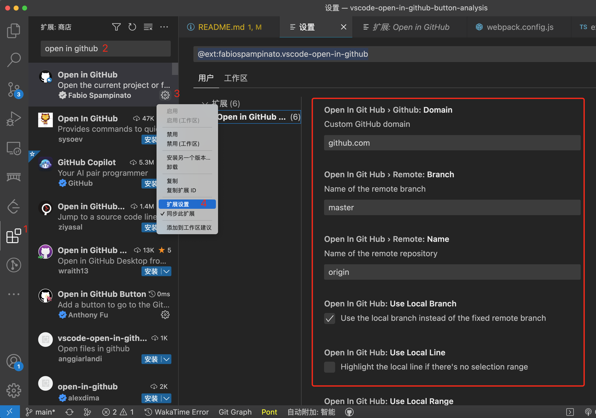
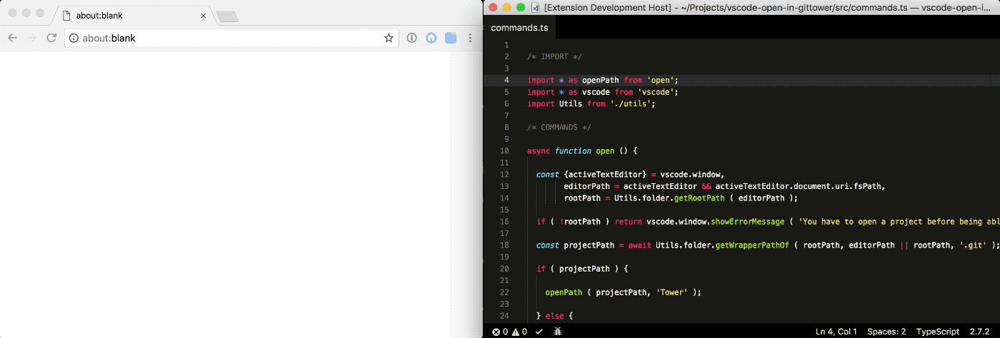

# 神器啊，从未想过 VSCode 还能这样直接打开仓库URL，原理揭秘~

## 1. 前言

大家好，我是[若川](https://ruochuan12.github.io)，欢迎 `follow` [我的 github](https://github.com/ruochuan12)。我倾力持续组织了一年多[每周大家一起学习200行左右的源码共读活动](https://juejin.cn/post/7079706017579139102)，感兴趣的可以[点此扫码加我微信 `ruochuan02` 参与](https://juejin.cn/pin/7217386885793595453)。另外，想学源码，极力推荐关注我写的专栏[《学习源码整体架构系列》](https://juejin.cn/column/6960551178908205093)，目前是掘金关注人数（4.7k+人）第一的专栏，写有20余篇源码文章。

最近 [`antfu`](https://github.com/antfu) 在 `Twitter` 上发推开发了一个 [`VSCode`](https://github.com/antfu/vscode-open-in-github-button) 插件。


你应该有碰到这样的场景。自己公司项目 `gitlab` 或者 `github` 项目。想快速打开网页去做一些操作，但耗时很久。那么有了这个插件后就方便快速很多，直接在状态栏点击一下图标即可打开。

安装插件 [open in github button](https://marketplace.visualstudio.com/items?itemName=antfu.open-in-github-button)，[github repo](https://github.com/antfu/vscode-open-in-github-button) 后，会安装上依赖的另外一个插件 [Open in GitHub](https://marketplace.visualstudio.com/items?itemName=fabiospampinato.vscode-open-in-github)，[github repo](https://github.com/fabiospampinato/vscode-open-in-github)。

`Open in GitHub` 插件也提供了一些用户自定义配置。支持配置为自己的域名，比如 `gitlab`，配置好后就能打开相应的项目地址。

可以全局设置 `@ext:fabiospampinato.vscode-open-in-github`。如下图所示：

。

也可以在项目中新增 `.vscode/setting.json` 配置。

```json
// setting.json
{
  "openInGitHub.github.domain": "github.com", // Custom GitHub domain
  "openInGitHub.remote.name": "origin", // Name of the remote repository
  "openInGitHub.remote.branch": "master", // Name of the remote branch
  "openInGitHub.useLocalBranch": true, // Use the local branch instead of the fixed remote branch
  "openInGitHub.useLocalRange": true, // Highlight the local selection range, if there's one
  "openInGitHub.useLocalLine": false // Highlight the local line if there's no selection range
}
```

除了包含打开项目的命令，还包含了其他很多命令，比如打开 `issue、action、pull request、release 等`，可以按快捷键：`ctrl + shift + p` 输入 `>open in github` 查看。

本文主要来讲述它们的实现原理。

学完本文，你将学到：

```sh
1. 如何开发一个 VSCode 插件
2. 学会开发开源项目的工作流是怎样的
3. 学会调试 VSCode 插件
4. 学会 open in github button vscode 插件的原理是什么
5. 学会 open in github vscode 插件原理
```

## 2. 环境准备

```bash
# 克隆我的项目
git clone https://github.com/ruochuan12/vscode-open-in-github-button-analysis.git
# npm i -g pnpm
cd vscode-open-in-github-button-analysis/vscode-open-in-github-button
pnpm install
# vscode-open-in-github 项目
cd vscode-open-in-github-button-analysis/vscode-open-in-github
pnpm install
```

[也可以 star 我的项目](https://github.com/ruochuan12/vscode-open-in-github-button-analysis.git)

## 3. vscode-open-in-github-button 项目

### 3.1 package.json scripts 命令解析

主要依赖依赖如下：

- [eslint 配置 @antfu/eslint-config](https://github.com/antfu/eslint-config)
- [使用正确的包 @antfu/ni](https://github.com/antfu/ni)
- [提升版本发布相关 bumpp](https://github.com/antfu/bumpp)
- [执行node ts 相关 esno](https://github.com/esbuild-kit/esno)
- [pnpm](https://github.com/pnpm/pnpm)
- [vite](https://github.com/vitejs/vite)
- [vitest](https://github.com/vitest-dev/vitest#readme)
- [vscode 插件发布相关 vsce](https://github.com/microsoft/vscode-vsce)
- [tsup ts 打包构建相关](https://github.com/egoist/tsup)

`scripts` 分析

```json
{
    "scripts": {
        // 用 tsup 打包 vscode 插件扩展
        "build": "tsup src/index.ts --external vscode",
        // 开发
        "dev": "nr build --watch",
        "lint": "eslint .",
        // 预发布
        "vscode:prepublish": "nr build",
        // 发布，不包含依赖
        "publish": "vsce publish --no-dependencies",
        // 打包，不包含依赖
        "pack": "vsce package --no-dependencies",
        // 测试
        "test": "vitest",
        // type 检测
        "typecheck": "tsc --noEmit",
        // 发布
        "release": "bumpp && nr publish"
    }
}
```

### 3.2 github actions

看项目前，我们先来看下 `github actions` 配置。
[了解 GitHub Actions](https://docs.github.com/zh/actions/learn-github-actions/understanding-github-actions)

一个开源项目，一般会有基础的 workflow。

- ci 每次 git push 命令时自动执行 lint 和 test 等，保证校验通过。
- release：每次检测到 git tag，就自动发一个包。

#### 3.2.1 ci

安装 pnpm ，使用 node 16.x，全局安装 ni 工具，执行 nci npm ci npm run lint
有三个job：`lint`、`typecheck`、`test`。

这块代码由于太长，有删减，[可点此查看完整代码](https://github.com/antfu/vscode-open-in-github-button/blob/main/.github/workflows/ci.yml)。

```yml
# vscode-open-in-github-button/.github/workflows/ci.yml
name: CI
# main 分支 push 和 pr 会触发
on:
  push:
    branches:
      - main
  pull_request:
    branches:
      - main
jobs:
  lint:
    runs-on: ubuntu-latest
  typecheck:
    runs-on: ubuntu-latest
  test:
    runs-on: ${{ matrix.os }}
```

#### 3.2.2 release 发布

git push tag 时触发，用 [changelogithub](https://github.com/antfu/changelogithub) 生成 `changelog`。

[其中自动令牌身份验证 secrets.GITHUB_TOKEN](https://docs.github.com/zh/actions/security-guides/automatic-token-authentication)

```yml
# vscode-open-in-github-button/.github/workflows/release.yml
name: Release
# 赋予 secrets.GITHUB_TOKEN 写内容的权限
permissions:
  contents: write
on:
  push:
    tags:
      - 'v*'
jobs:
  release:
    runs-on: ubuntu-latest
    steps:
      - uses: actions/checkout@v3
        with:
          fetch-depth: 0
      - uses: actions/setup-node@v3
        with:
          node-version: 16.x
      - run: npx changelogithub
        env:
          GITHUB_TOKEN: ${{secrets.GITHUB_TOKEN}}
```

我们来简单看下测试用例。这个项目用 [vitest](https://cn.vitest.dev/) 测试。写了一个假的测试用例，因为在这个项目中没什么好测试的。

#### 3.2.3 vitest 测试

```js
// test/index.test.ts
import { describe, expect, it } from 'vitest'

describe('should', () => {
  it('exported', () => {
    expect(1).toEqual(1)
  })
})
```

### 3.3 入口文件 index.ts

```ts
import { StatusBarAlignment, window } from 'vscode'

export function activate() {
  const statusBar = window.createStatusBarItem(StatusBarAlignment.Left, 0)
  statusBar.command = 'openInGitHub.openProject'
  statusBar.text = '$(github)'
  statusBar.tooltip = 'Open in GitHub'
  statusBar.show()
}

export function deactivate() {

}
```

点击状态栏的 `open in github` 按钮，其实执行的是 `'openInGitHub.openProject'` 命令。

### 3.4 openInGitHub.openProject

这时放几个官方链接。
[VSCode 插件市场](https://marketplace.visualstudio.com/VSCode)
[vscode api](https://code.visualstudio.com/api)
如果看英文文档吃力，这里推荐 `Edge` 浏览器可以翻译成中文，或者谷歌自带的翻译，或者其他翻译插件。

翻看文档和 项目`package.json` 文件，我们可以得知，这个命令并不是官方提供的，而是依赖第三方的扩展插件。

```json
{
  "extensionPack": [
    "fabiospampinato.vscode-open-in-github"
  ],
}
```

我们来看这个插件，[vscode-open-in-github](https://github.com/fabiospampinato/vscode-open-in-github.git)。

>open in project




贡献文档
**Contributing**

If you found a problem, or have a feature request, please open an [issue](https://github.com/fabiospampinato/vscode-open-in-github/issues) about it.

If you want to make a pull request you can debug the extension using [Debug Launcher](https://marketplace.visualstudio.com/items?itemName=fabiospampinato.vscode-debug-launcher).

调试安装作者推荐的调试工具 `Debug Launcher`。


我们找到 `main` 入口文件。

## 4. vscode-open-in-github package.json

入口文件

```json
{
  "main": "out/extension.js",
}
```

主要依赖如下：

- [lodash](https://github.com/lodash/lodash)
- [回调函数转 Promise pify](https://github.com/sindresorhus/pify#readme)
- [simple-git](https://github.com/steveukx/git-js#readme)

## 5. 调试项目

克隆项目，然后安装依赖

```bash
git clone https://github.com/fabiospampinato/vscode-open-in-github.git
cd vscode-open-in-github

npm install
# 或者
# npm i -g yarn
yarn install
# 或者
# npm i -g pnpm
pnpm install
```

选中 `package.json` 中的，`"main": "out/extension.js"`，按 `ctrl + shift + p`。输入选择 `debug launcher auto` 即可调试。


## 6. 入口 src/extension.ts

我们可以从 `webpack.config.js` 配置看到入口文件 `src/extension.ts`，可以提前去打好断点等。

```ts
// vscode-open-in-github/webpack.config.js
const config = {
  target: 'node',
  entry: './src/extension.ts',
}
```

```ts
// vscode-open-in-github/src/extension.ts
/* IMPORT */
import Utils from './utils';
/* ACTIVATE */
const activate = Utils.initCommands;
/* EXPORT */
export {activate};
```

### 6.1 Utils 工具函数

```ts
/* IMPORT */
import * as _ from 'lodash';
import * as absolute from 'absolute';
import * as findUp from 'find-up';
import * as path from 'path';
import * as pify from 'pify';
import * as simpleGit from 'simple-git';
import * as vscode from 'vscode';
import * as Commands from './commands';
import Config from './config';

/* UTILS */
const Utils = {
  // 初始化命令
  initCommands ( context: vscode.ExtensionContext ) {
    /**
     *
     * contributes: {
     * "commands": [
      {
        "command": "openInGitHub.openProject",
        "title": "Open in GitHub: Project"
      },
     * }
     *
    */
    const {commands} = vscode.extensions.getExtension ( 'fabiospampinato.vscode-open-in-github' ).packageJSON.contributes;
    commands.forEach ( ({ command, title }) => {
      const commandName = _.last ( command.split ( '.' ) ) as string,
            // openProject
            handler = Commands[commandName],
            // 注册 openProject 命令，函数是 Commands[openProject]
            disposable = vscode.commands.registerCommand ( command, () => handler () );
      context.subscriptions.push ( disposable );
    });
    return Commands;
  },
}
```

### 6.2 Commands 导出的命令函数

```ts
// vscode-open-in-github/src/commands.ts
/* IMPORT */
import URL from './url';
/* COMMANDS */
function openProject () {
  return URL.open ();
}
// 省略了若干其他命令
export { openProject };
```

导出的函数，我们可以看出是调用的 `URL.open` 函数。
我们可以接着看 `URL` 对象。

### 6.3 URL 对象

```ts
// vscode-open-in-github/src/url.ts
/* IMPORT */
import * as _ from 'lodash';
import * as vscode from 'vscode';
import Config from './config';
import Utils from './utils';

/* URL */
const URL = {
  // 省略 get copy 函数
  async get ( file = false, permalink = false, page? ) {},
  async copy ( file = false, permalink = false, page? ) {},
  // 调用的函数
  async open ( file = false, permalink = false, page? ) {
    const url = await URL.get ( file, permalink, page );
    vscode.env.openExternal ( vscode.Uri.parse ( url ) );
  }
}
```

之前如果我们在 `URL.get` 这里断点。
我们可以跟着断点调试，来看 `URL.get` 函数。

#### 6.3.1 URL.get 函数

```ts
const URL = {
  async get ( file = false, permalink = false, page? ) {
    // 获取仓库路径
    const repopath = await Utils.repo.getPath ();
    if ( !repopath ) return vscode.window.showErrorMessage ( 'You have to open a git project before being able to open it in GitHub' );

    // 根据仓库路径获取 git 实例
    const git = Utils.repo.getGit ( repopath ),
    // 用 git 获取 url
          repourl = await Utils.repo.getUrl ( git );
          // 没有找到仓库地址，报错
    if ( !repourl ) return vscode.window.showErrorMessage ( 'Remote repository not found' );
    // 获取用户配置或者默认配置
    /***
     * import * as vscode from 'vscode';
        const Config = {
          get ( extension = 'openInGitHub' ) {
            return vscode.workspace.getConfiguration ().get ( extension ) as any;
          }
        };
     * export default Config;
     * */
    const config = Config.get ();
    let filePath = '',
        branch = '',
        lines = '',
        hash = '';

    // 省略 file 的逻辑
    branch = encodeURIComponent ( branch );
    filePath = encodeURIComponent ( filePath ).replace ( /%2F/g, '/' );
    // 拼接 url
    const url = _.compact ([ repourl, page, branch, hash, filePath, lines ]).join ( '/' );
    return url;
  },
}
```

我们来重点看下 `Utils.repo` 对象导出的函数。

### 6.4 Utils.repo 对象

```ts
/* IMPORT */
import * as _ from 'lodash';
import * as absolute from 'absolute';
import * as findUp from 'find-up';
import * as path from 'path';
import * as pify from 'pify';
import * as simpleGit from 'simple-git';
import * as vscode from 'vscode';
import * as Commands from './commands';
import Config from './config';

const Utils = {
  repo: {
    // 用 simpleGif 仓库获取 git
    getGit ( repopath ) {
      return pify ( _.bindAll ( simpleGit ( repopath ), ['branch', 'getRemotes'] ) );
    },
    // 获取 hash
    async getHash ( git ) {
      return ( await git.revparse ([ 'HEAD' ]) ).trim ();
    },
    // 通过目前路径，获取根路径
    async getPath () {
      const {activeTextEditor} = vscode.window,
            editorPath = activeTextEditor && activeTextEditor.document.uri.fsPath,
            rootPath = Utils.folder.getRootPath ( editorPath );
      if ( !rootPath ) return false;
      // 获取路径
      return await Utils.folder.getWrapperPathOf ( rootPath, editorPath || rootPath, '.git' );
    },
}
```

#### 6.4.1 Utils.repo.getUrl 获取 Url

```ts
const Utils = {
  repo: {
    async getUrl ( git ) {
      // 获取配置信息
      const config = Config.get (),
      // 远程信息
            remotes = await git.getRemotes ( true ),
            remotesGithub = remotes.filter ( remote => ( remote.refs.fetch || remote.refs.push ).includes ( config.github.domain ) ),
            remoteOrigin = remotesGithub.filter ( remote => remote.name === config.remote.name )[0],
            remote = remoteOrigin || remotesGithub[0];
      if ( !remote ) return;
      const ref = remote.refs.fetch || remote.refs.push,
            re = /\.[^.:/]+[:/]([^/]+)\/(.*?)(?:\.git|\/)?$/,
            match = re.exec ( ref );
      if ( !match ) return;
      return `https://${config.github.domain}/${match[1]}/${match[2]}`;
    }
  }
}
```

总结一下大致流程：

- `vscode` 使用 `vscode.commands.registerCommand ( command, () => handler () )` 注册 `openProject` 命令
- ctrl + shift + p 输入 >open in github，选择触发 openInGithub.openProject 命令
- 执行 openProject 函数，实际调用 URL.open() 函数

```ts
async open ( file = false, permalink = false, page? ) {
    const url = await URL.get ( file, permalink, page );
    vscode.env.openExternal ( vscode.Uri.parse ( url ) );
  }
```

- 实际调用的是 `URL.get` 函数
  - 先根据 vscode 的能力，获取到仓库的路径
  - 再根据仓库的路径，获取 git 实例（simple-git）
  - 根据 git 实例，获取到仓库的 url
- 最后打开仓库 url 链接。

## 7. 总结

行文至此，最后，我们来总结下：

通过学习一个状态栏 `github` 图标，即可在浏览器中打开仓库的 `github` 地址功能。
[open in github button](https://github.com/antfu/vscode-open-in-github-button) vscode 插件的原理，是调用了 [vscode-open-in-github](https://github.com/fabiospampinato/vscode-open-in-github.git) 插件提供的 `openInGithub.openProject` 命令。

而 `openInGithub.openProject` 命令是 `VSCode` 插件注册的和执行 `node` 脚本，使用 `simple-git` 获取仓库 `url` 等。最终 `VSCode` 打开浏览器访问这个链接地址。

这种场景确实存在，但我们不一定会思考到用技术方案解决它。

打开 `github` 仓库或者 `gitlab` 仓库的方式有挺多。比如终端工具 `gh browse`。或者在 `package.json` 配置仓库链接地址，再转到找到链接地址去打开。或者找到 `.git/config` 中的配置 `git` 链接打开。

我们学会了如何利用 [GitHub Actions](https://docs.github.com/zh/actions/learn-github-actions/understanding-github-actions)，用 [tsup](https://github.com/egoist/tsup) 构建 `ts`，用 [bumpp](https://github.com/antfu/bumpp) 提升版本号等，用 [changelogithub](https://github.com/antfu/changelogithub) 生成 `changelog` 等等，开发一个开源项目。

我们还学会了用 [vsce](https://github.com/microsoft/vscode-vsce) 如何打包、发布一个 `VSCode` 插件。学会了使用调试工具 [Debug Launcher](https://marketplace.visualstudio.com/items?itemName=fabiospampinato.vscode-debug-launcher) 自动化调试 `VSCode` 插件。
[VSCode 详尽的发布插件官方文档](https://code.visualstudio.com/api/working-with-extensions/publishing-extension)

---

**如果看完有收获，欢迎点赞、评论、分享支持。你的支持和肯定，是我写作的动力**。

## 8. 加源码共读交流群

最后可以持续关注我[@若川](https://juejin.cn/user/1415826704971918)，欢迎 `follow` [我的 github](https://github.com/ruochuan12)。另外，想学源码，极力推荐关注我写的专栏[《学习源码整体架构系列》](https://juejin.cn/column/6960551178908205093)，目前是掘金关注人数（4.7k+人）第一的专栏，写有20余篇源码文章。

我倾力持续组织了一年多[每周大家一起学习200行左右的源码共读活动](https://juejin.cn/post/7079706017579139102)，感兴趣的可以[点此扫码加我微信 `ruochuan02` 参与](https://juejin.cn/pin/7217386885793595453)。
