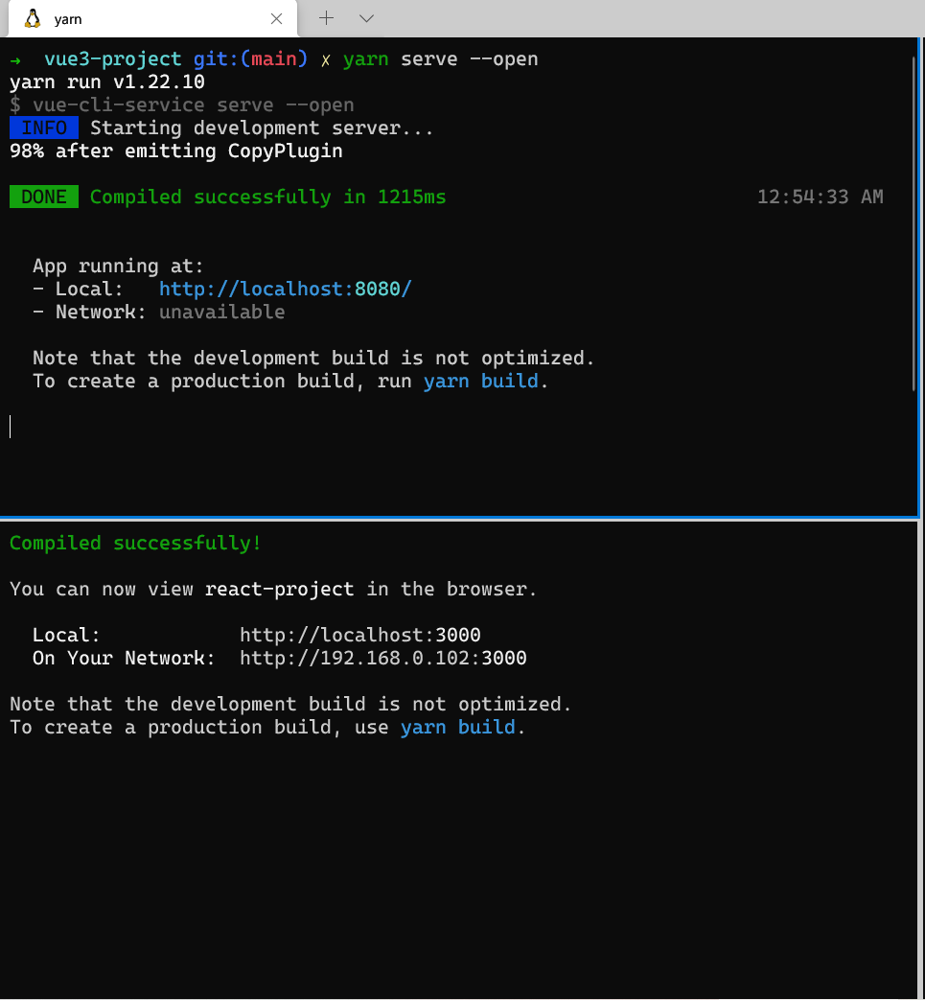
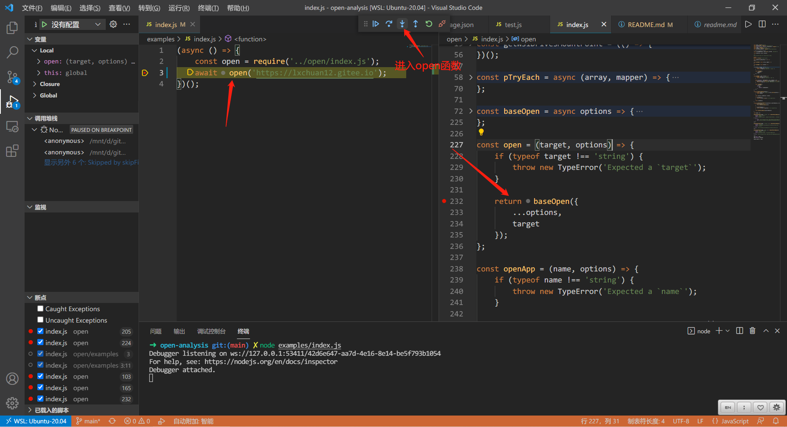

# 每次启动项目的服务，电脑竟然乖乖的帮我打开了浏览器，100行源码揭秘！

## 1. 前言

>大家好，我是[若川](https://lxchuan12.gitee.io)。欢迎关注我的[公众号若川视野](https://lxchuan12.gitee.io)，最近组织了[源码共读活动](https://juejin.cn/pin/7005372623400435725)，感兴趣的可以加我微信 [ruochuan12](https://juejin.cn/pin/7005372623400435725) 参与，如今已进行三个月，大家一起交流学习，共同进步，很多人都表示收获颇丰。

想学源码，极力推荐之前我写的[《学习源码整体架构系列》](https://juejin.cn/column/6960551178908205093) 包含`jQuery`、`underscore`、`lodash`、`vuex`、`sentry`、`axios`、`redux`、`koa`、`vue-devtools`、`vuex4`、`koa-compose`、`vue 3.2 发布`、`vue-this`、`create-vue`、`玩具vite`等10余篇源码文章。

[本文仓库 open-analysis，求个star^_^](https://github.com/lxchuan12/open-analysis.git)

最近组织了[源码共读活动](https://juejin.cn/pin/7005372623400435725)，大家一起学习源码。于是搜寻各种值得我们学习，且代码行数不多的源码。

我们经常遇到类似场景：**每次启动项目的服务，电脑竟然乖乖的帮我打开了浏览器**。当然你也可能没有碰到过，但可能有这样的需求。而源码300行左右，核心源码不到100行。跟我们工作息息相关，非常值得我们学习。

之前写过[据说 99% 的人不知道 vue-devtools 还能直接打开对应组件文件？本文原理揭秘](https://juejin.cn/post/6959348263547830280)，也是跟本文类似原理。

阅读本文，你将学到：

```js
1. 电脑竟然乖乖的帮我打开了浏览器原理和源码实现
2. 学会使用 Node.js 强大的 child_process 模块
3. 学会调试学习源码
4. 等等
```

## 2. 使用

### 2.1 在 webpack 中使用

[devServer.open](https://webpack.js.org/configuration/dev-server/#devserveropen)

告诉 [dev-server](https://github.com/webpack/webpack-dev-server) 在服务器启动后打开浏览器。 将其设置为 true 以打开您的默认浏览器。

**webpack.config.js**

```bash
module.exports = {
  //...
  devServer: {
    open: true,
  },
};
```

**Usage via the CLI:**

```bash
npx webpack serve --open
```

**To disable:**

```bash
npx webpack serve --no-open
```

现在大多数都不是直接用 `webpack` 配置了。而是使用脚手架。那么接着来看我们熟悉的脚手架中，打开浏览器的功能是怎么使用的。

### 2.2 在 vue-cli 使用

```bash
npx @vue/cli create vue3-project
# 我的 open-analysis 项目中 vue3-project 文件夹
# npm i -g yarn
# yarn serve 不会自动打开浏览器
yarn serve
# --open 参数后会自动打开浏览器
yarn serve --open
```

### 2.3 在 create-react-app 使用

```bash
npx create-react-app react-project
# 我的 open-analysis 项目中 react-project 文件夹
# npm i -g yarn
# 默认自动打开了浏览器
yarn start
```



终端我用的是 `window terminal`，推荐我之前的文章：[使用 ohmyzsh 打造 windows、ubuntu、mac 系统高效终端命令行工具](https://lxchuan12.gitee.io/oh-my-zsh/)，用过都说好。

`webpack`、`vue-cli`和`create-react-app`，它们三者都有个特点就是不约而同的使用了[open](https://github.com/sindresorhus/open)。

引用 `open` 分别的代码位置是：

- [webpack-dev-server](https://github.com/webpack/webpack-dev-server/blob/master/lib/Server.js#L1669)
- [vue-cli](https://github.com/vuejs/vue-cli/blob/v4/packages/%40vue/cli-shared-utils/lib/openBrowser.js#L9)
- [create-react-app](https://github.com/facebook/create-react-app/blob/main/packages/react-dev-utils/openBrowser.js#L13)

接着我们来学习`open`原理和源码。

## 3. 原理

在 `npm` 之王 [@sindresorhus](https://github.com/sindresorhus) 的 [open README文档](https://github.com/sindresorhus/open)中，英文描述中写了为什么使用它的几条原因。

**为什么推荐使用 `open`**

```bash
积极维护。
支持应用参数。
更安全，因为它使用 spawn 而不是 exec。
修复了大多数 node-open 的问题。
包括适用于 Linux 的最新 xdg-open 脚本。
支持 Windows 应用程序的 WSL 路径。
```

一句话概括`open`原理则是：针对不同的系统，使用`Node.js`的子进程 `child_process` 模块的`spawn`方法，调用系统的命令打开浏览器。

对应的系统命令简单形式则是：

```bash
# mac
open https://lxchuan12.gitee.io
# win
start https://lxchuan12.gitee.io
# linux
xdg-open https://lxchuan12.gitee.io
```

[windows start 文档](https://docs.microsoft.com/zh-cn/windows-server/administration/windows-commands/start)

`open`包描述信息：[open](https://npm.im/open)

[在这里可以看到有哪些 npm 包依赖了 open](https://www.npmjs.com/browse/depended/open)

我们熟悉的很多 `npm` 包都依赖了`open`。这里列举几个。

- [webpack-dev-server](https://www.npmjs.com/package/webpack-dev-server)
- [react-dev-utils](https://www.npmjs.com/package/react-dev-utils)
- [@vue/cli-shared-utils](https://www.npmjs.com/package/@vue/cli-shared-utils)
- [patch-package](https://www.npmjs.com/package/patch-package)
- [lighthouse](https://www.npmjs.com/package/lighthouse)
- [release-it](https://www.npmjs.com/package/release-it)

## 4. 阅读源码前的准备工作

```bash
# 推荐克隆我的项目，保证与文章同步，同时测试文件齐全
git clone https://github.com/lxchuan12/open-analysis.git
# npm i -g yarn
cd open && yarn

# 或者克隆官方项目
git clone https://github.com/sindresorhus/open.git
# npm i -g yarn
cd open && yarn
```
### 4.1 写个例子，便于调试源码

由于测试用例相对较为复杂，我们自己动手写个简单的例子，便于我们自己调试。

根据 `README`，我们在 `open-analysis` 文件夹下新建一个文件夹 `examples` ，里面存放一个 `index.js`。文件内容如下：

```js
// open-analysis/examples/index.js
(async () => {
    const open = require('../open/index.js');
    await open('https://lxchuan12.gitee.io');
})();
```

在 `await open('https://lxchuan12.gitee.io');` 打上断点。在终端命令行中执行

```bash
node examples/index.js
```

会自动唤起调试模式。如果不支持先阅读这个官方文档配置：[Node.js debugging in VS Code](https://code.visualstudio.com/docs/nodejs/nodejs-debugging)，如果还是不行，可以升级到最新版`VSCode`试试。

跟着调试我们可以进入 `open` 函数。




### 4.2 open 打开函数


```js
// open/index.js
const open = (target, options) => {
	if (typeof target !== 'string') {
		throw new TypeError('Expected a `target`');
	}

	return baseOpen({
		...options,
		target
	});
};
```

跟着断点，我们来看最终调用的 `baseOpen`。
这个函数比较长，重点可以猜到是：`const subprocess = childProcess.spawn(command, cliArguments, childProcessOptions);`这句，我们可以打算断点调试。

### 4.3 baseOpen 基础打开函数

```js
// open/index.js
const childProcess = require('child_process');
const localXdgOpenPath = path.join(__dirname, 'xdg-open');

const {platform, arch} = process;
// 调试时我们可以自行调整修改平台，便于调试各个平台异同，比如 mac、win、linux
// const {arch} = process;
// mac
// const platform = 'darwin';
// win
// const platform = 'win32';
// const platform = '其他';

const baseOpen = async options => {
    options = {
		wait: false,
		background: false,
		newInstance: false,
		allowNonzeroExitCode: false,
		...options
	};
    // 省略部分代码
    // 命令
    let command;
    // 命令行参数
	const cliArguments = [];
    // 子进程选项
	const childProcessOptions = {};
    if (platform === 'darwin') {
        command = 'open';
        // 省略 mac 部分代码
    } else if (platform === 'win32' || (isWsl && !isDocker())) {
        // 省略 window 或者 window 子系统代码
        const encodedArguments = ['Start'];
    } else {
        const useSystemXdgOpen = process.versions.electron ||
            platform === 'android' || isBundled || !exeLocalXdgOpen;
        command = useSystemXdgOpen ? 'xdg-open' : localXdgOpenPath;
        // 省略 linux 代码
    }
    // 省略部分代码
    const subprocess = childProcess.spawn(command, cliArguments, childProcessOptions);
    
    // 省略部分代码
    subprocess.unref();

	return subprocess;
}
```

由此我们可以看出：

一句话概括`open`原理则是：针对不同的系统，使用`Node.js`的子进程 `child_process` 模块的`spawn`方法，调用系统的命令打开浏览器。

对应的系统命令简单形式则是：

```bash
# mac
open https://lxchuan12.gitee.io
# win
start https://lxchuan12.gitee.io
# linux
xdg-open https://lxchuan12.gitee.io
```

## 5. 总结

一句话概括`open`原理则是：针对不同的系统，使用`Node.js`的子进程 `child_process` 模块的`spawn`方法，调用系统的命令打开浏览器。

本文从日常常见的场景**每次启动服务就能自动打开浏览器**出发，先讲述了日常在`webpack`、`vue-cli`、`create-react-app`如何使用该功能，最后从源码层面解读了[open](https://github.com/sindresorhus/open)的原理和源码实现。工作常用的知识能做到**知其然，知其所以然**，就比很多人厉害了。

因为文章不宜过长，所以未全面展开讲述源码中所有细节。非常建议读者朋友按照文中方法使用`VSCode`调试 `open` 源码。**学会调试源码后，源码并没有想象中的那么难**。

最后可以持续关注我@若川。欢迎加我微信 [ruochuan12](https://juejin.cn/pin/7005372623400435725) 交流，参与 [源码共读](https://juejin.cn/pin/7005372623400435725) 活动，大家一起学习源码，共同进步。