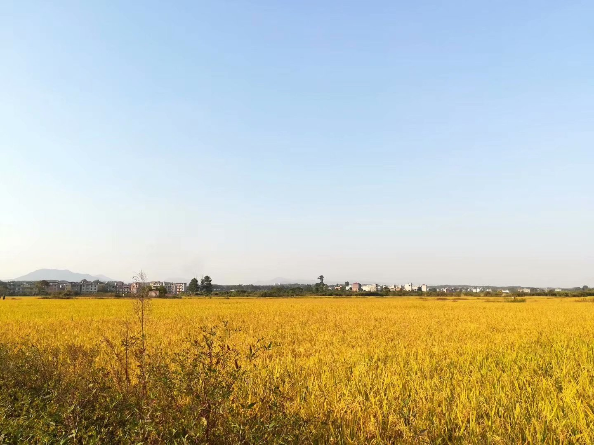
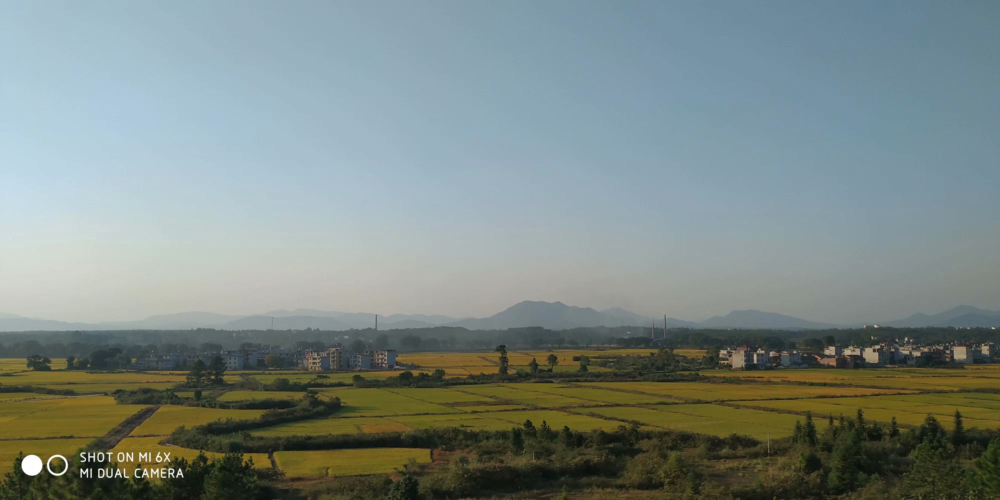
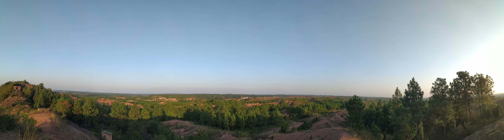
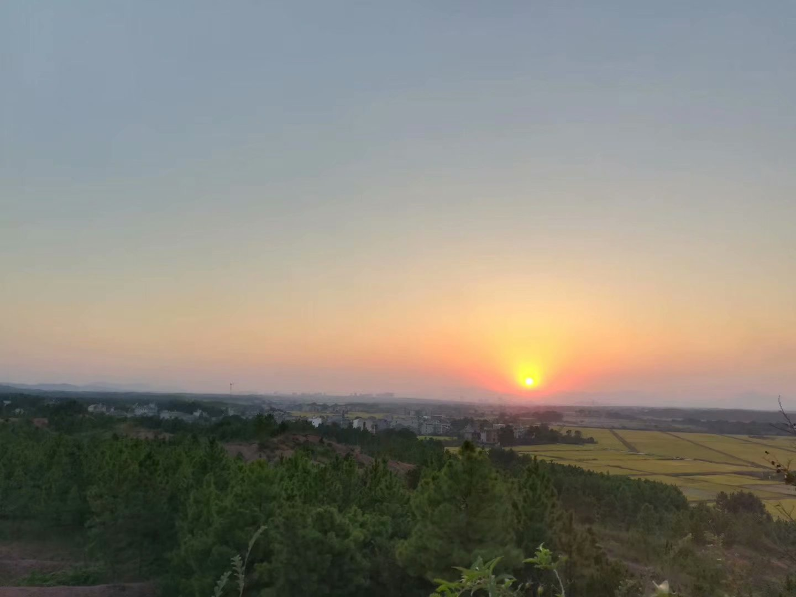
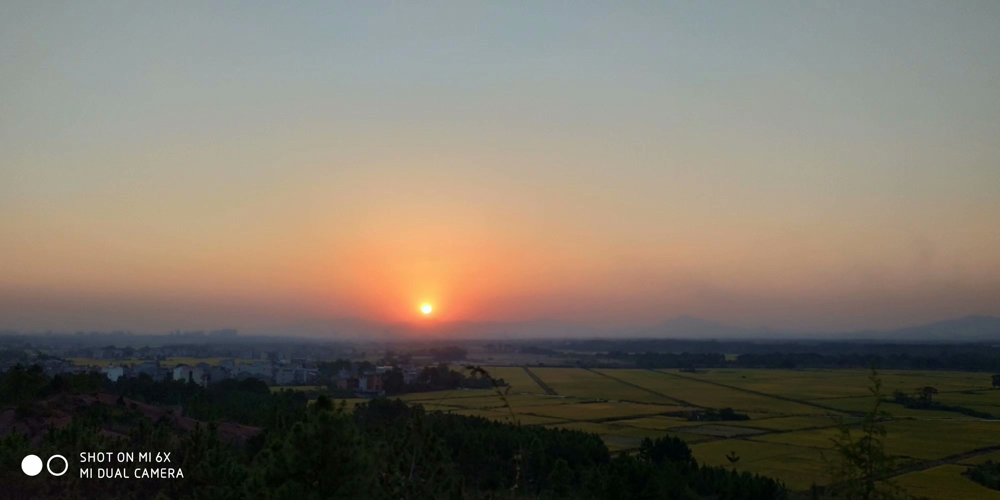

# 登高望远，夜幕降临

> 写于 `2013年8月1日`

夜幕即将降临，骑上单车，穿过那片田野。

来到山脚下，惊动雏鸟，鸟儿藏匿。

回望田野，阡陌纵横。

登上山顶，凉风袭来。

遥望夕阳，静观晚霞。

环顾四周，村落人家，炊烟缕缕。

万里群山，千姿百态。

山谷松木，郁郁葱葱。

忽见蛇行，匆匆击掌，惊起白鹤数只。

远处湖泊，听到车声，定睛一看，原是高速路。

天空鸟儿飞过，叫声凄凉，归栖息地。

急忙下山，虫声四起，远处灯火闪烁，骑车归家，一路蚊子嗡嗡作响。

夜幕登高，颇多惬意。

`2018年10月5日重新登山 发朋友圈附图`

