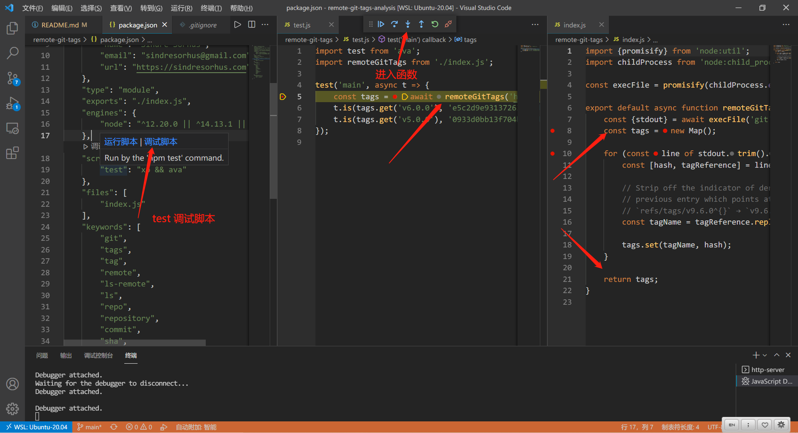
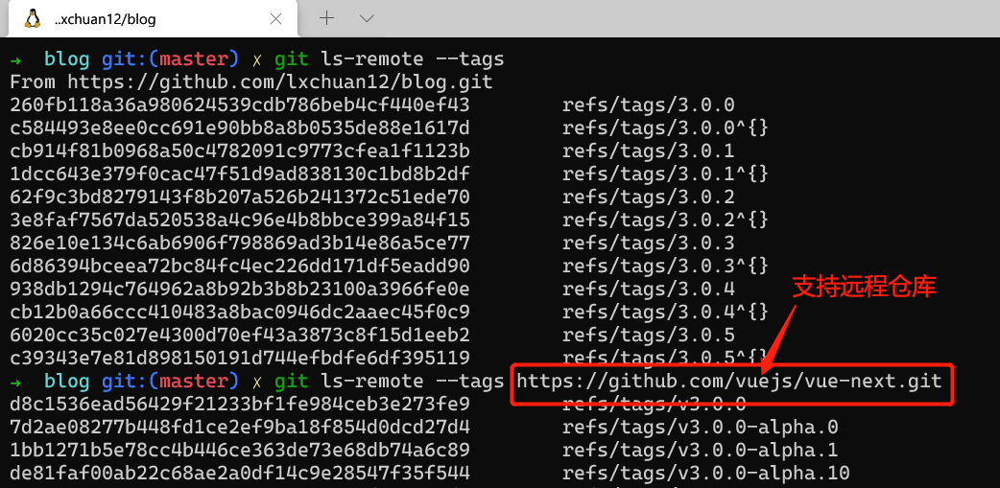
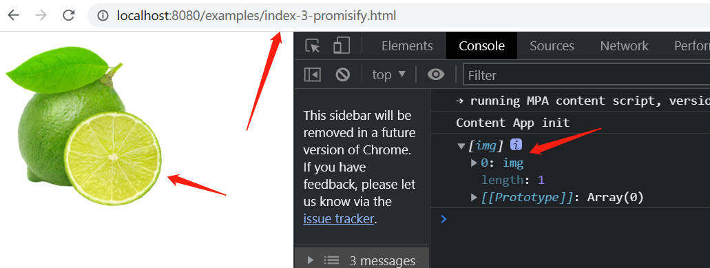

# 从22行有趣的源码库中，我学到了 callback promisify 化的 Node.js 源码实现

## 1. 前言

>大家好，我是[若川](https://lxchuan12.gitee.io)。欢迎关注我的[公众号若川视野](https://lxchuan12.gitee.io)，最近组织了[源码共读活动](https://juejin.cn/pin/7005372623400435725)，感兴趣的可以加我微信 [ruochuan12](https://juejin.cn/pin/7005372623400435725) 参与，如今已进行三个月，大家一起交流学习，共同进步，很多人都表示收获颇丰。

想学源码，极力推荐之前我写的[《学习源码整体架构系列》](https://juejin.cn/column/6960551178908205093) 包含`jQuery`、`underscore`、`lodash`、`vuex`、`sentry`、`axios`、`redux`、`koa`、`vue-devtools`、`vuex4`、`koa-compose`、`vue 3.2 发布`、`vue-this`、`create-vue`、`玩具vite`等10余篇源码文章。

[本文仓库 remote-git-tags-analysis，求个star^_^](https://github.com/lxchuan12/remote-git-tags-analysis.git)

最近组织了[源码共读活动](https://juejin.cn/pin/7005372623400435725)，大家一起学习源码。于是搜寻各种值得我们学习，且代码行数不多的源码。

我们经常会在本地git仓库切换tags，或者git仓库切换tags。那么我们是否想过如果获取tags呢。本文就是学习 `remote-git-tags` 这个22行代码的源码库。源码不多，但非常值得我们学习。

阅读本文，你将学到：

```js
1. Node 加载采用什么模块
2. 获取 git 仓库所有 tags 的原理
3. 学会调试看源码
4. 学会面试高频考点 promisify 的原理和实现
5. 等等
```

刚开始先不急着看上千行、上万行的源码。源码长度越长越不容易坚持下来。看源码讲究循序渐进。比如先从自己会用上的百来行的开始看。

我之前在知乎上回答过类似问题。

[一年内的前端看不懂前端框架源码怎么办？](https://www.zhihu.com/question/350289336/answer/910970733)

**简而言之，看源码**

```bash
循序渐进
借助调试
理清主线
查阅资料
总结记录
```

## 2. 使用

```js
import remoteGitTags from 'remote-git-tags';

console.log(await remoteGitTags('https://github.com/lxchuan12/blog.git'));
//=> Map {'3.0.5' => 'c39343e7e81d898150191d744efbdfe6df395119', …}
```

## 3. 源码

>Get tags from a remote Git repo

这个库的作用是：从远程仓库获取所有标签。

原理：通过执行 `git ls-remote --tags repoUrl` （仓库路径）获取 `tags`

应用场景：可以看有哪些包依赖的这个包。
[npm 包描述信息](https://npm.im/remote-git-tags)

其中一个比较熟悉的是[npm-check-updates](https://www.npmjs.com/package/npm-check-updates)

>npm-check-updates 将您的 package.json 依赖项升级到最新版本，忽略指定的版本。

还有场景可能是 `github` 中获取所有 `tags` 信息，切换 `tags` 或者选定 `tags` 发布版本等，比如微信小程序版本。

看源码前先看 `package.json` 文件。

### 3.1 package.json

```js
// package.json
{
  // 指定 Node 以什么模块加载，缺省时默认是 commonjs
	"type": "module",
	"exports": "./index.js",
  // 指定 nodejs 的版本
	"engines": {
		"node": "^12.20.0 || ^14.13.1 || >=16.0.0"
	},
	"scripts": {
		"test": "xo && ava"
	}
}
```

众所周知，`Node` 之前一直是 `CommonJS` 模块机制。 `Node 13` 添加了对标准 `ES6` 模块的支持。

告诉 `Node` 它要加载的是什么模块的最简单的方式，就是将信息编码到不同的扩展名中。
如果是 `.mjs` 结尾的文件，则 `Node` 始终会将它作为 `ES6` 模块来加载。
如果是 `.cjs` 结尾的文件，则 `Node` 始终会将它作为 `CommonJS` 模块来加载。

对于以 `.js` 结尾的文件，默认是 `CommonJS` 模块。如果同级目录及所有目录有 `package.json` 文件，且 `type` 属性为`module` 则使用 `ES6` 模块。`type` 值为 `commonjs` 或者为空或者没有 `package.json` 文件，都是默认 `commonjs` 模块加载。

关于 `Node` 模块加载方式，在《JavaScript权威指南第7版》16.1.4 Node 模块 小节，有更加详细的讲述。此书第16章都是讲述`Node`，感兴趣的读者可以进行查阅。

### 3.2 调试源码

```bash
# 推荐克隆我的项目，保证与文章同步，同时测试文件齐全
git clone https://github.com/lxchuan12/remote-git-tags-analysis.git
# npm i -g yarn
cd remote-git-tags && yarn
# VSCode 直接打开当前项目
# code .

# 或者克隆官方项目
git clone https://github.com/sindresorhus/remote-git-tags.git
# npm i -g yarn
cd remote-git-tags && yarn
# VSCode 直接打开当前项目
# code .
```

用最新的`VSCode` 打开项目，找到 `package.json` 的 `scripts` 属性中的 `test` 命令。鼠标停留在`test`命令上，会出现 `运行命令` 和 `调试命令` 的选项，选择 `调试命令` 即可。

调试如图所示：



`VSCode` 调试 `Node.js` 说明如下图所示：


跟着调试，我们来看主文件。

### 3.3 主文件仅有22行源码

```js
// index.js
import {promisify} from 'node:util';
import childProcess from 'node:child_process';

const execFile = promisify(childProcess.execFile);

export default async function remoteGitTags(repoUrl) {
	const {stdout} = await execFile('git', ['ls-remote', '--tags', repoUrl]);
	const tags = new Map();

	for (const line of stdout.trim().split('\n')) {
		const [hash, tagReference] = line.split('\t');

		// Strip off the indicator of dereferenced tags so we can override the
		// previous entry which points at the tag hash and not the commit hash
		// `refs/tags/v9.6.0^{}` → `v9.6.0`
		const tagName = tagReference.replace(/^refs\/tags\//, '').replace(/\^{}$/, '');

		tags.set(tagName, hash);
	}

	return tags;
}
```

源码其实一眼看下来就很容易懂。

### 3.4 git ls-remote --tags

支持远程仓库链接。

[git ls-remote 文档](https://git-scm.com/docs/git-ls-remote)

如下图所示：



获取所有`tags` `git ls-remote --tags https://github.com/vuejs/vue-next.git`

把所有 `tags` 和对应的 `hash`值 存在 `Map` 对象中。

### 3.5 node:util

[Node 文档](https://nodejs.org/dist/latest-v16.x/docs/api/modules.html)

>Core modules can also be identified using the node: prefix, in which case it bypasses the require cache. For instance, require('node:http') will always return the built in HTTP module, even if there is require.cache entry by that name.

也就是说引用 `node` 原生库可以加 `node:` 前缀，比如 `import util from 'node:util'`

看到这，其实原理就明白了。毕竟只有22行代码。接着讲述 `promisify`。

## 4. promisify

源码中有一段：

```js
const execFile = promisify(childProcess.execFile);
```

`promisify` 可能有的读者不是很了解。

接下来重点讲述下这个函数的实现。

`promisify`函数是把 `callback` 形式转成 `promise` 形式。

我们知道 `Node.js` `天生异步`，错误回调的形式书写代码。回调函数的第一个参数是错误信息。也就是错误优先。

我们换个简单的场景来看。

### 4.1 简单实现

假设我们有个用JS加载图片的需求。我们从 [这个网站](https://www.themealdb.com/api.php) 找来图片。

```js
examples
const imageSrc = 'https://www.themealdb.com/images/ingredients/Lime.png';

function loadImage(src, callback) {
    const image = document.createElement('img');
    image.src = src;
    image.alt = '公众号若川视野专用图？';
    image.style = 'width: 200px;height: 200px';
    image.onload = () => callback(null, image);
    image.onerror = () => callback(new Error('加载失败'));
    document.body.append(image);
}
```

我们很容易写出上面的代码，也很容易写出回调函数的代码。需求搞定。

```js
loadImage(imageSrc, function(err, content){
  if(err){
    console.log(err);
    return;
  }
  console.log(content);
});
```

但是回调函数有回调地狱等问题，我们接着用 `promise` 来优化下。

### 4.2 promise 初步优化

我们也很容易写出如下代码实现。

```js
const loadImagePromise = function(src){
    return new Promise(function(resolve, reject){
        loadImage(src, function (err, image) {
            if(err){
                reject(err);
                return;
            }
            resolve(image);
        });
    });
};
loadImagePromise(imageSrc).then(res => {
    console.log(res);
})
.catch(err => {
    console.log(err);
});
```

但这个不通用。我们需要封装一个比较通用的 `promisify` 函数。

### 4.3 通用 promisify 函数

```js
function promisify(original){
    function fn(...args){
        return new Promise((resolve, reject) => {
            args.push((err, ...values) => {
                if(err){
                    return reject(err);
                }
                resolve(values);
            });
            // original.apply(this, args);
            Reflect.apply(original, this, args);
        });
    }
    return fn;
}

const loadImagePromise = promisify(loadImage);
async function load(){
    try{
        const res = await loadImagePromise(imageSrc);
        console.log(res);
    }
    catch(err){
        console.log(err);
    }
}
load();
```

需求搞定。这时就比较通用了。

**这些例子在我的仓库存放在 `examples` 文件夹中。可以克隆下来，`npx http-server .`跑服务，运行试试。**



跑失败的结果可以把 `imageSrc` 改成不存在的图片即可。

`promisify` 可以说是面试高频考点。很多面试官喜欢考此题。

接着我们来看 `Node.js` 源码中 `promisify` 的实现。

### 4.4 Node utils promisify 源码

[github1s node utils 源码](https://github1s.com/nodejs/node/blob/master/lib/internal/util.js#L343)

源码就暂时不做过多解释，可以查阅文档。结合前面的例子，其实也容易理解。

[utils promisify 文档](http://nodejs.cn/api/util/util_promisify_original.html)

```js
const kCustomPromisifiedSymbol = SymbolFor('nodejs.util.promisify.custom');
const kCustomPromisifyArgsSymbol = Symbol('customPromisifyArgs');

let validateFunction;

function promisify(original) {
  // Lazy-load to avoid a circular dependency.
  if (validateFunction === undefined)
    ({ validateFunction } = require('internal/validators'));

  validateFunction(original, 'original');

  if (original[kCustomPromisifiedSymbol]) {
    const fn = original[kCustomPromisifiedSymbol];

    validateFunction(fn, 'util.promisify.custom');

    return ObjectDefineProperty(fn, kCustomPromisifiedSymbol, {
      value: fn, enumerable: false, writable: false, configurable: true
    });
  }

  // Names to create an object from in case the callback receives multiple
  // arguments, e.g. ['bytesRead', 'buffer'] for fs.read.
  const argumentNames = original[kCustomPromisifyArgsSymbol];

  function fn(...args) {
    return new Promise((resolve, reject) => {
      ArrayPrototypePush(args, (err, ...values) => {
        if (err) {
          return reject(err);
        }
        if (argumentNames !== undefined && values.length > 1) {
          const obj = {};
          for (let i = 0; i < argumentNames.length; i++)
            obj[argumentNames[i]] = values[i];
          resolve(obj);
        } else {
          resolve(values[0]);
        }
      });
      ReflectApply(original, this, args);
    });
  }

  ObjectSetPrototypeOf(fn, ObjectGetPrototypeOf(original));

  ObjectDefineProperty(fn, kCustomPromisifiedSymbol, {
    value: fn, enumerable: false, writable: false, configurable: true
  });
  return ObjectDefineProperties(
    fn,
    ObjectGetOwnPropertyDescriptors(original)
  );
}

promisify.custom = kCustomPromisifiedSymbol;
```

## 5. ES6+ 等知识

文中涉及到了`Map`、`for of`、正则、解构赋值。

还有涉及封装的 `ReflectApply`、`ObjectSetPrototypeOf`、`ObjectDefineProperty`、`ObjectGetOwnPropertyDescriptors` 等函数都是基础知识。

这些知识可以查看[esma规范](https://yanhaijing.com/es5/)，或者阮一峰老师的[《ES6 入门教程》](https://es6.ruanyifeng.com/) 等书籍。

## 6. 总结

一句话简述 `remote-git-tags` 原理：使用`Node.js`的子进程 `child_process` 模块的`execFile`方法执行 `git ls-remote --tags repoUrl` 获取所有 `tags` 和 `tags` 对应 `hash` 值 存放在 `Map` 对象中。

文中讲述了我们可以循序渐进，借助调试、理清主线、查阅资料、总结记录的流程看源码。

通过 `remote-git-tags` 这个22行代码的仓库，学会了 Node 加载采用什么模块，知道了原来 `git ls-remote --tags`支持远程仓库，学到了面试高频考点 `promisify` 函数原理和源码实现，巩固了一些 `ES6+` 等基础知识。

建议读者克隆[我的仓库](https://github.com/lxchuan12/remote-git-tags-analysis.git)动手实践调试源码学习。

后续也可以看看 [es6-promisify](https://github.com/mikehall314/es6-promisify) 这个库的实现。

最后可以持续关注我@若川。欢迎加我微信 [ruochuan12](https://juejin.cn/pin/7005372623400435725) 交流，参与 [源码共读](https://juejin.cn/pin/7005372623400435725) 活动，大家一起学习源码，共同进步。
