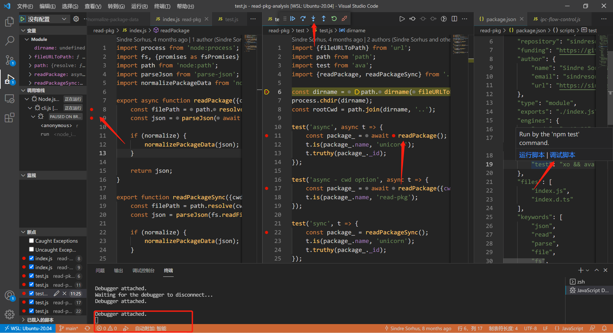

# 从 vue-cli 源码中，我发现27行读取 json 文件有趣的 npm 包
## 1. 前言

>大家好，我是[若川](https://lxchuan12.gitee.io)。**为了能帮助到更多对源码感兴趣、想学会看源码、提升自己前端技术能力的同学**。我倾力组织了[源码共读活动](https://juejin.cn/post/7079706017579139102)，感兴趣的可以加我微信 [ruochuan12](https://juejin.cn/pin/7005372623400435725) 参与，或者关注我的[公众号若川视野](https://lxchuan12.gitee.io)，回复“源码”参与。已进行4个月，每周大家一起学习200行左右的源码，共同进步，很多人都表示收获颇丰。

想学源码，极力推荐关注我写的专栏（目前1.8K人关注）[《学习源码整体架构系列》](https://juejin.cn/column/6960551178908205093) 包含`jQuery`、`underscore`、`lodash`、`vuex`、`sentry`、`axios`、`redux`、`koa`、`vue-devtools`、`vuex4`、`koa-compose`、`vue 3.2 发布`、`vue-this`、`create-vue`、`玩具vite`等20余篇源码文章。

[本文仓库 https://github.com/lxchuan12/read-pkg-analysis.git，求个star^_^](https://github.com/lxchuan12/read-pkg-analysis.git)

[源码共读活动](https://juejin.cn/post/7079706017579139102) 每周一期，已进行到15期。源码群里有小伙伴提问，如何用 `import` 加载 `json` 文件。同时我之前看到了[vue-cli 源码](https://github.com/vuejs/vue-cli/blob/dev/packages/%40vue/cli-shared-utils/lib/pkg.js) 里有 [read-pkg](https://npm.im/read-pkg) 这个包。源码仅27行，非常值得我们学习。

阅读本文，你将学到：
```bash
1. 如何学习调试源码
2. 学会如何获取 package.json
3. 学到 import.meta 
4. 学到引入 json 文件的提案
5. JSON.parse 更友好的错误提示
6. 规范化 package 元数据
7. 等等
```

## 2. 场景

优雅的获取 `package.json` 文件。

[read-pkg](https://npm.im/read-pkg)

[vue-cli 源码](https://github.com/vuejs/vue-cli/blob/dev/packages/%40vue/cli-shared-utils/lib/pkg.js)

```js
const fs = require('fs')
const path = require('path')
const readPkg = require('read-pkg')

exports.resolvePkg = function (context) {
  if (fs.existsSync(path.join(context, 'package.json'))) {
    return readPkg.sync({ cwd: context })
  }
  return {}
}
```

封装这个函数的[commit 记录](https://github.com/vuejs/vue-cli/commit/eaa2b7341f174260f6ebc2345bd8e838f85a2ea3#diff-eff8c1ce409e9f1aa37372ff81a6563e31d1270822f5bfdba17426c4b1def4de)

你也许会想直接 `require('package.json');` 不就可以了。但在`ES模块`下，目前无法直接引入JSON文件。

[在 stackoverflow 也有相关提问](https://stackoverflow.com/questions/34944099/how-to-import-a-json-file-in-ecmascript-6)

我们接着来看 [阮一峰老师的 JSON 模块](https://es6.ruanyifeng.com/#docs/proposals#JSON-%E6%A8%A1%E5%9D%97)

>import 命令目前只能用于加载 ES 模块，现在有一个[提案](https://github.com/tc39/proposal-json-modules)，允许加载 JSON 模块。
>import 命令能够直接加载 JSON 模块以后，就可以像下面这样写。

```js
import configData from './config.json' assert { type: "json" };
console.log(configData.appName);
```

>`import` 命令导入 `JSON` 模块时，命令结尾的 `assert {type: "json"}` 不可缺
少。这叫做导入断言，用来告诉 `JavaScript` 引擎，现在加载的是 `JSON` 模块。

接下来我们学习 [read-pkg 源码](https://github.com/sindresorhus/read-pkg)。
## 3. 环境准备

### 3.1 克隆

```bash
# 推荐克隆我的项目，保证与文章同步
git clone https://github.com/lxchuan12/read-pkg-analysis.git
# npm i -g yarn
cd read-pkg && yarn
# VSCode 直接打开当前项目
# code .

# 或者克隆官方项目
git clone https://github.com/sindresorhus/read-pkg.git
# npm i -g yarn
cd read-pkg && yarn
# VSCode 直接打开当前项目
# code .
```

看源码一般先看 `package.json`，再看 `script`。
### 3.2 package.json

```js
{
	"name": 
	"scripts": {
		"test": "xo && ava && tsd"
	}
}
```

test命令有三个包，我们一一查阅了解。

[xo](https://github.com/xojs/xo)

>JavaScript/TypeScript linter (ESLint wrapper) with great defaults
>JavaScript/TypeScript linter（ESLint 包装器）具有很好的默认值

[tsd](https://github.com/SamVerschueren/tsd)
>Check TypeScript type definitions
>检查 TypeScript 类型定义

[nodejs 测试工具 ava](https://github.com/avajs/ava)
>Node.js test runner that lets you develop with confidence

### 3.3 调试

提前在入口测试文件 `test/test.js` 和入口文件 `index.js` 打好断点。

用最新的`VSCode` 打开项目，找到 `package.json` 的 `scripts` 属性中的 `test` 命令。鼠标停留在`test`命令上，会出现 `运行命令` 和 `调试命令` 的选项，选择 `调试命令` 即可。

调试如图所示：



更多调试细节可以看我的这篇文章：[新手向：前端程序员必学基本技能——调试JS代码](https://juejin.cn/post/7030584939020042254)

我们跟着调试来看测试用例。
## 4. 测试用例

这个测试用例文件，主要就是主入口 `index.js` 导出的两个方法 `readPackage`, `readPackageSync`。异步和同步的方法。

判断读取的 `package.json` 的 `name` 属性与测试用例的 `name` 属性是否相等。

判断读取 `package.json` 的 `_id` 是否是真值。

同时支持指定目录。`{ cwd }`

```js
// read-pkg/test/test.js
import {fileURLToPath} from 'url';
import path from 'path';
import test from 'ava';
import {readPackage, readPackageSync} from '../index.js';

const dirname = path.dirname(fileURLToPath(import.meta.url));
process.chdir(dirname);
const rootCwd = path.join(dirname, '..');

test('async', async t => {
	const package_ = await readPackage();
	t.is(package_.name, 'unicorn');
	t.truthy(package_._id);
});

test('async - cwd option', async t => {
	const package_ = await readPackage({cwd: rootCwd});
	t.is(package_.name, 'read-pkg');
});

test('sync', t => {
	const package_ = readPackageSync();
	t.is(package_.name, 'unicorn');
	t.truthy(package_._id);
});

test('sync - cwd option', t => {
	const package_ = readPackageSync({cwd: rootCwd});
	t.is(package_.name, 'read-pkg');
});
```

这个测试用例文件，涉及到一些值得一提的知识点。接下来就简单讲述下。
### 4.1 url 模块

url 模块提供用于网址处理和解析的实用工具。

[url 中文文档](http://nodejs.cn/api/url.html#urlfileurltopathurl)

**url.fileURLToPath(url)**

url <URL> | <string> 要转换为路径的文件网址字符串或网址对象。
返回: <string> 完全解析的特定于平台的 Node.js 文件路径。
此函数可确保正确解码百分比编码字符，并确保跨平台有效的绝对路径字符串。
### 4.2 import.meta.url

[import.meta.url](https://es6.ruanyifeng.com/?search=import.meta.url&x=10&y=9#docs/proposals#import-meta)

>（1）import.meta.url
>import.meta.url返回当前模块的 URL 路径。举例来说，当前模块主文件的路径是`https://foo.com/main.js`，import.meta.url就返回这个路径。如果模块里面还有一个数据文件 `data.txt`，那么就可以用下面的代码，获取这个数据文件的路径。
>new URL('data.txt', import.meta.url)
>注意，Node.js 环境中，`import.meta.url` 返回的总是本地路径，即是file:URL协议的字符串，比如 `file:///home/user/foo.js`。

### 4.3 process.chdir

`process.chdir()` 方法更改 `Node.js` 进程的当前工作目录，如果失败则抛出异常（例如，如果指定的 `directory` 不存在）。

## 5. 27行主入口源码

导出异步和同步的两个方法，支持传递参数对象，`cwd` 默认是 `process.cwd()`，`normalize` 默认标准化。

分别是用 `fsPromises.readFile` `fs.readFileSync` 读取 `package.json` 文件。

用 [parse-json](https://github.com/sindresorhus/parse-json) 解析 json 文件。

用 [npm 官方库 normalize-package-data](https://github.com/npm/normalize-package-data) 规范化 `package` 元数据。

```js
import process from 'node:process';
import fs, {promises as fsPromises} from 'node:fs';
import path from 'node:path';
import parseJson from 'parse-json';
import normalizePackageData from 'normalize-package-data';

export async function readPackage({cwd = process.cwd(), normalize = true} = {}) {
	const filePath = path.resolve(cwd, 'package.json');
	const json = parseJson(await fsPromises.readFile(filePath, 'utf8'));

	if (normalize) {
		normalizePackageData(json);
	}

	return json;
}

export function readPackageSync({cwd = process.cwd(), normalize = true} = {}) {
	const filePath = path.resolve(cwd, 'package.json');
	const json = parseJson(fs.readFileSync(filePath, 'utf8'));

	if (normalize) {
		normalizePackageData(json);
	}

	return json;
}
```

### 5.1 process 进程模块

很常用的模块。

[process 中文文档](http://nodejs.cn/api/process.html#process)

process 对象提供有关当前 Node.js 进程的信息并对其进行控制。 虽然它作为全局可用，但是建议通过 require 或 import 显式地访问它：

```js
import process from 'node:process';
```

[Node 文档](https://nodejs.org/dist/latest-v16.x/docs/api/modules.html)

也就是说引用 `node` 原生库可以加 `node:` 前缀，比如 `import util from 'node:util'`
### 5.2 path 路径模块

很常用的模块。

[path 中文文档](http://nodejs.cn/api/path.html)

path 模块提供了用于处理文件和目录的路径的实用工具。 

### 5.3 fs 文件模块

很常用的模块。

[fs 中文文档](http://nodejs.cn/api/fs.html)
### 5.4 parseJson 解析 JSON

[parse-json](https://github.com/sindresorhus/parse-json)

文档介绍：

>Parse JSON with more helpful errors

更多有用的错误提示。

```js
// 源码有删减
const fallback = require('json-parse-even-better-errors');
const parseJson = (string, reviver, filename) => {
	if (typeof reviver === 'string') {
		filename = reviver;
		reviver = null;
	}

	try {
		try {
			return JSON.parse(string, reviver);
		} catch (error) {
			fallback(string, reviver);
			throw error;
		}
	} catch (error) {
		// 省略
	}
}
```
### 5.5 normalizePackageData 规范化包元数据

[npm 官方库 normalize-package-data](https://github.com/npm/normalize-package-data)

>normalizes package metadata, typically found in package.json file.

规范化包元数据

```js
module.exports = normalize
function normalize (data, warn, strict) {
	// 省略若干代码
	data._id = data.name + '@' + data.version
}
```

这也就是为啥测试用例中用了`t.truthy(package_._id);` 来检测 `_id` 属性是否为真值。

## 6. 总结

最后总结下我们学到了如下知识：

```bash
1. 如何学习调试源码
2. 学会如何获取 package.json
3. 学到 import.meta 
4. 学到引入 json 文件的提案
5. JSON.parse 更友好的错误提示
6. 规范化 package 元数据
7. 等等
```

[read-pkg 源码](https://github.com/sindresorhus/read-pkg.git) 整体而言相对比较简单，但是也有很多可以学习深挖的学习的知识点。

作为一个 npm 包，拥有完善的测试用例。

学 `Node.js` 可以多找找简单的 `npm` 包学习。比直接看官方文档有趣多了。不懂的就去查官方文档。查的多了，自然常用的就熟练了。

建议读者克隆 [我的仓库](https://github.com/lxchuan12/read-pkg-analysis.git) 动手实践调试源码学习。

最后可以持续关注我[@若川](https://juejin.cn/column/6960551178908205093)。欢迎加我微信 [ruochuan12](https://juejin.cn/pin/7005372623400435725) 交流，参与 [源码共读](https://juejin.cn/post/7079706017579139102) 活动，每周大家一起学习200行左右的源码，共同进步。
