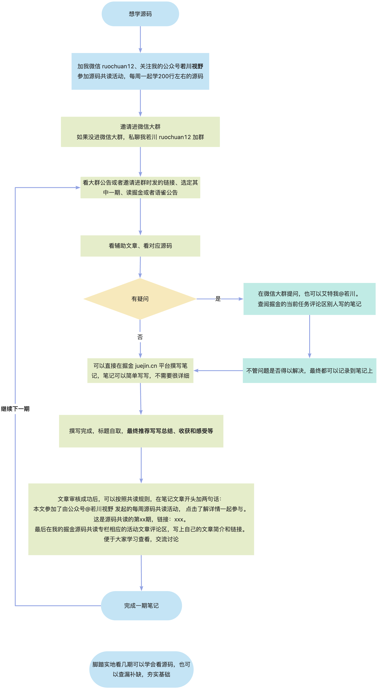

## 1. 源码共读前言

> 原先在[语雀中](https://www.yuque.com/ruochuan12/notice/p0)，[**语雀专栏有树形菜单，关注后也有通知，体验可能相对比较好，也相对方便查看**](https://www.yuque.com/ruochuan12/notice)，现在同步到掘金专栏[【若川视野 x 源码共读】](https://juejin.cn/column/7078688202092969991)，两边基本会保持同步。

**为了能帮助到更多对源码感兴趣、想学会看源码、提升自己写作和前端技术能力的同学。**
帮助读者夯实基础，查漏补缺，开阔眼界，拓宽视野，知其然知其所以然。

我倾力组织了每周一起学200行左右的源码共读活动。我写有[《学习源码整体架构系列》](https://juejin.cn/column/6960551178908205093)20余篇，**走过路过的小伙伴可以点击关注下这个目前是掘金关注数最多的专栏**。

**欢迎[点此扫码加我微信 ruochuan02](https://juejin.cn/pin/7217386885793595453) 加源码共读微信群交流讨论，参加每周大家一起学习200行左右的源码活动，共同进步。可以持续关注我[@若川](https://juejin.cn/user/1415826704971918)**。

* 大家没填问卷的，有空抽几分钟来填下源码共读活动问卷\~你们的反馈至关重要<https://wj.qq.com/s2/9304505/dafa/>

## 2. 常见问题

Q: **如何算参与活动？**

A: 流程图一览、简单说就是四步：

1. **按照顺序选择其中一期开始，看任务。**
2. **看辅助文章、看源码。**
3. **微信群交流讨论，写笔记，写总结、收获。**
4. **掘金任务说明文章评论区提交笔记。**
5. [**图示见第五条，点此跳转查看**](#heading-11)

Q: 我工作年限比较短，能参与活动吗？会比较吃力吗？

A: 可以。23届（目前大三）的小姐姐都写了7次笔记。一般推荐先读[第39期 | 如何发布一个 npm 库，自动化管理版本号、生成 changelog、tag 等](https://juejin.cn/post/7145871172293361678)，几乎人人都用得上，都不算源码，有问题可以交流讨论。

Q: **我目前不会vue、不会vue3、不会react、不会Node.js 可以参与吗？**

A: **可以。跟技术栈不是强相关，主要是原生JS和Node.js。Node.js 基本是每个前端必学，可以边学边查。有不懂的随时在群里提问。**

Q: 我现在比较忙，一时没时间参与，交笔记有时间限制吗？

A: 目前没有限制。

Q: 必须交笔记吗？

A: 目前不是必须，但我推荐看完了一期，记笔记。写上当时的收获、总结和感受。

Q: 活动收费吗？有惩罚吗？

A: 目前不收费。目前没有惩罚，后续可能要求**每人进群后半个月内至少提交第一次笔记**。

## 3. 如何提交笔记

[提交笔记方式](https://juejin.cn/post/7079706017579139102#heading-1)
简言之：看任务，看辅助文章、看源码，交流讨论，在掘金写笔记，写好后提交到每期任务的评论区。

为了给大家谋福利，另外给大家的文章带来更多阅读量，便于搜索，从2022年3月27日起，笔记可以直接发布在掘金，以《标题自取》标题不限，可以取个好标题，容易被掘金推荐。

**笔记文章开头加两句话**：

* **本文参加了由**[公众号@若川视野](https://lxchuan12.gitee.io) **发起的每周源码共读活动，** [点击了解详情一起参与。](https://juejin.cn/post/7079706017579139102)
* **这是源码共读的第xx期，链接：xxx。**

**笔记文章最后，建议写上总结、收获、感受等。**

* **开头第一句作用是**：方便每月统计评优，掘金赞助送小礼物。顺便帮忙宣传推广，让更多人参与进来，一起学习。

* **开头第二句作用是**：加上是多少期，当前任务说明的链接，方便读者知道这是什么活动。

**笔记写完后，到当前期活动的文章评论区留言自己的文章和笔记特点**。方便大家查阅学习交流讨论。

往期所有笔记存放在[语雀讨论区](https://yuque.com/ruochuan12/topics)，因不可抗力原因，【语雀讨论区】升级为私密的【任务】，原语雀讨论区应该访问不了了，所以大家拥抱掘金，在掘金写文章写笔记。

## 4. 从易到难推荐学习顺序

为了降低难度，促进大家学习。我们**从易到难**重新整理学习顺序。

**推荐大家按顺序循序渐进或者自己挑选感兴趣的学习，查漏补缺，夯实基础。** 提高阅读源码的能力，提升前端技术能力。**不知道怎么调试的看这两篇文章(基本覆盖绝大多数场景)**：[新手向：前端程序员必学基本技能——调试JS代码](https://juejin.cn/post/7030584939020042254)、[据说90%的人不知道测试用例(Vitest)可以调试开源项目(Vue3) 源码](https://juejin.cn/post/7212263304394981432)

### 4.1 我的其他源码

**如果不满足以下这些代码行数比较少的源码，可以选我之前写过感兴趣的源码文章看。这些代码行数相对多一些。**

1.[学习 jQuery 源码整体架构，打造属于自己的 js 类库](https://juejin.cn/post/6844903902077272071 "https://juejin.cn/post/6844903902077272071")\
2.[学习 underscore 源码整体架构，打造属于自己的函数式编程类库](https://juejin.cn/post/6844903908972691469 "https://juejin.cn/post/6844903908972691469")\
3.[学习 lodash 源码整体架构，打造属于自己的函数式编程类库](https://juejin.cn/post/6844903939062628360 "https://juejin.cn/post/6844903939062628360")\
4.[学习 sentry 源码整体架构，打造属于自己的前端异常监控SDK](https://juejin.cn/post/6844903984457580551 "https://juejin.cn/post/6844903984457580551")\
5.[学习 vuex 源码整体架构，打造属于自己的状态管理库](https://juejin.cn/post/6844904001192853511 "https://juejin.cn/post/6844904001192853511")\
6.[学习 axios 源码整体架构，打造属于自己的请求库](https://juejin.cn/post/6844904019987529735 "https://juejin.cn/post/6844904019987529735")\
7.[学习 koa 源码的整体架构，浅析koa洋葱模型原理和co原理](https://juejin.cn/post/6844904191228411911 "https://juejin.cn/post/6844904191228411911")\
8.[学习 redux 源码整体架构，深入理解 redux 及其中间件原理](https://juejin.cn/post/6844904191228411911 "https://juejin.cn/post/6844904191228411911")

### 4.2 原生JS

1. [第39期 | 如何发布一个 npm 库，自动化管理版本号、生成 changelog、tag 等](https://juejin.cn/post/7145871172293361678)
2. [第36期 | omit.js 剔除对象中的属性](https://juejin.cn/post/7118782469360320542)  **应该是历史上最简单的一期**
3. [第33期 | arrify 转数组](https://juejin.cn/post/7100218384918249503)  **应该是历史上第二简单的一期**
4. 第24期 【vue2 工具函数】[初学者也能看懂的 Vue2 源码中那些实用的基础工具函数](https://juejin.cn/post/7079765637437849614)
5. 第23期【vue-this】[为什么 Vue2 this 能够直接获取到 data 和 methods，源码揭秘](https://juejin.cn/post/7082984422516981796)
6. 第19期 【axios/utils】[axios 源码中10多个工具函数](https://juejin.cn/post/7083113675879350309)
7. 第2期【vue3 工具函数】: [初学者也能看懂的 Vue3 源码中那些实用的基础工具函数](https://juejin.cn/post/7084991376630218759)
8. 第32期【队列链表】[队列链表 67行](https://juejin.cn/post/7090769807804956679)

### 4.3 React

1. 第43期【react-use】[自从学了 react-use 源码，我写自定义 React Hooks 越来越顺了\~](https://juejin.cn/post/7218915344130621495)

### 4.4 面试常考

1. 第21期【await-to-js】[await-to-js](https://juejin.cn/post/7083109687591338021)
2. 第14期【promisify】: [从22行有趣的源码库中，我学到了 callback promisify 化的 Node.js 源码实现](https://juejin.cn/post/7083151186137251876)
3. 第25期【underscore-debounce】[跟着 underscore 学防抖](https://juejin.cn/post/7087440559408676895)
4. 第8期【mitt、tiny-emitter】: [发布订阅](https://juejin.cn/post/7084984303943155719)
5. 第31期【p-limit】[第31期 | p-limit 限制并发数](https://juejin.cn/post/7087592414814142472)
6. 第5期【koa-compose】：[50行代码串行Promise，koa洋葱模型原来是这么实现？](https://juejin.cn/post/7084987872201146375)

### 4.5 脚手架 && 组件库

1. 第38期 【vant-weapp stepper 组件】 [第38期 | 经常用 vant-weapp 开发小程序，却不知道如何开发一个组件？学！](https://juejin.cn/post/7134726338862120967)
2. 第41期 【vant dark-theme】[vant 4 正式发布了，支持暗黑主题，那么是如何实现的呢](https://juejin.cn/post/7186312314872660029)
3. 第42期 【vant loading】[跟着 vant4 源码学习如何用 vue3+ts 开发一个 loading 组件，仅88行代码](https://juejin.cn/post/7206723874506850360)
4. 第37期【create-vite】[第37期 | vite 3.0 都发布了，这次来手撕 create-vite 源码](https://juejin.cn/post/7129087028947320862)
5. 第3期【vue-next-release】: [Vue 3.2 发布了，那尤雨溪是怎么发布 Vue.js 的？](https://juejin.cn/post/7084989934699806751)
6. 第15期【element-new】: [每次新增页面复制粘贴？100多行源码的 element-ui 新增组件功能告诉你减少重复工作](https://juejin.cn/post/7083150257365712927)
7. 第9期【create-vue】: [Vue 团队公开快如闪电的全新脚手架工具 create-vue，未来将替代 Vue-CLI，才300余行代码，学它！](https://juejin.cn/post/7084979330496856100)
8. 第34期 【tdesign-vue-next】[第34期 | tdesign-vue-next 初始化组件](https://juejin.cn/post/7109106285370408967)
9. 第35期【vite-pretty-lint】[第35期 | 为 vite 项目自动添加 eslint 和 prettier](https://juejin.cn/post/7113563466211786783 "【若川视野 x 源码共读】第35期 | 为 vite 项目自动添加 eslint 和 prettier")
10. 第30期 【@tarojs/plugin-mini-ci 小程序上传代码 ci】 [@tarojs/plugin-mini-ci 小程序上传代码 ci](https://juejin.cn/post/7082662027143053342)
11. 第28期 | [vue react 小程序 message 组件](https://juejin.cn/post/7079713797035786253)

### 4.6 工具库

1. 第26期 [classnames](https://juejin.cn/post/7087439740416294942)
2. 第17期 【js-cookie】[js-cookie](https://juejin.cn/post/7083148613324374052)

### 4.7 Nodejs

1. 第16期【only-allow】: [从 vue3 和 vite 源码中，我学到了一行代码统一规范团队包管理器的神器](https://juejin.cn/post/7083149201869111304)
2. 第22期【dotenv】[面试官：项目中常用的 .env 文件原理是什么？如何实现？](https://juejin.cn/post/7083109340030337032)
3. 第20期【install-pkg】:[Vue团队核心成员开发的39行小工具 install-pkg 安装包，值得一学！](https://juejin.cn/post/7083111940662231076)
4. 第13期【open】: [每次启动项目的服务时，电脑竟然乖乖的帮我打开了浏览器，100行源码揭秘！](https://juejin.cn/post/7083151534124433416)
5. 第1期【vue-devtools】: [据说 99% 的人不知道 vue-devtools 还能直接打开对应组件文件？本文原理揭秘](https://juejin.cn/post/7084992464221634591)
6. 第18期【delay】[面试官：请手写一个带取消功能的延迟函数，axios 取消功能的原理是什么](https://juejin.cn/post/7083114215031963655)
7. 第12期【@antfu/ni】: [尤雨溪推荐神器 ni ，能替代 npm/yarn/pnpm ？简单好用！源码揭秘！](https://juejin.cn/post/7083151940367941639)
8. 44期【open in github button vscode 插件】[神器啊，从未想过 VSCode 还能这样直接打开仓库URL，原理揭秘](https://juejin.cn/post/7231539903649349691)
9. 第27期 【read-pkg】[从 vue-cli 源码中，我发现27行读取 json 文件有趣的 npm 包](https://juejin.cn/post/7087438931955810335)
10. 第7期【validate-npm-package-name】: [validate-npm-package-name](https://juejin.cn/post/7084985308839673886)
11. 第10期【configstore】: [configstore](https://juejin.cn/post/7084978617448398855)
12. 第29期 【quick-lru】[quick-lru](https://juejin.cn/post/7079754899403046942)
13. 第4期【co】:[co](https://juejin.cn/post/7084988705949253639)
14. 第6期【update-notifier】: [update-notifier](https://juejin.cn/post/7084985851347730446)

### 4.8 vite

1. 第11期【vue-dev-server】: [尤雨溪几年前开发的“玩具 vite”，才100多行代码，却十分有助于理解 vite 原理](https://juejin.cn/post/7083152323681189902)
2. 第40期【vite .env】[vite 是如何解析用户配置的 .env 的](https://juejin.cn/post/7174045668187570206)

## 5. 流程图一览

简单说就是四步：

1. **按照顺序选择其中一期开始，看任务。**
2. **看辅助文章、看源码。**
3. **微信群交流讨论，写笔记，写总结、收获。**
4. **掘金任务说明文章评论区提交笔记。**

***

## 6. 读者评价

简单选择了三个笔记中的感想。

### 6.1 评价一

川哥组织的这个活动，给我最大的影响就是我对待源码的态度发生了转变。以前源码给我的感觉是“**可远观而不可亵玩焉**”，但是其实只要你认真读过一期，源码就会变成**良师益友**。你可以坐下来倾听他的思想，并从中受益良多，甚至可以和他交流，提出自己的想法，直至参与共建让源码更好。

### 6.2 评价二

川哥举办的源码调试给我带来了什么？

1. 开始尝试写笔记\
    a. 源码我都懂，让我说出来或者写出来，蒙了。
2. 更注重细节\
    a. 以前看源码就囫囵吞枣的过一遍
3. 更注重应用场景\
    a. 以前：原来这个方法是这样实现的啊\
    b. 现在：看下测试用例，都是怎么使用的，某个判断是为了解决什么问题\
    总之\
    是一个老手，那么现在川哥给了你一个交流讨论的机会，去温故而知新。\
    是一个新手，千里之行始于足下，有群里川哥和大佬们的帮助，勇敢迈出第一步。\
    写笔记真是一个令人头疼的东西。

### 6.3 评价三

我最近看了几篇，川哥选的库都很精妙啊，老手可以梳理体系，新手可以了解现代工程化，进阶架构师必经之路啊。\
**特别是这几篇 create-vue、koa-compose、co、vue-dev-server，我都是熬夜看的，太起劲了**。

***

**本文持续更新**。
