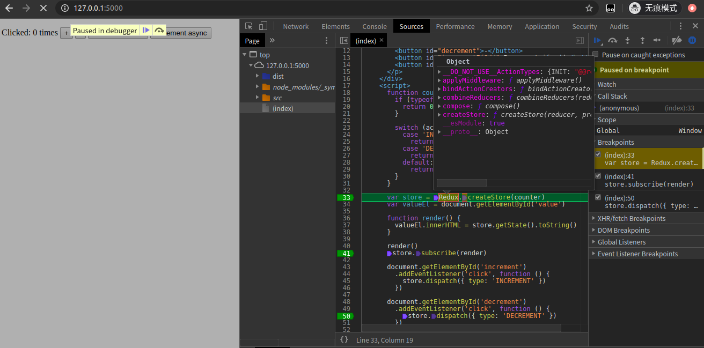
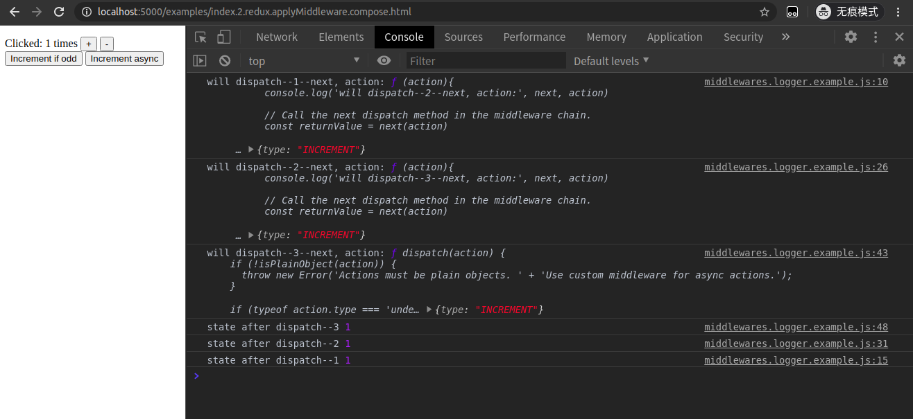

# 学习 redux 源码整体架构，深入学习 redux 和其中间件原理

## 1. 前言

>你好，我是[若川](http://lxchuan12.cn/)。这是`学习源码整体架构系列`第八篇。整体架构这词语好像有点大，姑且就算是源码整体结构吧，主要就是学习是代码整体结构，不深究其他不是主线的具体函数的实现。本篇文章学习的是实际仓库的代码。

>要是有人说到怎么读源码，正在读文章的你能推荐我的源码系列文章，那真是太好了。

`学习源码整体架构系列`文章如下：
>1.[学习 jQuery 源码整体架构，打造属于自己的 js 类库](https://juejin.im/post/5d39d2cbf265da1bc23fbd42)<br>
>2.[学习 underscore 源码整体架构，打造属于自己的函数式编程类库](https://juejin.im/post/5d4bf94de51d453bb13b65dc)<br>
>3.[学习 lodash 源码整体架构，打造属于自己的函数式编程类库](https://juejin.im/post/5d767e1d6fb9a06b032025ea)<br>
>4.[学习 sentry 源码整体架构，打造属于自己的前端异常监控SDK](https://juejin.im/post/5dba5a39e51d452a2378348a)<br>
>5.[学习 vuex 源码整体架构，打造属于自己的状态管理库](https://juejin.im/post/5dd4e61a6fb9a05a5c010af0)<br>
>6.[学习 axios 源码整体架构，打造属于自己的请求库](https://juejin.im/post/5df349b5518825123751ba66)<br>
>7.[学习 koa 源码的整体架构，浅析koa洋葱模型原理和co原理](https://juejin.im/post/5e69925cf265da571e262fe6)<br>

感兴趣的读者可以点击阅读。<br>
其他源码计划中的有：[`express`](https://github.com/lxchuan12/express-analysis)、[`vue-rotuer`](https://github.com/lxchuan12/vue-router-analysis)、[`redux`](https://github.com/lxchuan12/redux-analysis)、  [`react-redux`](https://github.com/lxchuan12/react-redux-analysis) 等源码，不知何时能写完（哭泣），欢迎持续关注我（若川）。

源码类文章，一般阅读量不高。已经有能力看懂的，自己就看了。不想看，不敢看的就不会去看源码。<br>
所以我的文章，尽量写得让想看源码又不知道怎么看的读者能看懂。

阅读本文你将学到：

>1. `git subtree` 管理子仓库
>2. 如何学习 `redux` 源码
>3. `redux` 中间件原理
>4. `redux` 各个`API`的实现
>5. `vuex` 和 `redux`  的对比
>6. 等等

### 1.1 本文阅读最佳方式

把我的`redux`源码仓库 `git clone https://github.com/lxchuan12/redux-analysis.git`克隆下来，顺便`star`一下[我的redux源码学习仓库](https://github.com/lxchuan12/redux-analysis)^_^。**跟着文章节奏调试和示例代码调试，用`chrome`动手调试印象更加深刻**。文章长段代码不用细看，可以调试时再细看。看这类源码文章百遍，可能不如自己多调试几遍。也欢迎加我微信交流`ruochuan12`。

## 2. git subtree 管理子仓库

写了很多源码文章，`vuex`、`axios`、`koa`等都是使用新的仓库克隆一份源码在自己仓库中。
虽然电脑可以拉取最新代码，看到原作者的git信息。但上传到`github`后。读者却看不到原仓库作者的`git`信息了。于是我找到了`git submodules` 方案，但并不是很适合。再后来发现了`git subtree`。

简单说下 `npm package`和`git subtree`的区别。
`npm package`是单向的。`git subtree`则是双向的。

具体可以查看这篇文章[@德来（原有赞大佬）：用 Git Subtree 在多个 Git 项目间双向同步子项目，附简明使用手册](https://segmentfault.com/a/1190000003969060)

学会了`git subtree`后，我新建了`redux-analysis`项目后，把`redux`源码`4.x`（截止至2020年06月13日，`4.x`分支最新版本是`4.0.5`，`master`分支是`ts`，文章中暂不想让一些不熟悉`ts`的读者看不懂）分支克隆到了我的项目里的一个子项目，得以保留`git`信息。

对应命令则是：

```bash
git subtree add --prefix=redux https://github.com/reduxjs/redux.git 4.x
```

## 3. 调试 redux 源码准备工作

之前，我在知乎回答了一个问题[若川：一年内的前端看不懂前端框架源码怎么办？](https://www.zhihu.com/question/350289336/answer/910970733)
推荐了一些资料，阅读量还不错，大家有兴趣可以看看。主要有四点：<br>
>1.借助调试<br>
>2.搜索查阅相关高赞文章<br>
>3.把不懂的地方记录下来，查阅相关文档<br>
>4.总结<br>

看源码调试很重要，所以我的每篇源码文章都详细描述（也许有人看来是比较啰嗦...）如何调试源码。

>**断点调试要领：**<br>
**赋值语句可以一步按`F10`跳过，看返回值即可，后续详细再看。**<br>
**函数执行需要断点按`F11`跟着看，也可以结合注释和上下文倒推这个函数做了什么。**<br>
**有些不需要细看的，直接按`F8`走向下一个断点**<br>
**刷新重新调试按`F5`**<br>

调试源码前，先简单看看 `redux` 的工作流程，有个大概印象。


### 3.1 rollup 生成 sourcemap 便于调试

修改`rollup.config.js`文件，`output`输出的配置生成`sourcemap`。

```js
// redux/rollup.config.js 有些省略
const sourcemap = {
  sourcemap: true,
};

output: {
    // ...
    ...sourcemap,
}
```

安装依赖

```bash
git clone http://github.com/lxchuan12/redux-analysis.git
cd redux-analysi/redux
npm i
npm run build
# 编译结束后会生成 sourcemap .map格式的文件到 dist、es、lib 目录下。
```

仔细看看`redux/examples`目录和`redux/README`。

这时我在根路径下，新建文件夹`examples`，把原生`js`写的计数器`redux/examples/counter-vanilla/index.html`，复制到`examples/index.html`。同时把打包后的包含`sourcemap`的`redux/dist`目录，复制到`examples/dist`目录。

修改`index.html`的`script`的`redux.js`文件为`dist中的路径`。

>为了便于区分和调试后续`html`文件，我把`index.html`重命名为`index.1.redux.getState.dispatch.html`。

```bash
# redux-analysis 根目录
# 安装启动服务的npm包
npm i -g http-server
cd examples
hs -p 5000
```

就可以开心的调试啦。可以直接克隆我的项目`git clone http://github.com/lxchuan12/redux-analysis.git`。本地调试，动手实践，容易消化吸收。

## 4. 通过调试计数器例子的学习 redux 源码

接着我们来看`examples/index.1.redux.getState.dispatch.html`文件。先看`html`部分。只是写了几个 `button`，比较简单。

```html
<div>
    <p>
    Clicked: <span id="value">0</span> times
    <button id="increment">+</button>
    <button id="decrement">-</button>
    <button id="incrementIfOdd">Increment if odd</button>
    <button id="incrementAsync">Increment async</button>
    </p>
</div>
```

`js部分`，也比较简单。声明了一个`counter`函数，传递给`Redux.createStore(counter)`，得到结果`store`，而`store`是个对象。`render`方法渲染数字到页面。用`store.subscribe(render)`订阅的`render`方法。还有`store.dispatch({type: 'INCREMENT' })`方法，调用`store.dispatch`时会触发`render`方法。这样就实现了一个计数器。

```js
function counter(state, action) {
    if (typeof state === 'undefined') {
        return 0
    }

    switch (action.type) {
        case 'INCREMENT':
        return state + 1
        case 'DECREMENT':
        return state - 1
        default:
        return state
    }
}

var store = Redux.createStore(counter)
var valueEl = document.getElementById('value')

function render() {
    valueEl.innerHTML = store.getState().toString()
}
render()
store.subscribe(render)

document.getElementById('increment')
.addEventListener('click', function () {
    store.dispatch({ type: 'INCREMENT' })
})

// 省略部分暂时无效代码...
```

思考：看了这段代码，你会在哪打断点来调试呢。

```js
// 四处可以断点来看
// 1.
var store = Redux.createStore(counter)
// 2.
function render() {
valueEl.innerHTML = store.getState().toString()
}
render()
// 3.
store.subscribe(render)
// 4.
store.dispatch({ type: 'INCREMENT' })
```



图中的右边`Scope`，有时需要关注下，会显示闭包、全局环境、当前环境等变量，还可以显示函数等具体代码位置，能帮助自己理解代码。

断点调试，按`F5`刷新页面后，按`F8`，把鼠标放在`Redux`和`store`上。

可以看到`Redux`上有好几个方法。分别是：
- __DO_NOT_USE__ActionTypes: {INIT: "@@redux/INITu.v.d.u.6.r", REPLACE: "@@redux/REPLACEg.u.u.7.c", PROBE_UNKNOWN_ACTION: ƒ}
- applyMiddleware: ƒ applyMiddleware() 函数是一个增强器，组合多个中间件，最终增强`store.dispatch`函数，`dispatch`时，可以串联执行所有中间件。
- bindActionCreators: ƒ bindActionCreators(actionCreators, dispatch) 生成actions，主要用于其他库，比如`react-redux`。
- combineReducers: ƒ combineReducers(reducers) 组合多个`reducers`，返回一个总的`reducer`函数。
- compose: ƒ compose() 组合多个函数，从右到左，比如：compose(f, g, h) 最终得到这个结果 (...args) => f(g(h(...args))).
- createStore: ƒ createStore(reducer, preloadedState, enhancer) 生成 `store` 对象

再看`store`也有几个方法。分别是：

- dispatch: ƒ dispatch(action)  派发动作，也就是把`subscribe`收集的函数，依次遍历执行
- subscribe: ƒ subscribe(listener) 订阅收集函数存在数组中，等待触发`dispatch`依次执行。返回一个取消订阅的函数，可以取消订阅监听。
- getState: ƒ getState() 获取存在`createStore`函数内部闭包的对象。
- replaceReducer: ƒ replaceReducer(nextReducer) 主要用于`redux`开发者工具，对比当前和上一次操作的异同。有点类似时间穿梭功能。
- Symbol(observable): ƒ observable()

也就是[官方文档redux.org.js](https://redux.org.js)上的 `API`。

暂时不去深究每一个`API`的实现。重新按`F5`刷新页面，断点到`var store = Redux.createStore(counter)`。一直按`F11`，先走一遍主流程。

### 4.1 Redux.createSotre

`createStore` 函数结构是这样的，是不是看起来很简单，最终返回对象`store`，包含`dispatch`、`subscribe`、`getState`、`replaceReducer`等方法。

```js
// 省略了若干代码
export default function createStore(reducer, preloadedState, enhancer) {
    // 省略参数校验和替换
    // 当前的 reducer 函数
    let currentReducer = reducer
    // 当前state
    let currentState = preloadedState
    // 当前的监听数组函数
    let currentListeners = []
    // 下一个监听数组函数
    let nextListeners = currentListeners
    // 是否正在dispatch中
    let isDispatching = false
    function ensureCanMutateNextListeners() {
        if (nextListeners === currentListeners) {
        nextListeners = currentListeners.slice()
        }
    }
    function getState() {
        return currentState
    }
    function subscribe(listener) {}
    function dispatch(action) {}
    function replaceReducer(nextReducer) {}
    function observable() {}
    // ActionTypes.INIT @@redux/INITu.v.d.u.6.r
    dispatch({ type: ActionTypes.INIT })
    return {
        dispatch,
        subscribe,
        getState,
        replaceReducer,
        [$$observable]: observable
    }
}
```

### 4.2 store.dispatch(action)

```js
function dispatch(action) {
    // 判断action是否是对象，不是则报错
    if (!isPlainObject(action)) {
      throw new Error(
        'Actions must be plain objects. ' +
          'Use custom middleware for async actions.'
      )
    }
    // 判断action.type 是否存在，没有则报错
    if (typeof action.type === 'undefined') {
      throw new Error(
        'Actions may not have an undefined "type" property. ' +
          'Have you misspelled a constant?'
      )
    }
    // 不是则报错
    if (isDispatching) {
      throw new Error('Reducers may not dispatch actions.')
    }

    try {
      isDispatching = true
      currentState = currentReducer(currentState, action)
    } finally {
        // 调用完后置为 false
      isDispatching = false
    }
    //  把 收集的函数拿出来依次调用
    const listeners = (currentListeners = nextListeners)
    for (let i = 0; i < listeners.length; i++) {
      const listener = listeners[i]
      listener()
    }
    // 最终返回 action
    return action
  }
```

```js
var store = Redux.createStore(counter)
```

上文调试完了这句。

继续按`F11`调试。

```js
function render() {
    valueEl.innerHTML = store.getState().toString()
}
render()
```

### 4.3 store.getState()

`getState`函数实现比较简单。

```js
function getState() {
    // 判断正在dispatch中，则报错
    if (isDispatching) {
        throw new Error(
        'You may not call store.getState() while the reducer is executing. ' +
            'The reducer has already received the state as an argument. ' +
            'Pass it down from the top reducer instead of reading it from the store.'
        )
    }
    // 返回当前的state
    return currentState
}
```

### 4.4 store.subscribe(listener)

订阅监听函数，存放在数组中，`store.dispatch(action)`时遍历执行。

```js
function subscribe(listener) {
    // 订阅参数校验不是函数报错
    if (typeof listener !== 'function') {
      throw new Error('Expected the listener to be a function.')
    }
    // 正在dispatch中，报错
    if (isDispatching) {
      throw new Error(
        'You may not call store.subscribe() while the reducer is executing. ' +
          'If you would like to be notified after the store has been updated, subscribe from a ' +
          'component and invoke store.getState() in the callback to access the latest state. ' +
          'See https://redux.js.org/api-reference/store#subscribelistener for more details.'
      )
    }
    // 订阅为 true
    let isSubscribed = true

    ensureCanMutateNextListeners()
    nextListeners.push(listener)

    // 返回一个取消订阅的函数
    return function unsubscribe() {
      if (!isSubscribed) {
        return
      }
      // 正在dispatch中，则报错
      if (isDispatching) {
        throw new Error(
          'You may not unsubscribe from a store listener while the reducer is executing. ' +
            'See https://redux.js.org/api-reference/store#subscribelistener for more details.'
        )
      }
      // 订阅为 false
      isSubscribed = false

      ensureCanMutateNextListeners()
    //   找到当前监听函数
      const index = nextListeners.indexOf(listener)
    //   在数组中删除
      nextListeners.splice(index, 1)
      currentListeners = null
    }
  }
```

到这里，我们就调试学习完了`Redux.createSotre`、`store.dispatch`、`store.getState`、`store.subscribe`的源码。

接下来，我们写个中间件例子，来调试中间件相关源码。

## 5. Redux 中间件相关源码

中间件是重点，面试官也经常问这类问题。

### 5.1 Redux.applyMiddleware(...middlewares)

#### 5.1.1 准备 logger 例子调试

为了调试`Redux.applyMiddleware(...middlewares)`，我在`examples/js/middlewares.logger.example.js`写一个简单的`logger`例子。分别有三个`logger1`，`logger2`，`logger3`函数。由于都是类似，所以我在这里只展示`logger1`函数。

```js
// examples/js/middlewares.logger.example.js
function logger1({ getState }) {
  return next => action => {
      console.log('will dispatch--1--next, action:', next, action)

      // Call the next dispatch method in the middleware chain.
      const returnValue = next(action)

      console.log('state after dispatch--1', getState())

      // This will likely be the action itself, unless
      // a middleware further in chain changed it.
      return returnValue
  }
}
// 省略 logger2、logger3
```

`logger`中间件函数做的事情也比较简单，返回两层函数，`next`就是下一个中间件函数，调用返回结果。为了让读者能看懂，我把`logger1`用箭头函数、`logger2`则用普通函数。

`写好例子后`，我们接着来看怎么调试`Redux.applyMiddleware(...middlewares))`源码。

```bash
cd redux-analysis && hs -p 5000
# 上文说过npm i -g http-server
```

打开`http://localhost:5000/examples/index.2.redux.applyMiddleware.compose.html`，按`F12`打开控制台，

先点击加号操作+1，把结果展示出来。

从图中可以看出，`next`则是下一个函数。先1-2-3，再3-2-1这样的顺序。

这种也就是我们常说的中间件，面向切面编程（AOP）。


接下来调试，在以下语句打上断点和一些你觉得重要的地方打上断点。

```js
// examples/index.2.redux.applyMiddleware.compose.html
var store = Redux.createStore(counter, Redux.applyMiddleware(logger1, logger2,  logger3))
```

#### 5.1.2 Redux.applyMiddleware(...middlewares) 源码

```js
// redux/src/applyMiddleware.js
/**
 * ...
 * @param {...Function} middlewares The middleware chain to be applied.
 * @returns {Function} A store enhancer applying the middleware.
 */
export default function applyMiddleware(...middlewares) {
  return createStore => (...args) => {
    const store = createStore(...args)
    let dispatch = () => {
      throw new Error(
        'Dispatching while constructing your middleware is not allowed. ' +
          'Other middleware would not be applied to this dispatch.'
      )
    }

    const middlewareAPI = {
      getState: store.getState,
      dispatch: (...args) => dispatch(...args)
    }
    const chain = middlewares.map(middleware => middleware(middlewareAPI))
    dispatch = compose(...chain)(store.dispatch)

    return {
      ...store,
      dispatch
    }
  }
}
```

```js
// redux/src/createStore.js
export default function createStore(reducer, preloadedState, enhancer) {
  // 省略参数校验
  // 如果第二个参数`preloadedState`是函数，并且第三个参数`enhancer`是undefined，把它们互换一下。
  if (typeof preloadedState === 'function' && typeof enhancer === 'undefined') {
    enhancer = preloadedState
    preloadedState = undefined
  }

  if (typeof enhancer !== 'undefined') {
    if (typeof enhancer !== 'function') {
      throw new Error('Expected the enhancer to be a function.')
    }
    // enhancer 也就是`Redux.applyMiddleware`返回的函数
    // createStore 的 args 则是 `reducer, preloadedState`
    /**
     * createStore => (...args) => {
            const store = createStore(...args)
            return {
              ...store,
               dispatch,
            }
        }
     ** /
    // 最终返回增强的store对象。
    return enhancer(createStore)(reducer, preloadedState)
  }
  // 省略后续代码
}
```

把接收的中间件函数`logger1`, `logger2`, `logger3`放入到 了`middlewares`数组中。`Redux.applyMiddleware`最后返回两层函数。
把中间件函数都混入了参数`getState`和`dispatch`。

```js
// examples/index.2.redux.applyMiddleware.compose.html
var store = Redux.createStore(counter, Redux.applyMiddleware(logger1, logger2,  logger3))
```

最后这句其实是返回一个增强了`dispatch`的`store`对象。

而增强的`dispatch`函数，则是用`Redux.compose(...functions)`进行串联起来执行的。

### 5.2 Redux.compose(...functions)

```js
export default function compose(...funcs) {
  if (funcs.length === 0) {
    return arg => arg
  }

  if (funcs.length === 1) {
    return funcs[0]
  }

  return funcs.reduce((a, b) => (...args) => a(b(...args)))
}
```

```js
// applyMiddleware.js
dispatch = compose(...chain)(store.dispatch)
// compose
funcs.reduce((a, b) => (...args) => a(b(...args)))
```

这两句可能不是那么好理解，可以断点多调试几次。我把箭头函数转换成普通函数。

```js
funcs.reduce(function(a, b){
  return function(...args){
    return a(b(...args));
  };
});
```

其实`redux`源码中注释很清晰了，这个`compose`函数上方有一堆注释，其中有一句：组合多个函数，从右到左，比如：`compose(f, g, h)` 最终得到这个结果 `(...args) => f(g(h(...args)))`.

#### 5.2.1 compose 函数演化

看`Redux.compose(...functions)`函数源码后，还是不明白，不要急不要慌，吃完鸡蛋还有汤。仔细来看如何演化而来，先来简单看下如下需求。

传入一个数值，计算数值乘以10再加上10，再减去2。

实现起来很简单。

```js
const calc = (num) => num * 10 + 10 - 2;
calc(10); // 108
```

但这样写有个问题，不好扩展，比如我想乘以`10`时就打印出结果。
为了便于扩展，我们分开写成三个函数。

```js
const multiply = (x) => {
   const result = x * 10;
   console.log(result);
   return result;
};
const add = (y) => y + 10;
const minus = (z) => z - 2;

// 计算结果
console.log(minus(add(multiply(10))));
// 100
// 108
// 这样我们就把三个函数计算结果出来了。
```

再来实现一个相对通用的函数，计算这三个函数的结果。

```js
const compose = (f, g, h) => {
  return function(x){
    return f(g(h(x)));
  }
}
const calc = compose(minus, add, multiply);
console.log(calc(10));
// 100
// 108
```

这样还是有问题，只支持三个函数。我想支持多个函数。
我们了解到数组的`reduce`方法就能实现这样的功能。
前一个函数

```js
// 我们常用reduce来计算数值数组的总和
[1,2,3,4,5].reduce((pre, item, index, arr) => {
  console.log('(pre, item, index, arr)', pre, item, index, arr);
  // (pre, item, index, arr) 1 2 1 (5) [1, 2, 3, 4, 5]
  // (pre, item, index, arr) 3 3 2 (5) [1, 2, 3, 4, 5]
  // (pre, item, index, arr) 6 4 3 (5) [1, 2, 3, 4, 5]
  // (pre, item, index, arr) 10 5 4 (5) [1, 2, 3, 4, 5]
  return pre + item;
});
// 15
```

`pre` 是上一次返回值，在这里是数值`1,3,6,10`。在下一个例子中则是匿名函数。

```js
function(x){
  return a(b(x));
}
```

`item`是`2,3,4,5`，在下一个例子中是`minus、add、multiply`。

```js
const compose = (...funcs) => {
  return funcs.reduce((a, b) => {
    return function(x){
      return a(b(x));
    }
  })
}
const calc = compose(minus, add, multiply);
console.log(calc(10));
// 100
// 108
```

而`Redux.compose(...functions)`其实就是这样，只不过中间件是返回双层函数罢了。

所以返回的是`next函数`，他们串起来执行了，形成了中间件的洋葱模型。
人们都说一图胜千言。我画了一个相对简单的`redux`中间件原理图。


如果还不是很明白，建议按照我给出的例子，多调试。

```bash
cd redux-analysis && hs -p 5000
# 上文说过npm i -g http-server
```

打开`http://localhost:5000/examples/index.3.html`，按`F12`打开控制台调试。

#### 5.2.2 前端框架的 compose 函数的实现

**lodash**源码中 `compose`函数的实现，也是类似于数组的`reduce`，只不过是内部实现的`arrayReduce`

[引用自我的文章：学习lodash源码整体架构](https://juejin.im/post/5d767e1d6fb9a06b032025ea#heading-20)

```js
// lodash源码
function baseWrapperValue(value, actions) {
	var result = value;
	// 如果是lazyWrapper的实例，则调用LazyWrapper.prototype.value 方法，也就是 lazyValue 方法
	if (result instanceof LazyWrapper) {
		result = result.value();
	}
	// 类似 [].reduce()，把上一个函数返回结果作为参数传递给下一个函数
	return arrayReduce(actions, function(result, action) {
		return action.func.apply(action.thisArg, arrayPush([result], action.args));
	}, result);
}
```

**koa-compose**源码也有`compose`函数的实现。实现是循环加`promise`。
由于代码比较长我就省略了，具体看链接[若川：学习 koa 源码的整体架构，浅析koa洋葱模型原理和co原理](https://juejin.im/post/5e69925cf265da571e262fe6#heading-7)小节 `koa-compose 源码`（洋葱模型实现）

## 6. Redux.combineReducers(reducers)

打开`http://localhost:5000/examples/index.4.html`，按`F12`打开控制台，按照给出的例子，调试接下来的`Redux.combineReducers(reducers)`和`Redux.bindActionCreators(actionCreators, dispatch)`具体实现。由于文章已经很长了，这两个函数就不那么详细解释了。

`combineReducers`函数简单来说就是合并多个`reducer`为一个函数`combination`。

```js
export default function combineReducers(reducers) {
  const reducerKeys = Object.keys(reducers)
  const finalReducers = {}
  for (let i = 0; i < reducerKeys.length; i++) {
    const key = reducerKeys[i]

    // 省略一些开发环境判断的代码...

    if (typeof reducers[key] === 'function') {
      finalReducers[key] = reducers[key]
    }
  }

  // 经过一些处理后得到最后的finalReducerKeys
  const finalReducerKeys = Object.keys(finalReducers)

  // 省略一些开发环境判断的代码...

  return function combination(state = {}, action) {
    // ... 省略开发环境的一些判断

   // 用 hasChanged变量 记录前后 state 是否已经修改
    let hasChanged = false
    // 声明对象来存储下一次的state
    const nextState = {}
    //遍历 finalReducerKeys
    for (let i = 0; i < finalReducerKeys.length; i++) {
      const key = finalReducerKeys[i]
      const reducer = finalReducers[key]
      const previousStateForKey = state[key]
      // 执行 reducer
      const nextStateForKey = reducer(previousStateForKey, action)

      // 省略容错代码 ...

      nextState[key] = nextStateForKey
      // 两次 key 对比 不相等则发生改变
      hasChanged = hasChanged || nextStateForKey !== previousStateForKey
    }
    // 最后的 keys 数组对比 不相等则发生改变
    hasChanged =
      hasChanged || finalReducerKeys.length !== Object.keys(state).length
    return hasChanged ? nextState : state
  }
}
```

## 7. Redux.bindActionCreators(actionCreators, dispatch)

如果第一个参数是一个函数，那就直接返回一个函数。如果是一个对象，则遍历赋值，最终生成`boundActionCreators`对象。

```js
function bindActionCreator(actionCreator, dispatch) {
  return function() {
    return dispatch(actionCreator.apply(this, arguments))
  }
}

export default function bindActionCreators(actionCreators, dispatch) {
  if (typeof actionCreators === 'function') {
    return bindActionCreator(actionCreators, dispatch)
  }

  // ... 省略一些容错判断

  const boundActionCreators = {}
  for (const key in actionCreators) {
    const actionCreator = actionCreators[key]
    if (typeof actionCreator === 'function') {
      boundActionCreators[key] = bindActionCreator(actionCreator, dispatch)
    }
  }
  return boundActionCreators
}
```

`redux`所提供的的`API` 除了`store.replaceReducer(nextReducer)`没分析，其他都分析了。

## 8. vuex 和 redux 简单对比

### 8.1 源码实现形式

从源码实现上来看，`vuex`源码主要使用了构造函数，而`redux`则是多用函数式编程、闭包。

### 8.2 耦合度

`vuex` 与 `vue` 强耦合，脱离了`vue`则无法使用。而`redux`跟`react`没有关系，所以它可以使用于小程序或者`jQuery`等。如果需要和`react`使用，还需要结合`react-redux`库。

### 8.3 扩展

```js
// logger 插件，具体实现省略
function logger (store) {
  console.log('store', store);
}
// 作为数组传入
new Vuex.Store({
  state,
  getters,
  actions,
  mutations,
  plugins: process.env.NODE_ENV !== 'production'
    ? [logger]
    : []
})
// vuex 源码 插件执行部分
class Store{
  constructor(){
    // 把vuex的实例对象 store整个对象传递给插件使用
    plugins.forEach(plugin => plugin(this))
  }
}
```

`vuex`实现扩展则是使用插件形式，而`redux`是中间件的形式。`redux`的中间件则是AOP（面向切面编程），`redux`中`Redux.applyMiddleware()`其实也是一个增强函数，所以也可以用户来实现增强器，所以[`redux`生态](https://www.redux.org.cn/docs/introduction/Ecosystem.html)比较繁荣。

### 8.4 上手难易度

相对来说，`vuex`上手相对简单，`redux`相对难一些，`redux`涉及到一些函数式编程、高阶函数、纯函数等概念。

## 9. 总结

文章主要通过一步步调试的方式循序渐进地讲述`redux`源码的具体实现。旨在教会读者调试源码，不惧怕源码。

面试官经常喜欢考写一个`redux`中间件，说说`redux`中间件的原理。

```js
function logger1({ getState }) {
  return next => action => {
      const returnValue = next(action)
      return returnValue
  }
}
```

```js
const compose = (...funcs) => {
  if (funcs.length === 0) {
    return arg => arg
  }

  if (funcs.length === 1) {
    return funcs[0]
  }

  // 箭头函数
  // return funcs.reduce((a, b) => (...args) => a(b(...args)))
  return funcs.reduce((a, b) => {
    return function(x){
      return a(b(x));
    }
  })
}
```

```js
const enhancerStore = Redux.create(reducer, Redux.applyMiddleware(logger1, ...))
enhancerStore.dispatch(action)
```

用户触发`enhancerStore.dispatch(action)`是增强后的，其实就是第一个中间件函数，中间的`next`是下一个中间件函数，最后`next`是没有增强的`store.dispatch(action)`。

最后再来看张`redux`工作流程图 是不是就更理解些了呢。

如果读者发现有不妥或可改善之处，再或者哪里没写明白的地方，欢迎评论指出。另外觉得写得不错，对你有些许帮助，可以点赞、评论、转发分享，也是对我的一种支持，非常感谢呀。**要是有人说到怎么读源码，正在读文章的你能推荐我的源码系列文章，那真是太好了**。

## 推荐阅读

[@胡子大哈：动手实现 Redux（一）：优雅地修改共享状态](http://huziketang.mangojuice.top/books/react/lesson30)，总共6小节，非常推荐，虽然我很早前就看完了《react小书》，现在再看一遍又有收获<br>
[美团@莹莹 Redux从设计到源码](https://tech.meituan.com/2017/07/14/redux-design-code.html)，美团这篇是我基本写完文章后看到的，感觉写得很好，非常推荐<br>
[redux 中文文档](https://www.redux.org.cn/)<br>
[redux 英文文档](https://redux.js.org)<br>
[Redux源码分析(1) - Redux介绍及使用](https://blog.csdn.net/zcs425171513/article/details/105619754)<br>
[若川的学习redux源码仓库](http://github.com/lxchuan12/redux-analysis.git)

## 另一个系列

[面试官问：JS的继承](https://juejin.im/post/5c433e216fb9a049c15f841b)<br>
[面试官问：JS的this指向](https://juejin.im/post/5c0c87b35188252e8966c78a)<br>
[面试官问：能否模拟实现JS的call和apply方法](https://juejin.im/post/5bf6c79bf265da6142738b29)<br>
[面试官问：能否模拟实现JS的bind方法](https://juejin.im/post/5bec4183f265da616b1044d7)<br>
[面试官问：能否模拟实现JS的new操作符](https://juejin.im/post/5bde7c926fb9a049f66b8b52)<br>

## 关于

作者：常以**若川**为名混迹于江湖。前端路上 | PPT爱好者 | 所知甚少，唯善学。<br>
[若川的博客](https://lxchuan12.cn)，使用`vuepress`重构了，阅读体验可能更好些<br>
[掘金专栏](https://juejin.im/user/57974dc55bbb500063f522fd/posts)，欢迎关注~<br>
[`segmentfault`前端视野专栏](https://segmentfault.com/blog/lxchuan12)，欢迎关注~<br>
[知乎前端视野专栏](https://zhuanlan.zhihu.com/lxchuan12)，欢迎关注~<br>
[语雀前端视野专栏](https://www.yuque.com/lxchuan12/blog)，新增语雀专栏，欢迎关注~<br>
[github blog](https://github.com/lxchuan12/blog)，相关源码和资源都放在这里，求个`star`^_^~

## 欢迎加微信交流 微信公众号

可能比较有趣的微信公众号，长按扫码关注（**回复pdf获取前端优质书籍pdf**）。欢迎加我微信`ruochuan12`（注明来源，基本来者不拒），拉你进【前端视野交流群】，长期交流学习~


