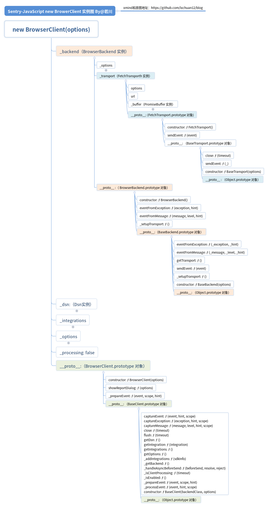
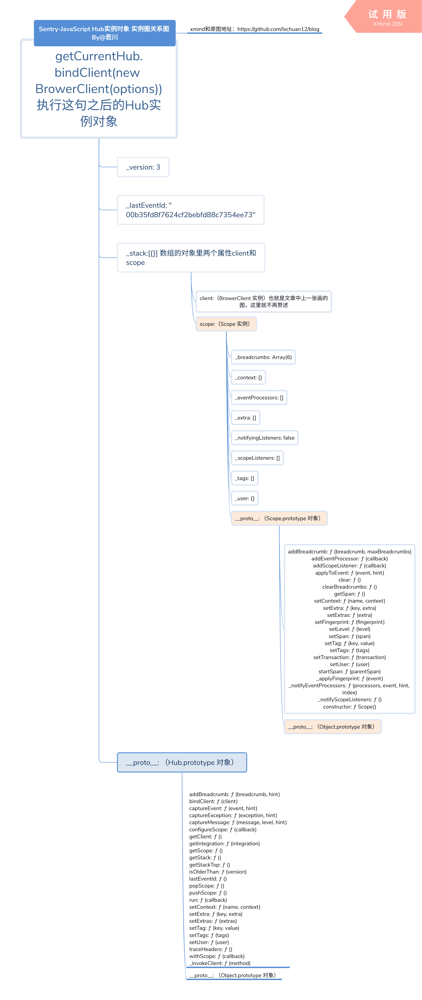
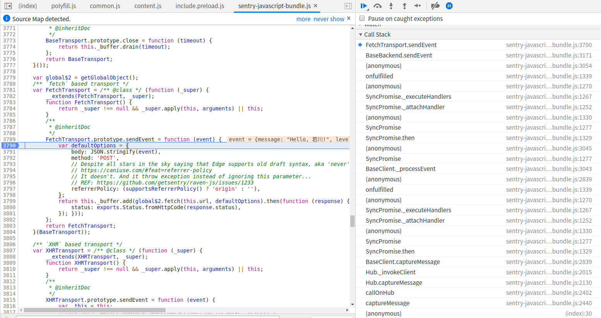

# 学习 sentry 源码整体架构，打造属于自己的前端异常监控SDK

## 1. 前言

>你好，我是[若川](https://lxchuan12.gitee.io)，微信搜索[「若川视野」](https://mp.weixin.qq.com/s/c3hFML3XN9KCUetDOZd-DQ)关注我，专注前端技术分享。欢迎加我微信`ruochuan12`，加群交流学习。

>这是`学习源码整体架构系列`第四篇。整体架构这词语好像有点大，姑且就算是源码整体结构吧，主要就是学习是代码整体结构，不深究其他不是主线的具体函数的实现。文章学习的是打包整合后的代码，不是实际仓库中的拆分的代码。

>[本文仓库地址](https://github.com/lxchuan12/sentry-analysis.git)：`git clone https://github.com/lxchuan12/sentry-analysis.git`

>**要是有人说到怎么读源码，正在读文章的你能推荐我的源码系列文章，那真是太好了**。

`学习源码整体架构系列`文章如下：
>1.[学习 jQuery 源码整体架构，打造属于自己的 js 类库](https://juejin.im/post/5d39d2cbf265da1bc23fbd42)<br>
>2.[学习 underscore 源码整体架构，打造属于自己的函数式编程类库](https://juejin.im/post/5d4bf94de51d453bb13b65dc)<br>
>3.[学习 lodash 源码整体架构，打造属于自己的函数式编程类库](https://juejin.im/post/5d767e1d6fb9a06b032025ea)<br>
>4.[学习 sentry 源码整体架构，打造属于自己的前端异常监控SDK](https://juejin.im/post/5dba5a39e51d452a2378348a)<br>
>5.[学习 vuex 源码整体架构，打造属于自己的状态管理库](https://juejin.im/post/5dd4e61a6fb9a05a5c010af0)<br>
>6.[学习 axios 源码整体架构，打造属于自己的请求库](https://juejin.im/post/5df349b5518825123751ba66)<br>
>7.[学习 koa 源码的整体架构，浅析koa洋葱模型原理和co原理](https://juejin.im/post/5e69925cf265da571e262fe6)<br>
>8.[学习 redux 源码整体架构，深入理解 redux 及其中间件原理](https://juejin.im/post/5ee63b7d51882542fc6265ad)

感兴趣的读者可以点击阅读。<br>
其他源码计划中的有：[`express`](https://github.com/lxchuan12/express-analysis)、[`vue-rotuer`](https://github.com/lxchuan12/vue-router-analysis)、[`react-redux`](https://github.com/lxchuan12/react-redux-analysis) 等源码，不知何时能写完（哭泣），欢迎持续关注我（若川）。

源码类文章，一般阅读量不高。已经有能力看懂的，自己就看了。不想看，不敢看的就不会去看源码。<br>
所以我的文章，尽量写得让想看源码又不知道怎么看的读者能看懂。

**导读**<br/>
本文通过梳理前端错误监控知识、介绍`sentry`错误监控原理、`sentry`初始化、`Ajax`上报、`window.onerror、window.onunhandledrejection`几个方面来学习`sentry`的源码。

开发微信小程序，想着搭建小程序错误监控方案。最近用了丁香园 开源的`Sentry` 小程序 `SDK`[sentry-miniapp](https://github.com/lizhiyao/sentry-miniapp)。
顺便研究下[`sentry-javascript`仓库](https://github.com/getsentry/sentry-javascript) 的源码整体架构，于是有了这篇文章。

本文分析的是打包后未压缩的源码，源码总行数五千余行，链接地址是：[https://browser.sentry-cdn.com/5.7.1/bundle.js](https://browser.sentry-cdn.com/5.7.1/bundle.js)， 版本是`v5.7.1`。

本文示例等源代码在这我的`github`博客中[github blog sentry](https://github.com/lxchuan12/blog/blob/master/docs/sentry/README.md)，需要的读者可以点击查看，如果觉得不错，可以顺便`star`一下。

看源码前先来梳理下前端错误监控的知识。

## 2. 前端错误监控知识

摘抄自 [慕课网视频教程：前端跳槽面试必备技巧](https://coding.imooc.com/class/129.html)<br/>
[别人做的笔记：前端跳槽面试必备技巧-4-4 错误监控类](https://articles.jerryshi.com/learning/fe/js-interview-skill.html#_4-4-%E9%94%99%E8%AF%AF%E7%9B%91%E6%8E%A7%E7%B1%BB)

### 2.1 前端错误的分类

>**1.即时运行错误：代码错误**

`try...catch`

`window.onerror` (也可以用`DOM2`事件监听)

>**2.资源加载错误**

 `object.onerror`: `dom`对象的`onerror`事件

`performance.getEntries()`

`Error`事件捕获

>3.**使用`performance.getEntries()`获取网页图片加载错误**

`var allImgs = document.getElementsByTagName('image')`

`var loadedImgs = performance.getEntries().filter(i => i.initiatorType === 'img')`

最后`allIms`和`loadedImgs`对比即可找出图片资源未加载项目

### 2.2 Error事件捕获代码示例

```js
window.addEventListener('error', function(e) {
  console.log('捕获', e)
}, true) // 这里只有捕获才能触发事件，冒泡是不能触发
```

### 2.3 上报错误的基本原理

1.采用`Ajax`通信的方式上报

2.利用`Image`对象上报 (主流方式)

`Image`上报错误方式：
` (new Image()).src = 'https://lxchuan12.cn/error?name=若川'`

## 3. Sentry 前端异常监控基本原理

>1.重写 `window.onerror` 方法、重写 `window.onunhandledrejection` 方法

如果不了解`onerror和onunhandledrejection`方法的读者，可以看相关的`MDN`文档。这里简要介绍一下：

[MDN GlobalEventHandlers.onerror](https://developer.mozilla.org/zh-CN/docs/Web/API/GlobalEventHandlers/onerror)

```js
window.onerror = function (message, source, lineno, colno, error) {
	console.log('message, source, lineno, colno, error', message, source, lineno, colno, error);
}
```

>参数：<br/>
>`message`：错误信息（字符串）。可用于`HTML onerror=""`处理程序中的`event`。<br/>
>`source`：发生错误的脚本`URL`（字符串）<br/>
>`lineno`：发生错误的行号（数字）<br/>
>`colno`：发生错误的列号（数字）<br/>
>`error`：`Error`对象（对象）<br/>

[MDN unhandledrejection](https://developer.mozilla.org/zh-CN/docs/Web/Events/unhandledrejection)
>当 `Promise` 被 `reject` 且没有 `reject` 处理器的时候，会触发 `unhandledrejection` 事件；这可能发生在 `window` 下，但也可能发生在 `Worker` 中。 这对于调试回退错误处理非常有用。

`Sentry` 源码可以搜索 `global.onerror` 定位到具体位置

```js
 GlobalHandlers.prototype._installGlobalOnErrorHandler = function () {
	// 代码有删减
	// 这里的 this._global 在浏览器中就是 window
	this._oldOnErrorHandler = this._global.onerror;
	this._global.onerror = function (msg, url, line, column, error) {}
	// code ...
 }
```
同样，可以搜索`global.onunhandledrejection` 定位到具体位置
```js
GlobalHandlers.prototype._installGlobalOnUnhandledRejectionHandler = function () {
	// 代码有删减
	this._oldOnUnhandledRejectionHandler = this._global.onunhandledrejection;
	this._global.onunhandledrejection = function (e) {}
}
```


>2.采用`Ajax`上传

支持 `fetch` 使用 `fetch`，否则使用　`XHR`。

```js
BrowserBackend.prototype._setupTransport = function () {
	// 代码有删减
	if (supportsFetch()) {
		return new FetchTransport(transportOptions);
	}
	return new XHRTransport(transportOptions);
};
```

>2.1 `fetch`

```js
FetchTransport.prototype.sendEvent = function (event) {
	var defaultOptions = {
		body: JSON.stringify(event),
		method: 'POST',
		referrerPolicy: (supportsReferrerPolicy() ? 'origin' : ''),
	};
	return this._buffer.add(global$2.fetch(this.url, defaultOptions).then(function (response) { return ({
		status: exports.Status.fromHttpCode(response.status),
	}); }));
};
```

>2.2 `XMLHttpRequest`

```js
XHRTransport.prototype.sendEvent = function (event) {
	var _this = this;
	return this._buffer.add(new SyncPromise(function (resolve, reject) {
		// 熟悉的 XMLHttpRequest
		var request = new XMLHttpRequest();
		request.onreadystatechange = function () {
			if (request.readyState !== 4) {
				return;
			}
			if (request.status === 200) {
				resolve({
					status: exports.Status.fromHttpCode(request.status),
				});
			}
			reject(request);
		};
		request.open('POST', _this.url);
		request.send(JSON.stringify(event));
	}));
}
```

接下来主要通过Sentry初始化、如何`Ajax上报`和`window.onerror、window.onunhandledrejection`三条主线来学习源码。

>如果看到这里，暂时不想关注后面的源码细节，直接看后文小结1和2的两张图。或者可以点赞或收藏这篇文章，后续想看了再看。

## 4. Sentry 源码入口和出口

```js
var Sentry = (function(exports){
	// code ...

    var SDK_NAME = 'sentry.javascript.browser';
	var SDK_VERSION = '5.7.1';

	// code ...
	// 省略了导出的Sentry的若干个方法和属性
	// 只列出了如下几个
    exports.SDK_NAME = SDK_NAME;
    exports.SDK_VERSION = SDK_VERSION;
	// 重点关注 captureMessage
    exports.captureMessage = captureMessage;
	// 重点关注 init
    exports.init = init;

    return exports;
}({}));
```

## 5. Sentry.init 初始化 之 init 函数

初始化

```js
// 这里的dsn，是sentry.io网站会生成的。
Sentry.init({ dsn: 'xxx' });
```

```js
// options 是 {dsn: '...'}
function init(options) {
	// 如果options 是undefined，则赋值为 空对象
	if (options === void 0) { options = {}; }
	// 如果没传 defaultIntegrations 则赋值默认的
	if (options.defaultIntegrations === undefined) {
		options.defaultIntegrations = defaultIntegrations;
	}
	// 初始化语句
	if (options.release === undefined) {
		var window_1 = getGlobalObject();
		// 这是给  sentry-webpack-plugin 插件提供的，webpack插件注入的变量。这里没用这个插件，所以这里不深究。
		// This supports the variable that sentry-webpack-plugin injects
		if (window_1.SENTRY_RELEASE && window_1.SENTRY_RELEASE.id) {
			options.release = window_1.SENTRY_RELEASE.id;
		}
	}
	// 初始化并且绑定
	initAndBind(BrowserClient, options);
}
```

### 5.1 getGlobalObject、inNodeEnv 函数

很多地方用到这个函数`getGlobalObject`。其实做的事情也比较简单，就是获取全局对象。浏览器中是`window`。

```js
/**
 * 判断是否是node环境
 * Checks whether we're in the Node.js or Browser environment
 *
 * @returns Answer to given question
 */
function isNodeEnv() {
	// tslint:disable:strict-type-predicates
	return Object.prototype.toString.call(typeof process !== 'undefined' ? process : 0) === '[object process]';
}
var fallbackGlobalObject = {};
/**
 * Safely get global scope object
 *
 * @returns Global scope object
 */
function getGlobalObject() {
	return (isNodeEnv()
	// 是 node 环境 赋值给 global
		? global
		: typeof window !== 'undefined'
			? window
			// 不是 window self 不是undefined 说明是 Web Worker 环境
			: typeof self !== 'undefined'
				? self
				// 都不是，赋值给空对象。
				: fallbackGlobalObject);
```

继续看 `initAndBind` 函数

## 6. initAndBind 函数之 new BrowserClient(options)

```js
function initAndBind(clientClass, options) {
	// 这里没有开启debug模式，logger.enable() 这句不会执行
	if (options.debug === true) {
		logger.enable();
	}
	getCurrentHub().bindClient(new clientClass(options));
}
```

可以看出 `initAndBind()`，第一个参数是 `BrowserClient` 构造函数，第二个参数是初始化后的`options`。
接着先看 构造函数 `BrowserClient`。
另一条线 `getCurrentHub().bindClient()` 先不看。

### 6.1 BrowserClient 构造函数

```js
var BrowserClient = /** @class */ (function (_super) {
	// `BrowserClient` 继承自`BaseClient`
	__extends(BrowserClient, _super);
	/**
	 * Creates a new Browser SDK instance.
	 *
	 * @param options Configuration options for this SDK.
	 */
	function BrowserClient(options) {
		if (options === void 0) { options = {}; }
		// 把`BrowserBackend`，`options`传参给`BaseClient`调用。
		return _super.call(this, BrowserBackend, options) || this;
	}
	return BrowserClient;
}(BaseClient));
```

`从代码中可以看出`：
`BrowserClient` 继承自`BaseClient`，并且把`BrowserBackend`，`options`传参给`BaseClient`调用。

先看 `BrowserBackend`，这里的`BaseClient`，暂时不看。

看`BrowserBackend`之前，先提一下继承、继承静态属性和方法。

### 6.2 __extends、extendStatics 打包代码实现的继承

未打包的源码是使用`ES6 extends`实现的。这是打包后的对`ES6`的`extends`的一种实现。

如果对继承还不是很熟悉的读者，可以参考我之前写的文章。[面试官问：JS的继承](https://juejin.im/post/5c433e216fb9a049c15f841b)

```js
// 继承静态方法和属性
var extendStatics = function(d, b) {
	// 如果支持 Object.setPrototypeOf 这个函数，直接使用
	// 不支持，则使用原型__proto__ 属性，
	// 如何还不支持（但有可能__proto__也不支持，毕竟是浏览器特有的方法。）
	// 则使用for in 遍历原型链上的属性，从而达到继承的目的。
	extendStatics = Object.setPrototypeOf ||
		({ __proto__: [] } instanceof Array && function (d, b) { d.__proto__ = b; }) ||
		function (d, b) { for (var p in b) if (b.hasOwnProperty(p)) d[p] = b[p]; };
	return extendStatics(d, b);
};

function __extends(d, b) {
	extendStatics(d, b);
	// 申明构造函数__ 并且把 d 赋值给 constructor
	function __() { this.constructor = d; }
	// (__.prototype = b.prototype, new __()) 这种逗号形式的代码，最终返回是后者，也就是 new __()
	// 比如 (typeof null, 1) 返回的是1
	// 如果 b === null 用Object.create(b) 创建 ，也就是一个不含原型链等信息的空对象 {}
	// 否则使用 new __() 返回
	d.prototype = b === null ? Object.create(b) : (__.prototype = b.prototype, new __());
}
```

不得不说这打包后的代码十分严谨，上面说的我的文章《面试官问：`JS`的继承》中没有提到不支持`__proto__`的情况。看来这文章可以进一步严谨修正了。
让我想起`Vue`源码中对数组检测代理判断是否支持`__proto__`的判断。

```js
// vuejs 源码：https://github.com/vuejs/vue/blob/dev/dist/vue.js#L526-L527
// can we use __proto__?
var hasProto = '__proto__' in {};
```

看完打包代码实现的继承，继续看 `BrowserBackend` 构造函数

### 6.3 BrowserBackend  构造函数 （浏览器后端）

```js
var BrowserBackend = /** @class */ (function (_super) {
    __extends(BrowserBackend, _super);
	function BrowserBackend() {
		return _super !== null && _super.apply(this, arguments) || this;
	}
	/**
	 * 设置请求
	 */
	BrowserBackend.prototype._setupTransport = function () {
		if (!this._options.dsn) {
			// We return the noop transport here in case there is no Dsn.
			// 没有设置dsn，调用BaseBackend.prototype._setupTransport 返回空函数
			return _super.prototype._setupTransport.call(this);
		}
		var transportOptions = __assign({}, this._options.transportOptions, { dsn: this._options.dsn });
		if (this._options.transport) {
			return new this._options.transport(transportOptions);
		}
		// 支持Fetch则返回 FetchTransport 实例，否则返回 XHRTransport实例，
		// 这两个构造函数具体代码在开头已有提到。
		if (supportsFetch()) {
			return new FetchTransport(transportOptions);
		}
		return new XHRTransport(transportOptions);
	};
	// code ...
	return BrowserBackend;
}(BaseBackend));
```

`BrowserBackend` 又继承自 `BaseBackend`。

#### 6.3.1 BaseBackend  构造函数 （基础后端）

```js
/**
 * This is the base implemention of a Backend.
 * @hidden
 */
var BaseBackend = /** @class */ (function () {
	/** Creates a new backend instance. */
	function BaseBackend(options) {
		this._options = options;
		if (!this._options.dsn) {
			logger.warn('No DSN provided, backend will not do anything.');
		}
		// 调用设置请求函数
		this._transport = this._setupTransport();
	}
	/**
	 * Sets up the transport so it can be used later to send requests.
	 * 设置发送请求空函数
	 */
	BaseBackend.prototype._setupTransport = function () {
		return new NoopTransport();
	};
	// code ...
	BaseBackend.prototype.sendEvent = function (event) {
		this._transport.sendEvent(event).then(null, function (reason) {
			logger.error("Error while sending event: " + reason);
		});
	};
	BaseBackend.prototype.getTransport = function () {
		return this._transport;
	};
	return BaseBackend;
}());
```

通过一系列的继承后，回过头来看 `BaseClient` 构造函数。

#### 6.3.2 BaseClient 构造函数（基础客户端）

```js
var BaseClient = /** @class */ (function () {
	/**
	 * Initializes this client instance.
	 *
	 * @param backendClass A constructor function to create the backend.
	 * @param options Options for the client.
	 */
	function BaseClient(backendClass, options) {
		/** Array of used integrations. */
		this._integrations = {};
		/** Is the client still processing a call? */
		this._processing = false;
		this._backend = new backendClass(options);
		this._options = options;
		if (options.dsn) {
			this._dsn = new Dsn(options.dsn);
		}
		if (this._isEnabled()) {
			this._integrations = setupIntegrations(this._options);
		}
	}
	// code ...
	return BaseClient;
}());
```

### 6.4 小结1. new BrowerClient 经过一系列的继承和初始化

可以输出下具体`new clientClass(options)`之后的结果：

```js
function initAndBind(clientClass, options) {
	if (options.debug === true) {
		logger.enable();
	}
	var client = new clientClass(options);
	console.log('new clientClass(options)', client);
	getCurrentHub().bindClient(client);
	// 原来的代码
	// getCurrentHub().bindClient(new clientClass(options));
}
```

最终输出得到这样的数据。我画了一张图表示。重点关注的原型链用颜色标注了，其他部分收缩了。



## 7. initAndBind 函数之 getCurrentHub().bindClient()

继续看 `initAndBind` 的另一条线。

```js
function initAndBind(clientClass, options) {
	if (options.debug === true) {
		logger.enable();
	}
	getCurrentHub().bindClient(new clientClass(options));
}
```

获取当前的控制中心 `Hub`，再把`new BrowserClient()` 的实例对象绑定在`Hub`上。

### 7.1 getCurrentHub 函数

```js
// 获取当前Hub 控制中心
function getCurrentHub() {
	// Get main carrier (global for every environment)
	var registry = getMainCarrier();
	// 如果没有控制中心在载体上，或者它的版本是老版本，就设置新的。
	// If there's no hub, or its an old API, assign a new one
	if (!hasHubOnCarrier(registry) || getHubFromCarrier(registry).isOlderThan(API_VERSION)) {
		setHubOnCarrier(registry, new Hub());
	}
	// node 才执行
	// Prefer domains over global if they are there (applicable only to Node environment)
	if (isNodeEnv()) {
		return getHubFromActiveDomain(registry);
	}
	// 返回当前控制中心来自载体上。
	// Return hub that lives on a global object
	return getHubFromCarrier(registry);
}
```

### 7.2 衍生的函数 getMainCarrier、getHubFromCarrier

<!-- 获取主载体 -->
```js
function getMainCarrier() {
	// 载体 这里是window
	// 通过一系列new BrowerClient() 一系列的初始化
	// 挂载在  carrier.__SENTRY__ 已经有了三个属性，globalEventProcessors, hub, logger
	var carrier = getGlobalObject();
	carrier.__SENTRY__ = carrier.__SENTRY__ || {
		hub: undefined,
	};
	return carrier;
}
```

```js
// 获取控制中心 hub 从载体上
function getHubFromCarrier(carrier) {
	// 已经有了则返回，没有则new Hub
	if (carrier && carrier.__SENTRY__ && carrier.__SENTRY__.hub) {
		return carrier.__SENTRY__.hub;
	}
	carrier.__SENTRY__ = carrier.__SENTRY__ || {};
	carrier.__SENTRY__.hub = new Hub();
	return carrier.__SENTRY__.hub;
}
```

### 7.3 bindClient 绑定客户端在当前控制中心上

```js
Hub.prototype.bindClient = function (client) {
	// 获取最后一个
	var top = this.getStackTop();
	// 把 new BrowerClient() 实例 绑定到top上
	top.client = client;
};
```

```js
Hub.prototype.getStackTop = function () {
	// 获取最后一个
	return this._stack[this._stack.length - 1];
};
```

### 7.4 小结2. 经过一系列的继承和初始化

再回过头来看 `initAndBind`函数

```js
function initAndBind(clientClass, options) {
	if (options.debug === true) {
		logger.enable();
	}
	var client = new clientClass(options);
	console.log(client, options, 'client, options');
	var currentHub = getCurrentHub();
	currentHub.bindClient(client);
	console.log('currentHub', currentHub);
	// 源代码
	// getCurrentHub().bindClient(new clientClass(options));
}
```

最终会得到这样的`Hub`实例对象。笔者画了一张图表示，便于查看理解。



初始化完成后，再来看具体例子。
具体 `captureMessage` 函数的实现。

```js
Sentry.captureMessage('Hello, 若川!');
```

## 8. captureMessage 函数

通过之前的阅读代码，知道会最终会调用`Fetch`接口，所以直接断点调试即可，得出如下调用栈。
接下来描述调用栈的主要流程。



>调用栈主要流程：
>
captureMessage

```js
function captureMessage(message, level) {
	var syntheticException;
	try {
		throw new Error(message);
	}
	catch (exception) {
		syntheticException = exception;
	}
	// 调用 callOnHub 方法
	return callOnHub('captureMessage', message, level, {
		originalException: message,
		syntheticException: syntheticException,
	});
}
```

=> callOnHub

```js
/**
 * This calls a function on the current hub.
 * @param method function to call on hub.
 * @param args to pass to function.
 */
function callOnHub(method) {
	// 这里method 传进来的是 'captureMessage'
	// 把method除外的其他参数放到args数组中
	var args = [];
	for (var _i = 1; _i < arguments.length; _i++) {
		args[_i - 1] = arguments[_i];
	}
	// 获取当前控制中心 hub
	var hub = getCurrentHub();
	// 有这个方法 把args 数组展开，传递给 hub[method] 执行
	if (hub && hub[method]) {
		// tslint:disable-next-line:no-unsafe-any
		return hub[method].apply(hub, __spread(args));
	}
	throw new Error("No hub defined or " + method + " was not found on the hub, please open a bug report.");
}
```

=>  Hub.prototype.captureMessage

接着看`Hub.prototype` 上定义的 `captureMessage` 方法

```js
Hub.prototype.captureMessage = function (message, level, hint) {
	var eventId = (this._lastEventId = uuid4());
	var finalHint = hint;
	// 代码有删减
	this._invokeClient('captureMessage', message, level, __assign({}, finalHint, { event_id: eventId }));
	return eventId;
};
```

=> Hub.prototype._invokeClient


```js
/**
 * Internal helper function to call a method on the top client if it exists.
 *
 * @param method The method to call on the client.
 * @param args Arguments to pass to the client function.
 */
Hub.prototype._invokeClient = function (method) {
	// 同样：这里method 传进来的是 'captureMessage'
	// 把method除外的其他参数放到args数组中
	var _a;
	var args = [];
	for (var _i = 1; _i < arguments.length; _i++) {
		args[_i - 1] = arguments[_i];
	}
	var top = this.getStackTop();
	// 获取控制中心的 hub，调用客户端也就是new BrowerClient () 实例中继承自 BaseClient 的 captureMessage 方法
	// 有这个方法 把args 数组展开，传递给 hub[method] 执行
	if (top && top.client && top.client[method]) {
		(_a = top.client)[method].apply(_a, __spread(args, [top.scope]));
	}
};
```

=> BaseClient.prototype.captureMessage

```js
BaseClient.prototype.captureMessage = function (message, level, hint, scope) {
	var _this = this;
	var eventId = hint && hint.event_id;
	this._processing = true;
	var promisedEvent = isPrimitive(message)
		? this._getBackend().eventFromMessage("" + message, level, hint)
		: this._getBackend().eventFromException(message, hint);
		// 代码有删减
	promisedEvent
		.then(function (event) { return _this._processEvent(event, hint, scope); })
	// 代码有删减
	return eventId;
};
```
最后会调用 `_processEvent` 也就是

=> BaseClient.prototype._processEvent

这个函数最终会调用

```js
_this._getBackend().sendEvent(finalEvent);
```

也就是

=>  BaseBackend.prototype.sendEvent

```js
BaseBackend.prototype.sendEvent = function (event) {
	this._transport.sendEvent(event).then(null, function (reason) {
		logger.error("Error while sending event: " + reason);
	});
};
```

=> FetchTransport.prototype.sendEvent 最终发送了请求

### 8.1 FetchTransport.prototype.sendEvent

```js
FetchTransport.prototype.sendEvent = function (event) {
	var defaultOptions = {
		body: JSON.stringify(event),
		method: 'POST',
		// Despite all stars in the sky saying that Edge supports old draft syntax, aka 'never', 'always', 'origin' and 'default
		// https://caniuse.com/#feat=referrer-policy
		// It doesn't. And it throw exception instead of ignoring this parameter...
		// REF: https://github.com/getsentry/raven-js/issues/1233
		referrerPolicy: (supportsReferrerPolicy() ? 'origin' : ''),
	};
	// global$2.fetch(this.url, defaultOptions) 使用fetch发送请求
	return this._buffer.add(global$2.fetch(this.url, defaultOptions).then(function (response) { return ({
		status: exports.Status.fromHttpCode(response.status),
	}); }));
};
```

看完 `Ajax 上报` 主线，再看本文的另外一条主线 `window.onerror` 捕获。

## 9. window.onerror 和 window.onunhandledrejection 捕获 错误

例子：调用一个未申明的变量。

```js
func();
```

`Promise` 不捕获错误

```js
new Promise(() => {
	fun();
})
.then(res => {
	console.log('then');
})
```

### 9.1 captureEvent

>调用栈主要流程：

>window.onerror

```js
GlobalHandlers.prototype._installGlobalOnErrorHandler = function () {
	if (this._onErrorHandlerInstalled) {
		return;
	}
	var self = this; // tslint:disable-line:no-this-assignment
	// 浏览器中这里的 this._global.  就是window
	this._oldOnErrorHandler = this._global.onerror;
	this._global.onerror = function (msg, url, line, column, error) {
		var currentHub = getCurrentHub();
		// 代码有删减
		currentHub.captureEvent(event, {
			originalException: error,
		});
		if (self._oldOnErrorHandler) {
			return self._oldOnErrorHandler.apply(this, arguments);
		}
		return false;
	};
	this._onErrorHandlerInstalled = true;
};
```

>window.onunhandledrejection

```js
GlobalHandlers.prototype._installGlobalOnUnhandledRejectionHandler = function () {
	if (this._onUnhandledRejectionHandlerInstalled) {
		return;
	}
	var self = this; // tslint:disable-line:no-this-assignment
	this._oldOnUnhandledRejectionHandler = this._global.onunhandledrejection;
	this._global.onunhandledrejection = function (e) {
		// 代码有删减
		var currentHub = getCurrentHub();
		currentHub.captureEvent(event, {
			originalException: error,
		});
		if (self._oldOnUnhandledRejectionHandler) {
			return self._oldOnUnhandledRejectionHandler.apply(this, arguments);
		}
		return false;
	};
	this._onUnhandledRejectionHandlerInstalled = true;
};
```

共同点：都会调用`currentHub.captureEvent`

```js
currentHub.captureEvent(event, {
	originalException: error,
});
```

=> Hub.prototype.captureEvent

最终又是调用 `_invokeClient` ，调用流程跟 `captureMessage` 类似，这里就不再赘述。

```js
this._invokeClient('captureEvent')
```

=> Hub.prototype._invokeClient

=> BaseClient.prototype.captureEvent

=> BaseClient.prototype._processEvent

=>  BaseBackend.prototype.sendEvent

=> FetchTransport.prototype.sendEvent

最终同样是调用了这个函数发送了请求。

可谓是殊途同归，行文至此就基本已经结束，最后总结一下。

## 10. 总结

`Sentry-JavaScript`源码高效利用了`JS`的原型链机制。可谓是惊艳，值得学习。

本文通过梳理前端错误监控知识、介绍`sentry`错误监控原理、`sentry`初始化、`Ajax`上报、`window.onerror、window.onunhandledrejection`几个方面来学习`sentry`的源码。还有很多细节和构造函数没有分析。

总共的构造函数（类）有25个，提到的主要有9个，分别是：`Hub、BaseClient、BaseBackend、BaseTransport、FetchTransport、XHRTransport、BrowserBackend、BrowserClient、GlobalHandlers`。

其他没有提到的分别是 `SentryError、Logger、Memo、SyncPromise、PromiseBuffer、Span、Scope、Dsn、API、NoopTransport、FunctionToString、InboundFilters、TryCatch、Breadcrumbs、LinkedErrors、UserAgent`。

这些构造函数（类）中还有很多值得学习，比如同步的`Promise`（SyncPromise）。
有兴趣的读者，可以看这一块官方仓库中采用`typescript`写的源码[SyncPromise](https://github.com/getsentry/sentry-javascript/blob/master/packages/utils/src/syncpromise.ts)，也可以看打包后出来未压缩的代码。

读源码比较耗费时间，写文章记录下来更加费时间（比如写这篇文章跨度十几天...），但收获一般都比较大。

如果读者发现有不妥或可改善之处，再或者哪里没写明白的地方，欢迎评论指出。另外觉得写得不错，对您有些许帮助，可以点赞、评论、转发分享，也是对笔者的一种支持。万分感谢。

## 11. 推荐阅读

[知乎滴滴云：超详细！搭建一个前端错误监控系统](https://zhuanlan.zhihu.com/p/51446011)<br/>
[掘金BlackHole1：JavaScript集成Sentry](https://juejin.im/post/5b7f63c96fb9a019f709b14b)<br/>
丁香园 开源的`Sentry` 小程序 `SDK`[sentry-miniapp](https://github.com/lizhiyao/sentry-miniapp)<br/>
[`sentry`官网](https://sentry.io)<br/>
[`sentry-javascript`仓库](https://github.com/getsentry/sentry-javascript)<br/>

## 笔者往期文章

[面试官问：JS的继承](https://juejin.im/post/5c433e216fb9a049c15f841b)<br>
[面试官问：JS的this指向](https://juejin.im/post/5c0c87b35188252e8966c78a)<br>
[面试官问：能否模拟实现JS的call和apply方法](https://juejin.im/post/5bf6c79bf265da6142738b29)<br>
[面试官问：能否模拟实现JS的bind方法](https://juejin.im/post/5bec4183f265da616b1044d7)<br>
[面试官问：能否模拟实现JS的new操作符](https://juejin.im/post/5bde7c926fb9a049f66b8b52)<br>
[前端使用puppeteer 爬虫生成《React.js 小书》PDF并合并](https://juejin.im/post/5b86732451882542af1c8082)

## 关于

作者：常以**若川**为名混迹于江湖。前端路上 | PPT爱好者 | 所知甚少，唯善学。<br>
[若川的博客](https://lxchuan12.gitee.io)，使用`vuepress`重构了，阅读体验可能更好些<br>
[掘金专栏](https://juejin.im/user/1415826704971918/posts)，欢迎关注~<br>
[`segmentfault`前端视野专栏](https://segmentfault.com/blog/lxchuan12)，欢迎关注~<br>
[知乎前端视野专栏](https://zhuanlan.zhihu.com/lxchuan12)，欢迎关注~<br>
[语雀前端视野专栏](https://www.yuque.com/lxchuan12/blog)，新增语雀专栏，欢迎关注~<br>
[github blog](https://github.com/lxchuan12/blog)，相关源码和资源都放在这里，求个`star`^_^~

## 微信公众号  若川视野

可能比较有趣的微信公众号，长按扫码关注（**回复pdf获取前端优质书籍pdf**）。欢迎加笔者微信`ruochuan12`（注明来源，基本来者不拒），拉您进【前端视野交流群】，长期交流学习~


