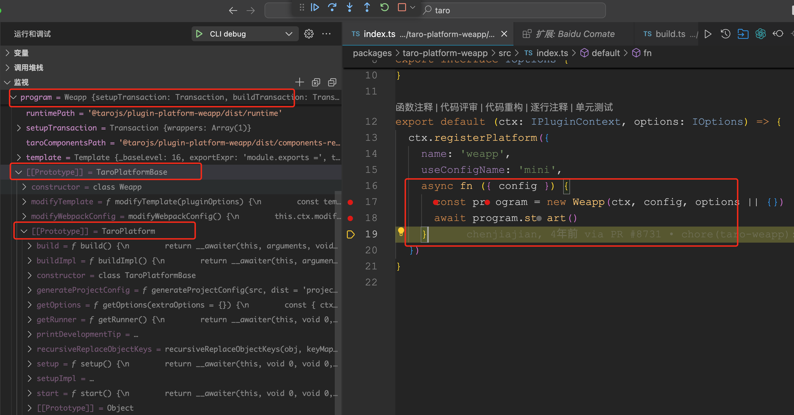

# Taro 4.0 已正式发布 - 4. 每次 npm run dev:weapp 开发小程序，build 编译打包是如何实现的？

## 1. 前言

大家好，我是[若川](https://juejin.cn/user/1415826704971918)，欢迎关注我的[公众号：若川视野](https://mp.weixin.qq.com/s/MacNfeTPODNMLLFdzrULow)。我倾力持续组织了 3 年多[每周大家一起学习 200 行左右的源码共读活动](https://juejin.cn/post/7079706017579139102)，感兴趣的可以[点此扫码加我微信 `ruochuan02` 参与](https://juejin.cn/pin/7217386885793595453)。另外，想学源码，极力推荐关注我写的专栏[《学习源码整体架构系列》](https://juejin.cn/column/6960551178908205093)，目前是掘金关注人数（6k+人）第一的专栏，写有几十篇源码文章。

截至目前（`2024-08-16`），[`taro 4.0` 正式版已经发布](https://github.com/NervJS/taro/releases/tag/v4.0.3)，目前最新是 `4.0.4`，官方`4.0`正式版本的介绍文章暂未发布。官方之前发过[Taro 4.0 Beta 发布：支持开发鸿蒙应用、小程序编译模式、Vite 编译等](https://juejin.cn/post/7330792655125463067)。

计划写一个 `taro` 源码揭秘系列，欢迎持续关注。初步计划有如下文章：

-   [x] [Taro 源码揭秘 - 1. 揭开整个架构的入口 CLI => taro init 初始化项目的秘密](https://juejin.cn/post/7378363694939783178)
-   [x] [Taro 源码揭秘 - 2. 揭开整个架构的插件系统的秘密](https://juejin.cn/spost/7380195796208205824)
-   [x] [Taro 源码揭秘 - 3. 每次创建新的 taro 项目（taro init）的背后原理是什么](https://juejin.cn/post/7390335741586931738)
-   [x] [Taro 4.0 已正式发布 - 4. 每次 npm run dev:weapp 开发小程序，build 编译打包是如何实现的？](https://juejin.cn/post/7403193330271682612)
-   [x] [Taro 4.0 已发布 - 5.高手都在用的发布订阅机制 Events 在 Taro 中是如何实现的？](https://juejin.cn/post/7403915119448915977)
-   [ ] 等等

学完本文，你将学到：

```bash
1. 每次开发编译 npm run dev:weapp build 编译打包是如何实现的？
2. 微信小程序端平台插件 @tarojs/plugin-platform-weapp 是如何实现的？
3. 端平台插件基础抽象类 TaroPlatformBase、TaroPlatform 是如何实现的？
4. 最终是如何调用 runner 执行 webpack 编译构建的？
等等
```

经常使用 `Taro` 开发小程序的小伙伴，一定日常使用 `npm run dev:weapp` 等命令运行小程序。我们这篇文章就来解读这个命令背后，`Taro` 到底做了什么。
`npm run dev:weapp` 对应的是 `taro build --type weapp --watch`。<br>
`npm run build:weapp` 对应的是 `taro build --type weapp`。<br>

关于克隆项目、环境准备、如何调试代码等，参考[第一篇文章-准备工作、调试](https://juejin.cn/post/7378363694939783178#heading-1)。后续文章基本不再过多赘述。
>文章中基本是先放源码，源码中不做过多解释。源码后面再做简单讲述。

## 2. 调试源码

初始化 `taro` 项目，方便调试，选择`React`、`TS`、`Less`、`pnpm`、`webpack5`、`CLI内置默认模板`。

```bash
npx @taro/cli init taro4-debug
cd taro4-debug
# 安装依赖
pnpm i
# 写文章时最新的版本是 4.0.4
```

如图所示


```bash
# 开发启动
pnpm run dev:weapp
```

如图


```bash
# 编译打包
pnpm run build:weapp
```

如图


我们来学习 taro 编译打包的源码。

### 2.1 调试方式1：使用项目里的依赖

克隆 `taro` 项目

```bash
git clone https://github.com/NervJS/taro.git
cd taro
pnpm i
pnpm run build
# 写文章时最新的版本是 4.0.4，可以 git checkout 39dd83eb0bfc2a937acd79b289c7c2ec6e59e202
# 39dd83eb0bfc2a937acd79b289c7c2ec6e59e202
# chore(release): publish 4.0.4 (#16202)
```

方式1调试截图如下：


优点，无需多余的配置，可以直接调试本身项目。
缺点：安装的 `taro` 依赖都是 `dist` 目录，压缩过后的，不方便查看原始代码。

我们使用调试方法2。

### 2.2 调试方式2：使用 taro 源码

我把 `taro` 源码和 `taro4-debug` 克隆到了同一个目录 `github`。

优点：可以调试本身不压缩的源码。因为 `taro` 自身打包生成了对应的 `sourcemap` 文件，所以可以调试源码文件。
缺点：
- 1. 需要配置 `.vscode/launch.json`。
- 2. 还需要在对应的 `dist` 文件修改一些包的路径。

#### 2.2.1 配置 `.vscode/launch.json`

重点添加配置 "cwd": "/Users/ruochuan/git-source/github/taro4-debug"、 `"args": ["build","--type","weapp" ]` 和 `"console": "integratedTerminal"`

我们配置调试微信小程序打包。

```json
// .vscode/launch.json
{
  "version": "0.2.0",
  "configurations": [
    {
      "type": "node",
      "request": "launch",
      "name": "CLI debug",
      "program": "${workspaceFolder}/packages/taro-cli/bin/taro",
      "cwd": "/Users/ruochuan/git-source/github/taro4-debug",
      "args": [
        "build",
        "--type",
        "weapp",
      ],
      "console": "integratedTerminal",
      "skipFiles": ["<node_internals>/**"]
    },
  ]
}
```

#### 2.2.2 修改以下两个包的路径

- `@tarojs/plugin-platform-weapp` => `../taro/packages/taro-platform-weapp/index.js`
- `@tarojs/webpack5-runner` => `../taro/packages/taro-webpack5-runner/index.js`

对应的具体代码位置如下

```js
// packages/taro-cli/dist/cli.js
switch (platform) {
	// 省略一些平台
	case 'weapp': {
		kernel.optsPlugins.push(path.resolve(`../taro/packages/taro-platform-${platform}/index.js`))
		// kernel.optsPlugins.push(`@tarojs/plugin-platform-${platform}`);
		break;
	}
}
```

```js
// packages/taro-service/dist/platform-plugin-base/mini.js
getRunner() {
	return __awaiter(this, void 0, void 0, function* () {
		const { appPath } = this.ctx.paths;
		const { npm } = this.helper;
		const runnerPkg = this.compiler === 'vite' ? '@tarojs/vite-runner' : '@tarojs/webpack5-runner';
		// const runner = yield npm.getNpmPkg(runnerPkg, appPath);
		const runner = require(path.resolve('../taro/packages/taro-webpack5-runner/index.js'));
		return runner.bind(null, appPath);
	});
}
```

不配置的话，不会调用对应的 taro 文件源码，而是调用项目中的依赖包源码，路径不对。

方式2调试截图如下：


根据前面两篇 [1. taro cli init](https://juejin.cn/post/7378363694939783178)、[2. taro 插件机制](https://juejin.cn/spost/7380195796208205824) 文章，我们可以得知：`taro build` 初始化命令，最终调用的是 `packages/taro-cli/src/presets/commands/build.ts` 文件中的 `ctx.registerCommand` 注册的 `build` 命令行的 `fn` 函数。

```ts
// packages/taro-cli/src/presets/commands/build.ts
import {
  MessageKind,
  validateConfig
} from '@tarojs/plugin-doctor'

import * as hooks from '../constant'

import type { IPluginContext } from '@tarojs/service'

export default (ctx: IPluginContext) => {
  ctx.registerCommand({
    name: 'build',
    optionsMap: {
      '--type [typeName]': 'Build type, weapp/swan/alipay/tt/qq/jd/h5/rn',
      '--watch': 'Watch mode',
      // 省略若干代码
      '--no-check': 'Do not check config is valid or not',
    },
    synopsisList: [
      'taro build --type weapp',
      'taro build --type weapp --watch',
      // 省略若干代码
    ],
    async fn(opts) {
      const { options, config, _ } = opts
      const { platform, isWatch, blended, newBlended, withoutBuild, noInjectGlobalStyle, noCheck } = options
      const { fs, chalk, PROJECT_CONFIG } = ctx.helper
      const { outputPath, configPath } = ctx.paths

      if (!configPath || !fs.existsSync(configPath)) {
        console.log(chalk.red(`找不到项目配置文件${PROJECT_CONFIG}，请确定当前目录是 Taro 项目根目录!`))
        process.exit(1)
      }

      if (typeof platform !== 'string') {
        console.log(chalk.red('请传入正确的编译类型！'))
        process.exit(0)
      }

      // 校验 Taro 项目配置
      if (!noCheck) {
        const checkResult = await checkConfig({
          projectConfig: ctx.initialConfig,
          helper: ctx.helper
        })
        if (!checkResult.isValid) {
        // 校验失败，退出
        }
      }

      const isProduction = process.env.NODE_ENV === 'production' || !isWatch

      // dist folder
	  //   确保输出路径存在，如果不存在就创建
      fs.ensureDirSync(outputPath)

      // is build native components mode?
      const isBuildNativeComp = _[1] === 'native-components'

      await ctx.applyPlugins(hooks.ON_BUILD_START)
      await ctx.applyPlugins({
        name: platform,
        opts: {
          config: {
            ...config,
            isWatch,
            mode: isProduction ? 'production' : 'development',
			// 省略若干参数和若干钩子
          },
        },
      })
      await ctx.applyPlugins(hooks.ON_BUILD_COMPLETE)
    },
  })
}

async function checkConfig ({ projectConfig, helper }) {
  const result = await validateConfig(projectConfig, helper)
  return result
}
```

`Taro` `build` 插件主要做了以下几件事：

- 判断 `config/index` 配置文件是否存在，如果不存在，则报错退出程序。
- 判断 `platform` 参数是否是字符串，这里是 `weapp`，如果不是，退出程序。
- 使用 `@tarojs/plugin-doctor` 中的 `validateConfig` 方法 (`checkConfig`) 函数校验配置文件 `config/index`，如果配置文件出错，退出程序。
- 调用 `ctx.applyPlugins(hooks.ON_BUILD_START)` （编译开始）`onBuildStart` 钩子。
- 调用 `ctx.applyPlugins({ name: platform, })` （调用 weapp） 钩子。
- 调用 `ctx.applyPlugins(hooks.ON_BUILD_COMPLETE)` （编译结束）`onBuildComplete` 钩子。

其中

```js
await ctx.applyPlugins({
  name: platform,
});
```

调用的是端平台插件，本文以微信小程序为例，所以调用的是 weapp。对应的源码文件路径是：`packages/taro-platform-weapp/src/index.ts`。我们来看具体实现。

## 3. 端平台插件 Weapp

```ts
// packages/taro-platform-weapp/src/index.ts
import Weapp from './program'

import type { IPluginContext } from '@tarojs/service'

// 让其它平台插件可以继承此平台
export { Weapp }

export interface IOptions {
  enablekeyboardAccessory?: boolean
}

export default (ctx: IPluginContext, options: IOptions) => {
  ctx.registerPlatform({
    name: 'weapp',
    useConfigName: 'mini',
    async fn ({ config }) {
      const program = new Weapp(ctx, config, options || {})
      await program.start()
    }
  })
}
```

重点就是这两行代码。

```js
const program = new Weapp(ctx, config, options || {})
await program.start()
```

`ctx.registerPlatform` 注册 `weapp` 平台插件，调用 `Weapp` 构造函数，传入 `ctx` 、`config` 和 `options` 等配置。再调用实例对象的 `start` 方法。

## 4. new Weapp 构造函数

>packages/taro-platform-weapp/src/program.ts

```ts
// packages/taro-platform-weapp/src/program.ts
import { TaroPlatformBase } from '@tarojs/service'

import { components } from './components'
import { Template } from './template'

import type { IOptions } from './index'

const PACKAGE_NAME = '@tarojs/plugin-platform-weapp'

export default class Weapp extends TaroPlatformBase {
  template: Template
  platform = 'weapp'
  globalObject = 'wx'
  projectConfigJson: string = this.config.projectConfigName || 'project.config.json'
  runtimePath = `${PACKAGE_NAME}/dist/runtime`
  taroComponentsPath = `${PACKAGE_NAME}/dist/components-react`
  fileType = {
    templ: '.wxml',
    style: '.wxss',
    config: '.json',
    script: '.js',
    xs: '.wxs'
  }

  /**
   * 1. setupTransaction - init
   * 2. setup
   * 3. setupTransaction - close
   * 4. buildTransaction - init
   * 5. build
   * 6. buildTransaction - close
   */
  constructor (ctx, config, pluginOptions?: IOptions) {
    super(ctx, config)
    this.template = new Template(pluginOptions)
    this.setupTransaction.addWrapper({
      close () {
		//   增加组件或修改组件属性
        this.modifyTemplate(pluginOptions)
		// 修改 Webpack 配置
        this.modifyWebpackConfig()
      }
    })
  }
  //  省略代码 modifyTemplate 和 modifyWebpackConfig 具体实现
}
```

- `class Weapp` 继承于抽象类 `TaroPlatformBase` 继承于抽象类 `TaroPlatform`

如图所示：


关于抽象类和更多类相关，可以参考：
[TypeScript 入门教程 - 类](https://ts.xcatliu.com/advanced/class.html)
>抽象类（Abstract Class）：抽象类是供其他类继承的基类，抽象类不允许被实例化。抽象类中的抽象方法必须在子类中被实现
>[Classes](https://www.typescriptlang.org/docs/handbook/classes.html)([中文版](https://zhongsp.gitbooks.io/typescript-handbook/content/doc/handbook/Classes.html))
>[ECMAScript 6 入门 - Class](http://es6.ruanyifeng.com/#docs/class)

这样抽象的好处，在于其他端平台插件 [比如小红书](https://github.com/NervJS/taro-plugin-platform-xhs) 基于这个抽象类扩展继承就比较方便。

## 5. TaroPlatform 端平台插件抽象类

### 5.1 Transaction 事务

```ts
// packages/taro-service/src/platform-plugin-base/platform.ts
interface IWrapper {
  init? (): void
  close? (): void
}

export class Transaction<T = TaroPlatform> {
  wrappers: IWrapper[] = []

  async perform (fn: Func, scope: T, ...args: any[]) {
    this.initAll(scope)
    await fn.call(scope, ...args)
    this.closeAll(scope)
  }

  initAll (scope: T) {
    const wrappers = this.wrappers
    wrappers.forEach(wrapper => wrapper.init?.call(scope))
  }

  closeAll (scope: T) {
    const wrappers = this.wrappers
    wrappers.forEach(wrapper => wrapper.close?.call(scope))
  }

  addWrapper (wrapper: IWrapper) {
    this.wrappers.push(wrapper)
  }
}

```

这样的好处在于，方便按顺序执行 `init` `perform` `close` 函数。我们也可以在工作中使用。

我们接着来看 `class TaroPlatform`。

```ts
// packages/taro-service/src/platform-plugin-base/platform.ts
import { PLATFORM_TYPE } from '@tarojs/shared'

import type { Func } from '@tarojs/taro/types/compile'
import type { IPluginContext, TConfig } from '../utils/types'

const VALID_COMPILER = ['webpack5', 'vite']
const DEFAULT_COMPILER = 'webpack5'

export default abstract class TaroPlatform<T extends TConfig = TConfig> {
  protected ctx: IPluginContext
  protected config: T
  protected helper: IPluginContext['helper']
  protected compiler: string

  abstract platformType: PLATFORM_TYPE
  abstract platform: string
  abstract runtimePath: string | string[]

  protected setupTransaction = new Transaction<this>()
  protected buildTransaction = new Transaction<this>()

  constructor (ctx: IPluginContext, config: T) {
    this.ctx = ctx
    this.helper = ctx.helper
    this.config = config
    this.updateOutputPath(config)
    const _compiler = config.compiler
    this.compiler = typeof _compiler === 'object' ? _compiler.type : _compiler
    // Note: 兼容 webpack4 和不填写 compiler 的情况，默认使用 webpack5
    if (!VALID_COMPILER.includes(this.compiler)) {
      this.compiler = DEFAULT_COMPILER
    }
  }
//   拆开下方
}
```

### 5.2 emptyOutputDir 清空输出的文件夹等

```ts
// 清空输出的文件夹
protected emptyOutputDir (excludes: Array<string | RegExp> = []) {
	const { outputPath } = this.ctx.paths
	this.helper.emptyDirectory(outputPath, { excludes })
}

/**
 * 如果分端编译详情 webpack 配置了 output 则需更新 outputPath 位置
 */
private updateOutputPath (config: TConfig) {
	const platformPath = config.output?.path
	if (platformPath) {
		this.ctx.paths.outputPath = platformPath
	}
}

/**
 * 调用 runner 开启编译
 */
abstract start(): Promise<void>
```

我们来看 `TaroPlatformBase` 的实现

## 6. TaroPlatformBase 端平台插件基础抽象类

```ts
// packages/taro-service/src/platform-plugin-base/mini.ts
import * as path from 'node:path'

import { recursiveMerge, taroJsMiniComponentsPath } from '@tarojs/helper'
import { isObject, PLATFORM_TYPE } from '@tarojs/shared'

import { getPkgVersion } from '../utils/package'
import TaroPlatform from './platform'

import type { RecursiveTemplate, UnRecursiveTemplate } from '@tarojs/shared/dist/template'
import type { TConfig } from '../utils/types'

interface IFileType {
  templ: string
  style: string
  config: string
  script: string
  xs?: string
}

export abstract class TaroPlatformBase<T extends TConfig = TConfig> extends TaroPlatform<T> {
  platformType = PLATFORM_TYPE.MINI

  abstract globalObject: string
  abstract fileType: IFileType
  abstract template: RecursiveTemplate | UnRecursiveTemplate
  // Note: 给所有的小程序平台一个默认的 taroComponentsPath
  taroComponentsPath: string = taroJsMiniComponentsPath
  projectConfigJson?: string

  private projectConfigJsonOutputPath: string

  /**
   * 调用 runner 开启编译
   */
  public async start () {
    await this.setup()
    await this.build()
  }
}

```

`start` 实现，`setup` 再执行 `build`。我们来看 setup 函数。

### 6.1 setup

```ts
/**
 * 1. 清空 dist 文件夹
 * 2. 输出编译提示
 * 3. 生成 project.config.json
 */
private async setup () {
	await this.setupTransaction.perform(this.setupImpl, this)
	this.ctx.onSetupClose?.(this)
}

```

```ts
private setupImpl () {
	const { output } = this.config
	// webpack5 原生支持 output.clean 选项，但是 webpack4 不支持， 为统一行为，这里做一下兼容
	// （在 packages/taro-mini-runner/src/webpack/chain.ts 和 packages/taro-webpack-runner/src/utils/chain.ts 的 makeConfig 中对 clean 选项做了过滤）
	// 仅 output.clean 为 false 时不清空输出目录
	// eslint-disable-next-line eqeqeq
	if (output == undefined || output.clean == undefined || output.clean === true) {
		this.emptyOutputDir()
	} else if (isObject(output.clean)) {
		this.emptyOutputDir(output.clean.keep || [])
	}
	this.printDevelopmentTip(this.platform)
	if (this.projectConfigJson) {
		this.generateProjectConfig(this.projectConfigJson)
	}
	// 省略以下这两部分的代码
	// 打印开发者工具-项目目录
	// Webpack5 代码自动热重载
}
```


我们继续来看 `build` 函数。

### 6.2 build

```ts
/**
   * 调用 runner 开始编译
   * @param extraOptions 需要额外传入 runner 的配置项
   */
  private async build (extraOptions = {}) {
    this.ctx.onBuildInit?.(this)
    await this.buildTransaction.perform(this.buildImpl, this, extraOptions)
  }
```

```ts
private async buildImpl (extraOptions = {}) {
    const runner = await this.getRunner()
    const options = this.getOptions(
      Object.assign(
        {
          runtimePath: this.runtimePath,
          taroComponentsPath: this.taroComponentsPath
        },
        extraOptions
      )
    )
    await runner(options)
}
```

我们来看下 `getRunner` 的实现：

```ts
/**
 * 返回当前项目内的 runner 包
 */
protected async getRunner () {
	const { appPath } = this.ctx.paths
	const { npm } = this.helper

	const runnerPkg = this.compiler === 'vite' ? '@tarojs/vite-runner' : '@tarojs/webpack5-runner'

	const runner = await npm.getNpmPkg(runnerPkg, appPath)

	return runner.bind(null, appPath)
}
```

`build` 函数最后调用 `runner` 函数。`appPath` 项目路径是`/Users/ruochuan/git-source/github/taro4-debug`。

初始化项目使用的 `webpack5` 所以使用的是 `@tarojs/webpack5-runner` 我们来看它的具体实现。

## 7. runner => @tarojs/webpack5-runner

`package.json` 属性 "main": "index.js" 入口文件 `index.js`

```js
if (process.env.TARO_PLATFORM === 'web') {
  module.exports = require('./dist/index.h5.js').default
} else if (process.env.TARO_PLATFORM === 'harmony' || process.env.TARO_ENV === 'harmony') {
  module.exports = require('./dist/index.harmony.js').default
} else {
  module.exports = require('./dist/index.mini.js').default
}

module.exports.default = module.exports
```

本文中打包微信小程序，根据 `process.env.TARO_PLATFORM` 和 `process.env.TARO_ENV` 调用的是打包后的文件 `dist/index.mini.js`，源码文件是 `packages/taro-webpack5-runner/src/index.mini.ts`。

```ts
// packages/taro-webpack5-runner/src/index.mini.ts

import webpack from 'webpack'
//   省略若干代码
export default async function build (appPath: string, rawConfig: IMiniBuildConfig): Promise<Stats | void> {
  const combination = new MiniCombination(appPath, rawConfig)
  await combination.make()
  //   省略若干代码

  const webpackConfig = combination.chain.toConfig()
  const config = combination.config

  return new Promise<Stats | void>((resolve, reject) => {
    if (config.withoutBuild) return

    const compiler = webpack(webpackConfig)

    const callback = async (err: Error, stats: Stats) => {
    //   省略若干代码
      onFinish(null, stats)
      resolve(stats)
    }

    if (config.isWatch) {
      compiler.watch({
        aggregateTimeout: 300,
        poll: undefined
      }, callback)
    } else {
      compiler.run((err: Error, stats: Stats) => {
        compiler.close(err2 => callback(err || err2, stats))
      })
    }
  })
}

```

`const compiler = webpack(webpackConfig)` 使用 `webpack` 编译。这部分代码比较多。后续有空再写 `webpack` 编译的文章。

## 8. 总结

我们学习了两种方式如何调试 `taro` build 部分的源码。

我们来总结下，打包构建流程简单梳理。

- 调用 taro 插件 build
- 调用端平台插件 Weapp
- 平台插件继承自 TaroPlatformBase 端平台插件基础抽象类
- 平台插件继承自 TaroPlatform 端平台插件抽象类

简版代码

```ts
class Weapp extends TaroPlatformBase{}
export abstract class TaroPlatformBase extends TaroPlatform{
	public async start () {
		/**
		 * 1. 清空 dist 文件夹
		 * 2. 输出编译提示
		 * 3. 生成 project.config.json
		 */
		await this.setup()
		/**
		 * 调用 runner 开始编译
		 * @param extraOptions 需要额外传入 runner 的配置项
		 */
		await this.build()
	}
}
```

```ts
export default (ctx: IPluginContext, options: IOptions) => {
ctx.registerPlatform({
    name: 'weapp',
    useConfigName: 'mini',
    async fn ({ config }) {
      const program = new Weapp(ctx, config, options || {})
      await program.start()
    }
  })
}
```

最后调用的是 `@tarojs/webpack5-runner`，`webpack` 编译打包生成项目文件。

在 `packages/taro-service/dist/Kernel.js` 的 `applyPlugins` 方法中，打印出 `plugins-name` ，调用插件的依次顺序是：

也是开发者开发插件配置钩子的执行。

更多 `Taro` 实现细节也可以参考[官方文档：Taro 实现细节](https://docs.taro.zone/docs/implement-note)

----

**如果看完有收获，欢迎点赞、评论、分享、收藏支持。你的支持和肯定，是我写作的动力。也欢迎提建议和交流讨论**。

作者：常以**若川**为名混迹于江湖。所知甚少，唯善学。[若川的博客](https://ruochuan12.github.io)

最后可以持续关注我[@若川](https://juejin.cn/user/1415826704971918)，欢迎关注我的[公众号：若川视野](https://mp.weixin.qq.com/s/MacNfeTPODNMLLFdzrULow)。我倾力持续组织了 3 年多[每周大家一起学习 200 行左右的源码共读活动](https://juejin.cn/post/7079706017579139102)，感兴趣的可以[点此扫码加我微信 `ruochuan02` 参与](https://juejin.cn/pin/7217386885793595453)。另外，想学源码，极力推荐关注我写的专栏[《学习源码整体架构系列》](https://juejin.cn/column/6960551178908205093)，目前是掘金关注人数（6k+人）第一的专栏，写有几十篇源码文章。
