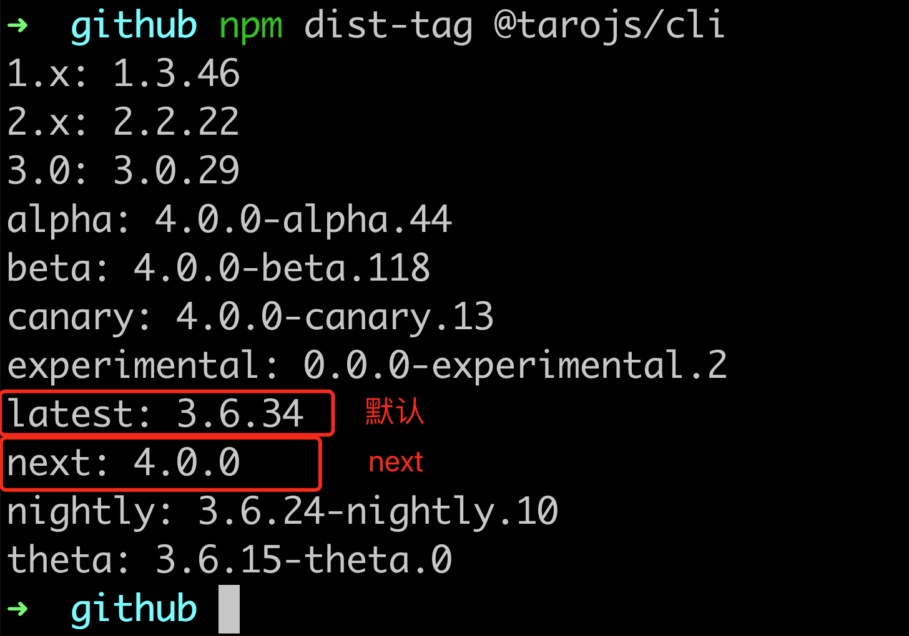

# Taro 源码揭秘 - 3. 揭开 taro init 初始化项目的背后秘密

## 1. 前言

大家好，我是[若川](https://juejin.cn/user/1415826704971918)，欢迎关注我的[公众号：若川视野](https://mp.weixin.qq.com/s/MacNfeTPODNMLLFdzrULow)。我倾力持续组织了 3 年多[每周大家一起学习 200 行左右的源码共读活动](https://juejin.cn/post/7079706017579139102)，感兴趣的可以[点此扫码加我微信 `ruochuan02` 参与](https://juejin.cn/pin/7217386885793595453)。另外，想学源码，极力推荐关注我写的专栏[《学习源码整体架构系列》](https://juejin.cn/column/6960551178908205093)，目前是掘金关注人数（5.8k+人）第一的专栏，写有几十篇源码文章。

截止目前（`2024-07-07`），`taro` 正式版是 `3.6.32`，[Taro 4.0 Beta 发布：支持开发鸿蒙应用、小程序编译模式、Vite 编译等](https://juejin.cn/post/7330792655125463067)。文章提到将于 2024 年第二季度，发布 `4.x`。所以我们直接学习 `4.x`，`4.x` 最新版本是 `4.0.0-beta.115`。

计划写一个 `taro` 源码揭秘系列，欢迎持续关注。初步计划有如下文章：

-   [x] [Taro 源码揭秘 - 1. 揭开整个架构的入口 CLI => taro init 初始化项目的秘密](https://juejin.cn/post/7378363694939783178)
-   [x] [Taro 源码揭秘 - 2. 揭开整个架构的插件系统的秘密](https://juejin.cn/spost/7380195796208205824)
-   [ ] init 初始化项目
-   [ ] cli build
-   [ ] 等等

学完本文，你将学到：

```bash
1.
等等
```

关于项目、环境准备，如何调试代码等，参考[第一篇文章-准备工作、调试](https://juejin.cn/post/7378363694939783178#heading-1)。后续文章基本不再赘述。

众所周知，我们最开始初始化项目时都是使用 `taro init` 命令，本文我们继续来学习这个命令是如何实现的。

我们可以通过[npm-dist-tag 文档](https://docs.npmjs.com/cli/v6/commands/npm-dist-tag) 命令来查看 `@tarojs/cli` 包的所有 `tag` 版本。

```bash
npm dist-tag @tarojs/cli
```

如图所示：


全局安装相对麻烦，我们不全局安装，使用 `npx` 来运行 `beta tag` 版本。

```bash
npx @tarojs/cli@beta init taro4-beta
```

这个初始化完整的过程，我用 [GIPHY CAPTURE](https://giphy.com/apps/giphycapture) 工具录制了一个`gif`，如下图所示：


我们接下来就是一步步来分析这个 `gif` 中的每一个步骤的实现原理。

## 2. init

插件机制
最终调用的是这个命令。

```ts
// packages/taro-cli/src/presets/commands/init.ts
import type { IPluginContext } from '@tarojs/service'

export default (ctx: IPluginContext) => {
  ctx.registerCommand({
    name: 'init',
    optionsMap: {
      '--name [name]': '项目名称',
      '--description [description]': '项目介绍',
      '--typescript': '使用TypeScript',
      '--npm [npm]': '包管理工具',
      '--template-source [templateSource]': '项目模板源',
      '--clone [clone]': '拉取远程模板时使用git clone',
      '--template [template]': '项目模板',
      '--css [css]': 'CSS预处理器(sass/less/stylus/none)',
      '-h, --help': 'output usage information'
    },
    async fn (opts) {
      // init project
      const { appPath } = ctx.paths
      const { options } = opts
      const { projectName, templateSource, clone, template, description, typescript, css, npm, framework, compiler, hideDefaultTemplate } = options
      const Project = require('../../create/project').default
      const project = new Project({
		// 省略若干参数...
      })

      project.create()
    }
  })
}

```

我们重点来看 `packages/taro-cli/src/create/project.ts` 的 `Project` 类的实现，和 `create` 方法。

## Project.create 创建项目

```ts
// packages/taro-cli/src/create/project.ts
export default class Project extends Creator {
  public rootPath: string
  public conf: IProjectConfOptions

  constructor (options: IProjectConfOptions) {
    super(options.sourceRoot)
    const unSupportedVer = semver.lt(process.version, 'v18.0.0')
    if (unSupportedVer) {
      throw new Error('Node.js 版本过低，推荐升级 Node.js 至 v18.0.0+')
    }
    this.rootPath = this._rootPath

    this.conf = Object.assign(
      {
        projectName: '',
        projectDir: '',
        template: '',
        description: '',
        npm: ''
      },
      options
    )
  }
}
```

`Project` 继承了 `Creator` 类。

构造函数中，使用 semver.lt 判断当前 node 版本是否低于 `v18.0.0`，如果低于则报错。
semver 是一个版本号比较库，可以用来判断 node 版本是否符合要求。它的 npm 包地址是 [https://www.npmjs.com/package/semver](https://www.npmjs.com/package/semver)。

其次就是初始化 `this.rootPath` 和 `this.conf`。

我们继续来看 `Creator` 类，构造函数中调用了 `init` 方法。

```ts
// packages/taro-cli/src/create/creator.ts
export default class Creator {
  protected _rootPath: string
  public rootPath: string

  constructor (sourceRoot?: string) {
    this.rootPath = this.sourceRoot(sourceRoot || path.join(getRootPath()))
    this.init()
  }
}
```

所以继续来看 `init` 方法。

```ts
// packages/taro-cli/src/create/project.ts
init () {
    clearConsole()
    console.log(chalk.green('Taro 即将创建一个新项目!'))
    console.log(`Need help? Go and open issue: ${chalk.blueBright('https://tls.jd.com/taro-issue-helper')}`)
    console.log()
}
```

输出就是这个图：


其中`获取 taro 全局配置成功`是指获取 `~/.taro-global-config/index.json` 文件的插件集 `presets` 和插件 `plugins`。[第一篇文章 6.2.2 config.initGlobalConfig 初始化全局配置](https://juejin.cn/post/7378363694939783178#heading-12)中有详细讲述，`spinner.succeed('获取 taro 全局配置成功')` 这里就不再赘述了。

我们来看 `create` 方法。

### project.create 创建项目

```ts
// packages/taro-cli/src/create/project.ts
async create () {
	try {
		const answers = await this.ask()
		const date = new Date()
		this.conf = Object.assign(this.conf, answers)
		this.conf.date = `${date.getFullYear()}-${date.getMonth() + 1}-${date.getDate()}`
		this.write()
	} catch (error) {
		console.log(chalk.red('创建项目失败: ', error))
	}
}
```

`create` 函数主要做了三件事：
询问用户输入项目名称、描述、模板、CSS预处理器、包管理工具等。
把用户反馈的结果和之前的配置合并起来。
写入文件，初始化模板项目。

我们来看 `ask` 方法。

## ask

```ts
// packages/taro-cli/src/create/project.ts
async ask () {
    let prompts: Record<string, unknown>[] = []
    const conf = this.conf

    this.askProjectName(conf, prompts)
    this.askDescription(conf, prompts)
    this.askFramework(conf, prompts)
    this.askTypescript(conf, prompts)
    this.askCSS(conf, prompts)
    this.askCompiler(conf, prompts)
    this.askNpm(conf, prompts)
    await this.askTemplateSource(conf, prompts)

    const answers = await inquirer.prompt<IProjectConf>(prompts)

    prompts = []
    const templates = await this.fetchTemplates(answers)
    await this.askTemplate(conf, prompts, templates)
    const templateChoiceAnswer = await inquirer.prompt<IProjectConf>(prompts)

    return {
      ...answers,
      ...templateChoiceAnswer
    }
  }
```

这个方法主要做了四件事：
1. 询问
2.

inquirer.prompt

我们继续来看 `askProjectName` 方法。后面的方法就不再赘述了，都是类似的。

## askProjectName

```ts
askProjectName: AskMethods = function (conf, prompts) {
    if ((typeof conf.projectName) !== 'string') {
      prompts.push({
        type: 'input',
        name: 'projectName',
        message: '请输入项目名称！',
        validate (input) {
          if (!input) {
            return '项目名不能为空！'
          }
          if (fs.existsSync(input)) {
            return '当前目录已经存在同名项目，请换一个项目名！'
          }
          return true
        }
      })
    } else if (fs.existsSync(conf.projectName!)) {
      prompts.push({
        type: 'input',
        name: 'projectName',
        message: '当前目录已经存在同名项目，请换一个项目名！',
        validate (input) {
          if (!input) {
            return '项目名不能为空！'
          }
          if (fs.existsSync(input)) {
            return '项目名依然重复！'
          }
          return true
        }
      })
    }
  }
```

其中 `const answers = await inquirer.prompt<IProjectConf>(prompts)` 这行，

[`inquirer`](https://www.npmjs.com/package/inquirer) 是一个命令行交互库，可以用来创建命令行程序。

简单来说 `ask` 方法就是一系列的 `inquirer` 交互。

询问用户输入项目名称、描述、框架（PReact、）、是否启用TS、CSS预处理器（）、编译工具（webpack、vite）、包管理工具（npm、yarn、pnpm）等。

## askTemplateSource

```ts
// packages/taro-cli/src/create/project.ts
askTemplateSource: AskMethods = async function (conf, prompts) {
    if (conf.template === 'default' || conf.templateSource) return

    const homedir = getUserHomeDir()
    const taroConfigPath = path.join(homedir, TARO_CONFIG_FOLDER)
    const taroConfig = path.join(taroConfigPath, TARO_BASE_CONFIG)

    let localTemplateSource: string

    // 检查本地配置
    if (fs.existsSync(taroConfig)) {
      // 存在则把模板源读出来
      const config = await fs.readJSON(taroConfig)
      localTemplateSource = config?.templateSource
    } else {
      // 不存在则创建配置
      await fs.createFile(taroConfig)
      await fs.writeJSON(taroConfig, { templateSource: DEFAULT_TEMPLATE_SRC })
      localTemplateSource = DEFAULT_TEMPLATE_SRC
    }

    const choices = [
      {
        name: 'Gitee（最快）',
        value: DEFAULT_TEMPLATE_SRC_GITEE
      },
      {
        name: 'Github（最新）',
        value: DEFAULT_TEMPLATE_SRC
      },
      {
        name: 'CLI 内置默认模板',
        value: 'default-template'
      },
      {
        name: '自定义',
        value: 'self-input'
      },
      {
        name: '社区优质模板源',
        value: 'open-source'
      }
    ]

    if (localTemplateSource && localTemplateSource !== DEFAULT_TEMPLATE_SRC && localTemplateSource !== DEFAULT_TEMPLATE_SRC_GITEE) {
      choices.unshift({
        name: `本地模板源：${localTemplateSource}`,
        value: localTemplateSource
      })
    }

    prompts.push({
      type: 'list',
      name: 'templateSource',
      message: '请选择模板源',
      choices
    }, {
      type: 'input',
      name: 'templateSource',
      message: '请输入模板源！',
      askAnswered: true,
      when (answers) {
        return answers.templateSource === 'self-input'
      }
    }, {
      type: 'list',
      name: 'templateSource',
      message: '请选择社区模板源',
      async choices (answers) {
        const choices = await getOpenSourceTemplates(answers.framework)
        return choices
      },
      askAnswered: true,
      when (answers) {
        return answers.templateSource === 'open-source'
      }
    })
  }
```

### getOpenSourceTemplates

```ts
// packages/taro-cli/src/create/project.ts
function getOpenSourceTemplates (platform: string) {
  return new Promise((resolve, reject) => {
    const spinner = ora({ text: '正在拉取开源模板列表...', discardStdin: false }).start()
    axios.get('https://gitee.com/NervJS/awesome-taro/raw/next/index.json')
      .then(response => {
        spinner.succeed(`${chalk.grey('拉取开源模板列表成功！')}`)
        const collection = response.data
        switch (platform.toLowerCase()) {
          case 'react':
            return resolve(collection.react)
          default:
            return resolve([NONE_AVAILABLE_TEMPLATE])
        }
      })
      .catch(_error => {
        spinner.fail(chalk.red('拉取开源模板列表失败！'))
        return reject(new Error())
      })
  })
}
```

## fetchTemplates

```ts
// packages/taro-cli/src/create/project.ts
async fetchTemplates (answers: IProjectConf): Promise<ITemplates[]> {
    const { templateSource, framework, compiler } = answers
    this.conf.templateSource = this.conf.templateSource || templateSource

    // 使用默认模版
    if (answers.templateSource === 'default-template') {
      this.conf.template = 'default'
      answers.templateSource = DEFAULT_TEMPLATE_SRC_GITEE
    }
    if (this.conf.template === 'default' || answers.templateSource === NONE_AVAILABLE_TEMPLATE) return Promise.resolve([])

    // 从模板源下载模板
    const isClone = /gitee/.test(this.conf.templateSource) || this.conf.clone
    const templateChoices = await fetchTemplate(this.conf.templateSource, this.templatePath(''), isClone)

    const filterFramework = (_framework) => {
      const current = framework.toLowerCase()
      if (typeof _framework === 'string' && _framework) {
        return current === _framework.toLowerCase()
      } else if (isArray(_framework)) {
        return _framework?.map(name => name.toLowerCase()).includes(current)
      } else {
        return true
      }
    }

    const filterCompiler = (_compiler) => {
      if (_compiler && isArray(_compiler)) {
        return _compiler?.includes(compiler)
      }
      return true
    }

    // 根据用户选择的框架筛选模板
    const newTemplateChoices: ITemplates[] = templateChoices
      .filter(templateChoice => {
        const { platforms, compiler } = templateChoice
        return filterFramework(platforms) && filterCompiler(compiler)
      })

    return newTemplateChoices
  }
```

### fetchTemplate

```ts
// packages/taro-cli/src/create/fetchTemplate.ts
import * as path from 'node:path'

import { chalk, fs } from '@tarojs/helper'
import * as AdmZip from 'adm-zip'
import axios from 'axios'
import * as download from 'download-git-repo'
import * as ora from 'ora'

import { getTemplateSourceType, readDirWithFileTypes } from '../util'
import { TEMPLATE_CREATOR } from './constants'

export interface ITemplates {
  name: string
  value: string
  platforms?: string | string[]
  desc?: string
  compiler?: string[]
}

const TEMP_DOWNLOAD_FOLDER = 'taro-temp'

export default function fetchTemplate (templateSource: string, templateRootPath: string, clone?: boolean): Promise<ITemplates[]> {
  const type = getTemplateSourceType(templateSource)
  const tempPath = path.join(templateRootPath, TEMP_DOWNLOAD_FOLDER)
  let name: string
  // eslint-disable-next-line no-async-promise-executor
  return new Promise<void>(async (resolve) => {
    // 下载文件的缓存目录
    if (fs.existsSync(tempPath)) await fs.remove(tempPath)
    await fs.mkdir(tempPath)

    const spinner = ora(`正在从 ${templateSource} 拉取远程模板...`).start()

    if (type === 'git') {
      name = path.basename(templateSource)
      download(templateSource, path.join(tempPath, name), { clone }, async error => {
        if (error) {
          console.log(error)
          spinner.color = 'red'
          spinner.fail(chalk.red('拉取远程模板仓库失败！'))
          await fs.remove(tempPath)
          return resolve()
        }
        spinner.color = 'green'
        spinner.succeed(`${chalk.grey('拉取远程模板仓库成功！')}`)
        resolve()
      })
    } else if (type === 'url') {
      // url 模板源，因为不知道来源名称，临时取名方便后续开发者从列表中选择
      name = 'from-remote-url'
      const zipPath = path.join(tempPath, name + '.zip')
      const unZipPath = path.join(tempPath, name)
      axios.get<fs.ReadStream>(templateSource, { responseType: 'stream' })
        .then(response => {
          const ws = fs.createWriteStream(zipPath)
          response.data.pipe(ws)
          ws.on('finish', () => {
            // unzip
            const zip = new AdmZip(zipPath)
            zip.extractAllTo(unZipPath, true)
            const files = readDirWithFileTypes(unZipPath).filter(
              file => !file.name.startsWith('.') && file.isDirectory && file.name !== '__MACOSX'
            )

            if (files.length !== 1) {
              spinner.color = 'red'
              spinner.fail(chalk.red(`拉取远程模板仓库失败！\n${new Error('远程模板源组织格式错误')}`))
              return resolve()
            }
            name = path.join(name, files[0].name)

            spinner.color = 'green'
            spinner.succeed(`${chalk.grey('拉取远程模板仓库成功！')}`)
            resolve()
          })
          ws.on('error', error => { throw error })
        })
        .catch(async error => {
          spinner.color = 'red'
          spinner.fail(chalk.red(`拉取远程模板仓库失败！\n${error}`))
          await fs.remove(tempPath)
          return resolve()
        })
    }
  }).then(async () => {
    const templateFolder = name ? path.join(tempPath, name) : ''

    // 下载失败，只显示默认模板
    if (!fs.existsSync(templateFolder)) return Promise.resolve([])

    const isTemplateGroup = !(
      fs.existsSync(path.join(templateFolder, 'package.json')) ||
      fs.existsSync(path.join(templateFolder, 'package.json.tmpl'))
    )

    if (isTemplateGroup) {
      // 模板组
      const files = readDirWithFileTypes(templateFolder)
        .filter(file => !file.name.startsWith('.') && file.isDirectory && file.name !== '__MACOSX')
        .map(file => file.name)
      await Promise.all(
        files.map(file => {
          const src = path.join(templateFolder, file)
          const dest = path.join(templateRootPath, file)
          return fs.move(src, dest, { overwrite: true })
        })
      )
      await fs.remove(tempPath)

      const res: ITemplates[] = files.map(name => {
        const creatorFile = path.join(templateRootPath, name, TEMPLATE_CREATOR)

        if (!fs.existsSync(creatorFile)) return { name, value: name }
        const { name: displayName, platforms = '', desc = '', compiler } = require(creatorFile)

        return {
          name: displayName || name,
          value: name,
          platforms,
          compiler,
          desc
        }
      })
      return Promise.resolve(res)
    } else {
      // 单模板
      await fs.move(templateFolder, path.join(templateRootPath, name), { overwrite: true })
      await fs.remove(tempPath)

      let res: ITemplates = { name, value: name, desc: type === 'url' ? templateSource : '' }

      const creatorFile = path.join(templateRootPath, name, TEMPLATE_CREATOR)

      if (fs.existsSync(creatorFile)) {
        const { name: displayName, platforms = '', desc = '', compiler } = require(creatorFile)

        res = {
          name: displayName || name,
          value: name,
          platforms,
          compiler,
          desc: desc || templateSource
        }
      }

      return Promise.resolve([res])
    }
  })
}

```

## write

```ts
write (cb?: () => void) {
    this.conf.src = SOURCE_DIR
    const { projectName, projectDir, template, autoInstall = true, framework, npm } = this.conf as IProjectConf
    // 引入模板编写者的自定义逻辑
    const templatePath = this.templatePath(template)
    const handlerPath = path.join(templatePath, TEMPLATE_CREATOR)
    const handler = fs.existsSync(handlerPath) ? require(handlerPath).handler : {}
    createProject({
      projectRoot: projectDir,
      projectName,
      template,
      npm,
      framework,
      css: this.conf.css || CSSType.None,
      autoInstall: autoInstall,
      templateRoot: getRootPath(),
      version: getPkgVersion(),
      typescript: this.conf.typescript,
      date: this.conf.date,
      description: this.conf.description,
      compiler: this.conf.compiler,
      period: PeriodType.CreateAPP,
    }, handler).then(() => {
      cb && cb()
    })
  }
```

createProject 绑定实现 rust

## template

```ts
const path = require('path')

function createWhenTs (err, params) {
  return !!params.typescript
}

function normalizePath (path) {
  return path.replace(/\\/g, '/').replace(/\/{2,}/g, '/')
}

const SOURCE_ENTRY = '/src'
const PAGES_ENTRY = '/src/pages'

const handler = {
  '/tsconfig.json': createWhenTs,
  '/types/global.d.ts': createWhenTs,
  '/types/vue.d.ts' (err, { framework, typescript }) {
    return ['Vue3'].includes(framework) && !!typescript
  },
  '/src/pages/index/index.jsx' (err, { pageDir = '', pageName = '', subPkg = '' }) {
    return {
      setPageName: normalizePath(path.join(PAGES_ENTRY, pageDir, pageName, 'index.jsx')),
      setSubPkgName: normalizePath(path.join(SOURCE_ENTRY, subPkg, pageDir, pageName, 'index.jsx'))
    }
  },
  '/src/pages/index/index.css' (err, { pageDir = '', pageName = '', subPkg = '' }) {
    return {
      setPageName: normalizePath(path.join(PAGES_ENTRY, pageDir, pageName, 'index.css')),
      setSubPkgName: normalizePath(path.join(SOURCE_ENTRY, subPkg, pageDir, pageName, 'index.css'))
    }
  },
  '/src/pages/index/index.vue' (err, { pageDir = '', pageName = '', subPkg = '' }) {
    return {
      setPageName: normalizePath(path.join(PAGES_ENTRY, pageDir, pageName, 'index.vue')),
      setSubPkgName: normalizePath(path.join(SOURCE_ENTRY, subPkg, pageDir, pageName, 'index.vue'))
    }
  },
  '/src/pages/index/index.config.js' (err, { pageDir = '', pageName = '', subPkg = '' }) {
    return {
      setPageName: normalizePath(path.join(PAGES_ENTRY, pageDir, pageName, 'index.config.js')),
      setSubPkgName: normalizePath(path.join(SOURCE_ENTRY, subPkg, pageDir, pageName, 'index.config.js'))
    }
  },
  '/_editorconfig' () {
    return { setPageName: `/.editorconfig` }
  },
  '/_env.development' () {
    return { setPageName: `/.env.development` }
  },
  '/_env.production' () {
    return { setPageName: `/.env.production` }
  },
  '/_env.test' () {
    return { setPageName: `/.env.test` }
  },
  '/_eslintrc' () {
    return { setPageName: `/.eslintrc` }
  },
  '/_gitignore' () {
    return { setPageName: `/.gitignore` }
  }
}

const basePageFiles = [
  '/src/pages/index/index.jsx',
  '/src/pages/index/index.vue',
  '/src/pages/index/index.css',
  '/src/pages/index/index.config.js'
]

module.exports = {
  handler,
  basePageFiles
}

```

[解锁前端新潜能：如何使用 Rust 锈化前端工具链](https://juejin.cn/post/7321410906426998810)

## rust createProject

```rs
#[napi]
pub async fn create_project(
  conf: Project,
  handlers: HashMap<String, ThreadsafeFunction<CreateOptions>>,
) -> Result<()> {
  let project: Project = Project::new(
    conf.project_root,
    conf.project_name,
    conf.npm,
    conf.description,
    conf.typescript,
    conf.template,
    conf.css,
    conf.framework,
    conf.auto_install,
    conf.template_root,
    conf.version,
    conf.date,
    conf.compiler,
    conf.period,
  );
  let mut thread_safe_functions = HashMap::new();
  for (key, callback) in handlers {
    thread_safe_functions.insert(key, callback);
  }
  if let Err(e) = project.create(thread_safe_functions).await {
    println!("创建项目错误，原因如下：");
    println!("{:?}", e);
    return Err(napi::Error::from_reason(format!("{:?}", e)));
  }
  Ok(())
}
```

## create

```rs
// crates/taro_init/src/project.rs
pub async fn create(
    &self,
    js_handlers: HashMap<String, ThreadsafeFunction<CreateOptions>>,
  ) -> anyhow::Result<()> {
    let project_path = PathBuf::from(&self.project_root).join(&self.project_name);
    let project_path_str = project_path.to_string_lossy().to_string();
    let creator = Creator::new(self.template_root.clone(), project_path_str.clone());
    let template_path = creator.get_template_path(&[&self.template]);
    let filter = &FILE_FILTER;
    let all_files = get_all_files_in_folder(template_path.clone(), filter, None)?;
    let mut create_options = CreateOptions {
      css: Some(self.css.clone()),
      css_ext: None,
      framework: Some(self.framework.clone()),
      description: self.description.clone(),
      project_name: self.project_name.clone(),
      version: Some(self.version.clone()),
      date: self.date.clone(),
      typescript: self.typescript.clone(),
      template: self.template.clone(),
      page_name: Some("index".to_string()),
      compiler: self.compiler.clone(),
      set_page_name: None,
      set_sub_pkg_page_name: None,
      sub_pkg: None,
      page_dir: None,
      change_ext: None,
      is_custom_template: None,
      plugin_type: None,
    };
    let all_files = all_files.iter().filter_map(|f| f.to_str()).collect::<Vec<_>>();
    println!();
    println!(
      "{} {}",
      style("✔").green(),
      format!(
        "{}{}",
        style("创建项目: ").color256(238),
        style(self.project_name.as_str()).color256(238).bold()
      )
    );
    creator
      .create_files(
        all_files.as_slice(),
        template_path.as_str(),
        &mut create_options,
        &js_handlers,
      )
      .await?;
    // 当选择 rn 模板时，替换默认项目名
    if self.template.eq("react-native") {
      change_default_name_in_template(
        &self.project_name,
        template_path.as_str(),
        project_path_str.as_str(),
      )
      .await?;
    }
    println!();
    init_git(&self.project_name, project_path_str.as_str())?;
    let auto_install = self.auto_install.unwrap_or(true);
    if auto_install {
      install_deps(&self.npm, || self.call_success()).await?;
    } else {
      self.call_success();
    }
    Ok(())
  }
```


### creator.create_files

```rs
// crates/taro_init/src/creator.rs
pub async fn create_files(
    &self,
    files: &[&str],
    template_path: &str,
    options: &mut CreateOptions,
    js_handlers: &HashMap<String, ThreadsafeFunction<CreateOptions>>,
  ) -> anyhow::Result<()> {
    let current_style_ext = STYLE_EXT_MAP
      .get(&options.css.unwrap_or(CSSType::None))
      .unwrap_or(&"css");
    options.css_ext = Some(current_style_ext.to_string());
    for file in files {
      let file_relative_path = normalize_path_str(file.replace(template_path, "").as_str());
      let framework = options.framework;
      let is_vue_framework = framework.is_some_and(|framework| framework == FrameworkType::Vue3);
      if is_vue_framework && file_relative_path.ends_with(".jsx") {
        continue;
      }
      if !is_vue_framework && file_relative_path.ends_with(".vue") {
        continue;
      }
      let mut need_create_file = true;
      let mut page_name = file_relative_path.clone();
      let mut change_ext = true;
      let is_typescript = options.typescript.unwrap_or(false);
      // let is_custom_template = options.is_custom_template.unwrap_or(false);
      if js_handlers.contains_key(&file_relative_path) {
        let js_handler = js_handlers.get(&file_relative_path).unwrap().clone();
        let result = js_handler
          .call_async::<JSReturn>(Ok(options.clone()))
          .await
          .with_context(|| format!("模板自定义函数调用失败: {}", file_relative_path))?;
        match result {
          JSReturn::Boolean(boolean) => {
            need_create_file = boolean;
          }
          JSReturn::Object(obj) => {
            let set_page_name = obj.set_page_name;
            let change_ext_re = obj.change_ext;
            let set_sub_pkg_page_name = obj.set_sub_pkg_page_name;
            let sub_pkg = &options.sub_pkg;
            if sub_pkg.is_some() {
              // 创建分包页面模式
              if let Some(set_sub_pkg_page_name) = set_sub_pkg_page_name {
                page_name = set_sub_pkg_page_name;
              }
            } else {
              if let Some(set_page_name) = set_page_name {
                page_name = set_page_name;
              }
            }
            if let Some(change_ext_re) = change_ext_re {
              change_ext = change_ext_re;
            }
          }
        };
      }
      if need_create_file {
        let mut dest_re_path = page_name;
        if dest_re_path.starts_with("/") {
          dest_re_path = dest_re_path[1..].to_string();
        }
        if is_typescript
          && change_ext
          && (dest_re_path.ends_with(".js") || dest_re_path.ends_with(".jsx"))
          && !(dest_re_path.ends_with("babel.config.js") || dest_re_path.ends_with(".eslintrc.js"))
        {
          dest_re_path = dest_re_path.replace(".js", ".ts");
        }
        if change_ext && dest_re_path.ends_with(".css") {
          dest_re_path = dest_re_path.replace(".css", format!(".{}", current_style_ext).as_str());
        }
        let file_relative_path = format!("{}{}", template_path, file_relative_path);
        // if is_custom_template {
        //   file_relative_path = format!("{}/{}", template_path, file_relative_path);
        // }
        let dest_path = self.get_destination_path(&[&dest_re_path]);
        let from_path: String = PathBuf::from(file_relative_path)
          .to_string_lossy()
          .to_string();
        self
          .tempate(from_path.as_str(), dest_path.as_str(), &options.clone())
          .await?;
        println!(
          "{} {}",
          style("✔").green(),
          style("创建文件: ".to_owned() + dest_path.as_str()).color256(238)
        );
      }
    }
    Ok(())
  }
```

### creator.tempate

```rs
// crates/taro_init/src/creator.rs

pub async fn tempate(
    &self,
    from_path: &str,
    dest_path: &str,
    options: &CreateOptions,
  ) -> anyhow::Result<()> {
    if MEDIA_REGEX.is_match(from_path) {
      let dir_name = PathBuf::from(dest_path)
        .parent()
        .unwrap()
        .to_string_lossy()
        .to_string();
      async_fs::create_dir_all(&dir_name)
        .await
        .with_context(|| format!("文件夹创建失败: {}", dir_name))?;
      async_fs::copy(from_path, dest_path)
        .await
        .with_context(|| format!("文件复制失败: {}", from_path))?;
      return Ok(());
    }
    generate_with_template(from_path, dest_path, options).await?;
    Ok(())
  }
```

### utils generate_with_template

```rs
// crates/taro_init/src/utils.rs
pub async fn generate_with_template(from_path: &str, dest_path: &str, data: &impl serde::Serialize) -> anyhow::Result<()> {
  let form_template = async_fs::read(from_path).await.with_context(|| format!("文件读取失败: {}", from_path))?;
  let from_template = String::from_utf8_lossy(&form_template);
  let template = if from_template == "" {
    "".to_string()
  } else {
    HANDLEBARS.render_template(&from_template, data).with_context(|| format!("模板渲染失败: {}", from_path))?
  };
  let dir_name = Path::new(dest_path).parent().unwrap().to_string_lossy().to_string();
  async_fs::create_dir_all(&dir_name).await.with_context(|| format!("文件夹创建失败: {}", dir_name))?;
  let metadata = async_fs::metadata(from_path).await.with_context(|| format!("文件读取失败: {}", from_path))?;
  async_fs::write(dest_path, template).await.with_context(|| format!("文件写入失败: {}", dest_path))?;
  #[cfg(unix)]
  async_fs::set_permissions(dest_path, metadata.permissions()).await.with_context(|| format!("文件权限设置失败: {}", dest_path))?;
  Ok(())
}
```

## 总结

命令行交互式选择使用的是 [inquirer](https://www.npmjs.com/package/inquirer) `inquirer.prompt` 实现。
创建文件部分是使用 rust 实现的。
模板部分使用的是 [handlebars](https://github.com/sunng87/handlebars-rust) 实现。


[Handlebars](https://handlebarsjs.com/zh/guide/#%E4%BB%A3%E7%A0%81%E7%89%87%E6%AE%B5)

[handlebars 用法](https://handlebarsjs.com/zh/installation/#%E7%94%A8%E6%B3%95)

[handlebars-rust实现](https://github.com/sunng87/handlebars-rust)

[crates/handlebars](https://crates.io/crates/handlebars)

[rust-lang.org](https://www.rust-lang.org/zh-CN/)


----

**如果看完有收获，欢迎点赞、评论、分享、收藏支持。你的支持和肯定，是我写作的动力**。

作者：常以**若川**为名混迹于江湖。所知甚少，唯善学。[若川的博客](https://ruochuan12.github.io)

最后可以持续关注我[@若川](https://juejin.cn/user/1415826704971918)，欢迎关注我的[公众号：若川视野](https://mp.weixin.qq.com/s/MacNfeTPODNMLLFdzrULow)。我倾力持续组织了 3 年多[每周大家一起学习 200 行左右的源码共读活动](https://juejin.cn/post/7079706017579139102)，感兴趣的可以[点此扫码加我微信 `ruochuan02` 参与](https://juejin.cn/pin/7217386885793595453)。另外，想学源码，极力推荐关注我写的专栏[《学习源码整体架构系列》](https://juejin.cn/column/6960551178908205093)，目前是掘金关注人数（5.8k+人）第一的专栏，写有几十篇源码文章。
