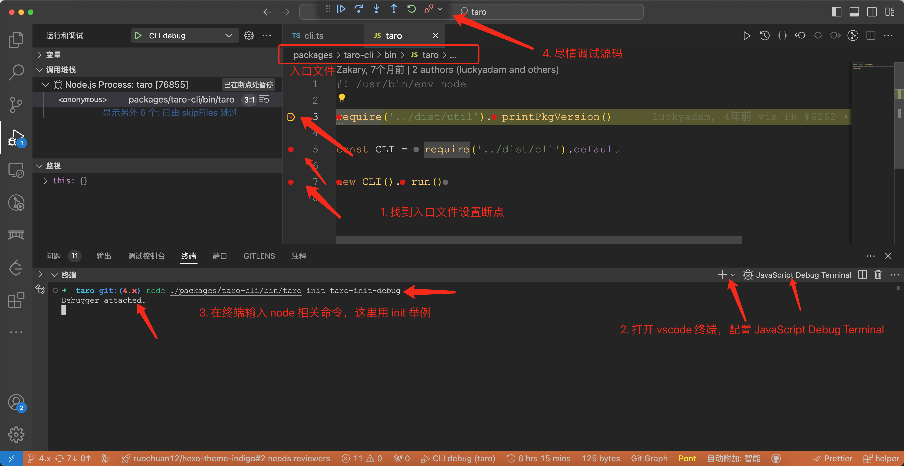
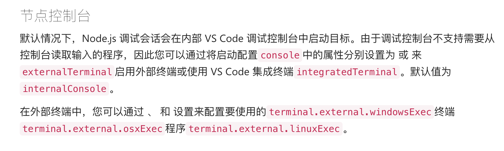
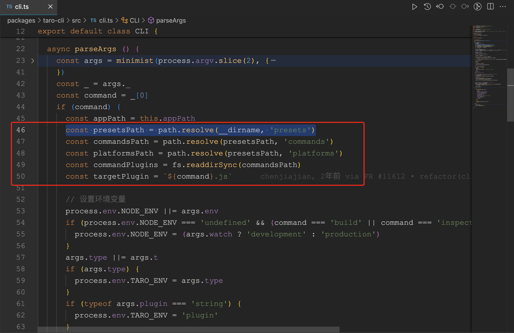
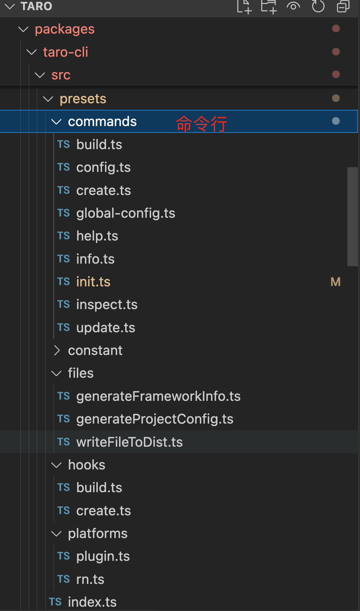
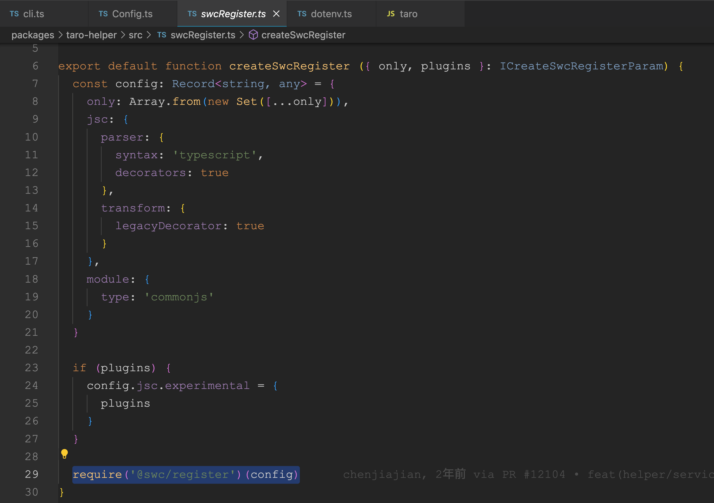
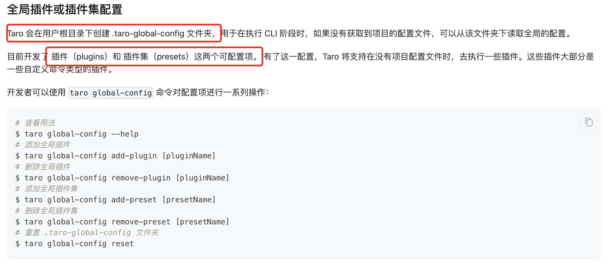
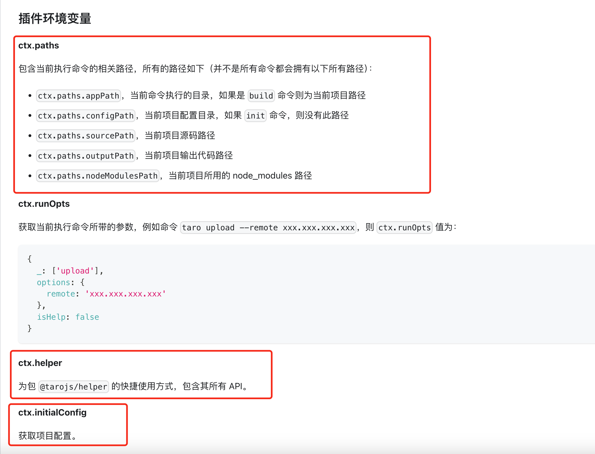
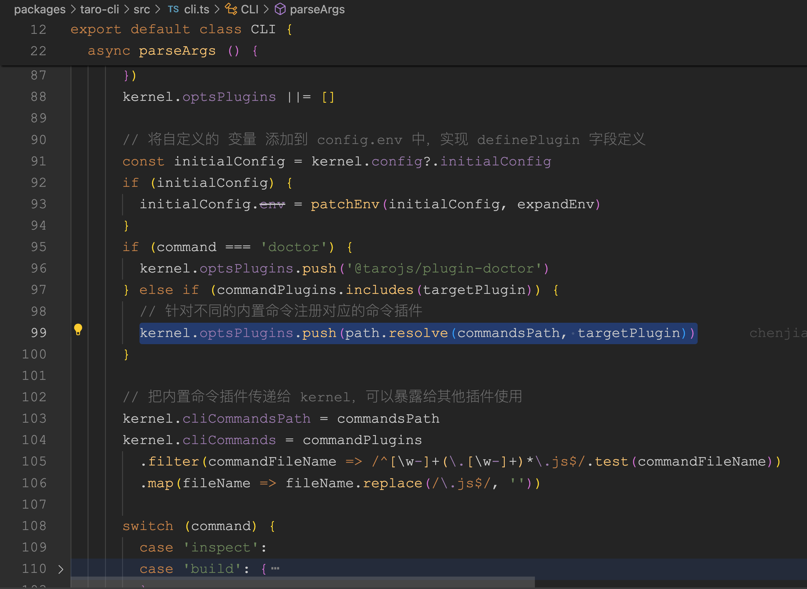

# taro 源码 cli

## 1. 前言

大家好，我是[若川](https://juejin.cn/user/1415826704971918)，欢迎 `follow` [我的 github](https://github.com/ruochuan12)。我倾力持续组织了 3 年多[每周大家一起学习 200 行左右的源码共读活动](https://juejin.cn/post/7079706017579139102)，感兴趣的可以[点此扫码加我微信 `ruochuan02` 参与](https://juejin.cn/pin/7217386885793595453)。另外，想学源码，极力推荐关注我写的专栏[《学习源码整体架构系列》](https://juejin.cn/column/6960551178908205093)，目前是掘金关注人数（5.8k+人）第一的专栏，写有 30 余篇源码文章。

截止目前（`2024-05-28`），`taro` 正式版是 `3.6.30`，[Taro 4.0 Beta 发布：支持开发鸿蒙应用、小程序编译模式、Vite 编译等](https://juejin.cn/post/7330792655125463067)。文章提到将于 2024 年第二季度，发布 `4.x`。所以我们直接学习 `4.x`，`4.x` 最新版本是 `4.0.0-beta.79`。

计划写一个 taro 源码系列。

## 2. 准备工作

```bash
# 克隆项目
git clone https://github.com/NervJS/taro.git
# 当前分支
git checkout 4.x
# 写文章时，项目当前 hash
git checkout d08d4b7faa6773e4f14c31ecdb6b5ebdc8787c76
# 当前版本
# 4.0.0-beta.79
```

后续文章尽量会与 `taro` 版本保持更新。

看一个开源项目，第一步应该是先看 [README.md](https://github.com/NervJS/taro.git) 再看 [贡献文档](https://github.com/NervJS/taro/blob/4.x/CONTRIBUTING.md) 和 `package.json`。

环境准备

> 需要安装 [Node.js 16](https://nodejs.org/en/)（建议安装 `16.20.0` 及以上版本）及 [pnpm 7](https://pnpm.io/zh/installation)

我使用的环境：`mac pro m1 pro`，当然 `Windows` 一样可以。

一般用 [nvm](https://github.com/nvm-sh/nvm) 管理 `node` 版本。

```zsh
nvm install 18
nvm use 18
# 可以把 node 默认版本设置为 18，调试时会使用默认版本
nvm alias default 18

pnpm -v
# 9.1.1
node -v
# v18.20.2

cd taro
# 安装依赖
pnpm i
# 编译构建
pnpm build
```

```bash
# 删除根目录的 node_modules 和所有 workspace 里的 node_modules
$ pnpm run clear-all
# 对应的是：rimraf **/node_modules
# mac 下可以用 rm -rf **/node_modules
```

安装依赖可能会报错。


```bash
Failed to set up Chromium r1108766! Set "PUPPETEER_SKIP_DOWNLOAD" env variable to skip download.
```

通过谷歌等搜索引擎可以找到解决方法。

[stackoverflow](https://stackoverflow.com/questions/63187371/puppeteer-is-not-able-to-install-error-failed-to-set-up-chromium-r782078-set)

Mac : `export PUPPETEER_SKIP_DOWNLOAD='true'`
Windows: `SET PUPPETEER_SKIP_DOWNLOAD='true'`

pnpm build 完成，如下图所示：


## 3. 调试

package.json

```json
// packages/taro-cli/package.json
{
	"name": "@tarojs/cli",
	"version": "4.0.0-beta.79",
	"description": "cli tool for taro",
	"main": "index.js",
	"types": "dist/index.d.ts",
	"bin": {
		"taro": "bin/taro"
	}
}
```

### 3.1 入口文件 packages/taro-cli/bin/taro

```js
// packages/taro-cli/bin/taro

#! /usr/bin/env node

require("../dist/util").printPkgVersion();

const CLI = require("../dist/cli").default;

new CLI().run();
```

### 3.2 调试方法 1 JavaScript Debug Terminal

可参考我的文章[新手向：前端程序员必学基本技能——调试 JS 代码](https://juejin.cn/post/7030584939020042254)，或者[据说 90%的人不知道可以用测试用例(Vitest)调试开源项目(Vue3) 源码](https://juejin.cn/post/7212263304394981432)

简而言之就是以下步骤：

```bash
1. 找到入口文件设置断点
2. ctrl + `\`` (反引号) 打开终端，配置`JavaScript调试终端`
3. 在终端输入 `node` 相关命令，这里用 `init` 举例
4. 尽情调试源码
```

```bash
node ./packages/taro-cli/bin/taro init taro-init-debug
```

如下图所示：



调试时应该会报错 `binding` `taro.[os-platform].node`。如下图所示：


运行等过程报错，不要慌。可能是我们遗漏了一些细节，贡献文档等应该会给出答案。所以再来看下 [贡献文档-10-rust-部分](https://github.com/NervJS/taro/blob/4.x/CONTRIBUTING.md#10-rust-%E9%83%A8%E5%88%86)


通过 [rustup](https://rustup.rs) 找到安装命令：

```bash
curl --proto '=https' --tlsv1.2 -sSf https://sh.rustup.rs | sh
```

安装完成后，执行 `pnpm run build:binding:debug` 或 `pnpm run binding:release` 编译出文件：`crates/native_binding/taro.darwin-arm64.node`。

就完美解决了，调试时不会报错了。

### 3.3 调试方式 2 配置 .vscode/launch.json

[taro 文档 - 单步调测配置](https://docs.taro.zone/docs/debug-config/)
写的挺好的，通过配置 `launch.json` 来调试，在此就不再赘述了。

不过补充一条：`launch.json` 文件可以添加一条以下这样的配置，就可以在调试终端输入内容。

```json
{
	"version": "0.2.0",
	"configurations": [
		{
			"type": "node",
			// 省略其他配置...
			"console": "integratedTerminal"
		}
	]
}
```

[vscode nodejs 调试](https://code.visualstudio.com/docs/nodejs/nodejs-debugging#_node-console)

`console- 启动程序的控制台（internalConsole，integratedTerminal，externalTerminal）。`



```js
// packages/taro-cli/bin/taro

#! /usr/bin/env node

require("../dist/util").printPkgVersion();

const CLI = require("../dist/cli").default;

new CLI().run();
```

我们跟着断点进入，入口文件中的第一句`require("../dist/util").printPkgVersion();` `printPkgVersion` 函数。

## 4. taro-cli/src/utils/index.ts

```js
// packages/taro-cli/src/util/index.ts
import * as path from 'path'

export function getRootPath (): string {
  return path.resolve(__dirname, '../../')
}

export function getPkgVersion (): string {
  return require(path.join(getRootPath(), 'package.json')).version
}

export function printPkgVersion () {
  console.log(`👽 Taro v${getPkgVersion()}`)
  console.log()
}
```

可以看出这句输出的是 `taro/packages/taro-cli/package.json` 的版本号。

```js
👽 Taro v4.0.0-beta.79
```

我们继续跟着断点，进入第二第三句，可以进入到 `packages/taro-cli/src/cli.ts` 这个文件。

## 5. packages/taro-cli/src/cli.ts 整体结构

我们先来看下这个文件的整体结构。`class CLI` 一个 appPath 属性（一般指 `taro` 工作目录），两个函数 `run` 和 `parseArgs`。

```js
// taro/packages/taro-cli/src/cli.ts
export default class CLI {
	appPath: string;
	constructor(appPath) {
		this.appPath = appPath || process.cwd();
	}

	run() {
		return this.parseArgs();
	}

	async parseArgs() {
		const args = minimist(process.argv.slice(2), {
			alias: {
				// 省略一些别名设置 ...
			},
			boolean: ["version", "help", "disable-global-config"],
			default: {
				build: true,
			},
		});
		const _ = args._;
		// init、build 等
		const command = _[0];
		if (command) {
			// 省略若干代码
		} else {
			if (args.h) {
				// 输出帮助信息
				// 省略代码
			} else if (args.v) {
				// 输出版本号
				console.log(getPkgVersion());
			}
		}
	}
}
```

使用了[minimist](https://github.com/minimistjs/minimist)，参数解析工具。

同类工具还有：
[commander](https://github.com/tj/commander.js)，命令行工具。功能齐全的框架，提供类似 git 的子命令系统，自动生成帮助信息等。有很多知名的 `cli` 都是用的这个[commander](https://www.npmjs.com/browse/depended/commander)。比如：[`vue-cli`](https://github.com/vuejs/vue-cli/blob/dev/packages/%40vue/cli/bin/vue.js#L37)、[`webpack-cli`](https://github.com/webpack/webpack-cli/blob/master/packages/webpack-cli/src/webpack-cli.ts#L64) 和 [`create-react-app`](https://github.com/facebook/create-react-app/blob/main/packages/create-react-app/createReactApp.js#L59) 用的是这个。

[cac](https://github.com/cacjs/cac)，类似 `Commander.js` 但更轻巧、现代，支持插件。也有很多使用这个[cac npm](https://www.npmjs.com/package/cac?activeTab=dependents)，比如[`vite`](https://www.npmjs.com/package/vite?activeTab=dependencies) 使用的是这个。

[yargs](https://github.com/yargs/yargs)，交互式命令行工具。功能强大的框架，但显得过于臃肿。

## 5.1 cli parseArgs

### presets



`presets` 对应的目录结构如图所示：

;

### Config


`64-78` 行代码，代码量相对较少，就不截图了，直接贴代码了。

```js
// packages/taro-cli/src/cli.ts
// 这里解析 dotenv 以便于 config 解析时能获取 dotenv 配置信息
const expandEnv = dotenvParse(appPath, args.envPrefix, mode);

const disableGlobalConfig = !!(
	args["disable-global-config"] ||
	DISABLE_GLOBAL_CONFIG_COMMANDS.includes(command)
);

const configEnv = {
	mode,
	command,
};
const config = new Config({
	appPath: this.appPath,
	disableGlobalConfig: disableGlobalConfig,
});
await config.init(configEnv);
```

`dotenvParse` 函数简单来说就是通过 [dotenv](https://github.com/motdotla/dotenv) 和 [dotenv-expand](https://github.com/motdotla/dotenv-expand) 解析 `.env`、`.env.development`、`.env.production` 等文件和变量的。

> `dotenv` 是一个零依赖模块，可将 `.env` 文件中的环境变量加载到 `process.env` 中。

我之前写过一篇 [面试官：项目中常用的 .env 文件原理是什么？如何实现？](https://juejin.cn/post/7045057475845816357)

```ts
// packages/taro-service/src/Config.ts
export default class Config {
	appPath: string;
	configPath: string;
	initialConfig: IProjectConfig;
	initialGlobalConfig: IProjectConfig;
	isInitSuccess: boolean;
	disableGlobalConfig: boolean;

	constructor(opts: IConfigOptions) {
		this.appPath = opts.appPath;
		this.disableGlobalConfig = !!opts?.disableGlobalConfig;
	}
	async init(configEnv: { mode: string; command: string }) {
		// 代码省略
	}
	initGlobalConfig() {
		// 代码省略
	}
	getConfigWithNamed(platform, configName) {
		// 代码省略
	}
}
```

#### config.init

读取的是 `config/index` `.ts` 或者 `.js` 后缀。

```ts
async init (configEnv: {
    mode: string
    command: string
  }) {
    this.initialConfig = {}
    this.initialGlobalConfig = {}
    this.isInitSuccess = false
    this.configPath = resolveScriptPath(path.join(this.appPath, CONFIG_DIR_NAME, DEFAULT_CONFIG_FILE))
    if (!fs.existsSync(this.configPath)) {
      if (this.disableGlobalConfig) return
      this.initGlobalConfig()
    } else {
      createSwcRegister({
        only: [
          filePath => filePath.indexOf(path.join(this.appPath, CONFIG_DIR_NAME)) >= 0
        ]
      })
      try {
        const userExport = getModuleDefaultExport(require(this.configPath))
        this.initialConfig = typeof userExport === 'function' ? await userExport(merge, configEnv) : userExport
        this.isInitSuccess = true
      } catch (err) {
        console.log(err)
      }
    }
  }
```

值得一提的是：



`createSwcRegister` 使用了 [`@swc/register`](https://www.npmjs.com/package/@swc/register) 来编译 `ts` 等转换成 `commonjs`。可以直接用 `require`。

> 使用 swc 的方法之一是通过 `require` 钩子。`require` 钩子会将自身绑定到 `node` 的 `require` 并自动动态编译文件。不过现在更推荐 [@swc-node/register](https://www.npmjs.com/package/@swc-node/register)。

```ts
export const getModuleDefaultExport = (exports) =>
	exports.__esModule ? exports.default : exports;
```

`this.initialConfig = typeof userExport === 'function' ? await userExport(merge, configEnv) : userExport`。这句就是 `config/index.ts` 支持函数也支持对象的实现。

``

#### config.initGlobalConfig

读取配置 `~/.taro-global-config/index.json`。

```json
{
  "plugins": [],
  "presets": []
}
```

```ts
initGlobalConfig () {
    const homedir = getUserHomeDir()
    if (!homedir) return console.error('获取不到用户 home 路径')
    const globalPluginConfigPath = path.join(getUserHomeDir(), TARO_GLOBAL_CONFIG_DIR, TARO_GLOBAL_CONFIG_FILE)
    if (!fs.existsSync(globalPluginConfigPath)) return
    const spinner = ora(`开始获取 taro 全局配置文件： ${globalPluginConfigPath}`).start()
    try {
      this.initialGlobalConfig = fs.readJSONSync(globalPluginConfigPath) || {}
      spinner.succeed('获取 taro 全局配置成功')
    } catch (e) {
      spinner.stop()
      console.warn(`获取全局配置失败，如果需要启用全局插件请查看配置文件: ${globalPluginConfigPath} `)
    }
  }
```

[全局插件或插件集配置](https://docs.taro.zone/docs/next/cli/#%E5%85%A8%E5%B1%80%E6%8F%92%E4%BB%B6%E6%88%96%E6%8F%92%E4%BB%B6%E9%9B%86%E9%85%8D%E7%BD%AE)



### Kernel

```ts
// 省略若干代码
const kernel = new Kernel({
	appPath,
	presets: [path.resolve(__dirname, ".", "presets", "index.js")],
	config,
	plugins: [],
});
kernel.optsPlugins ||= [];
```

```ts
// packages/taro-service/src/Kernel.ts
export default class Kernel extends EventEmitter {
	constructor(options: IKernelOptions) {
		super();
		this.debugger =
			process.env.DEBUG === "Taro:Kernel"
				? helper.createDebug("Taro:Kernel")
				: function () {};
		this.appPath = options.appPath || process.cwd();
		this.optsPresets = options.presets;
		this.optsPlugins = options.plugins;
		this.config = options.config;
		this.hooks = new Map();
		this.methods = new Map();
		this.commands = new Map();
		this.platforms = new Map();
		this.initHelper();
		this.initConfig();
		this.initPaths();
		this.initRunnerUtils();
	}
}
```

```ts
export const createDebug = (id: string) => require("debug")(id);
```

调用的 [debug](https://www.npmjs.com/package/debug)。
>一个仿照 `Node.js` 核心调试技术的微型 `JavaScript` 调试实用程序。适用于 `Node.js` 和 `Web` 浏览器。

```ts
initConfig () {
	this.initialConfig = this.config.initialConfig
	this.initialGlobalConfig = this.config.initialGlobalConfig
	this.debugger('initConfig', this.initialConfig)
}
initHelper () {
	this.helper = helper
	this.debugger('initHelper')
}

initRunnerUtils () {
	this.runnerUtils = runnerUtils
	this.debugger('initRunnerUtils')
}
```

```ts
initPaths () {
	this.paths = {
		appPath: this.appPath,
		nodeModulesPath: helper.recursiveFindNodeModules(path.join(this.appPath, helper.NODE_MODULES))
	} as IPaths
	if (this.config.isInitSuccess) {
		Object.assign(this.paths, {
		configPath: this.config.configPath,
		sourcePath: path.join(this.appPath, this.initialConfig.sourceRoot as string),
		outputPath: path.resolve(this.appPath, this.initialConfig.outputRoot as string)
		})
	}
	this.debugger(`initPaths:${JSON.stringify(this.paths, null, 2)}`)
}
```

[taro 文档 - 编写插件 api](https://docs.taro.zone/docs/next/plugin-custom#api)



### kernel.optsPlugins 等



### customCommand 函数


```ts
// packages/taro-cli/src/cli.ts
switch (command) {
	case "inspect":
	case "build": {
		// 省略...
	}
	case "init": {
		customCommand(command, kernel, {
			// 省略若干参数...
		});
		break;
	}
	default:
		customCommand(command, kernel, args);
		break;
}
```

我们可以看到最终调用的是 `customCommand` 函数

```ts
// taro/packages/taro-cli/src/commands/customCommand.ts
import { Kernel } from "@tarojs/service";

export default function customCommand(
	command: string,
	kernel: Kernel,
	args: { _: string[]; [key: string]: any }
) {
	if (typeof command === "string") {
		const options: any = {};
		const excludeKeys = [
			"_",
			"version",
			"v",
			"help",
			"h",
			"disable-global-config",
		];
		Object.keys(args).forEach((key) => {
			if (!excludeKeys.includes(key)) {
				options[key] = args[key];
			}
		});

		kernel.run({
			name: command,
			opts: {
				_: args._,
				options,
				isHelp: args.h,
			},
		});
	}
}
```

`customCommand` 函数 移除一些 run 函数 不需要的参数，最终调用的是 `kernal.run` 函数。

## kernal.run

```ts
// packages/taro-service/src/Kernel.ts
async run (args: string | { name: string, opts?: any }) {
    let name
    let opts
    if (typeof args === 'string') {
      name = args
    } else {
      name = args.name
      opts = args.opts
    }
    this.debugger('command:run')
    this.debugger(`command:run:name:${name}`)
    this.debugger('command:runOpts')
    this.debugger(`command:runOpts:${JSON.stringify(opts, null, 2)}`)
    this.setRunOpts(opts)

    this.debugger('initPresetsAndPlugins')
    this.initPresetsAndPlugins()

    await this.applyPlugins('onReady')

    this.debugger('command:onStart')
    await this.applyPlugins('onStart')

    if (!this.commands.has(name)) {
      throw new Error(`${name} 命令不存在`)
    }

    if (opts?.isHelp) {
      return this.runHelp(name)
    }

    if (opts?.options?.platform) {
      opts.config = this.runWithPlatform(opts.options.platform)
      await this.applyPlugins({
        name: 'modifyRunnerOpts',
        opts: {
          opts: opts?.config
        }
      })
    }

    await this.applyPlugins({
      name,
      opts
    })
  }
```

### applyPlugins

```ts
async applyPlugins (args: string | { name: string, initialVal?: any, opts?: any }) {
    let name
    let initialVal
    let opts
    if (typeof args === 'string') {
      name = args
    } else {
      name = args.name
      initialVal = args.initialVal
      opts = args.opts
    }
    this.debugger('applyPlugins')
    this.debugger(`applyPlugins:name:${name}`)
    this.debugger(`applyPlugins:initialVal:${initialVal}`)
    this.debugger(`applyPlugins:opts:${opts}`)
    if (typeof name !== 'string') {
      throw new Error('调用失败，未传入正确的名称！')
    }
    const hooks = this.hooks.get(name) || []
    if (!hooks.length) {
      return await initialVal
    }
    const waterfall = new AsyncSeriesWaterfallHook(['arg'])
    if (hooks.length) {
      const resArr: any[] = []
      for (const hook of hooks) {
        waterfall.tapPromise({
          name: hook.plugin!,
          stage: hook.stage || 0,
          // @ts-ignore
          before: hook.before
        }, async arg => {
          const res = await hook.fn(opts, arg)
          if (IS_MODIFY_HOOK.test(name) && IS_EVENT_HOOK.test(name)) {
            return res
          }
          if (IS_ADD_HOOK.test(name)) {
            resArr.push(res)
            return resArr
          }
          return null
        })
      }
    }
    return await waterfall.promise(initialVal)
  }
```

## init

```ts
// packages/taro-cli/src/presets/commands/init.ts
import type { IPluginContext } from "@tarojs/service";

export default (ctx: IPluginContext) => {
	ctx.registerCommand({
		name: "init",
		optionsMap: {
			"--name [name]": "项目名称",
			"--description [description]": "项目介绍",
			"--typescript": "使用TypeScript",
			"--npm [npm]": "包管理工具",
			"--template-source [templateSource]": "项目模板源",
			"--clone [clone]": "拉取远程模板时使用git clone",
			"--template [template]": "项目模板",
			"--css [css]": "CSS预处理器(sass/less/stylus/none)",
			"-h, --help": "output usage information",
		},
		async fn(opts) {
			// init project
			const { appPath } = ctx.paths;
			const { options } = opts;
			const {
				// 省略若干参数
			} = options;
			const Project = require("../../create/project").default;
			console.log(Project, "Project");
			const project = new Project({
				projectName,
				projectDir: appPath,
				// 省略若干参数
			});

			project.create();
		},
	});
};
```

通过 `ctx.registerCommand` 注册了一个 `name` 为 `init` 的命令，会存入到内核 `Kernal` 实例对象的 `hooks` 属性中，其中 ctx 就是 `Kernal` 的实例对象。具体实现是 `fn` 函数。

我们重点来看 `packages/taro-cli/src/create/project.ts` 的 `Project` 类的实现，和 `create` 方法。

### project.create

```ts
// packages/taro-cli/src/create/project.ts
export default class Project extends Creator {
	public rootPath: string;
	public conf: IProjectConfOptions;

	constructor(options: IProjectConfOptions) {
		super(options.sourceRoot);
		const unSupportedVer = semver.lt(process.version, "v7.6.0");
		if (unSupportedVer) {
			throw new Error("Node.js 版本过低，推荐升级 Node.js 至 v8.0.0+");
		}
		this.rootPath = this._rootPath;

		this.conf = Object.assign(
			{
				projectName: "",
				projectDir: "",
				template: "",
				description: "",
				npm: "",
			},
			options
		);
	}
	async create() {
		try {
			const answers = await this.ask();
			const date = new Date();
			this.conf = Object.assign(this.conf, answers);
			this.conf.date = `${date.getFullYear()}-${
				date.getMonth() + 1
			}-${date.getDate()}`;
			this.write();
		} catch (error) {
			console.log(chalk.red("创建项目失败: ", error));
		}
	}
}
```

---

**如果看完有收获，欢迎点赞、评论、分享支持。你的支持和肯定，是我写作的动力**。

最后可以持续关注我[@若川](https://juejin.cn/user/1415826704971918)，欢迎 `follow` [我的 github](https://github.com/ruochuan12)。另外，想学源码，极力推荐关注我写的专栏[《学习源码整体架构系列》](https://juejin.cn/column/6960551178908205093)，目前是掘金关注人数（5.8k+人）第一的专栏，写有 30 余篇源码文章。

我倾力持续组织了 3 年多[每周大家一起学习 200 行左右的源码共读活动](https://juejin.cn/post/7079706017579139102)，感兴趣的可以[点此扫码加我微信 `ruochuan02` 参与](https://juejin.cn/pin/7217386885793595453)。

TODO:

[Taro 文档 - 编写插件](https://docs.taro.zone/docs/next/plugin-custom/)
