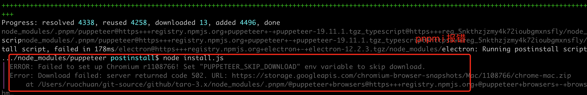
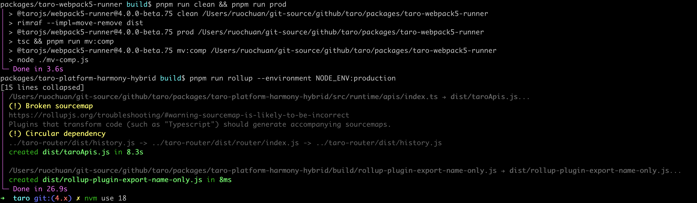
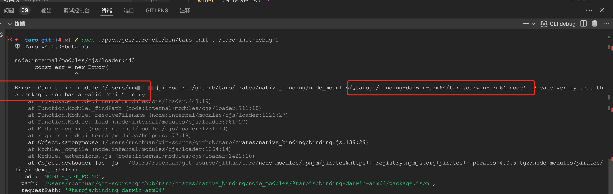
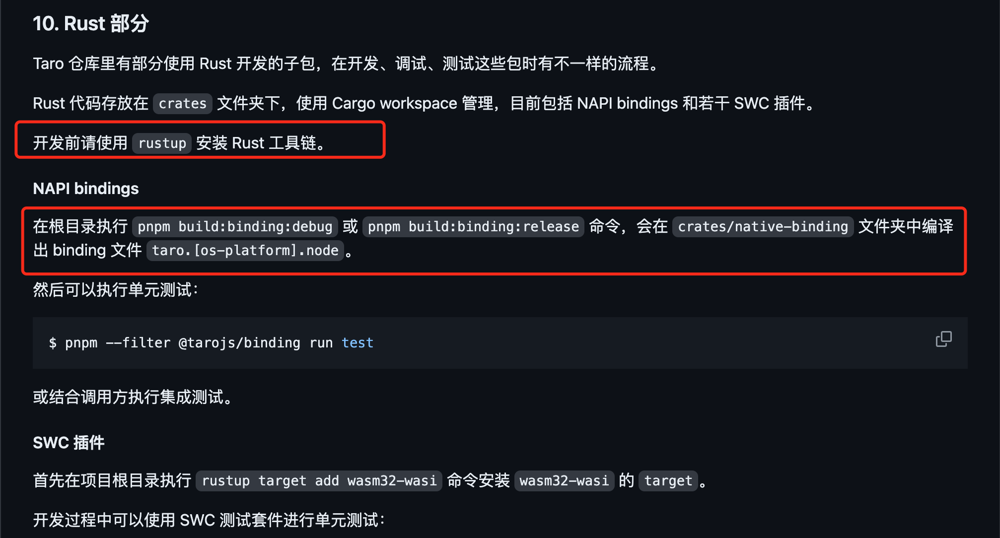

# taro 源码 cli

## 1. 前言

大家好，我是[若川](https://juejin.cn/user/1415826704971918)，欢迎 `follow` [我的 github](https://github.com/ruochuan12)。我倾力持续组织了3年多[每周大家一起学习200行左右的源码共读活动](https://juejin.cn/post/7079706017579139102)，感兴趣的可以[点此扫码加我微信 `ruochuan02` 参与](https://juejin.cn/pin/7217386885793595453)。另外，想学源码，极力推荐关注我写的专栏[《学习源码整体架构系列》](https://juejin.cn/column/6960551178908205093)，目前是掘金关注人数（5.8k+人）第一的专栏，写有30余篇源码文章。

截止目前，`taro` 正式版是 `3.6.30`，[Taro 4.0 Beta 发布：支持开发鸿蒙应用、小程序编译模式、Vite 编译等](https://juejin.cn/post/7330792655125463067)。文章提到将于2024年第二季度，发布 `4.x`。所以我们直接学习 `4.x`，截至目前 `4.x` 最新版本是 `4.0.0-beta.75`。

taro 源码系列

## 2. 准备工作

```bash
# 克隆项目
git clone https://github.com/NervJS/taro.git
# 当前分支
git checkout 4.x
# 当前 hash
git checkout d08d4b7faa6773e4f14c31ecdb6b5ebdc8787c76
# 当前版本
# 4.0.0-beta.75
```

后续文章尽量会与 `taro` 版本保持更新。

看一个开源项目，第一步应该是先看 [README.md](https://github.com/NervJS/taro.git) 再看 [贡献文档](https://github.com/NervJS/taro/blob/4.x/CONTRIBUTING.md) 和 `package.json`。

环境准备
> 需要安装 [Node.js 16](https://nodejs.org/en/)（建议安装 `16.20.0` 及以上版本）及 [pnpm 7](https://pnpm.io/zh/installation)

我使用的环境：`mac pro m1 pro`，当然 `Windows` 一样可以。

一般用 [nvm](https://github.com/nvm-sh/nvm) 管理 `node` 版本。

```zsh
nvm install 18
nvm use 18
# 可以把 node 默认版本设置为 18，调试时会使用默认版本
nvm alias default 18

pnpm -v
# 9.1.1
node -v
# v18.20.2

cd taro
# 安装依赖
pnpm i
# 编译构建
pnpm build
```

```bash
# 删除根目录的 node_modules 和所有 workspace 里的 node_modules
$ pnpm run clear-all
# 对应的是：rimraf **/node_modules
# mac 下可以用 rm -rf **/node_modules
```

安装依赖可能会报错。



```bash
Failed to set up Chromium r1108766! Set "PUPPETEER_SKIP_DOWNLOAD" env variable to skip download.
```

通过谷歌等搜索引擎可以找到解决方法。

[stackoverflow](https://stackoverflow.com/questions/63187371/puppeteer-is-not-able-to-install-error-failed-to-set-up-chromium-r782078-set)

Mac : `export PUPPETEER_SKIP_DOWNLOAD='true'`
Windows: `SET PUPPETEER_SKIP_DOWNLOAD='true'`

pnpm build 完成，如下图所示：



报错 binding
taro.[os-platform].node



再来看下 [贡献文档-10-rust-部分](https://github.com/NervJS/taro/blob/4.x/CONTRIBUTING.md#10-rust-%E9%83%A8%E5%88%86)



通过 [rustup](https://rustup.rs) 找到安装命令：

```bash
curl --proto '=https' --tlsv1.2 -sSf https://sh.rustup.rs | sh
```

`pnpm run build:binding:debug` 或 `pnpm run binding:release` 编译出文件：`crates/native_binding/taro.darwin-arm64.node`。

## 3. 调试

package.json

```json
// packages/taro-cli/package.json
{
  "name": "@tarojs/cli",
  "version": "4.0.0-beta.75",
  "description": "cli tool for taro",
  "main": "index.js",
  "types": "dist/index.d.ts",
  "bin": {
    "taro": "bin/taro"
  },
}
```

### 3.1 taro-cli/bin/taro

```js
#! /usr/bin/env node

require('../dist/util').printPkgVersion()

const CLI = require('../dist/cli').default

new CLI().run()
```

[taro 文档 - 单步调测配置](https://docs.taro.zone/docs/debug-config/)

调试截图

```bash
node ./packages/taro-cli/bin/taro init ../taro-init-debug
```

### 3.2 .vscode/launch.json

```json
{
  // For more information, visit: https://go.microsoft.com/fwlink/?linkid=830387
  "version": "0.2.0",
  "configurations": [
    {
      "type": "node",
      "request": "launch",
      "name": "CLI debug",
      "program": "${workspaceFolder}/packages/taro-cli/bin/taro",
      // "cwd": "${project absolute path}",
      "cwd": "${workspaceFolder}",
      "args": [
        "init",
        "taro-debug-init"
      ],
      "console": "integratedTerminal",
      // "args": [
      //   "build",
      //   "--type",
      //   "weapp",
      //   "--watch"
      // ],
      "skipFiles": ["<node_internals>/**"]
    },
  ]
}
```

## 4. taro-cli/src/utils/index.ts

```js
// packages/taro-cli/src/util/index.ts
import * as path from 'path'

export function getRootPath (): string {
  return path.resolve(__dirname, '../../')
}

export function getPkgVersion (): string {
  return require(path.join(getRootPath(), 'package.json')).version
}
```

输出 的是 `taro/packages/taro-cli/package.json` 的版本号

```js
👽 Taro v4.0.0-beta.75
```

## 5. taro-cli/src/cli.ts

```js
// taro/packages/taro-cli/src/cli.ts
export default class CLI {
  appPath: string
  constructor (appPath) {
    this.appPath = appPath || process.cwd()
  }

  run () {
    return this.parseArgs()
  }

  async parseArgs () {
	const args = minimist(process.argv.slice(2), {
      alias: {
		// 省略一些别名设置 ...
	  },
      boolean: ['version', 'help', 'disable-global-config'],
      default: {
        build: true,
      },
    })
    const _ = args._
	// init、build 等
    const command = _[0]
    if (command) {
		// 省略代码
    } else {
      if (args.h) {
		// 输出帮助信息
		// 省略代码
      } else if (args.v) {
		// 输出版本号
        console.log(getPkgVersion())
      }
    }
  }
}
```

### 5.1 parseArgs

```js
export default class CLI {
	async parseArgs () {

	}
}
```

### 5.2 customCommand

```js
// taro/packages/taro-cli/src/commands/customCommand.ts
import { Kernel } from '@tarojs/service'

export default function customCommand (
  command: string,
  kernel: Kernel,
  args: { _: string[], [key: string]: any }
) {
  if (typeof command === 'string') {
    const options: any = {}
    const excludeKeys = ['_', 'version', 'v', 'help', 'h', 'disable-global-config']
    Object.keys(args).forEach(key => {
      if (!excludeKeys.includes(key)) {
        options[key] = args[key]
      }
    })

    kernel.run({
      name: command,
      opts: {
        _: args._,
        options,
        isHelp: args.h
      }
    })
  }
}
```

---

**如果看完有收获，欢迎点赞、评论、分享支持。你的支持和肯定，是我写作的动力**。

最后可以持续关注我[@若川](https://juejin.cn/user/1415826704971918)，欢迎 `follow` [我的 github](https://github.com/ruochuan12)。另外，想学源码，极力推荐关注我写的专栏[《学习源码整体架构系列》](https://juejin.cn/column/6960551178908205093)，目前是掘金关注人数（5.8k+人）第一的专栏，写有30余篇源码文章。

我倾力持续组织了3年多[每周大家一起学习200行左右的源码共读活动](https://juejin.cn/post/7079706017579139102)，感兴趣的可以[点此扫码加我微信 `ruochuan02` 参与](https://juejin.cn/pin/7217386885793595453)。
