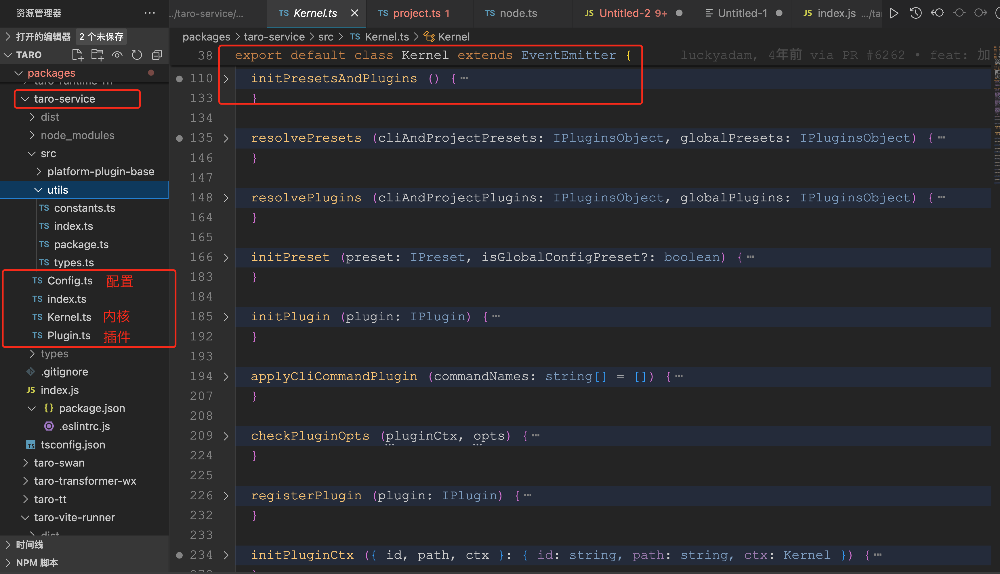

# Taro 源码揭秘 - 揭开整个架构的插件系统的秘密

## 1. 前言

大家好，我是[若川](https://juejin.cn/user/1415826704971918)，欢迎关注我的[公众号：若川视野](https://mp.weixin.qq.com/s/MacNfeTPODNMLLFdzrULow)。我倾力持续组织了 3 年多[每周大家一起学习 200 行左右的源码共读活动](https://juejin.cn/post/7079706017579139102)，感兴趣的可以[点此扫码加我微信 `ruochuan02` 参与](https://juejin.cn/pin/7217386885793595453)。另外，想学源码，极力推荐关注我写的专栏[《学习源码整体架构系列》](https://juejin.cn/column/6960551178908205093)，目前是掘金关注人数（5.8k+人）第一的专栏，写有 30 余篇源码文章。

截止目前（`2024-06-11`），`taro` 正式版是 `3.6.31`，[Taro 4.0 Beta 发布：支持开发鸿蒙应用、小程序编译模式、Vite 编译等](https://juejin.cn/post/7330792655125463067)。文章提到将于 2024 年第二季度，发布 `4.x`。所以我们直接学习 `4.x`，`4.x` 最新版本是 `4.0.0-beta.83`。

[多编译内核生态下的极速研发体验](https://taro-docs.jd.com/blog/2023/03/29/D2_17) 官方博客有如下图。


计划写一个 `taro` 源码揭秘系列，欢迎持续关注。初步计划有如下文章：

- [x] cli init 初始化项目
- [x] 插件机制
- [ ] init 初始化项目
- [ ] cli build
- [ ] 等等

学完本文，你将学到：

```bash
1. 学会通过两种方式调试 taro 源码
2. 学会入口 taro-cli 具体实现方式
3. 学会 cli init 命令实现原理，读取用户项目配置文件和用户全局配置文件
4. 学会 taro-service kernal （内核）解耦实现
5. 初步学会 taro 插件架构，学会如何编写一个 taro 插件
```

书接上文，我们继续来看 `Taro` 的插件机制是如何实现的。


```ts
interface IKernelOptions {
 appPath: string;
 config: Config;
 presets?: PluginItem[];
 plugins?: PluginItem[];
}

export default class Kernel extends EventEmitter {
 constructor(options: IKernelOptions) {
  super();
  // 省略若干代码...
 }

 applyCliCommandPlugin(commandNames: string[] = []) {
  const existsCliCommand: string[] = [];
  for (let i = 0; i < commandNames.length; i++) {
   const commandName = commandNames[i];
   const commandFilePath = path.resolve(
    this.cliCommandsPath,
    `${commandName}.js`
   );
   if (this.cliCommands.includes(commandName))
    existsCliCommand.push(commandFilePath);
  }
  const commandPlugins = convertPluginsToObject(existsCliCommand || [])();
  helper.createSwcRegister({ only: [...Object.keys(commandPlugins)] });
  const resolvedCommandPlugins = resolvePresetsOrPlugins(
   this.appPath,
   commandPlugins,
   PluginType.Plugin
  );
  while (resolvedCommandPlugins.length) {
   this.initPlugin(resolvedCommandPlugins.shift()!);
  }
 }

}
```

## initPresetsAndPlugins

```ts
initPresetsAndPlugins() {
  const initialConfig = this.initialConfig;
  const initialGlobalConfig = this.initialGlobalConfig;
  const cliAndProjectConfigPresets = mergePlugins(
   this.optsPresets || [],
   initialConfig.presets || []
  )();
  const cliAndProjectPlugins = mergePlugins(
   this.optsPlugins || [],
   initialConfig.plugins || []
  )();
  const globalPlugins = convertPluginsToObject(
   initialGlobalConfig.plugins || []
  )();
  const globalPresets = convertPluginsToObject(
   initialGlobalConfig.presets || []
  )();
  this.debugger(
   "initPresetsAndPlugins",
   cliAndProjectConfigPresets,
   cliAndProjectPlugins
  );
  this.debugger("globalPresetsAndPlugins", globalPlugins, globalPresets);
  process.env.NODE_ENV !== "test" &&
   helper.createSwcRegister({
    only: [
     ...Object.keys(cliAndProjectConfigPresets),
     ...Object.keys(cliAndProjectPlugins),
     ...Object.keys(globalPresets),
     ...Object.keys(globalPlugins),
    ],
   });
  this.plugins = new Map();
  this.extraPlugins = {};
  this.globalExtraPlugins = {};
  this.resolvePresets(cliAndProjectConfigPresets, globalPresets);
  this.resolvePlugins(cliAndProjectPlugins, globalPlugins);
 }
```

这个方法主要做了如下几件事：

```bash
1. mergePlugins 合并预设插件集合和插件
2. convertPluginsToObject 转换全局配置里的插件集和插件为对象
3. 非测试环境，createSwcRegister 使用了 @swc/register 解析读取 ts js 等，可以直接用 require 引用
4. resolvePresets 解析预设插件集合和 resolvePlugins 解析插件
```

### mergePlugins convertPluginsToObject

```ts

export const isNpmPkg: (name: string) => boolean = name => !(/^(\.|\/)/.test(name))

export function getPluginPath (pluginPath: string) {
  if (isNpmPkg(pluginPath) || path.isAbsolute(pluginPath)) return pluginPath
  throw new Error('plugin 和 preset 配置必须为绝对路径或者包名')
}

export function convertPluginsToObject (items: PluginItem[]): () => IPluginsObject {
  return () => {
    const obj: IPluginsObject = {}
    if (Array.isArray(items)) {
      items.forEach(item => {
        if (typeof item === 'string') {
          const name = getPluginPath(item)
          obj[name] = null
        } else if (Array.isArray(item)) {
          const name = getPluginPath(item[0])
          obj[name] = item[1]
        }
      })
    }
    return obj
  }
}
```

```ts
export function mergePlugins (dist: PluginItem[], src: PluginItem[]) {
  return () => {
    const srcObj = convertPluginsToObject(src)()
    const distObj = convertPluginsToObject(dist)()
    return merge(distObj, srcObj)
  }
}
```

## resolvePresets 解析预设插件集合

```ts
 resolvePresets(
  cliAndProjectPresets: IPluginsObject,
  globalPresets: IPluginsObject
 ) {
  const resolvedCliAndProjectPresets = resolvePresetsOrPlugins(
   this.appPath,
   cliAndProjectPresets,
   PluginType.Preset
  );
  while (resolvedCliAndProjectPresets.length) {
   this.initPreset(resolvedCliAndProjectPresets.shift()!);
  }

  const globalConfigRootPath = path.join(
   helper.getUserHomeDir(),
   helper.TARO_GLOBAL_CONFIG_DIR
  );
  const resolvedGlobalPresets = resolvePresetsOrPlugins(
   globalConfigRootPath,
   globalPresets,
   PluginType.Plugin,
   true
  );
  while (resolvedGlobalPresets.length) {
   this.initPreset(resolvedGlobalPresets.shift()!, true);
  }
 }
```

这个方法主要做了如下几件事：

```bash
1. mergePlugins 合并预设插件集合和插件
2. convertPluginsToObject 转换全局配置里的插件集和插件为对象
3. 非测试环境，createSwcRegister 使用了 @swc/register 解析读取 ts js 等，可以直接用 require 引用
4. resolvePresets 解析预设插件集合和 resolvePlugins 解析插件
```

### resolvePresetsOrPlugins 解析插件集或者插件

```ts
// getModuleDefaultExport
export function resolvePresetsOrPlugins (root: string, args: IPluginsObject, type: PluginType, skipError?: boolean): IPlugin[] {
  // 全局的插件引入报错，不抛出 Error 影响主流程，而是通过 log 提醒然后把插件 filter 掉，保证主流程不变
  const resolvedPresetsOrPlugins: IPlugin[] = []
  const presetsOrPluginsNames = Object.keys(args) || []
  for (let i = 0; i < presetsOrPluginsNames.length; i++) {
    const item = presetsOrPluginsNames[i]
    let fPath
    try {
      fPath = resolve.sync(item, {
        basedir: root,
        extensions: ['.js', '.ts']
      })
    } catch (err) {
      if (args[item]?.backup) {
        // 如果项目中没有，可以使用 CLI 中的插件
        fPath = args[item]?.backup
      } else if (skipError) {
        // 如果跳过报错，那么 log 提醒，并且不使用该插件
        console.log(chalk.yellow(`找不到插件依赖 "${item}"，请先在项目中安装，项目路径：${root}`))
        continue
      } else {
        console.log(chalk.red(`找不到插件依赖 "${item}"，请先在项目中安装，项目路径：${root}`))
        process.exit(1)
      }
    }
    const resolvedItem = {
      id: fPath,
      path: fPath,
      type,
      opts: args[item] || {},
      apply () {
        try {
          return getModuleDefaultExport(require(fPath))
        } catch (error) {
          console.error(error)
          // 全局的插件运行报错，不抛出 Error 影响主流程，而是通过 log 提醒然后把插件 filter 掉，保证主流程不变
          if (skipError) {
            console.error(`插件依赖 "${item}" 加载失败，请检查插件配置`)
          } else {
            throw new Error(`插件依赖 "${item}" 加载失败，请检查插件配置`)
          }
        }
      }
    }
    resolvedPresetsOrPlugins.push(resolvedItem)
  }

  return resolvedPresetsOrPlugins
}
```

## initPreset 初始化预设插件集合

```ts
initPreset(preset: IPreset, isGlobalConfigPreset?: boolean) {
  this.debugger("initPreset", preset);
  const { id, path, opts, apply } = preset;
  const pluginCtx = this.initPluginCtx({ id, path, ctx: this });
  const { presets, plugins } = apply()(pluginCtx, opts) || {};
  this.registerPlugin(preset);
  if (Array.isArray(presets)) {
   const _presets = resolvePresetsOrPlugins(
    this.appPath,
    convertPluginsToObject(presets)(),
    PluginType.Preset,
    isGlobalConfigPreset
   );
   while (_presets.length) {
    this.initPreset(_presets.shift()!, isGlobalConfigPreset);
   }
  }
  if (Array.isArray(plugins)) {
   isGlobalConfigPreset
    ? (this.globalExtraPlugins = merge(
      this.globalExtraPlugins,
      convertPluginsToObject(plugins)()
      ))
    : (this.extraPlugins = merge(
      this.extraPlugins,
      convertPluginsToObject(plugins)()
      ));
  }
 }
```

这个方法主要做了如下几件事：

```bash
1.
```

## initPluginCtx 初始化插件 ctx

```ts
 initPluginCtx({
  id,
  path,
  ctx,
 }: {
  id: string;
  path: string;
  ctx: Kernel;
 }) {
  const pluginCtx = new Plugin({ id, path, ctx });
  const internalMethods = ["onReady", "onStart"];
  const kernelApis = [
   "appPath",
   "plugins",
   "platforms",
   "paths",
   "helper",
   "runOpts",
   "runnerUtils",
   "initialConfig",
   "applyPlugins",
   "applyCliCommandPlugin",
  ];
  internalMethods.forEach((name) => {
   if (!this.methods.has(name)) {
    pluginCtx.registerMethod(name);
   }
  });
  return new Proxy(pluginCtx, {
   get: (target, name: string) => {
    if (this.methods.has(name)) {
     const method = this.methods.get(name);
     if (Array.isArray(method)) {
      return (...arg) => {
       method.forEach((item) => {
        item.apply(this, arg);
       });
      };
     }
     return method;
    }
    if (kernelApis.includes(name)) {
     return typeof this[name] === "function"
      ? this[name].bind(this)
      : this[name];
    }
    return target[name];
   },
  });
 }
```

这个方法主要做了如下几件事：

```bash
1.
```

### new Plugin({ id, path, ctx });

```ts
import { addPlatforms } from '@tarojs/helper'

import type { Func } from '@tarojs/taro/types/compile'
import type Kernel from './Kernel'
import type { ICommand, IHook, IPlatform } from './utils/types'

export default class Plugin {
  id: string
  path: string
  ctx: Kernel
  optsSchema: Func

  constructor (opts) {
    this.id = opts.id
    this.path = opts.path
    this.ctx = opts.ctx
  }
  //  拆分到下部分

}
```

```ts
  register (hook: IHook) {
    if (typeof hook.name !== 'string') {
      throw new Error(`插件 ${this.id} 中注册 hook 失败， hook.name 必须是 string 类型`)
    }
    if (typeof hook.fn !== 'function') {
      throw new Error(`插件 ${this.id} 中注册 hook 失败， hook.fn 必须是 function 类型`)
    }
    const hooks = this.ctx.hooks.get(hook.name) || []
    hook.plugin = this.id
    this.ctx.hooks.set(hook.name, hooks.concat(hook))
  }
```

```ts
  registerCommand (command: ICommand) {
    if (this.ctx.commands.has(command.name)) {
      throw new Error(`命令 ${command.name} 已存在`)
    }
    this.ctx.commands.set(command.name, command)
    this.register(command)
  }

```

```ts
  registerPlatform (platform: IPlatform) {
    if (this.ctx.platforms.has(platform.name)) {
      throw new Error(`适配平台 ${platform.name} 已存在`)
    }
    addPlatforms(platform.name)
    this.ctx.platforms.set(platform.name, platform)
    this.register(platform)
  }
```

```ts
  registerMethod (...args) {
    const { name, fn } = processArgs(args)
    const methods = this.ctx.methods.get(name) || []
    methods.push(fn || function (fn: Func) {
      this.register({
        name,
        fn
      })
    }.bind(this))
    this.ctx.methods.set(name, methods)
  }
```ts
  addPluginOptsSchema (schema) {
    this.optsSchema = schema
  }
  ```

function processArgs (args) {
  let name, fn
  if (!args.length) {
    throw new Error('参数为空')
  } else if (args.length === 1) {
    if (typeof args[0] === 'string') {
      name = args[0]
    } else {
      name = args[0].name
      fn = args[0].fn
    }
  } else {
    name = args[0]
    fn = args[1]
  }
  return { name, fn }
}

```

## registerPlugin 注册插件

```ts
 registerPlugin(plugin: IPlugin) {
  this.debugger("registerPlugin", plugin);
  if (this.plugins.has(plugin.id)) {
   throw new Error(`插件 ${plugin.id} 已被注册`);
  }
  this.plugins.set(plugin.id, plugin);
 }
```

这个方法主要做了如下几件事：

```bash
1.
```

## resolvePlugins

```ts
resolvePlugins(
  cliAndProjectPlugins: IPluginsObject,
  globalPlugins: IPluginsObject
 ) {
  cliAndProjectPlugins = merge(this.extraPlugins, cliAndProjectPlugins);
  const resolvedCliAndProjectPlugins = resolvePresetsOrPlugins(
   this.appPath,
   cliAndProjectPlugins,
   PluginType.Plugin
  );

  globalPlugins = merge(this.globalExtraPlugins, globalPlugins);
  const globalConfigRootPath = path.join(
   helper.getUserHomeDir(),
   helper.TARO_GLOBAL_CONFIG_DIR
  );
  const resolvedGlobalPlugins = resolvePresetsOrPlugins(
   globalConfigRootPath,
   globalPlugins,
   PluginType.Plugin,
   true
  );

  const resolvedPlugins = resolvedCliAndProjectPlugins.concat(
   resolvedGlobalPlugins
  );

  while (resolvedPlugins.length) {
   this.initPlugin(resolvedPlugins.shift()!);
  }

  this.extraPlugins = {};
  this.globalExtraPlugins = {};
 }
```

这个方法主要做了如下几件事：

```bash
1.
```

## initPlugin

```ts
initPlugin(plugin: IPlugin) {
  const { id, path, opts, apply } = plugin;
  const pluginCtx = this.initPluginCtx({ id, path, ctx: this });
  this.debugger("initPlugin", plugin);
  this.registerPlugin(plugin);
  apply()(pluginCtx, opts);
  this.checkPluginOpts(pluginCtx, opts);
 }
```

这个方法主要做了如下几件事：

```bash
1.
```

## checkPluginOpts

```ts
 checkPluginOpts(pluginCtx, opts) {
  if (typeof pluginCtx.optsSchema !== "function") {
   return;
  }
  this.debugger("checkPluginOpts", pluginCtx);
  const joi = require("joi");
  const schema = pluginCtx.optsSchema(joi);
  if (!joi.isSchema(schema)) {
   throw new Error(
    `插件${pluginCtx.id}中设置参数检查 schema 有误，请检查！`
   );
  }
  const { error } = schema.validate(opts);
  if (error) {
   error.message = `插件${pluginCtx.id}获得的参数不符合要求，请检查！`;
   throw error;
  }
 }
```

这个方法主要做了如下几件事：

```bash
1.
```
