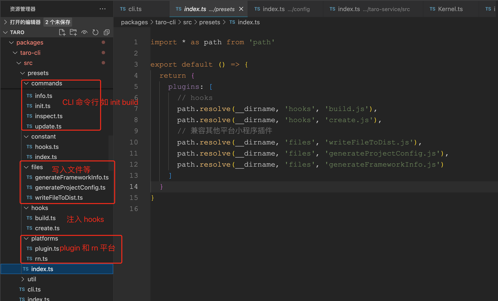
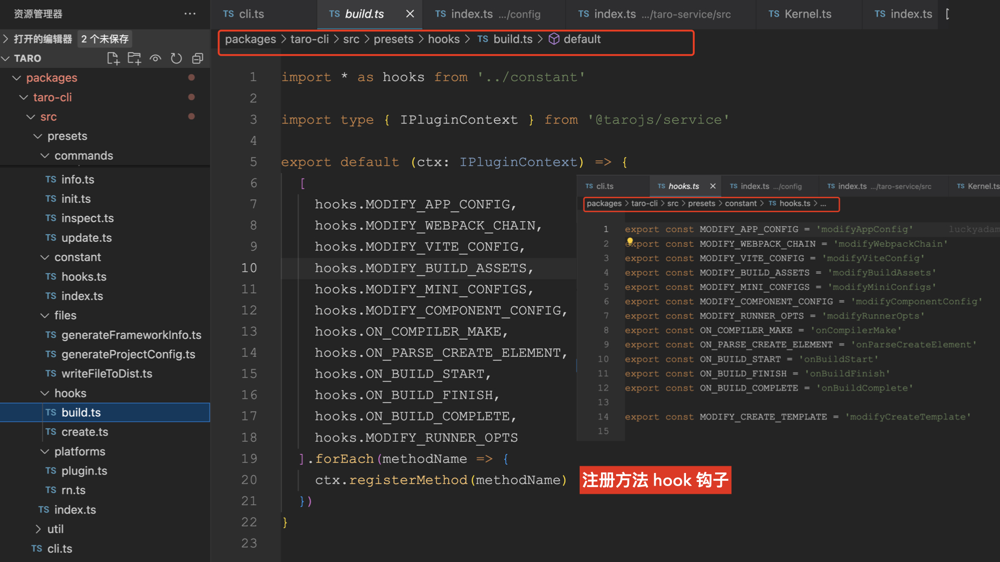
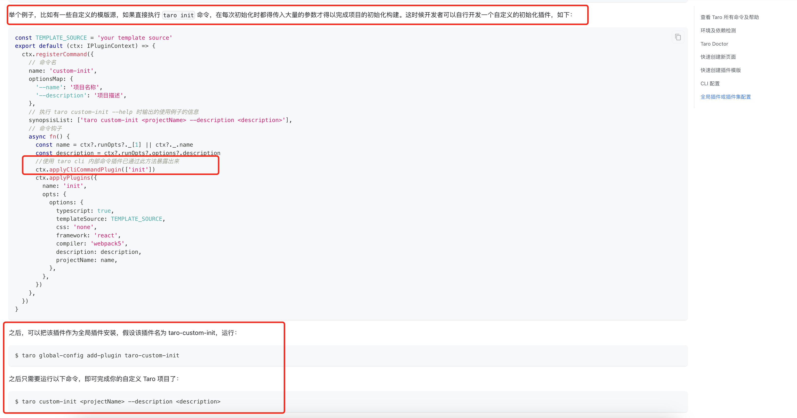

# Taro 源码揭秘 - 揭开整个架构的插件系统的秘密

## 1. 前言

大家好，我是[若川](https://juejin.cn/user/1415826704971918)，欢迎关注我的[公众号：若川视野](https://mp.weixin.qq.com/s/MacNfeTPODNMLLFdzrULow)。我倾力持续组织了 3 年多[每周大家一起学习 200 行左右的源码共读活动](https://juejin.cn/post/7079706017579139102)，感兴趣的可以[点此扫码加我微信 `ruochuan02` 参与](https://juejin.cn/pin/7217386885793595453)。另外，想学源码，极力推荐关注我写的专栏[《学习源码整体架构系列》](https://juejin.cn/column/6960551178908205093)，目前是掘金关注人数（5.8k+人）第一的专栏，写有 30 余篇源码文章。

截止目前（`2024-06-14`），`taro` 正式版是 `3.6.31`，[Taro 4.0 Beta 发布：支持开发鸿蒙应用、小程序编译模式、Vite 编译等](https://juejin.cn/post/7330792655125463067)。文章提到将于 2024 年第二季度，发布 `4.x`。所以我们直接学习 `4.x`，`4.x` 最新版本是 `4.0.0-beta.83`。

[多编译内核生态下的极速研发体验](https://taro-docs.jd.com/blog/2023/03/29/D2_17) 官方博客有如下图。


计划写一个 `taro` 源码揭秘系列，欢迎持续关注。初步计划有如下文章：

-   [x] [Taro 源码揭秘 - 揭开整个架构的入口 CLI => taro init 初始化项目的秘密](https://juejin.cn/post/7378363694939783178)
-   [x] Taro 源码揭秘 - 揭开整个架构的插件系统的秘密
-   [ ] init 初始化项目
-   [ ] cli build
-   [ ] 等等

学完本文，你将学到：

```bash
1. 插件
```

[Taro 源码揭秘 - 揭开整个架构的入口 CLI => taro init 初始化项目的秘密](https://juejin.cn/post/7378363694939783178)

上一篇文章中提到的 `Kernel` (内核) 中的 `run` 函数执行，其中 `this.initPresetsAndPlugins` 初始化预设插件集合和插件没讲述。
我们继续这个函数的具体实现，也就是说来看 `Taro` 的插件机制是如何实现的。


cli 调用的地方

```ts
// packages/taro-cli/src/cli.ts
const kernel = new Kernel({
	appPath,
	presets: [path.resolve(__dirname, ".", "presets", "index.js")],
	config,
	plugins: [],
});
kernel.optsPlugins ||= [];
```

presets 预设插件集合





```ts
{
  name: "init",
  optionsMap: {
	// 省略若干代码...
  },
  fn: function fn(opts) {
	// 省略若干代码...
  },
  plugin: "/Users/ruochuan/git-source/github/taro/packages/taro-cli/dist/presets/commands/init.js",
}
```

```ts
interface IKernelOptions {
	appPath: string;
	config: Config;
	presets?: PluginItem[];
	plugins?: PluginItem[];
}

export default class Kernel extends EventEmitter {
	constructor(options: IKernelOptions) {
		super();
		this.debugger =
			process.env.DEBUG === "Taro:Kernel"
				? helper.createDebug("Taro:Kernel")
				: function () {};
		this.appPath = options.appPath || process.cwd();
		this.optsPresets = options.presets;
		this.optsPlugins = options.plugins;
		this.config = options.config;
		this.hooks = new Map();
		this.methods = new Map();
		this.commands = new Map();
		this.platforms = new Map();
		this.initHelper();
		this.initConfig();
		this.initPaths();
		this.initRunnerUtils();
	}
	async run(args: string | { name: string; opts?: any }) {
		// 省略若干代码
		this.debugger("initPresetsAndPlugins");
		this.initPresetsAndPlugins();

		await this.applyPlugins("onReady");
		// 省略若干代码
	}
	// initPresetsAndPlugins
	initPresetsAndPlugins() {
		// 初始化插件集和插件
	}
}
```

## initPresetsAndPlugins 初始化预设插件集合和插件

```ts
initPresetsAndPlugins() {
  const initialConfig = this.initialConfig;
  const initialGlobalConfig = this.initialGlobalConfig;
  const cliAndProjectConfigPresets = mergePlugins(
   this.optsPresets || [],
   initialConfig.presets || []
  )();
  const cliAndProjectPlugins = mergePlugins(
   this.optsPlugins || [],
   initialConfig.plugins || []
  )();
  const globalPlugins = convertPluginsToObject(
   initialGlobalConfig.plugins || []
  )();
  const globalPresets = convertPluginsToObject(
   initialGlobalConfig.presets || []
  )();
  this.debugger(
   "initPresetsAndPlugins",
   cliAndProjectConfigPresets,
   cliAndProjectPlugins
  );
  this.debugger("globalPresetsAndPlugins", globalPlugins, globalPresets);
  process.env.NODE_ENV !== "test" &&
   helper.createSwcRegister({
    only: [
     ...Object.keys(cliAndProjectConfigPresets),
     ...Object.keys(cliAndProjectPlugins),
     ...Object.keys(globalPresets),
     ...Object.keys(globalPlugins),
    ],
   });
  this.plugins = new Map();
  this.extraPlugins = {};
  this.globalExtraPlugins = {};
  this.resolvePresets(cliAndProjectConfigPresets, globalPresets);
  this.resolvePlugins(cliAndProjectPlugins, globalPlugins);
 }
```

这个方法主要做了如下几件事：

> 1.  mergePlugins 合并预设插件集合和插件
> 2.  convertPluginsToObject 转换全局配置里的插件集和插件为对象
> 3.  非测试环境，`createSwcRegister` 使用了 [`@swc/register`](https://www.npmjs.com/package/@swc/register) 来编译 `ts` 等转换成 `commonjs`。可以直接用 `require`。
> 4.  resolvePresets 解析预设插件集合和 resolvePlugins 解析插件

### mergePlugins convertPluginsToObject

```ts
export const isNpmPkg: (name: string) => boolean = (name) =>
	!/^(\.|\/)/.test(name);

export function getPluginPath(pluginPath: string) {
	if (isNpmPkg(pluginPath) || path.isAbsolute(pluginPath)) return pluginPath;
	throw new Error("plugin 和 preset 配置必须为绝对路径或者包名");
}

export function convertPluginsToObject(
	items: PluginItem[]
): () => IPluginsObject {
	return () => {
		const obj: IPluginsObject = {};
		if (Array.isArray(items)) {
			items.forEach((item) => {
				if (typeof item === "string") {
					const name = getPluginPath(item);
					obj[name] = null;
				} else if (Array.isArray(item)) {
					const name = getPluginPath(item[0]);
					obj[name] = item[1];
				}
			});
		}
		return obj;
	};
}
```

```ts
export function mergePlugins(dist: PluginItem[], src: PluginItem[]) {
	return () => {
		const srcObj = convertPluginsToObject(src)();
		const distObj = convertPluginsToObject(dist)();
		return merge(distObj, srcObj);
	};
}
```

我们来看解析插件集合 `resolvePresets`。

## resolvePresets 解析预设插件集合

```ts
 resolvePresets(
  cliAndProjectPresets: IPluginsObject,
  globalPresets: IPluginsObject
 ) {
  const resolvedCliAndProjectPresets = resolvePresetsOrPlugins(
   this.appPath,
   cliAndProjectPresets,
   PluginType.Preset
  );
  while (resolvedCliAndProjectPresets.length) {
   this.initPreset(resolvedCliAndProjectPresets.shift()!);
  }

  const globalConfigRootPath = path.join(
   helper.getUserHomeDir(),
   helper.TARO_GLOBAL_CONFIG_DIR
  );
  const resolvedGlobalPresets = resolvePresetsOrPlugins(
   globalConfigRootPath,
   globalPresets,
   PluginType.Plugin,
   true
  );
  while (resolvedGlobalPresets.length) {
   this.initPreset(resolvedGlobalPresets.shift()!, true);
  }
 }
```

这个方法主要做了如下几件事：

> 1.  resolvedCliAndProjectPresets 解析 cli 和项目配置的预设插件集合
> 2.  resolvedGlobalPresets 解析全局的预设插件集合

其中主要有两个函数，我们分开讲述 `resolvePresetsOrPlugins` `initPreset`。

`globalConfigRootPath` 路径是： `/Users/用户名/.taro-global-config`

### resolvePresetsOrPlugins 解析插件集或者插件

```ts
// getModuleDefaultExport
export function resolvePresetsOrPlugins(
	root: string,
	args: IPluginsObject,
	type: PluginType,
	skipError?: boolean
): IPlugin[] {
	// 全局的插件引入报错，不抛出 Error 影响主流程，而是通过 log 提醒然后把插件 filter 掉，保证主流程不变
	const resolvedPresetsOrPlugins: IPlugin[] = [];
	const presetsOrPluginsNames = Object.keys(args) || [];
	for (let i = 0; i < presetsOrPluginsNames.length; i++) {
		const item = presetsOrPluginsNames[i];
		let fPath;
		try {
			fPath = resolve.sync(item, {
				basedir: root,
				extensions: [".js", ".ts"],
			});
		} catch (err) {
			if (args[item]?.backup) {
				// 如果项目中没有，可以使用 CLI 中的插件
				fPath = args[item]?.backup;
			} else if (skipError) {
				// 如果跳过报错，那么 log 提醒，并且不使用该插件
				console.log(
					chalk.yellow(
						`找不到插件依赖 "${item}"，请先在项目中安装，项目路径：${root}`
					)
				);
				continue;
			} else {
				console.log(
					chalk.red(
						`找不到插件依赖 "${item}"，请先在项目中安装，项目路径：${root}`
					)
				);
				process.exit(1);
			}
		}
		const resolvedItem = {
			id: fPath,
			path: fPath,
			type,
			opts: args[item] || {},
			apply() {
				try {
					return getModuleDefaultExport(require(fPath));
				} catch (error) {
					console.error(error);
					// 全局的插件运行报错，不抛出 Error 影响主流程，而是通过 log 提醒然后把插件 filter 掉，保证主流程不变
					if (skipError) {
						console.error(
							`插件依赖 "${item}" 加载失败，请检查插件配置`
						);
					} else {
						throw new Error(
							`插件依赖 "${item}" 加载失败，请检查插件配置`
						);
					}
				}
			},
		};
		resolvedPresetsOrPlugins.push(resolvedItem);
	}

	return resolvedPresetsOrPlugins;
}
```

## initPreset 初始化预设插件集合

```ts
initPreset(preset: IPreset, isGlobalConfigPreset?: boolean) {
  this.debugger("initPreset", preset);
  const { id, path, opts, apply } = preset;
  const pluginCtx = this.initPluginCtx({ id, path, ctx: this });
  const { presets, plugins } = apply()(pluginCtx, opts) || {};
  this.registerPlugin(preset);
  if (Array.isArray(presets)) {
   const _presets = resolvePresetsOrPlugins(
    this.appPath,
    convertPluginsToObject(presets)(),
    PluginType.Preset,
    isGlobalConfigPreset
   );
   while (_presets.length) {
    this.initPreset(_presets.shift()!, isGlobalConfigPreset);
   }
  }
  if (Array.isArray(plugins)) {
   isGlobalConfigPreset
    ? (this.globalExtraPlugins = merge(
      this.globalExtraPlugins,
      convertPluginsToObject(plugins)()
      ))
    : (this.extraPlugins = merge(
      this.extraPlugins,
      convertPluginsToObject(plugins)()
      ));
  }
 }
```

这个方法主要做了如下几件事：

> 1.

主要三件事 `initPluginCtx`、`registerPlugin`、

## initPluginCtx 初始化插件 ctx

```ts
 initPluginCtx({
  id,
  path,
  ctx,
 }: {
  id: string;
  path: string;
  ctx: Kernel;
 }) {
  const pluginCtx = new Plugin({ id, path, ctx });
  const internalMethods = ["onReady", "onStart"];
  const kernelApis = [
   "appPath",
   "plugins",
   "platforms",
   "paths",
   "helper",
   "runOpts",
   "runnerUtils",
   "initialConfig",
   "applyPlugins",
   "applyCliCommandPlugin",
  ];
  internalMethods.forEach((name) => {
   if (!this.methods.has(name)) {
    pluginCtx.registerMethod(name);
   }
  });
  return new Proxy(pluginCtx, {
   get: (target, name: string) => {
    if (this.methods.has(name)) {
     const method = this.methods.get(name);
     if (Array.isArray(method)) {
      return (...arg) => {
       method.forEach((item) => {
        item.apply(this, arg);
       });
      };
     }
     return method;
    }
    if (kernelApis.includes(name)) {
     return typeof this[name] === "function"
      ? this[name].bind(this)
      : this[name];
    }
    return target[name];
   },
  });
 }
```

这个方法主要做了如下几件事：

> 1. Plugin

我们接着来看，class Plugin

### new Plugin({ id, path, ctx })

```ts
import { addPlatforms } from "@tarojs/helper";

import type { Func } from "@tarojs/taro/types/compile";
import type Kernel from "./Kernel";
import type { ICommand, IHook, IPlatform } from "./utils/types";

export default class Plugin {
	id: string;
	path: string;
	ctx: Kernel;
	optsSchema: Func;

	constructor(opts) {
		this.id = opts.id;
		this.path = opts.path;
		this.ctx = opts.ctx;
	}
	//  拆分到下部分
}
```

#### register 注册 hook

```ts
register (hook: IHook) {
	if (typeof hook.name !== 'string') {
		throw new Error(`插件 ${this.id} 中注册 hook 失败， hook.name 必须是 string 类型`)
	}
	if (typeof hook.fn !== 'function') {
		throw new Error(`插件 ${this.id} 中注册 hook 失败， hook.fn 必须是 function 类型`)
	}
	const hooks = this.ctx.hooks.get(hook.name) || []
	hook.plugin = this.id
	this.ctx.hooks.set(hook.name, hooks.concat(hook))
}
```

#### registerCommand 注册方法

```ts
registerCommand (command: ICommand) {
	if (this.ctx.commands.has(command.name)) {
		throw new Error(`命令 ${command.name} 已存在`)
	}
	this.ctx.commands.set(command.name, command)
	this.register(command)
}
```

#### registerPlatform 注册平台

```ts
  registerPlatform (platform: IPlatform) {
    if (this.ctx.platforms.has(platform.name)) {
      throw new Error(`适配平台 ${platform.name} 已存在`)
    }
    addPlatforms(platform.name)
    this.ctx.platforms.set(platform.name, platform)
    this.register(platform)
  }
```

#### registerMethod 注册方法

```ts
registerMethod (...args) {
	const { name, fn } = processArgs(args)
	const methods = this.ctx.methods.get(name) || []
	methods.push(fn || function (fn: Func) {
		this.register({
			name,
			fn
		})
	}.bind(this))
	this.ctx.methods.set(name, methods)
}
```

```ts
function processArgs(args) {
	let name, fn;
	if (!args.length) {
		throw new Error("参数为空");
	} else if (args.length === 1) {
		if (typeof args[0] === "string") {
			name = args[0];
		} else {
			name = args[0].name;
			fn = args[0].fn;
		}
	} else {
		name = args[0];
		fn = args[1];
	}
	return { name, fn };
}
```

#### addPluginOptsSchema 添加插件的参数 Schema

```ts
addPluginOptsSchema (schema) {
	this.optsSchema = schema
}
```

我们接着来看，注册插件函数。

## registerPlugin 注册插件

```ts
 registerPlugin(plugin: IPlugin) {
  this.debugger("registerPlugin", plugin);
  if (this.plugins.has(plugin.id)) {
   throw new Error(`插件 ${plugin.id} 已被注册`);
  }
  this.plugins.set(plugin.id, plugin);
 }
```

这个方法主要做了如下几件事：

> 1. 注册插件到 plugins Map 中。

## resolvePlugins 解析插件

解析插件和解析预设插件集合类似。

```ts
resolvePlugins(
  cliAndProjectPlugins: IPluginsObject,
  globalPlugins: IPluginsObject
 ) {
  cliAndProjectPlugins = merge(this.extraPlugins, cliAndProjectPlugins);
  const resolvedCliAndProjectPlugins = resolvePresetsOrPlugins(
   this.appPath,
   cliAndProjectPlugins,
   PluginType.Plugin
  );

  globalPlugins = merge(this.globalExtraPlugins, globalPlugins);
  const globalConfigRootPath = path.join(
   helper.getUserHomeDir(),
   helper.TARO_GLOBAL_CONFIG_DIR
  );
  const resolvedGlobalPlugins = resolvePresetsOrPlugins(
   globalConfigRootPath,
   globalPlugins,
   PluginType.Plugin,
   true
  );

  const resolvedPlugins = resolvedCliAndProjectPlugins.concat(
   resolvedGlobalPlugins
  );

  while (resolvedPlugins.length) {
   this.initPlugin(resolvedPlugins.shift()!);
  }

  this.extraPlugins = {};
  this.globalExtraPlugins = {};
 }
```

这个方法主要做了如下几件事：

> 1.  合并预设插件集合中的插件、CLI 和项目中配置的插件
> 2.  resolvedCliAndProjectPlugins CLI 和项目中配置的插件
> 3.  合并全局预设插件集合中的插件、全局配置的插件
> 4.  最后遍历所有解析后的插件一次调用 this.initPlugin 初始化插件

## initPlugin 初始化插件

```ts
initPlugin(plugin: IPlugin) {
  const { id, path, opts, apply } = plugin;
  const pluginCtx = this.initPluginCtx({ id, path, ctx: this });
  this.debugger("initPlugin", plugin);
  this.registerPlugin(plugin);
  apply()(pluginCtx, opts);
  this.checkPluginOpts(pluginCtx, opts);
 }
```

这个方法主要做了如下几件事：

> 1.  initPluginCtx 初始化插件的 ctx
> 2.  注册插件
> 3.  校验插件的参数

## checkPluginOpts 校验插件的参数

```ts
 checkPluginOpts(pluginCtx, opts) {
  if (typeof pluginCtx.optsSchema !== "function") {
   return;
  }
  this.debugger("checkPluginOpts", pluginCtx);
  const joi = require("joi");
  const schema = pluginCtx.optsSchema(joi);
  if (!joi.isSchema(schema)) {
   throw new Error(
    `插件${pluginCtx.id}中设置参数检查 schema 有误，请检查！`
   );
  }
  const { error } = schema.validate(opts);
  if (error) {
   error.message = `插件${pluginCtx.id}获得的参数不符合要求，请检查！`;
   throw error;
  }
 }
```

这个方法主要做了如下几件事：

> 1.  使用 [joi](https://www.npmjs.com/package/joi) 最强大的 JavaScript 模式描述语言和数据验证器。校验插件参数 `schema`。

## applyCliCommandPlugin 暴露 taro cli 内部命令插件

```ts
applyCliCommandPlugin(commandNames: string[] = []) {
	const existsCliCommand: string[] = [];
	for (let i = 0; i < commandNames.length; i++) {
		const commandName = commandNames[i];
		const commandFilePath = path.resolve(
			this.cliCommandsPath,
			`${commandName}.js`
		);
		if (this.cliCommands.includes(commandName))
			existsCliCommand.push(commandFilePath);
	}
	const commandPlugins = convertPluginsToObject(existsCliCommand || [])();
	helper.createSwcRegister({ only: [...Object.keys(commandPlugins)] });
	const resolvedCommandPlugins = resolvePresetsOrPlugins(
		this.appPath,
		commandPlugins,
		PluginType.Plugin
	);
	while (resolvedCommandPlugins.length) {
		this.initPlugin(resolvedCommandPlugins.shift()!);
	}
}
```



## 总结

**如果看完有收获，欢迎点赞、评论、分享支持。你的支持和肯定，是我写作的动力**。

最后可以持续关注我[@若川](https://juejin.cn/user/1415826704971918)，欢迎关注我的[公众号：若川视野](https://mp.weixin.qq.com/s/MacNfeTPODNMLLFdzrULow)。另外，想学源码，极力推荐关注我写的专栏[《学习源码整体架构系列》](https://juejin.cn/column/6960551178908205093)，目前是掘金关注人数（5.8k+人）第一的专栏，写有 30 余篇源码文章。

我倾力持续组织了 3 年多[每周大家一起学习 200 行左右的源码共读活动](https://juejin.cn/post/7079706017579139102)，感兴趣的可以[点此扫码加我微信 `ruochuan02` 参与](https://juejin.cn/pin/7217386885793595453)。
