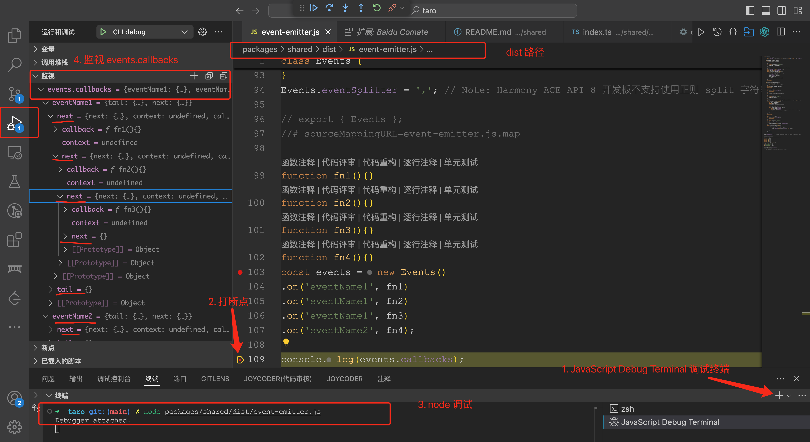

# Taro 源码揭秘：5.高手都在用的发布订阅机制 Events 在 Taro 中是如何实现的？

## 1. 前言

大家好，我是[若川](https://juejin.cn/user/1415826704971918)，欢迎关注我的[公众号：若川视野](https://mp.weixin.qq.com/s/MacNfeTPODNMLLFdzrULow)。我倾力持续组织了 3 年多[每周大家一起学习 200 行左右的源码共读活动](https://juejin.cn/post/7079706017579139102)，感兴趣的可以[点此扫码加我微信 `ruochuan02` 参与](https://juejin.cn/pin/7217386885793595453)。另外，想学源码，极力推荐关注我写的专栏[《学习源码整体架构系列》](https://juejin.cn/column/6960551178908205093)，目前是掘金关注人数（6k+人）第一的专栏，写有几十篇源码文章。

截至目前（`2024-08-18`），[`taro 4.0` 正式版已经发布](https://github.com/NervJS/taro/releases/tag/v4.0.3)，目前最新是 `4.0.4`，官方`4.0`正式版本的介绍文章暂未发布。官方之前发过[Taro 4.0 Beta 发布：支持开发鸿蒙应用、小程序编译模式、Vite 编译等](https://juejin.cn/post/7330792655125463067)。

计划写一个 Taro 源码揭秘系列，博客地址：[https://ruochuan12.github.io/taro](https://ruochuan12.github.io/taro) 可以加入书签，持续关注[若川](https://juejin.cn/user/1415826704971918)。

-   [x] [1. 揭开整个架构的入口 CLI => taro init 初始化项目的秘密](https://juejin.cn/post/7378363694939783178)
-   [x] [2. 揭开整个架构的插件系统的秘密](https://juejin.cn/post/7380195796208205824)
-   [x] [3. 每次创建新的 taro 项目（taro init）的背后原理是什么](https://juejin.cn/post/7390335741586931738)
-   [x] [4. 每次 npm run dev:weapp 开发小程序，build 编译打包是如何实现的？](https://juejin.cn/post/7403193330271682612)
-   [x] [5. 高手都在用的发布订阅机制 Events 在 Taro 中是如何实现的？](https://juejin.cn/post/7403915119448915977)
-   [x] [6. 为什么通过 Taro.xxx 能调用各个小程序平台的 API，如何设计实现的?](https://juejin.cn/post/7407648740926291968)
-   [x] [7. Taro.request 和请求响应拦截器是如何实现的](https://juejin.cn/post/7415911762128797696)
-   [ ] 等等

前面 4 篇文章都是讲述编译相关的，CLI、插件机制、初始化项目、编译构建流程。第 5 篇我们来讲些相对简单的，Taro 是如何实现发布订阅机制 Events 的。

学完本文，你将学到：

```bash
1. 了解发布订阅机制
2. 了解 taro 一些 npm 包的作用，寻找到 Events 源码
3. Taro 源码中发布订阅机制 Events 是如何实现的
等等
```

## 2. Taro 消息机制

[Taro 消息机制](https://taro-docs.jd.com/docs/next/apis/about/events)文档上，`Taro` 提供了消息机制 `Events`，用来实现组件间通信。我们来学习下如何实现的。

`Taro` 提供了 `Taro.Events` 来实现消息机制，使用时需要实例化它，如下

```ts
import Taro, { Events } from '@tarojs/taro'

const events = new Events()

// 监听一个事件，接受参数
events.on('eventName', (arg) => {
  // doSth
})

// 监听同个事件，同时绑定多个 handler
events.on('eventName', handler1)
events.on('eventName', handler2)
events.on('eventName', handler3)

// 触发一个事件，传参
events.trigger('eventName', arg)

// 触发事件，传入多个参数
events.trigger('eventName', arg1, arg2, ...)

// 取消监听一个事件
events.off('eventName')

// 取消监听一个事件某个 handler
events.off('eventName', handler1)

// 取消监听所有事件
events.off()
```

同时 `Taro` 还提供了一个全局消息中心 `Taro.eventCenter` 以供使用，它是 `Taro.Events` 的实例

```ts
import Taro from '@tarojs/taro'

Taro.eventCenter.on
Taro.eventCenter.trigger
Taro.eventCenter.off
```

`Vue2` 中也有类似的事件 `events api` `$on`、`$off`、`$once`、`$emit`，不过 `Vue3` 移除了。
[vue2 events](https://github.com/vuejs/vue/blob/main/src/core/instance/events.ts)

也有一些 `npm` 包，如：[mitt](https://github.com/developit/mitt/blob/main/src/index.ts)、[tiny-emitter](https://github.com/scottcorgan/tiny-emitter/blob/master/index.js)

源码共读也有一期[第8期 | mitt、tiny-emitter 发布订阅](https://juejin.cn/post/7084984303943155719)

## 3. 根据文档使用实现 Events

文档中，主要有如下几个需求点：

- 监听同个事件，同时绑定多个 handler
- 触发事件，传入多个参数
- 取消监听一个事件某个 handler
- 取消监听所有事件

我们可以先自行实现一个符合要求的 `Events` 类，然后再去 `Taro` 源码中寻找实现，最后可以对比各自的实现优缺点。

### 3.1 初步实现 Events

```js
class Events {
	constructor(){
        this.callbacks = [];
    }
	on(eventName, callback){
        this.callbacks.push({
            eventName,
            callback,
        });
    }
	off(){}
	trigger(){}
}
```

我们用 `callbacks` 数组来存储事件，`push` 方法用来添加事件，支持多个同名的 `eventName`。

### 3.2 off 方法实现

```js
off(eventName, callback){
	this.callbacks = this.callbacks.filter((item) => {
		if(typeof eventName === 'string'){
			if(typeof callback === 'function'){
				return !(item.eventName === eventName && item.callback === callback);
			}
			return item.eventName !== eventName;
		}
		return false;
	});
}
```

`off` 方法用来取消监听事件，如果传入 `eventName` 参数，则取消监听该事件，如果还传入了特定的 `handler`，则只取消监听这个 `handler`。否则取消所有事件。

### 3.3 trigger 方法实现

```js
trigger(eventName, ...args){
	this.callbacks.forEach((item) => {
		if(item.eventName === eventName){
			item.callback(...args);
		}
	});
}
```

`trigger` 传入 `eventName` 和参数，遍历所有事件，如果 `eventName` 匹配，则执行 `handler`。

[Taro events 自行实现所有代码 demo，可打开调试运行](https://code.juejin.cn/pen/7404393720948195354)

## 4. 在茫茫源码中寻找 class Events 实现

文档示例：

```ts
import Taro, { Events } from '@tarojs/taro'

const events = new Events()

Taro.eventCenter.on
Taro.eventCenter.trigger
Taro.eventCenter.off
```

`@tarojs/taro` 对应的源码路径是 `taro/packages/taro`

### 4.1 @tarojs/taro 暴露者开发者的 Taro 核心 API

>暴露给应用开发者的 Taro 核心 API。包含以下小程序端入口文件 `index.js` 等。

```js
const { hooks } = require('@tarojs/runtime')
const taro = require('@tarojs/api').default

if (hooks.isExist('initNativeApi')) {
  hooks.call('initNativeApi', taro)
}

module.exports = taro
module.exports.default = module.exports
```

`@tarojs/api` 对应的源码路径是 `taro/packages/taro-api`

### 4.2 @tarojs/api 所有端的公有 API

>暴露给 @tarojs/taro 的所有端的公有 API。`@tarojs/api` 会跨 node/浏览器/小程序/React Native 使用，不得使用/包含平台特有特性。

入口文件：`packages/taro-api/src/index.ts`

```js
// packages/taro-api/src/index.ts
/* eslint-disable camelcase */
import { Current, eventCenter, Events, getCurrentInstance, nextTick, options } from '@tarojs/runtime'

// 省略若干代码

const Taro: Record<string, unknown> = {
  // 省略若干代码
  Current, getCurrentInstance, options, nextTick, eventCenter, Events,
}

// 省略若干代码

export default Taro
```

这个文件代码不多，省略了一部分。默认导出`Taro`，其中 `eventCenter,Events`是从 `@tarojs/runtime` 引入的。

`@tarojs/runtime` 对应的源码路径是 `taro/packages/taro-runtime`

### 4.3 @tarojs/runtime Taro 运行时

>Taro 运行时。在小程序端连接框架（DSL）渲染机制到小程序渲染机制，连接小程序路由和生命周期到框架对应的生命周期。在 H5/RN 端连接小程序生命周期**规范**到框架生命周期。

>Events [Taro 消息机制](https://nervjs.github.io/taro/docs/apis/about/events.html#docsNav)。

```ts
// packages/taro-runtime/src/index.ts
export * from './emitter/emitter'
```

```ts
// packages/taro-runtime/src/emitter/emitter.ts
import { Events, hooks } from '@tarojs/shared'

const eventCenter = hooks.call('getEventCenter', Events)!

export type EventsType = typeof Events
export { eventCenter, Events }
```

`@tarojs/shared` 对应的源码路径是 `taro/packages/shared`

### 4.4 @tarojs/shared 内部使用的 utils

>Taro 内部使用的 utils。包含了常用的类型判断、错误断言、组件类型/声明/参数等。`@tarojs/shared` 会跨 node/浏览器/小程序/React Native 使用，不得使用平台特有特性。

>引入此包的必须采用 ES6 引用单个模块语法，且打包配置 external 不得包括此包。

```js
// packages/shared/src/index.ts
// Events 导出的位置
export * from './event-emitter'
// hooks 导出的位置
export * from './runtime-hooks'
```

## 5. class Events 的具体实现

终于在 `packages/shared/src/event-emitter.ts` 找到了 `class Events` 的实现代码。

```ts
// packages/shared/src/event-emitter.ts
type EventName = string | symbol
type EventCallbacks = Record<EventName, Record<'next' | 'tail', unknown>>

export class Events {
  protected callbacks?: EventCallbacks
  static eventSplitter = ',' // Note: Harmony ACE API 8 开发板不支持使用正则 split 字符串 /\s+/

  constructor (opts?) {
    this.callbacks = opts?.callbacks ?? {}
  }
  // 省略这几个方法具体实现，拆分到下方讲述
  on(){}
  once(){}
  off(){}
  trigger(){}
}
```

`eventSplitter` 事件分割符 `,`。
`callbacks` 对象存储事件名和回调函数。

### 5.1 on 事件监听

```js
on (eventName: EventName, callback: (...args: any[]) => void, context?: any): this {
	let event: EventName | undefined, tail, _eventName: EventName[]
	// 如果没传 callback 函数，则直接返回 this
	if (!callback) {
		return this
	}
	// 支持 symbol 事件名写法
	// 也支持 事件名1,事件名2,事件名3 的写法
	if (typeof eventName === 'symbol') {
		_eventName = [eventName]
	} else {
		// 事件名1,事件名2,事件名3 分割成数组
		_eventName = eventName.split(Events.eventSplitter)
	}
	this.callbacks ||= {}
	const calls = this.callbacks
	// 遍历事件名数组
	while ((event = _eventName.shift())) {
		const list = calls[event]
		const node: any = list ? list.tail : {}
		node.next = tail = {}
		node.context = context
		node.callback = callback
		calls[event] = {
			tail,
			next: list ? list.next : node
		}
	}
	// return this 支持链式调用
	return this
}
```

这里可能有点抽象，我们举个例子调试下：

我们直接找到打包后的代码，路径：`taro/packages/shared/dist/event-emitter.js`，注释`// export { Events };`，追加如下代码：

```ts
function fn1(){}
function fn2(){}
function fn3(){}
function fn4(){}
const events = new Events()
.on('eventName1', fn1)
.on('eventName1', fn2)
.on('eventName1', fn3)
.on('eventName2', fn4);

console.log(events.callbacks);
```

打开终端，新建 `JavaScript Debug Terminal` 调试，运行：

```bash
node packages/shared/dist/event-emitter.js
```

调试截图如下：


复制监视的 `events.callbacks` 的值，它的对象存储如下结构：

```ts
{
  eventName1: {
    tail: {
    },
    next: {
      next: {
        next: {
          next: {
          },
          context: undefined,
          callback: function fn3(){},
        },
        context: undefined,
        callback: function fn2(){},
      },
      context: undefined,
      callback: function fn1(){},
    },
  },
  eventName2: {
    tail: {
    },
    next: {
      next: {
      },
      context: undefined,
      callback: function fn4(){},
    },
  },
}
```



也就是链表形式。同名的事件名，会追加到链表的 `next` 节点。所以同名的事件名，可以触发多个 `callback` 函数。

### 5.2 once 事件监听只执行一次

```ts
once (events: EventName, callback: (...r: any[]) => void, context?: any): this {
	const wrapper = (...args: any[]) => {
		callback.apply(this, args)
		this.off(events, wrapper, context)
	}

	// 执行一次后，调用 off 方法移除事件
	this.on(events, wrapper, context)

	return this
}
```

执行一遍后，调用 `off` 方法移除事件。

### 5.3 off 事件移除

```ts
off (events?: EventName, callback?: (...args: any[]) => void, context?: any) {
	let event: EventName | undefined, calls: EventCallbacks | undefined, _events: EventName[]
	if (!(calls = this.callbacks)) {
		return this
	}
	if (!(events || callback || context)) {
		delete this.callbacks
		return this
	}
	// 如果是 symbol 事件名，组成数组
	if (typeof events === 'symbol') {
		_events = [events]
	} else {
		// 事件名1,事件名2,事件名3 分割成数组
		// 没有传事件名，则移除所有事件
		_events = events ? events.split(Events.eventSplitter) : Object.keys(calls)
	}
	// 遍历事件名数组
	while ((event = _events.shift())) {
		let node: any = calls[event]
		// 删除事件对象
		delete calls[event]
		if (!node || !(callback || context)) {
			// 删除，进行下一次循环
			continue
		}
		const tail = node.tail
		while ((node = node.next) !== tail) {
			const cb = node.callback
			const ctx = node.context
			if ((callback && cb !== callback) || (context && ctx !== context)) {
				this.on(event, cb, ctx)
			}
		}
	}
	return this
}
```

### 5.4 trigger 事件触发

```ts
trigger (events: EventName, ...args: any[]) {
	let event: EventName | undefined, node, calls: EventCallbacks | undefined, _events: EventName[]
	// callbacks 对象不存在，则直接返回 this
	if (!(calls = this.callbacks)) {
		return this
	}
	// 如果是 symbol 事件名，组成数组 [events]
	if (typeof events === 'symbol') {
		_events = [events]
	} else {
		// 事件名1,事件名2,事件名3 分割成数组
		_events = events.split(Events.eventSplitter)
	}
	// 遍历事件名数组
	// 遍历链表，依次执行回调函数
	while ((event = _events.shift())) {
		if ((node = calls[event])) {
			const tail = node.tail
			while ((node = node.next) !== tail) {
				node.callback.apply(node.context || this, args)
			}
		}
	}
	return this
}
```

遍历链表，依次执行回调函数。
tail 结尾作为判断，到末尾了，终止遍历。

接着我们来学习 `eventCenter` 全局消息中心的实现。

## 6. eventCenter 全局消息中心

```ts
// packages/taro-runtime/src/emitter/emitter.ts
import { Events, hooks } from '@tarojs/shared'
const eventCenter = hooks.call('getEventCenter', Events)!
```

## 7. hooks

根据上文的信息，我们可以找到 `hooks` 对象的代码位置是 `packages/shared/src/runtime-hooks.ts`。

```js
// packages/shared/src/runtime-hooks.ts
import { Events } from './event-emitter'
import { isFunction } from './is'

import type { Shortcuts } from './template'

// Note: @tarojs/runtime 不依赖 @tarojs/taro, 所以不能改为从 @tarojs/taro 引入 (可能导致循环依赖)
type TFunc = (...args: any[]) => any

// hook 类型
export enum HOOK_TYPE {
  SINGLE,
  MULTI,
  WATERFALL
}

// hook 对象
interface Hook {
  type: HOOK_TYPE
  initial?: TFunc | null
}

// Node 对象
interface Node {
  next: Node
  context?: any
  callback?: TFunc
}

// TaroHook 函数
export function TaroHook (type: HOOK_TYPE, initial?: TFunc): Hook {
  return {
    type,
    initial: initial || null
  }
}
```

这段代码声明了一些 `TS` 接口和类型等，`TaroHook` 函数返回一个 `Hook` 对象。

```ts
// packages/shared/src/runtime-hooks.ts
type ITaroHooks = {
  /** 小程序端 App、Page 构造对象的生命周期方法名称 */
  getMiniLifecycle: (defaultConfig: MiniLifecycle) => MiniLifecycle
  // 省略若干代码
  /** 解决支付宝小程序分包时全局作用域不一致的问题 */
  getEventCenter: (EventsClass: typeof Events) => Events
  // 省略若干代码
  initNativeApi: (taro: Record<string, any>) => void
}

export const hooks = new TaroHooks<ITaroHooks>({
  getMiniLifecycle: TaroHook(HOOK_TYPE.SINGLE, defaultConfig => defaultConfig),
  // 省略若干代码
  getEventCenter: TaroHook(HOOK_TYPE.SINGLE, Events => new Events()),
  // 省略若干代码
  initNativeApi: TaroHook(HOOK_TYPE.MULTI),
})
```

`hooks` 对象是 `TaroHooks` 的实例对象。`TaroHooks` 继承自 `Events`。

我们来看 `TaroHooks` 的具体实现

## 8. class TaroHooks 的具体实现

```ts
// packages/shared/src/runtime-hooks.ts
export class TaroHooks<T extends Record<string, TFunc> = any> extends Events {
  hooks: Record<keyof T, Hook>

  constructor (hooks: Record<keyof T, Hook>, opts?) {
    super(opts)
	// 初始化 hooks 对象
	/**
	 *
	{
		getMiniLifecycle,
		getEventCenter: {
			type: 0,
			initial: (Events) => new Events(),
		},
		initNativeApi,
		省略了一些其他hooks
	}

	 *
	 */
    this.hooks = hooks
	// 遍历 hooks 对象，
	// 如果 initial 是函数，调用 this.on 方法，监听事件
	// getEventCenter 的 type 是 SINGLE， initial 是函数 (Events) => new Events()
    for (const hookName in hooks) {
      const { initial } = hooks[hookName]
      if (isFunction(initial)) {
        this.on(hookName, initial)
      }
    }
  }

  private tapOneOrMany<K extends Extract<keyof T, string>> (hookName: K, callback: T[K] | T[K][]) {
	// 列表，变量
    const list = isFunction(callback) ? [callback] : callback
    list.forEach(cb => this.on(hookName, cb))
  }
  //   省略tap、call方法，拆开到下方讲述
  isExist (hookName: string) {
    return Boolean(this.callbacks?.[hookName])
  }
}
```

### 8.1 tap 方法 - 监听事件

```ts
tap<K extends Extract<keyof T, string>> (hookName: K, callback: T[K] | T[K][]) {
    const hooks = this.hooks
    const { type, initial } = hooks[hookName]
    if (type === HOOK_TYPE.SINGLE) {
	  // 单个类型的hook，则取消监听事件，重新监听事件
      this.off(hookName)
      this.on(hookName, isFunction(callback) ? callback : callback[callback.length - 1])
    } else {
	  // 不是，则取消监听指定回调函数的事件，重新监听一个或多个事件
      initial && this.off(hookName, initial)
      this.tapOneOrMany(hookName, callback)
    }
  }
```

`tap` 方法是监听事件，`hook`类型是`SINGLE`类型时，直接取消，重新监听。不是`SINGLE`类型时，则取消监听指定回调函数的事件，重新监听一个或多个事件。

### 8.2 call 方法 - 触发事件

```ts
call<K extends Extract<keyof T, string>> (hookName: K, ...rest: Parameters<T[K]>): ReturnType<T[K]> | undefined {
	// 获取 hooks 对象
	// call('getEventCenter', Events);
    const hook = this.hooks[hookName]
    if (!hook) return

    const { type } = hook

    // Events 对象 中的事件名称、回调函数等对象
    const calls = this.callbacks
    if (!calls) return

    const list = calls[hookName] as { tail: Node, next: Node }

    if (list) {
      const tail = list.tail
      let node: Node = list.next
      let args = rest
      let res

	  // 遍历链表，依次执行回调函数
	  //  判断条件，节点不等于列表的末尾
      while (node !== tail) {
        res = node.callback?.apply(node.context || this, args)
		// 如果是 waterfall，则 args 是 [res]
        if (type === HOOK_TYPE.WATERFALL) {
          const params: any = [res]
          args = params
        }
        node = node.next
      }
      return res
    }
  }
```

因为 `TaroHooks` 是继承自 `Events`，所以 `call` 实现和 `Events` 的 `trigger` 触发事件类似。
都是遍历链表，依次执行回调函数。还有一个判断，就是 `type` 是 `HOOK_TYPE.WATERFALL` 的时候，将返回值作为参数传给下一个回调。

换句话说

```ts
// 调用 call 方法，触发事件
import { Events, hooks } from '@tarojs/shared'
const eventCenter = hooks.call('getEventCenter', Events)!
/**
 *
	getEventCenter: {
		type: 0,
		initial: (Events) => new Events(),
	}
 *
 */
```

简化之后，其实就是：

```ts
const events = new Events();
events.on('getEventCenter', (Events) => new Events())
events.trigger('getEventCenter', Events));

const eventCenter = new Events();
```

单从 `getEventCenter` 函数来看，好像有些多此一举，为啥要这样写呢？可能是为了修复多个平台的bug。暂时不知道好处是啥，知道的读者朋友也可以反馈告知。

## 9. 总结

我们通过文档[Taro 消息机制](https://taro-docs.jd.com/docs/next/apis/about/events)，了解到 `Taro` 提供了`Events` 和 `Taro.eventCenter` 对象，用于发布订阅。我们根据文档也实现了。

我们在茫茫源码中，寻找 `class Events` 的实现，依次在 `@tarojs/taro` => `@tarojs/api` => `@tarojs/runtime` => `@tarojs/shared` 层层查找，我们终于在 `packages/shared/src/event-emitter.ts` 找到了 `class Events` 的实现代码。

`class Events` 用链表存储事件，实现了 `on、once、off、trigger` 等方法，用于发布订阅。

`Taro.eventCenter` 对象其实也是 `class Events` 的实例，只不过绕了一圈，用 `TaroHooks` 实例 `hooks.call('getEventCenter', Events)` 来获取。

----

**如果看完有收获，欢迎点赞、评论、分享、收藏支持。你的支持和肯定，是我写作的动力。也欢迎提建议和交流讨论**。

作者：常以**若川**为名混迹于江湖。所知甚少，唯善学。[若川的博客](https://ruochuan12.github.io)，[github blog](https://github.com/ruochuan12/blog)，可以点个 `star` 鼓励下持续创作。

最后可以持续关注我[@若川](https://juejin.cn/user/1415826704971918)，欢迎关注我的[公众号：若川视野](https://mp.weixin.qq.com/s/MacNfeTPODNMLLFdzrULow)。我倾力持续组织了 3 年多[每周大家一起学习 200 行左右的源码共读活动](https://juejin.cn/post/7079706017579139102)，感兴趣的可以[点此扫码加我微信 `ruochuan02` 参与](https://juejin.cn/pin/7217386885793595453)。另外，想学源码，极力推荐关注我写的专栏[《学习源码整体架构系列》](https://juejin.cn/column/6960551178908205093)，目前是掘金关注人数（6k+人）第一的专栏，写有几十篇源码文章。
