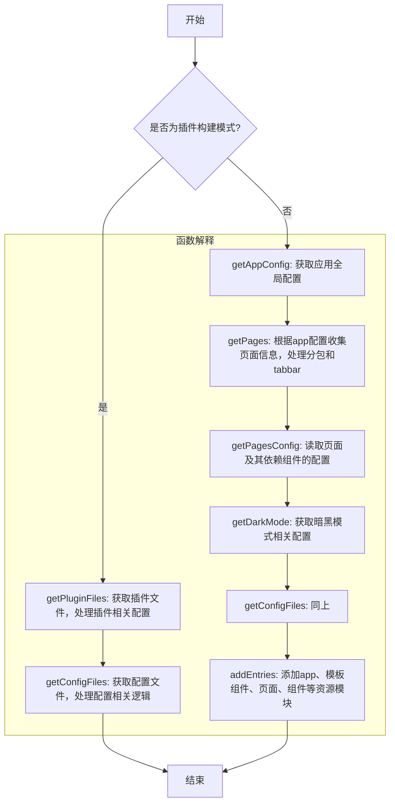
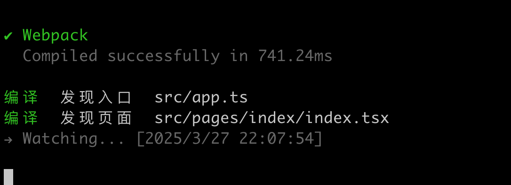

# Taro 源码揭秘：11. Taro 是如何解析入口文件和页面的？

## 1. 前言

大家好，我是[若川](https://ruochuan12.github.io)，欢迎关注我的[公众号：若川视野](https://mp.weixin.qq.com/s/MacNfeTPODNMLLFdzrULow)。我倾力持续组织了 3 年多[每周大家一起学习 200 行左右的源码共读活动](https://juejin.cn/post/7079706017579139102)，感兴趣的可以[点此扫码加我微信 `ruochuan02` 参与](https://juejin.cn/pin/7217386885793595453)。另外，想学源码，极力推荐关注我写的专栏[《学习源码整体架构系列》](https://juejin.cn/column/6960551178908205093)，目前是掘金关注人数（6k+人）第一的专栏，写有几十篇源码文章。

截至目前（`2025-03-25`），目前最新是 [`4.0.9`](https://github.com/NervJS/taro/releases/tag/v4.0.9)，官方`4.0`正式版本的介绍文章暂未发布。官方之前发过[Taro 4.0 Beta 发布：支持开发鸿蒙应用、小程序编译模式、Vite 编译等](https://juejin.cn/post/7330792655125463067)。

计划写一个 Taro 源码揭秘系列，博客地址：[https://ruochuan12.github.io/taro](https://ruochuan12.github.io/taro) 可以加入书签，持续关注[若川](https://juejin.cn/user/1415826704971918)。

-   [x] [1. 揭开整个架构的入口 CLI => taro init 初始化项目的秘密](https://juejin.cn/post/7378363694939783178)
-   [x] [2. 揭开整个架构的插件系统的秘密](https://juejin.cn/post/7380195796208205824)
-   [x] [3. 每次创建新的 taro 项目（taro init）的背后原理是什么](https://juejin.cn/post/7390335741586931738)
-   [x] [4. 每次 npm run dev:weapp 开发小程序，build 编译打包是如何实现的？](https://juejin.cn/post/7403193330271682612)
-   [x] [5. 高手都在用的发布订阅机制 Events 在 Taro 中是如何实现的？](https://juejin.cn/post/7403915119448915977)
-   [x] [6. 为什么通过 Taro.xxx 能调用各个小程序平台的 API，如何设计实现的?](https://juejin.cn/post/7407648740926291968)
-   [x] [7. Taro.request 和请求响应拦截器是如何实现的](https://juejin.cn/post/7415911762128797696)
-   [x] [8. Taro 是如何使用 webpack 打包构建小程序的？](https://juejin.cn/post/7434175547784020031)
-   [x] [9. Taro 是如何生成 webpack 配置进行构建小程序的？](https://juejin.cn/post/7439743635161710604)
-   [x] [10. Taro 到底是怎样转换成小程序文件的？](https://juejin.cn/post/7452329275561279529)
-   [ ] 等等

前面 4 篇文章都是讲述编译相关的，CLI、插件机制、初始化项目、编译构建流程。
第 5-7 篇讲述的是运行时相关的 Events、API、request 等。
第 10 篇接着继续追随第 4 篇和第 8、9 篇的脚步，分析 TaroMiniPlugin webpack 的插件实现。
我们继续分析 TaroMiniPlugin webpack 的插件实现。

关于克隆项目、环境准备、如何调试代码等，参考[第一篇文章-准备工作、调试](https://juejin.cn/post/7378363694939783178#heading-1)。后续文章基本不再过多赘述。

学完本文，你将学到：

```bash
1. Taro 到底是怎样转换成小程序的？
等等
```

我们先来看 TaroMiniPlugin 结构

```ts
export default class TaroMiniPlugin {
	constructor (options: ITaroMiniPluginOptions) {
		// 省略
	}
	/**
   * 插件入口
   */
	apply (compiler: Compiler) {
		this.context = compiler.context
		this.appEntry = this.getAppEntry(compiler)
		// 省略代码
		/** build mode */
		compiler.hooks.run.tapAsync(
			PLUGIN_NAME,
			this.tryAsync<Compiler>(async compiler => {
				await this.run(compiler)
				// 省略
			})
		)
	}
}
```

插件入口 apply 方法

```ts
export default class TaroMiniPlugin {
	/**
	 * 分析 app 入口文件，搜集页面、组件信息，
	 * 往 this.dependencies 中添加资源模块
	 */
	async run(compiler: Compiler) {
		if (this.options.isBuildPlugin) {
			this.getPluginFiles();
			this.getConfigFiles(compiler);
		} else {
			this.appConfig = await this.getAppConfig();
			this.getPages();
			this.getPagesConfig();
			this.getDarkMode();
			this.getConfigFiles(compiler);
			this.addEntries();
		}
	}
}
```

- 插件构建模式 ( this.options.isBuildPlugin 为 true 时)：
  - 调用 getPluginFiles() 获取插件文件
  - 调用 getConfigFiles(compiler) 获取配置文件
- 正常构建模式 ：
  - 首先通过 getAppConfig() 获取应用配置
  - 然后依次执行：
    - getPages() 获取页面信息
    - getPagesConfig() 获取页面配置
    - getDarkMode() 获取暗黑模式配置
    - getConfigFiles(compiler) 获取配置文件
    - addEntries() 添加入口文件



## getAppConfig 获取入口配置文件配置

```ts
async getAppConfig (): Promise<AppConfig> {
    const appName = path.basename(this.appEntry).replace(path.extname(this.appEntry), '')

    this.compileFile({
      name: appName,
      path: this.appEntry,
      isNative: false
    })

    const fileConfig = this.filesConfig[this.getConfigFilePath(appName)]
    const appConfig = fileConfig ? fileConfig.content || {} : {}

    if (isEmptyObject(appConfig)) {
      throw new Error('缺少 app 全局配置文件，请检查！')
    }
    const { modifyAppConfig } = this.options.combination.config
    if (typeof modifyAppConfig === 'function') {
      await modifyAppConfig(appConfig)
    }
    return appConfig as AppConfig
  }
```

```ts
// app.config.ts
export default defineAppConfig({
  pages: [
    'pages/index/index'
  ],
  window: {
    backgroundTextStyle: 'light',
    navigationBarBackgroundColor: '#fff',
    navigationBarTitleText: 'WeChat',
    navigationBarTextStyle: 'black'
  }
})
```

appConfig 配置

```ts
{
  pages: [
    "pages/index/index",
  ],
  window: {
    backgroundTextStyle: "light",
    navigationBarBackgroundColor: "#fff",
    navigationBarTitleText: "WeChat",
    navigationBarTextStyle: "black",
  },
}
```

### compileFile 读取页面、组件的配置，并递归读取依赖的组件的配置

```ts
/**
   * 读取页面、组件的配置，并递归读取依赖的组件的配置
   */
  compileFile (file: IComponent, independentPackage?: IndependentPackage) {
    const filePath = file.path
    const fileConfigPath = file.isNative ? this.replaceExt(filePath, '.json') : this.getConfigFilePath(filePath)
    const fileConfig = readConfig(fileConfigPath, this.options.combination.config)
    const { componentGenerics, usingComponents } = fileConfig

    if (this.options.isBuildPlugin && componentGenerics) {
      // 省略...
    }

    // 递归收集依赖的第三方组件
    if (usingComponents) {
		// 省略...
	}

    this.filesConfig[this.getConfigFilePath(file.name)] = {
      content: fileConfig,
      path: fileConfigPath
    }
  }
```


#### readConfig 读取配置

```ts
export function readConfig<T extends IReadConfigOptions> (configPath: string, options: T = {} as T) {
  let result: any = {}
  if (fs.existsSync(configPath)) {
    if (REG_JSON.test(configPath)) {
      result = fs.readJSONSync(configPath)
    } else {
      result = requireWithEsbuild(configPath, {
        customConfig: {
        },
        customSwcConfig: {
        },
      })
    }

    result = getModuleDefaultExport(result)
  } else {
    result = readPageConfig(configPath)
  }
  return result
}
```

## getPages 获取页面信息

```ts
/**
 * 根据 app config 的 pages 配置项，收集所有页面信息，
 * 包括处理分包和 tabbar
 */
getPages () {
	if (isEmptyObject(this.appConfig)) {
		throw new Error('缺少 app 全局配置文件，请检查！')
	}

	const appPages = this.appConfig.pages
	if (!appPages || !appPages.length) {
		throw new Error('全局配置缺少 pages 字段，请检查！')
	}

	if (!this.isWatch && this.options.logger?.quiet === false) {
		printLog(processTypeEnum.COMPILE, '发现入口', this.getShowPath(this.appEntry))
	}

	const { newBlended, frameworkExts, combination } = this.options
	const { prerender } = combination.config

	this.prerenderPages = new Set(validatePrerenderPages(appPages, prerender).map(p => p.path))
	this.getTabBarFiles(this.appConfig)
	this.pages = new Set([
		...appPages.map<IComponent>(item => {
			const pagePath = resolveMainFilePath(path.join(this.options.sourceDir, item), frameworkExts)
			const pageTemplatePath = this.getTemplatePath(pagePath)
			const isNative = this.isNativePageORComponent(pageTemplatePath)
			return {
				name: item,
				path: pagePath,
				isNative,
				stylePath: isNative ? this.getStylePath(pagePath) : undefined,
				templatePath: isNative ? this.getTemplatePath(pagePath) : undefined
			}
		})
	])
	this.getSubPackages(this.appConfig)
	// 新的混合原生编译模式 newBlended 下，需要收集独立编译为原生自定义组件
	newBlended && this.getNativeComponent()
}
```



## getPagesConfig 读取页面及其依赖的组件的配置

```ts
/**
 * 读取页面及其依赖的组件的配置
 */
getPagesConfig () {
	this.pages.forEach(page => {
		if (!this.isWatch && this.options.logger?.quiet === false) {
			printLog(processTypeEnum.COMPILE, '发现页面', this.getShowPath(page.path))
		}

		const pagePath = page.path
		const independentPackage = this.getIndependentPackage(pagePath)

		this.compileFile(page, independentPackage)
	})
}
```

## getDarkMode 收集 dark mode 配置中的文件

```ts
/**
   * 收集 dark mode 配置中的文件
   */
  getDarkMode () {
    const themeLocation = this.appConfig.themeLocation
    const darkMode = this.appConfig.darkmode
    if (darkMode && themeLocation && typeof themeLocation === 'string') {
      this.themeLocation = themeLocation
    }
  }
```

## getConfigFiles 往 this.dependencies 中新增或修改所有 config 配置模块

```ts
/**
   * 往 this.dependencies 中新增或修改所有 config 配置模块
   */
  getConfigFiles (compiler: Compiler) {
    const filesConfig = this.filesConfig
    Object.keys(filesConfig).forEach(item => {
      if (fs.existsSync(filesConfig[item].path)) {
        this.addEntry(filesConfig[item].path, item, META_TYPE.CONFIG)
      }
    })

    // webpack createChunkAssets 前一刻，去除所有 config chunks
    compiler.hooks.compilation.tap(PLUGIN_NAME, compilation => {
      compilation.hooks.beforeChunkAssets.tap(PLUGIN_NAME, () => {
        const chunks = compilation.chunks
        const configNames = Object.keys(filesConfig)

        for (const chunk of chunks) {
          if (configNames.find(configName => configName === chunk.name)) chunks.delete(chunk)
        }
      })
    })
  }
```

## addEntries 在 this.dependencies 中新增或修改 app、模板组件、页面、组件等资源模块

```ts
/**
   * 在 this.dependencies 中新增或修改 app、模板组件、页面、组件等资源模块
   */
  addEntries () {
    const { template } = this.options

    this.addEntry(this.appEntry, 'app', META_TYPE.ENTRY)
    if (!template.isSupportRecursive) {
      this.addEntry(path.resolve(__dirname, '..', 'template/comp'), 'comp', META_TYPE.STATIC)
    }
    this.addEntry(path.resolve(__dirname, '..', 'template/custom-wrapper'), 'custom-wrapper', META_TYPE.STATIC)
	// 拆分
  }
```

```ts
// packages/taro-helper/src/constants.ts
export enum META_TYPE {
  ENTRY = 'ENTRY',
  PAGE = 'PAGE',
  COMPONENT = 'COMPONENT',
  NORMAL = 'NORMAL',
  STATIC = 'STATIC',
  CONFIG = 'CONFIG',
  EXPORTS = 'EXPORTS',
}
```

```ts

    this.pages.forEach(item => {
      if (item.isNative) {
        this.addEntry(item.path, item.name, META_TYPE.NORMAL, { isNativePage: true })
        if (item.stylePath && fs.existsSync(item.stylePath)) {
          this.addEntry(item.stylePath, this.getStylePath(item.name), META_TYPE.NORMAL)
        }
        if (item.templatePath && fs.existsSync(item.templatePath)) {
          this.addEntry(item.templatePath, this.getTemplatePath(item.name), META_TYPE.NORMAL)
        }
      } else {
        this.addEntry(item.path, item.name, META_TYPE.PAGE)
      }
    })

    this.components.forEach(item => {
      if (item.isNative) {
        this.addEntry(item.path, item.name, META_TYPE.NORMAL, { isNativePage: true })
        if (item.stylePath && fs.existsSync(item.stylePath)) {
          this.addEntry(item.stylePath, this.getStylePath(item.name), META_TYPE.NORMAL)
        }
        if (item.templatePath && fs.existsSync(item.templatePath)) {
          this.addEntry(item.templatePath, this.getTemplatePath(item.name), META_TYPE.NORMAL)
        }
      } else {
        this.addEntry(item.path, item.name, META_TYPE.COMPONENT)
      }
    })
```

最后可以持续关注我[@若川](https://juejin.cn/user/1415826704971918)，欢迎关注我的[公众号：若川视野](https://mp.weixin.qq.com/s/MacNfeTPODNMLLFdzrULow)。我倾力持续组织了 3 年多[每周大家一起学习 200 行左右的源码共读活动](https://juejin.cn/post/7079706017579139102)，感兴趣的可以[点此扫码加我微信 `ruochuan02` 参与](https://juejin.cn/pin/7217386885793595453)。另外，想学源码，极力推荐关注我写的专栏[《学习源码整体架构系列》](https://juejin.cn/column/6960551178908205093)，目前是掘金关注人数（6k+人）第一的专栏，写有几十篇源码文章。
