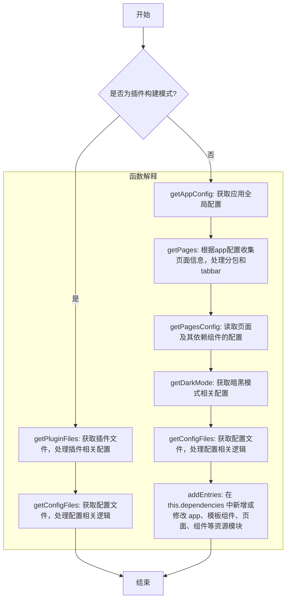
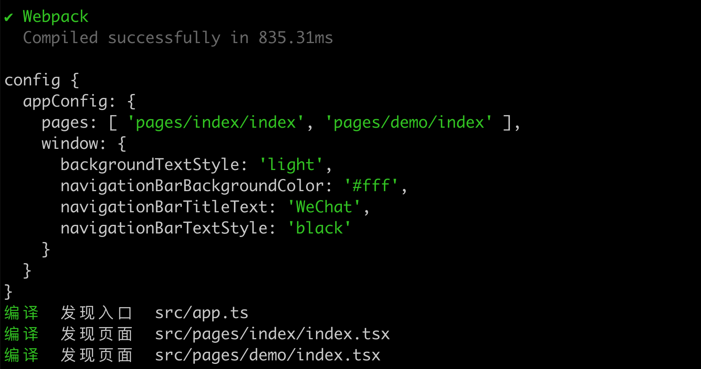
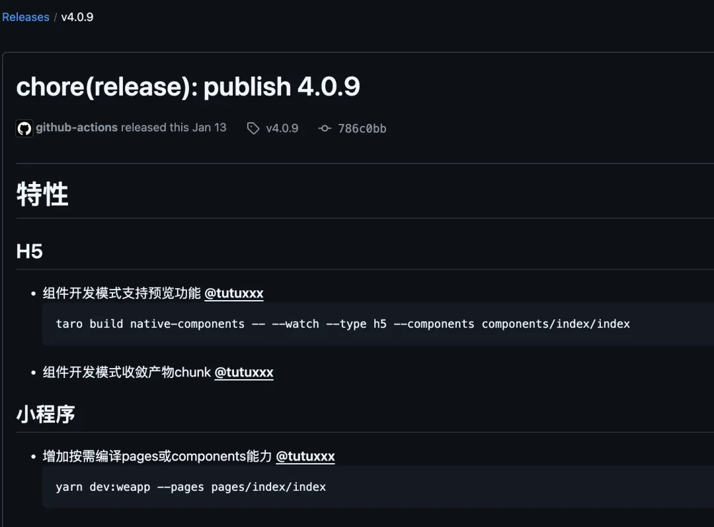
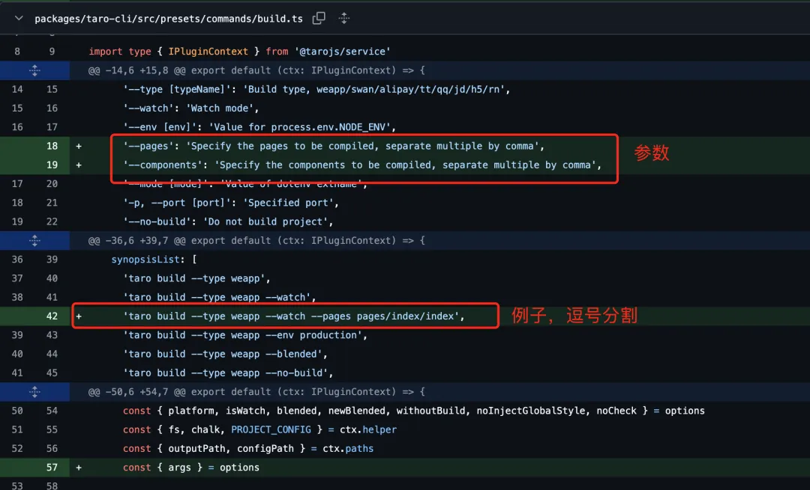
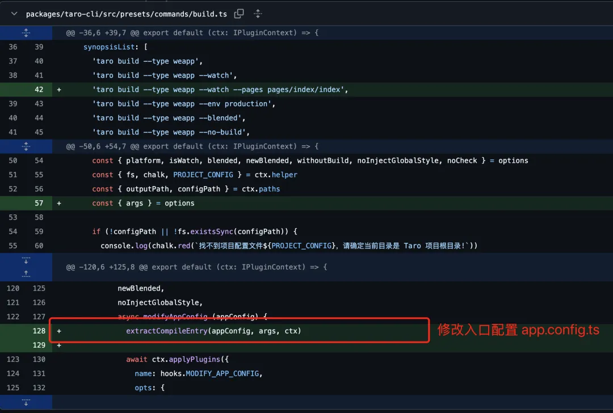
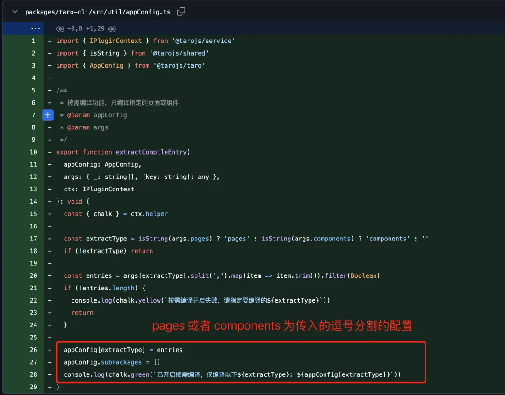
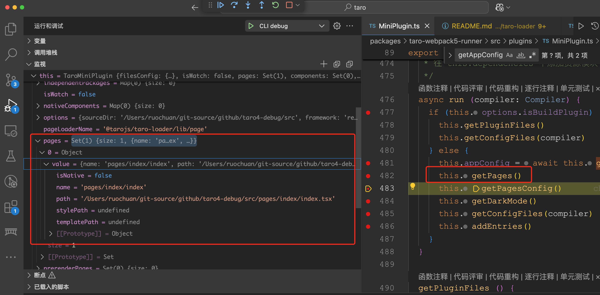
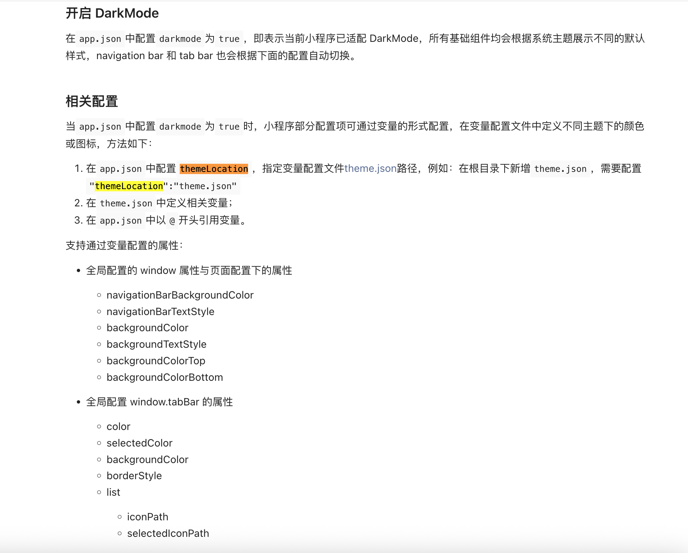

# Taro 源码揭秘：11. Taro 项目开发编译速度太慢，怎么办？写个简单插件按需编译

## 1. 前言

大家好，我是[若川](https://ruochuan12.github.io)，欢迎关注我的[公众号：若川视野](https://mp.weixin.qq.com/s/MacNfeTPODNMLLFdzrULow)。从 2021 年 8 月起，我持续组织了好几年的[每周大家一起学习 200 行左右的源码共读活动](https://juejin.cn/post/7079706017579139102)，感兴趣的可以[点此扫码加我微信 `ruochuan02` 参与](https://juejin.cn/pin/7217386885793595453)。另外，想学源码，极力推荐关注我写的专栏[《学习源码整体架构系列》](https://juejin.cn/column/6960551178908205093)，目前是掘金关注人数（6k+人）第一的专栏，写有几十篇源码文章。

截至目前（`2025-04-16`），目前最新是 [`4.0.12`](https://github.com/NervJS/taro/releases/tag/v4.0.12)，官方`4.0`正式版本的介绍文章暂未发布。官方之前发过[Taro 4.0 Beta 发布：支持开发鸿蒙应用、小程序编译模式、Vite 编译等](https://juejin.cn/post/7330792655125463067)。

计划写一个 Taro 源码揭秘系列，博客地址：[https://ruochuan12.github.io/taro](https://ruochuan12.github.io/taro) 可以加入书签，持续关注[若川](https://juejin.cn/user/1415826704971918)。
>时隔3个月才继续写第 11 篇，我会继续持续写下去，争取做全网最新最全的 Taro 源码系列。

-   [x] [1. 揭开整个架构的入口 CLI => taro init 初始化项目的秘密](https://juejin.cn/post/7378363694939783178)
-   [x] [2. 揭开整个架构的插件系统的秘密](https://juejin.cn/post/7380195796208205824)
-   [x] [3. 每次创建新的 taro 项目（taro init）的背后原理是什么](https://juejin.cn/post/7390335741586931738)
-   [x] [4. 每次 npm run dev:weapp 开发小程序，build 编译打包是如何实现的？](https://juejin.cn/post/7403193330271682612)
-   [x] [5. 高手都在用的发布订阅机制 Events 在 Taro 中是如何实现的？](https://juejin.cn/post/7403915119448915977)
-   [x] [6. 为什么通过 Taro.xxx 能调用各个小程序平台的 API，如何设计实现的?](https://juejin.cn/post/7407648740926291968)
-   [x] [7. Taro.request 和请求响应拦截器是如何实现的](https://juejin.cn/post/7415911762128797696)
-   [x] [8. Taro 是如何使用 webpack 打包构建小程序的？](https://juejin.cn/post/7434175547784020031)
-   [x] [9. Taro 是如何生成 webpack 配置进行构建小程序的？](https://juejin.cn/post/7439743635161710604)
-   [x] [10. Taro 到底是怎样转换成小程序文件的？](https://juejin.cn/post/7452329275561279529)
-   [ ] 等等

前面 4 篇文章都是讲述编译相关的，CLI、插件机制、初始化项目、编译构建流程。

第 5-7 篇讲述的是运行时相关的 Events、API、request 等。

第 10 篇接着继续追随第 4 篇和第 8、9 篇的脚步，分析 TaroMiniPlugin webpack 的插件实现（全流程讲述）。

第 11 篇，我们继续分析 TaroMiniPlugin webpack 的插件实现。分析 Taro 是如何解析入口文件和页面的？

关于克隆项目、环境准备、如何调试代码等，参考[第 1 篇文章-准备工作、调试](https://juejin.cn/post/7378363694939783178#heading-1)和[第 4 篇 npm run dev:weapp（本文以这篇文章中的调试为例）](https://juejin.cn/post/7403193330271682612#heading-2)。后续文章基本不再过多赘述。

学完本文，你将学到：

```bash
1. Taro 是如何解析入口配置 app.config.ts 和页面配置的？
2. 学会写一个 Taro 插件，解决 Taro 项目编译速度太慢的问题
3. 学完能对自己平时写的 Taro 项目更理解透彻
等等
```


我们先来看 TaroMiniPlugin 结构

```ts
// packages/taro-webpack5-runner/src/plugins/MiniPlugin.ts
export default class TaroMiniPlugin {
	constructor (options: ITaroMiniPluginOptions) {
		// 省略
	}
	/**
	* 插件入口
	*/
	apply (compiler: Compiler) {
		this.context = compiler.context
		//  根据 webpack entry 配置获取入口文件路径
		//  @returns app 入口文件路径
		this.appEntry = this.getAppEntry(compiler)
		// 省略代码
		/** build mode */
		compiler.hooks.run.tapAsync(
			PLUGIN_NAME,
			this.tryAsync<Compiler>(async compiler => {
				await this.run(compiler)
				// 省略
			})
		)
	}
}
```

插件入口 apply 方法，获取到 `this.appEntry` `src/app.[js|jsx|ts|tsx]`，调用 `run` 方法。

这里的 `this.appEntry` 是 `"/Users/ruochuan/git-source/github/taro4-debug/src/app.ts"`

本文主要讲述 `run` 方法的具体实现。分析 `app` 入口文件，搜集页面、组件信息，往 `this.dependencies` 中添加资源模块。

```ts
// packages/taro-webpack5-runner/src/plugins/MiniPlugin.ts
export default class TaroMiniPlugin {
	/**
	 * 分析 app 入口文件，搜集页面、组件信息，
	 * 往 this.dependencies 中添加资源模块
	 */
	async run(compiler: Compiler) {
		if (this.options.isBuildPlugin) {
			this.getPluginFiles();
			this.getConfigFiles(compiler);
		} else {
			this.appConfig = await this.getAppConfig();
			this.getPages();
			this.getPagesConfig();
			this.getDarkMode();
			this.getConfigFiles(compiler);
			this.addEntries();
		}
	}
}
```

- 插件构建模式 ( this.options.isBuildPlugin 为 true 时)：
  - 调用 getPluginFiles() 获取插件文件
  - 调用 getConfigFiles(compiler) 获取配置文件
- 正常构建模式：
  - 首先通过 getAppConfig() 获取应用配置
  - 然后依次执行：
    - getPages() 获取页面信息
    - getPagesConfig() 获取页面配置
    - getDarkMode() 获取暗黑模式配置
    - getConfigFiles(compiler) 获取配置文件
    - addEntries() 在 this.dependencies 中新增或修改 app、模板组件、页面、组件等资源模块



## 2. getAppConfig 获取入口配置文件配置

```ts
// packages/taro-webpack5-runner/src/plugins/MiniPlugin.ts
this.appConfig = await this.getAppConfig();
```

入口文件是 `src/app.[js|jsx|ts|tsx]`。
`getAppConfig` 获取入口文件的配置。

这个函数要做的事情是把配置文件 `src/app.config.ts` 转换成

```ts
// src/app.config.ts
export default defineAppConfig({
  pages: [
    'pages/index/index'
  ],
  window: {
    backgroundTextStyle: 'light',
    navigationBarBackgroundColor: '#fff',
    navigationBarTitleText: 'WeChat',
    navigationBarTextStyle: 'black'
  }
})
```

最终这样的对象，方便读取 `pages` 等相关配置，再进行处理。

```ts
{
  pages: [
    "pages/index/index",
  ],
  window: {
    backgroundTextStyle: "light",
    navigationBarBackgroundColor: "#fff",
    navigationBarTitleText: "WeChat",
    navigationBarTextStyle: "black",
  },
}
```

我们来看 `getAppConfig` 的具体实现。

```ts
// packages/taro-webpack5-runner/src/plugins/MiniPlugin.ts
async getAppConfig (): Promise<AppConfig> {
	// 'app'
    const appName = path.basename(this.appEntry).replace(path.extname(this.appEntry), '')

	// 编译处理入口配置文件 app.config.ts
    this.compileFile({
      name: appName,
      path: this.appEntry,
      isNative: false
    })

	// 编译完成，获取文件内容
    const fileConfig = this.filesConfig[this.getConfigFilePath(appName)]
    const appConfig = fileConfig ? fileConfig.content || {} : {}

    if (isEmptyObject(appConfig)) {
      throw new Error('缺少 app 全局配置文件，请检查！')
    }
	// 预留钩子函数可修改配置文件
    const { modifyAppConfig } = this.options.combination.config
    if (typeof modifyAppConfig === 'function') {
      await modifyAppConfig(appConfig)
    }
    return appConfig as AppConfig
  }
```

其中 `compileFile` 函数，简单来说就是读取配置，然后存储到 `this.filesConfig` 上。

`modifyAppConfig` 是传入的修改 `app.config.ts` 配置文件的钩子函数。

### 2.1 modifyAppConfig 修改 app.config.ts 配置文件

可以搜索 Taro 项目中的 `modifyAppConfig`，查看使用场景。

另外，有一种场景，小程序开发页面过多时，加载打包更新就很缓慢。比如这篇文章[古茗是如何将小程序编译速度提升3倍的](https://juejin.cn/post/7339024907718967359#heading-15)，不过这篇文章主要是劫持 `app.config.ts`，当时估计没有这个 `modifyAppConfig` 钩子函数，且他们写的插件没有开源。

我们可以在开发环境，修改 `config` 配置，只设置当前开发的页面。这是一个异步方法，可以直接手动修改，当前要开发的文件，也可以用读取页面出来再选择设置（利用 [enquire](https://www.npmjs.com/package/enquirer) 类似 `npm` 包实现）。这样就可以解决开发环境时打包更新比较慢的情况。

在项目路径 `config/modifyAppConfig.ts` 开发一个插件修改。

```ts
// config/modifyAppConfig.ts
export default async (ctx, options) => {
  await ctx.modifyAppConfig((config) => {
	// 开发环境才修改 config 配置
    if(process.env.NODE_ENV === 'development'){
	  // 只是示例代码
      config.appConfig.pages.push('pages/demo/index');
      console.log('config', config);
    }
  });
};
```

再在项目路径 `config/index.ts` 添加写的 `modifyAppConfig` 插件。

```ts
// config/index.ts
import path from 'node:path';

const baseConfig = {
	// 插件
	plugins: [
		path.resolve(__dirname, './modifyAppConfig.ts'),
	]
}
```

我们重新执行 `pnpm run dev:weapp` 或其他，即可看到输出的配置信息和修改的页面路径。



目前 [Taro 编写插件文档](https://docs.taro.zone/docs/plugin-custom) 上暂时没有体现这个 `modifyAppConfig` 钩子。所以有些时候还是需要深入学习源码，理解源码才能更好的针对项目做相应的优化。

我们继续来看实现 `compileFile` 函数的实现。

### 2.2 Taro 4.0.9 版本增加按需编译 pages 或 components 能力


最近发现 release 4.0.9 有按需编译页面或者组件的功能：[release 4.0.9](https://github.com/NervJS/taro/releases/tag/v4.0.9)



我们来看下是如何实现的。

[feat(cli): 增加按需编译pages或components能力](https://github.com/NervJS/taro/commit/47722ef882f3eaadbcc990a95e3c3484bdf68adc)

我们看下代码修改记录，看看是如何实现的。



```bash
taro build --type weapp --watch --pages pages/index/index
```

可以在终端这样执行命令，可以按需编译 pages 或 components

```bash
pnpm run dev:weapp --pages pages/index/index
pnpm run dev:weapp --components pages/components/index
```



`taro build` 命令中 `modifyAppConfig` 中有个函数 `extratCompileEntry`，我们来看它的具体实现。



我们可以看出，简单来说就是解析命令行参数的 `pages` 或者 `components`，逗号分割是路径（没有配置则不修改），通过 `modifyAppConfig` 钩子函数，修改 `app.config.ts (appConfig)` 的配置文件，`pages` 或者 `components`，`subPackages` 置为空。从而实现了按需编译 `pages` 或者 `components`。

### 2.3 compileFile 读取页面、组件的配置，并递归读取依赖的组件的配置

```ts
// packages/taro-webpack5-runner/src/plugins/MiniPlugin.ts
/**
   * 读取页面、组件的配置，并递归读取依赖的组件的配置
   */
  compileFile (file: IComponent, independentPackage?: IndependentPackage) {
    const filePath = file.path
    const fileConfigPath = file.isNative ? this.replaceExt(filePath, '.json') : this.getConfigFilePath(filePath)
    const fileConfig = readConfig(fileConfigPath, this.options.combination.config)
    const { componentGenerics, usingComponents } = fileConfig

    if (this.options.isBuildPlugin && componentGenerics) {
      // 省略...
    }

    // 递归收集依赖的第三方组件
    if (usingComponents) {
      // 省略...
    }

    this.filesConfig[this.getConfigFilePath(file.name)] = {
      content: fileConfig,
      path: fileConfigPath
    }
  }
```

`compileFile` 相对比较复杂，我们省略了一些代码。

最终给 `this.filesConfig` 赋值，对象如下图所示：


包含配置文件的路径和配置的内容。

这个函数中，其中有一个很关键的函数 `readConfig`，我们来看它的具体实现。

### 2.4 readConfig 读取配置

[页面配置](https://docs.taro.zone/docs/page-config)


```ts
// packages/taro-helper/src/utils.ts
export function readConfig<T extends IReadConfigOptions> (configPath: string, options: T = {} as T) {
  let result: any = {}
  if (fs.existsSync(configPath)) {
    if (REG_JSON.test(configPath)) {
      result = fs.readJSONSync(configPath)
    } else {
      result = requireWithEsbuild(configPath, {
		// 省略若干代码
	  })
    }

    result = getModuleDefaultExport(result)
  } else {
    result = readPageConfig(configPath)
  }
  return result
}
```

[仓库里有更多 readConfig 测试用例](https://github.com/NervJS/taro/blob/main/packages/taro-helper/src/__tests__/config.spec.ts)

我们很容易看出，存在配置文件，如果是JSON，则用 `fs.readJSONSync` 读取。

- 支持多种配置文件格式（支持 JSON 和 JS/TS 文件格式）
- 支持路径别名和常量定义
- 使用 esbuild、SWC 进行快速编译
- 处理模块默认导出
- 支持页面配置读取

其中 `requireWithEsbuild` 函数，看函数名即可猜测出具体含义。基于 `esbuild` 的 `require` 实现。

#### 2.4.1 requireWithEsbuild

```ts
// packages/taro-helper/src/esbuild/index.ts
import { Config, transformSync } from '@swc/core'
import esbuild from 'esbuild'
import requireFromString from 'require-from-string'
// 省略若干代码

/** 基于 esbuild 的 require 实现 */
export function requireWithEsbuild(
  id: string,
  { customConfig = {}, customSwcConfig = {}, cwd = process.cwd() }: IRequireWithEsbuildOptions = {}
) {
  const { outputFiles = [] } = esbuild.buildSync(
	// 省略若干代码
  )

  // Note: esbuild.buildSync 模式下不支持引入插件，所以这里需要手动转换
  const { code = '' } = transformSync(
    outputFiles[0].text,
    defaults(customSwcConfig, {
      jsc: { target: 'es2015' },
    })
  )
  return requireFromString(code, id)
}
```

这块可以调试细看，当然我知道大部分人不会去调试，问题不大，知道个大概即可。后续碰到类似问题能想到这里的解决方案即可。

#### 2.4.2 getModuleDefaultExport 处理模块默认导出

```ts
// packages/taro-helper/src/utils.ts
export const getModuleDefaultExport = (exports) => (exports.__esModule ? exports.default : exports)
```

#### 2.4.3 readPageConfig 读取页面配置

这个函数要实现的功能是：在页面 JS 文件中使用 `definePageConfig` 也能配置读取。


```ts
// packages/taro-helper/src/utils.ts
export function readPageConfig(configPath: string) {
  let result: any = {}
  const extNames = ['.js', '.jsx', '.ts', '.tsx', '.vue']

  // check source file extension
  extNames.some((ext) => {
    const tempPath = configPath.replace('.config', ext)
    if (fs.existsSync(tempPath)) {
      try {
        result = readSFCPageConfig(tempPath)
      } catch (error) {
        result = {}
      }
      return true
    }
  })
  return result
}
```

- 读取页面配置文件
- 支持多种文件格式（.js, .jsx, .ts, .tsx, .vue）
- 调用 readSFCPageConfig 解析文件内容
- 返回解析后的配置对象

#### 2.4.4 readSFCPageConfig

```ts
// packages/taro-helper/src/utils.ts
// read page config from a sfc file instead of the regular config file
function readSFCPageConfig(configPath: string) {
  if (!fs.existsSync(configPath)) return {}

  const sfcSource = fs.readFileSync(configPath, 'utf8')
  const dpcReg = /definePageConfig\(\{[\w\W]+?\}\)/g
  const matches = sfcSource.match(dpcReg)

  let result: any = {}

  if (matches && matches.length === 1) {
    const callExprHandler = (p: any) => {
      const { callee } = p.node
      if (!callee.name) return
      if (callee.name && callee.name !== 'definePageConfig') return

      const configNode = p.node.arguments[0]
      result = exprToObject(configNode)
      p.stop()
    }
    const configSource = matches[0]
    const program = (babel.parse(configSource, { filename: '' }))?.program

    program && babel.traverse(program, { CallExpression: callExprHandler })
  }

  return result
}
```

- 从单文件组件（SFC）中读取页面配置
- 解析 definePageConfig 函数调用
- 将 AST 节点转换为 JavaScript 对象
- 返回解析后的配置对象

[仓库里有更多 readConfig 测试用例](https://github.com/NervJS/taro/blob/main/packages/taro-helper/src/__tests__/config.spec.ts)

上述提到的测试用例缺失，有读者感兴趣可以补上，提 `PR` 的机会来了。也可以修改项目中的配置为页面中的 JS 进行调试。

## 3. getPages 获取页面信息

```ts
// packages/taro-webpack5-runner/src/plugins/MiniPlugin.ts
/**
 * 根据 app config 的 pages 配置项，收集所有页面信息，
 * 包括处理分包和 tabbar
 */
getPages () {
	if (isEmptyObject(this.appConfig)) {
		throw new Error('缺少 app 全局配置文件，请检查！')
	}

	const appPages = this.appConfig.pages
	if (!appPages || !appPages.length) {
		throw new Error('全局配置缺少 pages 字段，请检查！')
	}

	if (!this.isWatch && this.options.logger?.quiet === false) {
		printLog(processTypeEnum.COMPILE, '发现入口', this.getShowPath(this.appEntry))
	}

	const { newBlended, frameworkExts, combination } = this.options
	const { prerender } = combination.config

	// 拆分到下方
}
```

一些判断和校验。
其中经常能在控制台看到的一句提示`发现入口`，源码就是在这里实现的。


```ts
// packages/taro-webpack5-runner/src/plugins/MiniPlugin.ts
	this.prerenderPages = new Set(validatePrerenderPages(appPages, prerender).map(p => p.path))
	this.getTabBarFiles(this.appConfig)
	this.pages = new Set([
		...appPages.map<IComponent>(item => {
			const pagePath = resolveMainFilePath(path.join(this.options.sourceDir, item), frameworkExts)
			const pageTemplatePath = this.getTemplatePath(pagePath)
			const isNative = this.isNativePageORComponent(pageTemplatePath)
			return {
				name: item,
				path: pagePath,
				isNative,
				stylePath: isNative ? this.getStylePath(pagePath) : undefined,
				templatePath: isNative ? this.getTemplatePath(pagePath) : undefined
			}
		})
	])
	this.getSubPackages(this.appConfig)
	// 新的混合原生编译模式 newBlended 下，需要收集独立编译为原生自定义组件
	newBlended && this.getNativeComponent()
}
```

执行这个函数过后，`this.pages` 会得到所有的页面数据。



接下来是获取页面配置信息和组件等。

## 4. getPagesConfig 读取页面及其依赖的组件的配置

```ts
// packages/taro-webpack5-runner/src/plugins/MiniPlugin.ts
/**
 * 读取页面及其依赖的组件的配置
 */
getPagesConfig () {
	this.pages.forEach(page => {
		if (!this.isWatch && this.options.logger?.quiet === false) {
			printLog(processTypeEnum.COMPILE, '发现页面', this.getShowPath(page.path))
		}

		const pagePath = page.path
		const independentPackage = this.getIndependentPackage(pagePath)

		this.compileFile(page, independentPackage)
	})
}
```

其中经常能在控制台看到的一句提示`发现页面`，源码就是在这里实现的。


pages 的配置。


## 5. getDarkMode 收集 dark mode 配置中的文件

```ts
// packages/taro-webpack5-runner/src/plugins/MiniPlugin.ts
/**
   * 收集 dark mode 配置中的文件
   */
  getDarkMode () {
    const themeLocation = this.appConfig.themeLocation
    const darkMode = this.appConfig.darkmode
    if (darkMode && themeLocation && typeof themeLocation === 'string') {
      this.themeLocation = themeLocation
    }
  }
```

[DarkMode 适配指南](https://developers.weixin.qq.com/miniprogram/dev/framework/ability/darkmode.html)



收集起来，后续再使用。

我们接下来看 `getConfigFiles` 的实现。

## 6. getConfigFiles 往 this.dependencies 中新增或修改所有 config 配置模块

```ts
// packages/taro-webpack5-runner/src/plugins/MiniPlugin.ts
/**
   * 往 this.dependencies 中新增或修改所有 config 配置模块
   */
  getConfigFiles (compiler: Compiler) {
    const filesConfig = this.filesConfig
    Object.keys(filesConfig).forEach(item => {
      if (fs.existsSync(filesConfig[item].path)) {
        this.addEntry(filesConfig[item].path, item, META_TYPE.CONFIG)
      }
    })

    // webpack createChunkAssets 前一刻，去除所有 config chunks
    compiler.hooks.compilation.tap(PLUGIN_NAME, compilation => {
      compilation.hooks.beforeChunkAssets.tap(PLUGIN_NAME, () => {
        const chunks = compilation.chunks
        const configNames = Object.keys(filesConfig)

        for (const chunk of chunks) {
          if (configNames.find(configName => configName === chunk.name)) chunks.delete(chunk)
        }
      })
    })
  }
```

把 `compileFile` 编译的文件，全部遍历标记为配置文件，添加到 `dependencies` 中。

`webpack` `createChunkAssets` 前一刻，去除所有 `config chunks`

## 7. addEntries 在 this.dependencies 中新增或修改 app、模板组件、页面、组件等资源模块

加入依赖项中的类型。方便针对不同类型，采用不同的 `loader` 处理。

```ts
// packages/taro-helper/src/constants.ts
export enum META_TYPE {
  ENTRY = 'ENTRY',
  PAGE = 'PAGE',
  COMPONENT = 'COMPONENT',
  NORMAL = 'NORMAL',
  STATIC = 'STATIC',
  CONFIG = 'CONFIG',
  EXPORTS = 'EXPORTS',
}
```

```ts
// packages/taro-webpack5-runner/src/plugins/MiniPlugin.ts
/**
   * 在 this.dependencies 中新增或修改 app、模板组件、页面、组件等资源模块
   */
  addEntries () {
    const { template } = this.options

    this.addEntry(this.appEntry, 'app', META_TYPE.ENTRY)
    if (!template.isSupportRecursive) {
      this.addEntry(path.resolve(__dirname, '..', 'template/comp'), 'comp', META_TYPE.STATIC)
    }
    this.addEntry(path.resolve(__dirname, '..', 'template/custom-wrapper'), 'custom-wrapper', META_TYPE.STATIC)
	// 拆分到下方
  }
```

1. 添加应用入口
2. 添加模板组件
  - 如果模板不支持递归，添加 comp 组件
  - 添加 custom-wrapper 组件
3. 添加页面
- 如果是原生页面，添加页面文件、样式文件和模板文件
- 如果是普通页面，只添加页面文件


遍历页面添加到依赖项中。

```ts
// packages/taro-webpack5-runner/src/plugins/MiniPlugin.ts
    this.pages.forEach(item => {
      if (item.isNative) {
        this.addEntry(item.path, item.name, META_TYPE.NORMAL, { isNativePage: true })
        if (item.stylePath && fs.existsSync(item.stylePath)) {
          this.addEntry(item.stylePath, this.getStylePath(item.name), META_TYPE.NORMAL)
        }
        if (item.templatePath && fs.existsSync(item.templatePath)) {
          this.addEntry(item.templatePath, this.getTemplatePath(item.name), META_TYPE.NORMAL)
        }
      } else {
        this.addEntry(item.path, item.name, META_TYPE.PAGE)
      }
    })
```

遍历组件添加到依赖项中。

```ts
// packages/taro-webpack5-runner/src/plugins/MiniPlugin.ts
    this.components.forEach(item => {
      if (item.isNative) {
        this.addEntry(item.path, item.name, META_TYPE.NORMAL, { isNativePage: true })
        if (item.stylePath && fs.existsSync(item.stylePath)) {
          this.addEntry(item.stylePath, this.getStylePath(item.name), META_TYPE.NORMAL)
        }
        if (item.templatePath && fs.existsSync(item.templatePath)) {
          this.addEntry(item.templatePath, this.getTemplatePath(item.name), META_TYPE.NORMAL)
        }
      } else {
        this.addEntry(item.path, item.name, META_TYPE.COMPONENT)
      }
    })
```

### 7.1 addEntry 在 this.dependencies 中新增或修改模块

```ts
// packages/taro-webpack5-runner/src/plugins/MiniPlugin.ts
/**
   * 在 this.dependencies 中新增或修改模块
   */
  addEntry (entryPath: string, entryName: string, entryType: META_TYPE, options = {}) {
    let dep: TaroSingleEntryDependency
    if (this.dependencies.has(entryPath)) {
      dep = this.dependencies.get(entryPath)!
      dep.name = entryName
      dep.loc = { name: entryName }
      dep.request = entryPath
      dep.userRequest = entryPath
      dep.miniType = entryType
      dep.options = options
    } else {
      dep = new TaroSingleEntryDependency(entryPath, entryName, { name: entryName }, entryType, options)
    }
    this.dependencies.set(entryPath, dep)
  }
```

this.dependencies 是这样的结构。存储的是路径和 TaroSingleEntryDependency 实例对象。如果存在则更新。


行文至此，我们完成了对 `run` 函数的分析。分析 `app` 入口文件，搜集页面、组件信息，往 `this.dependencies` 中添加资源模块。后续针对不同的类型，采用不同的 `loader` 处理等。

## 8. 总结

根据 webpack entry 配置获取入口文件路径
这里的 `this.appEntry` 是 `"/Users/ruochuan/git-source/github/taro4-debug/src/app.ts"`

根据入口文件获取到配置文件，`app.config.ts`。

run 函数

- 首先通过 getAppConfig() 获取应用配置
  - 然后依次执行：
    - getPages() 获取页面信息（从 app.config.ts 中 pages 读取）
    - getPagesConfig() 获取页面配置（找到对应的页面配置）
    - getDarkMode() 获取暗黑模式配置
    - getConfigFiles(compiler) 获取配置文件（包含第三方组件等）
    - addEntries() 在 this.dependencies 中新增或修改 app、模板组件、页面、组件等资源模块

其中 `compileFile` 函数是重点，读取页面、组件的配置，并递归读取依赖的组件的配置。

`readConfig` 读取配置文件

- `fs.readJSONSync` 读取 JSON
- 通过 `esbuild` 的 `require` 实现
- 或者通过 `AST` 读取页面配置文件

启发：Taro 是非常知名的跨端框架，我们在使用它，享受它带来便利的同时，有余力也可以多为其做出一些贡献。比如帮忙解答一些 issue 或者提 pr 修改 bug 等。
在这个过程，我们会不断学习，促使我们去解决问题，带来的好处则是不断拓展知识深度和知识广度。
有些时候还是需要深入学习源码，理解源码才能更好的针对项目做相应的优化。

---

**如果看完有收获，欢迎点赞、评论、分享、收藏支持。你的支持和肯定，是我写作的动力。也欢迎提建议和交流讨论**。

作者：常以**若川**为名混迹于江湖。所知甚少，唯善学。[若川的博客](https://ruochuan12.github.io)，[github blog](https://github.com/ruochuan12/blog)，可以点个 `star` 鼓励下持续创作。

最后可以持续关注我[@若川](https://juejin.cn/user/1415826704971918)，欢迎关注我的[公众号：若川视野](https://mp.weixin.qq.com/s/MacNfeTPODNMLLFdzrULow)。从 2021 年 8 月起，我持续组织了好几年的[每周大家一起学习 200 行左右的源码共读活动](https://juejin.cn/post/7079706017579139102)，感兴趣的可以[点此扫码加我微信 `ruochuan02` 参与](https://juejin.cn/pin/7217386885793595453)。另外，想学源码，极力推荐关注我写的专栏[《学习源码整体架构系列》](https://juejin.cn/column/6960551178908205093)，目前是掘金关注人数（6k+人）第一的专栏，写有几十篇源码文章。
