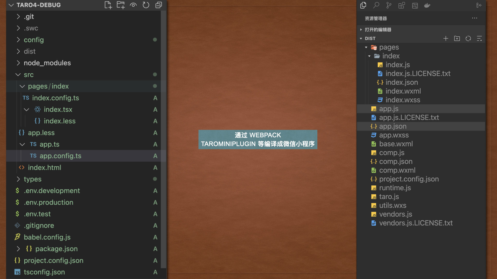
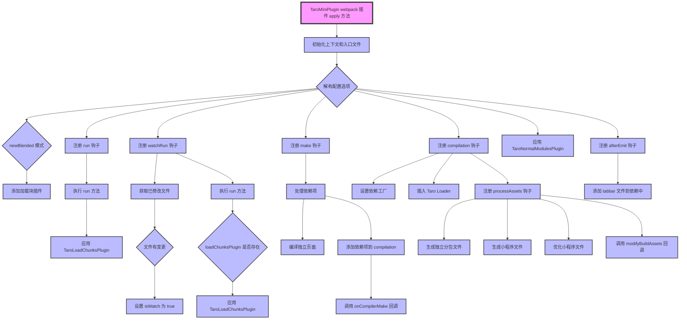
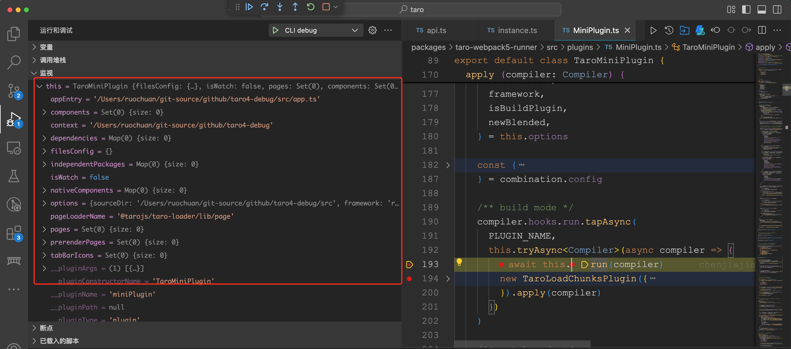
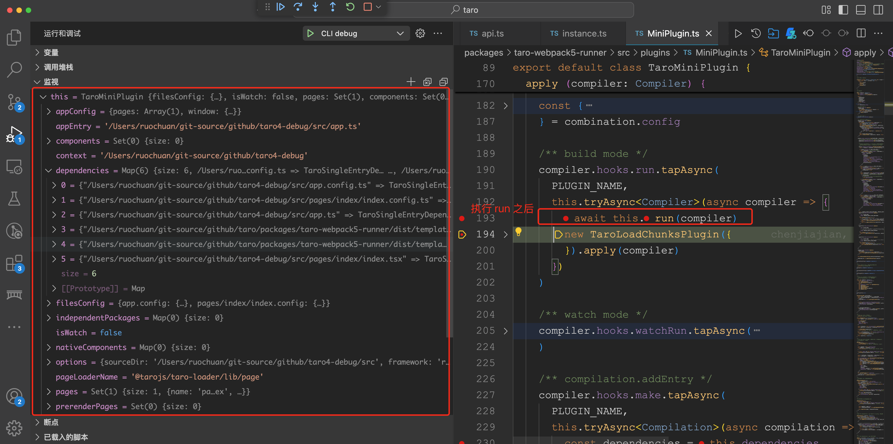

# Taro 源码揭秘：10. Taro 到底是怎样转换成小程序文件的？

## 1. 前言

大家好，我是[若川](https://ruochuan12.github.io)，欢迎关注我的[公众号：若川视野](https://mp.weixin.qq.com/s/MacNfeTPODNMLLFdzrULow)。我倾力持续组织了 3 年多[每周大家一起学习 200 行左右的源码共读活动](https://juejin.cn/post/7079706017579139102)，感兴趣的可以[点此扫码加我微信 `ruochuan02` 参与](https://juejin.cn/pin/7217386885793595453)。另外，想学源码，极力推荐关注我写的专栏[《学习源码整体架构系列》](https://juejin.cn/column/6960551178908205093)，目前是掘金关注人数（6k+人）第一的专栏，写有几十篇源码文章。

截至目前（`2024-12-26`），目前最新是 [`4.0.8`](https://github.com/NervJS/taro/releases/tag/v4.0.8)，官方`4.0`正式版本的介绍文章暂未发布。官方之前发过[Taro 4.0 Beta 发布：支持开发鸿蒙应用、小程序编译模式、Vite 编译等](https://juejin.cn/post/7330792655125463067)。

计划写一个 Taro 源码揭秘系列，博客地址：[https://ruochuan12.github.io/taro](https://ruochuan12.github.io/taro) 可以加入书签，持续关注[若川](https://juejin.cn/user/1415826704971918)。

-   [x] [1. 揭开整个架构的入口 CLI => taro init 初始化项目的秘密](https://juejin.cn/post/7378363694939783178)
-   [x] [2. 揭开整个架构的插件系统的秘密](https://juejin.cn/post/7380195796208205824)
-   [x] [3. 每次创建新的 taro 项目（taro init）的背后原理是什么](https://juejin.cn/post/7390335741586931738)
-   [x] [4. 每次 npm run dev:weapp 开发小程序，build 编译打包是如何实现的？](https://juejin.cn/post/7403193330271682612)
-   [x] [5. 高手都在用的发布订阅机制 Events 在 Taro 中是如何实现的？](https://juejin.cn/post/7403915119448915977)
-   [x] [6. 为什么通过 Taro.xxx 能调用各个小程序平台的 API，如何设计实现的?](https://juejin.cn/post/7407648740926291968)
-   [x] [7. Taro.request 和请求响应拦截器是如何实现的](https://juejin.cn/post/7415911762128797696)
-   [x] [8. Taro 是如何使用 webpack 打包构建小程序的？](https://juejin.cn/post/7434175547784020031)
-   [x] [9. Taro 是如何生成 webpack 配置进行构建小程序的？](https://juejin.cn/post/7439743635161710604)
-   [ ] 等等

前面 4 篇文章都是讲述编译相关的，CLI、插件机制、初始化项目、编译构建流程。
第 5-7 篇讲述的是运行时相关的 Events、API、request 等。
第 10 篇接着继续追随第 4 篇和第 8、9 篇的脚步，分析 TaroMiniPlugin webpack 的插件实现。

关于克隆项目、环境准备、如何调试代码等，参考[第一篇文章-准备工作、调试](https://juejin.cn/post/7378363694939783178#heading-1)。后续文章基本不再过多赘述。

学完本文，你将学到：

```bash
1. Taro 到底是怎样转换成小程序的？
2. 熟悉 webpack 核心库 tapable 事件机制
3. 对 webpack 自定义插件和 compiler 钩子等有比较深刻的认识
4. 对 webpack 自定义 loader 等有比较深刻的认识
等等
```

我们先来看 TaroMiniPlugin 结构

```ts
// packages/taro-webpack5-runner/src/plugins/MiniPlugin.ts
export default class TaroMiniPlugin {
	constructor(options: ITaroMiniPluginOptions) {
		this.options = {};
	}
	// 插件入口
	apply(compiler) {}
}
```

在 webpack.config.js 配置 TaroMiniPlugin。

```ts
// webpack.config.js
export default {
	entry: {},
	output: {},
	plugins: [
		new TaroMiniPlugin({
			// 配置项
		}),
	],
};
```


我们来看[文档：webpack 自定义插件](https://webpack.docschina.org/contribute/writing-a-plugin/)

**创建插件**

webpack 插件由以下组成：

-   一个 JavaScript 命名函数或 JavaScript 类。
-   在插件函数的 prototype 上定义一个 apply 方法。
-   指定一个绑定到 webpack 自身的事件钩子。
-   处理 webpack 内部实例的特定数据。
-   功能完成后调用 webpack 提供的回调。

我们再来看下 webpack 源码中对于插件的处理。就能够更清晰的理解文档的意思。

```ts
// lib/webpack.js
// https://github.com/webpack/webpack/blob/main/lib/webpack.js#L75-L84
if (Array.isArray(options.plugins)) {
	for (const plugin of options.plugins) {
		if (typeof plugin === "function") {
			plugin.call(compiler, compiler);
		} else if (plugin) {
			plugin.apply(compiler);
		}
	}
}
```

`TaroMiniPlugin` 插件的主要作用就是把 `Taro` 项目转换成小程序项目。如下图所示：



本文我们来分析其实现和原理。

## 2. 插件属性

```ts
export default class TaroMiniPlugin {
	/** 插件配置选项 */
	options: IOptions;
	// Webpack 编译上下文
	context: string;
	/** app 入口文件路径 */
	appEntry: string;
	/** app config 配置内容 */
	appConfig: AppConfig;
	/** app、页面、组件的配置集合 */
	filesConfig: IMiniFilesConfig = {};
	//  是否处于 watch 模式
	isWatch = false;
	/** 页面列表 */
	pages = new Set<IComponent>();
	// 组件集合
	components = new Set<IComponent>();
	/** 新的混合原生编译模式 newBlended 模式下，需要单独编译成原生代码的 component 的Map */
	nativeComponents = new Map<string, IComponent>();
	/** tabbar icon 图片路径列表 */
	tabBarIcons = new Set<string>();
	//  预渲染页面集合
	prerenderPages = new Set<string>();
	// 依赖集合
	dependencies = new Map<string, TaroSingleEntryDependency>();
	// 加载块插件实例。
	loadChunksPlugin: TaroLoadChunksPlugin;
	// 主题位置
	themeLocation: string;
	// 页面 loader 名称
	pageLoaderName = "@tarojs/taro-loader/lib/page";
	// 独立包集合
	independentPackages = new Map<string, IndependentPackage>();
}
```

**Taro 项目 - 入口文件**

```ts
// src/app.ts
import { PropsWithChildren } from "react";
import { useLaunch } from "@tarojs/taro";
import "./app.less";

function App({ children }: PropsWithChildren<any>) {
	useLaunch(() => {
		console.log("App launched.");
	});
	// children 是将要会渲染的页面
	return children;
}

export default App;
```

**Taro 项目 - 入口配置**

```ts
// src/app.config.ts
export default defineAppConfig({
	pages: ["pages/index/index"],
	window: {
		backgroundTextStyle: "light",
		navigationBarBackgroundColor: "#fff",
		navigationBarTitleText: "WeChat",
		navigationBarTextStyle: "black",
	},
});
```

## 3. 插件入口 apply 函数

我们来看插件入口 apply 函数的流程。

```ts
export default class TaroMiniPlugin {
	// 插件入口
	apply(compiler: Compiler) {
		this.context = compiler.context;
		this.appEntry = this.getAppEntry(compiler);

		const {
			commonChunks,
			combination,
			framework,
			isBuildPlugin,
			newBlended,
		} = this.options;

		// 省略若干代码...

		/** build mode */
		compiler.hooks.run.tapAsync();

		/** watch mode */
		compiler.hooks.watchRun.tapAsync();

		/** compilation.addEntry */
		compiler.hooks.make.tapAsync();

		compiler.hooks.compilation.tap();

		compiler.hooks.afterEmit.tapAsync();

		new TaroNormalModulesPlugin(onParseCreateElement).apply(compiler);

		newBlended && this.addLoadChunksPlugin(compiler);
	}
}
```

[tapable](https://github.com/webpack/tapable) 事件机制

tap 是监听注册事件、call 是执行事件

和第5篇类似 [5. 高手都在用的发布订阅机制 Events 在 Taro 中是如何实现的？](https://juejin.cn/post/7403915119448915977)

-   compiler.hooks.run.tapAsync(); 开始编译
-   compiler.hooks.watchRun.tapAsync(); 开始编译（监听模式）
-   compiler.hooks.make.tapAsync(); 从 entry 开始递归的分析依赖，对每个依赖模块进行 build
-   compiler.hooks.compilation.tap();
-   compiler.hooks.afterEmit.tapAsync(); 输出文件到目录（之后）

插件入口 apply 函数的执行过程如下图所示：
有个大概印象即可，后文继续看具体代码实现。



## 4. 注册 compiler.hooks.run 钩子

```ts
const PLUGIN_NAME = 'TaroMiniPlugin'
```

```ts
/** build mode */
compiler.hooks.run.tapAsync(
	PLUGIN_NAME,
	this.tryAsync<Compiler>(async (compiler) => {
		await this.run(compiler);
		new TaroLoadChunksPlugin({
			commonChunks: commonChunks,
			isBuildPlugin,
			addChunkPages,
			pages: this.pages,
			framework: framework,
		}).apply(compiler);
	})
);
```

tapAsync
当我们用 tapAsync 方法来绑定插件时，必须调用函数的最后一个参数 callback 指定的回调函数。

所以封装了一个 `tryAsync` 方法。

### 4.1 tryAsync 函数 - 自动驱动 tapAsync

```ts
/**
 * 自动驱动 tapAsync
 */
tryAsync<T extends Compiler | Compilation> (fn: (target: T) => Promise<any>) {
    return async (arg: T, callback: any) => {
      try {
        await fn(arg)
        callback()
      } catch (err) {
        callback(err)
      }
    }
}
```

调试源码。本文就不赘述了，分别是[第 1 篇 taro init](https://juejin.cn/post/7378363694939783178#heading-1)和[第 4 篇 npm run dev:weapp](https://juejin.cn/post/7403193330271682612#heading-2)详细讲述过。



### 4.2 run 函数 - 分析 app 入口文件，搜集页面、组件信息

```ts
/**
 * 分析 app 入口文件，搜集页面、组件信息，
 * 往 this.dependencies 中添加资源模块
 */
async run (compiler: Compiler) {
	if (this.options.isBuildPlugin) {
		this.getPluginFiles()
		this.getConfigFiles(compiler)
	} else {
		this.appConfig = await this.getAppConfig()
		this.getPages()
		this.getPagesConfig()
		this.getDarkMode()
		this.getConfigFiles(compiler)
		this.addEntries()
	}
}
```



## 5. 注册 compiler.hooks.watchRun 钩子

```ts
/** watch mode */
compiler.hooks.watchRun.tapAsync(
	PLUGIN_NAME,
	this.tryAsync<Compiler>(async (compiler) => {
		const changedFiles = this.getChangedFiles(compiler);
		if (changedFiles && changedFiles?.size > 0) {
			this.isWatch = true;
		}
		await this.run(compiler);
		if (!this.loadChunksPlugin) {
			this.loadChunksPlugin = new TaroLoadChunksPlugin({
				commonChunks: commonChunks,
				isBuildPlugin,
				addChunkPages,
				pages: this.pages,
				framework: framework,
			});
			this.loadChunksPlugin.apply(compiler);
		}
	})
);
```

## 6. 注册 compiler.hooks.make 钩子

```ts
/** compilation.addEntry */
compiler.hooks.make.tapAsync(
	PLUGIN_NAME,
	this.tryAsync<Compilation>(async (compilation) => {
		const dependencies = this.dependencies;
		const promises: Promise<null>[] = [];
		this.compileIndependentPages(
			compiler,
			compilation,
			dependencies,
			promises
		);
		dependencies.forEach((dep) => {
			promises.push(
				new Promise<null>((resolve, reject) => {
					compilation.addEntry(
						this.options.sourceDir,
						dep,
						{
							name: dep.name,
							...dep.options,
						},
						(err) => (err ? reject(err) : resolve(null))
					);
				})
			);
		});
		await Promise.all(promises);
		await onCompilerMake?.(compilation, compiler, this);
	})
);
```

遍历收集好的页面 `dependencies` 页面依赖，`addEntry` 添加入口，也就是说是多入口编译文件。调用开发者传入的 onCompilerMake 钩子函数。

## 7. 注册 compiler.hooks.compilation 钩子

```ts
compiler.hooks.compilation.tap(
	PLUGIN_NAME,
	(compilation, { normalModuleFactory }) => {
		/** For Webpack compilation get factory from compilation.dependencyFactories by denpendence's constructor */
		compilation.dependencyFactories.set(
			EntryDependency,
			normalModuleFactory
		);
		compilation.dependencyFactories.set(
			TaroSingleEntryDependency as any,
			normalModuleFactory
		);

		/**
		 * webpack NormalModule 在 runLoaders 真正解析资源的前一刻，
		 * 往 NormalModule.loaders 中插入对应的 Taro Loader
		 */
		compiler.webpack.NormalModule.getCompilationHooks(
			compilation
		).loader.tap(
			PLUGIN_NAME,
			(_loaderContext, module: /** TaroNormalModule */ any) => {
				// 拆开放在下方讲述
			}
		);

		const {
			PROCESS_ASSETS_STAGE_ADDITIONAL,
			PROCESS_ASSETS_STAGE_OPTIMIZE,
			PROCESS_ASSETS_STAGE_REPORT,
		} = compiler.webpack.Compilation;

		// 拆开放在下方讲述
		compilation.hooks.processAssets.tapAsync();
	}
);
```

### 7.1 compiler.webpack.NormalModule.getCompilationHooks(compilation).loader.tap

```ts
/**
 * webpack NormalModule 在 runLoaders 真正解析资源的前一刻，
 * 往 NormalModule.loaders 中插入对应的 Taro Loader
 */
compiler.webpack.NormalModule.getCompilationHooks(compilation).loader.tap(
	PLUGIN_NAME,
	(_loaderContext, module: /** TaroNormalModule */ any) => {
		const { framework, loaderMeta, pxTransformConfig } = this.options;

		if (module.miniType === META_TYPE.ENTRY) {
			const loaderName = "@tarojs/taro-loader";
			if (!isLoaderExist(module.loaders, loaderName)) {
				module.loaders.unshift({
					loader: loaderName,
					options: {
						// 省略参数 ...
					},
				});
			}
		} else if (module.miniType === META_TYPE.PAGE) {
			let isIndependent = false;
			this.independentPackages.forEach(({ pages }) => {
				if (pages.includes(module.resource)) {
					isIndependent = true;
				}
			});
			const isNewBlended = this.nativeComponents.has(module.name);
			const loaderName =
				isNewBlended || isBuildPlugin
					? "@tarojs/taro-loader/lib/native-component"
					: isIndependent
					? "@tarojs/taro-loader/lib/independentPage"
					: this.pageLoaderName;

			if (!isLoaderExist(module.loaders, loaderName)) {
				module.loaders.unshift({
					loader: loaderName,
					options: {
						// 省略参数 ...
					},
				});
			}
		} else if (module.miniType === META_TYPE.COMPONENT) {
			const loaderName = isBuildPlugin
				? "@tarojs/taro-loader/lib/native-component"
				: "@tarojs/taro-loader/lib/component";
			if (!isLoaderExist(module.loaders, loaderName)) {
				module.loaders.unshift({
					loader: loaderName,
					options: {
						// 省略参数 ...
					},
				});
			}
		}
	}
);
```

webpack NormalModule 在 runLoaders 真正解析资源的前一刻，
往 NormalModule.loaders 中插入对应的 Taro Loader

-   入口文件使用 @tarojs/taro-loader
-   页面使用 @tarojs/taro-loader/lib/page
-   原生组件使用 @tarojs/taro-loader/lib/native-component
-   组件使用 @tarojs/taro-loader/lib/component
-   独立分包使用 @tarojs/taro-loader/lib/independentPage

### 7.2 注册 compilation.hooks.processAssets 钩子

```ts
const {
	PROCESS_ASSETS_STAGE_ADDITIONAL,
	PROCESS_ASSETS_STAGE_OPTIMIZE,
	PROCESS_ASSETS_STAGE_REPORT,
} = compiler.webpack.Compilation;
compilation.hooks.processAssets.tapAsync(
	{
		name: PLUGIN_NAME,
		stage: PROCESS_ASSETS_STAGE_ADDITIONAL,
	},
	this.tryAsync<any>(async () => {
		// 如果是子编译器，证明是编译独立分包，进行单独的处理
		if ((compilation as any).__tag === CHILD_COMPILER_TAG) {
			await this.generateIndependentMiniFiles(compilation, compiler);
		} else {
			await this.generateMiniFiles(compilation, compiler);
		}
	})
);
compilation.hooks.processAssets.tapAsync(
	{
		name: PLUGIN_NAME,
		// 删除 assets 的相关操作放在触发时机较后的 Stage，避免过早删除出现的一些问题，#13988
		// Stage 触发顺序：https://webpack.js.org/api/compilation-hooks/#list-of-asset-processing-stages
		stage: PROCESS_ASSETS_STAGE_OPTIMIZE,
	},
	this.tryAsync<any>(async () => {
		await this.optimizeMiniFiles(compilation, compiler);
	})
);

compilation.hooks.processAssets.tapAsync(
	{
		name: PLUGIN_NAME,
		// 该 stage 是最后执行的，确保 taro 暴露给用户的钩子 modifyBuildAssets 在内部处理完 assets 之后再调用
		stage: PROCESS_ASSETS_STAGE_REPORT,
	},
	this.tryAsync<any>(async () => {
		if (typeof modifyBuildAssets === "function") {
			await modifyBuildAssets(compilation.assets, this);
		}
	})
);
```

-   在 PROCESS_ASSETS_STAGE_ADDITIONAL 阶段，如果是子编译器，证明是编译独立分包，进行单独的处理，否则生成小程序文件
-   在 PROCESS_ASSETS_STAGE_OPTIMIZE 阶段，优化小程序文件
-   在 PROCESS_ASSETS_STAGE_REPORT 阶段，调用开发者传入的自定义的钩子 modifyBuildAssets 函数 修改编译产物

## 8. 注册 compiler.hooks.afterEmit 钩子

```ts
compiler.hooks.afterEmit.tapAsync(
	PLUGIN_NAME,
	this.tryAsync<Compilation>(async (compilation) => {
		await this.addTarBarFilesToDependencies(compilation);
	})
);
```

生成文件之后，添加 tabbar 文件到依赖中。

## 9. 总结

最后我们来总结一下，`TaroMiniPlugin` 是 webpack 插件。

本文我们主要是通过调试源码，分析了插件入口 apply 函数。

其主要实现是读取入口文件、入口配置，把页面、页面配置和组件等收集起来。
然后交给 `webpack` 处理（对应的 `taro-loader`）。
最后输出对应平台的小程序文件（template、css、json 等）。

我们学习了 webpack 插件的编写和 tapable 的作用。知道了 TaroMiniPlugin 原理。

启发：Taro 是非常知名的跨端框架，我们在使用它，享受它带来便利的同时，有余力也可以多为其做出一些贡献。比如帮忙解答一些 issue 或者提 pr 修改 bug 等。
在这个过程，我们会不断学习，促使我们去解决问题，带来的好处则是不断拓展知识深度和知识广度。

---

**如果看完有收获，欢迎点赞、评论、分享、收藏支持。你的支持和肯定，是我写作的动力。也欢迎提建议和交流讨论**。

作者：常以**若川**为名混迹于江湖。所知甚少，唯善学。[若川的博客](https://ruochuan12.github.io)，[github blog](https://github.com/ruochuan12/blog)，可以点个 `star` 鼓励下持续创作。

最后可以持续关注我[@若川](https://juejin.cn/user/1415826704971918)，欢迎关注我的[公众号：若川视野](https://mp.weixin.qq.com/s/MacNfeTPODNMLLFdzrULow)。我倾力持续组织了 3 年多[每周大家一起学习 200 行左右的源码共读活动](https://juejin.cn/post/7079706017579139102)，感兴趣的可以[点此扫码加我微信 `ruochuan02` 参与](https://juejin.cn/pin/7217386885793595453)。另外，想学源码，极力推荐关注我写的专栏[《学习源码整体架构系列》](https://juejin.cn/column/6960551178908205093)，目前是掘金关注人数（6k+人）第一的专栏，写有几十篇源码文章。
