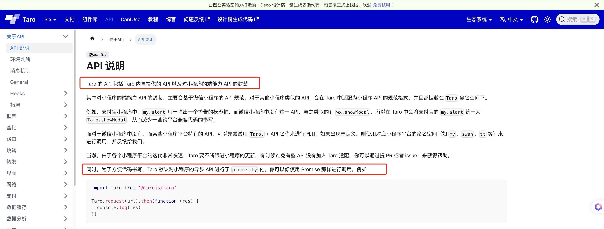

# Taro 4.0 已正式发布 - 6. 为什么通过 Taro.xxx 能调用各个小程序平台的 API，如何实现的?

## 1. 前言

大家好，我是[若川](https://juejin.cn/user/1415826704971918)，欢迎关注我的[公众号：若川视野](https://mp.weixin.qq.com/s/MacNfeTPODNMLLFdzrULow)。我倾力持续组织了 3 年多[每周大家一起学习 200 行左右的源码共读活动](https://juejin.cn/post/7079706017579139102)，感兴趣的可以[点此扫码加我微信 `ruochuan02` 参与](https://juejin.cn/pin/7217386885793595453)。另外，想学源码，极力推荐关注我写的专栏[《学习源码整体架构系列》](https://juejin.cn/column/6960551178908205093)，目前是掘金关注人数（6k+人）第一的专栏，写有几十篇源码文章。

截至目前（`2024-08-28`），[`taro 4.0` 正式版已经发布](https://github.com/NervJS/taro/releases/tag/v4.0.3)，目前最新是 `4.0.5`，官方`4.0`正式版本的介绍文章暂未发布。官方之前发过[Taro 4.0 Beta 发布：支持开发鸿蒙应用、小程序编译模式、Vite 编译等](https://juejin.cn/post/7330792655125463067)。

计划写一个 `taro` 源码揭秘系列，欢迎持续关注。

-   [x] [1. 揭开整个架构的入口 CLI => taro init 初始化项目的秘密](https://juejin.cn/post/7378363694939783178)
-   [x] [2. 揭开整个架构的插件系统的秘密](https://juejin.cn/spost/7380195796208205824)
-   [x] [3. 每次创建新的 taro 项目（taro init）的背后原理是什么](https://juejin.cn/post/7390335741586931738)
-   [x] [4. 每次 npm run dev:weapp 开发小程序，build 编译打包是如何实现的？](https://juejin.cn/post/7403193330271682612)
-   [x] [5. 高手都在用的发布订阅机制 Events 在 Taro 中是如何实现的？](https://juejin.cn/post/7403915119448915977)
-   [ ] 等等

前面 4 篇文章都是讲述编译相关的，CLI、插件机制、初始化项目、编译构建流程。第 6 篇我们来讲些相对简单的，Taro 是如何实现 `Taro.xxx` 能访问 `wx.xxx`（文章以微信小程序为例）。

学完本文，你将学到：

```bash
等等
```

## 2. 文档

[Taro 文档 - API 说明](https://docs.taro.zone/docs/apis/about/desc)



```ts
import Taro from '@tarojs/taro'

Taro.request(url).then(function (res) {
  console.log(res)
})
```

我们具体来分析下，`Taro` 源码中是如何实现 `Taro.xxx` 访问 `wx.xxx` 的，并且是如何实现 `promisify` 的。

`promisify` 把回调函数转成 `promise` 避免回调地狱问题。面试也经常考察此题。我之前写过一篇文章：[从22行有趣的源码库中，我学到了 callback promisify 化的 Node.js 源码实现](https://juejin.cn/post/7028731182216904740#heading-11)

文章中简单的 `promisify` 函数实现如下：

```ts
// 简单的 promisify 函数
function promisify(original){
    function fn(...args){
        return new Promise((resolve, reject) => {
            args.push((err, ...values) => {
                if(err){
                    return reject(err);
                }
                resolve(values);
            });
            // original.apply(this, args);
            Reflect.apply(original, this, args);
        });
    }
    return fn;
}
```

我们日常开发都会引入 `@tarojs/taro`，然后调用 `Taro.xxx` 方法，比如 `Taro.navigateTo`，微信小程序调用的是 `wx.navigateTo`，支付宝小程序则是 `my.navigateTo`。

我们先来看 `@tarojs/taro` 的代码。

## 3. @tarojs/taro taro 入口

```ts
// packages/taro/index.js
const { hooks } = require('@tarojs/runtime')
const taro = require('@tarojs/api').default

if (hooks.isExist('initNativeApi')) {
  hooks.call('initNativeApi', taro)
}

module.exports = taro
module.exports.default = module.exports
```

`hooks` 和 `@tarojs/api` 在上篇文章[5.高手都在用的发布订阅机制 Events 在 Taro 中是如何实现的？](https://juejin.cn/post/7403915119448915977#heading-20)讲过。
简单来说就是 `tap` 是注册事件，`call` 是触发事件。其中 `mergeReconciler` 函数中注册`initNativeApi`函数。

这时我们需要来寻找 `initNativeApi` 函数在哪里实现的。可以在Taro源码中根据 `initNativeApi` 关键字搜索。或者之前的第三篇文章 [3. taro build](https://juejin.cn/post/7403193330271682612)。我们知道端平台插件的代码在 `@tarojs/plugin-platform-weapp` 包中，路径是 `packages/taro-platform-weapp/src/program.ts`。

## 4. new Weapp 端平台插件

```ts
// packages/taro-platform-weapp/src/program.ts
import { TaroPlatformBase } from '@tarojs/service'

// 省略若干代码

const PACKAGE_NAME = '@tarojs/plugin-platform-weapp'

export default class Weapp extends TaroPlatformBase {
  template: Template
  platform = 'weapp'
  globalObject = 'wx'
  projectConfigJson: string = this.config.projectConfigName || 'project.config.json'
  runtimePath = `${PACKAGE_NAME}/dist/runtime`
  //   省略若干代码
}
```

`runtimePath` 路径：`@tarojs/plugin-platform-weapp/dist/runtime`。

对应的运行时路径 `packages/taro-platform-weapp/src/runtime.ts`。

## 5. 运行时 runtime.ts

```ts
// packages/taro-platform-weapp/src/runtime.ts
import { mergeInternalComponents, mergeReconciler } from '@tarojs/shared'

import { components, hostConfig } from './runtime-utils'

mergeReconciler(hostConfig)
mergeInternalComponents(components)
```

- 使用 `mergeReconciler` 函数把自定义的 hostConfig 合并到全局 [Reconciler](https://docs.taro.zone/docs/platform-plugin/reconciler) 中。
- 使用 `mergeInternalComponents` 函数把自定义组件信息 [components.ts](https://docs.taro.zone/docs/platform-plugin/platform-mini#31-%E7%BC%96%E5%86%99-componentsts) 合并到全局 internalComponents 组件信息对象中。

我们来看下 `mergeReconciler` 函数的实现。

## 6. mergeReconciler 函数

```ts
// packages/shared/src/utils.ts
import { hooks } from './runtime-hooks'
export function mergeReconciler (hostConfig, hooksForTest?) {
  const obj = hooksForTest || hooks
  const keys = Object.keys(hostConfig)
  keys.forEach(key => {
    obj.tap(key, hostConfig[key])
  })
}
```

`obj.tap(key, hostConfig[key])` 是注册事件，在 `call` 调用。

## 7. hostConfig

```ts
// packages/taro-platform-weapp/src/runtime-utils.ts
import { Shortcuts, toCamelCase } from '@tarojs/shared'

import { initNativeApi } from './apis'

declare const getCurrentPages: any

export { initNativeApi }
export * from './apis-list'
export * from './components'
export const hostConfig = {
  initNativeApi,
  getMiniLifecycle (config) {
    const methods = config.page[5]
    if (methods.indexOf('onSaveExitState') === -1) {
      methods.push('onSaveExitState')
    }
    return config
  },
  transferHydrateData (data, element, componentsAlias) {
    // 省略若干代码
  },
}

```

我们接着来看 `initNativeApi` 函数。

## 8. initNativeApi 初始化原始 api

```ts
// packages/taro-platform-weapp/src/apis.ts
import { processApis } from '@tarojs/shared'

import { needPromiseApis } from './apis-list'

declare const wx: any

export function initNativeApi (taro) {
  processApis(taro, wx, {
    needPromiseApis,
    modifyApis (apis) {
      // fix https://github.com/NervJS/taro/issues/9899
      apis.delete('lanDebug')
    },
    transformMeta (api: string, options: Record<string, any>) {
      if (api === 'showShareMenu') {
        options.menus = options.showShareItems?.map(item => item === 'wechatFriends' ? 'shareAppMessage' : item === 'wechatMoment' ? 'shareTimeline' : item)
      }

      return {
        key: api,
        options
      }
    }
  })
  taro.cloud = wx.cloud
  taro.getTabBar = function (pageCtx) {
    if (typeof pageCtx?.getTabBar === 'function') {
      return pageCtx.getTabBar()?.$taroInstances
    }
  }
  taro.getRenderer = function () {
    return taro.getCurrentInstance()?.page?.renderer ?? 'webview'
  }
}

```

`initNativeApi` 函数中调用了 `processApis` 函数，把 `wx` 的 `api` 转换成 `taro` 的 `api`。我们接着来看 `processApis` 函数的具体实现。

## 9. processApis 处理 apis

```ts
// packages/shared/src/native-apis.ts

// 需要 promisify 的 api 列表（内置的，所有端平台都用得上的）
const needPromiseApis = new Set<string>([
  // 省略了很多 api，这里相对常用的留一些
  'chooseAddress', 'chooseImage', 'chooseLocation', 'downloadFile','getLocation', 'navigateBack', 'navigateTo', 'openDocument', 'openLocation', 'reLaunch', 'redirectTo', 'scanCode', 'showModal', 'showToast', 'switchTab', 'uploadFile',
])

// processApis 参数对象
interface IProcessApisIOptions {
  // 不需要 promisify 的 api
  noPromiseApis?: Set<string>
  // 需要 promisify 的 api
  needPromiseApis?: Set<string>
  // handleSyncApis 磨平差异
  handleSyncApis?: (key: string, global: IObject, args: any[]) => any
  // 改变 key 或 option 字段，如需要把支付宝标准的字段对齐微信标准的字段
  transformMeta?: (key: string, options: IObject) => { key: string, options: IObject }
  //  修改 apis
  modifyApis?: (apis: Set<string>) => void
  //  修改返回结果
  modifyAsyncResult?: (key: string, res) => void
//   是否只 promisify，只在 plugin-inject 端使用
  isOnlyPromisify?: boolean
  [propName: string]: any
}

function processApis (taro, global, config: IProcessApisIOptions = {}) {
	// 省略...
}
```

我们来看 `processApis` 函数的具体实现。

```ts
// packages/shared/src/native-apis.ts
function processApis (taro, global, config: IProcessApisIOptions = {}) {
  // 端平台插件中定义的一些需要 promisify 的 api
  const patchNeedPromiseApis = config.needPromiseApis || []
  const _needPromiseApis = new Set<string>([...patchNeedPromiseApis, ...needPromiseApis])
  //  保留的 api
  const preserved = [
    'getEnv',
    'interceptors',
    'Current',
    'getCurrentInstance',
    'options',
    'nextTick',
    'eventCenter',
    'Events',
    'preload',
    'webpackJsonp'
  ]

  const apis = new Set(
    !config.isOnlyPromisify
      ? Object.keys(global).filter(api => preserved.indexOf(api) === -1)
      : patchNeedPromiseApis
  )

  if (config.modifyApis) {
    config.modifyApis(apis)
  }

  apis.forEach(key => {
    // 省略，拆开到下方
  })

  !config.isOnlyPromisify && equipCommonApis(taro, global, config)
}
```

### 9.1 apis.forEach 需要 promisify 的 api 逻辑

`nonsupport` 函数

```ts
// packages/shared/src/utils.ts
export function nonsupport (api) {
  return function () {
    console.warn(`小程序暂不支持 ${api}`)
  }
}
```

```js
// packages/shared/src/native-apis.ts
apis.forEach(key => {
    if (_needPromiseApis.has(key)) {
      const originKey = key
      taro[originKey] = (options: Record<string, any> | string = {}, ...args) => {
        let key = originKey

        // 第一个参数 options 为字符串，单独处理
        if (typeof options === 'string') {
          if (args.length) {
            return global[key](options, ...args)
          }
          return global[key](options)
        }

        // 改变 key 或 option 字段，如需要把支付宝标准的字段对齐微信标准的字段
        if (config.transformMeta) {
          const transformResult = config.transformMeta(key, options)
          key = transformResult.key
          ; (options as Record<string, any>) = transformResult.options
          // 新 key 可能不存在
          if (!global.hasOwnProperty(key)) {
            return nonsupport(key)()
          }
        }

        let task: any = null
        const obj: Record<string, any> = Object.assign({}, options)

        // 为页面跳转相关的 API 设置一个随机数作为路由参数。为了给 runtime 区分页面。
        setUniqueKeyToRoute(key, options)

        // Promise 化
        const p: any = new Promise((resolve, reject) => {
          // 省略...，拆开在下方
        })

        // 给 promise 对象挂载属性
        if (['uploadFile', 'downloadFile'].includes(key)) {
          // 省略实现...
        }
        return p
      }
    } else {
    	// 拆开，放在下方
    }
  })
```

`promisify` 具体实现

```ts
// Promise 化
const p: any = new Promise((resolve, reject) => {
	obj.success = res => {
		config.modifyAsyncResult?.(key, res)
		options.success?.(res)
		if (key === 'connectSocket') {
			resolve(
				Promise.resolve().then(() => task ? Object.assign(task, res) : res)
			)
		} else {
			resolve(res)
		}
	}
	obj.fail = res => {
		options.fail?.(res)
		reject(res)
	}
	obj.complete = res => {
		options.complete?.(res)
	}
	if (args.length) {
		task = global[key](obj, ...args)
	} else {
		task = global[key](obj)
	}
})
```

上传和下载文件的 `API` 需要特殊处理，因为它们返回的是 `Task` 对象，需要将 `Task` 对象的属性和方法挂载到 `Promise` 对象上。

```ts
// 给 promise 对象挂载属性
if (['uploadFile', 'downloadFile'].includes(key)) {
	equipTaskMethodsIntoPromise(task, p)
	p.progress = cb => {
		task?.onProgressUpdate(cb)
		return p
	}
	p.abort = cb => {
		cb?.()
		task?.abort()
		return p
	}
}
```

`equipTaskMethodsIntoPromise` 方法的实现如下：

```ts
/**
 * 将Task对象中的方法挂载到promise对象中，适配小程序api原生返回结果
 * @param task Task对象 {RequestTask | DownloadTask | UploadTask}
 * @param promise Promise
 */
function equipTaskMethodsIntoPromise (task, promise) {
  if (!task || !promise) return
  const taskMethods = ['abort', 'onHeadersReceived', 'offHeadersReceived', 'onProgressUpdate', 'offProgressUpdate', 'onChunkReceived', 'offChunkReceived']
  task && taskMethods.forEach(method => {
    if (method in task) {
      promise[method] = task[method].bind(task)
    }
  })
}
```

| [文档 - wx.uploadFile](https://developers.weixin.qq.com/miniprogram/dev/api/network/upload/wx.uploadFile.html) |
---
| [文档 - 返回值 UploadTask](https://developers.weixin.qq.com/miniprogram/dev/api/network/upload/UploadTask.html) |
| [文档 - wx.downloadFile](https://developers.weixin.qq.com/miniprogram/dev/api/network/download/wx.downloadFile.html) |
| [文档 - 返回值 DownloadTask](https://developers.weixin.qq.com/miniprogram/dev/api/network/download/DownloadTask.html) |

### 9.2 apis.forEach 不需要 promisify 的 api 逻辑

```ts
// packages/shared/src/native-apis.ts
if (_needPromiseApis.has(key)) {
	// 省略，上方
} else {
	let platformKey = key
	// 改变 key 或 option 字段，如需要把支付宝标准的字段对齐微信标准的字段
	if (config.transformMeta) {
		platformKey = config.transformMeta(key, {}).key
	}

	// API 不存在
	if (!global.hasOwnProperty(platformKey)) {
		taro[key] = nonsupport(key)
		return
	}
	if (isFunction(global[key])) {
		taro[key] = (...args) => {
			if (config.handleSyncApis) {
				return config.handleSyncApis(key, global, args)
			} else {
				return global[platformKey].apply(global, args)
			}
		}
	} else {
		// 属性类型
		taro[key] = global[platformKey]
	}
}

```

### 9.3 挂载常用 API

```ts
function processApis (taro, global, config: IProcessApisIOptions = {}) {
	// 省略若干代码...
	// 最后一行代码
	!config.isOnlyPromisify && equipCommonApis(taro, global, config)
}
```

`equipCommonApis` 的实现。

```ts
/**
 * 挂载常用 API
 * @param taro Taro 对象
 * @param global 小程序全局对象，如微信的 wx，支付宝的 my
 */
function equipCommonApis (taro, global, apis: Record<string, any> = {}) {
  //   省略若干代码
  taro.canIUseWebp = getCanIUseWebp(taro)
  taro.getCurrentPages = getCurrentPages || nonsupport('getCurrentPages')
  taro.getApp = getApp || nonsupport('getApp')
  taro.env = global.env || {}

  try {
    taro.requirePlugin = requirePlugin || nonsupport('requirePlugin')
  } catch (error) {
    taro.requirePlugin = nonsupport('requirePlugin')
  }
  taro.miniGlobal = taro.options.miniGlobal = global
}
```

`isOnlyPromisify` 参数为 `true`，表示只 `promisify`。

### 9.4 @tarojs/plugin-inject 插件注入公共的组件、API 等逻辑

是否只 `promisify`，只在 `@tarojs/plugin-inject` 插件使用
> 可以为小程序平台注入公共的组件、API 等逻辑

```ts
// packages/taro-plugin-inject/src/runtime.ts
import { mergeInternalComponents, mergeReconciler, processApis } from '@tarojs/shared'

import { needPromiseApis, noPromiseApis } from './apis-list'
import { components } from './components'

const hostConfig = {
  initNativeApi (taro) {
    const global = taro.miniGlobal
    processApis(taro, global, {
      noPromiseApis,
      needPromiseApis,
      isOnlyPromisify: true
    })
  }
}

mergeReconciler(hostConfig)
mergeInternalComponents(components)
```

```ts
// packages/taro-plugin-inject/src/apis-list.ts
export const noPromiseApis = new Set([])
export const needPromiseApis = new Set([])
```

```ts
function injectApis (fs, syncApis, asyncApis) {
  fs.writeFileSync(path.resolve(__dirname, '../dist/apis-list.js'), `
export const noPromiseApis = new Set(${syncApis ? JSON.stringify(syncApis) : JSON.stringify([])});
export const needPromiseApis = new Set(${asyncApis ? JSON.stringify(asyncApis) : JSON.stringify([])});
`)
}
```

这一步注入开发者自定义的同步、异步 `apis` 等。

后续有时间再单独写一篇文章分析 `@tarojs/plugin-inject` 的具体实现，这里限于篇幅就不详细讲述了。

## 10. 总结

## links

- [Taro文档 - 端平台插件](https://docs.taro.zone/docs/platform-plugin/)

----

**如果看完有收获，欢迎点赞、评论、分享、收藏支持。你的支持和肯定，是我写作的动力。也欢迎提建议和交流讨论**。

作者：常以**若川**为名混迹于江湖。所知甚少，唯善学。[若川的博客](https://ruochuan12.github.io)，[github blog](https://github.com/ruochuan12/blog)，可以点个 `star` 鼓励下持续创作。

最后可以持续关注我[@若川](https://juejin.cn/user/1415826704971918)，欢迎关注我的[公众号：若川视野](https://mp.weixin.qq.com/s/MacNfeTPODNMLLFdzrULow)。我倾力持续组织了 3 年多[每周大家一起学习 200 行左右的源码共读活动](https://juejin.cn/post/7079706017579139102)，感兴趣的可以[点此扫码加我微信 `ruochuan02` 参与](https://juejin.cn/pin/7217386885793595453)。另外，想学源码，极力推荐关注我写的专栏[《学习源码整体架构系列》](https://juejin.cn/column/6960551178908205093)，目前是掘金关注人数（6k+人）第一的专栏，写有几十篇源码文章。
