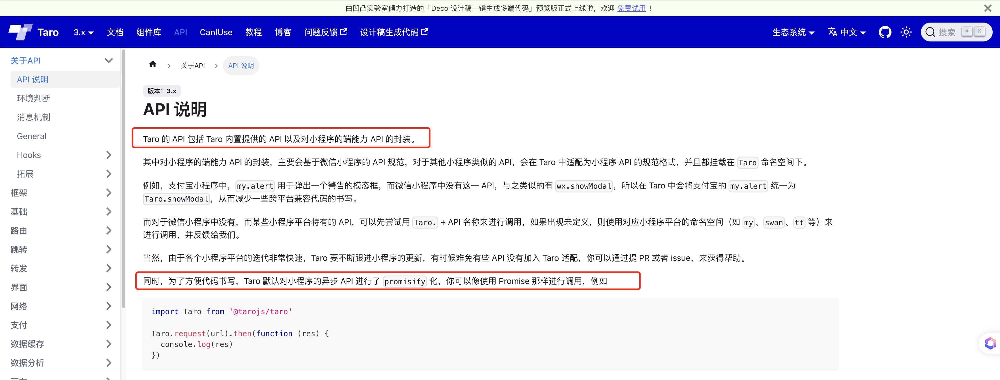

# Taro 4.0 已发布 - 6. 为啥 Taro.xxx 能访问 wx.xxx ?

## 1. 前言

大家好，我是[若川](https://juejin.cn/user/1415826704971918)，欢迎关注我的[公众号：若川视野](https://mp.weixin.qq.com/s/MacNfeTPODNMLLFdzrULow)。我倾力持续组织了 3 年多[每周大家一起学习 200 行左右的源码共读活动](https://juejin.cn/post/7079706017579139102)，感兴趣的可以[点此扫码加我微信 `ruochuan02` 参与](https://juejin.cn/pin/7217386885793595453)。另外，想学源码，极力推荐关注我写的专栏[《学习源码整体架构系列》](https://juejin.cn/column/6960551178908205093)，目前是掘金关注人数（6k+人）第一的专栏，写有几十篇源码文章。

截至目前（`2024-08-18`），[`taro 4.0` 正式版已经发布](https://github.com/NervJS/taro/releases/tag/v4.0.3)，目前最新是 `4.0.5`，官方`4.0`正式版本的介绍文章暂未发布。官方之前发过[Taro 4.0 Beta 发布：支持开发鸿蒙应用、小程序编译模式、Vite 编译等](https://juejin.cn/post/7330792655125463067)。

计划写一个 `taro` 源码揭秘系列，欢迎持续关注。

-   [x] [Taro 源码揭秘 - 1. 揭开整个架构的入口 CLI => taro init 初始化项目的秘密](https://juejin.cn/post/7378363694939783178)
-   [x] [Taro 源码揭秘 - 2. 揭开整个架构的插件系统的秘密](https://juejin.cn/spost/7380195796208205824)
-   [x] [Taro 源码揭秘 - 3. 每次创建新的 taro 项目（taro init）的背后原理是什么](https://juejin.cn/post/7390335741586931738)
-   [x] [Taro 4.0 已正式发布 - 4. 每次 npm run dev:weapp 开发小程序，build 编译打包是如何实现的？](https://juejin.cn/post/7403193330271682612)
-   [x] [Taro 4.0 已发布 - 5.高手都在用的发布订阅机制 Events 在 Taro 中是如何实现的？](https://juejin.cn/post/7403915119448915977)
-   [ ] 等等

前面 4 篇文章都是讲述编译相关的，CLI、插件机制、初始化项目、编译构建流程。第 6 篇我们来讲些相对简单的，Taro 是如何实现 `Taro.xxx` 能访问 `wx.xxx`。

学完本文，你将学到：

```bash
等等
```

## 文档

[Taro 文档 - API 说明](https://docs.taro.zone/docs/apis/about/desc)



```ts
import Taro from '@tarojs/taro'

Taro.request(url).then(function (res) {
  console.log(res)
})
```

我们具体来分析下，`Taro` 源码中是如何实现 `Taro.xxx` 访问 `wx.xxx` 的，并且是如何实现 `promisify` 的。

`promisify` 把回调函数转成 `promise` 避免回调地狱问题。面试也经常考察此题。我之前写过一篇文章：[从22行有趣的源码库中，我学到了 callback promisify 化的 Node.js 源码实现](https://juejin.cn/post/7028731182216904740)

我们日常开发都会引入 `tarojs/taro`，然后调用 `Taro.xxx` 方法。

我们先来看 `tarojs/taro` 的代码。

## tarojs/taro

```ts
// packages/taro/index.js
const { hooks } = require('@tarojs/runtime')
const taro = require('@tarojs/api').default

if (hooks.isExist('initNativeApi')) {
  hooks.call('initNativeApi', taro)
}

module.exports = taro
module.exports.default = module.exports
```

## src/program.ts

```ts
// packages/taro-platform-weapp/src/program.ts
import { TaroPlatformBase } from '@tarojs/service'

// 省略若干代码

const PACKAGE_NAME = '@tarojs/plugin-platform-weapp'

export default class Weapp extends TaroPlatformBase {
  template: Template
  platform = 'weapp'
  globalObject = 'wx'
  projectConfigJson: string = this.config.projectConfigName || 'project.config.json'
  runtimePath = `${PACKAGE_NAME}/dist/runtime`
  //   省略若干代码
}
```

## src/runtime.ts

```ts
// packages/taro-platform-weapp/src/runtime.ts
import { mergeInternalComponents, mergeReconciler } from '@tarojs/shared'

import { components, hostConfig } from './runtime-utils'

mergeReconciler(hostConfig)
mergeInternalComponents(components)
```

## mergeReconciler

```ts
// packages/shared/src/utils.ts
import { hooks } from './runtime-hooks'
export function mergeReconciler (hostConfig, hooksForTest?) {
  const obj = hooksForTest || hooks
  const keys = Object.keys(hostConfig)
  keys.forEach(key => {
    obj.tap(key, hostConfig[key])
  })
}

```

```ts
// packages/shared/src/utils.ts
```

## hostConfig

```ts
// packages/taro-platform-weapp/src/runtime-utils.ts
import { Shortcuts, toCamelCase } from '@tarojs/shared'

import { initNativeApi } from './apis'

declare const getCurrentPages: any

export { initNativeApi }
export * from './apis-list'
export * from './components'
export const hostConfig = {
  initNativeApi,
  getMiniLifecycle (config) {
    const methods = config.page[5]
    if (methods.indexOf('onSaveExitState') === -1) {
      methods.push('onSaveExitState')
    }
    return config
  },
  transferHydrateData (data, element, componentsAlias) {
    if (element.isTransferElement) {
      const pages = getCurrentPages()
      const page = pages[pages.length - 1]
      data[Shortcuts.NodeName] = element.dataName
      page.setData({
        [toCamelCase(data.nn)]: data
      })
      return {
        sid: element.sid,
        [Shortcuts.Text]: '',
        [Shortcuts.NodeName]: componentsAlias['#text']?._num || '8'
      }
    }
  },
}

```

## initNativeApi 初始化原始 api

```ts
// packages/taro-platform-weapp/src/apis.ts
import { processApis } from '@tarojs/shared'

import { needPromiseApis } from './apis-list'

declare const wx: any

export function initNativeApi (taro) {
  processApis(taro, wx, {
    needPromiseApis,
    modifyApis (apis) {
      // fix https://github.com/NervJS/taro/issues/9899
      apis.delete('lanDebug')
    },
    transformMeta (api: string, options: Record<string, any>) {
      if (api === 'showShareMenu') {
        options.menus = options.showShareItems?.map(item => item === 'wechatFriends' ? 'shareAppMessage' : item === 'wechatMoment' ? 'shareTimeline' : item)
      }

      return {
        key: api,
        options
      }
    }
  })
  taro.cloud = wx.cloud
  taro.getTabBar = function (pageCtx) {
    if (typeof pageCtx?.getTabBar === 'function') {
      return pageCtx.getTabBar()?.$taroInstances
    }
  }
  taro.getRenderer = function () {
    return taro.getCurrentInstance()?.page?.renderer ?? 'webview'
  }
}

```

## processApis 处理 apis

```ts
// packages/shared/src/native-apis.ts

// 需要 promisify 的 api 列表（内置的，所有端平台都用得上的）
const needPromiseApis = new Set<string>([
  // 省略了很多 api，这里相对常用的留一些
  'chooseAddress', 'chooseImage', 'chooseLocation', 'downloadFile','getLocation', 'navigateBack', 'navigateTo', 'openDocument', 'openLocation', 'reLaunch', 'redirectTo', 'scanCode', 'showModal', 'showToast', 'switchTab', 'uploadFile',
])

interface IProcessApisIOptions {
  // 不需要 promisify 的 api
  noPromiseApis?: Set<string>
  //   希望 promisify 的 api
  needPromiseApis?: Set<string>
  handleSyncApis?: (key: string, global: IObject, args: any[]) => any
  transformMeta?: (key: string, options: IObject) => { key: string, options: IObject }
  modifyApis?: (apis: Set<string>) => void
  modifyAsyncResult?: (key: string, res) => void
  isOnlyPromisify?: boolean
  [propName: string]: any
}

function processApis (taro, global, config: IProcessApisIOptions = {}) {
	// 省略...
}
```

```ts
// packages/shared/src/native-apis.ts
function processApis (taro, global, config: IProcessApisIOptions = {}) {
  // 端平台插件中定义的一些需要 promisify 的 api
  const patchNeedPromiseApis = config.needPromiseApis || []
  const _needPromiseApis = new Set<string>([...patchNeedPromiseApis, ...needPromiseApis])
  //  保留的 api
  const preserved = [
    'getEnv',
    'interceptors',
    'Current',
    'getCurrentInstance',
    'options',
    'nextTick',
    'eventCenter',
    'Events',
    'preload',
    'webpackJsonp'
  ]

  const apis = new Set(
    !config.isOnlyPromisify
      ? Object.keys(global).filter(api => preserved.indexOf(api) === -1)
      : patchNeedPromiseApis
  )

  if (config.modifyApis) {
    config.modifyApis(apis)
  }

  apis.forEach(key => {
    // 省略，拆开到下方
  })

  !config.isOnlyPromisify && equipCommonApis(taro, global, config)
}

```

### apis.forEach 需要 promisify 的 api 逻辑

```js
// packages/shared/src/native-apis.ts
apis.forEach(key => {
    if (_needPromiseApis.has(key)) {
      const originKey = key
      taro[originKey] = (options: Record<string, any> | string = {}, ...args) => {
        let key = originKey

        // 第一个参数 options 为字符串，单独处理
        if (typeof options === 'string') {
          if (args.length) {
            return global[key](options, ...args)
          }
          return global[key](options)
        }

        // 改变 key 或 option 字段，如需要把支付宝标准的字段对齐微信标准的字段
        if (config.transformMeta) {
          const transformResult = config.transformMeta(key, options)
          key = transformResult.key
          ; (options as Record<string, any>) = transformResult.options
          // 新 key 可能不存在
          if (!global.hasOwnProperty(key)) {
            return nonsupport(key)()
          }
        }

        let task: any = null
        const obj: Record<string, any> = Object.assign({}, options)

        // 为页面跳转相关的 API 设置一个随机数作为路由参数。为了给 runtime 区分页面。
        setUniqueKeyToRoute(key, options)

        // Promise 化
        const p: any = new Promise((resolve, reject) => {
          obj.success = res => {
            config.modifyAsyncResult?.(key, res)
            options.success?.(res)
            if (key === 'connectSocket') {
              resolve(
                Promise.resolve().then(() => task ? Object.assign(task, res) : res)
              )
            } else {
              resolve(res)
            }
          }
          obj.fail = res => {
            options.fail?.(res)
            reject(res)
          }
          obj.complete = res => {
            options.complete?.(res)
          }
          if (args.length) {
            task = global[key](obj, ...args)
          } else {
            task = global[key](obj)
          }
        })

        // 给 promise 对象挂载属性
        if (['uploadFile', 'downloadFile'].includes(key)) {
          equipTaskMethodsIntoPromise(task, p)
          p.progress = cb => {
            task?.onProgressUpdate(cb)
            return p
          }
          p.abort = cb => {
            cb?.()
            task?.abort()
            return p
          }
        }
        return p
      }
    } else {
    	// 拆开，放在下方
    }
  })
```

```ts
// packages/shared/src/utils.ts
export function nonsupport (api) {
  return function () {
    console.warn(`小程序暂不支持 ${api}`)
  }
}
```

### apis.forEach 不需要 promisify 的 api 逻辑

```ts
// packages/shared/src/native-apis.ts
let platformKey = key

// 改变 key 或 option 字段，如需要把支付宝标准的字段对齐微信标准的字段
if (config.transformMeta) {
	platformKey = config.transformMeta(key, {}).key
}

// API 不存在
if (!global.hasOwnProperty(platformKey)) {
	taro[key] = nonsupport(key)
	return
}
if (isFunction(global[key])) {
	taro[key] = (...args) => {
		if (config.handleSyncApis) {
			return config.handleSyncApis(key, global, args)
		} else {
			return global[platformKey].apply(global, args)
		}
	}
} else {
	// 属性类型
	taro[key] = global[platformKey]
}
```

## 总结

## links

- [Taro文档 - 端平台插件](https://docs.taro.zone/docs/platform-plugin/)

----

**如果看完有收获，欢迎点赞、评论、分享、收藏支持。你的支持和肯定，是我写作的动力。也欢迎提建议和交流讨论**。

作者：常以**若川**为名混迹于江湖。所知甚少，唯善学。[若川的博客](https://ruochuan12.github.io)，[github blog](https://github.com/ruochuan12/blog)，可以点个 `star` 鼓励下持续创作。

最后可以持续关注我[@若川](https://juejin.cn/user/1415826704971918)，欢迎关注我的[公众号：若川视野](https://mp.weixin.qq.com/s/MacNfeTPODNMLLFdzrULow)。我倾力持续组织了 3 年多[每周大家一起学习 200 行左右的源码共读活动](https://juejin.cn/post/7079706017579139102)，感兴趣的可以[点此扫码加我微信 `ruochuan02` 参与](https://juejin.cn/pin/7217386885793595453)。另外，想学源码，极力推荐关注我写的专栏[《学习源码整体架构系列》](https://juejin.cn/column/6960551178908205093)，目前是掘金关注人数（6k+人）第一的专栏，写有几十篇源码文章。
