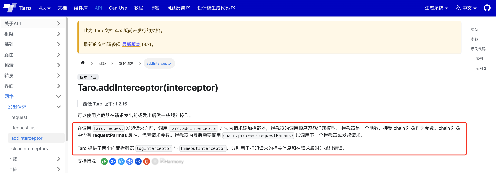
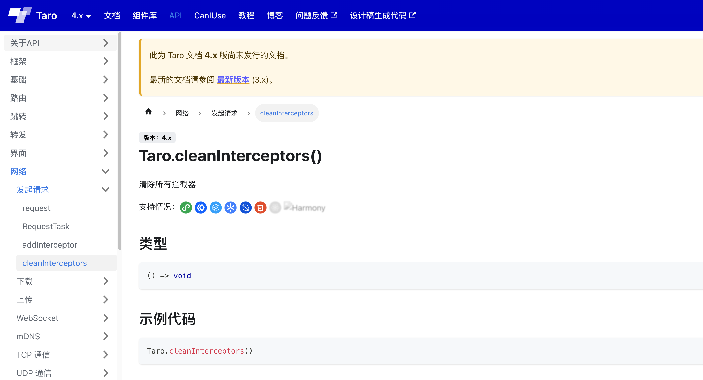
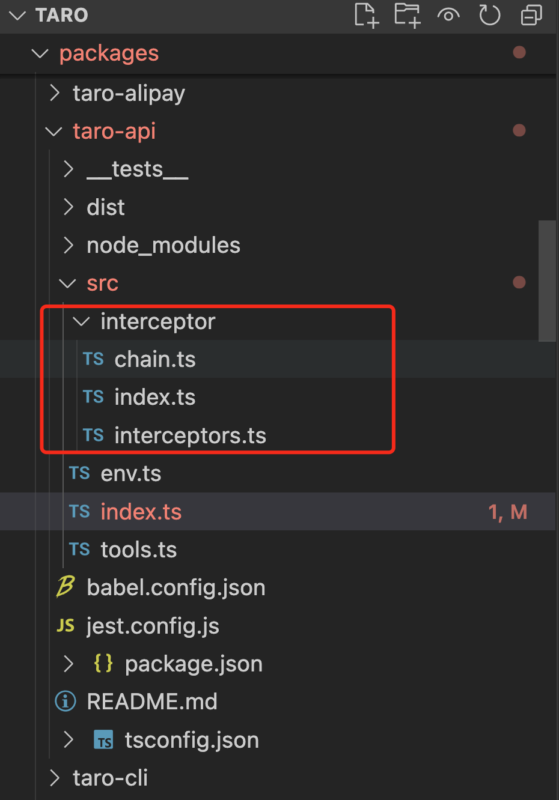
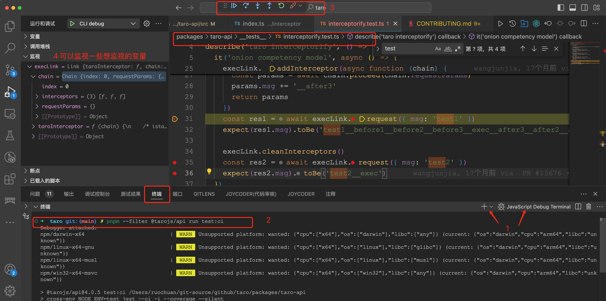

# Taro 源码揭秘：7. Taro.request 和请求响应拦截器是如何实现的

## 1. 前言

大家好，我是[若川](https://juejin.cn/user/1415826704971918)，欢迎关注我的[公众号：若川视野](https://mp.weixin.qq.com/s/MacNfeTPODNMLLFdzrULow)。我倾力持续组织了 3 年多[每周大家一起学习 200 行左右的源码共读活动](https://juejin.cn/post/7079706017579139102)，感兴趣的可以[点此扫码加我微信 `ruochuan02` 参与](https://juejin.cn/pin/7217386885793595453)。另外，想学源码，极力推荐关注我写的专栏[《学习源码整体架构系列》](https://juejin.cn/column/6960551178908205093)，目前是掘金关注人数（6k+人）第一的专栏，写有几十篇源码文章。

截至目前（`2024-09-18`），[`taro 4.0` 正式版已经发布](https://github.com/NervJS/taro/releases/tag/v4.0.3)，目前最新是 `4.0.5`，官方`4.0`正式版本的介绍文章暂未发布。官方之前发过[Taro 4.0 Beta 发布：支持开发鸿蒙应用、小程序编译模式、Vite 编译等](https://juejin.cn/post/7330792655125463067)。

计划写一个 Taro 源码揭秘系列，博客地址：[https://ruochuan12.github.io/taro](https://ruochuan12.github.io/taro) 可以加入书签，持续关注[若川](https://juejin.cn/user/1415826704971918)。

-   [x] [1. 揭开整个架构的入口 CLI => taro init 初始化项目的秘密](https://juejin.cn/post/7378363694939783178)
-   [x] [2. 揭开整个架构的插件系统的秘密](https://juejin.cn/post/7380195796208205824)
-   [x] [3. 每次创建新的 taro 项目（taro init）的背后原理是什么](https://juejin.cn/post/7390335741586931738)
-   [x] [4. 每次 npm run dev:weapp 开发小程序，build 编译打包是如何实现的？](https://juejin.cn/post/7403193330271682612)
-   [x] [5. 高手都在用的发布订阅机制 Events 在 Taro 中是如何实现的？](https://juejin.cn/post/7403915119448915977)
-   [x] [6. 为什么通过 Taro.xxx 能调用各个小程序平台的 API，如何设计实现的?](https://juejin.cn/post/7407648740926291968)
-   [x] [7. Taro.request 和请求响应拦截器是如何实现的](https://juejin.cn/post/7415911762128797696)
-   [x] [8. Taro 是如何使用 webpack 打包构建小程序的？](https://juejin.cn/post/7434175547784020031)
-   [x] [9. Taro 是如何生成 webpack 配置进行构建小程序的？](https://juejin.cn/post/7439743635161710604)
-   [x] [10. Taro 到底是怎样转换成小程序文件的？](https://juejin.cn/post/7452329275561279529)
-   [ ] 等等

前面 4 篇文章都是讲述编译相关的，CLI、插件机制、初始化项目、编译构建流程。第 7 篇我们来讲些相对简单的，Taro.request 和请求响应拦截器是如何实现的？文章以微信小程序为例。

>关于请求响应拦截器，我曾在 2019年 写过 [axios 源码文章](https://juejin.cn/post/6844904019987529735#heading-21)（575赞、761收藏、2.5w阅读），还画了 `axios` 拦截器的图。虽然之前文章写的版本是`v0.19.x` ，但是相比现在的源码整体结构基本没有太大变化，感兴趣的可以看看。

关于克隆项目、环境准备、如何调试代码等，参考[第一篇文章-准备工作、调试](https://juejin.cn/post/7378363694939783178#heading-1)。后续文章基本不再过多赘述。

学完本文，你将学到：

```bash
1. Taro.request 的实现
2. Taro.addInterceptor 请求和响应拦截器的使用和具体实现
等等
```

我们先来看文档，熟悉 `Taro.request` 的使用。

## 2. Taro request 相关文档

平常业务开发

```ts
import Taro from '@tarojs/taro'

Taro.request(url).then(function (res) {
  console.log(res)
})
```

我们来看下 `Taro` 拦截器相关的文档：



`Taro.addInterceptor` 示例代码1

```ts
const interceptor = function (chain) {
  const requestParams = chain.requestParams
  const { method, data, url } = requestParams

  console.log(`http ${method || 'GET'} --> ${url} data: `, data)

  return chain.proceed(requestParams)
    .then(res => {
      console.log(`http <-- ${url} result:`, res)
      return res
    })
  }
Taro.addInterceptor(interceptor)
Taro.request({ url })
```

[`Taro.addInterceptor`文档](https://taro-docs.jd.com/docs/next/apis/network/request/addInterceptor) 示例代码2

```ts
Taro.addInterceptor(Taro.interceptors.logInterceptor)
Taro.addInterceptor(Taro.interceptors.timeoutInterceptor)
Taro.request({ url })
```



`Taro.cleanInterceptors` 清除所有拦截器

```ts
Taro.cleanInterceptors()
```

`@tarojs/taro` 对应的源码。

```ts
// packages/taro/index.js
const { hooks } = require('@tarojs/runtime')
const taro = require('@tarojs/api').default

if (hooks.isExist('initNativeApi')) {
  hooks.call('initNativeApi', taro)
}

module.exports = taro
module.exports.default = module.exports
```

`@tarojs/api` 源码暂时先不讲述。

我们来回顾下上篇文章中 [Taro 源码揭秘 - 6. 为什么通过 Taro.xxx 能调用各个小程序平台的 API，如何设计实现的?](https://juejin.cn/post/7407648740926291968#heading-11)

在端平台插件运行时 `runtime` 中，`mergeReconciler(hostConfig)` `hooks.tap` 注册事件 `initNativeApi`。
`hostConfig` 对象中有 `initNativeApi` 函数
`initNativeApi` 函数中调用了 `processApis` 函数。
`processApis` 中调用了 `equipCommonApis` 这个函数挂载常用的apis。

## 3. equipCommonApis 挂载公共 apis

```ts
// packages/shared/src/native-apis.ts
/**
 * 挂载常用 API
 * @param taro Taro 对象
 * @param global 小程序全局对象，如微信的 wx，支付宝的 my
 */
function equipCommonApis (taro, global, apis: Record<string, any> = {}) {
  // 省略若干代码
  // 添加 request 和拦截器
  // request & interceptors
  const request = apis.request || getNormalRequest(global)
  function taroInterceptor (chain) {
    return request(chain.requestParams)
  }
  const link = new taro.Link(taroInterceptor)
  taro.request = link.request.bind(link)
  taro.addInterceptor = link.addInterceptor.bind(link)
  taro.cleanInterceptors = link.cleanInterceptors.bind(link)
  //   省略若干代码
}
```

你可能会问：

我们接着来看 `getNormalRequest` 是怎么实现的？

`taro.Link` 哪来的，为什么把  `taroInterceptor` 函数传递给它。
`link` 是 `Link` 的实例对象。
`taro.request` 是 `link.request`
`taro.addInterceptor` 是 `link.addInterceptor`
`taro.cleanInterceptors` 是 `link.cleanInterceptors`。

我们接着先来看 `getNormalRequest` 的代码实现，再看 `Link` 的代码实现。寻找问题的答案。

### 3.1 getNormalRequest 获取标准的 request

`getNormalRequest` 返回一个 `request` 函数，`request` 函数返回的是 `promise`。

```ts
// packages/shared/src/native-apis.ts
function getNormalRequest (global) {
  return function request (options) {
	// 第一步：先是处理下 options，有值，如果是字符串传入url，不是就直接返回 options
	// 没有值赋值空对象
    options = options
      ? (
        isString(options)
          ? { url: options }
          : options
      )
      : {}

    const originSuccess = options.success
    const originFail = options.fail
    const originComplete = options.complete

	// 第二步：声明 requestTask 和 promise
    let requestTask
    const p: any = new Promise((resolve, reject) => {
      options.success = res => {
        originSuccess && originSuccess(res)
        resolve(res)
      }
      options.fail = res => {
        originFail && originFail(res)
        reject(res)
      }

      options.complete = res => {
        originComplete && originComplete(res)
      }

	  // 参数传入 global.request ，global 是 wx、my 等
      requestTask = global.request(options)
    })

	// 第三步：将Task对象中的方法挂载到 promise 对象中，适配小程序 api 原生返回结果
    equipTaskMethodsIntoPromise(requestTask, p)

	// 第四步：取消，调用 task 的取消
    p.abort = (cb) => {
      cb && cb()
      if (requestTask) {
        requestTask.abort()
      }
      return p
    }
	// 最后返回 promise，也就是为什么可以调用 Taro.request then、catch 方法
    return p
  }
}
```

`getNormalRequest` 的实现步骤：

- 第一步：先是处理下 options，有值，如果是字符串传入url，不是就直接返回 options
- 第二步：声明 requestTask 和 promise
- 第三步：将 Task 对象中的方法挂载到 promise 对象中，适配小程序 api 原生返回结果
- 第四步：取消，调用 task 的取消
- 最后返回 promise，也就是为什么可以调用 Taro.request then、catch 方法

其中调用了 `equipTaskMethodsIntoPromise` 方法，我们简单看下这个方法的实现：

### 3.2 equipTaskMethodsIntoPromise 适配小程序 api 原生返回结果

`equipTaskMethodsIntoPromise` 方法的实现如下：

```ts
// packages/shared/src/native-apis.ts
/**
 * 将Task对象中的方法挂载到promise对象中，适配小程序api原生返回结果
 * @param task Task对象 {RequestTask | DownloadTask | UploadTask}
 * @param promise Promise
 */
function equipTaskMethodsIntoPromise (task, promise) {
  if (!task || !promise) return
  const taskMethods = ['abort', 'onHeadersReceived', 'offHeadersReceived', 'onProgressUpdate', 'offProgressUpdate', 'onChunkReceived', 'offChunkReceived']
  task && taskMethods.forEach(method => {
    if (method in task) {
      promise[method] = task[method].bind(task)
    }
  })
}
```

[文档 - wx.uploadFile](https://developers.weixin.qq.com/miniprogram/dev/api/network/upload/wx.uploadFile.html) |
[文档 - 返回值 UploadTask](https://developers.weixin.qq.com/miniprogram/dev/api/network/upload/UploadTask.html) |
[文档 - wx.downloadFile](https://developers.weixin.qq.com/miniprogram/dev/api/network/download/wx.downloadFile.html) |
[文档 - 返回值 DownloadTask](https://developers.weixin.qq.com/miniprogram/dev/api/network/download/DownloadTask.html) |

看完了 `getNormalRequest` 的实现，我们接着来看 `Link` 的具体实现，我们可以知道 `new taro.Link` 必定是在 `@tarojs/taro` 实现的。 文章开头没有展开讲述的 `@tarojs/api`。

## 4. @tarojs/api 所有端的公共 API

>暴露给 @tarojs/taro 的所有端的公有 API。`@tarojs/api` 会跨 node/浏览器/小程序/React Native 使用，不得使用/包含平台特有特性。

我们来看下 `@tarojs/api` 目录，如下图所示：



入口文件 `packages/taro-api/src/index.ts`。

再就是拦截器实现的文件夹 `packages/taro-api/src/interceptor/`。

- packages/taro-api/src/interceptor/index.ts 入口
- packages/taro-api/src/interceptor/interceptor/chain.ts 链
- packages/taro-api/src/interceptor/interceptor/interceptors.ts 内置的拦截器

我们先来看 `@tarojs/api` 的入口文件。

```ts
// packages/taro-api/src/index.ts

/* eslint-disable camelcase */
// 省略若干代码
import Link, { interceptorify } from './interceptor'
import * as interceptors from './interceptor/interceptors'

const Taro: Record<string, unknown> = {
  Link,
  interceptors,
  interceptorify,
}

export default Taro
```

从 `interceptor` 导出 `Link、interceptorify`、`interceptor/interceptors` 导出所有内置拦截器，赋值到 `Taro` 上。

## 5. Link 构造函数

### 5.1 拦截器入口文件 src/interceptor/index.ts

```ts
// packages/taro-api/src/interceptor/index.ts
import Chain from './chain'

import type { IRequestParams, TInterceptor } from './chain'

export default class Link {
  taroInterceptor: TInterceptor
  chain: Chain

  constructor (interceptor: TInterceptor) {
	// 传入的拦截器是返回一个 promise 的函数
    this.taroInterceptor = interceptor
	// 初始化 Chain 实例对象
    this.chain = new Chain()
  }

  request (requestParams: IRequestParams) {
    // 省略，拆开下方讲述
  }

  // 添加拦截器
  addInterceptor (interceptor: TInterceptor) {
    this.chain.interceptors.push(interceptor)
  }

  // 清空拦截器
  cleanInterceptors () {
    this.chain = new Chain()
  }
}

// 转换成 Taro 拦截器
export function interceptorify (promiseifyApi) {
  return new Link(function (chain) {
    return promiseifyApi(chain.requestParams)
  })
}

```

我们来看下 `link.request` 的实现：

```ts
export default class Link {
  request (requestParams: IRequestParams) {
    const chain = this.chain
    const taroInterceptor = this.taroInterceptor

    chain.interceptors = chain.interceptors
      .filter(interceptor => interceptor !== taroInterceptor)
      .concat(taroInterceptor)

    return chain.proceed({ ...requestParams })
  }
}
```

`Link` 实例对象的 `request` 方法代码也不多，把传入的拦截器，放到最后。
最后调用链的 `proceed` 方法 `chain.proceed`。

你可能会问，`chain` 是如何实现的呢。

那么我们来看 `chain` 的具体实现：

### 5.2 链 src/interceptor/chain.ts

>Taro文档：在调用 `Taro.request` 发起请求之前，调用 `Taro.addInterceptor` 方法为请求添加拦截器，拦截器的调用顺序遵循洋葱模型。 拦截器是一个函数，接受 `chain` 对象作为参数。`chain` 对象中含有 `requestParmas` 属性，代表请求参数。拦截器内最后需要调用 `chain.proceed(requestParams)` 以调用下一个拦截器或发起请求。

```ts
// packages/taro-api/src/interceptor/chain.ts

import { isFunction } from '@tarojs/shared'

export type TInterceptor = (c: Chain) => Promise<void>

export interface IRequestParams {
  timeout?: number
  method?: string
  url?: string
  data?: unknown
}

export default class Chain {
  index: number
  requestParams: IRequestParams
  interceptors: TInterceptor[]

  constructor (requestParams?: IRequestParams, interceptors?: TInterceptor[], index?: number) {
	// 初始化三个参数，索引值，请求参数和存放拦截器的数组
    this.index = index || 0
    this.requestParams = requestParams || {}
    this.interceptors = interceptors || []
  }

  proceed (requestParams: IRequestParams = {}) {
	// 省略，拆开放到下方单独讲述
  }

  // 内部方法，取下一个拦截器
  _getNextInterceptor () {
    return this.interceptors[this.index]
  }

  // 内部方法，取下一个链
  _getNextChain () {
    return new Chain(this.requestParams, this.interceptors, this.index + 1)
  }
}

```

我们来看 `chain.proceed` 方法的实现：

```ts
export default class Chain {
  proceed (requestParams: IRequestParams = {}) {
	// 第一步：调用这个方法的参数赋值为请求参数
    this.requestParams = requestParams
	// 第二步：拦截器数量不对抛出错误
    if (this.index >= this.interceptors.length) {
      throw new Error('chain 参数错误, 请勿直接修改 request.chain')
    }
	// 第三步：取出下一个拦截器
    const nextInterceptor = this._getNextInterceptor()
	// 第四步：取出下一个链
    const nextChain = this._getNextChain()
	// 第六步：把下一个链作为参数传入到下一个拦截器调用，返回 promise
    const p = nextInterceptor(nextChain)
	// 第六步：捕获错误
    const res = p.catch(err => Promise.reject(err))
	// 第七步：遍历实例对象 promise，如果是函数就赋值到 res[k] = p[k];
	// 这里其实是兼容小程序 api 原生返回结果 promise 对象上还有 abort 等函数方法。
    Object.keys(p).forEach(k => isFunction(p[k]) && (res[k] = p[k]))
	// 第八步：返回 res promise
    return res
  }
}
```

`chain.proceed` 简单来说就是调用下一个拦截器函数（async）。

## 6. 借助项目提供的 jest 测试用例调试拦截器

`chain.proceed` 函数比较抽象，第一次看没有看懂很正常。

我们可以借助项目中提供的测试用例进行调试。

我们很容易就找到了拦截器的测试用例文件：`packages/taro-api/__tests__/interceptorify.test.ts`。我们来看测试用例的具体代码：

```ts
// packages/taro-api/__tests__/interceptorify.test.ts
import Taro from '@tarojs/taro'

describe('taro interceptorify', () => {
  it('onion competency model', async () => {
    interface IParams {
      msg: string
    }
	// 转为拦截器，相当于是 wx.request
    const execLink = Taro.interceptorify<IParams, IParams>(async function (requestParams) {
      requestParams.msg += '__exec'
      return requestParams
    })
	// 添加拦截器1
    execLink.addInterceptor(async function (chain) {
      chain.requestParams.msg += '__before1'
      const params = await chain.proceed(chain.requestParams)
      params.msg += '__after1'
      return params
    })
	// 添加拦截器2
    execLink.addInterceptor(async function (chain) {
      chain.requestParams.msg += '__before2'
      const params = await chain.proceed(chain.requestParams)
      params.msg += '__after2'
      return params
    })
	// 添加拦截器3
    execLink.addInterceptor(async function (chain) {
      chain.requestParams.msg += '__before3'
      const params = await chain.proceed(chain.requestParams)
      params.msg += '__after3'
      return params
    })
	// 执行 request 把拦截器串联起来
    const res1 = await execLink.request({ msg: 'test1' })
    expect(res1.msg).toBe('test1__before1__before2__before3__exec__after3__after2__after1')

	// 清空拦截器
    execLink.cleanInterceptors()
	// 再执行结果
    const res2 = await execLink.request({ msg: 'test2' })
    expect(res2.msg).toBe('test2__exec')
  })
})

```

虽然看起来代码比较多，但我们可以看到这部分代码做的事情相对简单：

- `Taro.interceptorify` 类似于是封装 `wx.request`，`my.request`

```ts
// 前文提到的
// packages/shared/src/native-apis.ts
const request = apis.request || getNormalRequest(global)
function taroInterceptor (chain) {
	return request(chain.requestParams)
}
const link = new taro.Link(taroInterceptor)
```

- `execLink.addInterceptor` 添加拦截器 1、2、3。
- 执行 `await execLink.request()` 把拦截器从第 0 个开始串联起来。
- 输出结果，符合期望。
- `execLink.cleanInterceptors()` 清空拦截器。
- 再执行 `await execLink.request()`。
- 输出结果，符合期望。
- 测试用例通过。

`msg` 结果是这样：`test1__before1__before2__before3__exec__after3__after2__after1`，就能很好的反应出拦截器（async 函数）的执行顺序。熟悉的小伙伴会知道这是典型的洋葱模型。Taro 文档也有说明：拦截器的调用顺序遵循洋葱模型。

如果了解 `koa-compose`，就会发现 `chain.proceed` 其实就是 `koa-compose` 中的 `next` 方法。只不过实现方式不一样而已。
我曾经写过 [50行代码串行Promise，koa洋葱模型原来是这么实现？](https://juejin.cn/post/7005375860509245471)，可以对比学习。

关于如何调试，[贡献文档-单元测试](https://github.com/NervJS/taro/blob/main/CONTRIBUTING.md#4-%E5%8D%95%E5%85%83%E6%B5%8B%E8%AF%95)中有提到：

>`package.json` 中设置了 `test:ci` 命令的子包都配备了单元测试。
>开发者在修改这些包后，请运行 `pnpm --filter [package-name] run test:ci`，检查测试用例是否都能通过。

我们提前在 `packages/taro-api/__tests__/interceptorify.test.ts` 文件中根据自己情况打好断点，再新建一个终端`JavaScript debug Termial`，执行 `pnpm --filter @tarojs/api run test:ci` 即可触发断点。调试如下图所示：



`Taro` 源码项目准备安装依赖在[第一篇文章](https://juejin.cn/post/7378363694939783178#heading-1)中有详细说明，这里就不再赘述。

如果不太会调试，可参考我的文章[新手向：前端程序员必学基本技能——调试 JS 代码](https://juejin.cn/post/7030584939020042254)，或者[据说 90%的人不知道可以用测试用例(Vitest)调试开源项目(Vue3) 源码](https://juejin.cn/post/7212263304394981432)

我们调试完后，再去看 `Taro` 文档和拦截器相关代码就会豁然开朗，会有更深刻的理解。

这时不得不感慨一句：**设计的很惊艳！**

我们接着来看内置的拦截器，就比较简单一些了，Taro 文档中有说明。

## 7. 内置的两个拦截器

>`Taro` 提供了两个内置拦截器 `logInterceptor` 与 `timeoutInterceptor`，分别用于打印请求的相关信息和在请求超时时抛出错误。

[`Taro.addInterceptor`文档](https://taro-docs.jd.com/docs/next/apis/network/request/addInterceptor) 示例代码2

```ts
Taro.addInterceptor(Taro.interceptors.logInterceptor)
Taro.addInterceptor(Taro.interceptors.timeoutInterceptor)
Taro.request({ url })
```

`import * as interceptors from './interceptor/interceptors'`

`@tarojs/api` 入口文件也有导出内置的拦截器挂载到 `Taro` 上。

我们接着来学习它们的具体实现。

### 7.1 timeoutInterceptor 超时拦截器

```ts
// packages/taro-api/src/interceptor/interceptors.ts
import { isFunction, isUndefined } from '@tarojs/shared'

import type Chain from './chain'

export function timeoutInterceptor (chain: Chain) {
  const requestParams = chain.requestParams
  let p: Promise<void>
  const res = new Promise<void>((resolve, reject) => {
    const timeout: ReturnType<typeof setTimeout> = setTimeout(() => {
      clearTimeout(timeout)
      reject(new Error('网络链接超时,请稍后再试！'))
    }, (requestParams && requestParams.timeout) || 60000)

    p = chain.proceed(requestParams)
    p
      .then(res => {
        if (!timeout) return
        clearTimeout(timeout)
        resolve(res)
      })
      .catch(err => {
        timeout && clearTimeout(timeout)
        reject(err)
      })
  })
  // @ts-ignore
  // 这里是兼容 小程序 原生 api 返回结果，不过感觉是不是少兼容了
  if (!isUndefined(p) && isFunction(p.abort)) res.abort = p.abort

  return res
}
```

简言之：超时拦截器。

### 7.2 logInterceptor 日志拦截器

```ts
// packages/taro-api/src/interceptor/interceptors.ts
export function logInterceptor (chain: Chain) {
  const requestParams = chain.requestParams
  const { method, data, url } = requestParams

  // eslint-disable-next-line no-console
  console.log(`http ${method || 'GET'} --> ${url} data: `, data)

  const p = chain.proceed(requestParams)
  const res = p
    .then(res => {
      // eslint-disable-next-line no-console
      console.log(`http <-- ${url} result:`, res)
      return res
    })
  // @ts-ignore
  // 这里是兼容 小程序 原生 api 返回结果，不过感觉是不是少兼容了
  if (isFunction(p.abort)) res.abort = p.abort

  return res
}

```

简言之：就是输出下日志。

## 8. 总结

我们从文档出发 `Taro.request` 的使用和文档中拦截器的使用，分析了 `Taro.request` 的具体实现和 `Taro` 的 `request` 请求和响应拦截器实现。
端平台插件运行时（runtime）挂载 `global.request`。
`@tarojs/taro`、`@tarojs/api` 中实现的 `Chain` 链和 `Link` `request` 构造函数。

最后，我们再回顾下：

>Taro文档：在调用 `Taro.request` 发起请求之前，调用 `Taro.addInterceptor` 方法为请求添加拦截器，拦截器的调用顺序遵循洋葱模型。 拦截器是一个函数，接受 `chain` 对象作为参数。`chain` 对象中含有 `requestParmas` 属性，代表请求参数。拦截器内最后需要调用 `chain.proceed(requestParams)` 以调用下一个拦截器或发起请求。

拦截器的调用顺序遵循洋葱模型，测试用例中输出顺序：`test1__before1__before2__before3__exec__after3__after2__after1`。

`test1` 是 `Taro.request` 传入的参数，`__exec` 是最开始的参数。`before、after` 数字对应的是拦截器（async 函数 `fn1, fn2, fn3`）。

总之 `Taro` 拦截器**设计的很惊艳**，是设计模式中的职责链模式实现。和 [koa-compose-文章](https://juejin.cn/post/7005375860509245471)、[axios-文章](https://juejin.cn/post/6844904019987529735#heading-21) 是实现的类似功能、只是实现方式不一样。

----

**如果看完有收获，欢迎点赞、评论、分享、收藏支持。你的支持和肯定，是我写作的动力。也欢迎提建议和交流讨论**。

作者：常以**若川**为名混迹于江湖。所知甚少，唯善学。[若川的博客](https://ruochuan12.github.io)，[github blog](https://github.com/ruochuan12/blog)，可以点个 `star` 鼓励下持续创作。

最后可以持续关注我[@若川](https://juejin.cn/user/1415826704971918)，欢迎关注我的[公众号：若川视野](https://mp.weixin.qq.com/s/MacNfeTPODNMLLFdzrULow)。我倾力持续组织了 3 年多[每周大家一起学习 200 行左右的源码共读活动](https://juejin.cn/post/7079706017579139102)，感兴趣的可以[点此扫码加我微信 `ruochuan02` 参与](https://juejin.cn/pin/7217386885793595453)。另外，想学源码，极力推荐关注我写的专栏[《学习源码整体架构系列》](https://juejin.cn/column/6960551178908205093)，目前是掘金关注人数（6k+人）第一的专栏，写有几十篇源码文章。
