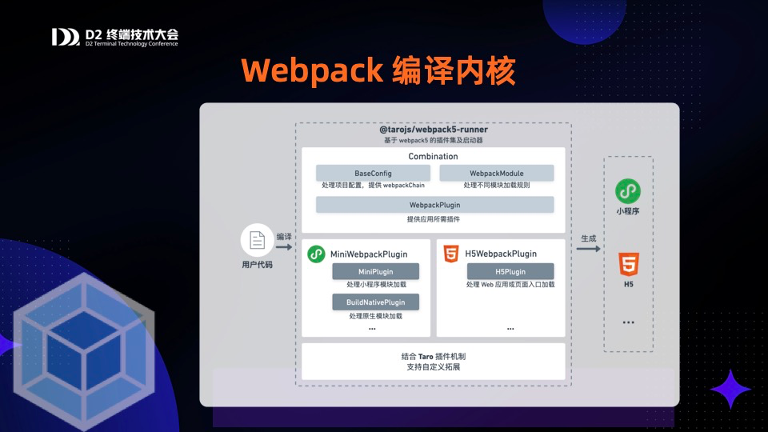

# Taro 源码揭秘：9. Taro 是如何使用 webpack 打包构建小程序的？

## 1. 前言

大家好，我是[若川](https://ruochuan12.github.io)，欢迎关注我的[公众号：若川视野](https://mp.weixin.qq.com/s/MacNfeTPODNMLLFdzrULow)。我倾力持续组织了 3 年多[每周大家一起学习 200 行左右的源码共读活动](https://juejin.cn/post/7079706017579139102)，感兴趣的可以[点此扫码加我微信 `ruochuan02` 参与](https://juejin.cn/pin/7217386885793595453)。另外，想学源码，极力推荐关注我写的专栏[《学习源码整体架构系列》](https://juejin.cn/column/6960551178908205093)，目前是掘金关注人数（6k+人）第一的专栏，写有几十篇源码文章。

截至目前（`2024-11-07`），目前最新是 [`4.0.7`](https://github.com/NervJS/taro/releases/tag/v4.0.7)，官方`4.0`正式版本的介绍文章暂未发布。官方之前发过[Taro 4.0 Beta 发布：支持开发鸿蒙应用、小程序编译模式、Vite 编译等](https://juejin.cn/post/7330792655125463067)。

计划写一个 Taro 源码揭秘系列，博客地址：[https://ruochuan12.github.io/taro](https://ruochuan12.github.io/taro) 可以加入书签，持续关注[若川](https://juejin.cn/user/1415826704971918)。

-   [x] [1. 揭开整个架构的入口 CLI => taro init 初始化项目的秘密](https://juejin.cn/post/7378363694939783178)
-   [x] [2. 揭开整个架构的插件系统的秘密](https://juejin.cn/post/7380195796208205824)
-   [x] [3. 每次创建新的 taro 项目（taro init）的背后原理是什么](https://juejin.cn/post/7390335741586931738)
-   [x] [4. 每次 npm run dev:weapp 开发小程序，build 编译打包是如何实现的？](https://juejin.cn/post/7403193330271682612)
-   [x] [5. 高手都在用的发布订阅机制 Events 在 Taro 中是如何实现的？](https://juejin.cn/post/7403915119448915977)
-   [x] [6. 为什么通过 Taro.xxx 能调用各个小程序平台的 API，如何设计实现的?](https://juejin.cn/post/7407648740926291968)
-   [x] [7. Taro.request 和请求响应拦截器是如何实现的](https://juejin.cn/post/7415911762128797696)
-   [x] [8. Taro 是如何使用 webpack 打包构建小程序的？](https://juejin.cn/post/7434175547784020031)
-   [ ] 等等

前面 4 篇文章都是讲述编译相关的，CLI、插件机制、初始化项目、编译构建流程。
第 5-7 篇讲述的是运行时相关的 Events、API、request 等。
第 8 篇接着继续追随第4篇 npm run dev:weapp 的脚步，继续分析 `@tarojs/webpack5-runner`，Taro 是如何使用 webpack 打包构建小程序的？

关于克隆项目、环境准备、如何调试代码等，参考[第一篇文章-准备工作、调试](https://juejin.cn/post/7378363694939783178#heading-1)。后续文章基本不再过多赘述。

学完本文，你将学到：

```bash
1.
等等
```

## 2. webpack 打包构建

在[第4篇文章](https://juejin.cn/post/7403193330271682612)末尾，我们可以回顾下，如何获取 `webpack` 配置和执行 `webpack()` 构建的。还有[第8篇文章](https://juejin.cn/post/7434175547784020031) 把所有 `webpack` 配置输出出来，并解析了一些重要配置。

## @tarojs/webpack5-runner

暴露给 `@tarojs/cli` 的小程序/H5 Webpack 启动器。

关于打包编译官方有一篇博客[多编译内核生态下的极速研发体验](https://taro-docs.jd.com/blog/2023/03/29/D2_17)，主要讲述思想和流程。

`Taro RFC` [支持使用 Webpack5 编译小程序和 H5 应用](https://github.com/NervJS/taro/discussions/11533)，讲述了 webpack4 重构为 webpack5 主要的一些修改和优化等。

我们这篇文章主要分析 `@tarojs/webpack5-runner` 小程序部分的具体源码实现。

这个 `npm` 包，主要要解决的问题是：把 `taro` 项目用 `webpack` 编译到小程序、h5、鸿蒙。会涉及到比较多代码是类似或者可以共用的。

`package.json` 入口文件 `"main": "index.js"` 入口文件 `index.js`

```js
if (process.env.TARO_PLATFORM === 'web') {
  module.exports = require('./dist/index.h5.js').default
} else if (process.env.TARO_PLATFORM === 'harmony' || process.env.TARO_ENV === 'harmony') {
  module.exports = require('./dist/index.harmony.js').default
} else {
  module.exports = require('./dist/index.mini.js').default
}

module.exports.default = module.exports
```



我们来看 `webpack` 文件夹 `packages/taro-webpack5-runner/src/webpack` 主要文件如下：

基础类 | 小程序 | H5 | 鸿蒙
---|---|---|---
Combination | MiniCombination | H5Combination | HarmonyCombination
BaseConfig | MiniBaseConfig | H5BaseConfig | HarmonyBaseConfig
WebpackPlugin | MiniWebpackPlugin | H5WebpackPlugin| HarmonyWebpackPlugin
WebpackModule | MiniWebpackModule | H5WebpackModule |HarmonyWebpackModule

```ts
// packages/taro-webpack5-runner/src/index.mini.ts

import webpack from 'webpack'
//   省略若干代码
export default async function build (appPath: string, rawConfig: IMiniBuildConfig): Promise<Stats | void> {
  const combination = new MiniCombination(appPath, rawConfig)
  await combination.make()
  //   省略若干代码

  const webpackConfig = combination.chain.toConfig()
  const config = combination.config

  return new Promise<Stats | void>((resolve, reject) => {
    if (config.withoutBuild) return
    const compiler = webpack(webpackConfig)
	// 省略若干代码...
  })
}
```

```js
// 重点就以下这几句
// 生成获取 webpack 配置，执行 webpack(webpackConfig)
const combination = new MiniCombination(appPath, rawConfig)
await combination.make()
const webpackConfig = combination.chain.toConfig()
const compiler = webpack(webpackConfig)
```

调用构造函数 `new MiniCombination(appPath, rawConfig)` 生成 `combination` 对象。

## Combination 组合

```ts
export class MiniCombination extends Combination<IMiniBuildConfig> {
	process (config: Partial<IMiniBuildConfig>) {
		// 省略代码
	}
}
```

```ts
export class Combination<T extends IMiniBuildConfig | IH5BuildConfig | IHarmonyBuildConfig = CommonBuildConfig> {
  appPath: string
  config: T
  chain: Chain
  //   省略若干代码...

  constructor (appPath: string, config: T) {
    this.appPath = appPath
    this.rawConfig = config
    //   省略若干代码...
  }

  async make () {
    await this.pre(this.rawConfig)
    this.process(this.config)
    await this.post(this.config, this.chain)
  }

  process (_config: Partial<T>) {}

  async pre (rawConfig: T) {
    // 拆分放到下方
  }

  async post (config: T, chain: Chain) {
    // 拆分放到下方
  }
}
```

### pre 前置处理

```ts
async pre (rawConfig: T) {
    const preMode = rawConfig.mode || process.env.NODE_ENV
    const mode = ['production', 'development', 'none'].find(e => e === preMode) ||
      (!rawConfig.isWatch || process.env.NODE_ENV === 'production' ? 'production' : 'development')
    /** process config.sass options */
    const sassLoaderOption = await getSassLoaderOption(rawConfig)
    this.config = {
      ...rawConfig,
      sassLoaderOption,
      mode,
      frameworkExts: rawConfig.frameworkExts || SCRIPT_EXT
    }
  }
```

### post 后置处理

```ts
async post (config: T, chain: Chain) {
    const { modifyWebpackChain, webpackChain, onWebpackChainReady } = config
    const data: IModifyChainData = {
      componentConfig
    }
    if (isFunction(modifyWebpackChain)) {
      await modifyWebpackChain(chain, webpack, data)
    }
    if (isFunction(webpackChain)) {
      webpackChain(chain, webpack, META_TYPE)
    }
    if (isFunction(onWebpackChainReady)) {
      onWebpackChainReady(chain)
    }
  }
```

调用配置中的钩子函数 `modifyWebpackChain`、`webpackChain`、`onWebpackChainReady`。

## MiniCombination 小程序 组合

```ts
export class MiniCombination extends Combination<IMiniBuildConfig> {
  buildNativePlugin: BuildNativePlugin
  fileType: IFileType
  isBuildPlugin = false
  optimizeMainPackage: { enable?: boolean | undefined, exclude?: any[] | undefined } = {
    enable: true
  }

  process (config: Partial<IMiniBuildConfig>) {
    const baseConfig = new MiniBaseConfig(this.appPath, config)
    const chain = this.chain = baseConfig.chain

    // 省略若干代码...拆分到下方在讲述

    chain.merge({
      entry: webpackEntry,
      output: webpackOutput,
      mode,
      devtool: this.getDevtool(sourceMapType),
      resolve: {
        alias: this.getAlias()
      },
      plugin,
      module,
      optimization: this.getOptimization()
    })
  }
}
```

这里是 chain 是 [webpack-chain](https://github.com/neutrinojs/webpack-chain) 链式调用的实例对象。虽然到目前这个 npm包 已经不维护了，但是下载量极大。
>webpack-chain 使用链式 API 生成并简化 webpack 4 配置的修改。

最后 `chain.merge` 入口、出口、插件、模块等，整个过程就结束了，完美撒花~当然，我们肯定不会只限于此。

我们先来看看 `MiniBaseConfig` 的具体实现。

```ts
export class MiniBaseConfig extends BaseConfig {
  defaultTerserOptions = {
	// 省略
  }

  constructor(appPath: string, config: Partial<IMiniBuildConfig>) {
    super(appPath, config)
  }
}
```

可以看出继承自 `BaseConfig` 基本配置类。

我们来看看 `BaseConfig` 类的具体实现。

## BaseConfig 基本配置类

```ts
import Chain from 'webpack-chain'
export class BaseConfig {
  private _chain: Chain

  constructor (appPath: string, config: Config) {
    const chain = this._chain = new Chain()
    chain.merge({
      target: ['web', 'es5'],
      resolve: {
        extensions: ['.js', '.jsx', '.ts', '.tsx', '.mjs', '.vue'],
        symlinks: true,
        plugin: {
          MultiPlatformPlugin: {
            plugin: MultiPlatformPlugin,
            args: ['described-resolve', 'resolve', { chain }]
          }
        }
      },
	  // 省略若干代码...
    })

    // 持久化缓存
	// 省略若干代码...
  }

  // minimizer 配置
  protected setMinimizer (config: Config, defaultTerserOptions) {
	// 省略若干代码...
	this.chain.merge({
      optimization: {
        minimize,
        minimizer
      }
    })
  }

  get chain () {
    return this._chain
  }
}
```

## MiniBaseConfig 小程序基本配置类

```ts
export class MiniBaseConfig extends BaseConfig {
  defaultTerserOptions = {
    parse: {
      ecma: 8,
    },
    compress: {
      ecma: 5,
      warnings: false,
	  //   省略代码...
    },
    output: {
      ecma: 5,
      comments: false,
      ascii_only: true,
    },
  }

  constructor(appPath: string, config: Partial<IMiniBuildConfig>) {
    super(appPath, config)
    const mainFields = [...defaultMainFields]
    const resolveOptions = {
      basedir: appPath,
      mainFields,
    }
    this.chain.merge({
      resolve: {
        mainFields,
        alias: {
          // 小程序使用 regenerator-runtime@0.11
          'regenerator-runtime': require.resolve('regenerator-runtime'),
          // 开发组件库时 link 到本地调试，runtime 包需要指向本地 node_modules 顶层的 runtime，保证闭包值 Current 一致，shared 也一样
          '@tarojs/runtime': resolveSync('@tarojs/runtime', resolveOptions),
          '@tarojs/shared': resolveSync('@tarojs/shared', resolveOptions),
        },
        // [Webpack 4] config.node: { fs: false, path: false }
        // [Webpack 5] config.resolve.fallback
        fallback: {
          fs: false,
          path: false,
        },
      },
	  // 省略若干代码...
    })

    this.setMinimizer(config, this.defaultTerserOptions)
  }
}

```

## 再探 MiniCombination 实例对象的 process 函数

```ts
process (config: Partial<IMiniBuildConfig>) {
    const {
      entry = {},
      output = {},
      mode = 'production',
      globalObject = 'wx',
      sourceMapType = 'cheap-module-source-map',
      fileType = {
        style: '.wxss',
        config: '.json',
        script: '.js',
        templ: '.wxml'
      },
      /** special mode */
      isBuildPlugin = false,
      /** hooks */
      modifyComponentConfig,
      optimizeMainPackage
    } = config

    this.fileType = fileType

    modifyComponentConfig?.(componentConfig, config)

    if (isBuildPlugin) {
      // 编译目标 - 小程序原生插件
      this.isBuildPlugin = true
      this.buildNativePlugin = BuildNativePlugin.getPlugin(this)
      chain.merge({
        context: path.join(process.cwd(), this.sourceRoot, 'plugin')
      })
    }

    if (optimizeMainPackage) {
      this.optimizeMainPackage = optimizeMainPackage
    }

    const webpackEntry = this.getEntry(entry)
    const webpackOutput = this.getOutput({
      publicPath: '/',
      globalObject,
      isBuildPlugin,
      output
    })
    const webpackPlugin = new MiniWebpackPlugin(this)
    const webpackModule = new MiniWebpackModule(this)

    const module = webpackModule.getModules()
    const [, pxtransformOption] = webpackModule.__postcssOption.find(([name]) => name === 'postcss-pxtransform') || []
    webpackPlugin.pxtransformOption = pxtransformOption as any
    const plugin = webpackPlugin.getPlugins()
}
```

我们来看下

## MiniWebpackPlugin 提供小程序应用所需插件

```ts
export class MiniWebpackPlugin {
  combination: MiniCombination
  pxtransformOption: IPostcssOption<'mini'>['pxtransform']

  constructor (combination: MiniCombination) {
    this.combination = combination
  }

  getPlugins () {
    const plugins: Record<string, { plugin: any, args: PluginArgs }> = {
      providerPlugin: this.getProviderPlugin(),
      definePlugin: this.getDefinePlugin(),
      miniCssExtractPlugin: this.getMiniCssExtractPlugin()
    }

    // 省略若干代码...

    return plugins
  }
}

```

## MiniWebpackModule 处理小程序模块加载规则

```ts
export class MiniWebpackModule {
  combination: MiniCombination
  __postcssOption: [string, any, Func?][]

  constructor (combination: MiniCombination) {
    this.combination = combination
  }

  getModules () {
    const { appPath, config, sourceRoot, fileType } = this.combination

    const rule: Record<string, IRule> = {
      //   省略若干代码...

      media: this.getMediaRule(),

      font: this.getFontRule(),

      image: this.getImageRule()
    }
    return { rule }
  }
}
```

## WebpackPlugin 提供应用所需插件

```ts
export default class WebpackPlugin {
  static getPlugin (plugin, args: PluginArgs) {
    return {
      plugin,
      args
    }
  }

  static getCopyWebpackPlugin (appPath: string, copy: ICopyOptions) {
    /** @doc https://webpack.js.org/plugins/copy-webpack-plugin */
    const CopyWebpackPlugin = require('copy-webpack-plugin')
    // 省略代码...
    return WebpackPlugin.getPlugin(CopyWebpackPlugin, [args])
  }

  // 省略若干代码...
}

```

## WebpackModule 处理不同模块加载规则

```ts
export class WebpackModule {
  static getLoader (loaderName: string, options: Record<string, any> = {}) {
    return {
      loader: require.resolve(loaderName),
      options
    }
  }
  static getCSSLoader (cssLoaderOption) {
    const defaultOptions = {
      importLoaders: 1,
      modules: false
    }
    const options = Object.assign(defaultOptions, cssLoaderOption)
    return WebpackModule.getLoader('css-loader', options)
  }
  // 省略若干代码...
}
```

## 总结

```ts
import webpack from 'webpack-chain';
class BaseConfig {
	constructor(){
		this.chain = new Chain();
		// 多端都用的上的基础配置
		this.chain.merge({});
	}
}

class MiniBaseConfig extends BaseConfig{
	constructor(){
		// 小程序端用的上的基础配置
		this.chain.merge({});
	}
}

class Combination {
	constructor (appPath: string, config: T) {
		this.appPath = appPath
		this.rawConfig = config
		//   省略若干代码...
	}

	async make () {
		await this.pre(this.rawConfig)
		this.process(this.config)
		await this.post(this.config, this.chain)
	}

	process (_config: Partial<T>) {}

	async pre (rawConfig: T) {
	}

	async post (config: T, chain: Chain) {
	}
};

class MiniCombination extends Combination{
	process(){
		const config = new MiniBaseConfig();
		this.chain.merge({});
	}
}

// build
const combination = new MiniCombination(appPath, rawConfig)
await combination.make()
const webpackConfig = combination.chain.toConfig()
const compiler = webpack(webpackConfig)
```
