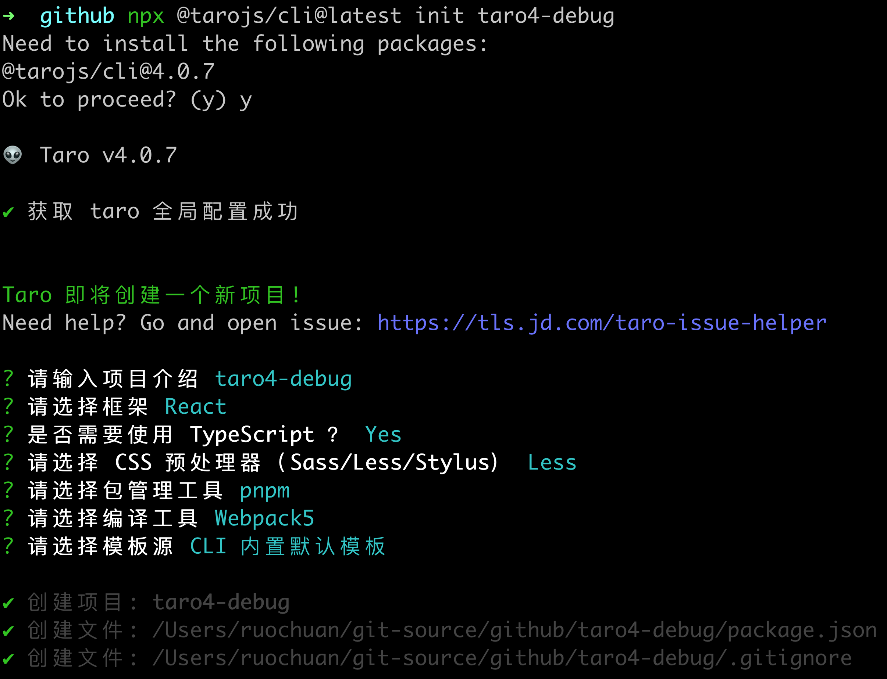

# Taro 源码系列 - 8. webpack5

## 1. 前言

大家好，我是[若川](https://ruochuan12.github.io)，欢迎关注我的[公众号：若川视野](https://mp.weixin.qq.com/s/MacNfeTPODNMLLFdzrULow)。我倾力持续组织了 3 年多[每周大家一起学习 200 行左右的源码共读活动](https://juejin.cn/post/7079706017579139102)，感兴趣的可以[点此扫码加我微信 `ruochuan02` 参与](https://juejin.cn/pin/7217386885793595453)。另外，想学源码，极力推荐关注我写的专栏[《学习源码整体架构系列》](https://juejin.cn/column/6960551178908205093)，目前是掘金关注人数（6k+人）第一的专栏，写有几十篇源码文章。

截至目前（`2024-09-18`），[`taro 4.0` 正式版已经发布](https://github.com/NervJS/taro/releases/tag/v4.0.3)，目前最新是 `4.0.5`，官方`4.0`正式版本的介绍文章暂未发布。官方之前发过[Taro 4.0 Beta 发布：支持开发鸿蒙应用、小程序编译模式、Vite 编译等](https://juejin.cn/post/7330792655125463067)。

计划写一个 `taro` 源码揭秘系列，欢迎持续关注。

-   [x] [1. 揭开整个架构的入口 CLI => taro init 初始化项目的秘密](https://juejin.cn/post/7378363694939783178)
-   [x] [2. 揭开整个架构的插件系统的秘密](https://juejin.cn/post/7380195796208205824)
-   [x] [3. 每次创建新的 taro 项目（taro init）的背后原理是什么](https://juejin.cn/post/7390335741586931738)
-   [x] [4. 每次 npm run dev:weapp 开发小程序，build 编译打包是如何实现的？](https://juejin.cn/post/7403193330271682612)
-   [x] [5. 高手都在用的发布订阅机制 Events 在 Taro 中是如何实现的？](https://juejin.cn/post/7403915119448915977)
-   [x] [6. 为什么通过 Taro.xxx 能调用各个小程序平台的 API，如何设计实现的?](https://juejin.cn/post/7407648740926291968)
-   [ ] [7. Taro.request 和请求响应拦截器是如何实现的](https://juejin.cn/post/7415911762128797696)
-   [ ] 等等

前面 4 篇文章都是讲述编译相关的，CLI、插件机制、初始化项目、编译构建流程。
第 5-7 篇讲述的是运行时相关的 Events、API、request 等。
第 8 篇接着继续追随第4篇 npm run dev:weapp 的脚步，继续研究 `@tarojs/webpack5-runner`。

关于克隆项目、环境准备、如何调试代码等，参考[第一篇文章-准备工作、调试](https://juejin.cn/post/7378363694939783178#heading-1)。后续文章基本不再过多赘述。

学完本文，你将学到：

```bash
1.
2.
等等
```

## 2. 输出打包编译 taro 的 webpack 配置

```bash
npx @tarojs/cli@latest init taro4-debug
```

我们选择 `react、ts、pnpm、webpack5` 等配置生成的项目，如下图所示：



```bash
cd taro4-debug
# 把 taro 编译微信小程序的 webpack 配置输出到了 webpack.config.js 文件
npx taro inspect -t weapp -o webpack.config.js
```

执行上面脚本后，我们就把 taro 编译微信小程序的 webpack 配置输出到了 webpack.config.js 文件。我们在开头追加 `export default` 方便查看整个文件。如下图所示：


[webpack 中文文档](https://webpack.docschina.org/configuration/plugins/#plugins)

[webpack 英文文档](https://webpack.js.org/configuration/plugins/#plugins)

### webpack 配置

```ts
export default {
  target: [
    'web',
    'es5'
  ],
  watchOptions: {
    aggregateTimeout: 200
  },
  mode: 'production',
  devtool: false,
  output: {
    chunkLoadingGlobal: 'webpackJsonp',
    path: '/Users/ruochuan/git-source/github/taro4-debug/dist',
    publicPath: '/',
    filename: '[name].js',
    chunkFilename: '[name].js',
    globalObject: 'wx',
    enabledLibraryTypes: [],
    devtoolModuleFilenameTemplate: function () { /* omitted long function */ }
  },
  // 省略...，拆分在下方
}
```

### webpack.resolve

```ts
export default {
  resolve: {
    symlinks: true,
    fallback: {
      fs: false,
      path: false
    },
    alias: {
      'regenerator-runtime': '/Users/ruochuan/git-source/github/taro4-debug/node_modules/.pnpm/regenerator-runtime@0.11.1/node_modules/regenerator-runtime/runtime-module.js',
      '@tarojs/runtime': '/Users/ruochuan/git-source/github/taro4-debug/node_modules/@tarojs/runtime/dist/index.js',
      '@tarojs/shared': '/Users/ruochuan/git-source/github/taro4-debug/node_modules/@tarojs/shared/dist/index.js',
      '@tarojs/components$': '@tarojs/plugin-platform-weapp/dist/components-react',
      'react-dom$': '@tarojs/react',
      'react-dom/client$': '@tarojs/react'
    },
    extensions: [
      '.js',
      '.jsx',
      '.ts',
      '.tsx',
      '.mjs',
      '.vue'
    ],
    mainFields: [
      'browser',
      'module',
      'jsnext:main',
      'main'
    ],
    plugins: [
      /* config.resolve.plugin('MultiPlatformPlugin') */
      new MultiPlatformPlugin(
        'described-resolve',
        'resolve',
        {
			// 省略对象
		}
      ),
      /* config.resolve.plugin('tsconfig-paths') */
      new TsconfigPathsPlugin()
    ]
  },
  resolveLoader: {
    modules: [
      'node_modules'
    ]
  },
}
```

### webpack.module

```ts
export default {
  module: {
    rules: [
      /* config.module.rule('sass') */
      {
        test: /\.sass$/,
        oneOf: [
			// 省略...
		]
      },
      /* config.module.rule('scss') */
      {
        test: /\.scss$/,
        oneOf: [
			// 省略...
		]
      },
      /* config.module.rule('less') */
      {
        test: /\.less$/,
        oneOf: [
			// 省略...
		]
      },
      /* config.module.rule('stylus') */
      {
        test: /\.styl(us)?$/,
        oneOf: [
			// 省略...
		]
      },
      /* config.module.rule('normalCss') */
      {
        test: /\.(css|qss|jxss|wxss|acss|ttss)(\?.*)?$/,
        oneOf: [
			// 省略...
		]
      },
      /* config.module.rule('script') */
      {
        test: /\.m?[tj]sx?$/i,
        include: [
          '/Users/ruochuan/git-source/github/taro4-debug/src',
          filename => /(?<=node_modules[\\/]).*taro/.test(filename)
        ],
        use: [
          /* config.module.rule('script').use('babelLoader') */
          {
            loader: '/Users/ruochuan/git-source/github/taro4-debug/node_modules/.pnpm/babel-loader@8.2.1_@babel+core@7.25.2_webpack@5.91.0_@swc+core@1.3.96_/node_modules/babel-loader/lib/index.js',
            options: {
              compact: false
            }
          }
        ]
      },
      /* config.module.rule('template') */
      {
        test: /\.(wxml|axml|ttml|qml|swan|jxml)(\?.*)?$/,
        type: 'asset/resource',
        generator: {
          filename: function () { /* omitted long function */ }
        },
        use: [
          /* config.module.rule('template').use('0') */
          {
            loader: '/Users/ruochuan/git-source/github/taro4-debug/node_modules/.pnpm/@tarojs+webpack5-runner@4.0.5_@babel+core@7.25.2_@swc+core@1.3.96_@tarojs+runtime@4.0.5_less@_dqy5wzlfr4ijnqdlohwafjxvqi/node_modules/@tarojs/webpack5-runner/dist/loaders/miniTemplateLoader.js',
            options: {
              buildAdapter: 'weapp'
            }
          }
        ]
      },
      /* config.module.rule('xscript') */
      {
        test: /\.wxs$/,
        type: 'asset/resource',
        generator: {
          filename: function () { /* omitted long function */ }
        },
        use: [
          /* config.module.rule('xscript').use('0') */
          {
            loader: '/Users/ruochuan/git-source/github/taro4-debug/node_modules/.pnpm/@tarojs+webpack5-runner@4.0.5_@babel+core@7.25.2_@swc+core@1.3.96_@tarojs+runtime@4.0.5_less@_dqy5wzlfr4ijnqdlohwafjxvqi/node_modules/@tarojs/webpack5-runner/dist/loaders/miniXScriptLoader.js'
          }
        ]
      },
      /* config.module.rule('media') */
      {
        test: /\.(mp4|webm|ogg|mp3|m4a|wav|flac|aac)(\?.*)?$/,
        type: 'asset',
        parser: {
          dataUrlCondition: {
            maxSize: 10240
          }
        },
        generator: {
          emit: undefined,
          outputPath: undefined,
          publicPath: undefined,
          filename: function () { /* omitted long function */ }
        }
      },
      /* config.module.rule('font') */
      {
        test: /\.(woff2?|eot|ttf|otf)(\?.*)?$/,
        type: 'asset',
        parser: {
          dataUrlCondition: {
            maxSize: 10240
          }
        },
        generator: {
          emit: undefined,
          outputPath: undefined,
          publicPath: undefined,
          filename: function () { /* omitted long function */ }
        }
      },
      /* config.module.rule('image') */
      {
        test: /\.(png|jpe?g|gif|bpm|svg|webp)(\?.*)?$/,
        type: 'asset',
        parser: {
          dataUrlCondition: {
            maxSize: 2048
          }
        },
        generator: {
          emit: undefined,
          outputPath: undefined,
          publicPath: undefined,
          filename: function () { /* omitted long function */ }
        }
      }
    ]
  },
}
```

- @tarojs/webpack5-runner/dist/loaders/miniTemplateLoader.js
- @tarojs/webpack5-runner/dist/loaders/miniXScriptLoader.js


### webpack.optimization

```ts
export default {
  optimization: {
    sideEffects: true,
    minimize: true,
    usedExports: true,
    runtimeChunk: {
      name: 'runtime'
    },
    splitChunks: {
      chunks: 'all',
      maxInitialRequests: Infinity,
      minSize: 0,
      cacheGroups: {
        'default': false,
        defaultVendors: false,
        common: {
          name: 'common',
          minChunks: 2,
          priority: 1
        },
        vendors: {
          name: 'vendors',
          minChunks: 2,
          test: function () { /* omitted long function */ },
          priority: 10
        },
        taro: {
          name: 'taro',
          test: module => helper_1.REG_TARO_SCOPED_PACKAGE.test(module.context),
          priority: 100
        }
      }
    },
    minimizer: [
      /* config.optimization.minimizer('terserPlugin') */
      new TerserPlugin(
        {
          parallel: true,
          terserOptions: {
			// 省略...
		  }
        }
      ),
      /* config.optimization.minimizer('cssoWebpackPlugin') */
      new CssMinimizerPlugin(
        {
          test: /\.(css|scss|sass|less|styl|stylus|wxss|acss|ttss|jxss|qss)(\?.*)?$/,
          parallel: true,
          minify: function () { /* omitted long function */ },
          minimizerOptions: {
            preset: [
				// 省略...
			]
          }
        }
      )
    ]
  },
}
```

### webpack.plugins

```ts
export default {
  plugins: [
    /* config.plugin('webpackbar') */
    new TaroWebpackBarPlugin(
      {
        reporters: [
          'basic',
          'fancy',
          {
            done: function () { /* omitted long function */ }
          }
        ],
        basic: false,
        fancy: true
      }
    ),
    /* config.plugin('providerPlugin') */
    new ProvidePlugin(
      {
        window: [
          '@tarojs/runtime',
          'window'
        ],
        document: [
          '@tarojs/runtime',
          'document'
        ],
        navigator: [
          '@tarojs/runtime',
          'navigator'
        ],
        requestAnimationFrame: [
          '@tarojs/runtime',
          'requestAnimationFrame'
        ],
        cancelAnimationFrame: [
          '@tarojs/runtime',
          'cancelAnimationFrame'
        ],
        Element: [
          '@tarojs/runtime',
          'TaroElement'
        ],
        SVGElement: [
          '@tarojs/runtime',
          'SVGElement'
        ],
        MutationObserver: [
          '@tarojs/runtime',
          'MutationObserver'
        ],
        history: [
          '@tarojs/runtime',
          'history'
        ],
        location: [
          '@tarojs/runtime',
          'location'
        ],
        URLSearchParams: [
          '@tarojs/runtime',
          'URLSearchParams'
        ],
        URL: [
          '@tarojs/runtime',
          'URL'
        ]
      }
    ),
    /* config.plugin('definePlugin') */
    new DefinePlugin(
      {
        'process.env.FRAMEWORK': '"react"',
        'process.env.TARO_ENV': '"weapp"',
        'process.env.TARO_PLATFORM': '"mini"',
        'process.env.TARO_VERSION': '"4.0.5"',
        'process.env.SUPPORT_TARO_POLYFILL': '"disabled"',
        ENABLE_INNER_HTML: true,
        ENABLE_ADJACENT_HTML: false,
        ENABLE_SIZE_APIS: false,
        ENABLE_TEMPLATE_CONTENT: false,
        ENABLE_CLONE_NODE: false,
        ENABLE_CONTAINS: false,
        ENABLE_MUTATION_OBSERVER: false
      }
    ),
    /* config.plugin('miniCssExtractPlugin') */
    new MiniCssExtractPlugin(
      {
        filename: '[name].wxss',
        chunkFilename: '[name].wxss'
      }
    ),
    /* config.plugin('miniSplitChunksPlugin') */
    new MiniSplitChunksPlugin(
      {
        exclude: undefined,
        fileType: {
          templ: '.wxml',
          style: '.wxss',
          config: '.json',
          script: '.js',
          xs: '.wxs'
        },
        combination: {
			// 省略...
		}
      }
    ),
    /* config.plugin('miniPlugin') */
    new TaroMiniPlugin(
      {
        commonChunks: [
          'runtime',
          'vendors',
          'taro',
          'common'
        ],
        constantsReplaceList: {
          'process.env.FRAMEWORK': '"react"',
          'process.env.TARO_ENV': '"weapp"',
          'process.env.TARO_PLATFORM': '"mini"',
          'process.env.TARO_VERSION': '"4.0.5"',
          'process.env.SUPPORT_TARO_POLYFILL': '"disabled"',
          ENABLE_INNER_HTML: true,
          ENABLE_ADJACENT_HTML: false,
          ENABLE_SIZE_APIS: false,
          ENABLE_TEMPLATE_CONTENT: false,
          ENABLE_CLONE_NODE: false,
          ENABLE_CONTAINS: false,
          ENABLE_MUTATION_OBSERVER: false
        },
        pxTransformConfig: {
          platform: 'weapp',
          designWidth: 750,
          deviceRatio: {
            '375': 2,
            '640': 1.17,
            '750': 1,
            '828': 0.905
          }
        },
        hot: false,
        combination: {
			// 省略对象
		},
        loaderMeta: {
          importFrameworkStatement: '\nimport * as React from \'react\'\nimport ReactDOM from \'react-dom\'\n',
          mockAppStatement: '\nclass App extends React.Component {\n  render () {\n    return this.props.children\n  }\n}\n',
          frameworkArgs: 'React, ReactDOM, config',
          creator: 'createReactApp',
          creatorLocation: '@tarojs/plugin-framework-react/dist/runtime',
          importFrameworkName: 'React',
          extraImportForWeb: '',
          execBeforeCreateWebApp: '',
          modifyConfig(config, source) {
              Object.assign(config, addConfig(source));
          }
        }
      }
    )
  ],
  performance: {
    maxEntrypointSize: 2000000
  },
  // 入口文件
  entry: {
    app: [
      '/Users/ruochuan/git-source/github/taro4-debug/src/app.ts'
    ]
  }
}
```

----

**如果看完有收获，欢迎点赞、评论、分享、收藏支持。你的支持和肯定，是我写作的动力。也欢迎提建议和交流讨论**。

作者：常以**若川**为名混迹于江湖。所知甚少，唯善学。[若川的博客](https://ruochuan12.github.io)，[github blog](https://github.com/ruochuan12/blog)，可以点个 `star` 鼓励下持续创作。

最后可以持续关注我[@若川](https://juejin.cn/user/1415826704971918)，欢迎关注我的[公众号：若川视野](https://mp.weixin.qq.com/s/MacNfeTPODNMLLFdzrULow)。我倾力持续组织了 3 年多[每周大家一起学习 200 行左右的源码共读活动](https://juejin.cn/post/7079706017579139102)，感兴趣的可以[点此扫码加我微信 `ruochuan02` 参与](https://juejin.cn/pin/7217386885793595453)。另外，想学源码，极力推荐关注我写的专栏[《学习源码整体架构系列》](https://juejin.cn/column/6960551178908205093)，目前是掘金关注人数（6k+人）第一的专栏，写有几十篇源码文章。
