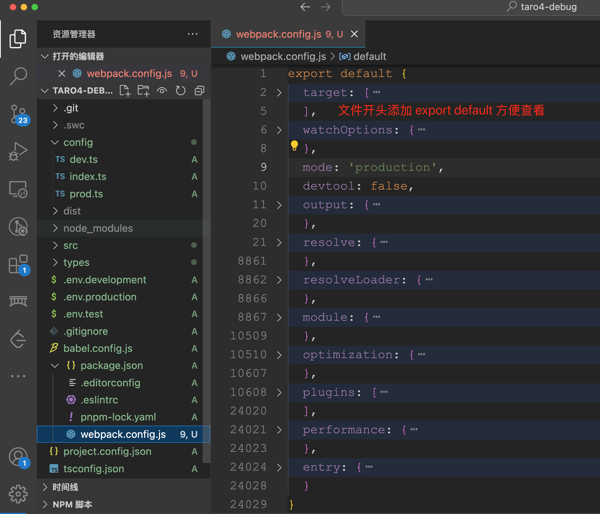

# Taro 源码系列 - 8. webpack5

## 1. 前言

大家好，我是[若川](https://ruochuan12.github.io)，欢迎关注我的[公众号：若川视野](https://mp.weixin.qq.com/s/MacNfeTPODNMLLFdzrULow)。我倾力持续组织了 3 年多[每周大家一起学习 200 行左右的源码共读活动](https://juejin.cn/post/7079706017579139102)，感兴趣的可以[点此扫码加我微信 `ruochuan02` 参与](https://juejin.cn/pin/7217386885793595453)。另外，想学源码，极力推荐关注我写的专栏[《学习源码整体架构系列》](https://juejin.cn/column/6960551178908205093)，目前是掘金关注人数（6k+人）第一的专栏，写有几十篇源码文章。

截至目前（`2024-10-28`），目前最新是 [`4.0.7`](https://github.com/NervJS/taro/releases/tag/v4.0.7)，官方`4.0`正式版本的介绍文章暂未发布。官方之前发过[Taro 4.0 Beta 发布：支持开发鸿蒙应用、小程序编译模式、Vite 编译等](https://juejin.cn/post/7330792655125463067)。

计划写一个 `taro` 源码揭秘系列，欢迎持续关注。

-   [x] [1. 揭开整个架构的入口 CLI => taro init 初始化项目的秘密](https://juejin.cn/post/7378363694939783178)
-   [x] [2. 揭开整个架构的插件系统的秘密](https://juejin.cn/post/7380195796208205824)
-   [x] [3. 每次创建新的 taro 项目（taro init）的背后原理是什么](https://juejin.cn/post/7390335741586931738)
-   [x] [4. 每次 npm run dev:weapp 开发小程序，build 编译打包是如何实现的？](https://juejin.cn/post/7403193330271682612)
-   [x] [5. 高手都在用的发布订阅机制 Events 在 Taro 中是如何实现的？](https://juejin.cn/post/7403915119448915977)
-   [x] [6. 为什么通过 Taro.xxx 能调用各个小程序平台的 API，如何设计实现的?](https://juejin.cn/post/7407648740926291968)
-   [x] [7. Taro.request 和请求响应拦截器是如何实现的](https://juejin.cn/post/7415911762128797696)
-   [ ] 等等

前面 4 篇文章都是讲述编译相关的，CLI、插件机制、初始化项目、编译构建流程。
第 5-7 篇讲述的是运行时相关的 Events、API、request 等。
第 8 篇接着继续追随第4篇 npm run dev:weapp 的脚步，继续研究 `@tarojs/webpack5-runner`。

关于克隆项目、环境准备、如何调试代码等，参考[第一篇文章-准备工作、调试](https://juejin.cn/post/7378363694939783178#heading-1)。后续文章基本不再过多赘述。

学完本文，你将学到：

```bash
1. 输出 webpack 配置
2. webpack 配置简单解读
等等
```

## 2. webpack 打包构建

```ts
// packages/taro-webpack5-runner/src/index.mini.ts

import webpack from 'webpack'
//   省略若干代码
export default async function build (appPath: string, rawConfig: IMiniBuildConfig): Promise<Stats | void> {
  const combination = new MiniCombination(appPath, rawConfig)
  await combination.make()
  //   省略若干代码

  const webpackConfig = combination.chain.toConfig()
  const config = combination.config

  return new Promise<Stats | void>((resolve, reject) => {
    if (config.withoutBuild) return

    const compiler = webpack(webpackConfig)

	// 省略若干代码...

    if (config.isWatch) {
      compiler.watch({
        aggregateTimeout: 300,
        poll: undefined
      }, callback)
    } else {
      compiler.run((err: Error, stats: Stats) => {
        compiler.close(err2 => callback(err || err2, stats))
      })
    }
  })
}
```

```js
// 重点就以下这几句
const combination = new MiniCombination(appPath, rawConfig)
await combination.make()
const webpackConfig = combination.chain.toConfig()
const compiler = webpack(webpackConfig)
```

## 3. 输出打包编译 taro 的 webpack 配置

```bash
npx @tarojs/cli@latest init taro4-debug
```

我们选择 `react、ts、pnpm、webpack5、CLI 内置默认模板` 等配置生成的项目，如下图所示：


```bash
cd taro4-debug
# 把 taro 编译微信小程序的 webpack 配置输出到了 webpack.config.js 文件
npx taro inspect -t weapp -o webpack.config.js
```

执行上面脚本后，我们就把 `taro` 编译微信小程序的 `webpack` 配置输出到了 `webpack.config.js` 文件。我们在开头追加 `export default` 方便查看整个文件。如下图所示：



[webpack 中文文档](https://webpack.docschina.org/configuration/plugins/#plugins)

[webpack 英文文档](https://webpack.js.org/configuration/plugins/#plugins)

原理

```ts
// packages/taro-cli/src/presets/commands/inspect.ts
import * as path from 'node:path'

import {
  ENTRY,
  OUTPUT_DIR,
  resolveScriptPath,
  SOURCE_DIR
} from '@tarojs/helper'
import { getPlatformType } from '@tarojs/shared'

import * as hooks from '../constant'

import type { IPluginContext } from '@tarojs/service'

export default (ctx: IPluginContext) => {
  ctx.registerCommand({
    name: 'inspect',
    optionsMap: {
      '-t, --type [typeName]': 'Build type, weapp/swan/alipay/tt/h5/quickapp/rn/qq/jd',
      '-o, --output [outputPath]': 'output config to outputPath'
    },
    synopsisList: [
      'taro inspect --type weapp',
      'taro inspect --type weapp --output inspect.config.js',
      'taro inspect --type weapp plugins',
      'taro inspect --type weapp module.rules.0'
    ],
    async fn ({ _, options }) {
      const { fs, chalk } = ctx.helper
      const platform = options.type || options.t

	  // 省略若干代码

      const isProduction = process.env.NODE_ENV === 'production'
      const outputPath = options.output || options.o
      const mode = outputPath ? 'output' : 'console'
      const extractPath = _[1]

      await ctx.applyPlugins({
        name: platform,
        opts: {
          config: {
            ...config,
            isWatch: !isProduction,
            mode: isProduction ? 'production' : 'development',
            async modifyWebpackChain (chain, webpack, data) {
              await ctx.applyPlugins({
                name: hooks.MODIFY_WEBPACK_CHAIN,
                initialVal: chain,
                opts: {
                  chain,
                  webpack,
                  data
                }
              })
            },
            onWebpackChainReady (chain) {
              const webpackConfig = chain.toConfig()
              const { toString } = chain.constructor
              const config = extractConfig(webpackConfig, extractPath)
              const res = toString(config)

              if (mode === 'console') {
                const highlight = require('cli-highlight').default
                console.info(highlight(res, { language: 'js' }))
              } else if (mode === 'output' && outputPath) {
                fs.writeFileSync(outputPath, res)
              }

              process.exit(0)
            }
          }
        }
      })
    }
  })
}

// 省略代码

```

在 `taro` 源码中，搜索 `onWebpackChainReady`，可以搜索到调用的地方。

[webpack-chain](https://github.com/neutrinojs/webpack-chain)

```ts
const Chain = require('webpack-chain');

class Chain{
    static toString(){
       console.log('string');
		return {};
    }
    toConfig(){
        console.log('toConfig');
		return {};
    }
}

function onWebpackChainReady(chain){
	const webpackConfig = chain.toConfig()
	const { toString } = chain.constructor
	const config = extractConfig(webpackConfig, extractPath)
	const res = toString(config)
	// 根据传入的模式参数，输出到控制台或者写入文件
}

// 调用
onWebpackChainReady(new Chain())
```

## 4. webpack 配置

按文档配置整理顺序

```ts
export default {
  entry: {
    app: [
      '/Users/ruochuan/git-source/github/taro4-debug/src/app.ts'
    ]
  },
  mode: 'production',
  output: {},

  module: {
  },

  resolve: {},
  resolveLoader: {},

  optimization: {},
  plugins: [],
  devtool: false,
  target: [
    'web',
    'es5'
  ],
  watchOptions: {
    aggregateTimeout: 200
  },
  performance: {
    maxEntrypointSize: 2000000
  },
}

```

### 4.1 entry 入口

入口对象是用于 webpack 查找开始构建 bundle 的地方。上下文是入口文件所处的目录的绝对路径的字符串。

```ts
export default {
  // 入口文件
  entry: {
    app: [
      '/Users/ruochuan/git-source/github/taro4-debug/src/app.ts'
    ]
  }
}
```

打包后的入口 `app.js`，如图所示：


### 4.2 mode 模式

提供 `mode` 配置选项，告知 `webpack` 使用相应模式的内置优化。

`string = 'production': 'none' | 'development' | 'production'`

```ts
export default {
  mode: 'production',
}
```

### 4.3 output 输出

`output` 位于对象最顶级键(`key`)，包括了一组选项，指示 `webpack` 如何去输出、以及在哪里输出你的「`bundle`、`asset` 和其他你所打包或使用 `webpack` 载入的任何内容」。

```ts
export default {
  output: {
    chunkLoadingGlobal: 'webpackJsonp',
    path: '/Users/ruochuan/git-source/github/taro4-debug/dist',
    publicPath: '/',
    filename: '[name].js',
    chunkFilename: '[name].js',
    globalObject: 'wx',
    enabledLibraryTypes: [],
    devtoolModuleFilenameTemplate: function () { /* omitted long function */ }
  },
}
```

### 4.4 module 模块

这些选项决定了如何处理项目中的不同类型的模块。

```ts
export default {
  // 代码有删减
  module: {
    rules: [
      /* config.module.rule('sass') */
      {
        test: /\.sass$/,
        oneOf: [
          /* config.module.rule('sass').oneOf('0') */
		  //  省略
        ]
      },
      /* config.module.rule('scss') */
      {
        test: /\.scss$/,
      },
      /* config.module.rule('less') */
      {
        test: /\.less$/,
      },
      /* config.module.rule('stylus') */
      {
        test: /\.styl(us)?$/,
      },
      /* config.module.rule('normalCss') */
      {
        test: /\.(css|qss|jxss|wxss|acss|ttss)(\?.*)?$/,
      },
	  // 还有其他配置，拆分到下文
    ]
  },
}
```

#### 4.4.1 config.module.rule('script')

```ts
/* config.module.rule('script') */
{
	test: /\.m?[tj]sx?$/i,
	include: [
		'/Users/ruochuan/git-source/github/taro4-debug/src',
		filename => /(?<=node_modules[\\/]).*taro/.test(filename)
	],
	use: [
		/* config.module.rule('script').use('babelLoader') */
		{
			loader: '/Users/ruochuan/git-source/github/taro4-debug/node_modules/.pnpm/babel-loader@8.2.1_@babel+core@7.26.0_webpack@5.91.0_@swc+core@1.3.96_/node_modules/babel-loader/lib/index.js',
			options: {
				compact: false
			}
		}
	]
},
```

#### 4.4.2 config.module.rule('template')

```ts
/* config.module.rule('template') */
{
	test: /\.(wxml|axml|ttml|qml|swan|jxml)(\?.*)?$/,
	type: 'asset/resource',
	generator: {
		filename: function () { /* omitted long function */ }
	},
	use: [
		/* config.module.rule('template').use('0') */
		{
			loader: '/Users/ruochuan/git-source/github/taro4-debug/node_modules/.pnpm/@tarojs+webpack5-runner@4.0.7_@babel+core@7.26.0_@swc+core@1.3.96_@tarojs+runtime@4.0.7_less@_emqo6xqihzcps7l7vcv6fz65aa/node_modules/@tarojs/webpack5-runner/dist/loaders/miniTemplateLoader.js',
			options: {
				buildAdapter: 'weapp'
			}
		}
	]
},
```

- @tarojs/webpack5-runner/dist/loaders/miniTemplateLoader.js

#### 4.4.3 config.module.rule('xscript')

```ts
/* config.module.rule('xscript') */
{
	test: /\.wxs$/,
	type: 'asset/resource',
	generator: {
		filename: function () { /* omitted long function */ }
	},
	use: [
		/* config.module.rule('xscript').use('0') */
		{
			loader: '/Users/ruochuan/git-source/github/taro4-debug/node_modules/.pnpm/@tarojs+webpack5-runner@4.0.7_@babel+core@7.26.0_@swc+core@1.3.96_@tarojs+runtime@4.0.7_less@_emqo6xqihzcps7l7vcv6fz65aa/node_modules/@tarojs/webpack5-runner/dist/loaders/miniXScriptLoader.js'
		}
	]
},
```

- @tarojs/webpack5-runner/dist/loaders/miniXScriptLoader.js

#### 4.4.4 config.module.rule('media')

```ts
/* config.module.rule('media') */
{
	test: /\.(mp4|webm|ogg|mp3|m4a|wav|flac|aac)(\?.*)?$/,
	type: 'asset',
	parser: {
		dataUrlCondition: {
			maxSize: 10240
		}
	},
	generator: {
		emit: undefined,
		outputPath: undefined,
		publicPath: undefined,
		filename: function () { /* omitted long function */ }
	}
},
```

#### 4.4.5 config.module.rule('font')

```ts
/* config.module.rule('font') */
{
	test: /\.(woff2?|eot|ttf|otf)(\?.*)?$/,
	type: 'asset',
	// 省略
},
```

#### 4.4.6 config.module.rule('image')

```ts

/* config.module.rule('image') */
{
	test: /\.(png|jpe?g|gif|bpm|svg|webp)(\?.*)?$/,
	type: 'asset',
	// 省略
}
```

### 4.5 resolve 解析

这些选项能设置模块如何被解析。webpack 提供合理的默认值，但是还是可能会修改一些解析的细节。关于 resolver 具体如何工作的更多解释说明，请查看[模块解析](https://webpack.docschina.org/concepts/module-resolution)。

```ts
export default {
  resolve: {
    symlinks: true,
    fallback: {
      fs: false,
      path: false
    },
    alias: {
      'regenerator-runtime': '/Users/ruochuan/git-source/github/taro4-debug/node_modules/.pnpm/regenerator-runtime@0.11.1/node_modules/regenerator-runtime/runtime-module.js',
      '@tarojs/runtime': '/Users/ruochuan/git-source/github/taro4-debug/node_modules/@tarojs/runtime/dist/index.js',
      '@tarojs/shared': '/Users/ruochuan/git-source/github/taro4-debug/node_modules/@tarojs/shared/dist/index.js',
      '@tarojs/components$': '@tarojs/plugin-platform-weapp/dist/components-react',
      'react-dom$': '@tarojs/react',
      'react-dom/client$': '@tarojs/react'
    },
    extensions: [
      '.js',
      '.jsx',
      '.ts',
      '.tsx',
      '.mjs',
      '.vue'
    ],
    mainFields: [
      'browser',
      'module',
      'jsnext:main',
      'main'
    ],
    plugins: [
      /* config.resolve.plugin('MultiPlatformPlugin') */
      new MultiPlatformPlugin(
        'described-resolve',
        'resolve',
        {
          chain: {
			// 省略
		  }
        }
      ),
      /* config.resolve.plugin('tsconfig-paths') */
      new TsconfigPathsPlugin()
    ]
  },
  resolveLoader: {
    modules: [
      'node_modules'
    ]
  },
}
```

创建 `import` 或 `require` 的别名，来确保模块引入变得更简单。[resolvealias](https://webpack.docschina.org/configuration/resolve/#resolvealias)

### 4.6 optimization 优化

从 webpack 4 开始，会根据你选择的 mode 来执行不同的优化， 不过所有的优化还是可以手动配置和重写。

```ts
export default {
  optimization: {
    sideEffects: true,
    minimize: true,
    usedExports: true,
    runtimeChunk: {
      name: 'runtime'
    },
    splitChunks: {
      chunks: 'all',
      maxInitialRequests: Infinity,
      minSize: 0,
      cacheGroups: {
        'default': false,
        defaultVendors: false,
        common: {
          name: 'common',
          minChunks: 2,
          priority: 1
        },
        vendors: {
          name: 'vendors',
          minChunks: 2,
          test: function () { /* omitted long function */ },
          priority: 10
        },
        taro: {
          name: 'taro',
          test: module => helper_1.REG_TARO_SCOPED_PACKAGE.test(module.context),
          priority: 100
        }
      }
    },
    minimizer: [
      /* config.optimization.minimizer('terserPlugin') */
      new TerserPlugin(
        {
          parallel: true,
          terserOptions: {
			// 省略...
		  }
        }
      ),
      /* config.optimization.minimizer('cssoWebpackPlugin') */
      new CssMinimizerPlugin(
        {
          test: /\.(css|scss|sass|less|styl|stylus|wxss|acss|ttss|jxss|qss)(\?.*)?$/,
          parallel: true,
          minify: function () { /* omitted long function */ },
          minimizerOptions: {
            preset: [
				// 省略...
			]
          }
        }
      )
    ]
  },
}
```

### 4.7 plugins 插件

`plugins` 选项用于以各种方式自定义 `webpack` 构建过程。`webpack` 附带了各种内置插件，可以通过 `webpack.[plugin-name]` 访问这些插件。请查看 插件页面 获取插件列表和对应文档，但请注意这只是其中一部分，社区中还有许多插件。

```ts
export default {
  plugins: [
    /* config.plugin('webpackbar') */
    new TaroWebpackBarPlugin(
      {
        reporters: [
          'basic',
          'fancy',
          {
            done: function () { /* omitted long function */ }
          }
        ],
        basic: false,
        fancy: true
      }
    ),
	// 省略，拆开放到下文
  ],
}
```

#### 4.7.1 ProvidePlugin

```ts
/* config.plugin('providerPlugin') */
new ProvidePlugin({
	window: [
		'@tarojs/runtime',
		'window'
	],
	document: [
		'@tarojs/runtime',
		'document'
	],
	navigator: [
		'@tarojs/runtime',
		'navigator'
	],
	requestAnimationFrame: [
		'@tarojs/runtime',
		'requestAnimationFrame'
	],
	cancelAnimationFrame: [
		'@tarojs/runtime',
		'cancelAnimationFrame'
	],
	Element: [
		'@tarojs/runtime',
		'TaroElement'
	],
	SVGElement: [
		'@tarojs/runtime',
		'SVGElement'
	],
	MutationObserver: [
		'@tarojs/runtime',
		'MutationObserver'
	],
	history: [
		'@tarojs/runtime',
		'history'
	],
	location: [
		'@tarojs/runtime',
		'location'
	],
	URLSearchParams: [
		'@tarojs/runtime',
		'URLSearchParams'
	],
	URL: [
		'@tarojs/runtime',
		'URL'
	]
}),
```

#### 4.7.2 DefinePlugin

```ts
/* config.plugin('definePlugin') */
new DefinePlugin({
	'process.env.FRAMEWORK': '"react"',
	'process.env.TARO_ENV': '"weapp"',
	'process.env.TARO_PLATFORM': '"mini"',
	'process.env.TARO_VERSION': '"4.0.7"',
	'process.env.SUPPORT_TARO_POLYFILL': '"disabled"',
	ENABLE_INNER_HTML: true,
	ENABLE_ADJACENT_HTML: false,
	ENABLE_SIZE_APIS: false,
	ENABLE_TEMPLATE_CONTENT: false,
	ENABLE_CLONE_NODE: false,
	ENABLE_CONTAINS: false,
	ENABLE_MUTATION_OBSERVER: false
}),
```

#### 4.7.3 MiniCssExtractPlugin

```ts
/* config.plugin('miniCssExtractPlugin') */
new MiniCssExtractPlugin({
	filename: '[name].wxss',
	chunkFilename: '[name].wxss'
}),
```

#### 4.7.4 MiniSplitChunksPlugin

```ts
/* config.plugin('miniSplitChunksPlugin') */
new MiniSplitChunksPlugin({
	exclude: undefined,
	fileType: {
		templ: '.wxml',
		style: '.wxss',
		config: '.json',
		script: '.js',
		xs: '.wxs'
	},
	combination: {
		// 省略...
	}
}),
```

#### 4.7.5 TaroMiniPlugin

```js
/* config.plugin('miniPlugin') */
new TaroMiniPlugin({
	commonChunks: [
		'runtime',
		'vendors',
		'taro',
		'common'
	],
	constantsReplaceList: {
		'process.env.FRAMEWORK': '"react"',
		'process.env.TARO_ENV': '"weapp"',
		'process.env.TARO_PLATFORM': '"mini"',
		'process.env.TARO_VERSION': '"4.0.7"',
		'process.env.SUPPORT_TARO_POLYFILL': '"disabled"',
		ENABLE_INNER_HTML: true,
		ENABLE_ADJACENT_HTML: false,
		ENABLE_SIZE_APIS: false,
		ENABLE_TEMPLATE_CONTENT: false,
		ENABLE_CLONE_NODE: false,
		ENABLE_CONTAINS: false,
		ENABLE_MUTATION_OBSERVER: false
	},
	pxTransformConfig: {
		platform: 'weapp',
		designWidth: 750,
		deviceRatio: {
			'375': 2,
			'640': 1.17,
			'750': 1,
			'828': 0.905
		}
	},
	hot: false,
	combination: {
		// 省略...
	},
	loaderMeta: {
		// 省略...
	}
})
```

```ts
// packages/taro-webpack5-runner/src/plugins/MiniPlugin.ts

export default class TaroMiniPlugin {
	// ...
}
```

### 4.8 devtool

```ts
export default {
  devtool: false,
  target: [
    'web',
    'es5'
  ],
  watchOptions: {
    aggregateTimeout: 200
  },
  performance: {
    maxEntrypointSize: 2000000
  },
}
```

`devtool` 此选项控制是否生成，以及如何生成 source map。

使用 SourceMapDevToolPlugin 进行更细粒度的配置。查看 source-map-loader 来处理已有的 source map。

### 4.9 target 构建目标

构建目标(Targets)
webpack 能够为多种环境或 target 构建编译。想要理解什么是 target 的详细信息， 请阅读 target 概念页面。

### 4.10 watchOptions 监测选项

Webpack 可以监听文件变化，当它们修改后会重新编译。这个页面介绍了如何启用这个功能，以及当 watch 无法正常运行的时候你可以做的一些调整。

### 4.11 performance 性能

这些选项可以控制 webpack 如何通知「资源(asset)和入口起点超过指定文件限制」。 此功能受到 webpack 性能评估的启发。

## 5. 总结

下一篇文章再看是如何组织成 webpack 配置的。

----

**如果看完有收获，欢迎点赞、评论、分享、收藏支持。你的支持和肯定，是我写作的动力。也欢迎提建议和交流讨论**。

作者：常以**若川**为名混迹于江湖。所知甚少，唯善学。[若川的博客](https://ruochuan12.github.io)，[github blog](https://github.com/ruochuan12/blog)，可以点个 `star` 鼓励下持续创作。

最后可以持续关注我[@若川](https://juejin.cn/user/1415826704971918)，欢迎关注我的[公众号：若川视野](https://mp.weixin.qq.com/s/MacNfeTPODNMLLFdzrULow)。我倾力持续组织了 3 年多[每周大家一起学习 200 行左右的源码共读活动](https://juejin.cn/post/7079706017579139102)，感兴趣的可以[点此扫码加我微信 `ruochuan02` 参与](https://juejin.cn/pin/7217386885793595453)。另外，想学源码，极力推荐关注我写的专栏[《学习源码整体架构系列》](https://juejin.cn/column/6960551178908205093)，目前是掘金关注人数（6k+人）第一的专栏，写有几十篇源码文章。
