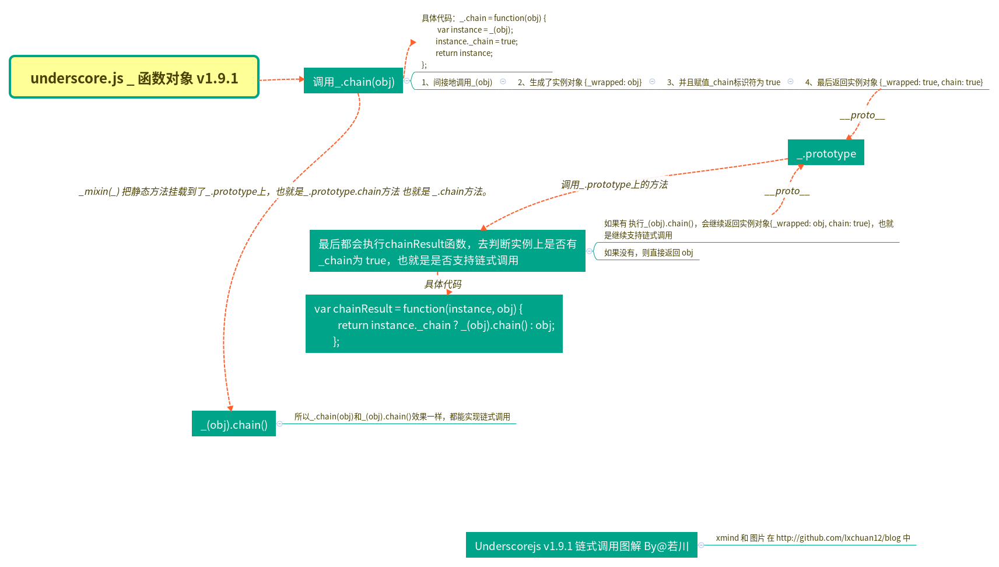

# 学习`underscore`源码整体架构，打造属于自己的函数式编程类库

>`写于2019年8月8日`

## 前言

>你好，我是[若川](https://lxchuan12.gitee.io)。这是`学习源码整体架构系列`第二篇。整体架构这词语好像有点大，姑且就算是源码整体结构吧，主要就是学习是代码整体结构，不深究其他不是主线的具体函数的实现。本篇文章学习的是打包整合后的代码，不是实际仓库中的拆分的代码。

>**要是有人说到怎么读源码，正在读文章的你能推荐我的源码系列文章，那真是太好了**。

`学习源码整体架构系列`文章如下：
>1.[学习 jQuery 源码整体架构，打造属于自己的 js 类库](https://juejin.im/post/5d39d2cbf265da1bc23fbd42)<br>
>2.[学习 underscore 源码整体架构，打造属于自己的函数式编程类库](https://juejin.im/post/5d4bf94de51d453bb13b65dc)<br>
>3.[学习 lodash 源码整体架构，打造属于自己的函数式编程类库](https://juejin.im/post/5d767e1d6fb9a06b032025ea)<br>
>4.[学习 sentry 源码整体架构，打造属于自己的前端异常监控SDK](https://juejin.im/post/5dba5a39e51d452a2378348a)<br>
>5.[学习 vuex 源码整体架构，打造属于自己的状态管理库](https://juejin.im/post/5dd4e61a6fb9a05a5c010af0)<br>
>6.[学习 axios 源码整体架构，打造属于自己的请求库](https://juejin.im/post/5df349b5518825123751ba66)<br>
>7.[学习 koa 源码的整体架构，浅析koa洋葱模型原理和co原理](https://juejin.im/post/5e69925cf265da571e262fe6)<br>
>8.[学习 redux 源码整体架构，深入理解 redux 及其中间件原理](https://juejin.im/post/5ee63b7d51882542fc6265ad)

感兴趣的读者可以点击阅读。<br>
其他源码计划中的有：[`express`](https://github.com/lxchuan12/express-analysis)、[`vue-rotuer`](https://github.com/lxchuan12/vue-router-analysis)、[`react-redux`](https://github.com/lxchuan12/react-redux-analysis) 等源码，不知何时能写完（哭泣），欢迎持续关注我（若川）。

源码类文章，一般阅读量不高。已经有能力看懂的，自己就看了。不想看，不敢看的就不会去看源码。<br>
所以我的文章，尽量写得让想看源码又不知道怎么看的读者能看懂。

虽然看过挺多`underscore.js`分析类的文章，但总感觉少点什么。这也许就是**纸上得来终觉浅，绝知此事要躬行**吧。于是决定自己写一篇学习`underscore.js`整体架构的文章。

本文章学习的版本是`v1.9.1`。
[`unpkg.com` underscore 源码地址](https://unpkg.com/underscore@1.9.1/underscore.js)

虽然很多人都没用过`underscore.js`，但看下官方文档都应该知道如何使用。

从一个官方文档`_.chain`简单例子看起：

```js
_.chain([1, 2, 3]).reverse().value();
// => [3, 2, 1]
```
看例子中可以看出，这是支持链式调用。

读者也可以顺着文章思路，自行打开下载源码进行调试，这样印象更加深刻。

## 链式调用

`_.chain` 函数源码：

```js
_.chain = function(obj) {
	var instance = _(obj);
	instance._chain = true;
	return instance;
};
```

这个函数比较简单，就是传递`obj`调用`_()`。但返回值变量竟然是`instance`实例对象。添加属性`_chain`赋值为`true`，并返回`intance`对象。但再看例子，实例对象竟然可以调用`reverse`方法，再调用`value`方法。猜测支持`OOP`（面向对象）调用。

带着问题，笔者看了下定义 `_` 函数对象的代码。

## `_` 函数对象 支持`OOP`

```js
var _ = function(obj) {
	if (obj instanceof _) return obj;
	if (!(this instanceof _)) return new _(obj);
	this._wrapped = obj;
};
```

如果参数`obj`已经是`_`的实例了，则返回`obj`。
如果`this`不是`_`的实例，则手动 `new _(obj)`;
再次`new`调用时，把`obj`对象赋值给`_wrapped`这个属性。
也就是说最后得到的实例对象是这样的结构
`{
	_wrapped: '参数obj',
}`
它的原型`_(obj).__proto__` 是 `_.prototype`;

如果对这块不熟悉的读者，可以看下以下这张图(之前写[面试官问：`JS的继承`](https://juejin.im/post/5c433e216fb9a049c15f841b)画的图)。


继续分析官方的`_.chain`例子。这个例子拆开，写成三步。

```js
var part1 = _.chain([1, 2, 3]);
var part2 = part1.reverse();
var part3 = part2.value();

// 没有后续part1.reverse()操作的情况下
console.log(part1); // {__wrapped: [1, 2, 3], _chain: true}

console.log(part2); // {__wrapped: [3, 2, 1], _chain: true}

console.log(part3); // [3, 2, 1]
```
思考问题：`reverse`本是`Array.prototype`上的方法呀。为啥支持链式调用呢。
搜索`reverse`，可以看到如下这段代码：

并将例子代入这段代码可得（怎么有种高中做数学题的既视感^_^）：

```js
_.chain([1,2,3]).reverse().value()s
```

```js
var ArrayProto = Array.prototype;
// 遍历 数组 Array.prototype 的这些方法，赋值到 _.prototype 上
_.each(['pop', 'push', 'reverse', 'shift', 'sort', 'splice', 'unshift'], function(name) {
	// 这里的`method`是 reverse 函数
	var method = ArrayProto[name];
	_.prototype[name] = function() {
	// 这里的obj 就是数组 [1, 2, 3]
	var obj = this._wrapped;
	// arguments  是参数集合，指定reverse 的this指向为obj，参数为arguments， 并执行这个函数函数。执行后 obj 则是 [3, 2, 1]
	method.apply(obj, arguments);
	if ((name === 'shift' || name === 'splice') && obj.length === 0) delete obj[0];
	// 重点在于这里 chainResult 函数。
	return chainResult(this, obj);
	};
});
```

```js
// Helper function to continue chaining intermediate results.
var chainResult = function(instance, obj) {
	// 如果实例中有_chain 为 true 这个属性，则返回实例 支持链式调用的实例对象  { _chain: true, this._wrapped: [3, 2, 1] }，否则直接返回这个对象[3, 2, 1]。
	return instance._chain ? _(obj).chain() : obj;
};
```

`if ((name === 'shift' || name === 'splice') && obj.length === 0) delete obj[0];`
提一下上面源码中的这一句，看到这句是百思不得其解。于是赶紧在`github`中搜索这句加上`""`双引号。表示全部搜索。

搜索到两个在官方库中的`ISSUE`，大概意思就是兼容IE低版本的写法。有兴趣的可以点击去看看。

[I don't understand the meaning of this sentence.](https://github.com/jashkenas/underscore/issues/2016)

[why delete obj[0]](https://github.com/jashkenas/underscore/issues/2773)

## 基于流的编程

至此就算是分析完了链式调用`_.chain()`和`_` 函数对象。这种把数据存储在实例对象`{_wrapped: '', _chain: true}` 中，`_chain`判断是否支持链式调用，来传递给下一个函数处理。这种做法叫做 **基于流的编程**。

最后数据处理完，要返回这个数据怎么办呢。`underscore`提供了一个`value`的方法。
```js
_.prototype.value = function(){
	return this._wrapped;
}
```
顺便提供了几个别名。`toJSON`、`valueOf`。
_.prototype.valueOf = _.prototype.toJSON = _.prototype.value;

还提供了 `toString`的方法。
```js
_.prototype.toString = function() {
	return String(this._wrapped);
};
```
这里的`String()` 和`new String()` 效果是一样的。
可以猜测内部实现和 `_`函数对象类似。

```js
var String = function(){
	if(!(this instanceOf String)) return new String(obj);
}
```

```js{2}
var chainResult = function(instance, obj) {
	return instance._chain ? _(obj).chain() : obj;
};
```

细心的读者会发现`chainResult`函数中的`_(obj).chain()`，是怎么实现实现链式调用的呢。

而`_(obj) `是返回的实例对象`{_wrapped: obj}`呀。怎么会有`chain()`方法，肯定有地方挂载了这个方法到`_.prototype`上或者其他操作，这就是`_.mixin()`。


## `_.mixin` 挂载所有的静态方法到 `_.prototype`， 也可以挂载自定义的方法

`_.mixin` 混入。但侵入性太强，经常容易出现覆盖之类的问题。记得之前`React`有`mixin`功能，`Vue`也有`mixin`功能。但版本迭代更新后基本都是慢慢的都不推荐或者不支持`mixin`。

```js
_.mixin = function(obj) {
	// 遍历对象上的所有方法
	_.each(_.functions(obj), function(name) {
		// 比如 chain, obj['chain'] 函数，自定义的，则赋值到_[name] 上，func 就是该函数。也就是说自定义的方法，不仅_函数对象上有，而且`_.prototype`上也有
	var func = _[name] = obj[name];
	_.prototype[name] = function() {
		// 处理的数据对象
		var args = [this._wrapped];
		// 处理的数据对象 和 arguments 结合
		push.apply(args, arguments);
		// 链式调用  chain.apply(_, args) 参数又被加上了 _chain属性，支持链式调用。
		// _.chain = function(obj) {
		//	var instance = _(obj);
		//	instance._chain = true;
		//	return instance;
		};
		return chainResult(this, func.apply(_, args));
	};
	});
	// 最终返回 _ 函数对象。
	return _;
};

_.mixin(_);
```

`_mixin(_)` 把静态方法挂载到了`_.prototype`上，也就是`_.prototype.chain`方法 也就是 `_.chain`方法。

所以`_.chain(obj)`和`_(obj).chain()`效果一样，都能实现链式调用。

关于上述的链式调用，笔者画了一张图，所谓一图胜千言。



### _.mixin 挂载自定义方法

挂载自定义方法：
举个例子：
```js
_.mixin({
	log: function(){
		console.log('哎呀，我被调用了');
	}
})
_.log() // 哎呀，我被调用了
_().log() // 哎呀，我被调用了
```

### _.functions(obj)

```js
_.functions = _.methods = function(obj) {
	var names = [];
	for (var key in obj) {
	if (_.isFunction(obj[key])) names.push(key);
	}
	return names.sort();
};
```
`_.functions` 和 `_.methods` 两个方法，遍历对象上的方法，放入一个数组，并且排序。返回排序后的数组。

### `underscore.js` 究竟在`_`和`_.prototype`挂载了多少方法和属性

再来看下`underscore.js`究竟挂载在`_函数对象`上有多少静态方法和属性，和挂载`_.prototype`上有多少方法和属性。

使用`for in`循环一试便知。看如下代码：

```js
var staticMethods = [];
var staticProperty = [];
for(var name in _){
	if(typeof _[name] === 'function'){
		staticMethods.push(name);
	}
	else{
		staticProperty.push(name);
	}
}
console.log(staticProperty); // ["VERSION", "templateSettings"] 两个
console.log(staticMethods); // ["after", "all", "allKeys", "any", "assign", ...] 138个
```

```js
var prototypeMethods = [];
var prototypeProperty = [];
for(var name in _.prototype){
	if(typeof _.prototype[name] === 'function'){
		prototypeMethods.push(name);
	}
	else{
		prototypeProperty.push(name);
	}
}
console.log(prototypeProperty); // []
console.log(prototypeMethods); // ["after", "all", "allKeys", "any", "assign", ...] 152个
```

根据这些，笔者又画了一张图`underscore.js` 原型关系图，毕竟一图胜千言。


## 整体架构概览

### 匿名函数自执行

```js
(function(){

}());
```
这样保证不污染外界环境，同时隔离外界环境，不是外界影响内部环境。

外界访问不到里面的变量和函数，里面可以访问到外界的变量，但里面定义了自己的变量，则不会访问外界的变量。
匿名函数将代码包裹在里面，防止与其他代码冲突和污染全局环境。
关于自执行函数不是很了解的读者可以参看这篇文章。
[[译] JavaScript：立即执行函数表达式（IIFE）](https://segmentfault.com/a/1190000003985390)

### root 处理

```js
var root = typeof self == 'object' && self.self === self && self ||
	typeof global == 'object' && global.global === global && global ||
	this ||
	{};
```

支持`浏览器环境`、`node`、`Web Worker`、`node vm`、`微信小程序`。

### 导出

```js
if (typeof exports != 'undefined' && !exports.nodeType) {
	if (typeof module != 'undefined' && !module.nodeType && module.exports) {
	exports = module.exports = _;
	}
	exports._ = _;
} else {
	root._ = _;
}
```

关于`root处理`和`导出`的这两段代码的解释，推荐看这篇文章[冴羽：underscore 系列之如何写自己的 underscore](https://juejin.im/post/5a0bae515188252964213855)，讲得真的太好了。笔者在此就不赘述了。
总之，`underscore.js`作者对这些处理也不是一蹴而就的，也是慢慢积累，和其他人提`ISSUE`之后不断改进的。

### 支持 `amd` 模块化规范

```js
if (typeof define == 'function' && define.amd) {
	define('underscore', [], function() {
		return _;
	});
}
```

### _.noConflict 防冲突函数

源码：
```js
// 暂存在 root 上， 执行noConflict时再赋值回来
var previousUnderscore = root._;
_.noConflict = function() {
	root._ = previousUnderscore;
	return this;
};
```
使用：
```js
<script>
var _ = '我就是我，不一样的烟火，其他可不要覆盖我呀';
</script>
<script src="https://unpkg.com/underscore@1.9.1/underscore.js">
</script>
<script>
var underscore = _.noConflict();
console.log(_); // '我就是我，不一样的烟火，其他可不要覆盖我呀'
underscore.isArray([]) // true
</script>
```

## 总结

全文根据官网提供的链式调用的例子， `_.chain([1, 2, 3]).reverse().value();`较为深入的调试和追踪代码，分析链式调用（`_.chain()` 和 `_(obj).chain()`）、`OOP`、基于流式编程、和`_.mixin(_)`在`_.prototype`挂载方法，最后整体架构分析。学习`underscore.js`整体架构，利于打造属于自己的函数式编程类库。

文章分析的源码整体结构。

```js
(function() {
	var root = typeof self == 'object' && self.self === self && self ||
		typeof global == 'object' && global.global === global && global ||
		this ||
		{};
	var previousUnderscore = root._;

	var _ = function(obj) {
	  if (obj instanceof _) return obj;
	  if (!(this instanceof _)) return new _(obj);
	  this._wrapped = obj;
	};

	if (typeof exports != 'undefined' && !exports.nodeType) {
	  if (typeof module != 'undefined' && !module.nodeType && module.exports) {
		exports = module.exports = _;
	  }
	  exports._ = _;
	} else {
	  root._ = _;
	}
	_.VERSION = '1.9.1';

	_.chain = function(obj) {
	  var instance = _(obj);
	  instance._chain = true;
	  return instance;
	};

	var chainResult = function(instance, obj) {
	  return instance._chain ? _(obj).chain() : obj;
	};

	_.mixin = function(obj) {
	  _.each(_.functions(obj), function(name) {
		var func = _[name] = obj[name];
		_.prototype[name] = function() {
		  var args = [this._wrapped];
		  push.apply(args, arguments);
		  return chainResult(this, func.apply(_, args));
		};
	  });
	  return _;
	};

	_.mixin(_);

	_.each(['pop', 'push', 'reverse', 'shift', 'sort', 'splice', 'unshift'], function(name) {
	  var method = ArrayProto[name];
	  _.prototype[name] = function() {
		var obj = this._wrapped;
		method.apply(obj, arguments);
		if ((name === 'shift' || name === 'splice') && obj.length === 0) delete obj[0];
		return chainResult(this, obj);
	  };
	});

	_.each(['concat', 'join', 'slice'], function(name) {
	  var method = ArrayProto[name];
	  _.prototype[name] = function() {
		return chainResult(this, method.apply(this._wrapped, arguments));
	  };
	});

	_.prototype.value = function() {
	  return this._wrapped;
	};

	_.prototype.valueOf = _.prototype.toJSON = _.prototype.value;

	_.prototype.toString = function() {
	  return String(this._wrapped);
	};

	if (typeof define == 'function' && define.amd) {
	  define('underscore', [], function() {
		return _;
	  });
	}
}());
```

下一篇文章可能是学习`lodash`的源码整体架构。

读者发现有不妥或可改善之处，欢迎评论指出。另外觉得写得不错，可以点赞、评论、转发，也是对笔者的一种支持。

## 推荐阅读

[underscorejs.org 官网](https://underscorejs.org/)<br>
[undersercore-analysis](https://yoyoyohamapi.gitbooks.io/undersercore-analysis/content/)<br>
[underscore 系列之如何写自己的 underscore](https://juejin.im/post/5a0bae515188252964213855)<br>

## 笔者往期文章

[面试官问：JS的继承](https://juejin.im/post/5c433e216fb9a049c15f841b)<br>
[面试官问：JS的this指向](https://juejin.im/post/5c0c87b35188252e8966c78a)<br>
[面试官问：能否模拟实现JS的call和apply方法](https://juejin.im/post/5bf6c79bf265da6142738b29)<br>
[面试官问：能否模拟实现JS的bind方法](https://juejin.im/post/5bec4183f265da616b1044d7)<br>
[面试官问：能否模拟实现JS的new操作符](https://juejin.im/post/5bde7c926fb9a049f66b8b52)<br>
[前端使用puppeteer 爬虫生成《React.js 小书》PDF并合并](https://juejin.im/post/5b86732451882542af1c8082)

## 关于

作者：常以**若川**为名混迹于江湖。前端路上 | PPT爱好者 | 所知甚少，唯善学。<br>
[若川的博客](https://lxchuan12.gitee.io)，使用`vuepress`重构了，阅读体验可能更好些<br>
[掘金专栏](https://juejin.im/user/1415826704971918/posts)，欢迎关注~<br>
[`segmentfault`前端视野专栏](https://segmentfault.com/blog/lxchuan12)，开通了**前端视野**专栏，欢迎关注~<br>
[知乎前端视野专栏](https://zhuanlan.zhihu.com/lxchuan12)，开通了**前端视野**专栏，欢迎关注~<br>
[语雀前端视野专栏](https://www.yuque.com/lxchuan12/blog)，新增语雀专栏，欢迎关注~<br>
[github blog](https://github.com/lxchuan12/blog)，相关源码和资源都放在这里，求个`star`^_^~

## 微信公众号  若川视野

可能比较有趣的微信公众号，长按扫码关注（**回复pdf获取前端优质书籍pdf**）。欢迎加笔者微信`ruochuan12`（注明来源，基本来者不拒），拉您进【前端视野交流群】，长期交流学习~


