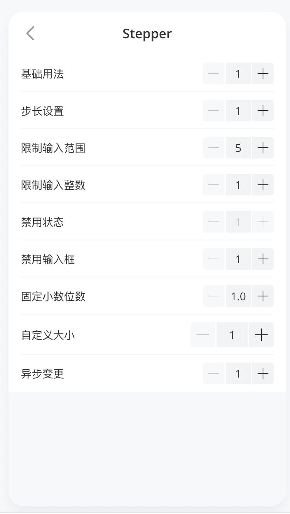
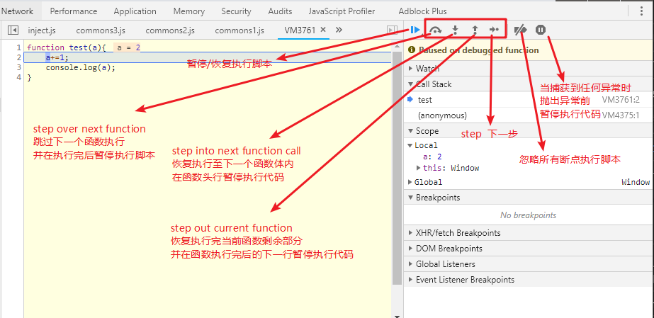
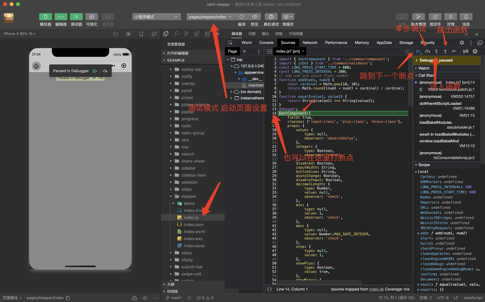

# 经常用 vant-weapp 开发小程序，却不知道如何开发一个组件？

## 1. 前言

>大家好，我是[若川](https://lxchuan12.gitee.io)。**为了能帮助到更多对源码感兴趣、想学会看源码、提升自己前端技术能力的同学**。我倾力持续组织了一年[每周大家一起学习200行左右的源码共读活动](https://juejin.cn/post/7079706017579139102)，感兴趣的可以 [点此扫码加我微信 `ruochuan02` 参与](https://juejin.cn/pin/7217386885793595453)。

想学源码，极力推荐关注我写的专栏（目前是掘金专栏关注人数第一，3.6K+人）[《学习源码整体架构系列》](https://juejin.cn/column/6960551178908205093) 包含`jQuery`、`underscore`、`lodash`、`vuex`、`sentry`、`axios`、`redux`、`koa`、`vue-devtools`、`vuex4`、`koa-compose`、`vue 3.2 发布`、`vue-this`、`create-vue`、`玩具vite`等20余篇源码文章。

## 2. stepper 步进器

>感兴趣的小伙伴，可以克隆我的仓库调试学习 [git clone https://github.com/lxchuan12/vant-weapp-analysis.git](https://github.com/lxchuan12/vant-weapp-analysis.git)。

我们开发微信小程序时经常会使用到 `stepper` 步进器组件。本文就来分析 `vant-weapp` `stepper` 步进器源码实现。

相比于原生 `JS` 等源码。我们或许更应该学习，正在使用的组件库的源码，因为有助于帮助我们写业务和写自己的组件。

[stepper 步进器文档](https://vant-contrib.gitee.io/vant-weapp/#/stepper)

stepper 图



如何开发一个微信小程序组件，可以参考官方文档。
[微信小程序自定义组件 文档](https://developers.weixin.qq.com/miniprogram/dev/framework/custom-component/)

看完本文，你将学到：

```bash
1. 学会如何通过调试看源码
2. 如何写一个微信小程序的组件
3. 学会开发一个 stepper 步进器组件
```

## 3. 克隆项目 && 调试

```bash
git clone https://github.com/vant-ui/vant-weapp.git

# 也可以克隆我的仓库
git clone https://github.com/lxchuan12/vant-weapp-analysis.git
cd vant-weapp-analysis/vant-weapp

yarn install
yarn run dev
```

由于 `yarn run dev` 没有压缩代码，本文就基于运行 `dev` 后没有压缩的代码进行讲述。

打开[微信开发者工具](https://developers.weixin.qq.com/miniprogram/dev/devtools/download.html)，把 `vant-weapp/example` 目录添加进去就可以预览示例了。注意：如果没有自己的 `appid`，可以选择测试号。

添加编译模式，启动页面为 `pages/stepper/index`，即可单独调试该页面。

关于更多 `JS` 调试，之前文章写过，[新手向：前端程序员必学基本技能——调试JS代码](https://juejin.cn/post/7030584939020042254)，这里就不赘述。

[前端容易忽略的 debugger 调试技巧](https://mp.weixin.qq.com/s/VOoDHqIo4gh3scHVNxk3lA)

附上一张图。



我们找到对应的文件，查看下组件源码的整体结构。

## 4. 整体结构

### 4.1 组件的 wxml 结构

`wxml` 部分相对简单清晰，这里就不过多讲述。

```html
<!-- vant-weapp/example/dist/stepper/index.wxml -->
<wxs src="../wxs/utils.wxs" module="utils" />
<wxs src="./index.wxs" module="computed" />

<view class="{{ utils.bem('stepper', [theme]) }} custom-class">
  <view
    wx:if="{{ showMinus }}"
    data-type="minus"
    style="{{ computed.buttonStyle({ buttonSize }) }}"
    class="minus-class {{ utils.bem('stepper__minus', { disabled: disabled || disableMinus || currentValue <= min }) }}"
    hover-class="van-stepper__minus--hover"
    hover-stay-time="70"
    bind:tap="onTap"
    bind:touchstart="onTouchStart"
    bind:touchend="onTouchEnd"
  >
    <slot name="minus" />
  </view>
  <input
    always-embed="{{ false }}"
    type="{{ integer ? 'number' : 'digit' }}"
    class="input-class {{ utils.bem('stepper__input', { disabled: disabled || disableInput }) }}"
    style="{{ computed.inputStyle({ buttonSize, inputWidth }) }}"
    value="{{ currentValue }}"
    focus="{{ focus }}"
    disabled="{{ disabled || disableInput }}"
    always-embed="{{ alwaysEmbed }}"
    bindinput="onInput"
    bind:focus="onFocus"
    bind:blur="onBlur"
  />
  <view
    wx:if="{{ showPlus }}"
    data-type="plus"
    style="{{ computed.buttonStyle({ buttonSize }) }}"
    class="plus-class {{ utils.bem('stepper__plus', { disabled: disabled || disablePlus || currentValue >= max }) }}"
    hover-class="van-stepper__plus--hover"
    hover-stay-time="70"
    bind:tap="onTap"
    bind:touchstart="onTouchStart"
    bind:touchend="onTouchEnd"
  >
    <slot name="plus" />
  </view>
</view>
```

### 4.2 组件的 JS 结构

```js
// vant-weapp/example/dist/stepper/index.js
import { VantComponent } from '../common/component';
// 不等于 undefined 也不等于 null
// export function isDef(value) {
//    return value !== undefined && value !== null;
// }
import { isDef } from '../common/validator';
// 长按开始时间
const LONG_PRESS_START_TIME = 600;
// 长按定时器
const LONG_PRESS_INTERVAL = 200;
// add num and avoid float number
// 为了解决类似 0.1 + 0.2 !== 0.3 的问题
// 0.1 + 0.2 === 0.30000000000000004
function add(num1, num2) {
    const cardinal = Math.pow(10, 10);
    return Math.round((num1 + num2) * cardinal) / cardinal;
}
// 判断两个字符串相等
function equal(value1, value2) {
    return String(value1) === String(value2);
}
debugger;
VantComponent({
    field: true,
    classes: ['input-class', 'plus-class', 'minus-class'],
    // 代码省略 props、created、methods 函数中若干内容
    props: {
        value: {
            type: null,
            observer: 'observeValue',
        },
    },
    data: {
        currentValue: '',
    },
    created() {
        this.setData({
            currentValue: this.format(this.data.value),
        });
    },
    methods: {
    },
});
```

### 4.3 VantComponent 组件

我们可以在 `vant-weapp/example/dist/stepper/index.js` 文件的 `VantComponent({})` 上方加上 `debugger;` 调试源码。按进入函数按钮。

```js
// vant-weapp/example/dist/stepper/index.js
debugger;
VantComponent({})
```

调试如图所示：



```js
// vant-weapp/example/dist/common/component.js
import { basic } from '../mixins/basic';
function mapKeys(source, target, map) {
    Object.keys(map).forEach((key) => {
        if (source[key]) {
            target[map[key]] = source[key];
        }
    });
}
function VantComponent(vantOptions) {
    const options = {};
    // Vue的写法转换成小程序写法
    mapKeys(vantOptions, options, {
        data: 'data',
        props: 'properties',
        mixins: 'behaviors',
        methods: 'methods',
        beforeCreate: 'created',
        created: 'attached',
        mounted: 'ready',
        destroyed: 'detached',
        classes: 'externalClasses',
    });
    // add default externalClasses
    // 外部样式类，也就是为什么我们可以定义 custom-class 修改样式
    options.externalClasses = options.externalClasses || [];
    options.externalClasses.push('custom-class');
    // add default behaviors
    // behaviors 是用于组件间代码共享的特性，类似于一些编程语言中的 “mixins” 或 “traits”。
    // 每个 behavior 可以包含一组属性、数据、生命周期函数和方法。
    // 组件引用它时，它的属性、数据和方法会被合并到组件中，生命周期函数也会在对应时机被调用。
    options.behaviors = options.behaviors || [];
    options.behaviors.push(basic);
    // add relations
    // 添加关系 类似 ul li 组件 List => ListItem 组件
    const { relation } = vantOptions;
    if (relation) {
        options.relations = relation.relations;
        options.behaviors.push(relation.mixin);
    }
    // 添加内置的 behavior 参考链接
    // https://developers.weixin.qq.com/miniprogram/dev/framework/custom-component/behaviors.html#wx-form-field
    // https://developers.weixin.qq.com/miniprogram/dev/component/form.html
    // map field to form-field behavior
    if (vantOptions.field) {
        options.behaviors.push('wx://form-field');
    }
    // add default options
    // 参考：https://developers.weixin.qq.com/miniprogram/dev/framework/custom-component/wxml-wxss.html
    options.options = {
        // 在组件定义时的选项中启用多 slot 支持
        multipleSlots: true,
        addGlobalClass: true,
    };
    Component(options);
}
export { VantComponent };
```

#### 4.3.1 Behavior 如同 mixins

```js
// vant-weapp/example/dist/mixins/basic.js
export const basic = Behavior({
    methods: {
        $emit(name, detail, options) {
            this.triggerEvent(name, detail, options);
        },
        set(data) {
            this.setData(data);
            return new Promise((resolve) => wx.nextTick(resolve));
        },
    },
});
```

看完了 `VantComponent` 函数。
再来看看组件的初始化。

## 5. 组件初始化

```js
VantComponent({
    field: true,
    classes: ['input-class', 'plus-class', 'minus-class'],
    // 代码省略 props、data、created、methods 函数中内容
    props: {
        value: {
            type: null,
            observer: 'observeValue',
        },
        integer: {
            type: Boolean,
            observer: 'check',
        },
        decimalLength: {
            type: Number,
            value: null,
            observer: 'check',
        },
    },
    data: {
        currentValue: '',
    },
    created() {
        this.setData({
            currentValue: this.format(this.data.value),
        });
    },
    methods: {
        // 观测 value，如果 value、currentValue 两者不相等，以格式化后的 value 值赋值给 currentValue
        observeValue() {
            const { value, currentValue } = this.data;
            if (!equal(value, currentValue)) {
                this.setData({ currentValue: this.format(value) });
            }
        },
        // 观测格式化后的 currentValue，如果两者不相等，以 value 值赋值给 currentValue
        check() {
            const val = this.format(this.data.currentValue);
            if (!equal(val, this.data.currentValue)) {
                this.setData({ currentValue: val });
            }
        },
        // filter illegal characters
        // 格式化 value
        filter(value) {
            value = String(value).replace(/[^0-9.-]/g, '');
            if (this.data.integer && value.indexOf('.') !== -1) {
                value = value.split('.')[0];
            }
            return value;
        },
        // 限制 value 的范围
        // limit value range
        format(value) {
            value = this.filter(value);
            // 处理范围 最大值和最小值
            // format range
            value = value === '' ? 0 : +value;
            value = Math.max(Math.min(this.data.max, value), this.data.min);
            // 格式化小数位数
            // format decimal
            if (isDef(this.data.decimalLength)) {
                value = value.toFixed(this.data.decimalLength);
            }
            return value;
        },
    },
});
```

接着我们继续调试加减号基础功能。

## 6. 点击加号/减号

### 6.1 onTap 函数

```html
<view
    bind:tap="onTap"
></view>
```

我们可以在 `onTap` 函数处断点，或者加上 `debugger`。

```js
onTap(event) {
    debugger;
    // data-type="minus"
    const { type } = event.currentTarget.dataset;
    this.type = type;
    this.onChange();
},
```

再在 `onChange` 函数断点，点击进入函数按钮操作。
接着我们来看 `onChange` 函数实现。

### 6.2 onChange 函数

```js
onChange() {
    const { type } = this;
    // 超出了，派发超过 overlimit 事件
    if (this.isDisabled(type)) {
        this.$emit('overlimit', type);
        return;
    }
    // 差值 step 步长
    const diff = type === 'minus' ? -this.data.step : +this.data.step;
    // 格式化
    const value = this.format(add(+this.data.currentValue, diff));
    this.emitChange(value);
    this.$emit(type);
},
```

### 6.3 isDisabled 函数

最大最小值比较等。

```js
isDisabled(type) {
    const { disabled, disablePlus, disableMinus, currentValue, max, min, } = this.data;
    if (type === 'plus') {
        return disabled || disablePlus || currentValue >= max;
    }
    return disabled || disableMinus || currentValue <= min;
},
```

### 6.4 emitChange 函数

```js
emitChange(value) {
    if (!this.data.asyncChange) {
        this.setData({ currentValue: value });
    }
    this.$emit('change', value);
},
```

如果不是异步，则直接赋值给 `currentValue`。
并且派发 `change` 事件。

断点调试在 `$emit` 函数。点击开发者工具的进入函数按钮。

### 6.5 $emit 函数

在上文提到过 `Behavior` `basic`。类似于 `vue` 中的 `$emit`。

```js
$emit(name, detail, options) {
    this.triggerEvent(name, detail, options);
},
```

[组件间通信与事件 文档](https://developers.weixin.qq.com/miniprogram/dev/framework/custom-component/events.html)

```js
<!-- 当自定义组件触发“myevent”事件时，调用“onMyEvent”方法 -->
<component-tag-name bindmyevent="onMyEvent" />
<!-- 或者可以写成 -->
<component-tag-name bind:myevent="onMyEvent" />
```

```js
<!-- 在自定义组件中 -->
<button bindtap="onTap">点击这个按钮将触发“myevent”事件</button>
```

```js
Component({
  properties: {},
  methods: {
    onTap: function(){
      var myEventDetail = {} // detail对象，提供给事件监听函数
      var myEventOption = {} // 触发事件的选项
      this.triggerEvent('myevent', myEventDetail, myEventOption)
    }
  }
})
```

我们接着看输入框输入。

## 7. 输入框输入 onInput 函数

```html
<input 
    bindinput="onInput"
/>
```

```js
onInput(event) {
    debugger;
    const { value = '' } = event.detail || {};
    // allow input to be empty
    if (value === '') {
        return;
    }
    let formatted = this.filter(value);
    // 限制最大的小数位
    // limit max decimal length
    if (isDef(this.data.decimalLength) && formatted.indexOf('.') !== -1) {
        const pair = formatted.split('.');
        formatted = `${pair[0]}.${pair[1].slice(0, this.data.decimalLength)}`;
    }
    this.emitChange(formatted);
},
```

## 8. 输入框聚焦/失焦

```html
<input
    bind:focus="onFocus"
    bind:blur="onBlur"
/>
```

`focus`、`blur`事件

```js
onFocus(event) {
    this.$emit('focus', event.detail);
},
onBlur(event) {
    const value = this.format(event.detail.value);
    this.emitChange(value);
    this.$emit('blur', Object.assign(Object.assign({}, event.detail), { value }));
},
```

## 9. 长按加号/减号 累计功能

```html
<view
    bind:touchstart="onTouchStart"
    bind:touchend="onTouchEnd"
></view>
```

```js
const LONG_PRESS_START_TIME = 600;
const LONG_PRESS_INTERVAL = 200;
longPressStep() {
    this.longPressTimer = setTimeout(() => {
        this.onChange();
        this.longPressStep();
    }, LONG_PRESS_INTERVAL);
},
onTouchStart(event) {
    debugger;
    // 如果不支持长按，默认支持
    if (!this.data.longPress) {
        return;
    }
    // 清除定时间
    clearTimeout(this.longPressTimer);
    const { type } = event.currentTarget.dataset;
    this.type = type;
    this.isLongPress = false;
    this.longPressTimer = setTimeout(() => {
        this.isLongPress = true;
        this.onChange();
        this.longPressStep();
    }, LONG_PRESS_START_TIME);
},
onTouchEnd() {
    if (!this.data.longPress) {
        return;
    }
    // 长按结束，清除定时器
    clearTimeout(this.longPressTimer);
},
```

## 10. 总结

行文至此，就基本接近尾声了。我们从 `vant-weapp` 常用的 `stepper` 步进器组件源码出发。整体源码并不长。

我们通过调试方法，分析了整体结构，`VantComponent` 函数组件的实现，还有加号减号的功能基本实现，input输入功能、聚焦失焦、还有长按累计的功能等。

或许我们自己实现，可能就写的一团糟。所以，相比于原生 `JS` 等源码。我们或许更应该学习，正在使用的组件库的源码，因为有助于帮助我们写业务和写自己的组件。

不过大多时候，学习源码或许是重要但不紧急的事情。除了公司项目外，我们可以多尝试学习开源项目的源码，从而贡献自己的代码，拥抱开源，会让自己更上一层楼。

感兴趣的小伙伴，可以克隆我的仓库调试学习 [git clone https://github.com/lxchuan12/vant-weapp-analysis.git](https://github.com/lxchuan12/vant-weapp-analysis.git)。

---

**如果看完有收获，欢迎点赞、评论、分享支持。你的支持和肯定，是我写作的动力**~

我倾力持续组织了一年[每周大家一起学习200行左右的源码共读活动](https://juejin.cn/post/7079706017579139102)，感兴趣的可以[点此扫码加我微信 `ruochuan02` 参与](https://juejin.cn/pin/7217386885793595453)。

另外，想学源码，极力推荐关注我写的专栏[《学习源码整体架构系列》](https://juejin.cn/column/6960551178908205093)，目前是掘金关注人数（4.1k+人）第一的专栏，写有20余篇源码文章。包含`jQuery`、`underscore`、`lodash`、`vuex`、`sentry`、`axios`、`redux`、`koa`、`vue-devtools`、`vuex4`、`koa-compose`、`vue 3.2 发布`、`vue-this`、`create-vue`、`玩具vite`、`create-vite` 等20余篇源码文章。

我正在参与掘金技术社区创作者签约计划招募活动，[点击链接报名投稿](https://juejin.cn/post/7112770927082864653)。
