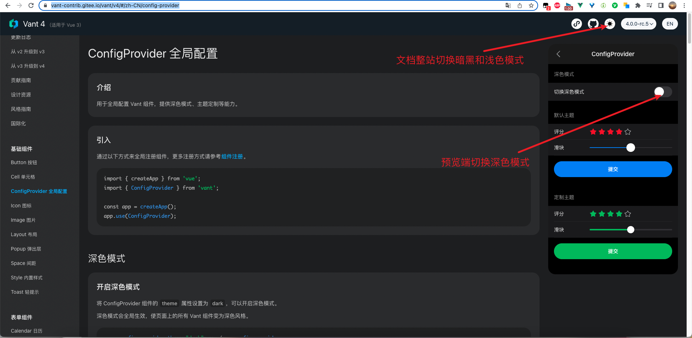
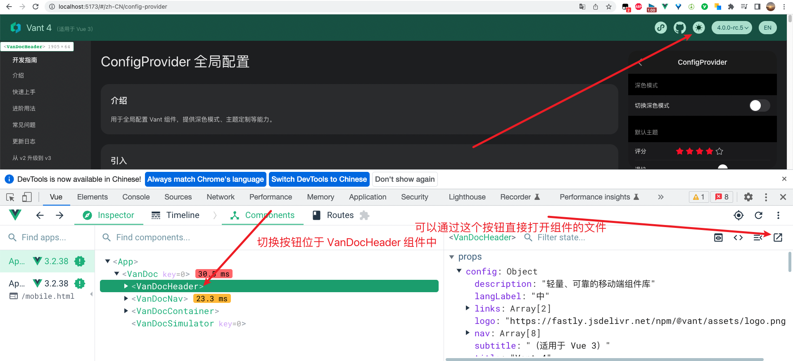

# vant 4 即将正式发布，支持暗黑主题，那么是如何实现的呢

本文为稀土掘金技术社区首发签约文章，14天内禁止转载，14天后未获授权禁止转载，侵权必究！

## 1. 前言

大家好，我是[若川](https://lxchuan12.gitee.io)。我倾力持续组织了一年[每周大家一起学习200行左右的源码共读活动](https://juejin.cn/post/7079706017579139102)，感兴趣的可以[点此扫码加我微信 `ruochuan02` 参与](https://juejin.cn/pin/7217386885793595453)。另外，想学源码，极力推荐关注我写的专栏[《学习源码整体架构系列》](https://juejin.cn/column/6960551178908205093)，目前是掘金关注人数（4.1k+人）第一的专栏，写有20余篇源码文章。

我们开发业务时经常会使用到组件库，一般来说，很多时候我们不需要关心内部实现。但是如果希望学习和深究里面的原理，这时我们可以分析自己使用的组件库实现。有哪些优雅实现、最佳实践、前沿技术等都可以值得我们借鉴。

相比于原生 `JS` 等源码。我们或许更应该学习，正在使用的组件库的源码，因为有助于帮助我们写业务和写自己的组件。

如果是 `Vue` 技术栈，开发移动端的项目，大多会选用 `vant` 组件库，目前（2022-10-24） `star` 多达 `20.3k`。我们可以挑选 `vant` 组件库学习，我会写一个[组件库源码系列专栏](https://juejin.cn/column/7140264842954276871)，欢迎大家关注。

这次我们来分析 `vant4` 新增的暗黑主题是如何实现的。文章中的 `vant4` 的版本是 `4.0.0-rc.6`。`vant` 的核心开发者是[@chenjiahan](https://github.com/chenjiahan/)，一直在更新`vant` 。预计不久后就会发布 `vant4` 正式版。

暗黑主题如图所示:



也可以打开[官方文档链接](https://vant-contrib.gitee.io/vant/v4/#/zh-CN/config-provider)，自行体验。

学完本文，你将学到：

```bash
1. 学会暗黑主题的原理和实现
2. 学会使用 vue-devtools 打开组件文件，并可以学会其原理
3. 学会 iframe postMessage 和 addEventListener 通信
4. 学会 ConfigProvider 组件 CSS 变量实现对主题的深度定制原理
5. 学会使用 @vue/babel-plugin-jsx 编写 jsx 组件
6. 等等
```

## 2. 准备工作

看一个开源项目，第一步应该是先看 [README.md](https://github.com/youzan/vant) 再看贡献文档 [github/CONTRIBUTING.md](https://github.com/youzan/vant/blob/main/.github/CONTRIBUTING.md)。

不知道大家有没有发现，很多开源项目都是英文的 `README.md`，即使刚开始明显是为面向中国开发者。再给定一个中文的 `README.md`。主要原因是因为英文是世界通用的语言。想要非中文用户参与进来，英文是必备。也就是说你开源的项目能提供英文版就提供。

### 2.1 克隆源码

贡献文档中有要求：You will need [Node.js >= 14](https://nodejs.org) and [pnpm](https://pnpm.io).

```bash
# 推荐克隆我的项目
git clone https://github.com/lxchuan12/vant-analysis
cd vant-analysis/vant

# 或者克隆官方仓库
git clone git@github.com:vant-ui/vant.git
cd vant

# Install dependencies
pnpm i

# Start development
pnpm dev
```

我们先来看 `pnpm dev` 最终执行的什么命令。

`vant` 项目使用的是 `monorepo` 结构。查看根路径下的 `package.json`。

### 2.2 pnpm dev

```json
// vant/package.json
{
    "private": true,
    "scripts": {
        "prepare": "husky install",
        "dev": "pnpm --dir ./packages/vant dev",
  },
}
```

再看 `packages/vant/package.json`。

```json
// vant/packages/vant/package.json
{
  "name": "vant",
  "version": "4.0.0-rc.6",
  "scripts": {
    "dev": "vant-cli dev",
  },
}
```

`pnpm dev` 最终执行的是：`vant-cli dev` 启动了一个服务。本文主要是讲主题切换的实现，所以我们就不深入 `vant-cli dev` 命令了。

执行 `pnpm dev` 后，命令终端输入如图所示，可以发现是使用的是目前最新版本的 `vite 3.1.8`。


这时我们打开 `http://localhost:5173/#/zh-CN/config-provider`。

## 3. 文档网站

打开后，我们可以按 `F12` 和 `vue-devtools` 来查看`vant` 官方文档的结构。如果没有安装，我们可以访问[vue-devtools 官网](https://devtools.vuejs.org/guide/installation.html)通过谷歌应用商店去安装。如果无法打开谷歌应用商店，可以通过这个[极简插件链接](https://chrome.zzzmh.cn/info/nhdogjmejiglipccpnnnanhbledajbpd) 下载安装。



mobile 端


### 3.1 通过 vue-devtools 打开组件文件


如图所示，我们通过 `vue-devtools` 打开 `VanDocSimulator` 组件文件。

>曾经在我的公众号@若川视野 [发起投票](https://mp.weixin.qq.com/s/9gYmrJLdKwJ1TCVm-MUzrA) 发现有很多人不知道这个功能。我也曾经写过文章[《据说 99% 的人不知道 vue-devtools 还能直接打开对应组件文件？本文原理揭秘》](https://juejin.cn/post/6959348263547830280)分析这个功能的原理。感兴趣的小伙伴可以查看。

我们可以看到 `vant/packages/vant-cli/site/desktop/components/Simulator.vue` 文件，主要是 `iframe` 实现的，渲染的链接是 `/mobile.html#/zh-CN`。我们也可以直接打开 [mobile 官网](https://vant-contrib.gitee.io/vant/mobile.html#/zh-CN) 验证下。

```js
// vant/packages/vant-cli/site/desktop/components/Simulator.vue
<template>
  <div :class="['van-doc-simulator', { 'van-doc-simulator-fixed': isFixed }]">
    <iframe ref="iframe" :src="src" :style="simulatorStyle" frameborder="0" />
  </div>
</template>

<script>
export default {
  name: 'VanDocSimulator',

  props: {
    src: String,
  },
  // 省略若干代码
}
```

### 3.2 desktop 端

和打开 `VanDocSimulator` 类似，我们通过 `vue-devtools` 打开 `VanDocHeader` 组件文件。

打开了文件后，我们也可以使用 [`Gitlens`](https://marketplace.visualstudio.com/items?itemName=eamodio.gitlens) 插件。根据 `git` 提交记录 [feat(@vant/cli): desktop site support dark mode](https://github.com/youzan/vant/commit/35a990ed65500311cbcafae506780dc6d3fb49fa)，查看添加暗黑模式做了哪些改动。

接着我们来看 `vant/packages/vant-cli/site/desktop/components/Header.vue` 文件。找到切换主题的代码位置如下：

模板部分

```html
// vant/packages/vant-cli/site/desktop/components/Header.vue

<template>
    <li v-if="darkModeClass" class="van-doc-header__top-nav-item">
    <a
        class="van-doc-header__link"
        target="_blank"
        @click="toggleTheme"
    >
        
    </a>
    </li>
</template>
```

JS部分

```js
// vant/packages/vant-cli/site/desktop/components/Header.vue

<script>

import { getDefaultTheme, syncThemeToChild } from '../../common/iframe-sync';

export default {
  name: 'VanDocHeader',
  data() {
    return {
      currentTheme: getDefaultTheme(),
    };
  },
    watch: {
        // 监听主题变化，移除和添加样式 class
        currentTheme: {
            handler(newVal, oldVal) {
                window.localStorage.setItem('vantTheme', newVal);
                document.documentElement.classList.remove(`van-doc-theme-${oldVal}`);
                document.documentElement.classList.add(`van-doc-theme-${newVal}`);
                // 我们也可以在这里加上debugger自行调试。
                debugger;
                // 同步到 mobile 的组件中
                syncThemeToChild(newVal);
            },
            immediate: true,
        },
    },

    methods: {
        // 切换主题
        toggleTheme() {
          this.currentTheme = this.currentTheme === 'light' ? 'dark' : 'light';
        },
    }
}

</script>
```

### 3.3 iframe 通信 iframe-sync

上文JS代码中，有 `getDefaultTheme, syncThemeToChild` 函数引自文件 `vant/packages/vant-cli/site/common/iframe-sync.js`

文件开头主要判断 `iframe` 渲染完成。

```js
// vant/packages/vant-cli/site/common/iframe-sync.js

import { ref } from 'vue';
import { config } from 'site-desktop-shared';

let queue = [];
let isIframeReady = false;

function iframeReady(callback) {
  if (isIframeReady) {
    callback();
  } else {
    queue.push(callback);
  }
}

if (window.top === window) {
  window.addEventListener('message', (event) => {
    if (event.data.type === 'iframeReady') {
      isIframeReady = true;
      queue.forEach((callback) => callback());
      queue = [];
    }
  });
} else {
  window.top.postMessage({ type: 'iframeReady' }, '*');
}
```

后半部分主要是三个函数 `getDefaultTheme`、`syncThemeToChild`、`useCurrentTheme`。

```js
// 获取默认的主题
export function getDefaultTheme() {
  const cache = window.localStorage.getItem('vantTheme');

  if (cache) {
    return cache;
  }

  const useDark =
    window.matchMedia &&
    window.matchMedia('(prefers-color-scheme: dark)').matches;
  return useDark ? 'dark' : 'light';
}

// 同步主题到 iframe 用 postMessage 通信
export function syncThemeToChild(theme) {
  const iframe = document.querySelector('iframe');
  if (iframe) {
    iframeReady(() => {
      iframe.contentWindow.postMessage(
        {
          type: 'updateTheme',
          value: theme,
        },
        '*'
      );
    });
  }
}

// 接收、使用主题色
export function useCurrentTheme() {
  const theme = ref(getDefaultTheme());

  // 接收到 updateTheme 值
  window.addEventListener('message', (event) => {
    if (event.data?.type !== 'updateTheme') {
      return;
    }

    const newTheme = event.data?.value || '';
    theme.value = newTheme;
  });

  return theme;
}
```

在项目中，我们可以可以搜索 `useCurrentTheme` 看在哪里使用的。很容易我们可以发现 `vant/packages/vant-cli/site/mobile/App.vue` 文件中有使用。

### 3.4 mobile 端

```html
// 模板部分
// vant/packages/vant-cli/site/mobile/App.vue

<template>
  <demo-nav />
  <router-view v-slot="{ Component }">
    <keep-alive>
      <demo-section>
        <component :is="Component" />
      </demo-section>
    </keep-alive>
  </router-view>
</template>
```

```js
// js 部分
// vant/packages/vant-cli/site/mobile/App.vue
<script>
import { watch } from 'vue';
import DemoNav from './components/DemoNav.vue';
import { useCurrentTheme } from '../common/iframe-sync';
import { config } from 'site-mobile-shared';

export default {
  components: { DemoNav },

  setup() {
    const theme = useCurrentTheme();

    watch(
      theme,
      (newVal, oldVal) => {
        document.documentElement.classList.remove(`van-doc-theme-${oldVal}`);
        document.documentElement.classList.add(`van-doc-theme-${newVal}`);

        const { darkModeClass, lightModeClass } = config.site;
        if (darkModeClass) {
          document.documentElement.classList.toggle(
            darkModeClass,
            newVal === 'dark'
          );
        }
        if (lightModeClass) {
          document.documentElement.classList.toggle(
            lightModeClass,
            newVal === 'light'
          );
        }
      },
      { immediate: true }
    );
  },
};
</script>

<style lang="less">
@import '../common/style/base';

body {
  min-width: 100vw;
  background-color: inherit;
}

.van-doc-theme-light {
  background-color: var(--van-doc-gray-1);
}

.van-doc-theme-dark {
  background-color: var(--van-doc-black);
}

::-webkit-scrollbar {
  width: 0;
  background: transparent;
}
</style>

```

上文阐述了浅色主题和暗黑主题的实现原理，我们接着来看如何通过 [`ConfigProvider` 组件](https://vant-contrib.gitee.io/vant/#/zh-CN/config-provider)实现主题的深度定制。

## 4. ConfigProvider 组件，深度定制主题

这个组件的文档有说明，主要就是利用 [CSS 变量](https://developer.mozilla.org/zh-CN/docs/Web/CSS/Using_CSS_custom_properties)
来实现的，具体可以查看这个链接学习。这里举个简单的例子。

```js
// html
<div id="app" style="--van-color: black;--van-background-color: pink;">hello world</div>
// css
#app {
  color: var(--van-color);
  background-color: var(--van-background-color);
}
```

可以预设写好若干变量，然后在 `style` 中修改相关变量，就能得到相应的样式，从而达到深度定制修改主题的能力。

比如：如果把 `--van-color: black;`，改成 `--van-color: red;` 则字体颜色是红色。
如果把 `--van-background-color: pink;` 改成 `--van-background-color: white;` 则背景色是白色。

`vant` 中有一次提交把之前所有的 `less` 变量，改成了原生 `css` 的 `var` 变量。[breaking change: no longer support less vars](https://github.com/youzan/vant/commit/ada5db011c676893a2917b9424be1aeafe54134b#diff-9a3dd1c100237e3a5d11553bb08a5f74144c9aecc67a995b8e608bfe2ebcf7f2)

`vant` 中 `ConfigProvider` 组件其实就是利用了这个原理。

知晓了上面的原理，我们再来简单看下 `ConfigProvider` 具体实现。

```js
// vant/packages/vant/src/config-provider/ConfigProvider.tsx
// 代码有省略
function mapThemeVarsToCSSVars(themeVars: Record<string, Numeric>) {
  const cssVars: Record<string, Numeric> = {};
  Object.keys(themeVars).forEach((key) => {
    cssVars[`--van-${kebabCase(key)}`] = themeVars[key];
  });
  // 把 backgroundColor 最终生成类似这样的属性
  // {--van-background-color: xxx}
  return cssVars;
}

export default defineComponent({
  name,

  props: configProviderProps,

  setup(props, { slots }) {
    // 完全可以在你需要的地方打上 debugger 断点
    debugger;
    const style = computed<CSSProperties | undefined>(() =>
      mapThemeVarsToCSSVars(
        extend(
          {},
          props.themeVars,
          props.theme === 'dark' ? props.themeVarsDark : props.themeVarsLight
        )
      )
    );

    // 主题变化添加和移除相应的样式类
    if (inBrowser) {
      const addTheme = () => {
        document.documentElement.classList.add(`van-theme-${props.theme}`);
      };
      const removeTheme = (theme = props.theme) => {
        document.documentElement.classList.remove(`van-theme-${theme}`);
      };

      watch(
        () => props.theme,
        (newVal, oldVal) => {
          if (oldVal) {
            removeTheme(oldVal);
          }
          addTheme();
        },
        { immediate: true }
      );

      onActivated(addTheme);
      onDeactivated(removeTheme);
      onBeforeUnmount(removeTheme);
    }

    // 插槽
    // 用于 style
    // 把 backgroundColor 最终生成类似这样的属性
    // {--van-background-color: xxx}

    return () => (
      <props.tag class={bem()} style={style.value}>
        {slots.default?.()}
      </props.tag>
    );
  },
});
```

有小伙伴可能注意到了，这感觉就是和 `react` 类似啊。其实 `vue` 也是支持 `jsx`。不过需要配置插件 [`@vue/babel-plugin-jsx`](https://www.npmjs.com/package/@vue/babel-plugin-jsx)。全局搜索这个插件，可以搜索到在 `vant-cli` 中配置了这个插件。

## 5. 总结

我们通过查看 `README.md` 和贡献文档等，知道了项目使用的 `monorepo`，`vite` 等，`pnpm i` 安装依赖，`pnpm dev` 跑项目。

我们学会了利用 `vue-devtools` 快速找到我们不那么熟悉的项目中的文件，并打开相应的文件。

通过文档桌面端和移动端的主题切换，我们学到了原来是 `iframe` 渲染的移动（mobile）端，通过 `iframe` `postMessage` 和 `addEventListener` 通信切换主题。

学会了 `ConfigProvider` 组件是利用
[CSS 变量](https://developer.mozilla.org/zh-CN/docs/Web/CSS/Using_CSS_custom_properties) 预设变量样式，来实现的定制主题。

也学会使用 [`@vue/babel-plugin-jsx`](https://www.npmjs.com/package/@vue/babel-plugin-jsx) 编写 `jsx` 组件，和写 `react` 类似。

相比于原生 `JS` 等源码。我们或许更应该学习，正在使用的组件库的源码，因为有助于帮助我们写业务和写自己的组件。开源项目通常有很多优雅实现、最佳实践、前沿技术等都可以值得我们借鉴。

如果是自己写开源项目相对耗时耗力，而且短时间很难有很大收益，很容易放弃。而刚开始可能也无法参与到开源项目中，这时我们可以先从看懂开源项目的源码做起。对于写源码来说，看懂源码相对容易。看懂源码后可以写文章分享回馈给社区，也算是对开源做出一种贡献。重要的是行动起来，学着学着就会发现很多都已经学会，锻炼了自己看源码的能力。

**如果看完有收获，欢迎点赞、评论、分享支持。你的支持和肯定，是我写作的动力**。

最后可以持续关注我@若川。这是 `vant` 第一篇文章。我会写一个[组件库源码系列专栏](https://juejin.cn/column/7140264842954276871)，欢迎大家关注。

我倾力持续组织了一年[每周大家一起学习200行左右的源码共读活动](https://juejin.cn/post/7079706017579139102)，感兴趣的可以[点此扫码加我微信 `ruochuan02` 参与](https://juejin.cn/pin/7217386885793595453)。

另外，想学源码，极力推荐关注我写的专栏[《学习源码整体架构系列》](https://juejin.cn/column/6960551178908205093)，目前是掘金关注人数（4.1k+人）第一的专栏，写有20余篇源码文章。包含`jQuery`、`underscore`、`lodash`、`vuex`、`sentry`、`axios`、`redux`、`koa`、`vue-devtools`、`vuex4`、`koa-compose`、`vue 3.2 发布`、`vue-this`、`create-vue`、`玩具vite`、`create-vite` 等20余篇源码文章。