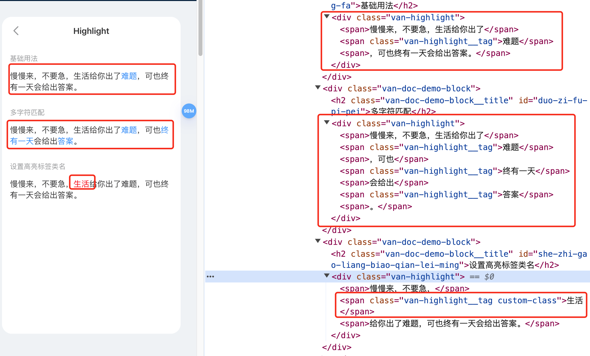

# 分析 vant4 组件库源码，写一个常用的 highlight 高亮文本的组件

## 1. 前言

大家好，我是[若川](https://ruochuan12.github.io)，欢迎 `follow` [我的 github](https://github.com/ruochuan12)。我倾力持续组织了3年多[每周大家一起学习200行左右的源码共读活动](https://juejin.cn/post/7079706017579139102)，感兴趣的可以[点此扫码加我微信 `ruochuan02` 参与](https://juejin.cn/pin/7217386885793595453)。另外，想学源码，极力推荐关注我写的专栏[《学习源码整体架构系列》](https://juejin.cn/column/6960551178908205093)，目前是掘金关注人数（5.7k+人）第一的专栏，写有20余篇源码文章。

我们开发业务时经常会使用到组件库，一般来说，很多时候我们不需要关心内部实现。但是如果希望学习和深究里面的原理，这时我们可以分析自己使用的组件库实现。有哪些优雅实现、最佳实践、前沿技术等都可以值得我们借鉴。

相比于原生 `JS` 等源码。我们或许更应该学习，正在使用的组件库的源码，因为有助于帮助我们写业务和写自己的组件。

如果是 `Vue` 技术栈，开发移动端的项目，大多会选用 `vant` 组件库，目前（2024-05-02） `star` 多达 `22.7k`，[已经正式发布 4.9.0](https://vant-ui.github.io/vant/#/zh-CN/changelog)。我们可以挑选 `vant` 组件库学习，我会写一个[vant 组件库源码系列专栏](https://juejin.cn/column/7140264842954276871)，欢迎大家关注。

**vant 组件库源码分析系列：**

- 1.[vant 4 即将正式发布，支持暗黑主题，那么是如何实现的呢](https://juejin.cn/post/7158239404484460574)
- 2.[跟着 vant 4 源码学习如何用 vue3+ts 开发一个 loading 组件，仅88行代码](https://juejin.cn/post/7160465286036979748)
- 3.[分析 vant 4 源码，如何用 vue3 + ts 开发一个瀑布流滚动加载的列表组件？](https://juejin.cn/post/7165661072785932296)
- 4.[分析 vant 4 源码，学会用 vue3 + ts 开发毫秒级渲染的倒计时组件，真是妙啊](https://juejin.cn/post/7169003604303413278)
- 5.[vant 4.0 正式发布了，分析其源码学会用 vue3 写一个图片懒加载组件！](https://juejin.cn/post/7171227417246171149)

这次我们来学习 `highlight` 高亮文本组件，[可以点此查看 `highlight` 文档体验](https://vant-ui.github.io/vant/#/zh-CN/highlight)。

学完本文，你将学到：

```bash
1. 如何学习组件库的源码
2. 如何将使用了 rsbuild 的最新版本的 vant-cli 配置开启 sourceMap 进行调试源码
3. 高亮文本组件的原理和具体实现
```

## 2. 准备工作

看一个开源项目，第一步应该是先看 [README.md](https://github.com/youzan/vant) 再看贡献文档 [github/CONTRIBUTING.md](https://github.com/youzan/vant/blob/main/.github/CONTRIBUTING.md)。

### 2.1 克隆源码 && 跑起来

You will need [Node.js >= 18](https://nodejs.org) and [pnpm](https://pnpm.io).

```bash
# 推荐克隆我的项目
git clone https://github.com/ruochuan12/vant-analysis
cd vant-analysis/vant-v4.x

# 或者克隆官方仓库
git clone git@github.com:youzan/vant.git
cd vant

# 启用 pnpm 包管理器
corepack enable

# 安装依赖，如果没安装 pnpm，可以用 npm i pnpm -g 安装，或者查看官网通过其他方式安装
pnpm i

# 启动服务
pnpm dev
```

执行 `pnpm dev` 后，这时我们打开高亮文本组件 `http://localhost:8080/#/zh-CN/highlight`。


## 3. pnpm run dev => vant-cli dev

我们从 `package.json` 脚本查看 `dev` 命令。

```json
// vant-v4.x/package.json
{
  "private": true,
  "scripts": {
    "prepare": "husky install",
    "dev": "pnpm --dir ./packages/vant dev",
  },
  "engines": {
    "pnpm": ">= 9.0.0"
  },
  "packageManager": "pnpm@9.0.6",
}
```

限制了 `pnpm` 版本大于 `9.0.0`，如果运行报版本错误，可以升级（比如：`npm i -g pnpm`） `pnpm` 版本到 `9.x`。

我们继续跟着 `vant/package.json` 脚本查看 `dev` 命令。

```json
// vant-v4.x/packages/vant/package.json
{
  "name": "vant",
  "version": "4.9.0",
    "scripts": {
        "dev": "vant-cli dev",
    }
}
```

我们继续跟着 `vant-cli/package.json` 脚本查看 `bin` 命令。

```json
// vant-v4.x/packages/vant-cli/package.json
{
  "name": "@vant/cli",
  "version": "7.0.2",
  "type": "module",
  "bin": {
    "vant-cli": "./bin.js"
  },
}
```

```js
// vant-v4.x/packages/vant-cli/bin.js
#!/usr/bin/env node
import './lib/cli.js';
```

从 `package.json` 中的 `bin` 属性可以看出，`vant-cli` 最终入口文件是`lib/cli.js`。

### 3.1 lib/cli.js

```js
// vant-v4.x/packages/vant-cli/lib/cli.js
import { Command } from 'commander';
import { cliVersion } from './index.js';
const program = new Command();
program.version(`@vant/cli ${cliVersion}`);
program
    .command('dev')
    .description('Run dev server')
    .action(async () => {
    const { dev } = await import('./commands/dev.js');
    return dev();
});
```

```js
// vant-v4.x/packages/vant-cli/lib/commands/dev.js
import { setNodeEnv } from '../common/index.js';
import { compileSite } from '../compiler/compile-site.js';
export async function dev() {
    setNodeEnv('development');
    await compileSite();
}

```

我们可以找到对应的源文件是：`vant-v4.x/packages/vant-cli/src/compiler/compile-site.ts`

我们可以从 [vant-cli changelog](https://github.com/youzan/vant/blob/main/packages/vant-cli/changelog.md) 得知，最新 `7.x` 版本，采用了 `rsbuild`，作为打包构建工具，弃用了原有的 `vite`。

这时我们查阅下 `rsbuild` 文档，找到配置 `sourceMap` 的方法。
[rsbuild output.sourceMap](https://rsbuild.dev/zh/config/output/source-map)

```js
// 类型
type SourceMap = {
  js?: RspackConfig['devtool'];
  css?: boolean;
};
// 默认值
const defaultSourceMap = {
  js: isDev ? 'cheap-module-source-map' : false,
  css: false,
};
```

可以搜索 `vant-v4.x/packages/vant-cli` 项目中的搜索 `sourceMap` 知道配置开启 `sourceMap`。

```js
// vant-v4.x/packages/vant-cli/lib/compiler/compile-site.js
const rsbuildConfig = {
  // 省略若干代码 ...
  output: {
      assetPrefix,
      // make compilation faster
      sourceMap: {
          // 代码里是js false，关闭，可以关闭，启用默认值
          // js: false,
          css: false,
      },
  }
}
```

往期讲述了很多工具函数和脚手架相关的等，所以在此不再赘述。

### 3.2 利用 demo 调试源码

带着"高亮文本是如何实现的"问题我们直接找到 `highlight demo` 文件：`vant/packages/vant/src/highlight/demo/index.vue`。为什么是这个文件，我在之前文章[跟着 vant4 源码学习如何用 vue3+ts 开发一个 loading 组件，仅88行代码](https://juejin.cn/post/7160465286036979748#heading-3)分析了其原理，感兴趣的小伙伴点击查看。这里就不赘述了。

文档上的 `demo` 图如下：


对应的是以下代码：

```js
// vant-v4.x/packages/vant/src/highlight/demo/index.vue
<script setup lang="ts">
import VanHighlight from '..';
import { useTranslate } from '../../../docs/site';

const t = useTranslate({
  'zh-CN': {
    text1: '慢慢来，不要急，生活给你出了难题，可也终有一天会给出答案。',
    keywords1: '难题',
    keywords2: ['难题', '终有一天', '答案'],
    keywords3: '生活',
    multipleKeywords: '多字符匹配',
    highlightClass: '设置高亮标签类名',
  },
  'en-US': {
    text1:
      'Take your time and be patient. Life itself will eventually answer all those questions it once raised for you.',
    keywords1: 'questions',
    keywords2: ['time', 'life', 'answer'],
    keywords3: 'life',
    multipleKeywords: 'Multiple Keywords',
    highlightClass: 'Highlight Class Name',
  },
});
</script>

<template>
  <demo-block :title="t('basicUsage')">
    <van-highlight :keywords="t('keywords1')" :source-string="t('text1')" />
  </demo-block>

  <demo-block :title="t('multipleKeywords')">
    <van-highlight :keywords="t('keywords2')" :source-string="t('text1')" />
  </demo-block>

  <demo-block :title="t('highlightClass')">
    <van-highlight
      :keywords="t('keywords3')"
      :source-string="t('text1')"
      highlight-class="custom-class"
    />
  </demo-block>
</template>
```

## 4. 高亮

我们可以看到入口文件 `src/highlight/index.ts`。

### 4.1 入口文件 src/highlight/index.ts

```ts
// vant-v4.x/packages/vant/src/highlight/index.ts
import { withInstall } from '../utils';
import _Highlight from './Highlight';

export const Highlight = withInstall(_Highlight);
export default Highlight;

export { highlightProps } from './Highlight';

export type { HighlightProps } from './Highlight';
export type { HighlightThemeVars } from './types';

declare module 'vue' {
  export interface GlobalComponents {
    vanHighlight: typeof Highlight;
  }
}
```

`withInstall` 函数在之前文章[5.1 withInstall 给组件对象添加 install 方法](https://juejin.cn/post/7160465286036979748#heading-10) 也有分析，这里就不赘述了。

我们可以继续看主文件 `src/highlight/Highlight.tsx`。

### 4.2 主文件 src/highlight/Highlight.tsx

```tsx
// vant-v4.x/packages/vant/src/highlight/Highlight.tsx
import {
  defineComponent,
  computed,
  type ExtractPropTypes,
  type PropType,
} from 'vue';

import {
  createNamespace,
  makeRequiredProp,
  makeStringProp,
  truthProp,
} from '../utils';

const [name, bem] = createNamespace('highlight');


export const highlightProps = {
  autoEscape: truthProp,
  caseSensitive: Boolean,
  highlightClass: String,
  highlightTag: makeStringProp<keyof HTMLElementTagNameMap>('span'),
  keywords: makeRequiredProp<PropType<string | string[]>>([String, Array]),
  sourceString: makeStringProp(''),
  tag: makeStringProp<keyof HTMLElementTagNameMap>('div'),
  unhighlightClass: String,
  unhighlightTag: makeStringProp<keyof HTMLElementTagNameMap>('span'),
};

export type HighlightProps = ExtractPropTypes<typeof highlightProps>;
```

上面代码主要是 `Props` 定义：

定义了一系列 `props`，包括控制高亮的各种配置项，如是否自动转义、是否区分大小写、高亮样式类名等。可直接参见文档中的`API`属性。


我们可以在这些文件，任意位置加上 `debugger` 调试源码。比如在 `renderContent` 函数 `debugger` 调试。如下图所示：


如果不知道怎么调试，可以看我之前的文章[新手向：前端程序员必学基本技能——调试JS代码](https://juejin.cn/post/7030584939020042254)

```tsx
// vant-v4.x/packages/vant/src/highlight/Highlight.tsx
export default defineComponent({
  name,

  props: highlightProps,

  setup(props) {
    const highlightChunks = computed(() => {
      // 省略这里的代码，后文讲述...
    });

    const renderContent = () => {
      const {
        // 慢慢来，不要急，生活给你出了难题，可也终有一天会给出答案。
        sourceString,
        // 高亮和非高亮样式名和标签名
        highlightClass,
        unhighlightClass,
        highlightTag,
        unhighlightTag,
      } = props;

      return highlightChunks.value.map((chunk) => {
        /**
         * highlightChunks.value 调试查看数值
          [
            {
                "start": 0,
                "end": 14,
                "highlight": false
            },
            {
                "start": 14,
                "end": 16,
                "highlight": true
            },
            {
                "start": 16,
                "end": 29,
                "highlight": false
            }
        ]
         *
        */
        const { start, end, highlight } = chunk;
        // 取出文本
        const text = sourceString.slice(start, end);

        debugger;

        if (highlight) {
          return (
            <highlightTag class={[bem('tag'), highlightClass]}>
              {text}
            </highlightTag>
          );
        }

        return <unhighlightTag class={unhighlightClass}>{text}</unhighlightTag>;
      });
    };

    return () => {
      const { tag } = props;

      return <tag class={bem()}>{renderContent()}</tag>;
    };
  },
});

```

这段代码不多，就是把高亮的文本组成一个新的标签，可以支持自定义标签和自定义`class`，渲染结果如下图所示：



**`setup` 函数：**

在 `setup` 函数中，通过 `computed` 创建了一个名为 `highlightChunks` 的 `computed` 属性，该属性根据传入的关键词在原始字符串中生成并合并高亮块。

`highlightChunks` 的计算过程包括将关键词转为正则表达式，匹配原始字符串中的位置，并生成含有高亮样式标记的块。

**`renderContent` 函数：**

`renderContent` 函数根据 `highlightChunks` 的结果在原始字符串中提取每个块并生成相应的高亮或非高亮段落。

**返回函数：**

返回一个渲染函数，在渲染时根据 `props` 中的设置，生成相应的高亮标签或非高亮标签，并以适当的方式组织和呈现高亮内容。

实现原理概述：

**提取关键词：**

首先，根据传入的关键词（可以是字符串或字符串数组），将其转换为数组形式。

**生成高亮块：**

遍历关键词数组，根据是否需要转义和是否区分大小写，生成正则表达式进行匹配，找出原始字符串中的关键词位置，并记录下每个关键词的起始和结束位置以及是否需要高亮。

**合并相邻块：**

将相邻的高亮块合并为一个块，以减少多余的高亮标记。

**生成最终内容：**

根据高亮块的信息，在原始字符串中按要求插入高亮标签或非高亮标签，形成最终的高亮内容。

通过以上这些步骤，`highlight` 组件实现了在给定字符串中根据关键词进行高亮展示的功能。

整体思路是根据关键词通过正则匹配生成高亮块，然后在渲染时根据这些块的信息插入合适的标签和自定义样式名实现高亮效果。

### 4.3 highlightChunks 函数

我们简单分析下 `setup` 中的 `highlightChunks` 函数。不用细看，可以在自己动手调试源码时再细看。

```tsx
// vant-v4.x/packages/vant/src/highlight/Highlight.tsx
const highlightChunks = computed(() => {
  const { autoEscape, caseSensitive, keywords, sourceString } = props;
  // 是否区分大小写
  const flags = caseSensitive ? 'g' : 'gi';
  // 转数组
  const _keywords = Array.isArray(keywords) ? keywords : [keywords];

  // 生成分组
  // generate chunks
  let chunks = _keywords
    .filter((keyword) => keyword)
    .reduce<Array<{ start: number; end: number; highlight: boolean }>>(
      (chunks, keyword) => {
        // 是否自动转义
        if (autoEscape) {
          keyword = keyword.replace(/[.*+?^${}()|[\]\\]/g, '\\$&');
        }

        // 用正则匹配
        const regex = new RegExp(keyword, flags);

        // 遍历关键词匹配值，最后生成 [{start, end, highlight: false}] 开始和结束值，高亮与否的数组

        let match;
        while ((match = regex.exec(sourceString))) {
          const start = match.index;
          const end = regex.lastIndex;

          if (start >= end) {
            regex.lastIndex++;
            continue;
          }

          chunks.push({
            start,
            end,
            highlight: true,
          });
        }

        return chunks;
      },
      [],
    );

  // 合并分组
  // merge chunks
  chunks = chunks
    .sort((a, b) => a.start - b.start)
    .reduce<typeof chunks>((chunks, currentChunk) => {
      const prevChunk = chunks[chunks.length - 1];

      if (!prevChunk || currentChunk.start > prevChunk.end) {
        const unhighlightStart = prevChunk ? prevChunk.end : 0;
        const unhighlightEnd = currentChunk.start;

        if (unhighlightStart !== unhighlightEnd) {
          chunks.push({
            start: unhighlightStart,
            end: unhighlightEnd,
            highlight: false,
          });
        }

        chunks.push(currentChunk);
      } else {
        prevChunk.end = Math.max(prevChunk.end, currentChunk.end);
      }

      return chunks;
    }, []);

  const lastChunk = chunks[chunks.length - 1];

  // 没有关键词时，没匹配到 chunks 的时候
  if (!lastChunk) {
    chunks.push({
      start: 0,
      end: sourceString.length,
      highlight: false,
    });
  }

  if (lastChunk && lastChunk.end < sourceString.length) {
    chunks.push({
      start: lastChunk.end,
      end: sourceString.length,
      highlight: false,
    });
  }

  return chunks;
});
```

## 5. 总结

本文主要讲述了，如何阅读组件库的源码，如何将使用了 `rsbuild` 的最新版本的 `vant-cli` 配置开启 `sourceMap` 进行调试源码。

学习了高亮文本组件的原理和具体实现。实现原理是根据关键词通过正则匹配生成高亮块，然后在渲染时根据这些块的信息插入合适的标签和自定义样式名实现高亮效果。

组件代码虽不多，但实现相对比较优雅。

学会写一个组件就能学会多个组件。建议自己多打断点调试源码，哪里不懂调试哪里。常看我的源码文章的读者都知道，我经常推荐要自己多动手调试源码，这样印象更为深刻。避免出现看懂了，但动手实践就不知道如何操作了的情况。**纸上得来终觉浅，绝知此事要躬行**。

## 6. 加源码共读交流群

作者：常以[若川](https://ruochuan12.github.io)为名混迹于江湖。所知甚少，唯善学。

最后可以持续关注我[@若川](https://juejin.cn/user/1415826704971918)，欢迎 `follow` [我的 github](https://github.com/ruochuan12)。另外，想学源码，极力推荐关注我写的专栏[《学习源码整体架构系列》](https://juejin.cn/column/6960551178908205093)，目前是掘金关注人数（5.7k+人）第一的专栏，写有20余篇源码文章。

我倾力持续组织了3年多[每周大家一起学习200行左右的源码共读活动](https://juejin.cn/post/7079706017579139102)，感兴趣的可以[点此扫码加我微信 `ruochuan02` 参与](https://juejin.cn/pin/7217386885793595453)。
